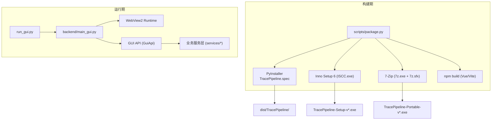
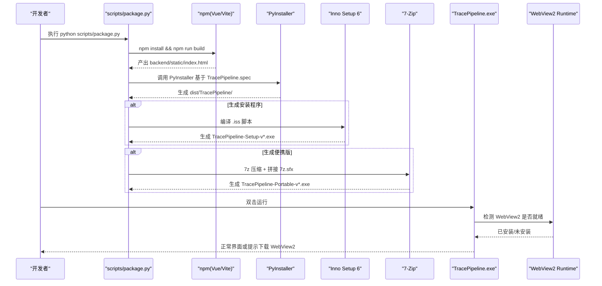
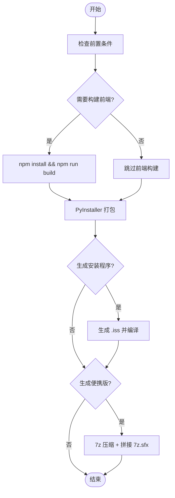
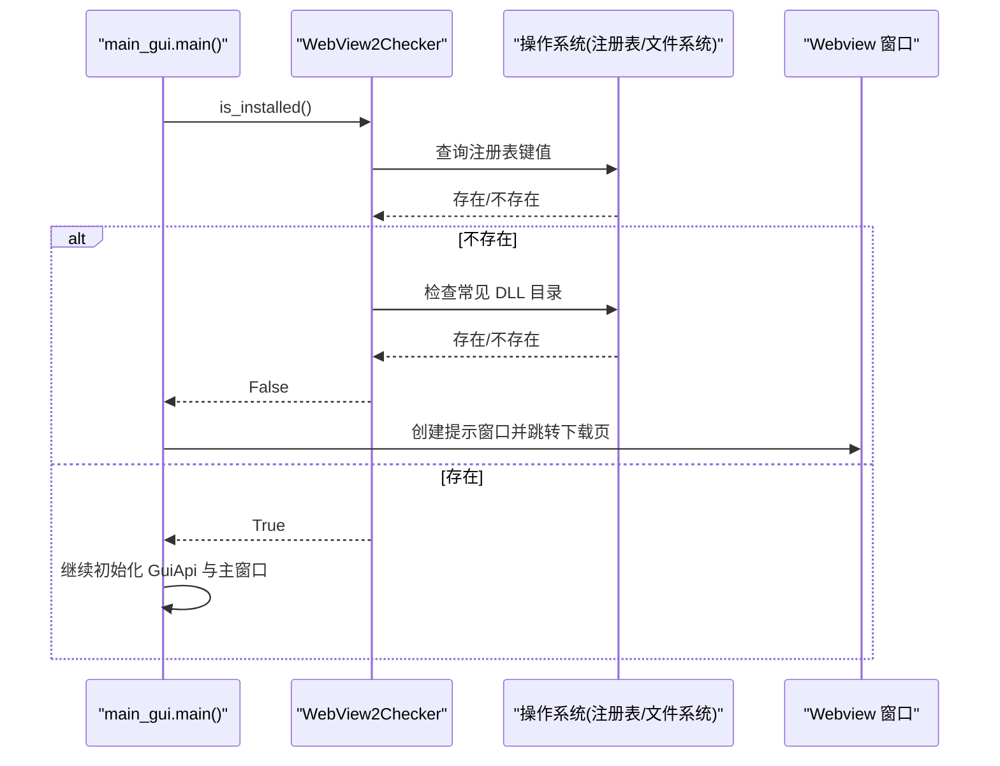
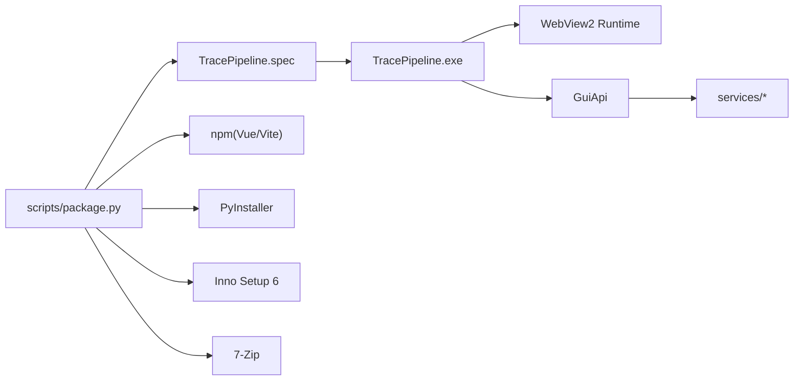

# 打包分发

<cite>
**本文引用的文件**
- [TracePipeline.spec](file://TracePipeline.spec)
- [package.py](file://scripts/package.py)
- [webview2_checker.py](file://backend/webview2_checker.py)
- [main_gui.py](file://backend/main_gui.py)
- [run_gui.py](file://run_gui.py)
- [pyproject.toml](file://pyproject.toml)
- [requirements.txt](file://requirements.txt)
- [__init__.py](file://trace_pipeline/__init__.py)
- [gui_api.py](file://backend/gui_api.py)
- [package.json](file://frontend/package.json)
</cite>

## 目录
1. [简介](#简介)
2. [项目结构](#项目结构)
3. [核心组件](#核心组件)
4. [架构总览](#架构总览)
5. [详细组件分析](#详细组件分析)
6. [依赖关系分析](#依赖关系分析)
7. [性能与体积优化](#性能与体积优化)
8. [故障排查指南](#故障排查指南)
9. [结论](#结论)
10. [附录](#附录)

## 简介
本指南面向 TracePipeline 的打包与分发，覆盖以下目标：
- PyInstaller 打包配置与依赖管理（TracePipeline.spec）
- 一键打包脚本 package.py 的实现逻辑（自动版本获取、资源打包、安装程序生成）
- WebView2 运行时检查与提示机制
- 多平台打包策略与 Windows 安装包制作、便携版生成
- Python 包依赖与前端依赖的版本控制
- 打包优化技巧（减小体积、提高启动速度）
- 发布流程与版本管理策略

## 项目结构
TracePipeline 采用“后端 GUI + 前端静态资源”的混合架构。打包产物包含：
- 独立程序文件夹（dist/TracePipeline/）
- Inno Setup 安装程序（Windows）
- 7-Zip SFX 便捷版自解压程序（Windows）

图示来源
- [package.py:306-352](file://scripts/package.py#L306-L352)
- [TracePipeline.spec:37-114](file://TracePipeline.spec#L37-L114)
- [run_gui.py:40-60](file://run_gui.py#L40-L60)
- [main_gui.py:81-206](file://backend/main_gui.py#L81-L206)

章节来源
- [package.py:1-14](file://scripts/package.py#L1-L14)
- [TracePipeline.spec:1-8](file://TracePipeline.spec#L1-L8)

## 核心组件
- 打包规格 TracePipeline.spec：定义入口、隐藏导入、数据文件、图标、输出等
- 一键打包脚本 scripts/package.py：串联前端构建、PyInstaller、Inno Setup、7-Zip
- WebView2 检测 backend/webview2_checker.py：注册表/DLL 路径探测并返回下载链接
- GUI 入口 run_gui.py 与 main_gui.py：DPI 感知、Agg 后端、窗口创建与事件处理
- 依赖声明 pyproject.toml 与 requirements.txt：Python 依赖集中管理与自动生成
- 前端依赖 frontend/package.json：Vue/Vite 生态及锁定文件保证一致性

章节来源
- [TracePipeline.spec:37-114](file://TracePipeline.spec#L37-L114)
- [package.py:117-127](file://scripts/package.py#L117-L127)
- [webview2_checker.py:35-59](file://backend/webview2_checker.py#L35-L59)
- [run_gui.py:23-33](file://run_gui.py#L23-L33)
- [main_gui.py:81-106](file://backend/main_gui.py#L81-L106)
- [pyproject.toml:35-48](file://pyproject.toml#L35-L48)
- [requirements.txt:1-17](file://requirements.txt#L1-L17)
- [package.json:1-37](file://frontend/package.json#L1-L37)

## 架构总览
下图展示从“一键打包”到“应用运行”的关键链路。

图示来源
- [package.py:281-352](file://scripts/package.py#L281-L352)
- [TracePipeline.spec:37-114](file://TracePipeline.spec#L37-L114)
- [main_gui.py:97-133](file://backend/main_gui.py#L97-L133)
- [webview2_checker.py:35-59](file://backend/webview2_checker.py#L35-L59)

## 详细组件分析

### PyInstaller 打包规格 TracePipeline.spec
- 入口与输出
  - 入口：run_gui.py
  - 输出：COLLECT 生成独立文件夹 dist/TracePipeline/
- 数据文件打包
  - 将 backend/static、reference/favicon.ico、LICENSE、THIRD_PARTY_NOTICES.txt 随包分发
- 隐藏导入
  - matplotlib Agg 后端、pywebview Windows 平台后端、scipy 子模块、trace_pipeline 各子包、第三方动态子模块
- 排除项
  - 剔除 tkinter、turtle、ensurepip、idlelib、lib2to3 等 GUI 不需要的标准库
- 图标与 EXE 选项
  - strip=True 裁剪调试信息；console=False 无控制台窗口；upx=False 默认禁用 UPX

章节来源
- [TracePipeline.spec:37-114](file://TracePipeline.spec#L37-L114)
- [TracePipeline.spec:119-150](file://TracePipeline.spec#L119-L150)

### 一键打包脚本 package.py
- 前置检查
  - venv Python、PyInstaller、图标、法律声明、Inno Setup、7-Zip 及其 SFX 模块
- 步骤 0：前端构建
  - 进入 frontend 目录执行 npm install 与 npm run build，产物放入 backend/static
- 步骤 1：PyInstaller 打包
  - 清理旧 dist/build，调用 PyInstaller 生成独立程序文件夹，复制法律声明
- 步骤 2：Inno Setup 安装程序
  - 动态生成 .iss 脚本（语言、文件、图标、任务、卸载清理），调用 ISCC 编译
- 步骤 3：7-Zip 便携版
  - 最高压缩比归档 + 拼接 7z.sfx 生成单文件自解压程序
- 自动版本获取
  - 从 trace_pipeline/__init__.py 读取 __version__，用于文件名与安装器元信息
- requirements.txt 生成
  - 从 pyproject.toml 的 dependencies 列表正则提取，避免手动维护

图示来源
- [package.py:210-278](file://scripts/package.py#L210-L278)
- [package.py:281-352](file://scripts/package.py#L281-L352)
- [package.py:355-474](file://scripts/package.py#L355-L474)
- [package.py:477-563](file://scripts/package.py#L477-L563)

章节来源
- [package.py:117-127](file://scripts/package.py#L117-L127)
- [package.py:162-206](file://scripts/package.py#L162-L206)
- [package.py:281-352](file://scripts/package.py#L281-L352)
- [package.py:355-474](file://scripts/package.py#L355-L474)
- [package.py:477-563](file://scripts/package.py#L477-L563)

### WebView2 运行时检查与安装机制
- 检测方式
  - 优先通过注册表键值判断 EdgeUpdate 客户端是否存在 pv 字段
  - 备选检查常见 DLL 目录是否存在且非空
- 未安装时的用户引导
  - 打开最小化窗口显示 HTML 提示，并提供外部浏览器下载链接
- 集成位置
  - main_gui.py 在初始化 GuiApi 前进行 WebView2 检查，缺失则提前返回

图示来源
- [webview2_checker.py:35-59](file://backend/webview2_checker.py#L35-L59)
- [main_gui.py:97-133](file://backend/main_gui.py#L97-L133)

章节来源
- [webview2_checker.py:17-32](file://backend/webview2_checker.py#L17-L32)
- [webview2_checker.py:35-59](file://backend/webview2_checker.py#L35-L59)
- [main_gui.py:97-133](file://backend/main_gui.py#L97-L133)

### GUI 入口与 DPI/后端设置
- run_gui.py
  - 设置 Per-Monitor V2 DPI 感知
  - 强制 matplotlib 使用 Agg 非交互后端，避免后台线程触发 Tkinter
  - 确保项目根加入 sys.path，再启动 backend.main_gui
- main_gui.py
  - 计算屏幕尺寸与窗口居中坐标
  - 先检查 WebView2，再创建 webview 窗口并绑定 JS API

章节来源
- [run_gui.py:23-33](file://run_gui.py#L23-L33)
- [run_gui.py:40-60](file://run_gui.py#L40-L60)
- [main_gui.py:13-61](file://backend/main_gui.py#L13-L61)
- [main_gui.py:81-106](file://backend/main_gui.py#L81-L106)

### 依赖管理与版本控制
- Python 依赖
  - 统一声明于 pyproject.toml 的 dependencies，由 package.py 自动生成 requirements.txt
  - 关键依赖包括 numpy、pandas、matplotlib、openpyxl、Pillow、scipy、shapely、pywebview、python-docx、reportlab、tqdm、xlrd
- 前端依赖
  - frontend/package.json 声明 Vue/Vite/ECharts/Element Plus 等依赖，建议提交 package-lock.json 保证可重复构建
- 版本号
  - 应用版本位于 trace_pipeline/__init__.py 的 __version__，被打包脚本与安装器共同引用

章节来源
- [pyproject.toml:35-48](file://pyproject.toml#L35-L48)
- [requirements.txt:1-17](file://requirements.txt#L1-L17)
- [package.json:14-34](file://frontend/package.json#L14-L34)
- [__init__.py](file://trace_pipeline/__init__.py#L19)
- [package.py:162-206](file://scripts/package.py#L162-L206)

### 多平台打包策略
- Windows
  - 完整流水线：前端构建 → PyInstaller → Inno Setup → 7-Zip 便携版
  - 安装程序支持中文语言包（若可用），否则回退英文
- macOS/Linux
  - 当前 spec 与打包脚本针对 Windows 优化（如 pywebview.winforms/win32/edgechromium/mshtml 隐藏导入）
  - 跨平台需调整 hiddenimports、datas、EXE/COLLECT 参数，并考虑不同平台的 WebView2 替代方案（例如系统浏览器或嵌入式 Chromium）

章节来源
- [TracePipeline.spec:43-100](file://TracePipeline.spec#L43-L100)
- [package.py:355-474](file://scripts/package.py#L355-L474)

### Windows 安装包制作与便携版生成
- 安装程序
  - 动态生成 .iss，包含文件、图标、快捷方式、卸载清理、语言选择等
  - 使用 lzma2/max 压缩与 SolidCompression 提升体积效率
- 便携版
  - 7z 以 mx=9、md=256m 最高压缩，拼接 7z.sfx 生成单文件自解压程序
  - 便捷版旁路附带 THIRD_PARTY_NOTICES.txt 便于发布页随附

章节来源
- [package.py:355-474](file://scripts/package.py#L355-L474)
- [package.py:477-563](file://scripts/package.py#L477-L563)

## 依赖关系分析
- 打包阶段
  - package.py 依赖 npm、PyInstaller、Inno Setup、7-Zip
  - TracePipeline.spec 依赖 Python 环境与 trace_pipeline 包
- 运行阶段
  - run_gui.py → main_gui.py → GuiApi → services/*
  - WebView2 为可选运行时，缺失时提供下载引导

图示来源
- [package.py:281-352](file://scripts/package.py#L281-L352)
- [TracePipeline.spec:37-114](file://TracePipeline.spec#L37-L114)
- [main_gui.py:81-106](file://backend/main_gui.py#L81-L106)

章节来源
- [package.py:210-278](file://scripts/package.py#L210-L278)
- [TracePipeline.spec:37-114](file://TracePipeline.spec#L37-L114)

## 性能与体积优化
- 启用 strip=True 裁剪二进制调试信息（已在 spec 中启用）
- 合理 excludes 剔除无用标准库（spec 已剔除 tkinter/turtle 等）
- 谨慎添加 hiddenimports，仅包含实际动态加载的子模块（spec 已列出 scipy/matplotlib/pywebview 等）
- 使用 COLLECT 而非单文件模式，减少运行时解包开销，提高启动速度
- 前端构建产物尽量精简（Vite 生产构建默认开启 tree-shaking 与压缩）
- 安装程序使用 lzma2/max 与 SolidCompression 提升压缩率
- 便携版使用 7z 最高压缩与较大字典以提升体积效果

章节来源
- [TracePipeline.spec:119-150](file://TracePipeline.spec#L119-L150)
- [TracePipeline.spec:104-114](file://TracePipeline.spec#L104-L114)
- [package.py:355-474](file://scripts/package.py#L355-L474)
- [package.py:477-563](file://scripts/package.py#L477-L563)

## 故障排查指南
- 前端构建失败
  - 确认 frontend/package.json 与 lock 文件存在，网络可达
  - 查看 npm 输出定位具体依赖或类型检查错误
- PyInstaller 打包失败
  - 检查 TracePipeline.spec 中的 hiddenimports 是否遗漏
  - 确认 ICON_FILE、法律声明文件存在
- Inno Setup 编译失败
  - 确认 ISCC.exe 路径正确，Languages 中文语言文件可用或回退英文
- 7-Zip 便捷版失败
  - 确认 7z.exe 与 7z.sfx 同时存在
- WebView2 未安装
  - 应用会弹出提示并给出官方下载链接，安装后重启即可

章节来源
- [package.py:210-278](file://scripts/package.py#L210-L278)
- [package.py:281-352](file://scripts/package.py#L281-L352)
- [package.py:355-474](file://scripts/package.py#L355-L474)
- [package.py:477-563](file://scripts/package.py#L477-L563)
- [main_gui.py:97-133](file://backend/main_gui.py#L97-L133)
- [webview2_checker.py:35-59](file://backend/webview2_checker.py#L35-L59)

## 结论
TracePipeline 的打包体系以 package.py 为核心编排器，结合 TracePipeline.spec 完成 Python 侧打包，并通过 Inno Setup 与 7-Zip 分别生成安装版与便携版。运行期通过 WebView2 检测保障用户体验。依赖集中在 pyproject.toml 与 frontend/package.json，配合自动生成与锁定文件实现稳定可复现的构建。通过 strip、excludes、COLLECT 与高压缩率工具，可在体积与启动速度之间取得良好平衡。

## 附录
- 常用命令
  - 完整打包：python scripts/package.py
  - 仅安装版：python scripts/package.py --skip-portable
  - 仅便携版：python scripts/package.py --skip-installer
  - 跳过前端构建：python scripts/package.py --skip-frontend
  - 仅生成 requirements.txt：python scripts/package.py --gen-requirements
- 环境变量覆盖
  - ISCC_EXE：指定 Inno Setup 编译器路径
  - SEVEN_ZIP：指定 7-Zip 安装路径

章节来源
- [package.py:575-698](file://scripts/package.py#L575-L698)