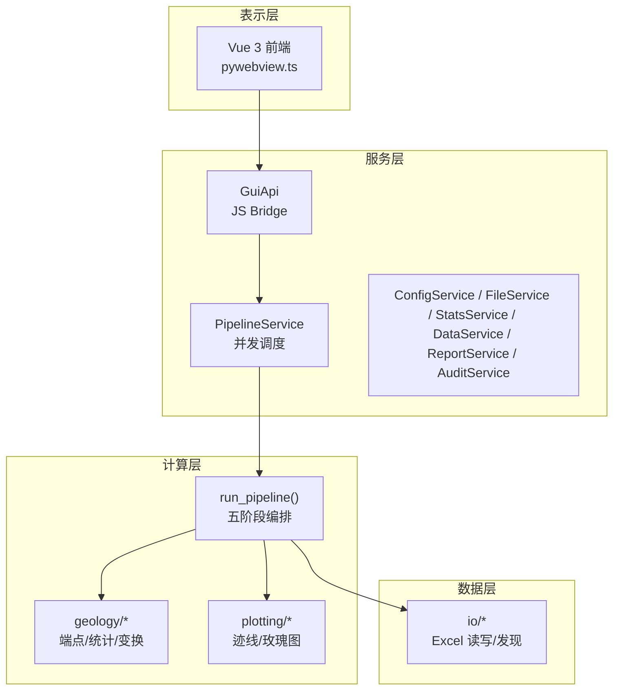
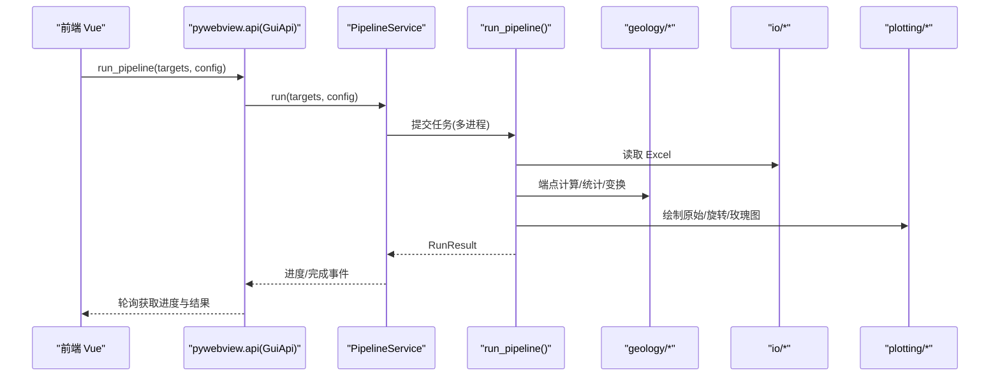
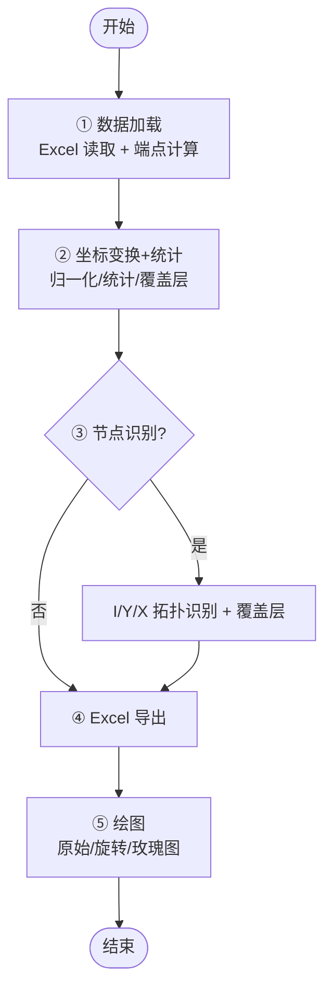
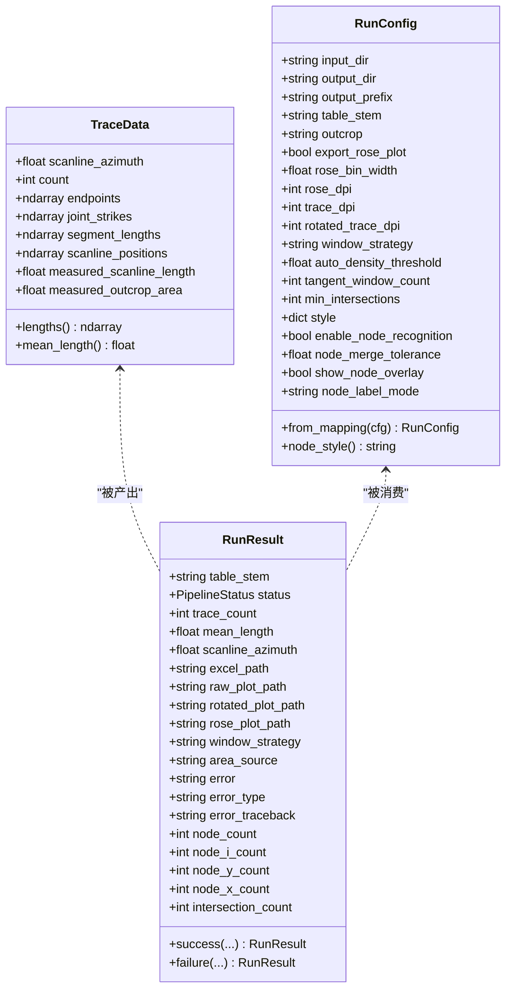
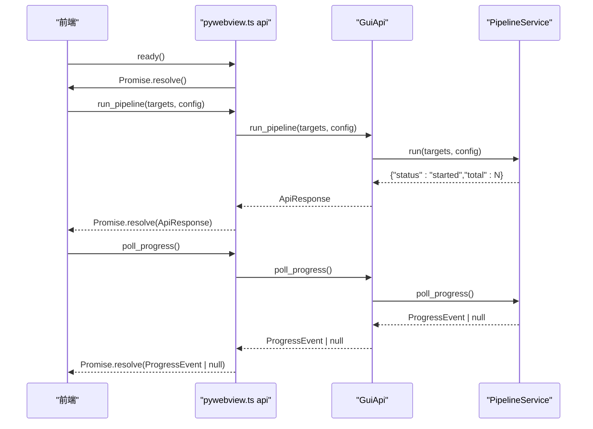
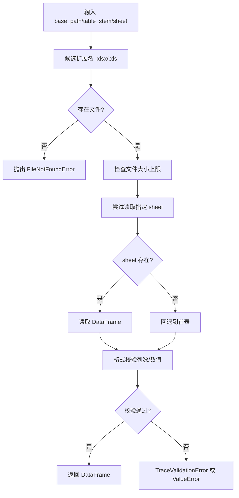
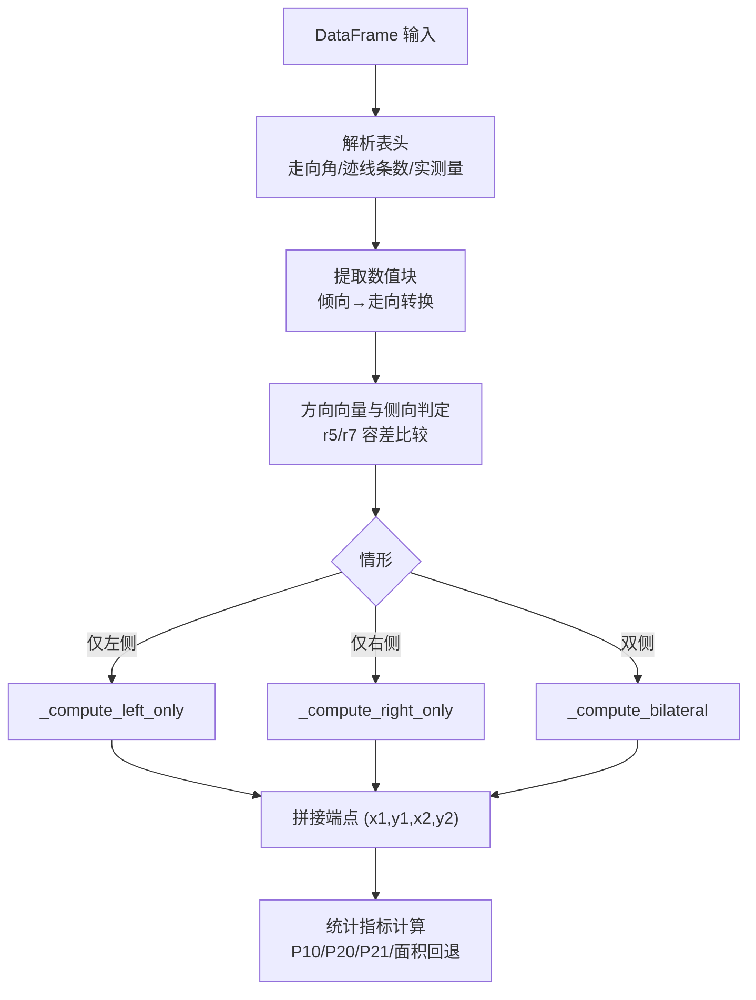
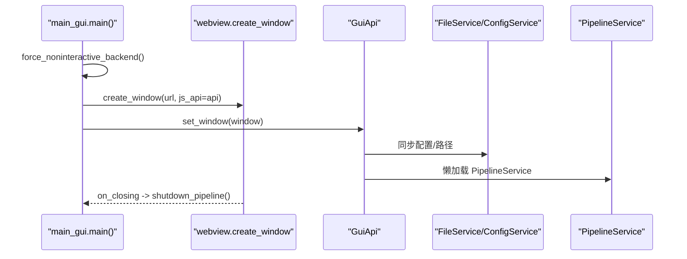
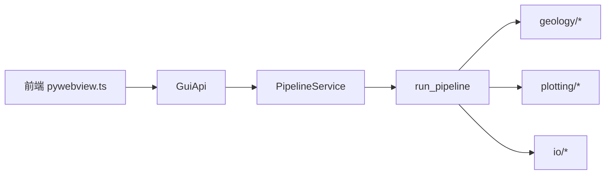

# 架构设计

<cite>
**本文引用的文件列表**
- [README.md](file://README.md)
- [pipeline.py](file://trace_pipeline/pipeline.py)
- [models.py](file://trace_pipeline/models.py)
- [config.py](file://trace_pipeline/config.py)
- [excel_reader.py](file://trace_pipeline/io/excel_reader.py)
- [endpoints.py](file://trace_pipeline/geology/endpoints.py)
- [statistics.py](file://trace_pipeline/geology/statistics.py)
- [main_gui.py](file://backend/main_gui.py)
- [gui_api.py](file://backend/gui_api.py)
- [pipeline_service.py](file://backend/services/pipeline_service.py)
- [pywebview.ts](file://frontend/src/api/pywebview.ts)
- [index.ts](file://frontend/src/types/index.ts)
- [pipeline.ts](file://frontend/src/stores/pipeline.ts)
</cite>

## 目录
1. [简介](#简介)
2. [项目结构](#项目结构)
3. [核心组件](#核心组件)
4. [架构总览](#架构总览)
5. [详细组件分析](#详细组件分析)
6. [依赖关系分析](#依赖关系分析)
7. [性能考量](#性能考量)
8. [故障排查指南](#故障排查指南)
9. [结论](#结论)
10. [附录](#附录)

## 简介
TracePipeline 是一套面向岩体节理几何特征分析的专业工具，提供 CLI 与桌面 GUI 双模式。系统采用四层架构：表示层（Vue 3 前端）、服务层（Python 后端服务）、计算层（地质算法模块）、数据层（文件 IO）。前后端通过 pywebview 的 JS Bridge 进行异步通信，后端以线程 + 多进程编排五阶段处理流水线，输出 Excel、迹线图、玫瑰图与报告等产物。

## 项目结构
- 表示层（frontend）：Vue 3 + TypeScript + Element Plus + ECharts，封装 pywebview API 调用，维护运行状态与结果展示。
- 服务层（backend）：GuiApi 作为 JS Bridge 入口，组合多个 Service（配置、文件、统计、数据、预览、报告、审计），负责并发控制、缓存与安全校验。
- 计算层（trace_pipeline）：纯函数为主的地质算法模块（端点计算、坐标变换、统计指标、节点识别、绘图），严格不可变数据模型。
- 数据层（IO）：Excel 读取/写入、文件发现、路径解析与校验。

图表来源
- [main_gui.py:81-206](file://backend/main_gui.py#L81-L206)
- [gui_api.py:52-159](file://backend/gui_api.py#L52-L159)
- [pipeline_service.py:32-100](file://backend/services/pipeline_service.py#L32-L100)
- [pipeline.py:230-474](file://trace_pipeline/pipeline.py#L230-L474)
- [endpoints.py:295-418](file://trace_pipeline/geology/endpoints.py#L295-L418)
- [statistics.py:1-200](file://trace_pipeline/geology/statistics.py#L1-L200)
- [excel_reader.py:36-106](file://trace_pipeline/io/excel_reader.py#L36-L106)

章节来源
- [README.md:169-281](file://README.md#L169-L281)

## 核心组件
- 五阶段流水线 run_pipeline：加载 → 坐标变换+统计 → 节点识别 → Excel 导出 → 绘图。
- 不可变数据模型 TraceData/RunConfig/RunResult：冻结 dataclass + NumPy writeable=False，确保计算安全与可复现。
- GuiApi：JS Bridge 入口，统一安全校验、配置同步、服务懒加载、并发锁与进度队列。
- PipelineService：后台线程 + ProcessPoolExecutor 并行执行，事件驱动轮询进度。
- Excel 读取器：自动回退 .xlsx/.xls，工作表不存在时回退首表，大小与格式校验。
- 端点计算：复数向量化，按左/右/双侧三种情形批量计算，零拷贝就地填充。
- 统计指标：P10/P20/P21、面积四级回退、自适应阈值、圆窗策略评分。

章节来源
- [pipeline.py:230-474](file://trace_pipeline/pipeline.py#L230-L474)
- [models.py:41-157](file://trace_pipeline/models.py#L41-L157)
- [gui_api.py:52-159](file://backend/gui_api.py#L52-L159)
- [pipeline_service.py:32-100](file://backend/services/pipeline_service.py#L32-L100)
- [excel_reader.py:36-106](file://trace_pipeline/io/excel_reader.py#L36-L106)
- [endpoints.py:295-418](file://trace_pipeline/geology/endpoints.py#L295-L418)
- [statistics.py:1-200](file://trace_pipeline/geology/statistics.py#L1-L200)

## 架构总览
系统边界清晰，单向依赖：表示层仅通过 JS Bridge 与服务层交互；服务层聚合业务服务并调用计算层；计算层为纯函数与无副作用模块；数据层专注 IO 与格式校验。

图表来源
- [pywebview.ts:294-336](file://frontend/src/api/pywebview.ts#L294-L336)
- [gui_api.py:388-445](file://backend/gui_api.py#L388-L445)
- [pipeline_service.py:100-200](file://backend/services/pipeline_service.py#L100-L200)
- [pipeline.py:230-474](file://trace_pipeline/pipeline.py#L230-L474)

## 详细组件分析

### 流水线 run_pipeline 五阶段
- 阶段一：数据加载
  - 定位输入文件（支持 .xlsx/.xls），基于文件签名缓存 TraceData，避免重复解析。
- 阶段二：坐标变换与统计
  - 归一化坐标、计算统计指标（P10/P20/P21）、构建圆窗覆盖层与凸包覆盖层。
- 阶段三：节点识别（可选）
  - I/Y/X 拓扑识别，生成覆盖层用于可视化叠加。
- 阶段四：Excel 导出
  - 多工作表结构化输出，包含基本信息、裂隙情况、计算数据、端点坐标、节点统计等。
- 阶段五：绘图
  - 原始迹线图、旋转迹线图、可选玫瑰图，支持 DPI 与样式覆盖。

图表来源
- [pipeline.py:230-474](file://trace_pipeline/pipeline.py#L230-L474)

章节来源
- [pipeline.py:230-474](file://trace_pipeline/pipeline.py#L230-L474)

### 不可变数据模型 TraceData/RunConfig/RunResult
- TraceData：冻结 dataclass，内部 NumPy 数组设为 writeable=False，派生属性（如 lengths）惰性计算并缓存。
- RunConfig：字段级类型强制转换与范围校验，支持 from_mapping 工厂方法。
- RunResult：成功/失败两种构造器，携带完整元数据与错误信息。

图表来源
- [models.py:41-157](file://trace_pipeline/models.py#L41-L157)
- [models.py:162-273](file://trace_pipeline/models.py#L162-L273)
- [models.py:278-352](file://trace_pipeline/models.py#L278-L352)

章节来源
- [models.py:41-157](file://trace_pipeline/models.py#L41-L157)
- [models.py:162-273](file://trace_pipeline/models.py#L162-L273)
- [models.py:278-352](file://trace_pipeline/models.py#L278-L352)

### 前后端异步通信协议（pywebview）
- 前端通过 pywebview.ts 暴露 api 对象，所有方法均为 async Promise。
- waitForApi 监听 pywebviewready 事件，确保后端就绪后再放行调用；开发环境使用 mockApi 返回假数据。
- 后端 GuiApi 将 Python 方法暴露给前端，包括配置、扫描、运行流水线、轮询进度、结果查询、图片与日志访问、窗口控制等。

图表来源
- [pywebview.ts:150-185](file://frontend/src/api/pywebview.ts#L150-L185)
- [pywebview.ts:294-336](file://frontend/src/api/pywebview.ts#L294-L336)
- [gui_api.py:388-445](file://backend/gui_api.py#L388-L445)
- [pipeline_service.py:66-99](file://backend/services/pipeline_service.py#L66-L99)

章节来源
- [pywebview.ts:150-185](file://frontend/src/api/pywebview.ts#L150-L185)
- [pywebview.ts:294-336](file://frontend/src/api/pywebview.ts#L294-L336)
- [gui_api.py:388-445](file://backend/gui_api.py#L388-L445)
- [pipeline_service.py:66-99](file://backend/services/pipeline_service.py#L66-L99)

### 数据层：Excel 读取与校验
- 自动选择 .xlsx 优先，缺失则回退 .xls；目标 sheet 不存在时回退首表。
- 文件大小上限检查，前若干行数值占比检测，列数与数据类型校验。
- 异常分类：TraceValidationError（数据格式错误直接上抛）与 ValueError（工作表名不存在走回退逻辑）。

图表来源
- [excel_reader.py:36-106](file://trace_pipeline/io/excel_reader.py#L36-L106)
- [excel_reader.py:109-126](file://trace_pipeline/io/excel_reader.py#L109-L126)
- [excel_reader.py:128-169](file://trace_pipeline/io/excel_reader.py#L128-L169)

章节来源
- [excel_reader.py:36-106](file://trace_pipeline/io/excel_reader.py#L36-L106)
- [excel_reader.py:109-126](file://trace_pipeline/io/excel_reader.py#L109-L126)
- [excel_reader.py:128-169](file://trace_pipeline/io/excel_reader.py#L128-L169)

### 计算层：端点计算与统计
- 端点计算：解析表头（走向角、迹线条数、可选实测量），提取数值矩阵，倾向转走向，按 r5/r7 判定左/右/双侧三种情形，复数向量批量计算端点坐标。
- 统计指标：估计测线长度、局部坐标系投影、自适应阈值、面积四级回退（实测→凸包→缓冲凸包→圆窗等效）、P10/P20/P21 计算与一致性校验。

图表来源
- [endpoints.py:295-418](file://trace_pipeline/geology/endpoints.py#L295-L418)
- [statistics.py:1-200](file://trace_pipeline/geology/statistics.py#L1-L200)

章节来源
- [endpoints.py:295-418](file://trace_pipeline/geology/endpoints.py#L295-L418)
- [statistics.py:1-200](file://trace_pipeline/geology/statistics.py#L1-L200)

### 服务层：GUI 启动与桥接
- main_gui.py：初始化非交互式 matplotlib 后端，检查 WebView2 Runtime，居中创建窗口，绑定 GuiApi，注册关闭事件优雅等待后台任务。
- gui_api.py：懒加载服务实例，路径安全校验，配置同步，重资源操作加锁，输出目录变更检测，进度队列与审计日志。

图表来源
- [main_gui.py:81-206](file://backend/main_gui.py#L81-L206)
- [gui_api.py:64-110](file://backend/gui_api.py#L64-L110)
- [gui_api.py:112-159](file://backend/gui_api.py#L112-L159)

章节来源
- [main_gui.py:81-206](file://backend/main_gui.py#L81-L206)
- [gui_api.py:64-110](file://backend/gui_api.py#L64-L110)
- [gui_api.py:112-159](file://backend/gui_api.py#L112-L159)

### 前端状态管理
- pipeline.ts：管理运行状态、进度与结果列表，持久化用户上次运行的节点识别/玫瑰图偏好到 localStorage。
- types/index.ts：定义前后端交互的数据结构（PipelineResult、StatsData、ComparisonRow 等），保证类型一致。

章节来源
- [pipeline.ts:22-55](file://frontend/src/stores/pipeline.ts#L22-L55)
- [index.ts:10-98](file://frontend/src/types/index.ts#L10-L98)

## 依赖关系分析
- 层间依赖：表示层 → 服务层 → 计算层 → 数据层，单向依赖，便于测试与替换。
- 关键耦合点：
  - GuiApi 与 PipelineService：并发与进度队列。
  - run_pipeline 与 geology/*、plotting/*、io/*：功能解耦，接口清晰。
  - 前端 pywebview.ts 与后端 GuiApi：方法签名强类型约束（TypeScript 与 Python 注解）。

图表来源
- [pywebview.ts:294-336](file://frontend/src/api/pywebview.ts#L294-L336)
- [gui_api.py:388-445](file://backend/gui_api.py#L388-L445)
- [pipeline_service.py:100-200](file://backend/services/pipeline_service.py#L100-L200)
- [pipeline.py:230-474](file://trace_pipeline/pipeline.py#L230-L474)

章节来源
- [pywebview.ts:294-336](file://frontend/src/api/pywebview.ts#L294-L336)
- [gui_api.py:388-445](file://backend/gui_api.py#L388-L445)
- [pipeline_service.py:100-200](file://backend/services/pipeline_service.py#L100-L200)
- [pipeline.py:230-474](file://trace_pipeline/pipeline.py#L230-L474)

## 性能考量
- 向量化优先：端点计算与统计大量使用 NumPy 广播与复数运算，避免 for 循环。
- 惰性导入与预热：matplotlib 字体与样式在首次使用时预热，减少首帧延迟。
- 缓存体系：
  - 文件扫描 TTLCache + 目录变更检测。
  - 统计数据 LRU（SHA-256 配置指纹）。
  - 图片与缩略图 LRU（容量与内存上限）。
  - Excel 数据 TTLCache。
- 并行执行：ProcessPoolExecutor 多进程并行，workers 由 CPU 核心数与配置决定。
- 结果缓存：run_pipeline 对 TraceData 按文件签名缓存，避免重复解析。

[本节为通用指导，不直接分析具体文件]

## 故障排查指南
- 常见错误与友好提示：
  - PermissionError：文件被占用或权限不足，提示关闭 Excel/WPS 后重试。
  - FileNotFoundError：输入文件不存在，提示检查路径。
  - JSON 解析失败：配置文件格式错误，提示修正 JSON。
  - 工作表不存在：自动回退首表，记录调试日志。
- 日志与追踪：
  - 结构化 JSON Lines 日志，按日轮转，request_id 全链路追踪。
  - 审计日志记录关键操作（配置修改、报告生成等）。
- 诊断建议：
  - 查看 get_logs 接口获取最近日志。
  - 检查 output 目录变更检测是否触发缓存失效。
  - 确认 WebView2 Runtime 已安装，否则引导下载页面。

章节来源
- [pipeline.py:450-474](file://trace_pipeline/pipeline.py#L450-L474)
- [config.py:110-145](file://trace_pipeline/config.py#L110-L145)
- [excel_reader.py:80-106](file://trace_pipeline/io/excel_reader.py#L80-L106)
- [gui_api.py:630-636](file://backend/gui_api.py#L630-L636)

## 结论
TracePipeline 通过严格的四层分层与不可变数据模型，实现了高内聚、低耦合的可维护系统。前后端通过 pywebview 的 JS Bridge 实现类型安全的异步通信，后端以线程+多进程编排五阶段流水线，兼顾性能与稳定性。完善的错误处理、日志与审计机制提升了可观测性与可运维性。未来可扩展点包括新增统计指标、新的圆窗策略、更多可视化覆盖层与报告模板。

## 附录
- 配置项与默认值参考 README 中的配置详表。
- 打包流程与工具链见 README 打包分发章节。

章节来源
- [README.md:418-504](file://README.md#L418-L504)
- [README.md:749-779](file://README.md#L749-L779)