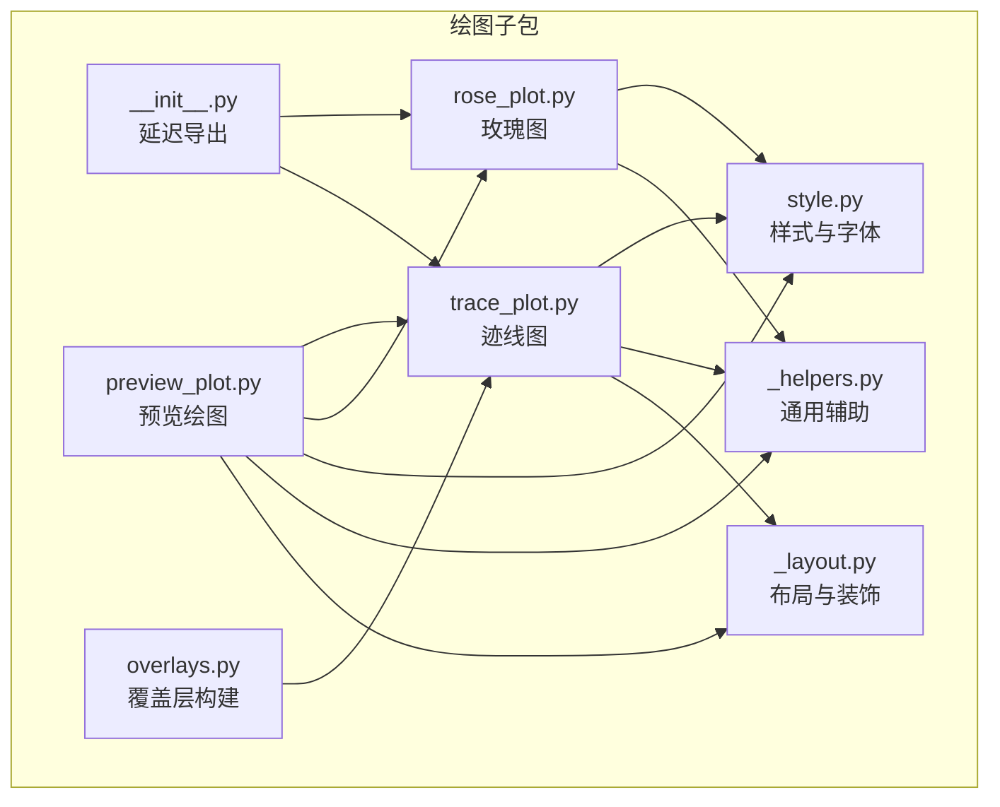
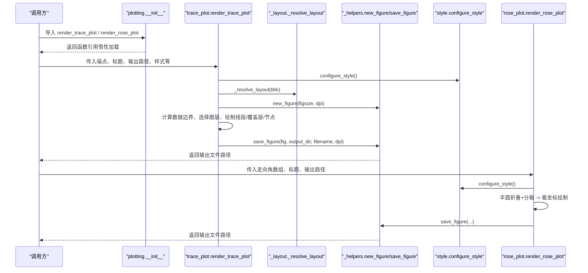
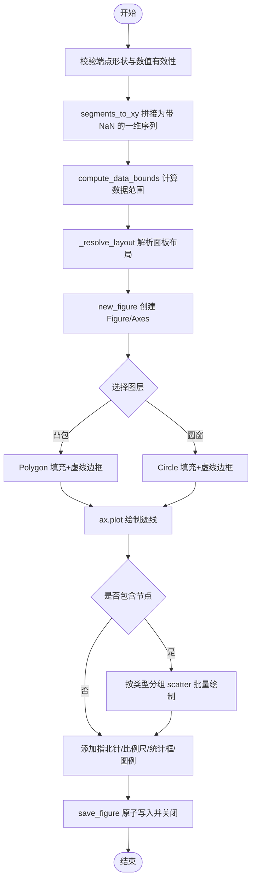
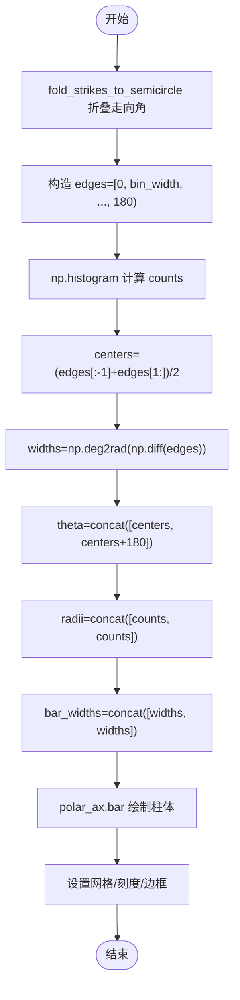
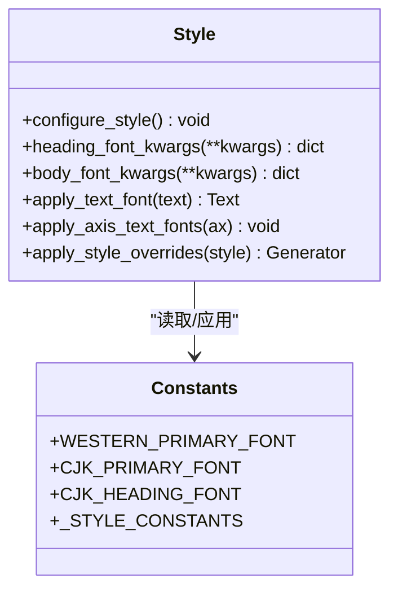
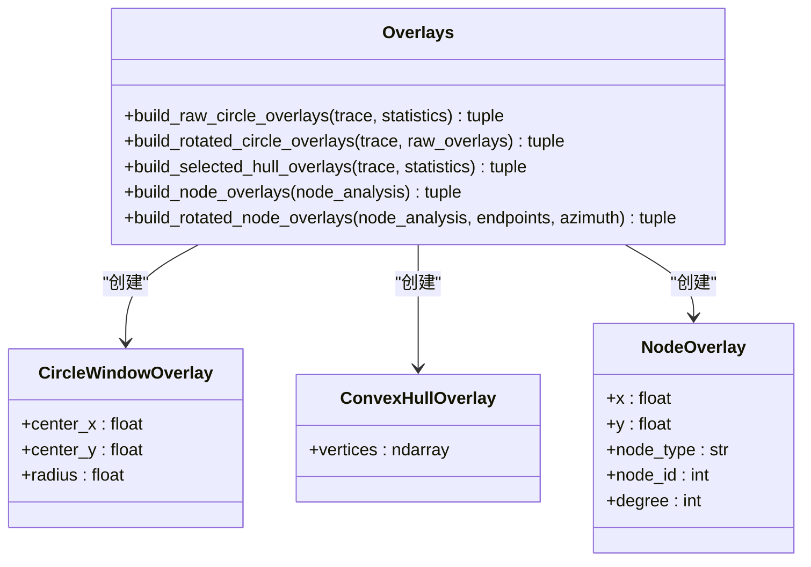
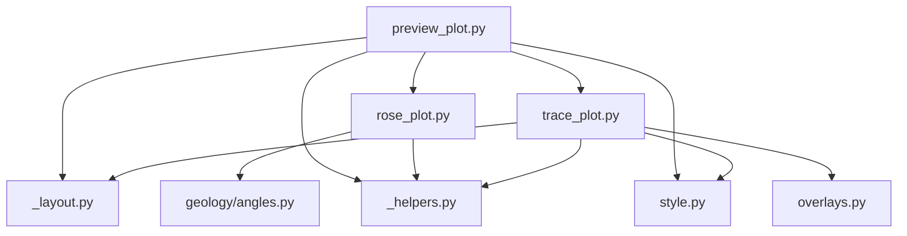

# 可视化引擎

<cite>
**本文引用的文件列表**
- [trace_pipeline/plotting/__init__.py](file://trace_pipeline/plotting/__init__.py)
- [trace_pipeline/plotting/trace_plot.py](file://trace_pipeline/plotting/trace_plot.py)
- [trace_pipeline/plotting/rose_plot.py](file://trace_pipeline/plotting/rose_plot.py)
- [trace_pipeline/plotting/style.py](file://trace_pipeline/plotting/style.py)
- [trace_pipeline/plotting/_layout.py](file://trace_pipeline/plotting/_layout.py)
- [trace_pipeline/plotting/_helpers.py](file://trace_pipeline/plotting/_helpers.py)
- [trace_pipeline/plotting/overlays.py](file://trace_pipeline/plotting/overlays.py)
- [trace_pipeline/plotting/preview_plot.py](file://trace_pipeline/plotting/preview_plot.py)
- [trace_pipeline/geology/angles.py](file://trace_pipeline/geology/angles.py)
- [tests/test_plotting.py](file://tests/test_plotting.py)
- [trace_pipeline/config.py](file://trace_pipeline/config.py)
- [trace_pipeline/models.py](file://trace_pipeline/models.py)
</cite>

## 目录
1. [简介](#简介)
2. [项目结构](#项目结构)
3. [核心组件](#核心组件)
4. [架构总览](#架构总览)
5. [详细组件分析](#详细组件分析)
6. [依赖关系分析](#依赖关系分析)
7. [性能与渲染优化](#性能与渲染优化)
8. [故障排查指南](#故障排查指南)
9. [结论](#结论)
10. [附录：API 参考与样式配置示例](#附录api-参考与样式配置示例)

## 简介
本技术文档面向可视化引擎的 matplotlib 集成、图表绘制流程与渲染优化策略，重点覆盖以下方面：
- 迹线图（线段图）绘制算法：坐标变换、线段拼接、标注系统（指北针、比例尺、统计框）、交互元素（节点覆盖层）。
- 玫瑰花瓣图生成：极坐标转换、角度分箱、颜色映射。
- 样式系统：全局样式配置、主题定制、字体处理与分辨率适配。
- 布局算法：多子图排列、边距计算、导出优化。
- API 参考与使用示例、性能调优建议。

## 项目结构
可视化引擎位于 trace_pipeline/plotting 子包中，采用“功能模块 + 共享工具”的组织方式：
- 绘图入口与延迟加载：__init__.py 提供按需导入，避免提前加载 pyplot。
- 迹线图：trace_plot.py 实现数据到像素的完整绘制流程。
- 玫瑰图：rose_plot.py 负责走向数据的极坐标直方图绘制。
- 样式系统：style.py 管理 matplotlib 全局样式、CJK 字体栈与线程安全的样式覆盖。
- 布局与装饰：_layout.py 集中布局常量、外框、比例尺、统计框、图例等通用逻辑。
- 通用辅助：_helpers.py 提供 Figure 创建、保存、指北针几何、数据边界计算等。
- 覆盖层构建：overlays.py 将业务数据转换为可绘制的覆盖层对象（圆窗、凸包、节点）。
- 预览绘图：preview_plot.py 提供与正式输出一致的预览能力，便于前端展示。

**图示来源**
- [trace_pipeline/plotting/__init__.py:1-36](file://trace_pipeline/plotting/__init__.py#L1-L36)
- [trace_pipeline/plotting/trace_plot.py:1-565](file://trace_pipeline/plotting/trace_plot.py#L1-L565)
- [trace_pipeline/plotting/rose_plot.py:1-140](file://trace_pipeline/plotting/rose_plot.py#L1-L140)
- [trace_pipeline/plotting/style.py:1-296](file://trace_pipeline/plotting/style.py#L1-L296)
- [trace_pipeline/plotting/_layout.py:1-653](file://trace_pipeline/plotting/_layout.py#L1-L653)
- [trace_pipeline/plotting/_helpers.py:1-192](file://trace_pipeline/plotting/_helpers.py#L1-L192)
- [trace_pipeline/plotting/overlays.py:1-156](file://trace_pipeline/plotting/overlays.py#L1-L156)
- [trace_pipeline/plotting/preview_plot.py:1-495](file://trace_pipeline/plotting/preview_plot.py#L1-L495)

**章节来源**
- [trace_pipeline/plotting/__init__.py:1-36](file://trace_pipeline/plotting/__init__.py#L1-L36)

## 核心组件
- 迹线图渲染器：负责从端点数组生成连续折线、叠加凸包或圆窗、绘制节点标记、添加指北针与比例尺、统计信息框与自适应图例。
- 玫瑰图渲染器：对走向数据进行半圆折叠与分箱，在极坐标轴上绘制柱体并设置网格与刻度。
- 样式系统：统一字体族、数学文本字体、线条粗细、DPI 等全局参数；支持线程安全临时覆盖。
- 布局与装饰：根据标题行数与数据范围动态解析各面板位置，计算自适应比例尺长度与边距。
- 覆盖层构建：将统计诊断结果与节点分析结果转换为绘图所需的几何对象。
- 预览绘图：复用同一套布局与样式，以硬编码演示数据快速生成预览图。

**章节来源**
- [trace_pipeline/plotting/trace_plot.py:443-565](file://trace_pipeline/plotting/trace_plot.py#L443-L565)
- [trace_pipeline/plotting/rose_plot.py:106-140](file://trace_pipeline/plotting/rose_plot.py#L106-L140)
- [trace_pipeline/plotting/style.py:187-256](file://trace_pipeline/plotting/style.py#L187-L256)
- [trace_pipeline/plotting/_layout.py:362-392](file://trace_pipeline/plotting/_layout.py#L362-L392)
- [trace_pipeline/plotting/overlays.py:33-156](file://trace_pipeline/plotting/overlays.py#L33-L156)
- [trace_pipeline/plotting/preview_plot.py:285-495](file://trace_pipeline/plotting/preview_plot.py#L285-L495)

## 架构总览
下图展示了从调用入口到最终 PNG 输出的关键路径与模块协作关系。

**图示来源**
- [trace_pipeline/plotting/__init__.py:8-25](file://trace_pipeline/plotting/__init__.py#L8-L25)
- [trace_pipeline/plotting/trace_plot.py:443-565](file://trace_pipeline/plotting/trace_plot.py#L443-L565)
- [trace_pipeline/plotting/_layout.py:362-392](file://trace_pipeline/plotting/_layout.py#L362-L392)
- [trace_pipeline/plotting/_helpers.py:26-93](file://trace_pipeline/plotting/_helpers.py#L26-L93)
- [trace_pipeline/plotting/rose_plot.py:106-140](file://trace_pipeline/plotting/rose_plot.py#L106-L140)

## 详细组件分析

### 迹线图绘制流程与算法
- 输入数据结构：端点数组 (N, 4)，列序为 [x1, y1, x2, y2]。
- 线段拼接：通过插入 NaN 分隔符将多条线段合并为一维 X/Y 序列，使 matplotlib 自动断开绘制。
- 数据边界与自适应尺寸：基于端点、覆盖层（凸包/圆窗/节点）计算数据范围，按目标物理尺度（cm/m）自适应 figure 尺寸，确保不同图之间 1m 的物理长度一致。
- 图层顺序：底层为凸包或圆窗（二选一），顶层为迹线，再上层为节点覆盖层。
- 装饰元素：指北针（数据坐标系内左上角）、比例尺带（独立面板）、统计信息框（半透明背景）、自适应图例。
- 背景与透明：支持白色背景或透明背景（alpha=0），保存时保持透明属性。

**图示来源**
- [trace_pipeline/plotting/trace_plot.py:151-170](file://trace_pipeline/plotting/trace_plot.py#L151-L170)
- [trace_pipeline/plotting/_helpers.py:160-192](file://trace_pipeline/plotting/_helpers.py#L160-L192)
- [trace_pipeline/plotting/_layout.py:362-392](file://trace_pipeline/plotting/_layout.py#L362-L392)
- [trace_pipeline/plotting/_helpers.py:26-39](file://trace_pipeline/plotting/_helpers.py#L26-L39)
- [trace_pipeline/plotting/_helpers.py:42-93](file://trace_pipeline/plotting/_helpers.py#L42-L93)

**章节来源**
- [trace_pipeline/plotting/trace_plot.py:151-170](file://trace_pipeline/plotting/trace_plot.py#L151-L170)
- [trace_pipeline/plotting/trace_plot.py:443-565](file://trace_pipeline/plotting/trace_plot.py#L443-L565)
- [trace_pipeline/plotting/_helpers.py:160-192](file://trace_pipeline/plotting/_helpers.py#L160-L192)
- [trace_pipeline/plotting/_layout.py:362-392](file://trace_pipeline/plotting/_layout.py#L362-L392)

#### 坐标变换与线段绘制
- 坐标变换：端点直接用于笛卡尔坐标系绘制；若需要旋转至测线坐标系，由 overlays.py 中的 normalize_points_like_lines 完成。
- 线段绘制：segments_to_xy 将 (N,4) 转为带 NaN 分隔的一维序列，减少循环开销，提升渲染性能。

**章节来源**
- [trace_pipeline/plotting/trace_plot.py:151-170](file://trace_pipeline/plotting/trace_plot.py#L151-L170)
- [trace_pipeline/plotting/overlays.py:65-83](file://trace_pipeline/plotting/overlays.py#L65-L83)

#### 标注系统与交互元素
- 指北针：add_data_north_arrow 在数据坐标系下绘制箭头与 N 标签，方向由 north_angle_deg 控制。
- 比例尺：_choose_scale_length 自适应选择规整长度（1/2/5×10ⁿ），_add_scale_bar_band 在独立面板绘制。
- 统计框：_add_statistics_box 使用 transAxes 坐标绘制半透明背景与行项，单位文本经 mathtext 规范化。
- 图例：_render_legend 根据可见元素动态构建图标与文本，支持节点类型图例。
- 节点覆盖层：NodeOverlay 数据类承载节点位置与类型，按类型分组批量 scatter 以提升性能。

**章节来源**
- [trace_pipeline/plotting/_helpers.py:121-158](file://trace_pipeline/plotting/_helpers.py#L121-L158)
- [trace_pipeline/plotting/_layout.py:179-201](file://trace_pipeline/plotting/_layout.py#L179-L201)
- [trace_pipeline/plotting/_layout.py:262-357](file://trace_pipeline/plotting/_layout.py#L262-L357)
- [trace_pipeline/plotting/_layout.py:447-569](file://trace_pipeline/plotting/_layout.py#L447-L569)
- [trace_pipeline/plotting/trace_plot.py:320-357](file://trace_pipeline/plotting/trace_plot.py#L320-L357)

### 玫瑰图生成算法
- 角度折叠：fold_strikes_to_semicircle 将走向角折叠到 [0°, 180°)，对称走向合并。
- 分箱与中心：edges 在 [0, 180) 范围内按 bin_width 划分，centers 取区间中点，widths 为弧度差。
- 极坐标绘制：theta 为双份角度（原区间与 +180° 镜像），radii 为频数，bar_widths 为宽度，使用 bar 绘制柱体。
- 网格与刻度：设置 theta 零位为北、顺时针方向、网格线与径向刻度。

**图示来源**
- [trace_pipeline/geology/angles.py:154-168](file://trace_pipeline/geology/angles.py#L154-L168)
- [trace_pipeline/plotting/rose_plot.py:76-104](file://trace_pipeline/plotting/rose_plot.py#L76-L104)
- [trace_pipeline/plotting/rose_plot.py:26-74](file://trace_pipeline/plotting/rose_plot.py#L26-L74)

**章节来源**
- [trace_pipeline/plotting/rose_plot.py:76-104](file://trace_pipeline/plotting/rose_plot.py#L76-L104)
- [trace_pipeline/plotting/rose_plot.py:26-74](file://trace_pipeline/plotting/rose_plot.py#L26-L74)
- [trace_pipeline/geology/angles.py:154-168](file://trace_pipeline/geology/angles.py#L154-L168)

### 样式系统与主题定制
- 全局样式：configure_style 设置字体族、数学文本字体、线条粗细、DPI、标题字重等，幂等执行。
- 字体回退：优先 Times New Roman 与宋体，检测可用字体并去重，避免缺失字重导致的警告。
- 标题与正文字体：heading_font_kwargs/body_font_kwargs 分别返回标题与正文的字体参数，兼容中文显示。
- 线程安全覆盖：apply_style_overrides 上下文管理器临时覆盖模块级样式常量与字号，退出自动恢复。

**图示来源**
- [trace_pipeline/plotting/style.py:187-256](file://trace_pipeline/plotting/style.py#L187-L256)
- [trace_pipeline/plotting/style.py:135-173](file://trace_pipeline/plotting/style.py#L135-L173)
- [trace_pipeline/plotting/style.py:258-296](file://trace_pipeline/plotting/style.py#L258-L296)

**章节来源**
- [trace_pipeline/plotting/style.py:187-256](file://trace_pipeline/plotting/style.py#L187-L256)
- [trace_pipeline/plotting/style.py:135-173](file://trace_pipeline/plotting/style.py#L135-L173)
- [trace_pipeline/plotting/style.py:258-296](file://trace_pipeline/plotting/style.py#L258-L296)

### 布局算法与多子图排列
- 布局解析：_resolve_layout 根据标题行数决定外框顶部位置，统计框占据右上区域，图例高度自适应，底边固定余量。
- 外框与空白面板：_add_outer_frame 绘制全图外框，_blank_panel_axes 创建无坐标轴的空白面板用于比例尺与图例。
- 比例尺与统计框：_add_scale_bar_band 与 _add_statistics_box 使用 transAxes 坐标，保证在不同 DPI 下视觉一致性。
- 节点样式预设：_resolve_node_style 根据 node_style 预设名返回对应标记样式字典。

```mermaid
flowchart TD
Title["标题行数"] --> FrameTop["确定外框顶部位置"]
FrameTop --> StatsY["统计框 Y 范围"]
StatsY --> LegendH["图例高度自适应"]
LegendH --> AxesBounds["返回各面板 bounds 字典"]
AxesBounds --> OuterFrame["_add_outer_frame 绘制外框"]
AxesBounds --> Panels["_blank_panel_axes 创建空白面板"]
Panels --> ScaleBar["_add_scale_bar_band 绘制比例尺"]
Panels --> Legend["_render_legend 绘制图例"]
Panels --> Stats["_add_statistics_box 绘制统计框"]
```

**图示来源**
- [trace_pipeline/plotting/_layout.py:362-392](file://trace_pipeline/plotting/_layout.py#L362-L392)
- [trace_pipeline/plotting/_layout.py:397-420](file://trace_pipeline/plotting/_layout.py#L397-L420)
- [trace_pipeline/plotting/_layout.py:623-642](file://trace_pipeline/plotting/_layout.py#L623-L642)
- [trace_pipeline/plotting/_layout.py:262-357](file://trace_pipeline/plotting/_layout.py#L262-L357)
- [trace_pipeline/plotting/_layout.py:647-653](file://trace_pipeline/plotting/_layout.py#L647-L653)

**章节来源**
- [trace_pipeline/plotting/_layout.py:362-392](file://trace_pipeline/plotting/_layout.py#L362-L392)
- [trace_pipeline/plotting/_layout.py:397-420](file://trace_pipeline/plotting/_layout.py#L397-L420)
- [trace_pipeline/plotting/_layout.py:623-642](file://trace_pipeline/plotting/_layout.py#L623-L642)
- [trace_pipeline/plotting/_layout.py:262-357](file://trace_pipeline/plotting/_layout.py#L262-L357)
- [trace_pipeline/plotting/_layout.py:647-653](file://trace_pipeline/plotting/_layout.py#L647-L653)

### 覆盖层构建与坐标归一化
- 圆窗覆盖层：build_raw_circle_overlays 从统计诊断提取圆心与半径，build_rotated_circle_overlays 旋转到测线坐标系。
- 凸包覆盖层：build_selected_hull_overlays 根据面积来源选择原始或缓冲凸包顶点，并旋转到测线坐标系。
- 节点覆盖层：build_node_overlays 与 build_rotated_node_overlays 将节点分析结果转换为绘图对象。

**图示来源**
- [trace_pipeline/plotting/overlays.py:33-156](file://trace_pipeline/plotting/overlays.py#L33-L156)
- [trace_pipeline/plotting/trace_plot.py:72-98](file://trace_pipeline/plotting/trace_plot.py#L72-L98)

**章节来源**
- [trace_pipeline/plotting/overlays.py:33-156](file://trace_pipeline/plotting/overlays.py#L33-L156)
- [trace_pipeline/plotting/trace_plot.py:72-98](file://trace_pipeline/plotting/trace_plot.py#L72-L98)

### 预览绘图与演示数据
- 预览迹线图：render_preview_trace 使用硬编码演示数据，复用布局与样式，支持显示/隐藏凸包、圆窗、节点。
- 预览玫瑰图：render_preview_rose 固定分箱宽度，快速生成样式预览。
- 演示数据容器：PreviewDemoData 封装端点、凸包、圆窗、节点、走向角等常量。

**章节来源**
- [trace_pipeline/plotting/preview_plot.py:285-495](file://trace_pipeline/plotting/preview_plot.py#L285-L495)
- [trace_pipeline/plotting/preview_plot.py:165-183](file://trace_pipeline/plotting/preview_plot.py#L165-L183)

## 依赖关系分析
- 模块耦合：
  - trace_plot 依赖 _layout、_helpers、style，以及 overlays 提供的覆盖层对象。
  - rose_plot 依赖 geology.angles 的角度折叠与 _helpers 的图形创建/保存。
  - preview_plot 复用 _layout、_helpers、style，并调用 rose_plot 的内部函数进行预览。
- 外部依赖：matplotlib（绘图）、numpy（数值计算）、threading（样式锁）、pathlib/os（文件操作）。
- 潜在循环依赖：通过 TYPE_CHECKING 与惰性导入避免运行时循环依赖。

**图示来源**
- [trace_pipeline/plotting/trace_plot.py:15-29](file://trace_pipeline/plotting/trace_plot.py#L15-L29)
- [trace_pipeline/plotting/rose_plot.py:10-12](file://trace_pipeline/plotting/rose_plot.py#L10-L12)
- [trace_pipeline/plotting/preview_plot.py:17-33](file://trace_pipeline/plotting/preview_plot.py#L17-L33)

**章节来源**
- [trace_pipeline/plotting/trace_plot.py:15-29](file://trace_pipeline/plotting/trace_plot.py#L15-L29)
- [trace_pipeline/plotting/rose_plot.py:10-12](file://trace_pipeline/plotting/rose_plot.py#L10-L12)
- [trace_pipeline/plotting/preview_plot.py:17-33](file://trace_pipeline/plotting/preview_plot.py#L17-L33)

## 性能与渲染优化
- 非交互后端：_helpers 强制使用非交互后端，避免 GUI 阻塞。
- 原子写入：save_figure 先写临时文件再重命名，防止异常中断导致损坏文件。
- 批量绘制：节点覆盖层按类型分组后一次性 scatter，减少多次调用开销。
- 自适应尺寸：根据数据跨度与目标物理尺度计算 figure 尺寸，避免过大或过小导致渲染效率下降。
- DPI 与导出：默认 300 DPI，支持高分辨率导出（如 600 DPI），结合 bbox_inches="tight" 裁剪多余空白。

**章节来源**
- [trace_pipeline/plotting/_helpers.py:13-15](file://trace_pipeline/plotting/_helpers.py#L13-L15)
- [trace_pipeline/plotting/_helpers.py:42-93](file://trace_pipeline/plotting/_helpers.py#L42-L93)
- [trace_pipeline/plotting/trace_plot.py:320-357](file://trace_pipeline/plotting/trace_plot.py#L320-L357)
- [trace_pipeline/plotting/trace_plot.py:420-441](file://trace_pipeline/plotting/trace_plot.py#L420-L441)

## 故障排查指南
- 数据无效：compute_data_bounds 与 segments_to_xy 会检查 NaN/inf 并抛出 ValueError，需确保端点与走向角有效。
- 空数据：rose_plot 与 trace_plot 均支持空输入，但需留意输出是否为空白 PNG。
- 样式覆盖死锁：apply_style_overrides 使用 RLock 保护，确保并发安全；测试用例验证不会死锁。
- 字体缺失：configure_style 会记录未检测到首选字体的警告，系统将回退到可用字体。

**章节来源**
- [trace_pipeline/plotting/_helpers.py:160-192](file://trace_pipeline/plotting/_helpers.py#L160-L192)
- [trace_pipeline/plotting/rose_plot.py:76-88](file://trace_pipeline/plotting/rose_plot.py#L76-L88)
- [tests/test_plotting.py:87-98](file://tests/test_plotting.py#L87-L98)
- [trace_pipeline/plotting/style.py:216-220](file://trace_pipeline/plotting/style.py#L216-L220)

## 结论
该可视化引擎以模块化设计实现了迹线图与玫瑰图的稳定渲染，具备完善的样式系统、布局算法与覆盖层机制。通过非交互后端、原子写入与批量绘制等手段，兼顾了性能与可靠性。预览模块进一步提升了开发体验与样式调试效率。

## 附录：API 参考与样式配置示例

### 主要 API
- render_trace_plot(segments, title, output_dir, filename, dpi, figsize_cm, north_angle_deg, statistics_lines, circle_windows, hull_overlay, area_source, node_overlays, style, include_*, background_color)
- render_rose_plot(strike_deg, title, output_dir, filename, bin_width, dpi, figsize_cm)
- segments_to_xy(segments)
- configure_style()
- apply_style_overrides(style)

**章节来源**
- [trace_pipeline/plotting/trace_plot.py:443-565](file://trace_pipeline/plotting/trace_plot.py#L443-L565)
- [trace_pipeline/plotting/rose_plot.py:106-140](file://trace_pipeline/plotting/rose_plot.py#L106-L140)
- [trace_pipeline/plotting/trace_plot.py:151-170](file://trace_pipeline/plotting/trace_plot.py#L151-L170)
- [trace_pipeline/plotting/style.py:187-256](file://trace_pipeline/plotting/style.py#L187-L256)
- [trace_pipeline/plotting/style.py:258-296](file://trace_pipeline/plotting/style.py#L258-L296)

### 样式配置键（部分）
- trace_line_color / trace_line_width
- hull_line_color / hull_fill_color / hull_fill_alpha
- circle_window_line_color / circle_window_fill_color / circle_window_fill_alpha
- rose_bar_color / rose_bar_edge / rose_grid_color
- label_font_size / global_font_size（向后兼容）
- node_style（预设名：default/solid/hollow/dark）

**章节来源**
- [trace_pipeline/plotting/style.py:23-35](file://trace_pipeline/plotting/style.py#L23-L35)
- [trace_pipeline/plotting/_layout.py:92-173](file://trace_pipeline/plotting/_layout.py#L92-L173)

### 使用示例（路径引用）
- 迹线图渲染与圆窗覆盖层：见测试用例
- 玫瑰图渲染与空数据处理：见测试用例
- 样式覆盖与并发安全：见测试用例

**章节来源**
- [tests/test_plotting.py:18-42](file://tests/test_plotting.py#L18-L42)
- [tests/test_plotting.py:44-86](file://tests/test_plotting.py#L44-L86)
- [tests/test_plotting.py:87-98](file://tests/test_plotting.py#L87-L98)