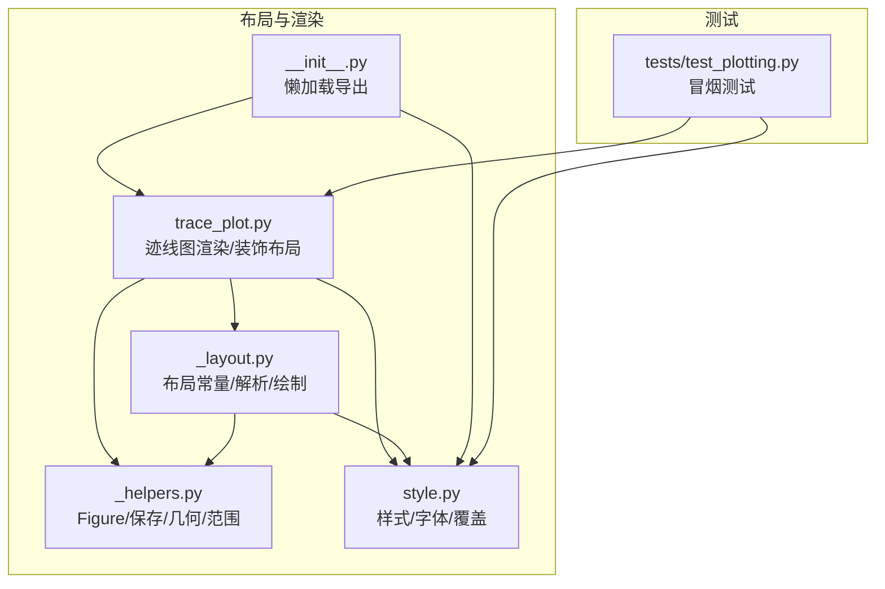
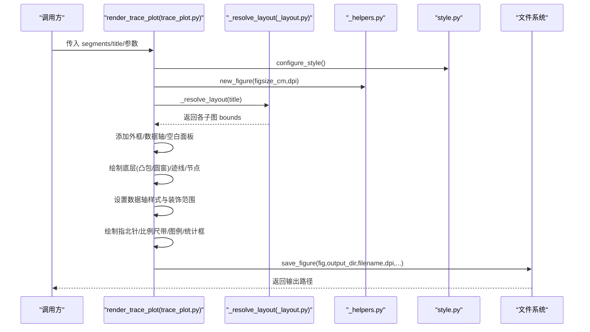
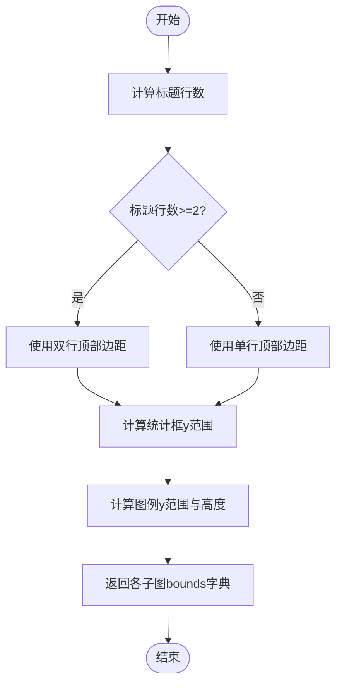
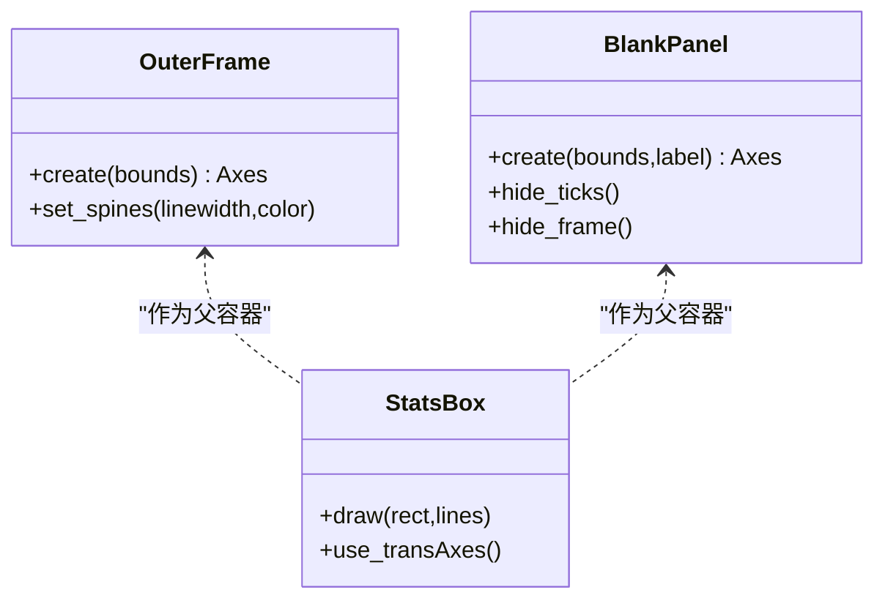
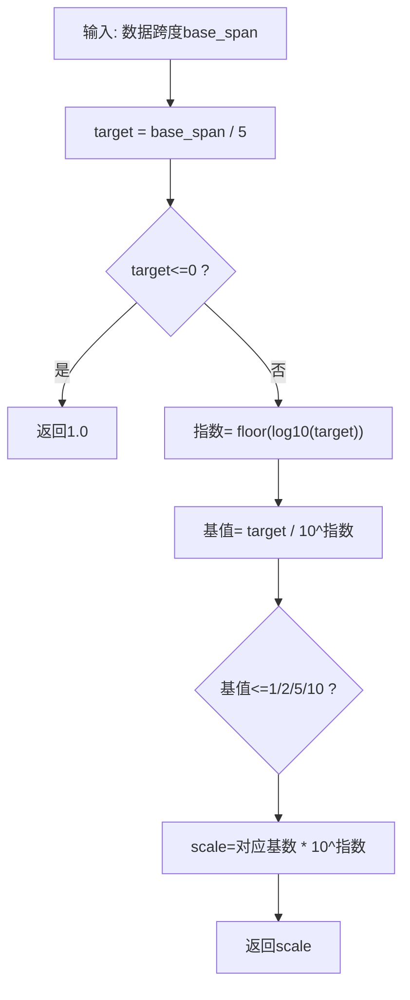
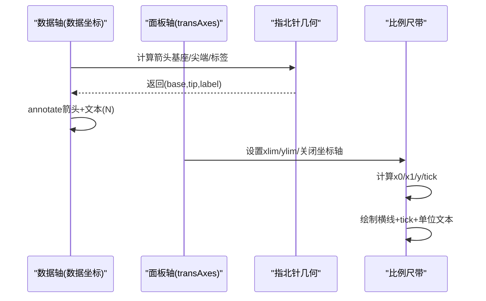
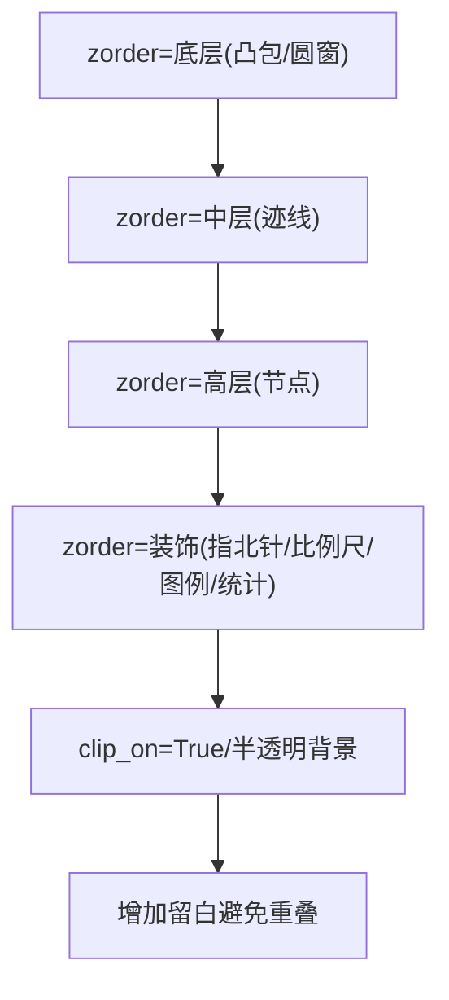
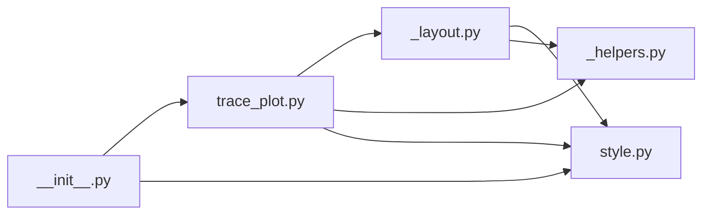

# 布局引擎

<cite>
**本文引用的文件**   
- [trace_pipeline/plotting/_layout.py](file://trace_pipeline/plotting/_layout.py)
- [trace_pipeline/plotting/trace_plot.py](file://trace_pipeline/plotting/trace_plot.py)
- [trace_pipeline/plotting/_helpers.py](file://trace_pipeline/plotting/_helpers.py)
- [trace_pipeline/plotting/style.py](file://trace_pipeline/plotting/style.py)
- [trace_pipeline/plotting/__init__.py](file://trace_pipeline/plotting/__init__.py)
- [tests/test_plotting.py](file://tests/test_plotting.py)
</cite>

## 目录
1. [简介](#简介)
2. [项目结构](#项目结构)
3. [核心组件](#核心组件)
4. [架构总览](#架构总览)
5. [详细组件分析](#详细组件分析)
6. [依赖关系分析](#依赖关系分析)
7. [性能考量](#性能考量)
8. [故障排查指南](#故障排查指南)
9. [结论](#结论)
10. [附录：布局配置 API 参考](#附录布局配置-api-参考)

## 简介
本技术文档聚焦于 TracePipeline 的“布局引擎”，围绕多子图排列算法、边界框管理、自适应间距、坐标转换与导出优化展开，目标是帮助读者理解并扩展该系统的绘图布局能力。系统基于 matplotlib，采用相对比例（transAxes）与数据坐标混合的方式，实现主数据区、刻度条、图例和统计框的精确排布；同时提供自适应尺寸计算与样式覆盖机制，支持响应式设计与高质量导出。

## 项目结构
布局相关代码集中在 plotting 子包中，采用“共享布局工具 + 具体图表渲染”的分层组织方式：
- _layout.py：布局常量、布局解析、外框/面板创建、坐标轴样式、比例尺带、统计框、图例渲染等通用逻辑
- trace_plot.py：迹线图渲染入口、装饰布局构建、自适应画布尺寸、图层叠加（凸包/圆窗/节点）、指北针与比例尺绘制
- _helpers.py：Figure 创建/保存、指北针几何计算、数据范围计算等通用辅助
- style.py：全局样式与字体栈配置、标题/正文字体参数生成、线程安全的样式覆盖上下文管理器
- __init__.py：按需懒加载导出接口，避免提前导入 pyplot
- tests/test_plotting.py：冒烟测试，验证渲染流程与输出文件有效性

图示来源
- [trace_pipeline/plotting/_layout.py:1-653](file://trace_pipeline/plotting/_layout.py#L1-L653)
- [trace_pipeline/plotting/trace_plot.py:1-565](file://trace_pipeline/plotting/trace_plot.py#L1-L565)
- [trace_pipeline/plotting/_helpers.py:1-192](file://trace_pipeline/plotting/_helpers.py#L1-L192)
- [trace_pipeline/plotting/style.py:1-296](file://trace_pipeline/plotting/style.py#L1-L296)
- [trace_pipeline/plotting/__init__.py:1-36](file://trace_pipeline/plotting/__init__.py#L1-L36)
- [tests/test_plotting.py:1-98](file://tests/test_plotting.py#L1-L98)

章节来源
- [trace_pipeline/plotting/_layout.py:1-653](file://trace_pipeline/plotting/_layout.py#L1-L653)
- [trace_pipeline/plotting/trace_plot.py:1-565](file://trace_pipeline/plotting/trace_plot.py#L1-L565)
- [trace_pipeline/plotting/_helpers.py:1-192](file://trace_pipeline/plotting/_helpers.py#L1-L192)
- [trace_pipeline/plotting/style.py:1-296](file://trace_pipeline/plotting/style.py#L1-L296)
- [trace_pipeline/plotting/__init__.py:1-36](file://trace_pipeline/plotting/__init__.py#L1-L36)
- [tests/test_plotting.py:1-98](file://tests/test_plotting.py#L1-L98)

## 核心组件
- 布局常量与解析器
  - 定义外框、数据区、统计框、图例、比例尺带的默认相对位置与尺寸常量
  - 根据标题行数动态选择顶部边距，返回各子图的 (x0, y0, x1, y1) 相对坐标
- 外框与空白面板
  - 统一创建外层边框 Axes 与无坐标轴的空白面板 Axes，用于承载统计框、图例、比例尺带
- 坐标轴样式
  - 设置等比例、隐藏刻度、四边框线宽与颜色、白色背景等论文风格
- 比例尺与单位格式化
  - 依据数据跨度自适应选择规整长度（1/2/5 × 10ⁿ），自动切换 m/cm 单位显示
- 统计信息框
  - 在 transAxes 坐标系下绘制半透明背景、标题、分割线与多行统计项，字号随行数自适应收缩
- 图例渲染
  - 支持迹线、凸包、圆窗、节点类型等多种图例项，按内容自适应高度与行间距
- 装饰布局与自适应画布
  - 基于数据范围与目标物理尺度计算左右上下留白与 scale_length，进而推导 figure 尺寸，确保不同图之间 1m 的物理长度一致
- 样式与字体
  - 全局样式配置、中英文字体回退链、数学文本字体、标题/正文字体参数生成、线程安全样式覆盖

章节来源
- [trace_pipeline/plotting/_layout.py:36-173](file://trace_pipeline/plotting/_layout.py#L36-L173)
- [trace_pipeline/plotting/_layout.py:179-201](file://trace_pipeline/plotting/_layout.py#L179-L201)
- [trace_pipeline/plotting/_layout.py:206-260](file://trace_pipeline/plotting/_layout.py#L206-L260)
- [trace_pipeline/plotting/_layout.py:262-357](file://trace_pipeline/plotting/_layout.py#L262-L357)
- [trace_pipeline/plotting/_layout.py:362-391](file://trace_pipeline/plotting/_layout.py#L362-L391)
- [trace_pipeline/plotting/_layout.py:397-419](file://trace_pipeline/plotting/_layout.py#L397-L419)
- [trace_pipeline/plotting/_layout.py:425-442](file://trace_pipeline/plotting/_layout.py#L425-L442)
- [trace_pipeline/plotting/_layout.py:447-569](file://trace_pipeline/plotting/_layout.py#L447-L569)
- [trace_pipeline/plotting/_layout.py:571-642](file://trace_pipeline/plotting/_layout.py#L571-L642)
- [trace_pipeline/plotting/_layout.py:647-653](file://trace_pipeline/plotting/_layout.py#L647-L653)
- [trace_pipeline/plotting/trace_plot.py:100-133](file://trace_pipeline/plotting/trace_plot.py#L100-L133)
- [trace_pipeline/plotting/trace_plot.py:225-266](file://trace_pipeline/plotting/trace_plot.py#L225-L266)
- [trace_pipeline/plotting/trace_plot.py:420-441](file://trace_pipeline/plotting/trace_plot.py#L420-L441)
- [trace_pipeline/plotting/style.py:187-256](file://trace_pipeline/plotting/style.py#L187-L256)
- [trace_pipeline/plotting/style.py:258-296](file://trace_pipeline/plotting/style.py#L258-L296)

## 架构总览
下图展示了从调用 render_trace_plot 到最终落盘的关键流程，包括布局解析、子图创建、图层叠加、装饰元素绘制与保存。

图示来源
- [trace_pipeline/plotting/trace_plot.py:443-565](file://trace_pipeline/plotting/trace_plot.py#L443-L565)
- [trace_pipeline/plotting/_layout.py:362-391](file://trace_pipeline/plotting/_layout.py#L362-L391)
- [trace_pipeline/plotting/_helpers.py:26-93](file://trace_pipeline/plotting/_helpers.py#L26-L93)
- [trace_pipeline/plotting/style.py:187-256](file://trace_pipeline/plotting/style.py#L187-L256)

## 详细组件分析

### 多子图排列算法与相对位置计算
- 布局策略
  - 通过 _resolve_layout 根据标题行数决定顶部边距，固定底部与宽度，依次计算统计框、图例、比例尺带的位置与尺寸
  - 统计框占据右上角区域（原指北针位置），图例位于其下方且高度自适应，比例尺带置于底部独立面板
- 关键常量
  - 外框与数据区默认相对坐标、统计框与图例宽高、比例尺带坐标等均在 _layout.py 中集中定义
- 结果
  - 返回包含 trace_outer_frame、trace_data、trace_statistics、trace_legend、trace_scale 五个子图区域的字典，供后续 add_axes 使用

图示来源
- [trace_pipeline/plotting/_layout.py:362-391](file://trace_pipeline/plotting/_layout.py#L362-L391)

章节来源
- [trace_pipeline/plotting/_layout.py:362-391](file://trace_pipeline/plotting/_layout.py#L362-L391)

### 边界框管理系统与嵌套布局
- 外框与空白面板
  - _add_outer_frame 创建全图外框 Axes，设置四边框线宽与颜色，作为整体容器
  - _blank_panel_axes 创建无坐标轴的空白面板，用于承载统计框、图例、比例尺带等装饰元素
- 嵌套布局
  - 统计框内部再绘制矩形背景、标题、分割线与多行文本，形成“面板内嵌面板”的嵌套结构
  - 所有内部元素均使用 transAxes 变换，保证相对定位与缩放一致性

图示来源
- [trace_pipeline/plotting/_layout.py:397-419](file://trace_pipeline/plotting/_layout.py#L397-L419)
- [trace_pipeline/plotting/_layout.py:262-357](file://trace_pipeline/plotting/_layout.py#L262-L357)

章节来源
- [trace_pipeline/plotting/_layout.py:397-419](file://trace_pipeline/plotting/_layout.py#L397-L419)
- [trace_pipeline/plotting/_layout.py:262-357](file://trace_pipeline/plotting/_layout.py#L262-L357)

### 自适应间距与尺寸调整
- 比例尺长度自适应
  - _choose_scale_length 依据 base_span 的五分之一目标值，选择 1/2/5 × 10ⁿ 序列中的合适长度
  - _format_scale_label 根据长度是否大于等于 1m 自动切换 m/cm 单位显示
- 统计框字号自适应
  - _statistics_font_size 根据行数阶梯式缩小字号，避免 PNG 面板内纵向重叠
- 图例高度自适应
  - _render_legend 根据 items 数量与 row_spacing 计算 box_height，并限制最大高度 cap
- 画布尺寸自适应
  - _compute_adaptive_figsize 基于数据范围与目标物理尺度（cm/m）计算 figure 尺寸，并裁剪到最小/最大区间

图示来源
- [trace_pipeline/plotting/_layout.py:179-194](file://trace_pipeline/plotting/_layout.py#L179-L194)
- [trace_pipeline/plotting/_layout.py:197-201](file://trace_pipeline/plotting/_layout.py#L197-L201)
- [trace_pipeline/plotting/_layout.py:206-216](file://trace_pipeline/plotting/_layout.py#L206-L216)
- [trace_pipeline/plotting/_layout.py:447-569](file://trace_pipeline/plotting/_layout.py#L447-L569)
- [trace_pipeline/plotting/trace_plot.py:420-441](file://trace_pipeline/plotting/trace_plot.py#L420-L441)

章节来源
- [trace_pipeline/plotting/_layout.py:179-201](file://trace_pipeline/plotting/_layout.py#L179-L201)
- [trace_pipeline/plotting/_layout.py:206-216](file://trace_pipeline/plotting/_layout.py#L206-L216)
- [trace_pipeline/plotting/_layout.py:447-569](file://trace_pipeline/plotting/_layout.py#L447-L569)
- [trace_pipeline/plotting/trace_plot.py:420-441](file://trace_pipeline/plotting/trace_plot.py#L420-L441)

### 坐标转换系统与映射
- 数据坐标 vs transAxes
  - 数据轴使用数据坐标进行绘图（如迹线、凸包、圆窗、节点），并通过 set_xlim/set_ylim 控制可见范围
  - 装饰元素（统计框、图例、比例尺带）使用 transAxes 相对坐标，便于在不同 figsize 下保持一致布局
- 指北针几何计算
  - _north_arrow_geometry 计算箭头基座、尖端与标签位置，支持任意角度旋转
  - add_data_north_arrow 在数据坐标系下绘制箭头与 N 标签
- 比例尺带坐标
  - _add_scale_bar_band 在独立比例尺带面板中，依据 xlim 与 scale_length 计算横线与 tick 位置，并在中心标注单位

图示来源
- [trace_pipeline/plotting/_helpers.py:99-157](file://trace_pipeline/plotting/_helpers.py#L99-L157)
- [trace_pipeline/plotting/_layout.py:571-642](file://trace_pipeline/plotting/_layout.py#L571-L642)

章节来源
- [trace_pipeline/plotting/_helpers.py:99-157](file://trace_pipeline/plotting/_helpers.py#L99-L157)
- [trace_pipeline/plotting/_layout.py:571-642](file://trace_pipeline/plotting/_layout.py#L571-L642)

### 图层叠加与重叠检测
- 图层顺序
  - 底层：凸包或圆窗（二选一）
  - 中层：迹线
  - 顶层：节点覆盖层
  - 装饰元素：指北针、比例尺带、图例、统计框
- 重叠处理
  - 通过 zorder 控制绘制顺序，确保重要元素不被遮挡
  - 统计框与图例使用半透明背景与 clip_on=True，避免越界溢出
  - 数据范围通过 _apply_decoration_limits 增加留白，减少元素与数据点重叠风险

图示来源
- [trace_pipeline/plotting/trace_plot.py:514-536](file://trace_pipeline/plotting/trace_plot.py#L514-L536)
- [trace_pipeline/plotting/_layout.py:262-357](file://trace_pipeline/plotting/_layout.py#L262-L357)

章节来源
- [trace_pipeline/plotting/trace_plot.py:514-536](file://trace_pipeline/plotting/trace_plot.py#L514-L536)
- [trace_pipeline/plotting/_layout.py:262-357](file://trace_pipeline/plotting/_layout.py#L262-L357)

### 样式与字体系统
- 全局样式
  - configure_style 设置字体族、数学文本字体、线条宽度、刻度大小、DPI、保存背景等
- 字体回退链
  - heading_font_kwargs/body_font_kwargs 生成标题/正文字体参数，优先 Times New Roman，中文回退宋体/黑体
- 线程安全样式覆盖
  - apply_style_overrides 临时覆盖模块级样式常量与字号，退出时恢复，避免并发冲突

章节来源
- [trace_pipeline/plotting/style.py:187-256](file://trace_pipeline/plotting/style.py#L187-L256)
- [trace_pipeline/plotting/style.py:135-172](file://trace_pipeline/plotting/style.py#L135-L172)
- [trace_pipeline/plotting/style.py:258-296](file://trace_pipeline/plotting/style.py#L258-L296)

## 依赖关系分析
- 模块耦合
  - trace_plot 依赖 _layout 与 _helpers 完成布局与基础操作，依赖 style 完成样式配置
  - _layout 依赖 style 获取字体参数，依赖 _helpers 的指北针几何函数
  - __init__.py 通过懒加载暴露公共接口，避免早期导入 pyplot
- 外部依赖
  - matplotlib.pyplot、matplotlib.patches、numpy 为核心依赖
  - 非交互后端强制设置，确保在无 GUI 环境下稳定运行

图示来源
- [trace_pipeline/plotting/trace_plot.py:1-565](file://trace_pipeline/plotting/trace_plot.py#L1-L565)
- [trace_pipeline/plotting/_layout.py:1-653](file://trace_pipeline/plotting/_layout.py#L1-L653)
- [trace_pipeline/plotting/_helpers.py:1-192](file://trace_pipeline/plotting/_helpers.py#L1-L192)
- [trace_pipeline/plotting/style.py:1-296](file://trace_pipeline/plotting/style.py#L1-L296)
- [trace_pipeline/plotting/__init__.py:1-36](file://trace_pipeline/plotting/__init__.py#L1-L36)

章节来源
- [trace_pipeline/plotting/trace_plot.py:1-565](file://trace_pipeline/plotting/trace_plot.py#L1-L565)
- [trace_pipeline/plotting/_layout.py:1-653](file://trace_pipeline/plotting/_layout.py#L1-L653)
- [trace_pipeline/plotting/_helpers.py:1-192](file://trace_pipeline/plotting/_helpers.py#L1-L192)
- [trace_pipeline/plotting/style.py:1-296](file://trace_pipeline/plotting/style.py#L1-L296)
- [trace_pipeline/plotting/__init__.py:1-36](file://trace_pipeline/plotting/__init__.py#L1-L36)

## 性能考量
- 批量绘制节点
  - 按节点类型分组后使用 scatter 批量绘制，减少多次 plot 调用开销
- 向量化数据范围计算
  - compute_data_bounds 使用 numpy 向量化操作，提升大数据量下的性能
- 原子写入与日志
  - save_figure 采用临时文件重命名策略，避免中断导致损坏文件，并记录保存耗时
- DPI 与尺寸裁剪
  - 自适应 figsize 将结果裁剪到合理区间，避免过大或过小图像影响渲染与存储效率

章节来源
- [trace_pipeline/plotting/trace_plot.py:320-357](file://trace_pipeline/plotting/trace_plot.py#L320-L357)
- [trace_pipeline/plotting/_helpers.py:160-192](file://trace_pipeline/plotting/_helpers.py#L160-L192)
- [trace_pipeline/plotting/_helpers.py:42-93](file://trace_pipeline/plotting/_helpers.py#L42-L93)
- [trace_pipeline/plotting/trace_plot.py:420-441](file://trace_pipeline/plotting/trace_plot.py#L420-L441)

## 故障排查指南
- 常见问题
  - 中文乱码：检查 configure_style 是否已调用，确认系统存在 Times New Roman 与宋体/黑体
  - 图例或统计框重叠：调整 title 行数或增大 padding，检查 _statistics_font_size 的行数阈值
  - 比例尺单位异常：确认 _choose_scale_length 返回值与 _format_scale_label 的单位判断逻辑
  - 保存失败或文件损坏：检查 save_figure 的临时文件与权限，确认输出目录可写
- 调试建议
  - 打印 _resolve_layout 返回的 bounds，核对各子图位置
  - 使用 apply_style_overrides 临时覆盖样式常量，快速验证视觉效果
  - 在测试用例中降低 dpi 以加速渲染，逐步定位问题

章节来源
- [trace_pipeline/plotting/style.py:187-256](file://trace_pipeline/plotting/style.py#L187-L256)
- [trace_pipeline/plotting/_layout.py:206-216](file://trace_pipeline/plotting/_layout.py#L206-L216)
- [trace_pipeline/plotting/_layout.py:179-201](file://trace_pipeline/plotting/_layout.py#L179-L201)
- [trace_pipeline/plotting/_helpers.py:42-93](file://trace_pipeline/plotting/_helpers.py#L42-L93)
- [tests/test_plotting.py:87-98](file://tests/test_plotting.py#L87-L98)

## 结论
TracePipeline 的布局引擎通过统一的布局常量与解析器、灵活的 transAxes 相对定位、自适应间距与尺寸计算、以及严格的图层顺序与重叠控制，实现了高质量、可复现的多子图排版。配合样式覆盖与懒加载导出，系统在易用性与可扩展性方面表现良好，适合科研与工程场景下的批量出图需求。

## 附录：布局配置 API 参考
- 主要入口
  - render_trace_plot(segments, title, output_dir, filename, ...)：绘制并保存迹线图，支持 include_* 开关与 background_color 透明背景
  - render_rose_plot(strike_deg, title, output_dir, filename, bin_width, dpi, figsize_cm)：绘制玫瑰花瓣图
- 布局与样式
  - TracePlotLayout：迹线图布局比例参数（相对比例），含 pad、arrow、legend、stats_box、scale 等字段
  - _DecorationLayout：装饰布局元组，包含数据范围、留白、scale_length 等
  - configure_style()：全局样式初始化（幂等）
  - apply_style_overrides(style)：线程安全临时覆盖样式常量与字号
- 常用参数说明
  - north_angle_deg：指北针角度（度）
  - statistics_lines：统计信息行列表，支持单位规范化与紧凑标签
  - circle_windows/hull_overlay/node_overlays：覆盖层数据对象
  - area_source：面积来源（hull/window/measured 等），影响图例项
  - dpi/figsize_cm：分辨率与画布尺寸（厘米），None 时启用自适应
- 示例路径
  - 测试用例展示基本渲染与样式覆盖用法

章节来源
- [trace_pipeline/plotting/trace_plot.py:100-133](file://trace_pipeline/plotting/trace_plot.py#L100-L133)
- [trace_pipeline/plotting/trace_plot.py:443-565](file://trace_pipeline/plotting/trace_plot.py#L443-L565)
- [trace_pipeline/plotting/style.py:187-256](file://trace_pipeline/plotting/style.py#L187-L256)
- [trace_pipeline/plotting/style.py:258-296](file://trace_pipeline/plotting/style.py#L258-L296)
- [tests/test_plotting.py:44-98](file://tests/test_plotting.py#L44-L98)