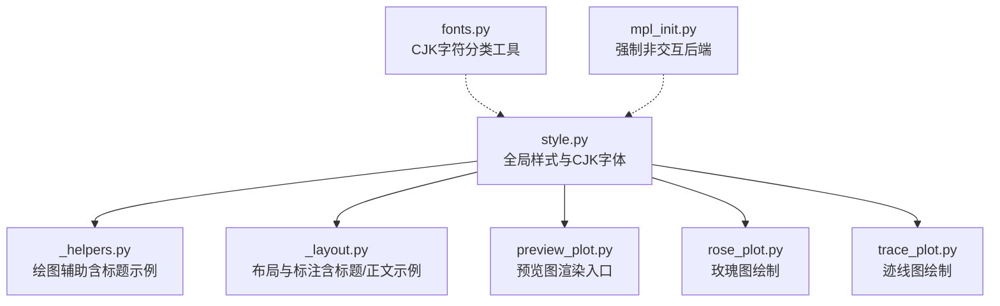
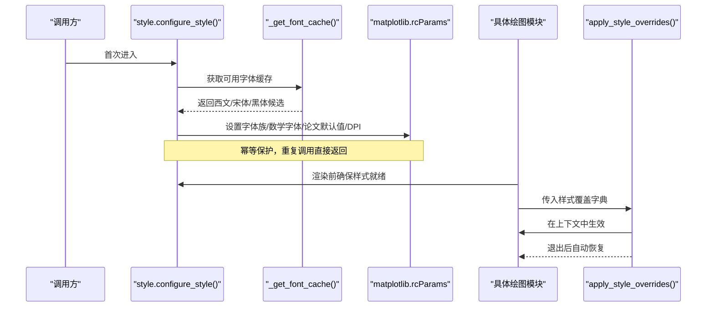
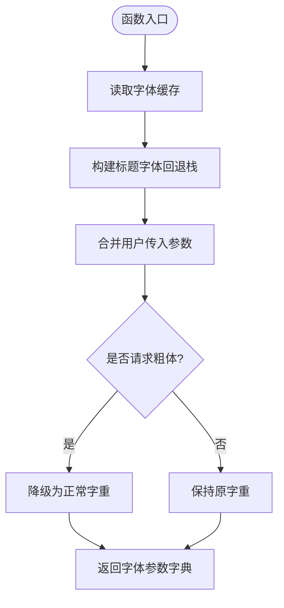
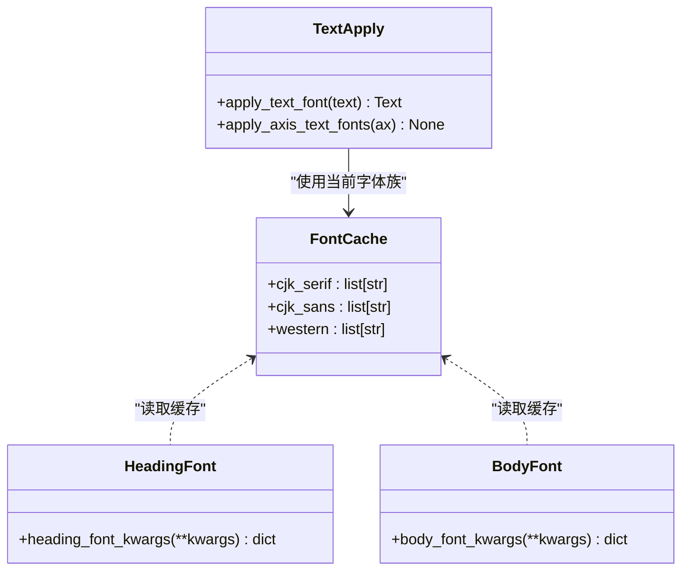
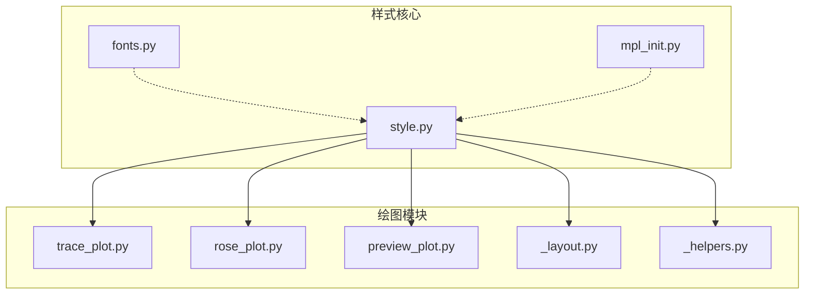

# 样式系统

<cite>
**本文引用的文件**   
- [style.py](file://trace_pipeline/plotting/style.py)
- [fonts.py](file://trace_pipeline/utils/fonts.py)
- [mpl_init.py](file://trace_pipeline/utils/mpl_init.py)
- [_helpers.py](file://trace_pipeline/plotting/_helpers.py)
- [_layout.py](file://trace_pipeline/plotting/_layout.py)
- [preview_plot.py](file://trace_pipeline/plotting/preview_plot.py)
- [rose_plot.py](file://trace_pipeline/plotting/rose_plot.py)
- [trace_plot.py](file://trace_pipeline/plotting/trace_plot.py)
- [pipeline.py](file://trace_pipeline/pipeline.py)
- [gui_api.py](file://backend/gui_api.py)
</cite>

## 目录
1. [简介](#简介)
2. [项目结构](#项目结构)
3. [核心组件](#核心组件)
4. [架构总览](#架构总览)
5. [详细组件分析](#详细组件分析)
6. [依赖关系分析](#依赖关系分析)
7. [性能考虑](#性能考虑)
8. [故障排查指南](#故障排查指南)
9. [结论](#结论)
10. [附录：样式定制最佳实践](#附录样式定制最佳实践)

## 简介
本技术文档聚焦于 matplotlib 样式系统的实现与使用，覆盖字体管理、颜色主题、全局样式配置、标题字体参数生成（heading_font_kwargs）、样式字典层次结构与覆盖策略、以及 DPI 分辨率适配机制。文档同时提供面向用户的样式定制指南，包括主题创建、颜色方案配置与字体管理的最佳实践。

## 项目结构
样式系统主要位于 trace_pipeline/plotting/style.py，围绕以下职责展开：
- 全局样式初始化与幂等保护
- CJK 字体检测与回退栈构建
- 标题与正文字体参数生成
- 运行时样式覆盖（线程安全）
- 文本对象字体统一应用



图表来源
- [style.py:187-256](file://trace_pipeline/plotting/style.py#L187-L256)
- [_helpers.py:150-157](file://trace_pipeline/plotting/_helpers.py#L150-L157)
- [_layout.py:320-356](file://trace_pipeline/plotting/_layout.py#L320-L356)
- [preview_plot.py:444-446](file://trace_pipeline/plotting/preview_plot.py#L444-L446)
- [rose_plot.py:120-139](file://trace_pipeline/plotting/rose_plot.py#L120-L139)
- [trace_plot.py:29-30](file://trace_pipeline/plotting/trace_plot.py#L29-L30)
- [fonts.py:24-42](file://trace_pipeline/utils/fonts.py#L24-L42)
- [mpl_init.py:12-24](file://trace_pipeline/utils/mpl_init.py#L12-L24)

章节来源
- [style.py:1-296](file://trace_pipeline/plotting/style.py#L1-L296)
- [fonts.py:1-42](file://trace_pipeline/utils/fonts.py#L1-L42)
- [mpl_init.py:1-24](file://trace_pipeline/utils/mpl_init.py#L1-L24)

## 核心组件
- 全局样式配置：configure_style()
  - 设置字体族回退链、数学文本字体、论文风格默认值（字号、线宽、刻度、DPI 等）。
  - 幂等执行，避免重复扫描与配置。
- 字体参数生成：heading_font_kwargs() / body_font_kwargs()
  - heading_font_kwargs：优先 Times New Roman，中文回退黑体；对 bold 字重进行回退处理以避免警告。
  - body_font_kwargs：优先 Times New Roman，中文回退宋体。
- 运行时样式覆盖：apply_style_overrides(style)
  - 仅覆盖已注册的模块级常量键（如线条颜色、宽度、填充色、透明度等），并支持 label_font_size/global_font_size 的 rcParams 临时覆盖。
  - 线程安全，退出上下文自动恢复。
- 文本字体统一应用：apply_text_font()/apply_axis_text_fonts()
  - 将单个文本或坐标轴刻度标签设置为当前字体族。

章节来源
- [style.py:135-173](file://trace_pipeline/plotting/style.py#L135-L173)
- [style.py:187-256](file://trace_pipeline/plotting/style.py#L187-L256)
- [style.py:258-296](file://trace_pipeline/plotting/style.py#L258-L296)

## 架构总览
样式系统通过“全局配置 + 局部覆盖”的方式工作：
- 启动时调用 configure_style() 完成一次性的全局样式设置。
- 各绘图模块在渲染前按需调用 configure_style()，确保字体与 rcParams 就绪。
- 通过 apply_style_overrides() 在特定作用域内临时覆盖样式常量与字号。



图表来源
- [style.py:187-256](file://trace_pipeline/plotting/style.py#L187-L256)
- [style.py:258-296](file://trace_pipeline/plotting/style.py#L258-L296)
- [preview_plot.py:465-491](file://trace_pipeline/plotting/preview_plot.py#L465-L491)
- [rose_plot.py:120-139](file://trace_pipeline/plotting/rose_plot.py#L120-L139)
- [trace_plot.py:29-30](file://trace_pipeline/plotting/trace_plot.py#L29-L30)

## 详细组件分析

### heading_font_kwargs 工作原理与中文字体回退
- 输入：任意关键字参数（如 fontsize、fontweight、color 等）。
- 输出：合并后的字体参数字典，包含 fontfamily 回退栈。
- 回退栈构造：
  - 优先 Times New Roman，其次 SimHei（黑体），再按系统可用西文/无衬线中文/衬线中文排序。
  - 去重保证顺序稳定。
- 字重处理：
  - 若请求 bold/semibold/heavy/black，且常见 CJK 字体缺少独立粗体面，则降级为 normal，避免 findfont 反复回退产生噪声。
- 适用场景：所有标题、主标题、统计框标题等需要醒目显示的位置。



图表来源
- [style.py:135-154](file://trace_pipeline/plotting/style.py#L135-L154)

章节来源
- [style.py:135-154](file://trace_pipeline/plotting/style.py#L135-L154)

### 字体管理与 CJK 检测
- 字体缓存：_get_font_cache()
  - 一次性扫描系统字体，筛选出常规字重的西文/宋体/黑体候选列表，供后续复用。
- 字体族优先级：_preferred_font_stack()
  - 组合西文首选、CJK 首选与候选，形成稳定的全局字体族顺序。
- CJK 文本分类：classify_text()
  - 基于 Unicode 区块判断字符是否为 CJK，用于更细粒度的文本分类（当前样式系统未直接使用，但可作为扩展点）。



图表来源
- [style.py:82-100](file://trace_pipeline/plotting/style.py#L82-L100)
- [style.py:111-126](file://trace_pipeline/plotting/style.py#L111-L126)
- [style.py:175-185](file://trace_pipeline/plotting/style.py#L175-L185)
- [fonts.py:24-42](file://trace_pipeline/utils/fonts.py#L24-L42)

章节来源
- [style.py:82-126](file://trace_pipeline/plotting/style.py#L82-L126)
- [style.py:175-185](file://trace_pipeline/plotting/style.py#L175-L185)
- [fonts.py:1-42](file://trace_pipeline/utils/fonts.py#L1-L42)

### 全局样式设置与论文规范
- 字体族与数学字体：
  - 设置 font.family/font.serif/font.sans-serif，mathtext 使用自定义字体集，避免英文/数字/单位缺失字形。
- 论文常用默认值：
  - axes.unicode_minus=False、字体大小、轴线宽度、刻度尺寸、线条宽度、标记大小、DPI 等。
- 标题字重：
  - 标题默认使用正常字重，避免 CJK 缺粗体导致的警告。

章节来源
- [style.py:187-256](file://trace_pipeline/plotting/style.py#L187-L256)

### 样式字典层次结构与覆盖策略
- 注册常量映射：_STYLE_CONSTANTS
  - 将样式键映射到具体模块（trace_plot/rose_plot）中的模块级常量属性。
- 覆盖流程：apply_style_overrides(style)
  - 保存原始值 -> 写入新值 -> 执行业务逻辑 -> 恢复原始值。
  - 支持 label_font_size/global_font_size 覆盖 rcParams["font.size"]。
- 层次结构：
  - 默认值：由 configure_style() 设置的 rcParams 与模块常量。
  - 用户覆盖：通过 style 字典传入，仅影响当前上下文。
  - 运行时修改：在 with 块内生效，退出自动恢复，保证线程安全。

```mermaid
sequenceDiagram
participant User as "用户代码"
participant Over as "apply_style_overrides()"
participant ModA as "trace_plot 模块常量"
participant ModB as "rose_plot 模块常量"
participant RC as "rcParams"
User->>Over : 传入 style 字典
Over->>ModA : 保存并覆盖注册键
Over->>ModB : 保存并覆盖注册键
Over->>RC : 可选覆盖 font.size
User->>User : 执行业务逻辑使用覆盖后的样式
Over-->>ModA : 恢复原始值
Over-->>ModB : 恢复原始值
Over-->>RC : 恢复 font.size
```

图表来源
- [style.py:22-35](file://trace_pipeline/plotting/style.py#L22-L35)
- [style.py:258-296](file://trace_pipeline/plotting/style.py#L258-L296)

章节来源
- [style.py:22-35](file://trace_pipeline/plotting/style.py#L22-L35)
- [style.py:258-296](file://trace_pipeline/plotting/style.py#L258-L296)

### 分辨率适配算法（DPI 与尺寸）
- 全局 DPI：
  - figure.dpi/savefig.dpi 默认 300，适合出版质量输出。
- 图形尺寸：
  - 迹线图与玫瑰图分别定义英寸尺寸与目标 DPI，结合 savefig 的 pad_inches/bbox_inches 控制边距与裁剪。
- 缩放策略：
  - 通过 rcParams 统一控制线条宽度、标记大小、刻度尺寸等，使不同 DPI 下视觉一致性更好。
  - 标题与正文字号由 heading_font_kwargs/body_font_kwargs 显式传入，便于在不同面板中微调。

章节来源
- [style.py:234-248](file://trace_pipeline/plotting/style.py#L234-L248)
- [rose_plot.py:19-21](file://trace_pipeline/plotting/rose_plot.py#L19-L21)
- [trace_plot.py:44-47](file://trace_pipeline/plotting/trace_plot.py#L44-L47)
- [preview_plot.py:444-447](file://trace_pipeline/plotting/preview_plot.py#L444-L447)

### 样式在绘图模块中的使用
- 迹线图：
  - 导入并使用 heading_font_kwargs 设置标题；通过 _layout 与 _helpers 协作完成布局与标注。
- 玫瑰图：
  - 渲染前调用 configure_style()，使用 heading_font_kwargs 设置标题，极坐标轴刻度与网格样式由 _draw_rose_axes 统一设置。
- 预览图：
  - 渲染前后均可能调用 configure_style()，并在 suptitle 中使用 heading_font_kwargs。

章节来源
- [trace_plot.py:29-30](file://trace_pipeline/plotting/trace_plot.py#L29-L30)
- [rose_plot.py:120-139](file://trace_pipeline/plotting/rose_plot.py#L120-L139)
- [preview_plot.py:444-446](file://trace_pipeline/plotting/preview_plot.py#L444-L446)

## 依赖关系分析
- 内部依赖：
  - plotting 子模块（trace_plot、rose_plot、preview_plot、_layout、_helpers）依赖 style 提供的字体与样式能力。
  - utils.fonts 提供 CJK 分类工具，虽未被样式系统直接引用，但可作为扩展点。
  - utils.mpl_init 提供非交互后端强制设置，避免多进程/后台线程绘图冲突。
- 外部依赖：
  - matplotlib 及其 font_manager、rcParams。



图表来源
- [style.py:1-296](file://trace_pipeline/plotting/style.py#L1-L296)
- [trace_plot.py:1-30](file://trace_pipeline/plotting/trace_plot.py#L1-L30)
- [rose_plot.py:1-140](file://trace_pipeline/plotting/rose_plot.py#L1-L140)
- [preview_plot.py:1-495](file://trace_pipeline/plotting/preview_plot.py#L1-L495)
- [_layout.py:1-653](file://trace_pipeline/plotting/_layout.py#L1-L653)
- [_helpers.py:1-192](file://trace_pipeline/plotting/_helpers.py#L1-L192)
- [fonts.py:1-42](file://trace_pipeline/utils/fonts.py#L1-L42)
- [mpl_init.py:1-24](file://trace_pipeline/utils/mpl_init.py#L1-L24)

章节来源
- [style.py:1-296](file://trace_pipeline/plotting/style.py#L1-L296)
- [trace_plot.py:1-200](file://trace_pipeline/plotting/trace_plot.py#L1-L200)
- [rose_plot.py:1-140](file://trace_pipeline/plotting/rose_plot.py#L1-L140)
- [preview_plot.py:1-495](file://trace_pipeline/plotting/preview_plot.py#L1-L495)
- [_layout.py:1-653](file://trace_pipeline/plotting/_layout.py#L1-L653)
- [_helpers.py:1-192](file://trace_pipeline/plotting/_helpers.py#L1-L192)
- [fonts.py:1-42](file://trace_pipeline/utils/fonts.py#L1-L42)
- [mpl_init.py:1-24](file://trace_pipeline/utils/mpl_init.py#L1-L24)

## 性能考虑
- 字体扫描缓存：_get_font_cache() 使用 lru_cache(maxsize=1)，仅在首次调用时扫描系统字体，避免重复 IO。
- 幂等配置：configure_style() 使用全局锁与标志位，防止多线程并发重复配置。
- 最小化警告：标题字重降级避免 CJK 缺粗体引发的 findfont 回退日志噪声。
- 建议：
  - 在应用启动阶段尽早调用 configure_style()，减少后续渲染时的延迟。
  - 批量渲染时复用同一上下文，避免频繁切换样式覆盖。

章节来源
- [style.py:82-100](file://trace_pipeline/plotting/style.py#L82-L100)
- [style.py:187-256](file://trace_pipeline/plotting/style.py#L187-L256)

## 故障排查指南
- 中文显示异常或缺字：
  - 检查系统是否安装 SimSun/SimHei/Noto Serif SC 等候选字体；查看 configure_style() 的警告日志。
  - 确认 heading_font_kwargs 的 fontfamily 回退栈是否正确。
- 标题粗体无效或出现大量回退警告：
  - 由于 CJK 字体通常缺少独立粗体面，heading_font_kwargs 会主动降级字重；如需强调，可通过 color 或加粗边框替代。
- 多进程/后台线程绘图崩溃：
  - 在导入任何 GUI 库之前调用 force_noninteractive_backend()，强制 Agg 后端。
- 样式覆盖未生效或残留：
  - 确保使用 apply_style_overrides 的上下文管理器；检查传入的键是否在 _STYLE_CONSTANTS 中注册。

章节来源
- [style.py:216-220](file://trace_pipeline/plotting/style.py#L216-L220)
- [style.py:150-154](file://trace_pipeline/plotting/style.py#L150-L154)
- [mpl_init.py:12-24](file://trace_pipeline/utils/mpl_init.py#L12-L24)
- [style.py:258-296](file://trace_pipeline/plotting/style.py#L258-L296)

## 结论
该样式系统以“全局配置 + 局部覆盖”为核心，结合 CJK 字体回退与论文风格默认值，提供了跨平台一致的可视化体验。通过线程安全的覆盖机制与幂等初始化，系统在复杂运行环境中具备良好稳定性与可维护性。

## 附录：样式定制最佳实践
- 主题创建
  - 在应用启动处调用 configure_style()，确保全局样式一致。
  - 如需自定义主题，可在 apply_style_overrides 中集中传入覆盖字典，避免散落修改 rcParams。
- 颜色方案配置
  - 通过 _STYLE_CONSTANTS 注册的键（如 trace_line_color、hull_fill_color、rose_bar_color 等）进行覆盖。
  - 建议在配置文件中维护颜色方案，并在渲染前注入。
- 字体管理
  - 标题使用 heading_font_kwargs，正文使用 body_font_kwargs，确保回退栈合理。
  - 若需特殊字体，可在 heading_font_kwargs/body_font_kwargs 中追加 fontfamily 元素。
- DPI 与尺寸
  - 根据输出用途调整 figure.dpi/savefig.dpi；对于屏幕预览可适当降低 DPI 提升速度。
  - 使用 pad_inches 与 bbox_inches="tight" 控制导出边距。
- 集成入口
  - 在 GUI 或流水线入口中调用 configure_style()，确保首次渲染前样式就绪。
  - 在多进程环境下，先调用 force_noninteractive_backend()。

章节来源
- [style.py:22-35](file://trace_pipeline/plotting/style.py#L22-L35)
- [style.py:135-173](file://trace_pipeline/plotting/style.py#L135-L173)
- [style.py:234-248](file://trace_pipeline/plotting/style.py#L234-L248)
- [preview_plot.py:465-491](file://trace_pipeline/plotting/preview_plot.py#L465-L491)
- [pipeline.py:147-149](file://trace_pipeline/pipeline.py#L147-L149)
- [gui_api.py:338-345](file://backend/gui_api.py#L338-L345)