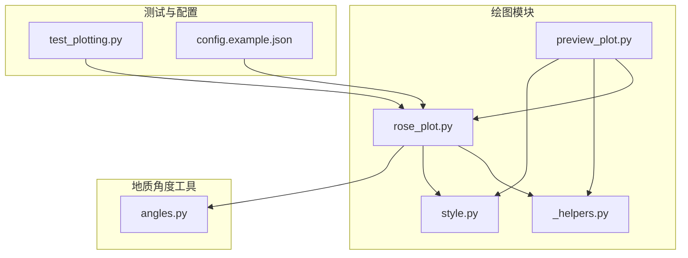
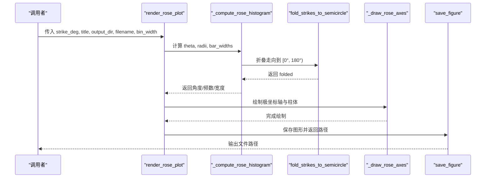
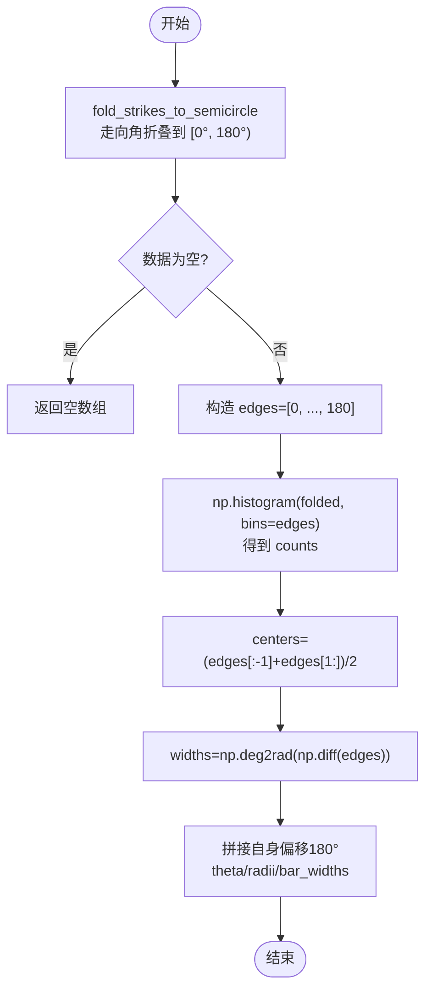
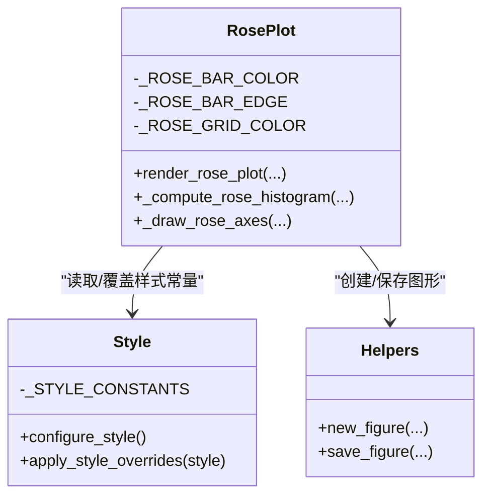
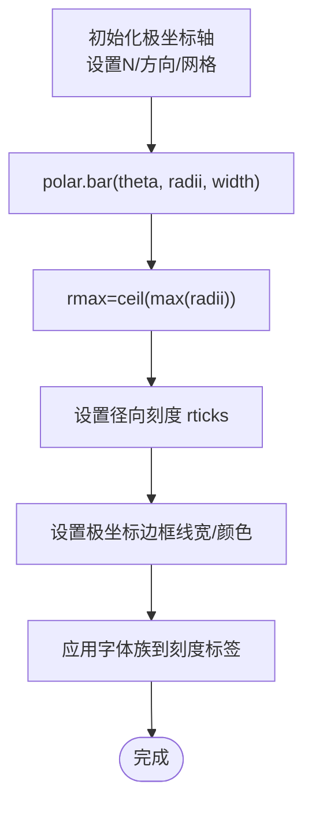
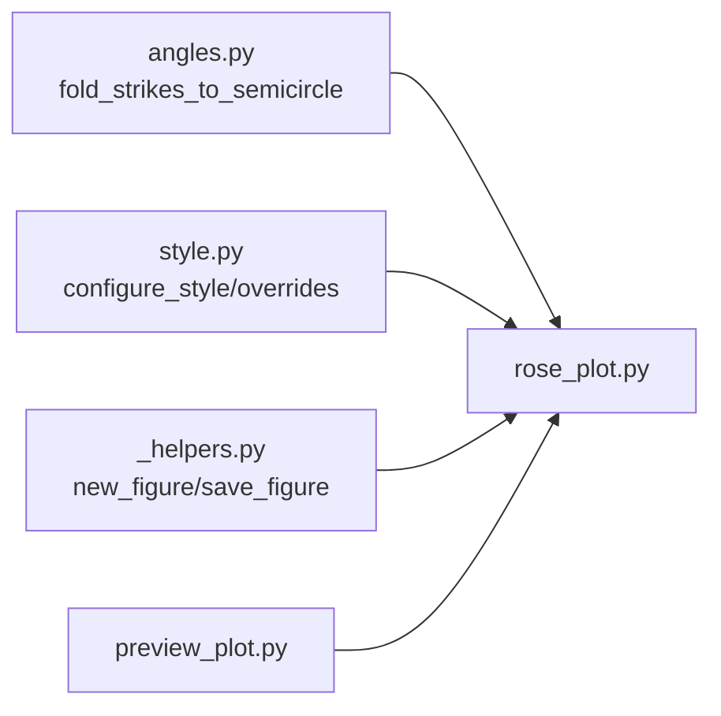

# 玫瑰图绘制

<cite>
**本文引用的文件**   
- [rose_plot.py](file://trace_pipeline/plotting/rose_plot.py)
- [angles.py](file://trace_pipeline/geology/angles.py)
- [style.py](file://trace_pipeline/plotting/style.py)
- [_helpers.py](file://trace_pipeline/plotting/_helpers.py)
- [preview_plot.py](file://trace_pipeline/plotting/preview_plot.py)
- [test_plotting.py](file://tests/test_plotting.py)
- [config.example.json](file://config.example.json)
</cite>

## 目录
1. [简介](#简介)
2. [项目结构](#项目结构)
3. [核心组件](#核心组件)
4. [架构总览](#架构总览)
5. [详细组件分析](#详细组件分析)
6. [依赖关系分析](#依赖关系分析)
7. [性能与精度考量](#性能与精度考量)
8. [故障排查指南](#故障排查指南)
9. [结论](#结论)
10. [附录：API 参考](#附录api-参考)

## 简介
本技术文档聚焦于“玫瑰图绘制模块”，面向地质走向数据的极坐标直方图可视化。文档深入解析以下关键主题：
- 极坐标系下的角度分箱算法：角度归一化、区间划分与统计计数逻辑
- 颜色映射机制：当前实现的颜色分配策略与可扩展点
- 扇形区域绘制算法：半径计算、角度插值与填充渲染
- 图例与标注系统：标题、刻度、网格与字体配置
- 完整绘图 API 参考：角度数据处理、样式配置与导出选项

该模块基于 matplotlib 的极坐标投影，结合地质角度处理工具，提供稳定、可复现且易于扩展的玫瑰图绘制能力。

## 项目结构
与玫瑰图绘制直接相关的代码位于 plotting 与 geology 子包中，核心文件如下：
- trace_pipeline/plotting/rose_plot.py：主入口与绘制流程
- trace_pipeline/geology/angles.py：角度折叠与归一化工具
- trace_pipeline/plotting/style.py：全局样式与字体配置
- trace_pipeline/plotting/_helpers.py：图形创建与保存辅助
- trace_pipeline/plotting/preview_plot.py：预览版玫瑰图（复用核心逻辑）
- tests/test_plotting.py：冒烟测试用例
- config.example.json：配置项示例（包含玫瑰图相关开关与参数）

图表来源
- [rose_plot.py:1-140](file://trace_pipeline/plotting/rose_plot.py#L1-L140)
- [angles.py:1-168](file://trace_pipeline/geology/angles.py#L1-L168)
- [style.py:1-296](file://trace_pipeline/plotting/style.py#L1-L296)
- [_helpers.py:1-192](file://trace_pipeline/plotting/_helpers.py#L1-L192)
- [preview_plot.py:1-495](file://trace_pipeline/plotting/preview_plot.py#L1-L495)
- [test_plotting.py:1-98](file://tests/test_plotting.py#L1-L98)
- [config.example.json:1-26](file://config.example.json#L1-L26)

章节来源
- [rose_plot.py:1-140](file://trace_pipeline/plotting/rose_plot.py#L1-L140)
- [angles.py:1-168](file://trace_pipeline/geology/angles.py#L1-L168)
- [style.py:1-296](file://trace_pipeline/plotting/style.py#L1-L296)
- [_helpers.py:1-192](file://trace_pipeline/plotting/_helpers.py#L1-L192)
- [preview_plot.py:1-495](file://trace_pipeline/plotting/preview_plot.py#L1-L495)
- [test_plotting.py:1-98](file://tests/test_plotting.py#L1-L98)
- [config.example.json:1-26](file://config.example.json#L1-L26)

## 核心组件
- 角度分箱与统计
  - 将走向角折叠到半圆 [0°, 180°)，以消除对称走向重复
  - 在 [0°, 180°] 上按 bin_width 等距划分区间并计数
  - 将半圆结果镜像复制到对跖方向，得到完整的 360° 柱体序列
- 极坐标轴绘制
  - 设置北为 0°、顺时针方向、网格与刻度
  - 使用 bar 绘制柱体，自动设定径向范围与刻度
- 样式与字体
  - 统一字体栈（西文优先 Times New Roman，中文回退宋体/黑体）
  - 通过上下文管理器临时覆盖样式常量（如柱体颜色、网格色）
- 图形创建与保存
  - 支持厘米尺寸、DPI、透明背景、原子写入与日志记录

章节来源
- [rose_plot.py:75-104](file://trace_pipeline/plotting/rose_plot.py#L75-L104)
- [rose_plot.py:26-74](file://trace_pipeline/plotting/rose_plot.py#L26-L74)
- [style.py:187-256](file://trace_pipeline/plotting/style.py#L187-L256)
- [_helpers.py:26-93](file://trace_pipeline/plotting/_helpers.py#L26-L93)

## 架构总览
下图展示了从输入走向数据到输出 PNG 文件的调用链与数据流。

图表来源
- [rose_plot.py:106-140](file://trace_pipeline/plotting/rose_plot.py#L106-L140)
- [rose_plot.py:75-104](file://trace_pipeline/plotting/rose_plot.py#L75-L104)
- [angles.py:154-168](file://trace_pipeline/geology/angles.py#L154-L168)
- [_helpers.py:42-93](file://trace_pipeline/plotting/_helpers.py#L42-L93)

## 详细组件分析

### 角度分箱算法（极坐标下）
- 角度归一化与折叠
  - 使用 fold_strikes_to_semicircle 将任意走向角映射到 [0°, 180°)，并将接近 180° 的值归零，保证边界连续性
- 区间划分与计数
  - 在 [0°, 180°] 上构造 edges，确保首尾为 0 和 180
  - 使用 np.histogram 统计每个区间的频数
- 中心与宽度
  - centers = (edges[:-1] + edges[1:]) / 2
  - widths = np.diff(edges) 转换为弧度
- 镜像复制
  - 将半圆结果拼接自身偏移 180°，得到 360° 的 theta、radii、bar_widths

图表来源
- [rose_plot.py:75-104](file://trace_pipeline/plotting/rose_plot.py#L75-L104)
- [angles.py:154-168](file://trace_pipeline/geology/angles.py#L154-L168)

章节来源
- [rose_plot.py:75-104](file://trace_pipeline/plotting/rose_plot.py#L75-L104)
- [angles.py:154-168](file://trace_pipeline/geology/angles.py#L154-L168)

### 颜色映射机制
- 当前实现
  - 柱体填充色与边框色由模块级常量定义，并在 _draw_rose_axes 中作为参数传入
  - 网格线颜色同样通过参数控制
- 样式覆盖
  - style.apply_style_overrides 支持在运行时临时覆盖 rose_bar_color、rose_bar_edge、rose_grid_color 等键
  - 覆盖通过反射修改模块级常量，退出时自动恢复
- 渐变色与分类色
  - 当前未实现逐扇区的渐变色或分类色自动分配；所有扇区共享同一填充色
  - 若需扩展，可在 _draw_rose_axes 中将 color 改为每扇区颜色列表，或在 render_rose_plot 中根据 radii 动态生成颜色映射

图表来源
- [rose_plot.py:19-74](file://trace_pipeline/plotting/rose_plot.py#L19-L74)
- [style.py:22-35](file://trace_pipeline/plotting/style.py#L22-L35)
- [style.py:258-296](file://trace_pipeline/plotting/style.py#L258-L296)
- [_helpers.py:26-93](file://trace_pipeline/plotting/_helpers.py#L26-L93)

章节来源
- [rose_plot.py:19-74](file://trace_pipeline/plotting/rose_plot.py#L19-L74)
- [style.py:22-35](file://trace_pipeline/plotting/style.py#L22-L35)
- [style.py:258-296](file://trace_pipeline/plotting/style.py#L258-L296)

### 扇形区域绘制算法
- 极坐标轴设置
  - 设置 0° 指向北、顺时针方向、网格线与刻度
- 柱体绘制
  - 使用 polar.bar(theta, radii, width=bar_widths, bottom=0.0, ...) 绘制扇形柱体
  - 自动计算 rmax 并设置径向刻度
- 半径计算
  - radii 即为各分箱的计数值，无需额外缩放
- 角度插值
  - 采用等宽分箱，centers 作为角度中心，无插值过程
- 填充渲染
  - 通过 facecolor/edgecolor/alpha 控制填充与边框透明度

图表来源
- [rose_plot.py:26-74](file://trace_pipeline/plotting/rose_plot.py#L26-L74)

章节来源
- [rose_plot.py:26-74](file://trace_pipeline/plotting/rose_plot.py#L26-L74)

### 图例与标注系统
- 标题
  - 使用 suptitle 添加全局标题，并通过 heading_font_kwargs 指定字体族与字重
- 刻度与网格
  - 角度刻度每 30° 显示一次，径向刻度根据 rmax 自适应
- 字体与排版
  - configure_style 统一字体栈与字号，避免 CJK 缺失导致的警告
- 图例
  - 当前玫瑰图不内置图例；如需图例，可在外部通过 matplotlib.legend 添加自定义条目

章节来源
- [rose_plot.py:138-139](file://trace_pipeline/plotting/rose_plot.py#L138-L139)
- [style.py:187-256](file://trace_pipeline/plotting/style.py#L187-L256)

### 预览版玫瑰图
- preview_plot.render_preview_rose 复用 _compute_rose_histogram 与 _draw_rose_axes
- 固定 bin_width=10°，便于样式预览
- 支持通过 style 字典覆盖柱体与网格颜色

章节来源
- [preview_plot.py:450-491](file://trace_pipeline/plotting/preview_plot.py#L450-L491)
- [preview_plot.py:31](file://trace_pipeline/plotting/preview_plot.py#L31)

## 依赖关系分析
- 内部依赖
  - rose_plot 依赖 angles.fold_strikes_to_semicircle 进行角度折叠
  - rose_plot 依赖 style.configure_style 与 apply_style_overrides 管理样式
  - rose_plot 依赖 _helpers.new_figure/save_figure 创建与保存图形
- 外部依赖
  - numpy 用于向量化角度处理与直方图统计
  - matplotlib.pyplot 与 matplotlib.projections.polar 用于极坐标绘图

图表来源
- [rose_plot.py:10-12](file://trace_pipeline/plotting/rose_plot.py#L10-L12)
- [preview_plot.py:31](file://trace_pipeline/plotting/preview_plot.py#L31)

章节来源
- [rose_plot.py:10-12](file://trace_pipeline/plotting/rose_plot.py#L10-L12)
- [preview_plot.py:31](file://trace_pipeline/plotting/preview_plot.py#L31)

## 性能与精度考量
- 时间复杂度
  - 角度折叠 O(N)
  - 直方图统计 O(N)
  - 绘图阶段主要开销在 matplotlib 渲染，通常远小于数据准备
- 数值稳定性
  - 使用 np.isclose 处理边界 180°→0° 的连续性
  - 对 NaN/inf 进行校验，避免异常传播
- 内存占用
  - 仅保留必要的中间数组（folded、counts、centers、widths），空间复杂度 O(N)
- 导出性能
  - save_figure 使用原子写入与计时日志，减少 I/O 风险并可观测耗时

章节来源
- [rose_plot.py:75-104](file://trace_pipeline/plotting/rose_plot.py#L75-L104)
- [_helpers.py:42-93](file://trace_pipeline/plotting/_helpers.py#L42-L93)

## 故障排查指南
- 常见错误
  - bin_width 不在 (0, 180] 范围内：抛出 ValueError
  - 输入包含 NaN/inf：抛出 ValueError
  - 空数据：返回空数组，仍可正常绘制空白玫瑰图
- 调试建议
  - 检查输入角度是否已归一化（0–360）
  - 确认 bin_width 合理（常用 5–15°）
  - 使用预览函数快速验证样式覆盖是否生效
- 样式问题
  - 若中文字体显示异常，检查 configure_style 是否被调用以及系统字体可用性
  - 使用 apply_style_overrides 临时覆盖样式，避免污染全局配置

章节来源
- [rose_plot.py:75-88](file://trace_pipeline/plotting/rose_plot.py#L75-L88)
- [style.py:187-256](file://trace_pipeline/plotting/style.py#L187-L256)
- [test_plotting.py:18-42](file://tests/test_plotting.py#L18-L42)

## 结论
玫瑰图绘制模块以简洁清晰的职责划分实现了从角度处理到极坐标绘制的完整流程。其优势包括：
- 稳定的角度折叠与分箱逻辑，兼容地质学上的对称走向合并
- 统一的样式管理与字体配置，满足论文级排版需求
- 可复用的预览接口与原子写入的导出机制
- 良好的错误处理与可观测性

未来可扩展的方向包括：
- 引入渐变色或分类色映射，增强视觉区分度
- 增加可选的图例与格式化标注（如百分比、密度）
- 提供多种径向缩放策略（线性/对数）以适应不同数据分布

## 附录：API 参考

### 主入口
- render_rose_plot(strike_deg, title, output_dir, filename, bin_width=10.0, dpi=400, figsize_cm=(12,12))
  - 功能：绘制并保存节理走向玫瑰花瓣图
  - 参数：
    - strike_deg：走向角度数组（度）
    - title：标题字符串
    - output_dir：输出目录路径
    - filename：文件名（含扩展名）
    - bin_width：分箱宽度（度），必须在 (0, 180]
    - dpi：图像分辨率
    - figsize_cm：画布尺寸（厘米）
  - 返回：输出文件的绝对路径
  - 异常：当 bin_width 非法或输入包含 NaN/inf 时抛出 ValueError

章节来源
- [rose_plot.py:106-140](file://trace_pipeline/plotting/rose_plot.py#L106-L140)

### 内部函数
- _compute_rose_histogram(strike_deg, bin_width=10.0) -> (theta, radii, bar_widths)
  - 功能：计算玫瑰图柱体的角度（弧度）、频数与柱宽（弧度）
  - 注意：内部执行角度折叠与镜像复制
- _draw_rose_axes(polar_ax, theta, radii, bar_widths, *, bar_color, bar_edge, grid_color)
  - 功能：在极坐标轴上绘制玫瑰花瓣（柱体+网格+边框+刻度）

章节来源
- [rose_plot.py:26-74](file://trace_pipeline/plotting/rose_plot.py#L26-L74)
- [rose_plot.py:75-104](file://trace_pipeline/plotting/rose_plot.py#L75-L104)

### 角度工具
- fold_strikes_to_semicircle(strike_deg) -> np.ndarray
  - 功能：将走向角折叠到 [0°, 180°)
  - 用途：玫瑰图分箱前的归一化步骤

章节来源
- [angles.py:154-168](file://trace_pipeline/geology/angles.py#L154-L168)

### 样式与覆盖
- configure_style()
  - 功能：配置 matplotlib 全局样式（字体、字号、数学文本等）
- apply_style_overrides(style)
  - 功能：线程安全地临时应用样式覆盖，退出时自动恢复
  - 支持的键（部分）：rose_bar_color、rose_bar_edge、rose_grid_color、label_font_size/global_font_size

章节来源
- [style.py:187-256](file://trace_pipeline/plotting/style.py#L187-L256)
- [style.py:258-296](file://trace_pipeline/plotting/style.py#L258-L296)

### 图形辅助
- new_figure(figsize_cm, dpi=300, subplot_kw=None) -> (fig, ax)
  - 功能：创建指定厘米尺寸的图形并返回 (fig, ax)
- save_figure(fig, output_dir, filename, dpi=300, pad_inches=0.12, bbox_inches="tight") -> str
  - 功能：保存并关闭图形，返回完整输出路径（原子写入）

章节来源
- [_helpers.py:26-93](file://trace_pipeline/plotting/_helpers.py#L26-L93)

### 预览接口
- render_preview_rose(output_dir, filename, style, dpi=300, demo=None, max_figsize=(12,12)) -> str
  - 功能：绘制并保存预览玫瑰图（bin_width 固定为 10°）
  - 支持通过 style 字典覆盖柱体与网格颜色

章节来源
- [preview_plot.py:450-491](file://trace_pipeline/plotting/preview_plot.py#L450-L491)

### 配置项（示例）
- export_rose_plot：是否导出玫瑰图
- rose_bin_width：玫瑰图分箱宽度（度）
- rose_dpi：玫瑰图导出 DPI

章节来源
- [config.example.json:9-11](file://config.example.json#L9-L11)