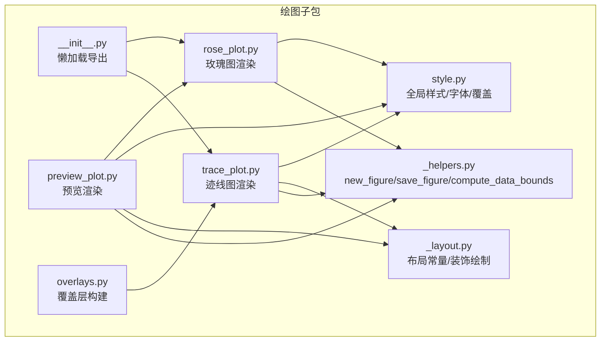
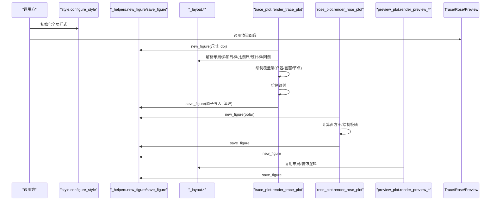
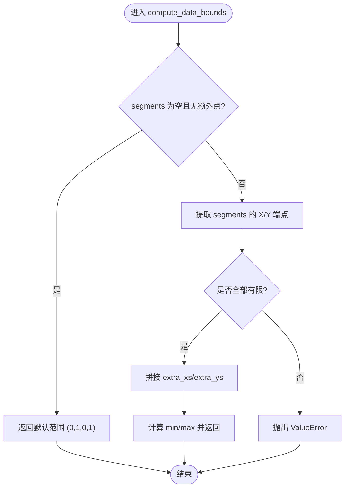
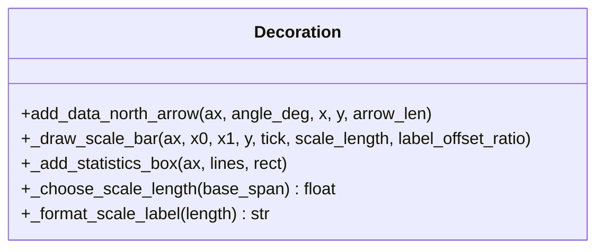
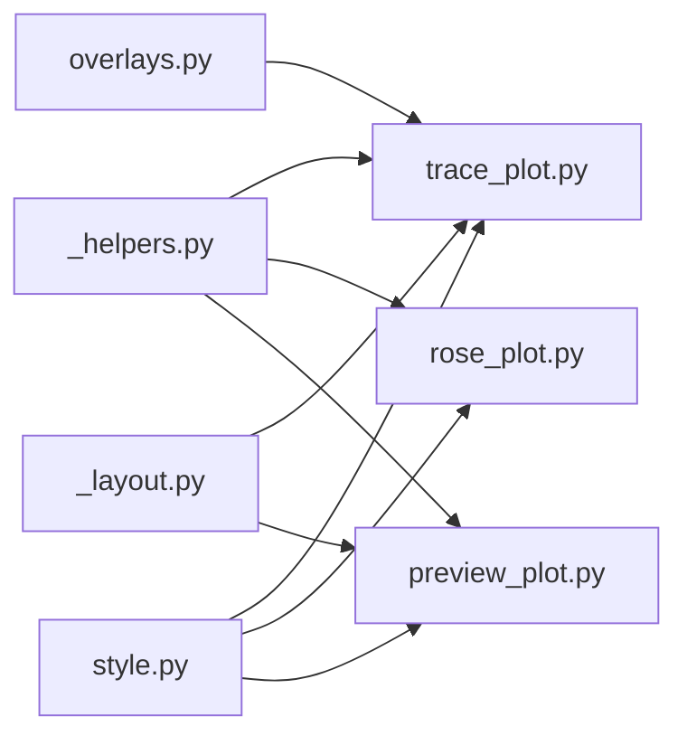

# 绘图辅助工具

<cite>
**本文引用的文件**   
- [trace_pipeline/plotting/__init__.py](file://trace_pipeline/plotting/__init__.py)
- [trace_pipeline/plotting/_helpers.py](file://trace_pipeline/plotting/_helpers.py)
- [trace_pipeline/plotting/_layout.py](file://trace_pipeline/plotting/_layout.py)
- [trace_pipeline/plotting/overlays.py](file://trace_pipeline/plotting/overlays.py)
- [trace_pipeline/plotting/style.py](file://trace_pipeline/plotting/style.py)
- [trace_pipeline/plotting/trace_plot.py](file://trace_pipeline/plotting/trace_plot.py)
- [trace_pipeline/plotting/rose_plot.py](file://trace_pipeline/plotting/rose_plot.py)
- [trace_pipeline/plotting/preview_plot.py](file://trace_pipeline/plotting/preview_plot.py)
- [tests/test_plotting.py](file://tests/test_plotting.py)
- [trace_pipeline/utils/mpl_init.py](file://trace_pipeline/utils/mpl_init.py)
- [backend/utils/cache.py](file://backend/utils/cache.py)
</cite>

## 目录
1. [简介](#简介)
2. [项目结构](#项目结构)
3. [核心组件](#核心组件)
4. [架构总览](#架构总览)
5. [详细组件分析](#详细组件分析)
6. [依赖关系分析](#依赖关系分析)
7. [性能与内存优化](#性能与内存优化)
8. [故障排查指南](#故障排查指南)
9. [结论](#结论)
10. [附录：使用示例与集成指南](#附录使用示例与集成指南)

## 简介
本技术文档聚焦于绘图辅助工具子包，系统解析通用绘图函数库（new_figure、save_figure、compute_data_bounds）、装饰元素绘制工具（指北针、刻度条、统计框）的实现算法，数据验证与预处理策略，以及性能优化工具（批量操作、缓存机制、内存管理）。文档同时提供完整的使用示例与集成指南，帮助读者快速理解并正确集成到业务管线中。

## 项目结构
绘图相关代码集中在 trace_pipeline/plotting 下，采用“通用辅助 + 布局常量 + 具体渲染器”的分层组织方式：
- _helpers.py：通用辅助（Figure 创建、保存、共享装饰元素、范围计算）
- _layout.py：布局常量与共享装饰绘制（外框、比例尺带、统计框、图例、节点样式）
- style.py：全局样式与字体配置（含线程安全覆盖）
- trace_plot.py：迹线图渲染入口与覆盖层数据结构
- rose_plot.py：玫瑰花瓣图渲染
- preview_plot.py：独立预览渲染（演示数据，与业务解耦）
- overlays.py：覆盖层构建（圆窗、凸包、节点），供 pipeline 与后端服务复用
- __init__.py：懒加载导出，避免提前导入 pyplot

图表来源
- [trace_pipeline/plotting/__init__.py:1-36](file://trace_pipeline/plotting/__init__.py#L1-L36)
- [trace_pipeline/plotting/_helpers.py:1-192](file://trace_pipeline/plotting/_helpers.py#L1-L192)
- [trace_pipeline/plotting/_layout.py:1-653](file://trace_pipeline/plotting/_layout.py#L1-L653)
- [trace_pipeline/plotting/style.py:1-296](file://trace_pipeline/plotting/style.py#L1-L296)
- [trace_pipeline/plotting/trace_plot.py:1-565](file://trace_pipeline/plotting/trace_plot.py#L1-L565)
- [trace_pipeline/plotting/rose_plot.py:1-140](file://trace_pipeline/plotting/rose_plot.py#L1-L140)
- [trace_pipeline/plotting/preview_plot.py:1-495](file://trace_pipeline/plotting/preview_plot.py#L1-L495)
- [trace_pipeline/plotting/overlays.py:1-156](file://trace_pipeline/plotting/overlays.py#L1-L156)

章节来源
- [trace_pipeline/plotting/__init__.py:1-36](file://trace_pipeline/plotting/__init__.py#L1-L36)

## 核心组件
- new_figure：按厘米尺寸创建 Figure/Axes，设置白色背景；支持 DPI 与 subplot_kw 透传。
- save_figure：原子写入（临时文件+重命名），自动关闭图形，透明背景兼容，记录保存耗时日志。
- compute_data_bounds：向量化计算数据范围，统一处理 segments 与额外点集（凸包、圆窗、节点等），包含 NaN/inf 校验。
- 装饰元素：
  - 指北针：在数据坐标或 transAxes 坐标系下绘制箭头与 N 标签。
  - 比例尺带：根据数据跨度自适应选择规整长度（1/2/5×10ⁿ），绘制横线与两端 tick 及单位文本。
  - 统计框：半透明矩形背景，标题与分隔线，多行键值对，字号随行数自适应。
- 样式与字体：
  - configure_style：幂等配置 matplotlib 全局样式，CJK 与西文字体回退链，数学文本字体定制。
  - apply_style_overrides：线程安全的临时样式覆盖，退出自动恢复。
- 覆盖层构建：
  - 圆窗、凸包、节点覆盖层从原始几何/统计数据构建，支持旋转到测线坐标系。

章节来源
- [trace_pipeline/plotting/_helpers.py:26-93](file://trace_pipeline/plotting/_helpers.py#L26-L93)
- [trace_pipeline/plotting/_helpers.py:160-192](file://trace_pipeline/plotting/_helpers.py#L160-L192)
- [trace_pipeline/plotting/_layout.py:179-201](file://trace_pipeline/plotting/_layout.py#L179-L201)
- [trace_pipeline/plotting/_layout.py:262-357](file://trace_pipeline/plotting/_layout.py#L262-L357)
- [trace_pipeline/plotting/style.py:187-256](file://trace_pipeline/plotting/style.py#L187-L256)
- [trace_pipeline/plotting/style.py:258-296](file://trace_pipeline/plotting/style.py#L258-L296)
- [trace_pipeline/plotting/overlays.py:33-83](file://trace_pipeline/plotting/overlays.py#L33-L83)
- [trace_pipeline/plotting/overlays.py:86-114](file://trace_pipeline/plotting/overlays.py#L86-L114)
- [trace_pipeline/plotting/overlays.py:117-155](file://trace_pipeline/plotting/overlays.py#L117-L155)

## 架构总览
下图展示了渲染主流程与关键模块交互：

图表来源
- [trace_pipeline/plotting/trace_plot.py:443-565](file://trace_pipeline/plotting/trace_plot.py#L443-L565)
- [trace_pipeline/plotting/rose_plot.py:106-140](file://trace_pipeline/plotting/rose_plot.py#L106-L140)
- [trace_pipeline/plotting/preview_plot.py:285-447](file://trace_pipeline/plotting/preview_plot.py#L285-L447)
- [trace_pipeline/plotting/_helpers.py:26-93](file://trace_pipeline/plotting/_helpers.py#L26-L93)
- [trace_pipeline/plotting/_layout.py:362-391](file://trace_pipeline/plotting/_layout.py#L362-L391)

## 详细组件分析

### 通用绘图函数库
- new_figure
  - 输入：figsize_cm（厘米）、dpi、subplot_kw
  - 输出：(fig, ax)，背景为白色
  - 关键点：将厘米转换为英寸，创建子图后设置背景色
- save_figure
  - 输入：fig、output_dir、filename、dpi、pad_inches、bbox_inches
  - 行为：检测透明背景，构造保存参数；先写临时文件再原子替换；finally 中关闭 figure 并清理残留临时文件；记录保存耗时
- compute_data_bounds
  - 输入：segments(N,4)、可选 extra_xs/extra_ys
  - 行为：向量化拼接所有 X/Y 坐标，校验有限性，返回 (x_min, x_max, y_min, y_max)；空数据时返回默认范围

图表来源
- [trace_pipeline/plotting/_helpers.py:160-192](file://trace_pipeline/plotting/_helpers.py#L160-L192)

章节来源
- [trace_pipeline/plotting/_helpers.py:26-93](file://trace_pipeline/plotting/_helpers.py#L26-L93)
- [trace_pipeline/plotting/_helpers.py:160-192](file://trace_pipeline/plotting/_helpers.py#L160-L192)

### 装饰元素绘制工具
- 指北针
  - 几何计算：基于角度计算 base/tip/label 坐标与方向分量，供数据坐标版与 transAxes 版共用
  - 绘制：annotate 箭头 + text 标注 “N”，zorder 置顶，clip_on=False
- 比例尺带
  - 自适应长度：根据数据跨度选择 1/2/5×10ⁿ 序列
  - 绘制：横线 + 两端竖 tick + 单位文本（m/cm 自动切换）
- 统计框
  - 布局：半透明矩形背景，标题与分隔线，键值对两列对齐
  - 字号自适应：按行数收缩字号，避免纵向重叠
  - 单位规范化：普通单位转 mathtext，保证 Times New Roman 风格

图表来源
- [trace_pipeline/plotting/_helpers.py:99-158](file://trace_pipeline/plotting/_helpers.py#L99-L158)
- [trace_pipeline/plotting/_layout.py:179-201](file://trace_pipeline/plotting/_layout.py#L179-L201)
- [trace_pipeline/plotting/_layout.py:262-357](file://trace_pipeline/plotting/_layout.py#L262-L357)

章节来源
- [trace_pipeline/plotting/_helpers.py:99-158](file://trace_pipeline/plotting/_helpers.py#L99-L158)
- [trace_pipeline/plotting/_layout.py:179-201](file://trace_pipeline/plotting/_layout.py#L179-L201)
- [trace_pipeline/plotting/_layout.py:262-357](file://trace_pipeline/plotting/_layout.py#L262-L357)

### 数据验证与预处理工具
- 数值有效性
  - compute_data_bounds 对 segments 进行 isfinite 检查，遇到 NaN/inf 直接抛错
  - rose_plot 对折叠后的产状数组进行 isfinite 检查，分箱宽度限制在 (0,180]
- 类型与配置规范
  - validation.coerce_positive_int/coerce_positive_float：强制正数/正整数
  - coerce_rose_bin_width：确保分箱宽度合法
  - coerce_window_strategy/coerce_node_label_mode：枚举值规范化
- 前端/后端缓存与变更检测
  - TTLCache：线程安全 TTL+LRU，批量驱逐过期条目，支持前缀失效
  - DirectoryChangeDetector：浅层快照对比，检测目录外部变更

章节来源
- [trace_pipeline/plotting/_helpers.py:160-192](file://trace_pipeline/plotting/_helpers.py#L160-L192)
- [trace_pipeline/plotting/rose_plot.py:76-103](file://trace_pipeline/plotting/rose_plot.py#L76-L103)
- [trace_pipeline/validation.py:41-87](file://trace_pipeline/validation.py#L41-L87)
- [backend/utils/cache.py:18-90](file://backend/utils/cache.py#L18-L90)
- [backend/utils/cache.py:92-155](file://backend/utils/cache.py#L92-L155)

### 性能优化工具
- 批量操作
  - 节点覆盖层按类型分组后批量 scatter，减少多次 plot 调用开销
  - 图例渲染统一骨架，通过 items/styles 注入，消除重复布局代码
- 缓存机制
  - 样式字体扫描缓存：_get_font_cache 使用 lru_cache，仅一次扫描系统字体
  - TTLCache：TTL+LRU，批量驱逐，降低频繁清理成本
- 内存管理策略
  - save_figure 原子写入与 finally 清理，避免进程异常中断产生损坏文件
  - 非交互式后端 Agg 强制设置，避免 GUI 后端在多进程/后台线程中的冲突
  - 按需懒加载导出，避免导入时提前加载 pyplot

章节来源
- [trace_pipeline/plotting/trace_plot.py:320-357](file://trace_pipeline/plotting/trace_plot.py#L320-L357)
- [trace_pipeline/plotting/_layout.py:447-569](file://trace_pipeline/plotting/_layout.py#L447-L569)
- [trace_pipeline/plotting/style.py:82-100](file://trace_pipeline/plotting/style.py#L82-L100)
- [backend/utils/cache.py:18-90](file://backend/utils/cache.py#L18-L90)
- [trace_pipeline/plotting/_helpers.py:42-93](file://trace_pipeline/plotting/_helpers.py#L42-L93)
- [trace_pipeline/utils/mpl_init.py:12-24](file://trace_pipeline/utils/mpl_init.py#L12-L24)
- [trace_pipeline/plotting/__init__.py:18-25](file://trace_pipeline/plotting/__init__.py#L18-L25)

## 依赖关系分析
- 模块耦合
  - trace_plot 与 preview_plot 均依赖 _helpers 与 _layout，实现高内聚低耦合
  - overlays 依赖 trace_plot 的数据类，向上游暴露构建接口
  - style 被各渲染器统一调用，提供一致的视觉风格
- 外部依赖
  - matplotlib.pyplot（Agg 后端）
  - numpy（向量化计算）
  - threading/OrderedDict（缓存并发控制）

图表来源
- [trace_pipeline/plotting/_helpers.py:1-22](file://trace_pipeline/plotting/_helpers.py#L1-L22)
- [trace_pipeline/plotting/_layout.py:1-34](file://trace_pipeline/plotting/_layout.py#L1-L34)
- [trace_pipeline/plotting/style.py:1-20](file://trace_pipeline/plotting/style.py#L1-L20)
- [trace_pipeline/plotting/trace_plot.py:15-29](file://trace_pipeline/plotting/trace_plot.py#L15-L29)
- [trace_pipeline/plotting/rose_plot.py:10-13](file://trace_pipeline/plotting/rose_plot.py#L10-L13)
- [trace_pipeline/plotting/preview_plot.py:17-33](file://trace_pipeline/plotting/preview_plot.py#L17-L33)
- [trace_pipeline/plotting/overlays.py:15-20](file://trace_pipeline/plotting/overlays.py#L15-L20)

章节来源
- [trace_pipeline/plotting/trace_plot.py:15-29](file://trace_pipeline/plotting/trace_plot.py#L15-L29)
- [trace_pipeline/plotting/rose_plot.py:10-13](file://trace_pipeline/plotting/rose_plot.py#L10-L13)
- [trace_pipeline/plotting/preview_plot.py:17-33](file://trace_pipeline/plotting/preview_plot.py#L17-L33)
- [trace_pipeline/plotting/overlays.py:15-20](file://trace_pipeline/plotting/overlays.py#L15-L20)

## 性能与内存优化
- 渲染路径优化
  - 自适应 figsize：根据数据跨度与目标物理尺度计算，使不同图之间 1m 的物理长度尽量一致
  - 批量绘制：节点按类型分组，一次性 scatter，减少渲染开销
- 缓存与惰性加载
  - 字体扫描缓存：lru_cache 避免重复扫描系统字体
  - 懒加载导出：仅在访问属性时导入对应模块，避免启动时加载 pyplot
- 文件 I/O 健壮性
  - 原子写入：临时文件 + replace，避免部分写入导致损坏
  - 资源释放：finally 中关闭 figure 并清理临时文件
- 后端与并发
  - 强制 Agg 后端，避免 GUI 后端在多进程/后台线程中的冲突
  - TTLCache 批量驱逐，降低频繁清理带来的锁竞争

[本节为通用指导，不直接分析具体文件]

## 故障排查指南
- 常见问题
  - 中文显示异常：确认 configure_style 已调用，字体回退链生效
  - 保存失败或文件损坏：检查 save_figure 的临时文件清理与权限
  - 多进程崩溃：确保 force_noninteractive_backend 在导入绘图模块前执行
  - 空数据或非法数值：compute_data_bounds 与 rose 直方图会抛错，需前置校验
- 定位建议
  - 查看日志：savefig 耗时与阶段信息，便于定位 IO 瓶颈
  - 单元测试：参考测试用例，验证基本渲染与样式覆盖

章节来源
- [trace_pipeline/plotting/_helpers.py:42-93](file://trace_pipeline/plotting/_helpers.py#L42-L93)
- [trace_pipeline/utils/mpl_init.py:12-24](file://trace_pipeline/utils/mpl_init.py#L12-L24)
- [tests/test_plotting.py:18-98](file://tests/test_plotting.py#L18-L98)

## 结论
绘图辅助工具通过分层设计实现了高内聚、低耦合的渲染能力：通用辅助负责基础能力，布局与装饰提供可复用的视觉构件，样式与字体保障一致性，覆盖层构建提升扩展性。配合严格的数值校验、原子写入与缓存机制，整体具备良好性能与稳定性。

[本节为总结，不直接分析具体文件]

## 附录：使用示例与集成指南

### 基本用法
- 渲染迹线图
  - 调用 render_trace_plot(segments, title, output_dir, filename, ...)
  - 可选：circle_windows、hull_overlay、node_overlays、statistics_lines、area_source、background_color
- 渲染玫瑰图
  - 调用 render_rose_plot(strike_deg, title, output_dir, filename, bin_width=10.0, ...)
- 预览渲染
  - 调用 render_preview_trace/render_preview_rose，传入样式字典与开关项

章节来源
- [trace_pipeline/plotting/trace_plot.py:443-565](file://trace_pipeline/plotting/trace_plot.py#L443-L565)
- [trace_pipeline/plotting/rose_plot.py:106-140](file://trace_pipeline/plotting/rose_plot.py#L106-L140)
- [trace_pipeline/plotting/preview_plot.py:285-447](file://trace_pipeline/plotting/preview_plot.py#L285-L447)

### 覆盖层构建与旋转
- 原始圆窗覆盖层：build_raw_circle_overlays(trace, statistics)
- 旋转到测线坐标系：build_rotated_circle_overlays(trace, raw_overlays)
- 凸包覆盖层：build_selected_hull_overlays(trace, statistics)
- 节点覆盖层：build_node_overlays(node_analysis) / build_rotated_node_overlays(...)

章节来源
- [trace_pipeline/plotting/overlays.py:33-83](file://trace_pipeline/plotting/overlays.py#L33-L83)
- [trace_pipeline/plotting/overlays.py:86-114](file://trace_pipeline/plotting/overlays.py#L86-L114)
- [trace_pipeline/plotting/overlays.py:117-155](file://trace_pipeline/plotting/overlays.py#L117-L155)

### 样式与字体
- 全局样式：configure_style()
- 临时覆盖：apply_style_overrides({"trace_line_width": 1.2}) 上下文管理器
- 字体族：heading_font_kwargs/body_font_kwargs 返回字体参数

章节来源
- [trace_pipeline/plotting/style.py:187-256](file://trace_pipeline/plotting/style.py#L187-L256)
- [trace_pipeline/plotting/style.py:258-296](file://trace_pipeline/plotting/style.py#L258-L296)

### 数据验证与预处理
- 数值校验：compute_data_bounds 与 rose 直方图内置 isfinite 检查
- 配置规范化：coerce_positive_int/coerce_positive_float/coerce_rose_bin_width 等
- 缓存与变更检测：TTLCache 与 DirectoryChangeDetector

章节来源
- [trace_pipeline/plotting/_helpers.py:160-192](file://trace_pipeline/plotting/_helpers.py#L160-L192)
- [trace_pipeline/plotting/rose_plot.py:76-103](file://trace_pipeline/plotting/rose_plot.py#L76-L103)
- [trace_pipeline/validation.py:41-87](file://trace_pipeline/validation.py#L41-L87)
- [backend/utils/cache.py:18-90](file://backend/utils/cache.py#L18-L90)
- [backend/utils/cache.py:92-155](file://backend/utils/cache.py#L92-L155)

### 集成要点
- 在导入绘图模块前调用 force_noninteractive_backend()
- 使用 apply_style_overrides 进行局部样式覆盖，避免污染全局
- 使用懒加载导出，按需 import 以缩短启动时间
- 结合 TTLCache 缓存中间结果（如直方图、覆盖层顶点）以提升批量渲染性能

章节来源
- [trace_pipeline/utils/mpl_init.py:12-24](file://trace_pipeline/utils/mpl_init.py#L12-L24)
- [trace_pipeline/plotting/__init__.py:18-25](file://trace_pipeline/plotting/__init__.py#L18-L25)
- [backend/utils/cache.py:18-90](file://backend/utils/cache.py#L18-L90)