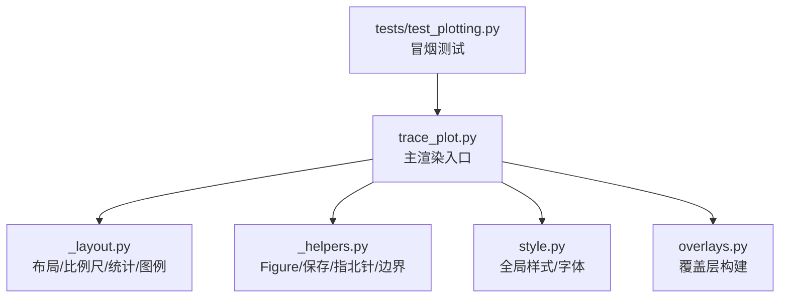
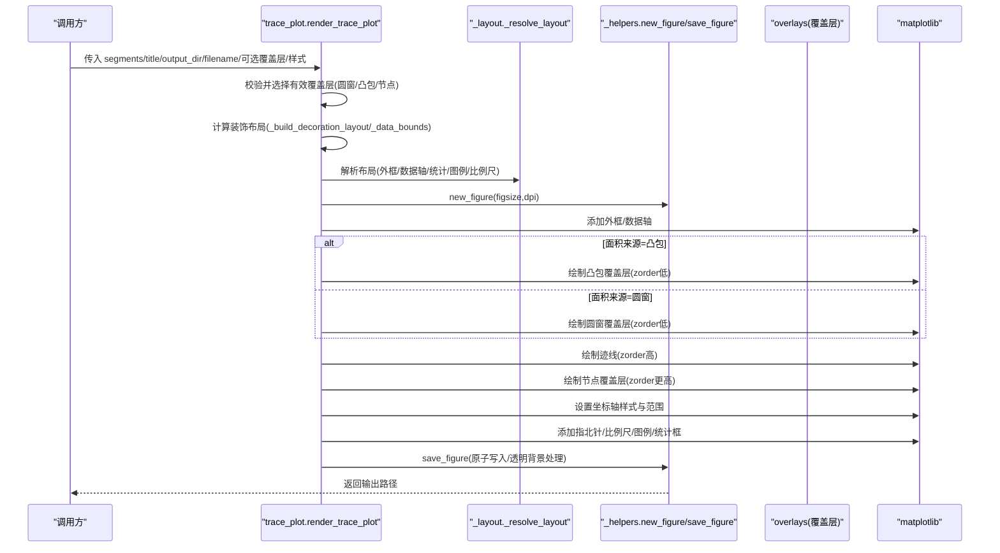
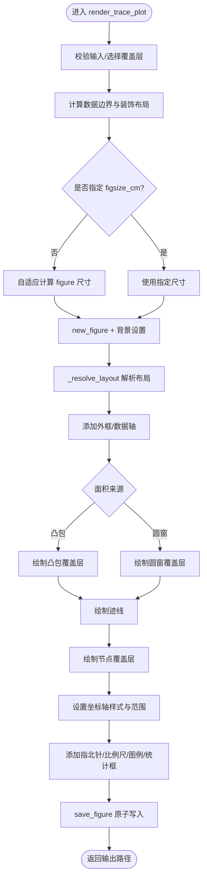
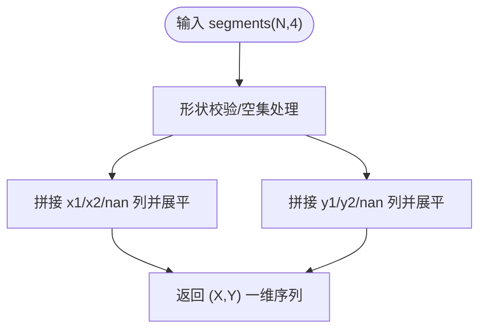
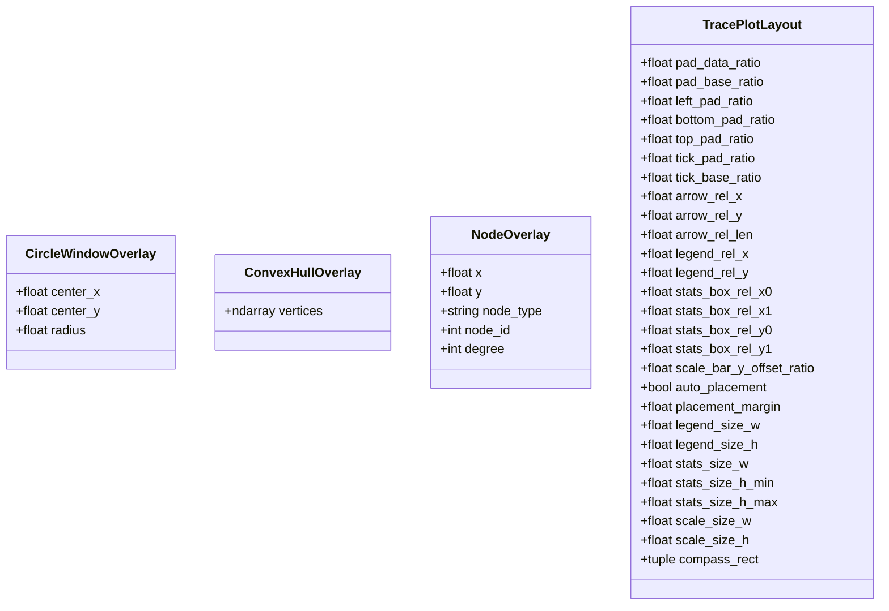
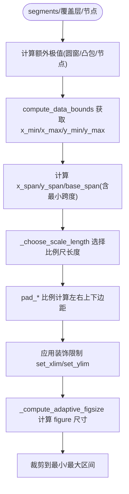
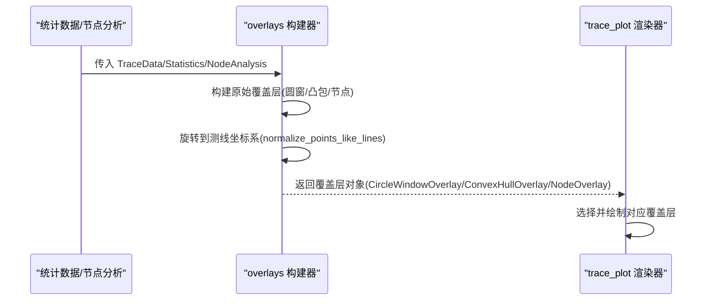
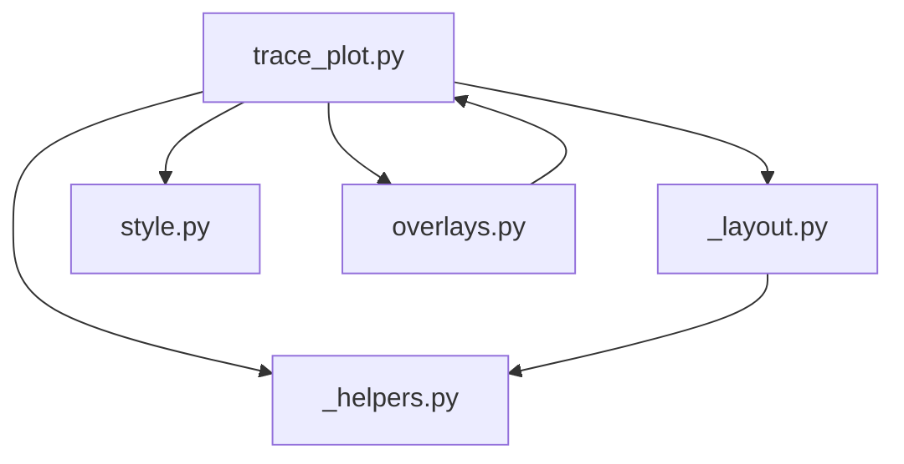

# 迹线图绘制

<cite>
**本文引用的文件**   
- [trace_pipeline/plotting/trace_plot.py](file://trace_pipeline/plotting/trace_plot.py)
- [trace_pipeline/plotting/_layout.py](file://trace_pipeline/plotting/_layout.py)
- [trace_pipeline/plotting/_helpers.py](file://trace_pipeline/plotting/_helpers.py)
- [trace_pipeline/plotting/style.py](file://trace_pipeline/plotting/style.py)
- [trace_pipeline/plotting/overlays.py](file://trace_pipeline/plotting/overlays.py)
- [tests/test_plotting.py](file://tests/test_plotting.py)
</cite>

## 目录
1. [简介](#简介)
2. [项目结构](#项目结构)
3. [核心组件](#核心组件)
4. [架构总览](#架构总览)
5. [详细组件分析](#详细组件分析)
6. [依赖关系分析](#依赖关系分析)
7. [性能考量](#性能考量)
8. [故障排查指南](#故障排查指南)
9. [结论](#结论)
10. [附录：API 参考](#附录api-参考)

## 简介
本技术文档聚焦于“迹线图绘制”模块，围绕以下目标展开：
- 深入解析 render_trace_plot 函数的核心算法与渲染流程（线段数据转换、坐标变换、matplotlib 渲染）。
- 详解 segments_to_xy 的 NaN 分隔机制，实现多线段的批量高效绘制。
- 说明图层叠加系统（凸包覆盖层、圆窗覆盖层、节点覆盖层）及 z-order 管理策略。
- 解释自适应布局算法，根据数据范围动态计算 figure 尺寸与边距比例。
- 提供完整 API 参考，包含参数配置、样式定制方法与性能优化技巧。

## 项目结构
迹线图绘制相关代码位于 plotting 子包中，采用分层组织：
- trace_plot.py：主入口函数、覆盖层数据结构、绘图流程控制、z-order 与样式常量。
- _layout.py：共享布局工具、比例尺、统计框、图例、外框等通用逻辑。
- _helpers.py：Figure 创建/保存、指北针绘制、数据边界计算等通用辅助。
- style.py：全局样式与字体配置、样式覆盖上下文管理器。
- overlays.py：覆盖层构建（圆窗、凸包、节点），供上层服务统一调用。
- tests/test_plotting.py：冒烟测试，验证渲染输出与基本功能。

图表来源
- [trace_pipeline/plotting/trace_plot.py:1-565](file://trace_pipeline/plotting/trace_plot.py#L1-L565)
- [trace_pipeline/plotting/_layout.py:1-653](file://trace_pipeline/plotting/_layout.py#L1-L653)
- [trace_pipeline/plotting/_helpers.py:1-192](file://trace_pipeline/plotting/_helpers.py#L1-L192)
- [trace_pipeline/plotting/style.py:1-296](file://trace_pipeline/plotting/style.py#L1-L296)
- [trace_pipeline/plotting/overlays.py:1-156](file://trace_pipeline/plotting/overlays.py#L1-L156)
- [tests/test_plotting.py:1-98](file://tests/test_plotting.py#L1-L98)

章节来源
- [trace_pipeline/plotting/trace_plot.py:1-565](file://trace_pipeline/plotting/trace_plot.py#L1-L565)
- [trace_pipeline/plotting/_layout.py:1-653](file://trace_pipeline/plotting/_layout.py#L1-L653)
- [trace_pipeline/plotting/_helpers.py:1-192](file://trace_pipeline/plotting/_helpers.py#L1-L192)
- [trace_pipeline/plotting/style.py:1-296](file://trace_pipeline/plotting/style.py#L1-L296)
- [trace_pipeline/plotting/overlays.py:1-156](file://trace_pipeline/plotting/overlays.py#L1-L156)
- [tests/test_plotting.py:1-98](file://tests/test_plotting.py#L1-L98)

## 核心组件
- 主渲染函数：render_trace_plot
  - 负责输入校验、覆盖层选择、布局计算、图层绘制顺序、装饰元素添加与图像保存。
- 线段转坐标：segments_to_xy
  - 将 (N,4) 线段数组转换为带 NaN 分隔的一维 X/Y 序列，使 matplotlib 自动断开各线段。
- 覆盖层数据结构：CircleWindowOverlay、ConvexHullOverlay、NodeOverlay
  - 用于描述圆窗、凸包、节点三类覆盖层的几何与样式信息。
- 布局与装饰：_layout 模块
  - 提供外框、比例尺、统计框、图例、自适应布局解析等工具。
- 辅助工具：_helpers 模块
  - 提供 Figure 创建/保存、指北针绘制、数据边界计算等。
- 样式系统：style 模块
  - 提供全局样式配置、字体栈、样式覆盖上下文管理器。
- 覆盖层构建：overlays 模块
  - 从统计数据或节点分析结果生成覆盖层对象，支持原始坐标系与测线坐标系旋转。

章节来源
- [trace_pipeline/plotting/trace_plot.py:72-133](file://trace_pipeline/plotting/trace_plot.py#L72-L133)
- [trace_pipeline/plotting/trace_plot.py:151-169](file://trace_pipeline/plotting/trace_plot.py#L151-L169)
- [trace_pipeline/plotting/_layout.py:362-391](file://trace_pipeline/plotting/_layout.py#L362-L391)
- [trace_pipeline/plotting/_helpers.py:26-93](file://trace_pipeline/plotting/_helpers.py#L26-L93)
- [trace_pipeline/plotting/style.py:187-256](file://trace_pipeline/plotting/style.py#L187-L256)
- [trace_pipeline/plotting/overlays.py:33-156](file://trace_pipeline/plotting/overlays.py#L33-L156)

## 架构总览
下图展示了 render_trace_plot 的整体调用链与数据流，包括布局计算、图层叠加、装饰元素与保存流程。

图表来源
- [trace_pipeline/plotting/trace_plot.py:443-565](file://trace_pipeline/plotting/trace_plot.py#L443-L565)
- [trace_pipeline/plotting/_layout.py:362-391](file://trace_pipeline/plotting/_layout.py#L362-L391)
- [trace_pipeline/plotting/_helpers.py:26-93](file://trace_pipeline/plotting/_helpers.py#L26-L93)

## 详细组件分析

### 核心算法：render_trace_plot
- 输入与预处理
  - 接收 segments(N,4)、title、output_dir、filename 以及可选覆盖层与样式。
  - 通过 _valid_circles 过滤无效圆窗；根据 area_source 决定使用凸包或圆窗。
- 布局与尺寸
  - 使用 _data_bounds 聚合 segments、圆窗、凸包、节点的坐标极值，结合最小跨度约束计算 x/y 跨度与 base_span。
  - 依据 _choose_scale_length 选择规整比例尺长度，再按 pad_* 比例计算左右上下边距。
  - 若未显式指定 figsize_cm，则通过 _compute_adaptive_figsize 基于数据范围与目标物理尺度计算 figure 尺寸，并裁剪到最小/最大区间。
- 渲染流程
  - 创建 Figure/Axes，移除默认 axes，设置背景色或透明。
  - 解析布局，添加外框与数据轴。
  - 图层叠加顺序（由 z-order 控制）：
    - 底层：凸包或圆窗（二选一）。
    - 顶层：迹线。
    - 节点覆盖层（在迹线之上）。
  - 设置坐标轴样式与范围，添加指北针、比例尺、图例、统计框。
  - 保存为 PNG，支持透明背景与原子写入。

图表来源
- [trace_pipeline/plotting/trace_plot.py:198-266](file://trace_pipeline/plotting/trace_plot.py#L198-L266)
- [trace_pipeline/plotting/trace_plot.py:420-441](file://trace_pipeline/plotting/trace_plot.py#L420-L441)
- [trace_pipeline/plotting/trace_plot.py:443-565](file://trace_pipeline/plotting/trace_plot.py#L443-L565)

章节来源
- [trace_pipeline/plotting/trace_plot.py:198-266](file://trace_pipeline/plotting/trace_plot.py#L198-L266)
- [trace_pipeline/plotting/trace_plot.py:420-441](file://trace_pipeline/plotting/trace_plot.py#L420-L441)
- [trace_pipeline/plotting/trace_plot.py:443-565](file://trace_pipeline/plotting/trace_plot.py#L443-L565)

### 线段数据转换：segments_to_xy 与 NaN 分隔机制
- 输入格式
  - segments 为 (N,4) 数组，每行表示一条线段的两端点坐标 (x1,y1,x2,y2)。
- 转换过程
  - 对每条线段，依次取起点与终点坐标，并在其后插入一个 NaN 作为分隔符。
  - 最终得到一维 X 与 Y 序列，长度约为 3N。
- 效果
  - matplotlib 的 line plot 遇到 NaN 会断开连线，从而实现多条独立线段的批量绘制，避免循环逐段绘制的开销。
- 复杂度
  - 时间 O(N)，空间 O(N)，向量化操作，适合大规模数据。

图表来源
- [trace_pipeline/plotting/trace_plot.py:151-169](file://trace_pipeline/plotting/trace_plot.py#L151-L169)

章节来源
- [trace_pipeline/plotting/trace_plot.py:151-169](file://trace_pipeline/plotting/trace_plot.py#L151-L169)

### 图层叠加系统与 z-order 管理
- 覆盖层类型
  - 凸包覆盖层：蓝色虚线边框+浅蓝填充，z-order 较低，置于底层。
  - 圆窗覆盖层：橙色虚线边框+浅橙填充，z-order 较低，置于底层。
  - 节点覆盖层：按节点类型分组批量 scatter，z-order 高于迹线，确保可见性。
- 绘制顺序
  - 先绘制覆盖层（凸包或圆窗），再绘制迹线，最后绘制节点覆盖层。
- 样式与颜色
  - 通过模块级常量定义颜色、线宽、透明度与线型，便于统一管理与样式覆盖。

图表来源
- [trace_pipeline/plotting/trace_plot.py:72-133](file://trace_pipeline/plotting/trace_plot.py#L72-L133)

章节来源
- [trace_pipeline/plotting/trace_plot.py:283-357](file://trace_pipeline/plotting/trace_plot.py#L283-L357)
- [trace_pipeline/plotting/trace_plot.py:359-418](file://trace_pipeline/plotting/trace_plot.py#L359-L418)

### 自适应布局算法
- 数据边界计算
  - 聚合 segments、圆窗、凸包、节点的坐标，计算 x/y 的最小/最大值。
  - 引入最小跨度约束，防止极端小数据导致布局异常。
- 边距与比例尺
  - 根据 x/y 跨度与 base_span，结合 pad_* 比例计算左右上下边距。
  - 选择规整比例尺长度（1/2/5 × 10ⁿ），保证刻度美观。
- 自适应 figure 尺寸
  - 以目标物理尺度（cm/m）为依据，结合 axes 占 figure 的比例，计算 figure 宽高。
  - 将结果裁剪到最小/最大区间，确保不同图之间 1m 的物理长度尽量一致。

图表来源
- [trace_pipeline/plotting/trace_plot.py:198-266](file://trace_pipeline/plotting/trace_plot.py#L198-L266)
- [trace_pipeline/plotting/_layout.py:179-194](file://trace_pipeline/plotting/_layout.py#L179-L194)
- [trace_pipeline/plotting/_helpers.py:160-192](file://trace_pipeline/plotting/_helpers.py#L160-L192)

章节来源
- [trace_pipeline/plotting/trace_plot.py:198-266](file://trace_pipeline/plotting/trace_plot.py#L198-L266)
- [trace_pipeline/plotting/_layout.py:179-194](file://trace_pipeline/plotting/_layout.py#L179-L194)
- [trace_pipeline/plotting/_helpers.py:160-192](file://trace_pipeline/plotting/_helpers.py#L160-L192)

### 覆盖层构建与坐标变换
- 圆窗覆盖层
  - 从诊断信息中提取圆心与半径，构造原始坐标系下的覆盖层。
  - 根据测线方位角进行旋转到测线坐标系，保持与迹线一致的投影。
- 凸包覆盖层
  - 根据露头面积来源选择原始凸包或缓冲凸包，再进行坐标归一化旋转到测线坐标系。
- 节点覆盖层
  - 将节点分析结果转换为覆盖层对象，支持旋转到测线坐标系。

图表来源
- [trace_pipeline/plotting/overlays.py:33-156](file://trace_pipeline/plotting/overlays.py#L33-L156)

章节来源
- [trace_pipeline/plotting/overlays.py:33-156](file://trace_pipeline/plotting/overlays.py#L33-L156)

### 样式与字体配置
- 全局样式
  - 配置字体族（优先 Times New Roman 与宋体）、数学文本字体、线条宽度、标记大小、DPI 等。
  - 标题与正文分别提供字体参数生成器，避免 CJK 字体缺少字重导致的警告。
- 样式覆盖
  - 提供 apply_style_overrides 上下文管理器，线程安全地临时覆盖模块级样式常量（如迹线颜色、线宽、凸包/圆窗样式等），退出时自动恢复。

章节来源
- [trace_pipeline/plotting/style.py:187-256](file://trace_pipeline/plotting/style.py#L187-L256)
- [trace_pipeline/plotting/style.py:258-296](file://trace_pipeline/plotting/style.py#L258-L296)

## 依赖关系分析
- 模块内依赖
  - trace_plot 依赖 _layout、_helpers、style 与 overlays。
  - _layout 依赖 _helpers 中的指北针几何计算与样式字体参数。
  - overlays 依赖 trace_plot 的覆盖层数据结构。
- 外部依赖
  - numpy：数值计算与数组操作。
  - matplotlib：图形绘制与保存。
- 潜在耦合
  - 样式常量集中在 trace_plot 模块，通过 style 模块的映射表进行覆盖，降低硬编码耦合。
  - 布局与装饰逻辑提取至 _layout，减少重复，提升可维护性。

图表来源
- [trace_pipeline/plotting/trace_plot.py:1-565](file://trace_pipeline/plotting/trace_plot.py#L1-L565)
- [trace_pipeline/plotting/_layout.py:1-653](file://trace_pipeline/plotting/_layout.py#L1-L653)
- [trace_pipeline/plotting/_helpers.py:1-192](file://trace_pipeline/plotting/_helpers.py#L1-L192)
- [trace_pipeline/plotting/style.py:1-296](file://trace_pipeline/plotting/style.py#L1-L296)
- [trace_pipeline/plotting/overlays.py:1-156](file://trace_pipeline/plotting/overlays.py#L1-L156)

章节来源
- [trace_pipeline/plotting/trace_plot.py:1-565](file://trace_pipeline/plotting/trace_plot.py#L1-L565)
- [trace_pipeline/plotting/_layout.py:1-653](file://trace_pipeline/plotting/_layout.py#L1-L653)
- [trace_pipeline/plotting/_helpers.py:1-192](file://trace_pipeline/plotting/_helpers.py#L1-L192)
- [trace_pipeline/plotting/style.py:1-296](file://trace_pipeline/plotting/style.py#L1-L296)
- [trace_pipeline/plotting/overlays.py:1-156](file://trace_pipeline/plotting/overlays.py#L1-L156)

## 性能考量
- 批量绘制
  - segments_to_xy 将 N 条线段合并为一维序列，利用 matplotlib 的 line plot 一次性绘制，显著降低 Python 层循环开销。
- 节点覆盖层
  - 按节点类型分组后批量 scatter，减少多次调用带来的开销。
- 自适应布局
  - 仅一次计算数据边界与布局，避免重复计算。
- 保存优化
  - 原子写入策略避免中断产生损坏文件；透明背景检测减少不必要的 facecolor 写入。

[本节为一般性指导，不直接分析具体文件]

## 故障排查指南
- 常见错误
  - segments 包含 NaN 或 inf：compute_data_bounds 会抛出 ValueError，需检查输入数据有效性。
  - 覆盖层无效：_valid_circles 会过滤掉非有限坐标或负半径的圆窗；凸包顶点不足 3 个会被忽略。
  - 样式覆盖死锁：apply_style_overrides 使用 RLock 保护，确保并发安全。
- 调试建议
  - 打印 _DecorationLayout 的关键字段（x_span、y_span、scale_length、边距）以定位布局问题。
  - 使用冒烟测试用例快速验证渲染输出与文件大小。

章节来源
- [trace_pipeline/plotting/_helpers.py:160-192](file://trace_pipeline/plotting/_helpers.py#L160-L192)
- [trace_pipeline/plotting/trace_plot.py:172-181](file://trace_pipeline/plotting/trace_plot.py#L172-L181)
- [trace_pipeline/plotting/trace_plot.py:302-317](file://trace_pipeline/plotting/trace_plot.py#L302-L317)
- [trace_pipeline/plotting/style.py:258-296](file://trace_pipeline/plotting/style.py#L258-L296)
- [tests/test_plotting.py:44-98](file://tests/test_plotting.py#L44-L98)

## 结论
迹线图绘制模块通过清晰的层次划分与模块化设计，实现了高效、可扩展的渲染流程。核心优势包括：
- 高效的线段批量绘制（NaN 分隔机制）。
- 灵活的图层叠加与 z-order 管理。
- 自适应布局与物理尺度一致性。
- 完善的样式与字体配置，支持论文风格输出。
- 健壮的覆盖层构建与坐标变换能力。

[本节为总结性内容，不直接分析具体文件]

## 附录：API 参考

### 主渲染函数：render_trace_plot
- 作用
  - 绘制并保存单张迹线长度图，支持覆盖层、统计信息、指北针、比例尺与图例。
- 关键参数
  - segments：numpy.ndarray，形状 (N,4)，每行表示一条线段两端点坐标。
  - title：str，图表标题，支持换行影响布局。
  - output_dir：str，输出目录。
  - filename：str，输出文件名。
  - dpi：int，图像分辨率，默认 300。
  - figsize_cm：tuple[float,float]|None，figure 尺寸（厘米），None 时启用自适应。
  - north_angle_deg：float，指北针角度（度）。
  - statistics_lines：Sequence[str]|None，统计信息行列表。
  - circle_windows：Sequence[CircleWindowOverlay]|None，圆窗覆盖层。
  - hull_overlay：ConvexHullOverlay|None，凸包覆盖层。
  - area_source：str，面积来源（""/hull/hull_buffered/measured/window/window_equivalent）。
  - node_overlays：Sequence[NodeOverlay]|None，节点覆盖层。
  - style：dict[str,Any]|None，样式覆盖字典（支持 node_style 预设名等）。
  - include_trace/include_hull/include_circles/include_nodes/include_decorations：bool，图层开关。
  - background_color：str，背景色，支持 "white"/"none"/"transparent"。
- 返回值
  - str，输出文件的完整路径。
- 注意事项
  - 当 area_source 为 hull 或 hull_buffered 且 hull_overlay 存在且顶点数≥3 时，绘制凸包覆盖层。
  - 当 area_source 为 window 或 window_equivalent 且存在有效圆窗时，绘制圆窗覆盖层。
  - 节点覆盖层按类型分组批量绘制，提升性能。
  - 自适应布局确保不同图之间 1m 的物理长度尽量一致。

章节来源
- [trace_pipeline/plotting/trace_plot.py:443-565](file://trace_pipeline/plotting/trace_plot.py#L443-L565)

### 线段转换函数：segments_to_xy
- 作用
  - 将 (N,4) 线段数组转为带 NaN 分隔的一维 X/Y 序列，使 matplotlib 的 line plot 自动断开各线段。
- 参数
  - segments：numpy.ndarray，形状 (N,4)。
- 返回值
  - tuple[np.ndarray,np.ndarray]，一维 X 与 Y 序列。
- 复杂度
  - 时间 O(N)，空间 O(N)。
- 异常
  - 若输入形状不为 (N,4)，抛出 ValueError。

章节来源
- [trace_pipeline/plotting/trace_plot.py:151-169](file://trace_pipeline/plotting/trace_plot.py#L151-L169)

### 覆盖层数据结构
- CircleWindowOverlay
  - 属性：center_x、center_y、radius。
- ConvexHullOverlay
  - 属性：vertices（N,2 顶点数组）。
- NodeOverlay
  - 属性：x、y、node_type（I/Y/X/overlap/multi）、node_id、degree。

章节来源
- [trace_pipeline/plotting/trace_plot.py:72-98](file://trace_pipeline/plotting/trace_plot.py#L72-L98)

### 布局与装饰工具（_layout 模块）
- _resolve_layout(title)
  - 根据标题行数动态解析各轴在 figure 中的位置（外框、数据轴、统计框、图例、比例尺）。
- _add_outer_frame(fig,bounds)
  - 添加外框 Axes，设置边框样式与透明度。
- _blank_panel_axes(fig,bounds,label)
  - 创建空白面板 Axes，隐藏坐标轴与边框。
- _add_scale_bar_band(ax,xlim,scale_length)
  - 在独立比例尺带中绘制与数据轴同尺度的比例尺。
- _add_statistics_box(ax,statistics_lines,rect=None)
  - 在主图内绘制统计信息框，支持半透明背景与自适应字号。
- _render_legend(ax,items,styles,...)
  - 绘制自适应图例框，支持迹线、凸包、圆窗与节点类型的图标与标签。
- _choose_scale_length(base_span)
  - 根据数据跨度自适应选择规整比例尺长度（1/2/5 × 10ⁿ）。
- _style_trace_data_axes(ax)
  - 设置数据轴样式（等比例、无刻度、白色背景、完整边框但隐藏 spines）。

章节来源
- [trace_pipeline/plotting/_layout.py:362-391](file://trace_pipeline/plotting/_layout.py#L362-L391)
- [trace_pipeline/plotting/_layout.py:397-420](file://trace_pipeline/plotting/_layout.py#L397-L420)
- [trace_pipeline/plotting/_layout.py:623-642](file://trace_pipeline/plotting/_layout.py#L623-L642)
- [trace_pipeline/plotting/_layout.py:262-357](file://trace_pipeline/plotting/_layout.py#L262-L357)
- [trace_pipeline/plotting/_layout.py:447-569](file://trace_pipeline/plotting/_layout.py#L447-L569)
- [trace_pipeline/plotting/_layout.py:179-194](file://trace_pipeline/plotting/_layout.py#L179-L194)
- [trace_pipeline/plotting/_layout.py:437-442](file://trace_pipeline/plotting/_layout.py#L437-L442)

### 辅助工具（_helpers 模块）
- new_figure(figsize_cm,dpi,subplot_kw=None)
  - 创建指定厘米尺寸的图形并返回 (fig, ax)，背景为白色。
- save_figure(fig,output_dir,filename,dpi,pad_inches,bbox_inches)
  - 保存并关闭图形，返回完整输出路径，支持透明背景与原子写入。
- add_data_north_arrow(ax,north_angle_deg,north_x,north_y,arrow_len)
  - 在数据坐标系下绘制指北针。
- compute_data_bounds(segments,extra_xs=None,extra_ys=None)
  - 计算迹线图的数据范围 (x_min,x_max,y_min,y_max)，支持额外坐标聚合。

章节来源
- [trace_pipeline/plotting/_helpers.py:26-93](file://trace_pipeline/plotting/_helpers.py#L26-L93)
- [trace_pipeline/plotting/_helpers.py:121-158](file://trace_pipeline/plotting/_helpers.py#L121-L158)
- [trace_pipeline/plotting/_helpers.py:160-192](file://trace_pipeline/plotting/_helpers.py#L160-L192)

### 样式系统（style 模块）
- configure_style()
  - 配置 matplotlib 全局样式以支持中文显示并符合论文规范（幂等）。
- heading_font_kwargs(**kwargs) / body_font_kwargs(**kwargs)
  - 返回标题/正文使用的字体参数，优先 Times New Roman 与宋体，避免 CJK 字体缺少字重的警告。
- apply_style_overrides(style)
  - 线程安全地临时应用样式覆盖，退出时自动恢复。

章节来源
- [trace_pipeline/plotting/style.py:187-256](file://trace_pipeline/plotting/style.py#L187-L256)
- [trace_pipeline/plotting/style.py:135-173](file://trace_pipeline/plotting/style.py#L135-L173)
- [trace_pipeline/plotting/style.py:258-296](file://trace_pipeline/plotting/style.py#L258-L296)

### 覆盖层构建（overlays 模块）
- build_raw_circle_overlays(trace,statistics)
  - 根据统计诊断信息构建原始坐标系下的圆窗覆盖层。
- build_rotated_circle_overlays(trace,raw_overlays)
  - 将原始圆窗覆盖层旋转到测线坐标系。
- build_selected_hull_overlays(trace,statistics)
  - 返回与露头面积来源一致的原始/旋转凸包覆盖物。
- build_node_overlays(node_analysis)
  - 将节点分析结果转换为绘图覆盖层。
- build_rotated_node_overlays(node_analysis,endpoints,scanline_azimuth)
  - 将原始节点覆盖层旋转到测线坐标系。

章节来源
- [trace_pipeline/plotting/overlays.py:33-156](file://trace_pipeline/plotting/overlays.py#L33-L156)

### 示例与测试
- 冒烟测试
  - 验证 render_trace_plot 可正常渲染并输出 PNG 文件。
  - 支持带圆窗覆盖层、统计信息框与样式覆盖的场景。

章节来源
- [tests/test_plotting.py:44-98](file://tests/test_plotting.py#L44-L98)