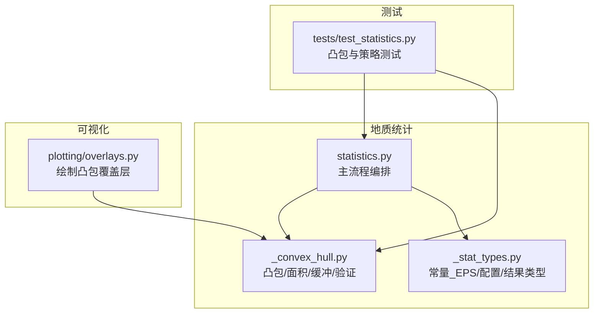
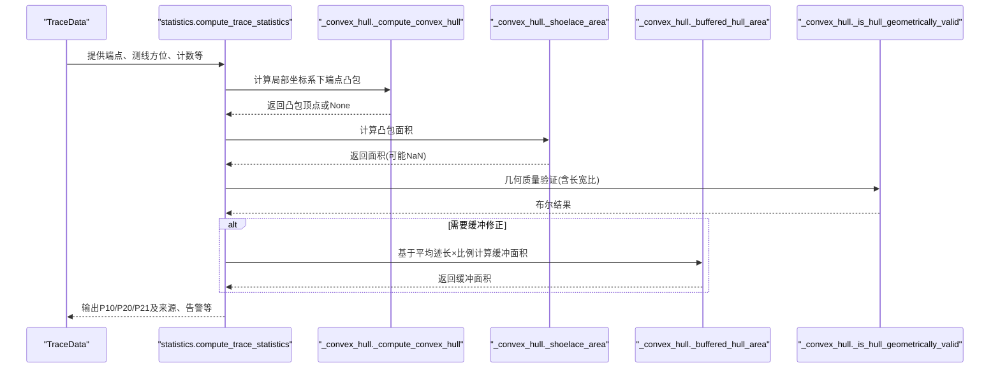
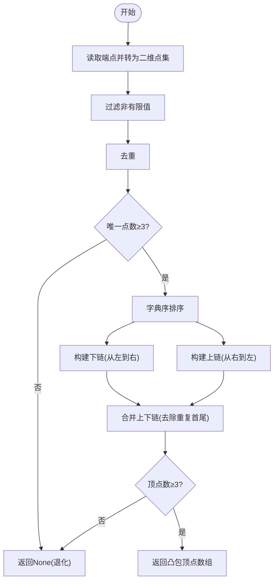
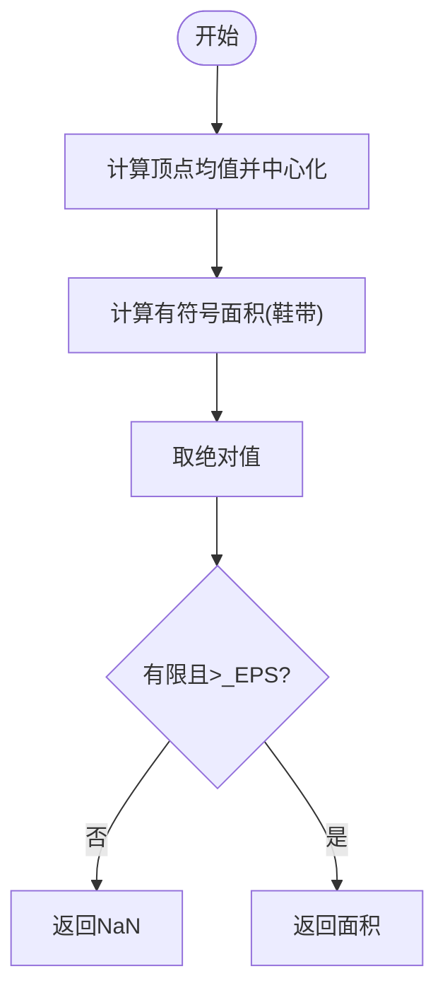
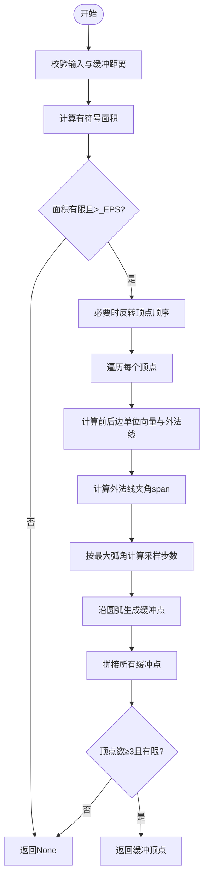
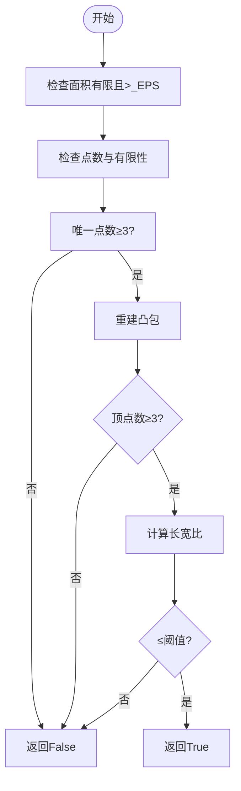
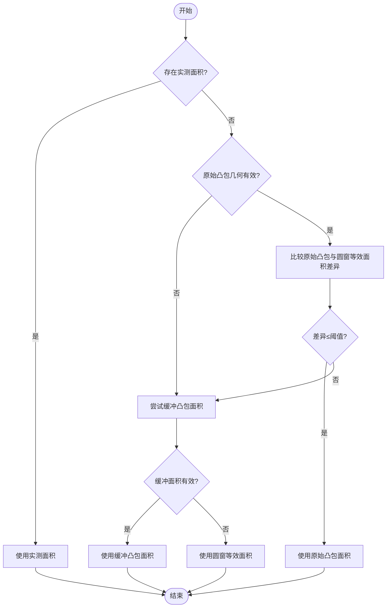
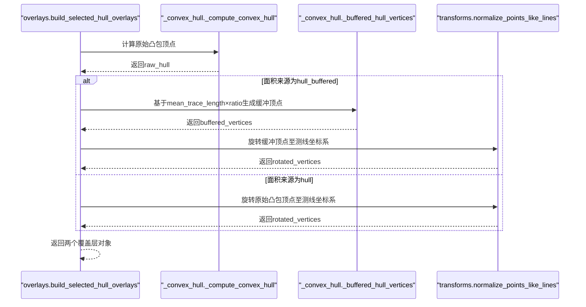
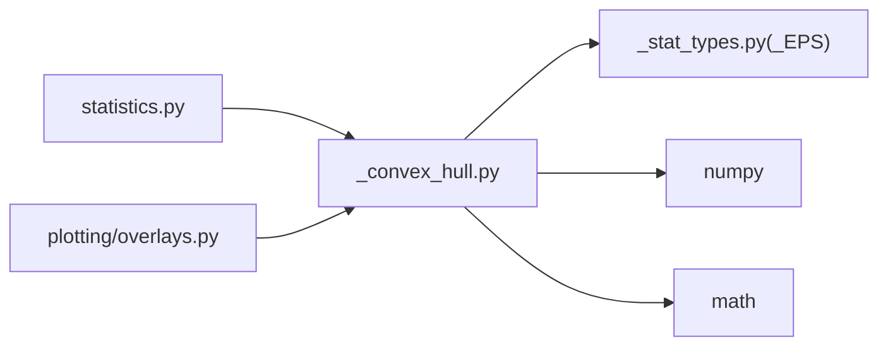

# 凸包算法

<cite>
**本文引用的文件**
- [trace_pipeline/geology/_convex_hull.py](file://trace_pipeline/geology/_convex_hull.py)
- [trace_pipeline/geology/statistics.py](file://trace_pipeline/geology/statistics.py)
- [trace_pipeline/geology/_stat_types.py](file://trace_pipeline/geology/_stat_types.py)
- [trace_pipeline/plotting/overlays.py](file://trace_pipeline/plotting/overlays.py)
- [tests/test_statistics.py](file://tests/test_statistics.py)
</cite>

## 目录
1. [引言](#引言)
2. [项目结构](#项目结构)
3. [核心组件](#核心组件)
4. [架构总览](#架构总览)
5. [详细组件分析](#详细组件分析)
6. [依赖关系分析](#依赖关系分析)
7. [性能与数值精度](#性能与数值精度)
8. [故障排查指南](#故障排查指南)
9. [结论](#结论)
10. [附录：流程图与示例路径](#附录：流程图与示例路径)

## 引言
本技术文档聚焦于“凸包面积计算”的数学原理与工程实现，覆盖以下关键主题：
- 凸包顶点提取算法（Graham/Andrew 扫描）的实现细节与退化处理
- 基于中心化鞋带公式的面积计算及数值稳定性策略
- 几何有效性验证逻辑（点数、共线、狭长等退化检测）
- 缓冲凸包的实现方法（Minkowski 和近似、缓冲区距离计算、多边形膨胀折线化）
- 性能优化技巧（向量化计算、内存管理）
- 数值精度控制与边界情况处理
- 完整算法流程图与代码片段路径指引

## 项目结构
与凸包相关的核心实现位于 geology 子模块中，统计流程在 statistics.py 中编排，绘图覆盖层在 plotting/overlays.py 中复用。测试用例位于 tests/test_statistics.py。

图表来源
- [trace_pipeline/geology/statistics.py:1-45](file://trace_pipeline/geology/statistics.py#L1-L45)
- [trace_pipeline/geology/_convex_hull.py:1-208](file://trace_pipeline/geology/_convex_hull.py#L1-L208)
- [trace_pipeline/geology/_stat_types.py:1-125](file://trace_pipeline/geology/_stat_types.py#L1-L125)
- [trace_pipeline/plotting/overlays.py:85-156](file://trace_pipeline/plotting/overlays.py#L85-L156)
- [tests/test_statistics.py:190-292](file://tests/test_statistics.py#L190-L292)

章节来源
- [trace_pipeline/geology/statistics.py:1-45](file://trace_pipeline/geology/statistics.py#L1-L45)
- [trace_pipeline/geology/_convex_hull.py:1-208](file://trace_pipeline/geology/_convex_hull.py#L1-L208)
- [trace_pipeline/geology/_stat_types.py:1-125](file://trace_pipeline/geology/_stat_types.py#L1-L125)
- [trace_pipeline/plotting/overlays.py:85-156](file://trace_pipeline/plotting/overlays.py#L85-L156)
- [tests/test_statistics.py:190-292](file://tests/test_statistics.py#L190-L292)

## 核心组件
- 凸包构建与面积计算
  - 端点去重与排序后使用上下链扫描构建凸包
  - 采用中心化鞋带公式计算面积，提升大坐标下的数值稳定性
- 缓冲凸包
  - 解析面积：A + P·r + π·r²（Minkowski 和面积公式）
  - 折线近似：在每个顶点处按外法线夹角生成圆弧段，步数由最大弧角控制
- 几何有效性验证
  - 检查有限性、唯一点数、非退化面积、主轴长宽比阈值
- 统计集成
  - 四层回退选择有效露头面积：实测 → 原始凸包 → 缓冲凸包 → 圆窗等效面积
  - 自适应不一致阈值与一致性校验告警

章节来源
- [trace_pipeline/geology/_convex_hull.py:17-84](file://trace_pipeline/geology/_convex_hull.py#L17-L84)
- [trace_pipeline/geology/_convex_hull.py:103-183](file://trace_pipeline/geology/_convex_hull.py#L103-L183)
- [trace_pipeline/geology/_convex_hull.py:186-208](file://trace_pipeline/geology/_convex_hull.py#L186-L208)
- [trace_pipeline/geology/statistics.py:106-166](file://trace_pipeline/geology/statistics.py#L106-L166)
- [trace_pipeline/geology/statistics.py:212-391](file://trace_pipeline/geology/statistics.py#L212-L391)
- [trace_pipeline/geology/_stat_types.py:11-65](file://trace_pipeline/geology/_stat_types.py#L11-L65)

## 架构总览
下图展示了从输入迹线到最终统计指标的关键数据流与调用关系，突出凸包相关函数在统计流程中的位置。

图表来源
- [trace_pipeline/geology/statistics.py:212-391](file://trace_pipeline/geology/statistics.py#L212-L391)
- [trace_pipeline/geology/_convex_hull.py:17-84](file://trace_pipeline/geology/_convex_hull.py#L17-L84)
- [trace_pipeline/geology/_convex_hull.py:103-114](file://trace_pipeline/geology/_convex_hull.py#L103-L114)
- [trace_pipeline/geology/_convex_hull.py:186-208](file://trace_pipeline/geology/_convex_hull.py#L186-L208)

## 详细组件分析

### 凸包顶点提取算法
- 输入预处理
  - 将线段端点展平为二维点集，剔除非有限值
  - 去重并保证至少三个不同点
  - 按 x 升序、y 升序进行字典序排序
- 上下链扫描
  - 维护一个栈式半链，利用二维叉积判断转向
  - 当新点导致右拐（顺时针）时弹出栈顶，直至满足左拐条件
  - 分别对正向与反向序列构建下链与上链，拼接得到凸包顶点
- 退化处理
  - 若点数不足或无法形成多边形，返回 None
  - 使用容差 _EPS 判定“几乎共线”的右拐情形

图表来源
- [trace_pipeline/geology/_convex_hull.py:17-46](file://trace_pipeline/geology/_convex_hull.py#L17-L46)

章节来源
- [trace_pipeline/geology/_convex_hull.py:17-46](file://trace_pipeline/geology/_convex_hull.py#L17-L46)

### 凸包面积计算（鞋带公式与中心化）
- 有符号面积
  - 使用向量点积与循环移位计算有符号面积，逆时针为正
- 中心化策略
  - 先将所有顶点减去质心，再应用鞋带公式，降低大坐标带来的舍入误差
- 数值有效性
  - 面积需为有限正值且大于 _EPS，否则返回 NaN

图表来源
- [trace_pipeline/geology/_convex_hull.py:49-76](file://trace_pipeline/geology/_convex_hull.py#L49-L76)

章节来源
- [trace_pipeline/geology/_convex_hull.py:49-76](file://trace_pipeline/geology/_convex_hull.py#L49-L76)

### 缓冲凸包（Minkowski 和近似）
- 解析面积
  - 使用公式 A_buffer = A + P·r + π·r²，其中 r 为缓冲区半径，P 为周长
- 折线近似（用于绘图）
  - 遍历每个顶点，计算前后边的单位向量与外法线
  - 根据外法线夹角 span 确定圆弧范围，按最大弧角限制生成采样点
  - 将所有圆弧段拼接成新的多边形顶点序列
- 边界与退化
  - 输入非法、面积为零或负、缓冲距离无效均返回 None
  - 确保结果顶点有限且数量足够

图表来源
- [trace_pipeline/geology/_convex_hull.py:103-183](file://trace_pipeline/geology/_convex_hull.py#L103-L183)

章节来源
- [trace_pipeline/geology/_convex_hull.py:103-183](file://trace_pipeline/geology/_convex_hull.py#L103-L183)

### 几何有效性验证
- 基本检查
  - 面积有限且大于 _EPS
  - 输入点有限且唯一点数≥3
- 凸包重建与形状质量
  - 重新计算凸包并检查顶点数
  - 通过主成分分析计算主轴长宽比，超过阈值视为极度狭长，判定为无效
- 用途
  - 作为“原始凸包面积”是否可信任的前置条件

图表来源
- [trace_pipeline/geology/_convex_hull.py:186-208](file://trace_pipeline/geology/_convex_hull.py#L186-L208)

章节来源
- [trace_pipeline/geology/_convex_hull.py:186-208](file://trace_pipeline/geology/_convex_hull.py#L186-L208)

### 统计集成与面积选择（四层回退）
- 层 1：实测露头面积（最可靠，不降级）
- 层 2：原始凸包面积（需几何质量合格；并与圆窗等效面积比较差异）
  - 差异小于自适应阈值则采用原始凸包
  - 差异较大时尝试缓冲凸包面积
- 层 3：缓冲凸包面积（兜底）
- 层 4：圆窗等效面积（兜底）
- 一致性校验
  - 对比主 P20/P21 与圆窗估计的差异，超过自适应阈值产生告警

图表来源
- [trace_pipeline/geology/statistics.py:106-166](file://trace_pipeline/geology/statistics.py#L106-L166)

章节来源
- [trace_pipeline/geology/statistics.py:106-166](file://trace_pipeline/geology/statistics.py#L106-L166)

### 绘图覆盖层（缓冲凸包可视化）
- 根据统计结果中的面积来源决定绘制原始凸包或缓冲凸包
- 若选择缓冲凸包，依据 mean_trace_length 与 hull_buffer_ratio 计算缓冲距离，生成缓冲顶点
- 将选定的顶点旋转到测线坐标系以叠加显示

图表来源
- [trace_pipeline/plotting/overlays.py:85-156](file://trace_pipeline/plotting/overlays.py#L85-L156)
- [trace_pipeline/geology/_convex_hull.py:116-183](file://trace_pipeline/geology/_convex_hull.py#L116-L183)

章节来源
- [trace_pipeline/plotting/overlays.py:85-156](file://trace_pipeline/plotting/overlays.py#L85-L156)
- [trace_pipeline/geology/_convex_hull.py:116-183](file://trace_pipeline/geology/_convex_hull.py#L116-L183)

## 依赖关系分析
- 内部依赖
  - statistics.py 依赖 _convex_hull.py 提供的凸包、面积、缓冲与验证函数
  - overlays.py 依赖 _convex_hull.py 的缓冲顶点生成与凸包构建
  - _stat_types.py 定义全局容差 _EPS 与配置项（如 hull_buffer_ratio）
- 外部依赖
  - numpy 用于矩阵运算、范数、特征值分解、排序与去重
  - math 用于常数与三角函数

图表来源
- [trace_pipeline/geology/statistics.py:21-36](file://trace_pipeline/geology/statistics.py#L21-L36)
- [trace_pipeline/plotting/overlays.py:90-114](file://trace_pipeline/plotting/overlays.py#L90-L114)
- [trace_pipeline/geology/_convex_hull.py:1-10](file://trace_pipeline/geology/_convex_hull.py#L1-L10)
- [trace_pipeline/geology/_stat_types.py:11-65](file://trace_pipeline/geology/_stat_types.py#L11-L65)

章节来源
- [trace_pipeline/geology/statistics.py:21-36](file://trace_pipeline/geology/statistics.py#L21-L36)
- [trace_pipeline/plotting/overlays.py:90-114](file://trace_pipeline/plotting/overlays.py#L90-L114)
- [trace_pipeline/geology/_convex_hull.py:1-10](file://trace_pipeline/geology/_convex_hull.py#L1-L10)
- [trace_pipeline/geology/_stat_types.py:11-65](file://trace_pipeline/geology/_stat_types.py#L11-L65)

## 性能与数值精度
- 向量化计算
  - 面积与周长计算使用 numpy 的点积、滚动与范数，避免显式循环
  - 缓冲顶点生成在顶点级别迭代，但每步内使用向量操作生成圆弧点
- 内存管理
  - 输入端点先 reshape 为二维点集，减少中间副本
  - 去重与排序使用 np.unique 与 np.lexsort，时间复杂度 O(n log n)
- 数值稳定性
  - 鞋带公式前对顶点中心化，显著降低大坐标导致的舍入误差
  - 使用 _EPS 统一判定“接近零”的长度、面积与角度跨度
- 长宽比检验
  - 通过协方差矩阵的特征值比值衡量形状狭长程度，防止极端退化形状影响统计可靠性

章节来源
- [trace_pipeline/geology/_convex_hull.py:49-76](file://trace_pipeline/geology/_convex_hull.py#L49-L76)
- [trace_pipeline/geology/_convex_hull.py:87-101](file://trace_pipeline/geology/_convex_hull.py#L87-L101)
- [trace_pipeline/geology/_stat_types.py:11-11](file://trace_pipeline/geology/_stat_types.py#L11-L11)

## 故障排查指南
- 常见问题与定位
  - 凸包为空或返回 None：检查输入点数、唯一性与有限性
  - 面积为 NaN：确认输入点是否包含 NaN/inf，或是否退化（共线/单点）
  - 缓冲顶点为空：检查缓冲距离是否为非负有限值，以及原始凸包面积是否有效
  - 几何验证失败：查看长宽比是否超过阈值，或是否存在极度狭长形状
- 调试建议
  - 打印局部坐标系下的端点与凸包顶点，确认方向与顺序
  - 记录 _EPS 与 max_aspect_ratio 的配置，评估其对判定结果的影响
  - 在统计流程中关注 area_source 与 window_validation_warning 字段，定位降级原因

章节来源
- [trace_pipeline/geology/_convex_hull.py:17-46](file://trace_pipeline/geology/_convex_hull.py#L17-L46)
- [trace_pipeline/geology/_convex_hull.py:103-183](file://trace_pipeline/geology/_convex_hull.py#L103-L183)
- [trace_pipeline/geology/_convex_hull.py:186-208](file://trace_pipeline/geology/_convex_hull.py#L186-L208)
- [trace_pipeline/geology/statistics.py:212-391](file://trace_pipeline/geology/statistics.py#L212-L391)

## 结论
该凸包实现以稳健的数值方法与清晰的退化处理为核心，结合缓冲凸包的 Minkowski 和近似，提供了可靠的露头面积估算方案。统计流程的四层回退与自适应阈值进一步增强了在不同数据质量下的鲁棒性。通过向量化与内存友好的数据结构设计，整体性能良好，适用于大规模迹线数据的批量处理。

## 附录：流程图与示例路径
- 凸包构建与面积计算
  - 参考路径：[trace_pipeline/geology/_convex_hull.py:17-84](file://trace_pipeline/geology/_convex_hull.py#L17-L84)
- 缓冲凸包（面积与顶点）
  - 参考路径：[trace_pipeline/geology/_convex_hull.py:103-183](file://trace_pipeline/geology/_convex_hull.py#L103-L183)
- 几何有效性验证
  - 参考路径：[trace_pipeline/geology/_convex_hull.py:186-208](file://trace_pipeline/geology/_convex_hull.py#L186-L208)
- 统计集成与面积选择
  - 参考路径：[trace_pipeline/geology/statistics.py:106-166](file://trace_pipeline/geology/statistics.py#L106-L166)
- 绘图覆盖层生成
  - 参考路径：[trace_pipeline/plotting/overlays.py:85-156](file://trace_pipeline/plotting/overlays.py#L85-L156)
- 测试用例（矩形凸包面积、顶点数）
  - 参考路径：[tests/test_statistics.py:190-292](file://tests/test_statistics.py#L190-L292)