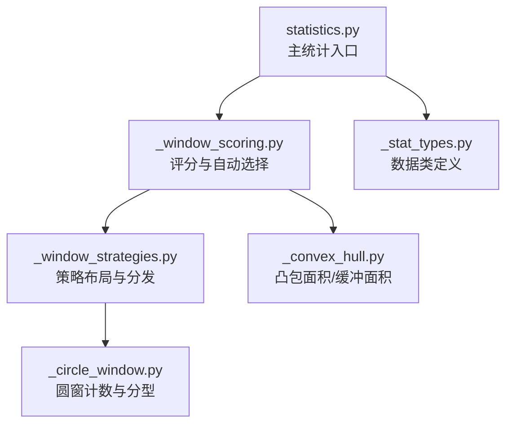
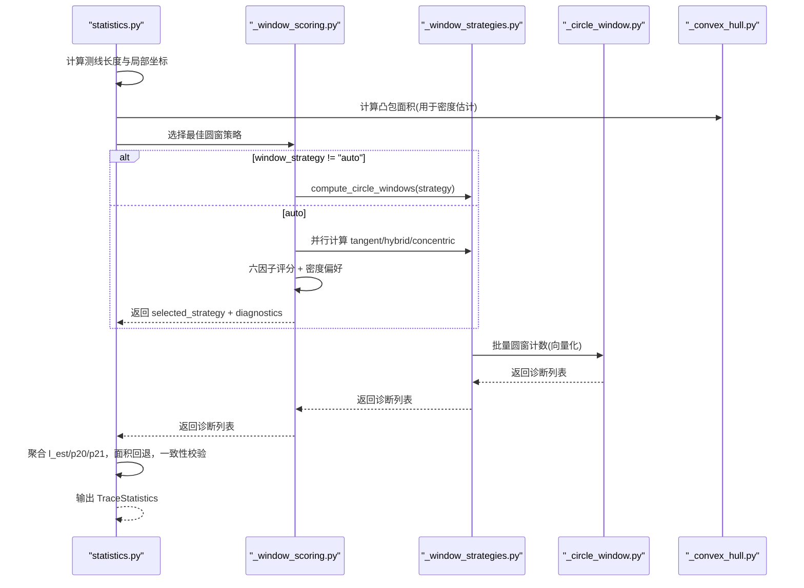
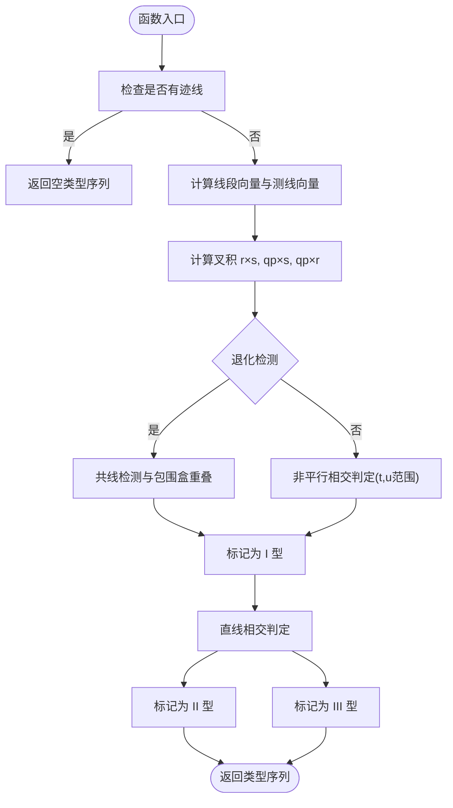
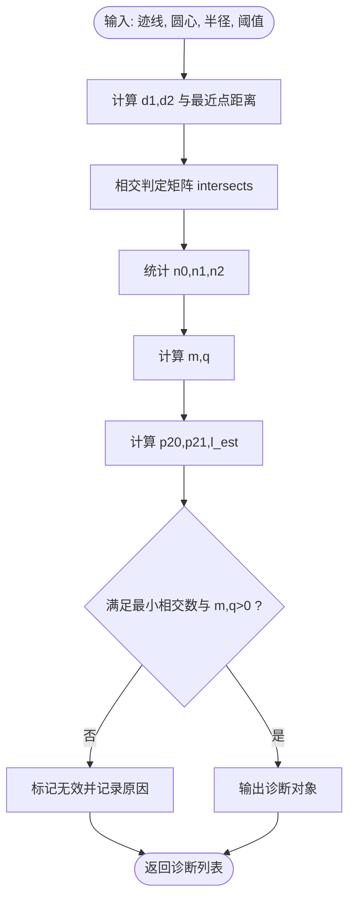
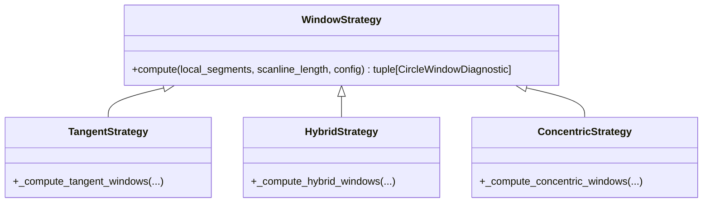
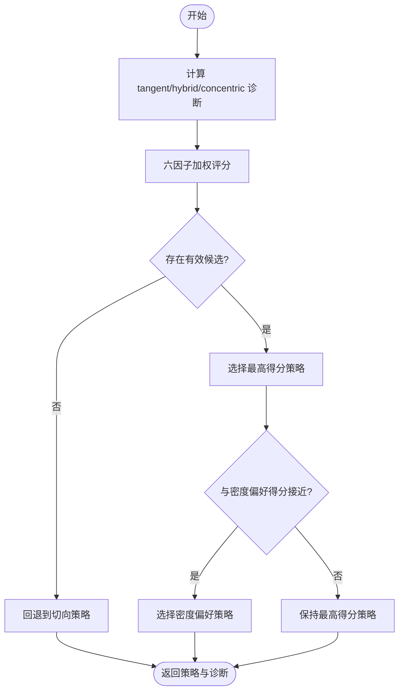
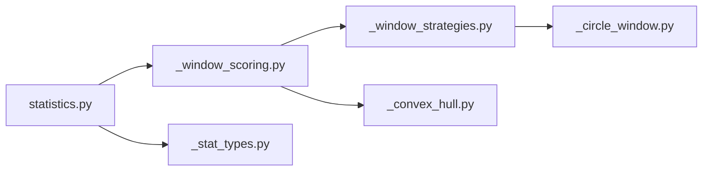

# 圆窗取样策略

<cite>
**本文引用的文件**
- [trace_pipeline/geology/_circle_window.py](file://trace_pipeline/geology/_circle_window.py)
- [trace_pipeline/geology/_window_strategies.py](file://trace_pipeline/geology/_window_strategies.py)
- [trace_pipeline/geology/_window_scoring.py](file://trace_pipeline/geology/_window_scoring.py)
- [trace_pipeline/geology/_convex_hull.py](file://trace_pipeline/geology/_convex_hull.py)
- [trace_pipeline/geology/statistics.py](file://trace_pipeline/geology/statistics.py)
- [trace_pipeline/geology/_stat_types.py](file://trace_pipeline/geology/_stat_types.py)
- [config.example.json](file://config.example.json)
</cite>

## 目录
1. [简介](#简介)
2. [项目结构](#项目结构)
3. [核心组件](#核心组件)
4. [架构总览](#架构总览)
5. [详细组件分析](#详细组件分析)
6. [依赖关系分析](#依赖关系分析)
7. [性能与复杂度](#性能与复杂度)
8. [故障排查指南](#故障排查指南)
9. [结论与建议](#结论与建议)
10. [附录：参数与可视化](#附录参数与可视化)

## 简介
本技术文档聚焦于“圆窗取样策略”的实现与使用，系统解析四种不同圆窗选择策略的算法原理、适用场景、参数设置与性能特点；详细说明圆窗计数算法（含迹线 I/II/III 型几何判断）、窗口评分机制与最优策略选择流程；并提供对比分析、选择建议、最佳实践以及调试诊断与可视化辅助工具的使用说明。

## 项目结构
围绕圆窗取样策略的核心代码位于 geology 子包中，关键文件职责如下：
- _stat_types.py：数据类型定义（配置、诊断结果等）
- _circle_window.py：圆窗计数与迹线分型（I/II/III）
- _window_strategies.py：三种布局策略（切向、混合、同心）
- _window_scoring.py：六因子加权评分与自动策略选择
- _convex_hull.py：凸包面积与缓冲面积计算（用于密度估计与面积回退）
- statistics.py：主统计入口，串联上述模块并输出最终指标

图表来源
- [trace_pipeline/geology/statistics.py:212-391](file://trace_pipeline/geology/statistics.py#L212-L391)
- [trace_pipeline/geology/_window_scoring.py:178-323](file://trace_pipeline/geology/_window_scoring.py#L178-L323)
- [trace_pipeline/geology/_window_strategies.py:173-185](file://trace_pipeline/geology/_window_strategies.py#L173-L185)
- [trace_pipeline/geology/_circle_window.py:12-66](file://trace_pipeline/geology/_circle_window.py#L12-L66)
- [trace_pipeline/geology/_convex_hull.py:79-114](file://trace_pipeline/geology/_convex_hull.py#L79-L114)
- [trace_pipeline/geology/_stat_types.py:14-65](file://trace_pipeline/geology/_stat_types.py#L14-L65)

章节来源
- [trace_pipeline/geology/statistics.py:212-391](file://trace_pipeline/geology/statistics.py#L212-L391)
- [trace_pipeline/geology/_window_scoring.py:178-323](file://trace_pipeline/geology/_window_scoring.py#L178-L323)
- [trace_pipeline/geology/_window_strategies.py:173-185](file://trace_pipeline/geology/_window_strategies.py#L173-L185)
- [trace_pipeline/geology/_circle_window.py:12-66](file://trace_pipeline/geology/_circle_window.py#L12-L66)
- [trace_pipeline/geology/_convex_hull.py:79-114](file://trace_pipeline/geology/_convex_hull.py#L79-L114)
- [trace_pipeline/geology/_stat_types.py:14-65](file://trace_pipeline/geology/_stat_types.py#L14-L65)

## 核心组件
- 数据类型与配置
  - TraceStatisticsConfig：包含 cut_fractions、radius_fractions、min_intersections、window_strategy、auto_density_threshold、tangent_window_count、hull_buffer_ratio 等参数校验与默认值。
  - CircleWindowDiagnostic：单个圆窗的诊断结果，包括相交数、n0/n1/n2、m/q、p20/p21/l_est、有效性及原因等。
- 圆窗计数与分型
  - 迹线分型：基于线段与测线的相对位置与相交判定，将每条迹线标记为 I/II/III 型。
  - 批量圆窗计数：对一组圆心与半径进行向量化距离与最近点投影计算，得到相交矩阵与端点内外状态，进而统计 m、q、p20、p21、l_est。
- 策略布局
  - 切向（tangent）：沿测线方向按固定半径等间距放置多个圆窗，左右两侧各一列。
  - 混合（hybrid）：在多个切割比例下，以侧向高度和边缘距离限制最大半径，再按半径分数生成多组候选。
  - 同心（concentric）：以测线中心为圆心，按半径分数生成多层同心圆窗。
- 评分与自动选择
  - 六因子加权评分：有效分组数量、有效分组占比、空间覆盖（侧向+沿测线）、稳定性（l_est/p20/p21 变异系数）、半径大小、样本充分性（相交数）。
  - 密度偏好优先：根据粗略面密度与期望相交数，倾向选择更稳健的策略。
  - 自动选择：当所有策略得分非正或无有效候选时，回退到最保守策略。

章节来源
- [trace_pipeline/geology/_stat_types.py:14-65](file://trace_pipeline/geology/_stat_types.py#L14-L65)
- [trace_pipeline/geology/_stat_types.py:67-125](file://trace_pipeline/geology/_stat_types.py#L67-L125)
- [trace_pipeline/geology/_circle_window.py:12-66](file://trace_pipeline/geology/_circle_window.py#L12-L66)
- [trace_pipeline/geology/_circle_window.py:71-216](file://trace_pipeline/geology/_circle_window.py#L71-L216)
- [trace_pipeline/geology/_window_strategies.py:52-185](file://trace_pipeline/geology/_window_strategies.py#L52-L185)
- [trace_pipeline/geology/_window_scoring.py:178-323](file://trace_pipeline/geology/_window_scoring.py#L178-L323)

## 架构总览
下图展示了从输入迹线到最终统计指标的完整流程，突出圆窗策略的选择与评分环节。

图表来源
- [trace_pipeline/geology/statistics.py:212-391](file://trace_pipeline/geology/statistics.py#L212-L391)
- [trace_pipeline/geology/_window_scoring.py:235-323](file://trace_pipeline/geology/_window_scoring.py#L235-L323)
- [trace_pipeline/geology/_window_strategies.py:173-185](file://trace_pipeline/geology/_window_strategies.py#L173-L185)
- [trace_pipeline/geology/_circle_window.py:71-216](file://trace_pipeline/geology/_circle_window.py#L71-L216)
- [trace_pipeline/geology/_convex_hull.py:79-114](file://trace_pipeline/geology/_convex_hull.py#L79-L114)

## 详细组件分析

### 迹线分型（I/II/III 型）几何判断
- 目标：将每条迹线相对于测线进行分类，以便后续圆窗计数与统计。
- 方法要点：
  - 计算线段向量与测线方向的叉积，判断是否平行。
  - 通过参数 t、u 判断交点是否在线段与测线范围内。
  - 处理共线与退化情况（零长度线段），结合包围盒重叠判定。
  - 分类规则：
    - I 型：与测线有有效交点（含共线且重叠）。
    - II 型：与测线所在直线相交但不与有限测线段相交。
    - III 型：其他情况。
- 复杂度：O(N)，N 为迹线数，全部向量化实现。

图表来源
- [trace_pipeline/geology/_circle_window.py:12-66](file://trace_pipeline/geology/_circle_window.py#L12-L66)

章节来源
- [trace_pipeline/geology/_circle_window.py:12-66](file://trace_pipeline/geology/_circle_window.py#L12-L66)

### 圆窗计数算法与指标聚合
- 输入：局部坐标系下的迹线端点、一组圆心与半径、最少相交数阈值、切割位置、侧向标识、策略标识、分组键。
- 核心步骤：
  - 广播计算每个端点到每个圆心的距离 d1、d2。
  - 计算线段上离圆心最近的点，得到 dist_to_seg。
  - 相交判定：端点在圆内或最近点距离小于半径（含容差）。
  - 统计 n0（两端在外）、n1（一端在内）、n2（两端在内）。
  - 计算 m = n1 + 2*n2，q = 2*n0 + n1。
  - 计算 p20 = q / (2πR²)、p21 = m / (4R)、l_est = (πR/2)*(m/q)。
- 复杂度：O(NM)，N 为迹线数，M 为窗口数，向量化实现避免 Python 循环开销。

图表来源
- [trace_pipeline/geology/_circle_window.py:71-216](file://trace_pipeline/geology/_circle_window.py#L71-L216)

章节来源
- [trace_pipeline/geology/_circle_window.py:71-216](file://trace_pipeline/geology/_circle_window.py#L71-L216)

### 三种圆窗布局策略
- 切向策略（tangent）
  - 半径由测线长度与切向窗口数决定：R = L / (2K)。
  - 左右两侧各 K 个窗口，沿测线方向等间距排列。
  - 适用场景：低密度或需要稳定采样分布的数据集。
  - 参数：tangent_window_count、min_intersections。
- 混合策略（hybrid）
  - 遍历多个切割比例 cut_fraction，计算每侧可用高度与边缘距离限制的最大半径。
  - 在每个 cut_position 处，按 radius_fractions 生成多组候选窗口。
  - 适用场景：中等密度、希望兼顾侧向与沿测线覆盖的数据集。
  - 参数：cut_fractions、radius_fractions、min_intersections。
- 同心策略（concentric）
  - 以测线中心为圆心，按 radius_fractions 生成多层同心圆窗。
  - 适用场景：高密度、需要大尺度代表性采样的数据集。
  - 参数：radius_fractions、min_intersections。

图表来源
- [trace_pipeline/geology/_window_strategies.py:87-185](file://trace_pipeline/geology/_window_strategies.py#L87-L185)

章节来源
- [trace_pipeline/geology/_window_strategies.py:52-185](file://trace_pipeline/geology/_window_strategies.py#L52-L185)

### 窗口评分机制与最优策略选择
- 六因子加权评分：
  - 有效分组权重最高，保证统计可信度前提。
  - 空间覆盖：侧向覆盖（左/右/中心）与沿测线覆盖（前/中/后三段）。
  - 稳定性：l_est、p20、p21 在各分组内的变异系数倒数。
  - 半径大小：中位半径与最大可能半径之比。
  - 样本充分性：相交数相对目标（2×min_intersections）的比例均值。
- 密度偏好优先：
  - 基于粗略面密度与期望相交数，若期望相交数不足则倾向切向策略；否则根据密度阈值选择混合或同心。
- 自动选择流程：
  - 计算三种策略的诊断结果。
  - 评分并筛选有效候选；若无有效候选或非正得分，回退到最保守策略（切向）。
  - 考虑得分相近时的容忍度，允许密度偏好策略胜出。

图表来源
- [trace_pipeline/geology/_window_scoring.py:178-323](file://trace_pipeline/geology/_window_scoring.py#L178-L323)

章节来源
- [trace_pipeline/geology/_window_scoring.py:178-323](file://trace_pipeline/geology/_window_scoring.py#L178-L323)

### 关于“固定半径策略”与“自适应策略”“缓冲策略”的说明
- 在当前代码库中，明确实现的策略为切向（tangent）、混合（hybrid）、同心（concentric）。
- “固定半径策略”与“自适应策略”未在源码中以独立策略名出现；其思想可映射到现有策略的参数化行为：
  - 固定半径：可通过设置单一 radius_fraction 与固定 cut_fraction 来近似实现。
  - 自适应：可由自动选择流程依据密度与评分动态决定策略与参数组合。
- “缓冲策略”对应凸包缓冲面积计算（_buffered_hull_area），主要用于面积回退与可视化边界生成，并非独立的圆窗布局策略。

章节来源
- [trace_pipeline/geology/_window_strategies.py:52-185](file://trace_pipeline/geology/_window_strategies.py#L52-L185)
- [trace_pipeline/geology/_convex_hull.py:103-114](file://trace_pipeline/geology/_convex_hull.py#L103-L114)

## 依赖关系分析
- 模块耦合与内聚：
  - statistics.py 作为编排层，调用评分与策略模块，内聚度高。
  - _window_scoring.py 依赖 _window_strategies.py 与 _convex_hull.py，负责决策。
  - _window_strategies.py 依赖 _circle_window.py 完成具体计数。
  - _circle_window.py 仅依赖基础数学与类型定义，内聚性强。
- 外部依赖：
  - numpy 用于向量化运算。
  - math 用于基本数学函数。
- 潜在循环依赖：
  - 当前结构无循环依赖，层次清晰。

图表来源
- [trace_pipeline/geology/statistics.py:212-391](file://trace_pipeline/geology/statistics.py#L212-L391)
- [trace_pipeline/geology/_window_scoring.py:178-323](file://trace_pipeline/geology/_window_scoring.py#L178-L323)
- [trace_pipeline/geology/_window_strategies.py:173-185](file://trace_pipeline/geology/_window_strategies.py#L173-L185)
- [trace_pipeline/geology/_circle_window.py:71-216](file://trace_pipeline/geology/_circle_window.py#L71-L216)
- [trace_pipeline/geology/_convex_hull.py:79-114](file://trace_pipeline/geology/_convex_hull.py#L79-L114)
- [trace_pipeline/geology/_stat_types.py:14-65](file://trace_pipeline/geology/_stat_types.py#L14-L65)

章节来源
- [trace_pipeline/geology/statistics.py:212-391](file://trace_pipeline/geology/statistics.py#L212-L391)
- [trace_pipeline/geology/_window_scoring.py:178-323](file://trace_pipeline/geology/_window_scoring.py#L178-L323)
- [trace_pipeline/geology/_window_strategies.py:173-185](file://trace_pipeline/geology/_window_strategies.py#L173-L185)
- [trace_pipeline/geology/_circle_window.py:71-216](file://trace_pipeline/geology/_circle_window.py#L71-L216)
- [trace_pipeline/geology/_convex_hull.py:79-114](file://trace_pipeline/geology/_convex_hull.py#L79-L114)
- [trace_pipeline/geology/_stat_types.py:14-65](file://trace_pipeline/geology/_stat_types.py#L14-L65)

## 性能与复杂度
- 迹线分型：O(N)
- 圆窗计数：O(NM)，其中 N 为迹线数，M 为窗口数；向量化实现显著降低 Python 循环开销。
- 评分与选择：主要开销在于策略计算与评分聚合，整体 O(S·NM)（S 为策略数，通常为 3）。
- 优化建议：
  - 合理设置 min_intersections 以减少无效窗口。
  - 控制 radius_fractions 与 cut_fractions 的数量，避免 M 过大。
  - 在高密度场景优先使用 concentric 策略，减少窗口数量但提升代表性。

[本节提供一般性指导，不直接分析具体文件]

## 故障排查指南
- 常见问题与定位：
  - 相交迹线数不足：检查 min_intersections 与数据密度；必要时增大该阈值或调整策略。
  - 侧向高度不足：切向与混合策略对侧向高度敏感，需确保数据分布足够宽。
  - 测线长度不足：切向策略依赖测线长度计算半径，过短会导致无效窗口。
  - 面积不一致告警：主 P20/P21 与圆窗估计差异超过自适应阈值时会触发警告，需检查面积来源与数据质量。
- 日志与诊断：
  - 自动策略选择会输出评分明细与选择原因。
  - 统计主入口会输出详细的来源信息与校验告警。

章节来源
- [trace_pipeline/geology/_window_scoring.py:288-323](file://trace_pipeline/geology/_window_scoring.py#L288-L323)
- [trace_pipeline/geology/statistics.py:313-356](file://trace_pipeline/geology/statistics.py#L313-L356)

## 结论与建议
- 策略选择建议：
  - 低密度或稳定性优先：切向（tangent）。
  - 中等密度与覆盖平衡：混合（hybrid）。
  - 高密度与大尺度代表性：同心（concentric）。
  - 自动模式适合未知数据分布，具备鲁棒性与回退机制。
- 参数调优建议：
  - min_intersections：根据数据密度与精度需求设定，通常 5–10。
  - tangent_window_count：控制切向窗口数量，过多会增加计算量。
  - cut_fractions 与 radius_fractions：适度增加以提升覆盖与稳定性，但需权衡计算成本。
  - hull_buffer_ratio：影响缓冲面积与可视化边界，建议 0.2–0.3。
- 最佳实践：
  - 先运行自动模式，观察评分与选择结果，再针对性调整参数。
  - 关注面积不一致告警与一致性校验，必要时调整面积来源或数据预处理。

[本节总结性内容，不直接分析具体文件]

## 附录：参数与可视化

### 配置参数参考
- window_strategy：auto/tangent/hybrid/concentric
- auto_density_threshold：密度阈值，影响自动选择的密度偏好
- tangent_window_count：切向窗口数量
- min_intersections：最少相交迹线数
- cut_fractions：切割比例序列
- radius_fractions：半径分数序列
- hull_buffer_ratio：凸包缓冲比例

章节来源
- [trace_pipeline/geology/_stat_types.py:14-65](file://trace_pipeline/geology/_stat_types.py#L14-L65)
- [config.example.json:14-17](file://config.example.json#L14-L17)

### 可视化辅助工具
- 缓冲凸包边界顶点生成：可用于绘制缓冲后的凸包轮廓，便于直观评估面积与覆盖。
- 圆窗布局可视化：结合 cut_position、center_y、radius 字段，可在二维图上绘制圆窗位置与半径，辅助策略评估。

章节来源
- [trace_pipeline/geology/_convex_hull.py:116-183](file://trace_pipeline/geology/_convex_hull.py#L116-L183)
- [trace_pipeline/geology/_stat_types.py:67-125](file://trace_pipeline/geology/_stat_types.py#L67-L125)