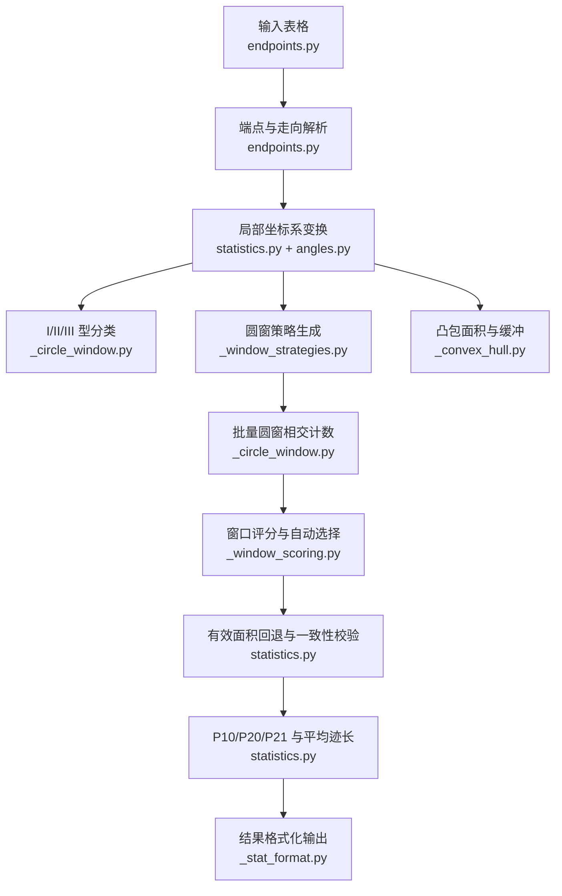
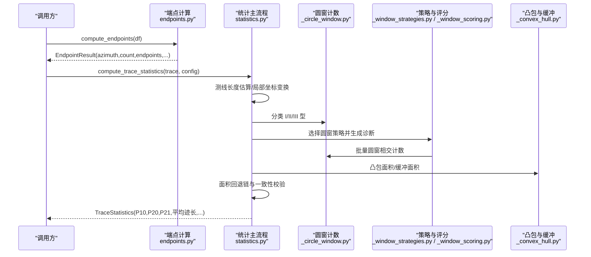
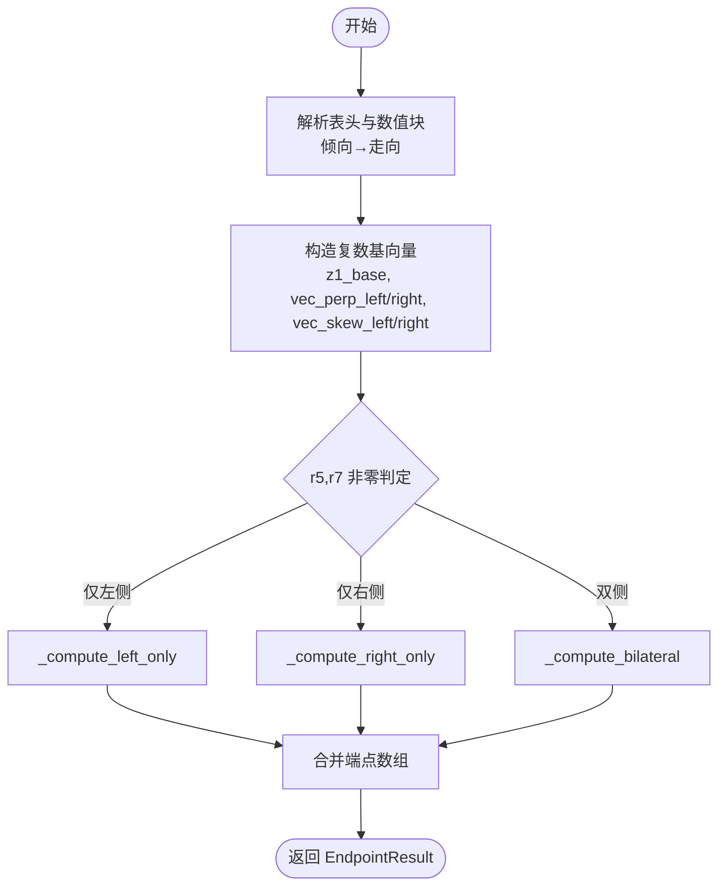
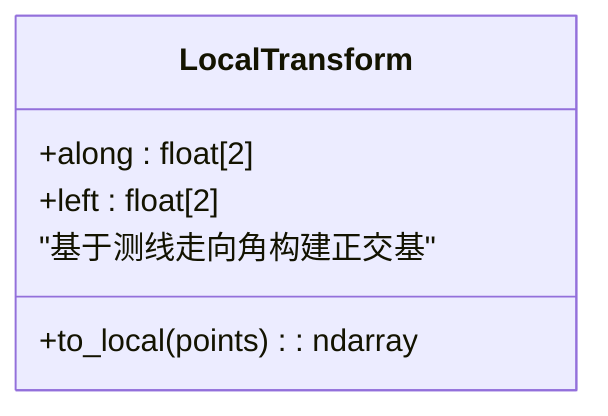
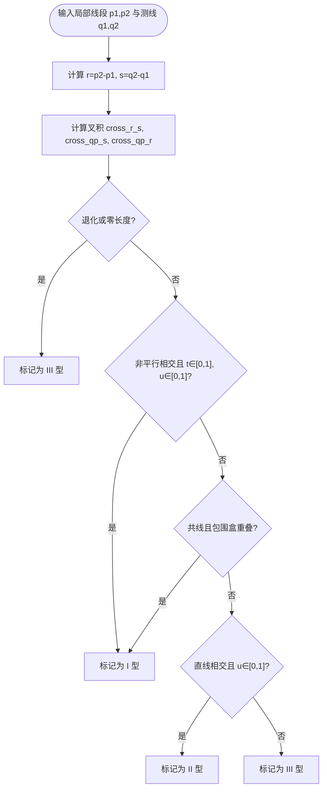
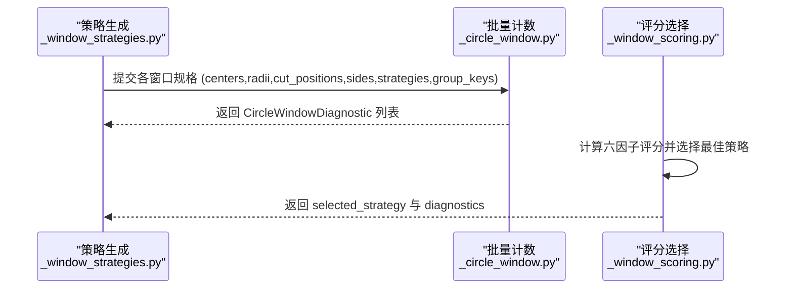
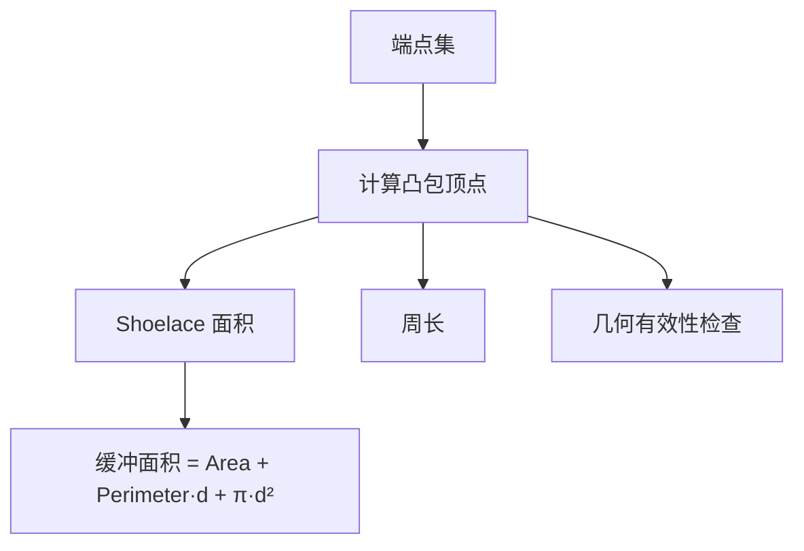
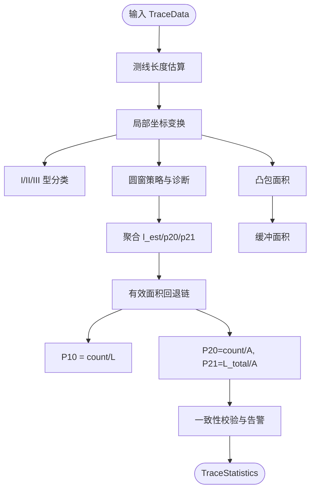
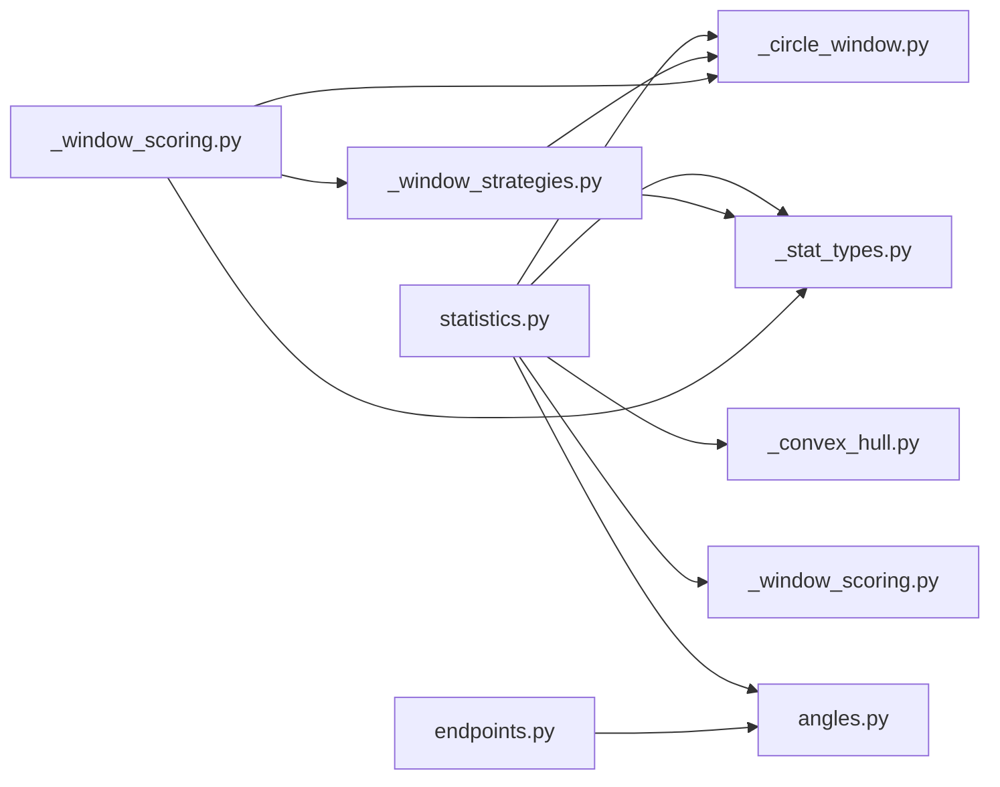

# 地质算法模块

<cite>
**本文引用的文件列表**
- [statistics.py](file://trace_pipeline/geology/statistics.py)
- [endpoints.py](file://trace_pipeline/geology/endpoints.py)
- [transforms.py](file://trace_pipeline/geology/transforms.py)
- [_circle_window.py](file://trace_pipeline/geology/_circle_window.py)
- [_convex_hull.py](file://trace_pipeline/geology/_convex_hull.py)
- [_stat_types.py](file://trace_pipeline/geology/_stat_types.py)
- [_window_scoring.py](file://trace_pipeline/geology/_window_scoring.py)
- [_window_strategies.py](file://trace_pipeline/geology/_window_strategies.py)
- [_stat_format.py](file://trace_pipeline/geology/_stat_format.py)
- [angles.py](file://trace_pipeline/geology/angles.py)
- [test_statistics.py](file://tests/test_statistics.py)
- [test_endpoints.py](file://tests/test_endpoints.py)
</cite>

## 目录
1. [引言](#引言)
2. [项目结构](#项目结构)
3. [核心组件](#核心组件)
4. [架构总览](#架构总览)
5. [详细组件分析](#详细组件分析)
6. [依赖关系分析](#依赖关系分析)
7. [性能与数值精度](#性能与数值精度)
8. [故障排查指南](#故障排查指南)
9. [结论](#结论)
10. [附录：数学公式与实现要点](#附录数学公式与实现要点)

## 引言
本技术文档聚焦于地质算法模块，系统梳理并深入解析以下关键能力：
- 统计指标计算的核心算法：P10/P20/P21 密度估计、Mauldon 平均迹长估计的数学原理与实现细节。
- 端点坐标计算的复数向量方法与测线局部坐标系转换的几何变换。
- 圆窗取样策略的四种不同算法（固定半径、自适应、凸包、缓冲）及其适用场景。
- I/Y/X 型拓扑节点的几何判断逻辑与节点识别算法。
- 纯函数设计最佳实践、向量化优化技巧与数值精度控制策略。
- 完整的数学公式推导与代码示例路径。

## 项目结构
地质算法模块位于 trace_pipeline/geology 下，按职责拆分为多个子模块：
- 数据与配置类型定义：_stat_types.py
- 角度与坐标变换：angles.py, transforms.py
- 端点坐标计算：endpoints.py
- 统计主流程与指标聚合：statistics.py
- 圆窗计数与分型：_circle_window.py
- 凸包面积与缓冲：_convex_hull.py
- 圆窗策略与评分：_window_strategies.py, _window_scoring.py
- 格式化输出：_stat_format.py

图表来源
- [statistics.py:212-391](file://trace_pipeline/geology/statistics.py#L212-L391)
- [endpoints.py:295-411](file://trace_pipeline/geology/endpoints.py#L295-L411)
- [_circle_window.py:12-269](file://trace_pipeline/geology/_circle_window.py#L12-L269)
- [_convex_hull.py:79-114](file://trace_pipeline/geology/_convex_hull.py#L79-L114)
- [_window_scoring.py:235-323](file://trace_pipeline/geology/_window_scoring.py#L235-L323)
- [_window_strategies.py:173-185](file://trace_pipeline/geology/_window_strategies.py#L173-L185)
- [_stat_format.py:29-42](file://trace_pipeline/geology/_stat_format.py#L29-L42)

章节来源
- [statistics.py:1-45](file://trace_pipeline/geology/statistics.py#L1-L45)
- [endpoints.py:1-36](file://trace_pipeline/geology/endpoints.py#L1-L36)

## 核心组件
- 数据类型与配置：TraceStatisticsConfig、CircleWindowDiagnostic、TraceStatistics
- 端点计算：compute_endpoints（Excel 表头解析、倾向→走向转换、复数向量端点计算）
- 统计主流程：compute_trace_statistics（测线长度估算、局部坐标、I/II/III 型分类、圆窗策略与评分、面积回退链、P10/P20/P21 计算）
- 圆窗策略：tangent（切圆）、hybrid（混合）、concentric（同心），以及 auto 自动选择
- 凸包与缓冲：凸包面积、缓冲面积近似、几何有效性检查
- 角度工具：方位角↔笛卡尔角、倾向→走向、半平面折叠、玫瑰图半圆折叠

章节来源
- [_stat_types.py:14-125](file://trace_pipeline/geology/_stat_types.py#L14-L125)
- [endpoints.py:295-411](file://trace_pipeline/geology/endpoints.py#L295-L411)
- [statistics.py:212-391](file://trace_pipeline/geology/statistics.py#L212-L391)
- [_window_strategies.py:173-185](file://trace_pipeline/geology/_window_strategies.py#L173-L185)
- [_convex_hull.py:79-114](file://trace_pipeline/geology/_convex_hull.py#L79-L114)
- [angles.py:28-168](file://trace_pipeline/geology/angles.py#L28-L168)

## 架构总览
整体流水线以“数据→几何→统计”为主线，采用纯函数式与向量化实现，保证可测试性与高性能。

图表来源
- [endpoints.py:295-411](file://trace_pipeline/geology/endpoints.py#L295-L411)
- [statistics.py:212-391](file://trace_pipeline/geology/statistics.py#L212-L391)
- [_circle_window.py:71-216](file://trace_pipeline/geology/_circle_window.py#L71-L216)
- [_window_strategies.py:173-185](file://trace_pipeline/geology/_window_strategies.py#L173-L185)
- [_window_scoring.py:235-323](file://trace_pipeline/geology/_window_scoring.py#L235-L323)
- [_convex_hull.py:79-114](file://trace_pipeline/geology/_convex_hull.py#L79-L114)

## 详细组件分析

### 端点坐标计算与复数向量方法
- 输入：Excel 表头含测线走向、迹线条数；数据列包含沿测线位移 r1、垂直测线位移 r2、倾向（转为走向）、左侧两段 r4/r5、右侧两段 r6/r7。
- 处理：
  - 表头解析与数值块提取，倾向→走向转换。
  - 基准方向角转换为笛卡尔角，构造复数基向量 z1_base。
  - 左右侧法线与斜向向量通过半平面折叠确定，确保方向严格位于左/右半平面。
  - 三种情形分别计算：仅左侧、仅右侧、双侧均有，就地写入预分配数组，避免循环开销。
- 输出：端点坐标 (N,4)、节理走向、段长 r5+r7、r1 序列及可选实测值。

图表来源
- [endpoints.py:295-411](file://trace_pipeline/geology/endpoints.py#L295-L411)
- [angles.py:108-148](file://trace_pipeline/geology/angles.py#L108-L148)

章节来源
- [endpoints.py:98-206](file://trace_pipeline/geology/endpoints.py#L98-L206)
- [endpoints.py:210-290](file://trace_pipeline/geology/endpoints.py#L210-L290)
- [angles.py:43-70](file://trace_pipeline/geology/angles.py#L43-L70)

### 测线局部坐标系转换
- 将全局坐标投影到以测线走向为 x 轴的局部坐标系：
  - 计算 along 与 left 单位向量，对端点进行矩阵乘法得到 local_points。
  - 用于后续 I/II/III 型分类与圆窗计数。

图表来源
- [statistics.py:71-78](file://trace_pipeline/geology/statistics.py#L71-L78)
- [angles.py:28-37](file://trace_pipeline/geology/angles.py#L28-L37)

章节来源
- [statistics.py:71-78](file://trace_pipeline/geology/statistics.py#L71-L78)

### I/Y/X 型拓扑节点判断与识别
- 在局部坐标系中，测线为从 (0,0) 到 (L,0) 的水平线段。
- 使用向量叉积与参数 t,u 判断线段与测线的相交情况：
  - I 型：迹线本体与测线相交（包括共线重叠）。
  - II 型：迹线延长线与测线延长线相交但迹线本体不穿测线。
  - III 型：平行且不重合。
- 向量化实现，一次性对所有迹线进行分类。

图表来源
- [_circle_window.py:12-66](file://trace_pipeline/geology/_circle_window.py#L12-L66)

章节来源
- [_circle_window.py:12-66](file://trace_pipeline/geology/_circle_window.py#L12-L66)

### 圆窗取样策略与计数
- 策略：
  - tangent（切圆）：沿测线等间距放置相切圆，半径由测线长度与切圆数量决定。
  - hybrid（混合）：在指定切割位置处，根据侧向高度与边缘距离限制，生成多半径窗口。
  - concentric（同心）：以测线中心为圆心，按半径分数生成一组同心圆。
  - auto（自动）：并行评估三种策略，依据六因子加权评分选择最优，并在得分相近时偏向密度偏好策略。
- 计数：
  - 批量计算所有线段到所有圆心的最近距离矩阵，判断相交。
  - 统计 n0/n1/n2，计算 m= n1+2n2，q=2n0+n1，进而得到 P20、P21 与 l_est。

图表来源
- [_window_strategies.py:52-185](file://trace_pipeline/geology/_window_strategies.py#L52-L185)
- [_circle_window.py:71-216](file://trace_pipeline/geology/_circle_window.py#L71-L216)
- [_window_scoring.py:178-323](file://trace_pipeline/geology/_window_scoring.py#L178-L323)

章节来源
- [_window_strategies.py:173-185](file://trace_pipeline/geology/_window_strategies.py#L173-L185)
- [_circle_window.py:71-216](file://trace_pipeline/geology/_circle_window.py#L71-L216)
- [_window_scoring.py:235-323](file://trace_pipeline/geology/_window_scoring.py#L235-L323)

### 凸包面积与缓冲面积
- 凸包：Graham Scan 变体，Shoelace 公式计算面积，中心化提高大坐标精度。
- 缓冲：基于 Minkowski 和近似，面积 = 原面积 + 周长×缓冲距离 + π×缓冲距离²。
- 几何有效性：点数≥3、非退化、有限面积、长宽比阈值。

图表来源
- [_convex_hull.py:17-114](file://trace_pipeline/geology/_convex_hull.py#L17-L114)
- [_convex_hull.py:186-208](file://trace_pipeline/geology/_convex_hull.py#L186-L208)

章节来源
- [_convex_hull.py:79-114](file://trace_pipeline/geology/_convex_hull.py#L79-L114)
- [_convex_hull.py:186-208](file://trace_pipeline/geology/_convex_hull.py#L186-L208)

### 统计主流程与指标计算
- 测线长度：优先实测，否则基于 scanline_positions 的中位间距估计。
- 有效面积四层回退：实测 → 原始凸包（需几何质量合格）→ 缓冲凸包 → 圆窗等效面积。
- 观测迹长：优先 segment_lengths(r5+r7)，其次 lengths（端点欧氏距离），最后用窗口估计的平均迹长×count。
- P10：count / scanline_length。
- P20/P21：若有效面积可用则 count/area 与 total_length/area；否则回退到窗口估计的 P20/P21。
- 一致性校验：比较主 P20/P21 与窗口估计的差异，超过自适应阈值给出告警。

图表来源
- [statistics.py:212-391](file://trace_pipeline/geology/statistics.py#L212-L391)

章节来源
- [statistics.py:51-68](file://trace_pipeline/geology/statistics.py#L51-L68)
- [statistics.py:106-166](file://trace_pipeline/geology/statistics.py#L106-L166)
- [statistics.py:179-206](file://trace_pipeline/geology/statistics.py#L179-L206)
- [statistics.py:289-336](file://trace_pipeline/geology/statistics.py#L289-L336)

## 依赖关系分析
- statistics.py 依赖：
  - endpoints.py（提供 TraceData 字段）
  - _circle_window.py（分类与计数）
  - _convex_hull.py（凸包面积与缓冲）
  - _stat_types.py（配置与结果类型）
  - _window_scoring.py（策略评分与选择）
  - angles.py（方位角→笛卡尔角）
- endpoints.py 依赖：
  - angles.py（倾向→走向、半平面折叠）
  - _stat_types.py（EPS）
- _window_strategies.py 依赖：
  - _circle_window.py（计数、辅助度量）
  - _stat_types.py（配置与 EPS）
- _window_scoring.py 依赖：
  - _window_strategies.py（策略执行）
  - _circle_window.py（切圆半径）
  - _stat_types.py（配置与 EPS）

图表来源
- [statistics.py:20-36](file://trace_pipeline/geology/statistics.py#L20-L36)
- [endpoints.py:47-48](file://trace_pipeline/geology/endpoints.py#L47-L48)
- [_window_strategies.py:10-16](file://trace_pipeline/geology/_window_strategies.py#L10-L16)
- [_window_scoring.py:12-14](file://trace_pipeline/geology/_window_scoring.py#L12-L14)

章节来源
- [statistics.py:20-36](file://trace_pipeline/geology/statistics.py#L20-L36)
- [endpoints.py:47-48](file://trace_pipeline/geology/endpoints.py#L47-L48)
- [_window_strategies.py:10-16](file://trace_pipeline/geology/_window_strategies.py#L10-L16)
- [_window_scoring.py:12-14](file://trace_pipeline/geology/_window_scoring.py#L12-L14)

## 性能与数值精度
- 纯函数设计：
  - 所有变换与计算均不修改入参，返回新数组，便于缓存与并行化。
  - 内部函数如 _compute_left_only/_compute_right_only/_compute_bilateral 就地修改预分配数组，仅在本地零数组上操作，避免外部状态污染。
- 向量化优化：
  - 端点计算与圆窗计数均采用广播与矩阵运算，减少 Python 层循环。
  - 批量圆窗相交计数一次构建 N×M 距离矩阵，显著降低函数调用开销。
- 数值精度控制：
  - 统一使用 _EPS=1e-9 进行浮点容差比较，避免 0 与极小值导致的除零或不稳定。
  - 凸包面积采用中心化 Shoelace 提升大坐标精度。
  - 自适应阈值随样本量衰减，避免极端密度下的误判。
- 建议：
  - 大数据集下优先使用 batch 计数与预分配数组。
  - 合理设置 min_intersections 与 radius_fractions，平衡稳定性与代表性。
  - 对异常输入（NaN/inf/负值）尽早抛出明确错误，便于定位。

章节来源
- [endpoints.py:210-290](file://trace_pipeline/geology/endpoints.py#L210-L290)
- [_circle_window.py:71-216](file://trace_pipeline/geology/_circle_window.py#L71-L216)
- [_convex_hull.py:49-57](file://trace_pipeline/geology/_convex_hull.py#L49-L57)
- [_stat_types.py:11](file://trace_pipeline/geology/_stat_types.py#L11)

## 故障排查指南
- 常见错误与定位：
  - 输入为空或列数不足：检查 DataFrame 结构与首行列索引。
  - 表头解析失败：确认走向角度范围与迹线条数为正整数。
  - 数值块非法：r1 不能为负，倾向需在 [0,360)，长度列不能为负，r5 与 r7 不能同时为 0。
  - 无有效圆窗：检查侧向高度与半径限制，调整 tangent_window_count 或 radius_fractions。
  - 面积回退链降级：关注 area_disagreement_ratio 与 window_validation_warning。
- 调试建议：
  - 打印 diagnostics 列表中的 invalid_reason 与 group_key，定位具体策略与分组。
  - 对比 effective_area_source 与 p20_source/p21_source，理解回退路径。
  - 使用单元测试覆盖边界条件，确保鲁棒性。

章节来源
- [endpoints.py:113-206](file://trace_pipeline/geology/endpoints.py#L113-L206)
- [_window_strategies.py:52-130](file://trace_pipeline/geology/_window_strategies.py#L52-L130)
- [statistics.py:279-336](file://trace_pipeline/geology/statistics.py#L279-L336)
- [test_endpoints.py:23-103](file://tests/test_endpoints.py#L23-L103)
- [test_statistics.py:63-112](file://tests/test_statistics.py#L63-L112)

## 结论
地质算法模块以纯函数与向量化为核心，实现了从端点坐标计算、局部坐标变换、I/II/III 型分类、圆窗策略与评分、凸包面积与缓冲，到 P10/P20/P21 与平均迹长估计的完整流水线。其优势在于：
- 高内聚低耦合：各子模块职责清晰，依赖关系明确。
- 稳健的回退链与一致性校验：确保在不同数据质量下仍能得到可信指标。
- 可扩展的策略体系：支持固定半径、自适应、凸包、缓冲等多种策略组合。
- 良好的数值稳定性与性能表现：适合大规模数据处理。

## 附录：数学公式与实现要点

### 端点坐标复数向量方法
- 基准复数向量：z1_base = r1 · exp(i·rad_base)
- 左右侧法线：vec_perp_left = exp(i·(rad_base + π/2))，vec_perp_right = exp(i·(rad_base − π/2))
- 左右侧斜向向量：vec_skew_left/right = exp(i·fold_to_halfplane(rad_base_deg, ang_joint, invert=False/True))
- 仅左侧：start = z1 + r2·L_perp + r4·L_skew；end = start + r5·L_skew
- 仅右侧：start = z1 + r2·R_perp + r6·R_skew；end = start + r7·R_skew
- 双侧：left = z1 + r2·L_perp + (r4+r5)·L_skew；right = z1 + r2·R_perp + (r6+r7)·R_skew

章节来源
- [endpoints.py:327-399](file://trace_pipeline/geology/endpoints.py#L327-L399)
- [angles.py:108-148](file://trace_pipeline/geology/angles.py#L108-L148)

### 测线局部坐标系转换
- along = [cosθ, sinθ]，left = [−sinθ, cosθ]，其中 θ 为测线走向对应的笛卡尔角。
- local_points = points @ [along; left]^T

章节来源
- [statistics.py:71-78](file://trace_pipeline/geology/statistics.py#L71-L78)
- [angles.py:28-37](file://trace_pipeline/geology/angles.py#L28-L37)

### I/II/III 型分类
- 设线段 r = p2 − p1，测线 s = q2 − q1，偏移 qp = q1 − p1。
- 叉积：cross_r_s、cross_qp_s、cross_qp_r。
- 参数：t = cross_qp_s / cross_r_s，u = cross_qp_r / cross_r_s。
- 非平行相交：|cross_r_s| > ε 且 t ∈ [0,1]、u ∈ [0,1] → I 型。
- 共线重叠：cross_r_s ≈ 0 且 cross_qp_r ≈ 0 且包围盒重叠 → I 型。
- 直线相交：非平行且 u ∈ [0,1] 但 t ∉ [0,1] → II 型。
- 平行不重合 → III 型。

章节来源
- [_circle_window.py:12-66](file://trace_pipeline/geology/_circle_window.py#L12-L66)

### 圆窗计数与 Mauldon 平均迹长估计
- 相交判定：端点到圆心距离 ≤ r+ε 或线段到圆心最近距离 ≤ r+ε。
- 统计：n0（两端在外）、n1（一端在内）、n2（两端在内）。
- m = n1 + 2n2，q = 2n0 + n1。
- P20 = q / (2πr²)。
- P21 = m / (4r)。
- 平均迹长估计（Zhang/Mauldon 形式）：l_est = (πr/2) × (m/q)。

章节来源
- [_circle_window.py:147-216](file://trace_pipeline/geology/_circle_window.py#L147-L216)

### 面积回退链与一致性校验
- 有效面积选择：实测 → 原始凸包（几何质量合格）→ 缓冲凸包 → 圆窗等效面积。
- 差异比率：ratio = |A_hull − A_window| / max(A_hull, A_window)。
- 自适应阈值：disagreement_threshold(n) = 0.30 + 0.20·exp(−n/30)。
- 一致性校验：比较主 P20/P21 与窗口估计，超过一致性阈值给出告警。

章节来源
- [statistics.py:106-166](file://trace_pipeline/geology/statistics.py#L106-L166)
- [statistics.py:313-336](file://trace_pipeline/geology/statistics.py#L313-L336)

### 圆窗策略适用场景
- tangent（固定半径）：适用于低密度或需要保守估计的场景，半径由测线长度与切圆数量决定。
- hybrid（自适应）：在指定切割位置处结合侧向高度与边缘距离，灵活生成多半径窗口，适用于中等密度与空间分布不均的数据。
- concentric（凸包/同心）：以测线中心为圆心，按半径分数生成同心圆，适用于高密度与均匀分布的数据。
- auto（自动）：并行评估三种策略，依据六因子加权评分选择最优，并在得分相近时偏向密度偏好策略。

章节来源
- [_window_strategies.py:52-185](file://trace_pipeline/geology/_window_strategies.py#L52-L185)
- [_window_scoring.py:178-323](file://trace_pipeline/geology/_window_scoring.py#L178-L323)