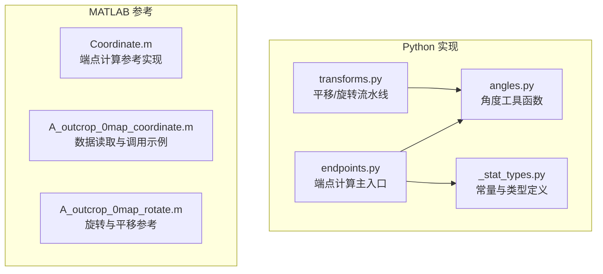
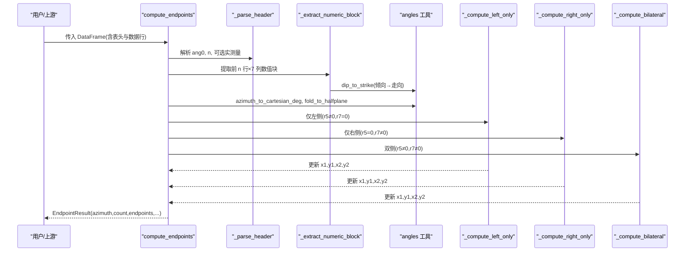
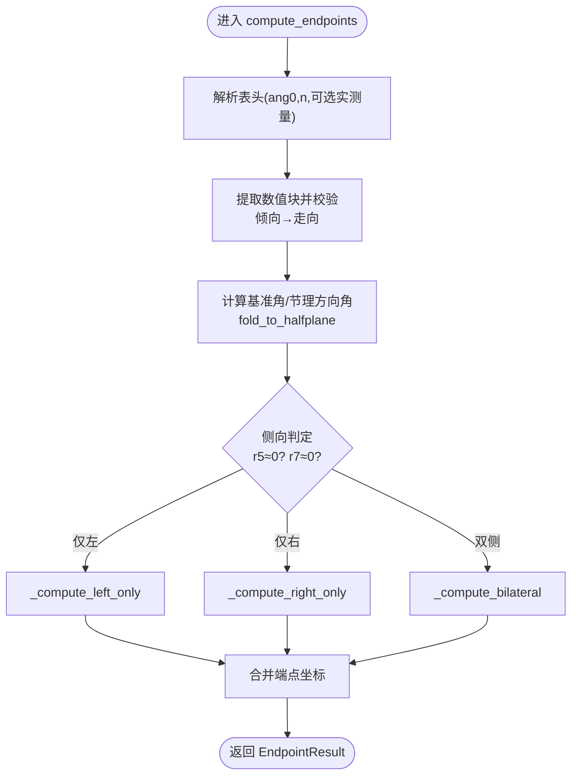
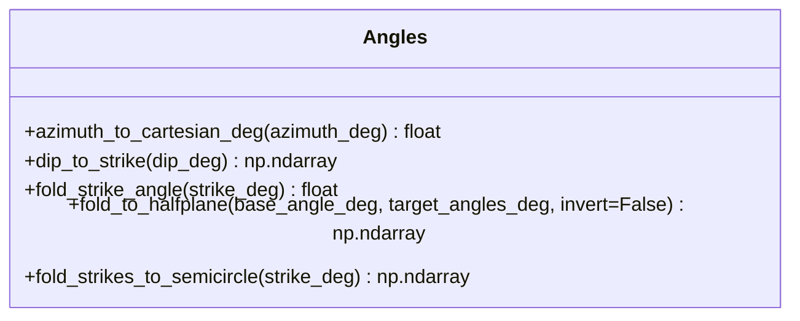
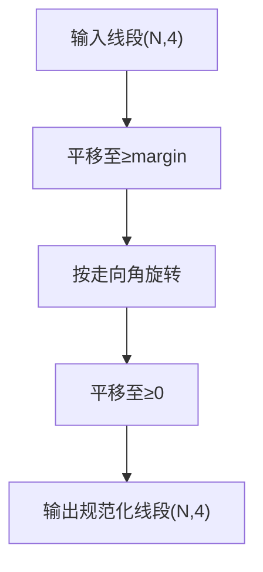
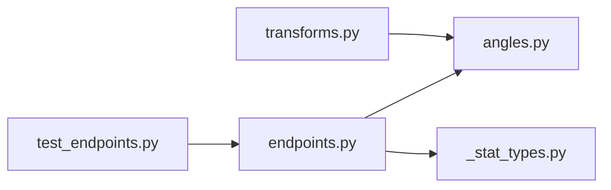

# 端点坐标计算

<cite>
**本文引用的文件**   
- [trace_pipeline/geology/endpoints.py](file://trace_pipeline/geology/endpoints.py)
- [trace_pipeline/geology/angles.py](file://trace_pipeline/geology/angles.py)
- [trace_pipeline/geology/transforms.py](file://trace_pipeline/geology/transforms.py)
- [trace_pipeline/geology/_stat_types.py](file://trace_pipeline/geology/_stat_types.py)
- [reference/matlab/Coordinate.m](file://reference/matlab/Coordinate.m)
- [reference/matlab/A_outcrop_0map_coordinate.m](file://reference/matlab/A_outcrop_0map_coordinate.m)
- [reference/matlab/A_outcrop_0map_rotate.m](file://reference/matlab/A_outcrop_0map_rotate.m)
- [tests/test_endpoints.py](file://tests/test_endpoints.py)
</cite>

## 目录
1. [引言](#引言)
2. [项目结构](#项目结构)
3. [核心组件](#核心组件)
4. [架构总览](#架构总览)
5. [详细组件分析](#详细组件分析)
6. [依赖关系分析](#依赖关系分析)
7. [性能与数值稳定性](#性能与数值稳定性)
8. [故障排查指南](#故障排查指南)
9. [结论](#结论)
10. [附录：数学推导与实现要点](#附录数学推导与实现要点)

## 引言
本技术文档聚焦“端点坐标计算模块”，系统阐述复数向量方法在二维空间坐标变换中的应用，以及测线局部坐标系到标准坐标系的转换算法。文档覆盖以下关键点：
- 方位角到笛卡尔坐标的转换公式与角度折叠策略
- r₁–r₇ 测线记录的数学含义与几何意义
- I/II/III 型迹线的端点计算方法（仅左、仅右、双侧）
- 迹线与测线交点的坐标计算流程
- 完整的数学推导、向量化实现技巧与数值稳定性保证
- 角度处理的边界情况与错误检测机制

## 项目结构
与端点坐标计算相关的代码主要位于 geology 子包中，并辅以参考 MATLAB 脚本用于对照验证。

图表来源
- [trace_pipeline/geology/endpoints.py:1-418](file://trace_pipeline/geology/endpoints.py#L1-L418)
- [trace_pipeline/geology/angles.py:1-168](file://trace_pipeline/geology/angles.py#L1-L168)
- [trace_pipeline/geology/transforms.py:1-169](file://trace_pipeline/geology/transforms.py#L1-L169)
- [trace_pipeline/geology/_stat_types.py:1-125](file://trace_pipeline/geology/_stat_types.py#L1-L125)
- [reference/matlab/Coordinate.m:1-111](file://reference/matlab/Coordinate.m#L1-L111)
- [reference/matlab/A_outcrop_0map_coordinate.m:1-77](file://reference/matlab/A_outcrop_0map_coordinate.m#L1-L77)
- [reference/matlab/A_outcrop_0map_rotate.m:1-117](file://reference/matlab/A_outcrop_0map_rotate.m#L1-L117)

章节来源
- [trace_pipeline/geology/endpoints.py:1-418](file://trace_pipeline/geology/endpoints.py#L1-L418)
- [trace_pipeline/geology/angles.py:1-168](file://trace_pipeline/geology/angles.py#L1-L168)
- [trace_pipeline/geology/transforms.py:1-169](file://trace_pipeline/geology/transforms.py#L1-L169)
- [trace_pipeline/geology/_stat_types.py:1-125](file://trace_pipeline/geology/_stat_types.py#L1-L125)
- [reference/matlab/Coordinate.m:1-111](file://reference/matlab/Coordinate.m#L1-L111)
- [reference/matlab/A_outcrop_0map_coordinate.m:1-77](file://reference/matlab/A_outcrop_0map_coordinate.m#L1-L77)
- [reference/matlab/A_outcrop_0map_rotate.m:1-117](file://reference/matlab/A_outcrop_0map_rotate.m#L1-L117)

## 核心组件
- 端点计算主入口 compute_endpoints：解析表头、提取数值矩阵、倾向转走向、按左右侧情形分别计算端点坐标，返回结构化结果。
- 角度工具 angles：方位角到笛卡尔角转换、倾向到走向转换、半平面折叠、走向角折叠等纯函数。
- 坐标变换 transforms：平移至正象限、按走向旋转、再平移至非负区域的规范化流水线。
- 统计类型 _stat_types：提供浮点容差常量 EPS 等基础类型。

章节来源
- [trace_pipeline/geology/endpoints.py:295-411](file://trace_pipeline/geology/endpoints.py#L295-L411)
- [trace_pipeline/geology/angles.py:28-168](file://trace_pipeline/geology/angles.py#L28-L168)
- [trace_pipeline/geology/transforms.py:86-169](file://trace_pipeline/geology/transforms.py#L86-L169)
- [trace_pipeline/geology/_stat_types.py:11-11](file://trace_pipeline/geology/_stat_types.py#L11-L11)

## 架构总览
下图展示从 Excel 输入到端点输出的端到端流程，包括角度转换、复数向量合成与分情况计算。

图表来源
- [trace_pipeline/geology/endpoints.py:295-411](file://trace_pipeline/geology/endpoints.py#L295-L411)
- [trace_pipeline/geology/angles.py:28-148](file://trace_pipeline/geology/angles.py#L28-L148)

## 详细组件分析

### 端点计算主流程 compute_endpoints
- 职责：整合表头解析、数值提取、角度转换与三种情形的端点计算；以向量化方式批量处理 N 条迹线。
- 关键步骤：
  - 解析表头：获取测线走向角 azim、迹线条数 n，以及可选实测测线长度与露头面积。
  - 提取数值块：取前 n 行 × 7 列，校验数值有效性，并将倾向转换为走向。
  - 基准角与节理方向角：将方位角转为笛卡尔角，计算节理方向角。
  - 侧向判定：基于 r5、r7 与容差 EPS 判断左/右/双侧。
  - 复数向量合成：构造 z1_base、垂直向量、斜向向量，按 mask 就地写入预分配数组。
  - 组装输出：端点坐标 (N,4)、走向、段长、位置、可选实测量。

章节来源
- [trace_pipeline/geology/endpoints.py:295-411](file://trace_pipeline/geology/endpoints.py#L295-L411)
- [trace_pipeline/geology/endpoints.py:113-179](file://trace_pipeline/geology/endpoints.py#L113-L179)
- [trace_pipeline/geology/endpoints.py:182-205](file://trace_pipeline/geology/endpoints.py#L182-L205)
- [trace_pipeline/geology/_stat_types.py:11-11](file://trace_pipeline/geology/_stat_types.py#L11-L11)

#### 三种情形的端点计算
- 仅左侧（I 型）：start = z1 + r2·L_perp + r4·L_skew；end = start + r5·L_skew
- 仅右侧（II 型）：start = z1 + r2·R_perp + r6·R_skew；end = start + r7·R_skew
- 双侧（III 型）：left = z1 + r2·L_perp + (r4+r5)·L_skew；right = z1 + r2·R_perp + (r6+r7)·R_skew

图表来源
- [trace_pipeline/geology/endpoints.py:210-289](file://trace_pipeline/geology/endpoints.py#L210-L289)
- [trace_pipeline/geology/endpoints.py:295-411](file://trace_pipeline/geology/endpoints.py#L295-L411)

章节来源
- [trace_pipeline/geology/endpoints.py:210-289](file://trace_pipeline/geology/endpoints.py#L210-L289)

### 角度工具 angles
- 方位角到笛卡尔角：地质方位角（北偏东顺时针）→ 数学笛卡尔角（东偏北逆时针）。
- 倾向到走向：按象限分段映射，保持值域 [0,360)。
- 半平面折叠：将目标角折叠到以基准角为界的半平面内，确保左/右侧方向向量严格位于相应半平面。
- 走向角折叠：将 0°–360° 走向角折叠到 [−90°,90°] 并转弧度，用于旋转矩阵构建。

图表来源
- [trace_pipeline/geology/angles.py:28-168](file://trace_pipeline/geology/angles.py#L28-L168)

章节来源
- [trace_pipeline/geology/angles.py:28-168](file://trace_pipeline/geology/angles.py#L28-L168)

### 坐标变换 transforms
- 平移至正象限：将所有坐标平移到 ≥ margin 的区域。
- 旋转+平移：按走向角旋转后再次平移至非负区域。
- 规范化流水线：先平移、再旋转、最后平移，保证坐标稳定且非负。

图表来源
- [trace_pipeline/geology/transforms.py:86-169](file://trace_pipeline/geology/transforms.py#L86-L169)

章节来源
- [trace_pipeline/geology/transforms.py:86-169](file://trace_pipeline/geology/transforms.py#L86-L169)

### 与 MATLAB 参考实现的对应关系
- Coordinate.m 使用复数向量表达起点与方向向量，根据 r4/r6 是否为 0 分支计算端点。
- Python 版通过 fold_to_halfplane 统一处理左右半平面，避免多分支重复逻辑，提升可维护性与性能。
- A_outcrop_0map_coordinate.m 与 A_outcrop_0map_rotate.m 展示了数据读取、端点计算与后续旋转/平移的流程。

章节来源
- [reference/matlab/Coordinate.m:1-111](file://reference/matlab/Coordinate.m#L1-L111)
- [reference/matlab/A_outcrop_0map_coordinate.m:1-77](file://reference/matlab/A_outcrop_0map_coordinate.m#L1-L77)
- [reference/matlab/A_outcrop_0map_rotate.m:1-117](file://reference/matlab/A_outcrop_0map_rotate.m#L1-L117)

## 依赖关系分析
- endpoints.py 依赖 angles.py 的角度转换与折叠函数，依赖 _stat_types.py 的容差常量。
- transforms.py 依赖 angles.py 的走向角折叠函数。
- 测试用例 test_endpoints.py 对 compute_endpoints 进行边界与精度断言，覆盖空表、列数不足、非法表头、负 r1、缺失迹线、单侧/双侧迹线、可选实测量解析等场景。

图表来源
- [trace_pipeline/geology/endpoints.py:1-418](file://trace_pipeline/geology/endpoints.py#L1-L418)
- [trace_pipeline/geology/angles.py:1-168](file://trace_pipeline/geology/angles.py#L1-L168)
- [trace_pipeline/geology/transforms.py:1-169](file://trace_pipeline/geology/transforms.py#L1-L169)
- [trace_pipeline/geology/_stat_types.py:1-125](file://trace_pipeline/geology/_stat_types.py#L1-L125)
- [tests/test_endpoints.py:1-103](file://tests/test_endpoints.py#L1-L103)

章节来源
- [trace_pipeline/geology/endpoints.py:1-418](file://trace_pipeline/geology/endpoints.py#L1-L418)
- [trace_pipeline/geology/angles.py:1-168](file://trace_pipeline/geology/angles.py#L1-L168)
- [trace_pipeline/geology/transforms.py:1-169](file://trace_pipeline/geology/transforms.py#L1-L169)
- [trace_pipeline/geology/_stat_types.py:1-125](file://trace_pipeline/geology/_stat_types.py#L1-L125)
- [tests/test_endpoints.py:1-103](file://tests/test_endpoints.py#L1-L103)

## 性能与数值稳定性
- 向量化实现：
  - 预分配 x1,y1,x2,y2 数组，按 mask 就地写入，避免循环与多次内存分配。
  - 使用 numpy 广播与复数运算一次性完成大量点坐标合成。
- 数值稳定性：
  - 使用容差 EPS 比较 r5、r7 是否为零，避免浮点残留导致误判。
  - 角度模 360° 与半平面折叠保证角度连续性与边界一致性。
  - 输入校验拒绝 NaN/inf 与越界角度，提前失败，减少下游异常。
- 复杂度：
  - 时间 O(N)，空间 O(N)，适合大规模批处理。

章节来源
- [trace_pipeline/geology/endpoints.py:335-345](file://trace_pipeline/geology/endpoints.py#L335-L345)
- [trace_pipeline/geology/endpoints.py:161-179](file://trace_pipeline/geology/endpoints.py#L161-L179)
- [trace_pipeline/geology/angles.py:138-148](file://trace_pipeline/geology/angles.py#L138-L148)
- [trace_pipeline/geology/_stat_types.py:11-11](file://trace_pipeline/geology/_stat_types.py#L11-L11)

## 故障排查指南
- 常见错误与定位：
  - 输入表格为空或列数不足：检查首行列布局与最小列数要求。
  - 表头解析失败：确认第 8、9 列为有效数字且在合法范围。
  - 数据包含非数值或 inf/NaN：检查前 n 行 × 7 列数值块。
  - r1 为负或 dip 越界：修正原始记录。
  - r5 与 r7 同时为 0：至少一侧需有迹长。
- 调试建议：
  - 打印中间变量：ang_base_deg、rad_base、ang_joint、vec_perp_*、vec_skew_*。
  - 对比 MATLAB 参考：使用相同 ang0、dd、r1..r7 参数，核对端点坐标数量级与符号。
  - 使用单元测试断言：参考 test_endpoints.py 的边界与精度用例。

章节来源
- [trace_pipeline/geology/endpoints.py:113-205](file://trace_pipeline/geology/endpoints.py#L113-L205)
- [tests/test_endpoints.py:23-103](file://tests/test_endpoints.py#L23-L103)

## 结论
本模块以复数向量为核心，结合角度折叠与半平面判定，实现了高效、稳健的端点坐标计算。通过向量化与严格的输入校验，保证了大规模数据的处理性能与数值稳定性。与 MATLAB 参考实现保持一致的数学语义，便于迁移与验证。

## 附录：数学推导与实现要点

### 方位角到笛卡尔坐标的转换
- 地质方位角（北偏东顺时针）α ∈ [0,360) → 数学笛卡尔角 θ ∈ [0,360)：
  - 若 α < 90：θ = 90 − α
  - 否则：θ = 450 − α
- 单位向量表示：v = exp(i·θ_rad)

章节来源
- [trace_pipeline/geology/angles.py:28-37](file://trace_pipeline/geology/angles.py#L28-L37)

### 倾向到走向的转换
- 规则（与 MATLAB 一致）：
  - dd ≥ 270° → strike = dd − 270°
  - 90° ≤ dd < 270° → strike = dd − 90°
  - dd < 90° → strike = dd + 90°
- 返回值域 [0,360)

章节来源
- [trace_pipeline/geology/angles.py:43-70](file://trace_pipeline/geology/angles.py#L43-L70)

### 半平面折叠与方向向量
- 以基准角 base 划分半平面，将目标角折叠到指定半平面内，必要时加 180° 翻转。
- 左/右侧迹线方向向量：
  - L_perp = exp(i·(base + π/2))
  - R_perp = exp(i·(base − π/2))
  - L_skew = exp(i·fold_to_halfplane(base, ang_joint, invert=False))
  - R_skew = exp(i·fold_to_halfplane(base, ang_joint, invert=True))

章节来源
- [trace_pipeline/geology/angles.py:108-148](file://trace_pipeline/geology/angles.py#L108-L148)
- [trace_pipeline/geology/endpoints.py:340-345](file://trace_pipeline/geology/endpoints.py#L340-L345)

### r₁–r₇ 测线记录的数学含义与几何意义
- r₁：沿测线位移（起点沿测线方向的偏移）
- r₂：垂直测线位移（起点垂直于测线方向的偏移）
- r₃：左侧起始偏移（在 MATLAB 中作为左起始偏移，Python 中未直接使用，由 r4 替代）
- r₄：左侧起始偏移（Python 中用 r4 表示）
- r₅：左侧迹长（左段长度）
- r₆：右侧起始偏移（Python 中用 r6 表示）
- r₇：右侧迹长（右段长度）
- 几何意义：
  - 起点 z1 = r₁·e^(i·θ_base)
  - 经 r₂ 垂直偏移与 r₄/r₆ 起始偏移到达迹线起点
  - 沿 L_skew/R_skew 方向延伸 r₅/r₇ 得到终点

章节来源
- [trace_pipeline/geology/endpoints.py:52-66](file://trace_pipeline/geology/endpoints.py#L52-L66)
- [reference/matlab/Coordinate.m:1-111](file://reference/matlab/Coordinate.m#L1-L111)

### I/II/III 型迹线的端点计算
- I 型（仅左侧）：
  - start = z1 + r₂·L_perp + r₄·L_skew
  - end = start + r₅·L_skew
- II 型（仅右侧）：
  - start = z1 + r₂·R_perp + r₆·R_skew
  - end = start + r₇·R_skew
- III 型（双侧）：
  - left = z1 + r₂·L_perp + (r₄ + r₅)·L_skew
  - right = z1 + r₂·R_perp + (r₆ + r₇)·R_skew

章节来源
- [trace_pipeline/geology/endpoints.py:210-289](file://trace_pipeline/geology/endpoints.py#L210-L289)

### 角度处理的边界情况与错误检测
- 角度边界：
  - fold_to_halfplane 在半平面边界处采用开区间判定，确保连续性。
  - fold_strike_angle 将走向角折叠到 [−π/2, π/2]，避免旋转矩阵奇异。
- 错误检测：
  - 表头角度必须在 [0,360) 且有限。
  - 迹线条数为正整数且不超出数据行数。
  - 数值块禁止 NaN/inf，r₁ 与长度字段非负，dip 在 [0,360)。
  - r₅ 与 r₇ 不能同时为 0。

章节来源
- [trace_pipeline/geology/angles.py:96-103](file://trace_pipeline/geology/angles.py#L96-L103)
- [trace_pipeline/geology/angles.py:138-148](file://trace_pipeline/geology/angles.py#L138-L148)
- [trace_pipeline/geology/endpoints.py:113-205](file://trace_pipeline/geology/endpoints.py#L113-L205)

### 与 MATLAB 参考实现的对照
- Coordinate.m 使用复数向量与条件分支计算端点；Python 版通过 fold_to_halfplane 统一左右半平面逻辑，简化分支。
- A_outcrop_0map_coordinate.m 与 A_outcrop_0map_rotate.m 展示了数据读取、端点计算与后续旋转/平移流程，与 Python 的 transforms 流水线语义一致。

章节来源
- [reference/matlab/Coordinate.m:1-111](file://reference/matlab/Coordinate.m#L1-L111)
- [reference/matlab/A_outcrop_0map_coordinate.m:1-77](file://reference/matlab/A_outcrop_0map_coordinate.m#L1-L77)
- [reference/matlab/A_outcrop_0map_rotate.m:1-117](file://reference/matlab/A_outcrop_0map_rotate.m#L1-L117)