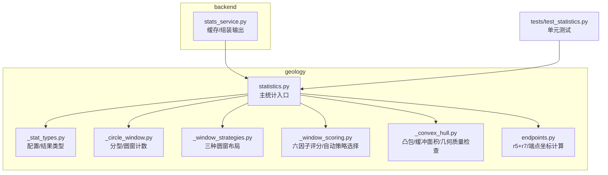
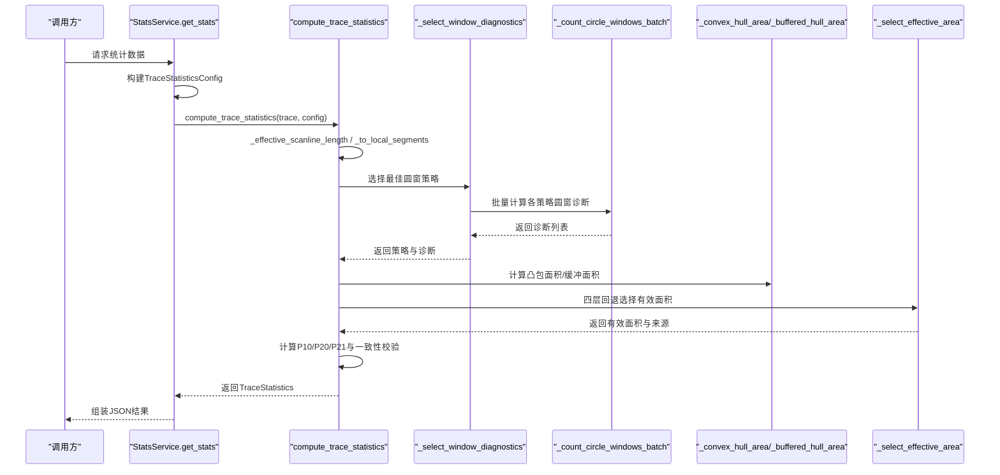
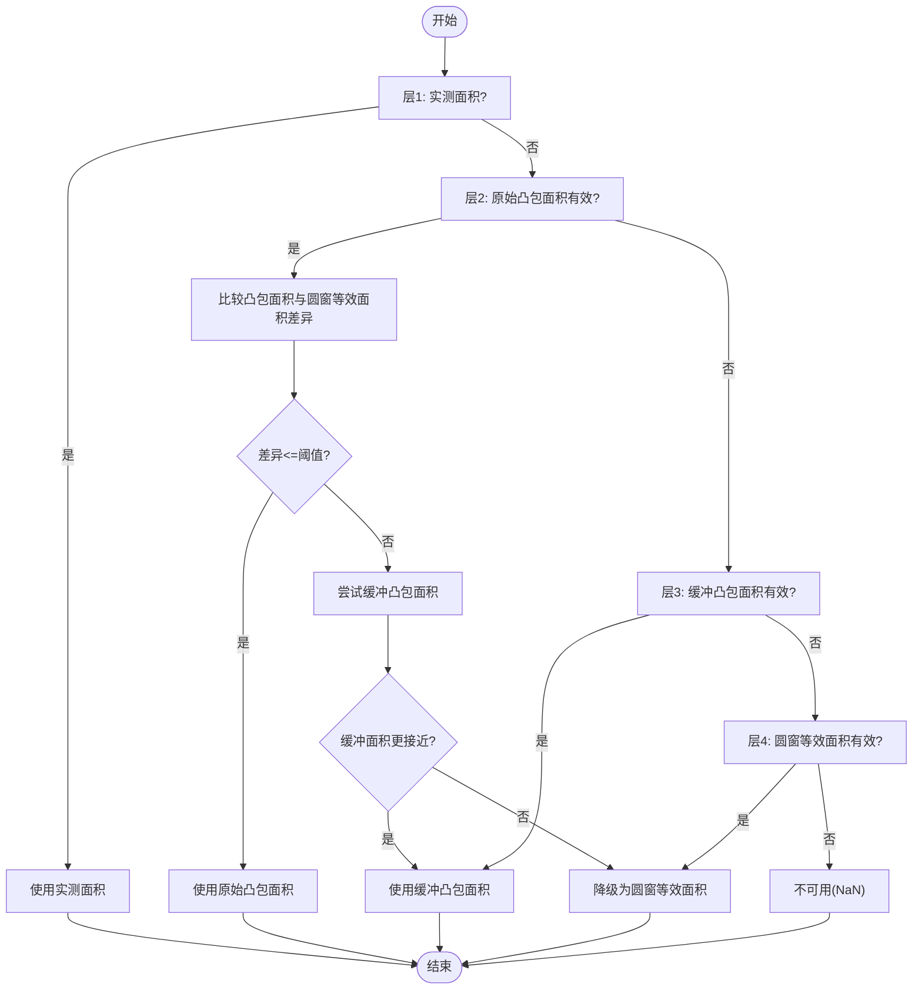
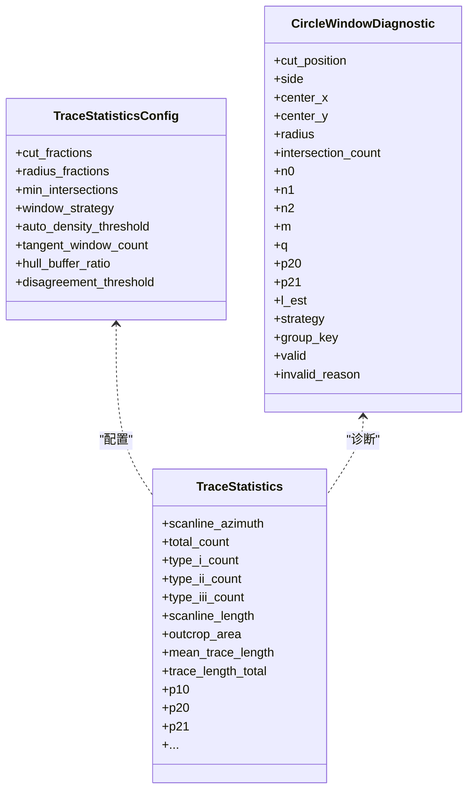

# 统计分析算法

<cite>
**本文引用的文件**
- [statistics.py](file://trace_pipeline/geology/statistics.py)
- [_stat_types.py](file://trace_pipeline/geology/_stat_types.py)
- [_window_scoring.py](file://trace_pipeline/geology/_window_scoring.py)
- [_circle_window.py](file://trace_pipeline/geology/_circle_window.py)
- [_convex_hull.py](file://trace_pipeline/geology/_convex_hull.py)
- [endpoints.py](file://trace_pipeline/geology/endpoints.py)
- [nodes.py](file://trace_pipeline/analysis/nodes.py)
- [stats_service.py](file://backend/services/stats_service.py)
- [test_statistics.py](file://tests/test_statistics.py)
</cite>

## 目录
1. [引言](#引言)
2. [项目结构](#项目结构)
3. [核心组件](#核心组件)
4. [架构总览](#架构总览)
5. [详细组件分析](#详细组件分析)
6. [依赖关系分析](#依赖关系分析)
7. [性能考虑](#性能考虑)
8. [故障排查指南](#故障排查指南)
9. [结论](#结论)
10. [附录：数学公式与实现要点](#附录数学公式与实现要点)

## 引言
本技术文档聚焦于 TracePipeline 中的“迹线密度统计”模块，系统阐述 P₁₀/P₂₀/P₂₁ 密度的数学原理与工程实现，包括测线长度估计、露头面积计算、观测迹长总长度估算、自适应阈值机制、四层回退策略（实测面积→凸包面积→缓冲凸包→圆窗等效面积）、以及观测迹长优先链（segment(r5+r7) → endpoint(端点欧氏距离)）。文档同时给出代码级流程图与类图，帮助读者从概念到实现逐层理解。

## 项目结构
统计分析相关代码主要位于 geology 子包中，围绕“数据模型 + 几何工具 + 窗口策略 + 评分选择 + 主统计入口”组织；后端服务将统计结果与可视化覆盖层整合并对外提供接口。

图表来源
- [statistics.py:1-45](file://trace_pipeline/geology/statistics.py#L1-L45)
- [_stat_types.py:14-65](file://trace_pipeline/geology/_stat_types.py#L14-L65)
- [_circle_window.py:12-66](file://trace_pipeline/geology/_circle_window.py#L12-L66)
- [_window_strategies.py:173-185](file://trace_pipeline/geology/_window_strategies.py#L173-L185)
- [_window_scoring.py:235-323](file://trace_pipeline/geology/_window_scoring.py#L235-L323)
- [_convex_hull.py:79-114](file://trace_pipeline/geology/_convex_hull.py#L79-L114)
- [endpoints.py:300-418](file://trace_pipeline/geology/endpoints.py#L300-L418)
- [stats_service.py:101-150](file://backend/services/stats_service.py#L101-L150)
- [test_statistics.py:256-292](file://tests/test_statistics.py#L256-L292)

章节来源
- [statistics.py:1-45](file://trace_pipeline/geology/statistics.py#L1-L45)
- [_stat_types.py:14-65](file://trace_pipeline/geology/_stat_types.py#L14-L65)

## 核心组件
- 数据类型与配置
  - TraceStatisticsConfig：控制圆窗策略、半径分数、最小相交数、凸包缓冲比、不一致阈值等。
  - CircleWindowDiagnostic：单个圆窗的计数与有效性诊断。
  - TraceStatistics：最终统计结果，包含 P₁₀/P₂₀/P₂₁、面积来源、策略来源、一致性告警等。
- 几何与窗口
  - 迹线分型 I/II/III：基于向量叉积与参数 t/u 判断。
  - 圆窗批量计数：向量化最近点距离与相交判定，统计 n0/n1/n2，导出 p20/p21/l_est。
  - 凸包与缓冲：Shoelace 面积、Minkowski 和近似缓冲面积、几何质量检查。
- 策略与评分
  - 三种圆窗布局：切圆(tangent)、混合(hybrid)、同心(concentric)。
  - 六因子加权评分：有效分组数量、空间覆盖、稳定性、样本充分性、半径大小等。
  - 自动策略选择：在评分基础上结合密度偏好与容差回退。
- 主统计流程
  - 测线长度估计与局部坐标系变换。
  - 观测迹长优先链与有效迹长回退链。
  - 四层回退面积选择与一致性校验。

章节来源
- [_stat_types.py:14-125](file://trace_pipeline/geology/_stat_types.py#L14-L125)
- [_circle_window.py:12-269](file://trace_pipeline/geology/_circle_window.py#L12-L269)
- [_convex_hull.py:17-114](file://trace_pipeline/geology/_convex_hull.py#L17-L114)
- [_window_strategies.py:52-185](file://trace_pipeline/geology/_window_strategies.py#L52-L185)
- [_window_scoring.py:178-323](file://trace_pipeline/geology/_window_scoring.py#L178-L323)
- [statistics.py:212-391](file://trace_pipeline/geology/statistics.py#L212-L391)

## 架构总览
下图展示从输入数据到最终统计结果的端到端调用序列，突出关键路径：测线长度估计、圆窗策略选择、面积回退、P₁₀/P₂₀/P₂₁ 计算与一致性校验。

图表来源
- [stats_service.py:101-150](file://backend/services/stats_service.py#L101-L150)
- [statistics.py:212-391](file://trace_pipeline/geology/statistics.py#L212-L391)
- [_window_scoring.py:235-323](file://trace_pipeline/geology/_window_scoring.py#L235-L323)
- [_circle_window.py:71-216](file://trace_pipeline/geology/_circle_window.py#L71-L216)
- [_convex_hull.py:79-114](file://trace_pipeline/geology/_convex_hull.py#L79-L114)

## 详细组件分析

### 测线长度估计与局部坐标系
- 测线长度来源
  - 若提供实测测线长度，则直接使用；否则根据 scanline_positions 的间距中位数估计，取最大位置加半间距作为有效长度。
- 局部坐标系
  - 依据测线方位角将全局坐标旋转至沿测线方向，便于后续分类与圆窗布局。

章节来源
- [statistics.py:51-78](file://trace_pipeline/geology/statistics.py#L51-L78)

### 自适应阈值机制
- 面积降级阈值（disagreement）
  - 随迹线数量增加而更严格，采用指数衰减形式，避免小样本下误判。
- 一致性阈值（consistency）
  - 用于主 P₂₀/P₂₁ 与圆窗估计值之间的相对差异检验，同样随样本量衰减。

章节来源
- [statistics.py:84-94](file://trace_pipeline/geology/statistics.py#L84-L94)

### 四层回退面积选择算法
目标：在多种面积候选中选择最稳健的“有效面积”，并记录来源与差异比率。

图表来源
- [statistics.py:106-166](file://trace_pipeline/geology/statistics.py#L106-L166)
- [_convex_hull.py:186-208](file://trace_pipeline/geology/_convex_hull.py#L186-L208)
- [_convex_hull.py:103-114](file://trace_pipeline/geology/_convex_hull.py#L103-L114)
- [statistics.py:99-104](file://trace_pipeline/geology/statistics.py#L99-L104)

### 观测迹长优先链与有效迹长回退链
- 观测迹长优先链
  - 优先使用 segment 长度之和（r5+r7），若无效则回退到 endpoint 端点欧氏距离之和，再无效则为 NaN。
- 有效迹长回退链
  - 若观测总长可用则直接采用；否则以圆窗估计的平均迹长 × 迹线数作为替代。

章节来源
- [statistics.py:179-206](file://trace_pipeline/geology/statistics.py#L179-L206)
- [endpoints.py:300-418](file://trace_pipeline/geology/endpoints.py#L300-L418)

### 圆窗策略与六因子评分
- 三种布局
  - tangent：按切圆半径与侧高生成多组窗口。
  - hybrid：按切割比例与侧高组合生成窗口族。
  - concentric：以中心为圆心、不同半径生成同心圆族。
- 六因子评分
  - 有效分组数量、有效分组占比、空间覆盖（侧向+沿测线）、指标稳定性（变异系数倒数）、半径大小、样本充分性（相交数）。
- 自动策略选择
  - 先计算各策略得分，若无有效候选或得分非正，回退到密度偏好策略；当高分策略与密度偏好接近时，倾向密度偏好以提升鲁棒性。

章节来源
- [_window_strategies.py:52-185](file://trace_pipeline/geology/_window_strategies.py#L52-L185)
- [_window_scoring.py:178-323](file://trace_pipeline/geology/_window_scoring.py#L178-L323)

### 迹线分型与圆窗计数
- 分型 I/II/III
  - 基于线段与测线的叉积与参数 t/u 判定是否相交、延长线相交或平行不相交。
- 圆窗计数
  - 向量化计算每条线段到每个圆心的最近点距离，统计端点在圆内情况，得到 n0/n1/n2，进而计算 p20、p21、l_est。

章节来源
- [_circle_window.py:12-66](file://trace_pipeline/geology/_circle_window.py#L12-L66)
- [_circle_window.py:71-216](file://trace_pipeline/geology/_circle_window.py#L71-L216)

### 凸包与缓冲面积
- 凸包面积
  - 使用 Shoelace 公式，并对顶点中心化以提高大坐标精度。
- 缓冲面积
  - 基于 Minkowski 和解析近似：A' = A + P·d + π·d²。
- 几何质量检查
  - 要求点数足够、非退化、面积有限且非极度狭长（主成分分析的主轴长宽比限制）。

章节来源
- [_convex_hull.py:49-114](file://trace_pipeline/geology/_convex_hull.py#L49-L114)
- [_convex_hull.py:186-208](file://trace_pipeline/geology/_convex_hull.py#L186-L208)

### 主统计入口与一致性校验
- 主流程
  - 计算测线长度与局部坐标 → 分类迹线类型 → 选择圆窗策略并聚合 l_est/p20/p21 → 计算凸包与缓冲面积 → 选择有效面积 → 计算 P₁₀/P₂₀/P₂₁。
- 一致性校验
  - 若主 P₂₀/P₂₁ 与圆窗估计值差异超过自适应阈值，产生警告日志。

章节来源
- [statistics.py:212-391](file://trace_pipeline/geology/statistics.py#L212-L391)

### 节点识别（辅助）
- 通过包围盒筛选与精确相交检测，识别 X/Y/I 三类节点，并进行空间网格聚类合并，输出拓扑度与事件计数。该功能与密度统计并行，服务于可视化与网络拓扑分析。

章节来源
- [nodes.py:160-417](file://trace_pipeline/analysis/nodes.py#L160-L417)

## 依赖关系分析
- 模块耦合
  - statistics.py 为核心编排者，依赖 _circle_window、_convex_hull、_window_scoring、_stat_types。
  - _window_scoring 依赖 _circle_window 与 _window_strategies。
  - endpoints.py 提供 r5+r7 与端点坐标，供上层统计使用。
- 外部集成
  - backend.stats_service 负责加载数据、构造配置、调用统计、组装输出与缓存。

图表来源
- [_stat_types.py:14-125](file://trace_pipeline/geology/_stat_types.py#L14-L125)

章节来源
- [statistics.py:1-45](file://trace_pipeline/geology/statistics.py#L1-L45)
- [_stat_types.py:14-125](file://trace_pipeline/geology/_stat_types.py#L14-L125)

## 性能考虑
- 向量化计算
  - 圆窗计数使用广播矩阵一次性计算 N×M 的距离与最近点，显著降低 Python 循环开销。
- 批处理与分组
  - 窗口策略批量生成与评分聚合，减少重复计算。
- 数值稳定
  - 凸包面积中心化、安全分母与 EPS 容差，避免除零与大坐标误差。
- 缓存
  - 后端服务对统计结果进行 TTL 缓存，键由影响字段与输入文件指纹构成，提升重复查询性能。

章节来源
- [_circle_window.py:71-216](file://trace_pipeline/geology/_circle_window.py#L71-L216)
- [_convex_hull.py:49-114](file://trace_pipeline/geology/_convex_hull.py#L49-L114)
- [stats_service.py:88-150](file://backend/services/stats_service.py#L88-L150)

## 故障排查指南
- 常见问题
  - 测线长度为 0 或 NaN：检查 measured_scanline_length 与 scanline_positions 的有效性。
  - 无有效圆窗：确认 min_intersections 与 auto_density_threshold 设置是否合理。
  - 面积来源异常：查看 area_source 与 window_validation_warning，必要时调整 hull_buffer_ratio 或 disagreement_threshold。
  - 节点识别跳过退化线段：检查 merge_tolerance 与数据尺度。
- 定位方法
  - 启用调试日志，关注“统计来源”与“校验告警”信息。
  - 对比主 P₂₀/P₂₁ 与圆窗估计值的差异比率，评估一致性阈值是否过严。

章节来源
- [statistics.py:313-356](file://trace_pipeline/geology/statistics.py#L313-L356)
- [stats_service.py:101-150](file://backend/services/stats_service.py#L101-L150)
- [test_statistics.py:100-111](file://tests/test_statistics.py#L100-L111)

## 结论
本模块通过“几何质量检查 + 自适应阈值 + 多层回退 + 六因子评分”的组合策略，实现了稳健的 P₁₀/P₂₀/P₂₁ 密度估计。其设计兼顾了理论严谨性与工程可用性，既能在数据不足时优雅回退，又能在数据充足时充分利用观测信息，并通过一致性校验保障结果可信度。

## 附录：数学公式与实现要点

- 测线长度估计
  - 若未提供实测长度，使用 scanline_positions 的中位间距 s̃，取 L̂ = max(pos) + 0.5·s̃。
  - 参考实现路径：[statistics.py:51-68](file://trace_pipeline/geology/statistics.py#L51-L68)

- 迹线分型 I/II/III
  - 利用叉积与参数 t/u 判定相交与延长线相交，区分 I（穿过）、II（延长线相交）、III（平行不相交）。
  - 参考实现路径：[_circle_window.py:12-66](file://trace_pipeline/geology/_circle_window.py#L12-L66)

- 圆窗计数与密度估计
  - 对每个圆窗统计 n0、n1、n2，定义 m = n1 + 2n2，q = 2n0 + n1。
  - 面密度 P₂₀ = q / (2πR²)，累计长度密度 P₂₁ = m / (4R)，平均迹长估计 l_est = (πR/2)·(m/q)。
  - 参考实现路径：[_circle_window.py:170-216](file://trace_pipeline/geology/_circle_window.py#L170-L216)

- 观测迹长优先链
  - 优先使用 segment 长度之和（r5+r7），其次使用 endpoint 欧氏距离之和，最后回退到 window 估计。
  - 参考实现路径：[statistics.py:179-206](file://trace_pipeline/geology/statistics.py#L179-L206), [endpoints.py:300-418](file://trace_pipeline/geology/endpoints.py#L300-L418)

- 四层回退面积选择
  - 顺序：实测面积 → 原始凸包面积（需几何质量合格且与圆窗等效面积差异小于阈值）→ 缓冲凸包面积 → 圆窗等效面积。
  - 参考实现路径：[statistics.py:106-166](file://trace_pipeline/geology/statistics.py#L106-L166), [_convex_hull.py:103-114](file://trace_pipeline/geology/_convex_hull.py#L103-L114)

- P₁₀/P₂₀/P₂₁ 计算
  - P₁₀ = count / L̂
  - 若有效面积有效：P₂₀ = count / A_eff，P₂₁ = total_length / A_eff；否则回退到圆窗估计值。
  - 参考实现路径：[statistics.py:289-311](file://trace_pipeline/geology/statistics.py#L289-L311)

- 一致性校验
  - 比较主 P₂₀/P₂₁ 与圆窗估计值的相对差异，超过自适应阈值则发出警告。
  - 参考实现路径：[statistics.py:313-336](file://trace_pipeline/geology/statistics.py#L313-L336)

- 数值精度与异常处理
  - 使用 EPS 容差避免浮点误差；对 NaN/inf 进行显式检查；凸包面积中心化提高大坐标精度；缓冲面积使用解析近似保证稳定性。
  - 参考实现路径：[_convex_hull.py:49-114](file://trace_pipeline/geology/_convex_hull.py#L49-L114), [_stat_types.py:11](file://trace_pipeline/geology/_stat_types.py#L11)