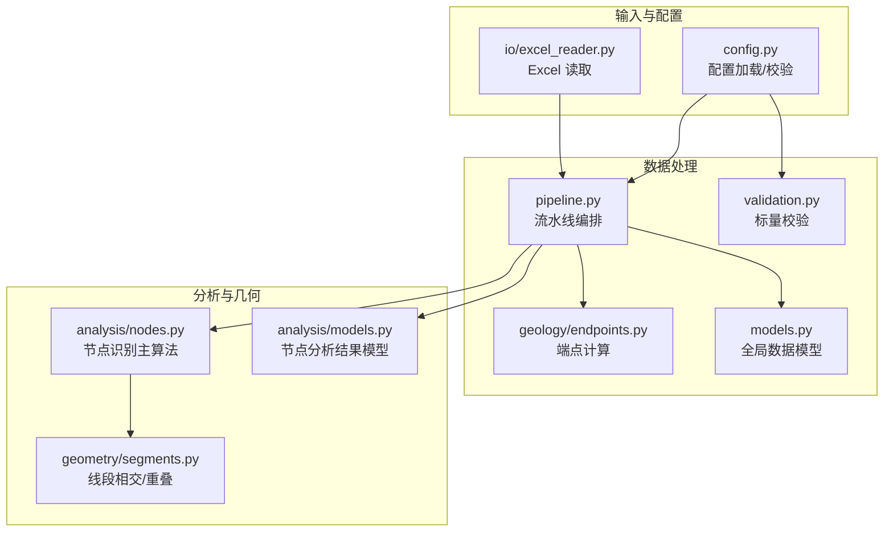
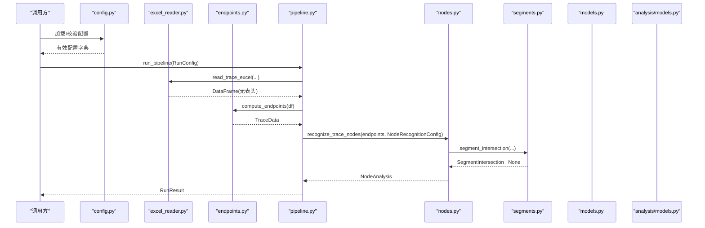
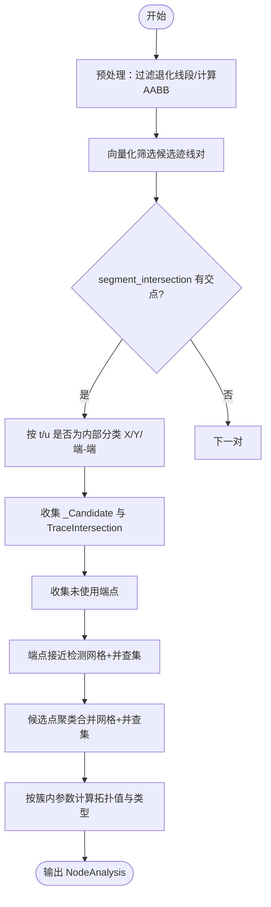
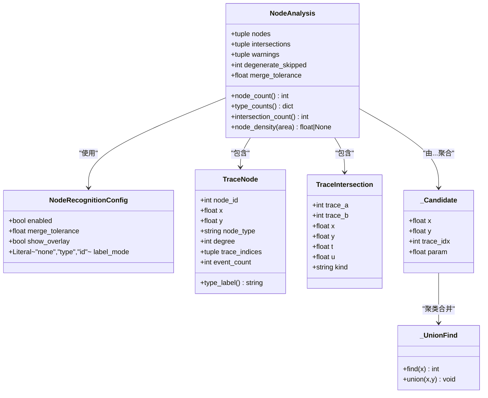
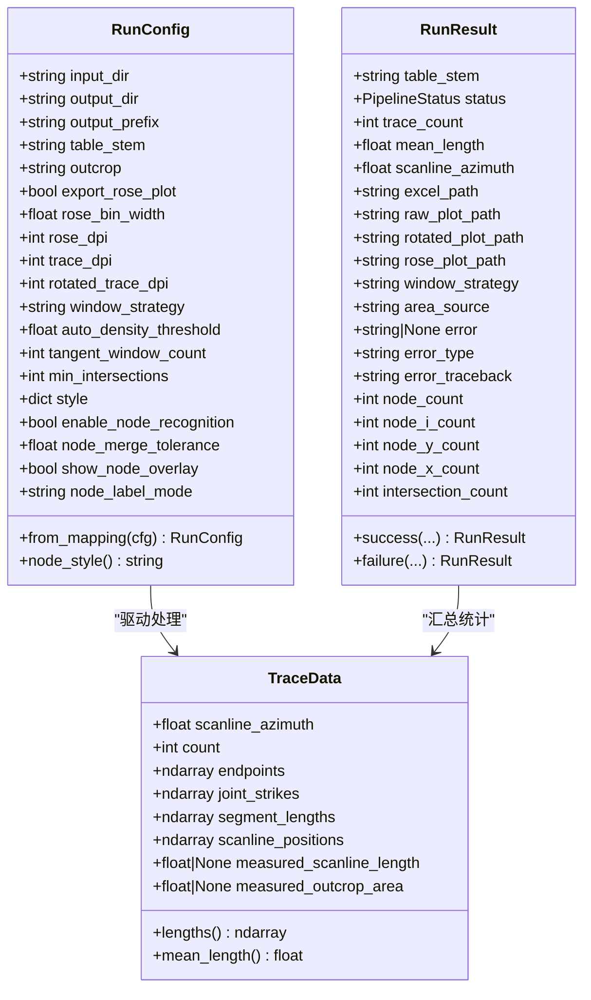
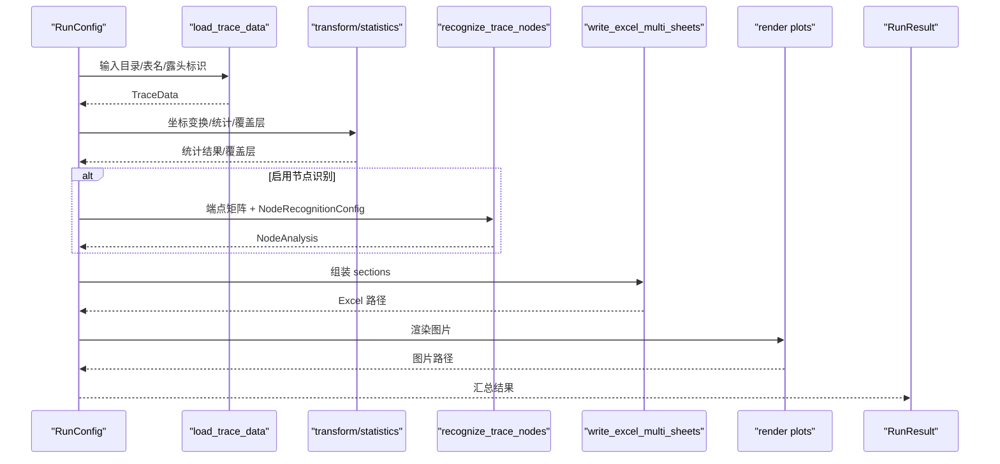
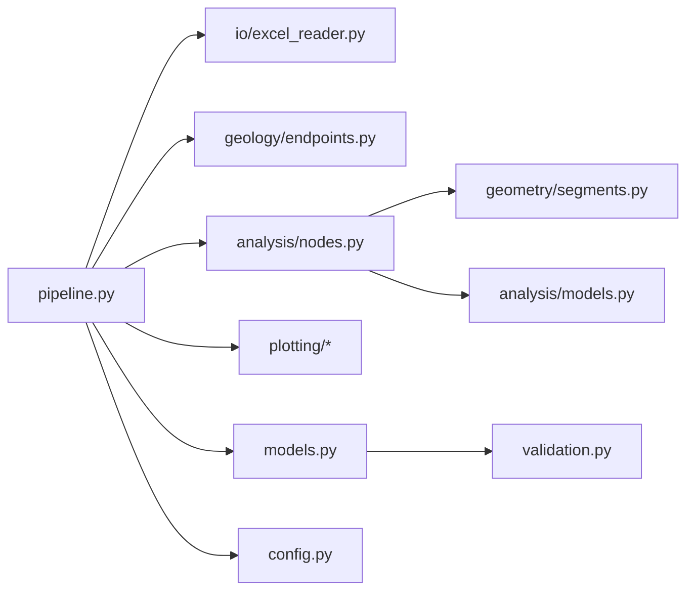
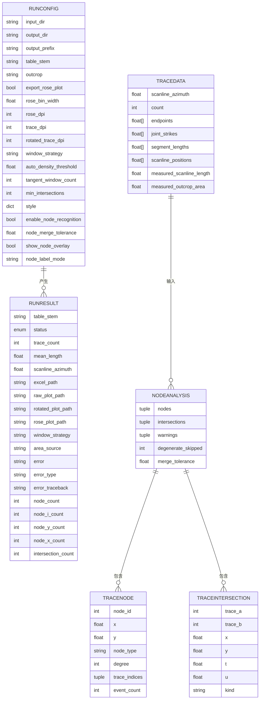

# 数据分析模块

<cite>
**本文引用的文件列表**
- [trace_pipeline/analysis/models.py](file://trace_pipeline/analysis/models.py)
- [trace_pipeline/analysis/nodes.py](file://trace_pipeline/analysis/nodes.py)
- [trace_pipeline/geometry/segments.py](file://trace_pipeline/geometry/segments.py)
- [trace_pipeline/models.py](file://trace_pipeline/models.py)
- [trace_pipeline/validation.py](file://trace_pipeline/validation.py)
- [trace_pipeline/config.py](file://trace_pipeline/config.py)
- [trace_pipeline/pipeline.py](file://trace_pipeline/pipeline.py)
- [trace_pipeline/io/excel_reader.py](file://trace_pipeline/io/excel_reader.py)
- [trace_pipeline/geology/endpoints.py](file://trace_pipeline/geology/endpoints.py)
- [tests/test_nodes.py](file://tests/test_nodes.py)
- [tests/test_models.py](file://tests/test_models.py)
</cite>

## 目录
1. [简介](#简介)
2. [项目结构](#项目结构)
3. [核心组件](#核心组件)
4. [架构总览](#架构总览)
5. [详细组件分析](#详细组件分析)
6. [依赖关系分析](#依赖关系分析)
7. [性能与复杂度](#性能与复杂度)
8. [故障排查指南](#故障排查指南)
9. [结论](#结论)
10. [附录：数据结构与接口规范](#附录数据结构与接口规范)

## 简介
本技术文档聚焦于 TracePipeline 的数据分析模块，围绕以下目标展开：
- 深入解析节点识别算法（I/Y/X 型拓扑节点的几何判断逻辑、距离阈值设置）
- 详细说明核心数据模型 TraceData、RunConfig、RunResult 的设计理念与字段定义
- 解释不可变数据模型（frozen dataclass）的使用模式、优势与约束
- 说明数据验证机制、输入完整性检查与错误处理策略
- 提供从原始数据到分析结果的数据流管道模式
- 给出完整的数据结构图与接口规范

## 项目结构
数据分析相关代码主要分布在如下子包中：
- analysis：节点识别算法与结果模型
- geometry：线段相交等基础几何运算
- models：全局不可变数据模型（TraceData、RunConfig、RunResult）
- validation：通用校验与类型强制转换工具
- config：配置加载、合并与路径解析
- pipeline：端到端流水线编排（加载→变换→统计→节点识别→导出→绘图）
- io：Excel 读取与写入
- geology：地质计算（端点坐标、角度、统计量等）

图表来源
- [trace_pipeline/config.py:86-190](file://trace_pipeline/config.py#L86-L190)
- [trace_pipeline/io/excel_reader.py:36-106](file://trace_pipeline/io/excel_reader.py#L36-L106)
- [trace_pipeline/geology/endpoints.py:113-200](file://trace_pipeline/geology/endpoints.py#L113-L200)
- [trace_pipeline/pipeline.py:230-474](file://trace_pipeline/pipeline.py#L230-L474)
- [trace_pipeline/analysis/nodes.py:160-417](file://trace_pipeline/analysis/nodes.py#L160-L417)
- [trace_pipeline/analysis/models.py:22-98](file://trace_pipeline/analysis/models.py#L22-L98)
- [trace_pipeline/geometry/segments.py:42-113](file://trace_pipeline/geometry/segments.py#L42-L113)
- [trace_pipeline/models.py:41-157](file://trace_pipeline/models.py#L41-L157)
- [trace_pipeline/validation.py:90-112](file://trace_pipeline/validation.py#L90-L112)

章节来源
- [trace_pipeline/config.py:86-190](file://trace_pipeline/config.py#L86-L190)
- [trace_pipeline/pipeline.py:230-474](file://trace_pipeline/pipeline.py#L230-L474)

## 核心组件
- 节点识别算法：基于线段相交检测与空间聚类，识别 I/Y/X 三类节点并输出 NodeAnalysis。
- 核心数据模型：TraceData（单表解析结果）、RunConfig（运行参数）、RunResult（运行结果）。
- 几何基础：线段相交、共线重叠、点到线段距离等。
- 配置与校验：JSON 配置加载、标量字段规范化、必填项校验。
- 流水线编排：串联 Excel 读取、端点计算、统计、节点识别、导出与绘图。

章节来源
- [trace_pipeline/analysis/nodes.py:160-417](file://trace_pipeline/analysis/nodes.py#L160-L417)
- [trace_pipeline/analysis/models.py:22-98](file://trace_pipeline/analysis/models.py#L22-L98)
- [trace_pipeline/models.py:41-157](file://trace_pipeline/models.py#L41-L157)
- [trace_pipeline/geometry/segments.py:42-113](file://trace_pipeline/geometry/segments.py#L42-L113)
- [trace_pipeline/config.py:86-190](file://trace_pipeline/config.py#L86-L190)
- [trace_pipeline/pipeline.py:230-474](file://trace_pipeline/pipeline.py#L230-L474)

## 架构总览
下图展示了从配置与输入到最终结果的端到端流程，以及关键模块间的调用关系。

图表来源
- [trace_pipeline/config.py:86-190](file://trace_pipeline/config.py#L86-L190)
- [trace_pipeline/io/excel_reader.py:36-106](file://trace_pipeline/io/excel_reader.py#L36-L106)
- [trace_pipeline/geology/endpoints.py:113-200](file://trace_pipeline/geology/endpoints.py#L113-L200)
- [trace_pipeline/pipeline.py:230-474](file://trace_pipeline/pipeline.py#L230-L474)
- [trace_pipeline/analysis/nodes.py:160-417](file://trace_pipeline/analysis/nodes.py#L160-L417)
- [trace_pipeline/geometry/segments.py:42-113](file://trace_pipeline/geometry/segments.py#L42-L113)
- [trace_pipeline/models.py:41-157](file://trace_pipeline/models.py#L41-L157)
- [trace_pipeline/analysis/models.py:22-98](file://trace_pipeline/analysis/models.py#L22-L98)

## 详细组件分析

### 节点识别算法（I/Y/X 型拓扑）
- 输入：端点矩阵 (N, 4)，列序 [x1, y1, x2, y2]；NodeRecognitionConfig（enabled、merge_tolerance、show_overlay、label_mode）。
- 预处理：
  - 过滤退化线段（长度小于容差），记录跳过数量与警告。
  - 计算每条迹线的 AABB 包围盒，使用向量化掩码快速筛选候选邻居对。
- 相交检测：
  - 对候选对调用 segment_intersection，得到 t、u、px、py 与 kind。
  - 根据 t、u 是否位于内部（tol < param < 1-tol）分类为 X/Y/端-端事件，生成 _Candidate 与 TraceIntersection。
- 端点接近检测：
  - 收集未使用的端点，网格分桶 + 并查集合并接近的端点，生成候选。
- 聚类合并：
  - 基于空间网格 + 并查集将候选点按 cluster_tol 聚类，cluster_tol = max(tolerance, 0.01 * mean_len)。
- 节点分类与拓扑值：
  - 对每个簇内迹线参数去重后，依据“内部通过”与“端点参与”计数计算拓扑值 tv。
  - 规则：
    - 若两条及以上迹线在内部相交 → X 型
    - 若仅一条迹线内部相交或 tv ≥ 3 → Y 型
    - 否则 → I 型
- 输出：NodeAnalysis（nodes、intersections、warnings、degenerate_skipped、merge_tolerance）。

图表来源
- [trace_pipeline/analysis/nodes.py:160-417](file://trace_pipeline/analysis/nodes.py#L160-L417)
- [trace_pipeline/geometry/segments.py:42-113](file://trace_pipeline/geometry/segments.py#L42-L113)

#### 几何判断与距离阈值
- 内部判定：_is_interior(param, tol) 使用严格不等式 tol < param < 1 - tol。
- 聚类容差：
  - merge_tolerance：用于候选点合并与端点接近检测。
  - cluster_tol：max(tolerance, 0.01 * mean_len)，避免极短迹线导致过度合并。
- 退化判定：长度小于 tolerance 的线段被跳过，并在 warnings 中提示。

章节来源
- [trace_pipeline/analysis/nodes.py:47-50](file://trace_pipeline/analysis/nodes.py#L47-L50)
- [trace_pipeline/analysis/nodes.py:186-195](file://trace_pipeline/analysis/nodes.py#L186-L195)
- [trace_pipeline/analysis/nodes.py:208-222](file://trace_pipeline/analysis/nodes.py#L208-L222)
- [trace_pipeline/analysis/nodes.py:320-383](file://trace_pipeline/analysis/nodes.py#L320-L383)
- [trace_pipeline/analysis/nodes.py:384-417](file://trace_pipeline/analysis/nodes.py#L384-L417)

#### 类与关系图（节点识别）

图表来源
- [trace_pipeline/analysis/models.py:22-98](file://trace_pipeline/analysis/models.py#L22-L98)
- [trace_pipeline/analysis/nodes.py:37-118](file://trace_pipeline/analysis/nodes.py#L37-L118)

章节来源
- [trace_pipeline/analysis/models.py:22-98](file://trace_pipeline/analysis/models.py#L22-L98)
- [trace_pipeline/analysis/nodes.py:37-118](file://trace_pipeline/analysis/nodes.py#L37-L118)

### 核心数据模型（TraceData、RunConfig、RunResult）
- TraceData：
  - 不可变容器，封装单张迹线表的完整解析结果。
  - 字段包括测线走向角、迹线条数、端点坐标、节理走向、分段长度、测线位置、可选实测测线长度与露头面积。
  - __post_init__ 执行形状与数值有效性校验，并将数组设为只读以强化不可变性。
  - 提供 lengths 派生属性缓存（使用 object.__setattr__ 写入私有字段）。
- RunConfig：
  - 不可变运行参数，含输入输出路径、文件名、出图选项、窗口策略、节点识别开关与容差等。
  - from_mapping 工厂方法支持从字典构造，忽略未知键，缺失可选字段回退默认值。
  - __post_init__ 调用 coerce_scalar_config_fields 进行标量字段规范化与范围校验。
- RunResult：
  - 不可变运行结果，包含成功/失败状态、统计摘要、文件路径、错误信息等。
  - success/failure 工厂方法简化构造。

图表来源
- [trace_pipeline/models.py:41-157](file://trace_pipeline/models.py#L41-L157)
- [trace_pipeline/models.py:162-273](file://trace_pipeline/models.py#L162-L273)
- [trace_pipeline/models.py:278-352](file://trace_pipeline/models.py#L278-L352)

章节来源
- [trace_pipeline/models.py:41-157](file://trace_pipeline/models.py#L41-L157)
- [trace_pipeline/models.py:162-273](file://trace_pipeline/models.py#L162-L273)
- [trace_pipeline/models.py:278-352](file://trace_pipeline/models.py#L278-L352)

### 不可变数据模型（frozen dataclass）的使用模式、优势与约束
- 设计模式：
  - 使用 @dataclass(frozen=True) 确保实例创建后不可修改。
  - 通过 __post_init__ 完成强校验与派生属性初始化。
  - 使用 object.__setattr__ 写入私有缓存字段（如 _lengths），保持对外不可变。
- 优势：
  - 线程安全与可哈希性提升（便于缓存与作为字典键）。
  - 明确契约：构造即稳定，减少副作用与竞态条件。
  - 易于测试与推理：输入确定则输出确定。
- 约束：
  - 需要谨慎管理可变对象（如 numpy 数组）的写保护（flags.writeable=False）。
  - 派生属性需通过私有字段缓存，避免重复计算。

章节来源
- [trace_pipeline/models.py:41-157](file://trace_pipeline/models.py#L41-L157)

### 数据验证机制与错误处理策略
- 配置层：
  - load_config：加载 JSON，缺失时使用默认配置；对非法 JSON 抛出 ValueError；对路径不存在/非文件抛出相应异常。
  - validate_config：合并默认值、规范化类型、检查必填项、解析绝对路径。
  - apply_cli_overrides：CLI 覆盖后重新校验。
- 数据层：
  - TraceData.__post_init__：校验 count≥0、各数组形状一致、数值有限、可选正数字段为正有限浮点数。
  - RunConfig.from_mapping/__post_init__：标量字段规范化与范围校验，空字符串拒绝。
  - Excel 读取：read_trace_excel 支持 .xlsx/.xls 自动选择、sheet 回退、大小上限检查、格式校验（列数不足/NaN/Inf）。
- 错误处理：
  - pipeline._handle_pipeline_error：统一捕获异常，记录日志并返回 RunResult.failure。
  - 针对 PermissionError、FileNotFoundError 提供友好提示。

章节来源
- [trace_pipeline/config.py:86-190](file://trace_pipeline/config.py#L86-L190)
- [trace_pipeline/config.py:251-258](file://trace_pipeline/config.py#L251-L258)
- [trace_pipeline/models.py:65-129](file://trace_pipeline/models.py#L65-L129)
- [trace_pipeline/models.py:202-233](file://trace_pipeline/models.py#L202-L233)
- [trace_pipeline/io/excel_reader.py:36-106](file://trace_pipeline/io/excel_reader.py#L36-L106)
- [trace_pipeline/pipeline.py:98-129](file://trace_pipeline/pipeline.py#L98-L129)

### 数据流处理的管道模式（从原始数据到分析结果）
- 阶段 1：加载数据
  - 定位输入 Excel（.xlsx/.xls），读取首行表头与数据块，转换为 TraceData。
- 阶段 2：坐标变换与统计
  - 归一化坐标、计算统计量、构建圆窗与凸包覆盖层。
- 阶段 3：节点识别（可选）
  - 根据 RunConfig.enable_node_recognition 决定是否执行 recognize_trace_nodes。
- 阶段 4：导出 Excel
  - 将 TraceData、统计结果与节点分析结果写入多工作簿。
- 阶段 5：绘制图片
  - 渲染原始/旋转迹线图与玫瑰图，支持节点叠加显示。

图表来源
- [trace_pipeline/pipeline.py:230-474](file://trace_pipeline/pipeline.py#L230-L474)
- [trace_pipeline/io/excel_reader.py:36-106](file://trace_pipeline/io/excel_reader.py#L36-L106)
- [trace_pipeline/geology/endpoints.py:113-200](file://trace_pipeline/geology/endpoints.py#L113-L200)
- [trace_pipeline/analysis/nodes.py:160-417](file://trace_pipeline/analysis/nodes.py#L160-L417)

章节来源
- [trace_pipeline/pipeline.py:230-474](file://trace_pipeline/pipeline.py#L230-L474)

## 依赖关系分析
- 模块耦合：
  - pipeline 依赖 io、geology、analysis、plotting、models、config。
  - analysis/nodes 依赖 geometry/segments 与 analysis/models。
  - models 依赖 validation（标量规范化）。
- 外部依赖：
  - numpy、pandas、matplotlib（绘图）。
- 潜在循环依赖：
  - 通过 validation 解耦 config 与 models，避免循环概念依赖。

图表来源
- [trace_pipeline/pipeline.py:1-474](file://trace_pipeline/pipeline.py#L1-L474)
- [trace_pipeline/analysis/nodes.py:1-417](file://trace_pipeline/analysis/nodes.py#L1-L417)
- [trace_pipeline/analysis/models.py:1-98](file://trace_pipeline/analysis/models.py#L1-L98)
- [trace_pipeline/geometry/segments.py:1-197](file://trace_pipeline/geometry/segments.py#L1-L197)
- [trace_pipeline/models.py:1-352](file://trace_pipeline/models.py#L1-L352)
- [trace_pipeline/validation.py:1-112](file://trace_pipeline/validation.py#L1-L112)
- [trace_pipeline/config.py:1-326](file://trace_pipeline/config.py#L1-L326)

章节来源
- [trace_pipeline/pipeline.py:1-474](file://trace_pipeline/pipeline.py#L1-L474)
- [trace_pipeline/analysis/nodes.py:1-417](file://trace_pipeline/analysis/nodes.py#L1-L417)
- [trace_pipeline/analysis/models.py:1-98](file://trace_pipeline/analysis/models.py#L1-L98)
- [trace_pipeline/geometry/segments.py:1-197](file://trace_pipeline/geometry/segments.py#L1-L197)
- [trace_pipeline/models.py:1-352](file://trace_pipeline/models.py#L1-L352)
- [trace_pipeline/validation.py:1-112](file://trace_pipeline/validation.py#L1-L112)
- [trace_pipeline/config.py:1-326](file://trace_pipeline/config.py#L1-L326)

## 性能与复杂度
- 时间复杂度：
  - 相交检测：最坏 O(N^2)，但通过 AABB 向量化筛选显著降低候选对数量。
  - 端点接近检测与候选点聚类：近似 O(N log N) 至 O(N)（取决于网格密度与邻域比较次数）。
- 空间复杂度：
  - 存储候选点、交集事件与并查集结构，线性于迹线规模与交点数量。
- 优化要点：
  - NumPy 向量化包围盒筛选与批量计算。
  - 预分配与就地操作减少内存分配。
  - 缓存派生属性（如 TraceData.lengths）避免重复计算。

[本节为一般性指导，不直接分析具体文件]

## 故障排查指南
- 常见错误与定位：
  - 配置文件无效或缺失：检查 JSON 语法与必填字段；确认路径解析是否正确。
  - Excel 读取失败：确认扩展名与工作表存在；检查文件大小上限与列数要求。
  - 数据格式错误：TraceData 构造时抛出 ValueError（形状不一致、NaN/Inf、负数等）。
  - 节点识别未触发：检查 RunConfig.enable_node_recognition 与 NodeRecognitionConfig.enabled。
  - 权限问题：输出目录不可写或被占用，需关闭已打开的文件。
- 建议步骤：
  - 查看 pipeline 日志中的 stage 标记与 duration_ms，定位耗时阶段。
  - 对于节点识别，调整 merge_tolerance 与 cluster_tol，观察警告信息。
  - 对大文件或超大坐标值，注意网格索引溢出警告。

章节来源
- [trace_pipeline/config.py:86-190](file://trace_pipeline/config.py#L86-L190)
- [trace_pipeline/io/excel_reader.py:36-106](file://trace_pipeline/io/excel_reader.py#L36-L106)
- [trace_pipeline/models.py:65-129](file://trace_pipeline/models.py#L65-L129)
- [trace_pipeline/pipeline.py:98-129](file://trace_pipeline/pipeline.py#L98-L129)
- [trace_pipeline/analysis/nodes.py:320-383](file://trace_pipeline/analysis/nodes.py#L320-L383)

## 结论
该数据分析模块以不可变数据模型为核心，结合严格的输入校验与高效的几何算法，实现了稳健的节点识别与完整的流水线处理。通过模块化设计与清晰的职责划分，系统具备良好的可维护性与可扩展性。建议在大规模数据场景下关注 merge_tolerance 与 cluster_tol 的参数调优，并结合日志与单元测试持续验证正确性与性能。

[本节为总结性内容，不直接分析具体文件]

## 附录：数据结构与接口规范

### 数据结构图（ER 风格）

图表来源
- [trace_pipeline/models.py:41-157](file://trace_pipeline/models.py#L41-L157)
- [trace_pipeline/models.py:162-273](file://trace_pipeline/models.py#L162-L273)
- [trace_pipeline/models.py:278-352](file://trace_pipeline/models.py#L278-L352)
- [trace_pipeline/analysis/models.py:22-98](file://trace_pipeline/analysis/models.py#L22-L98)

### 关键接口规范
- recognize_trace_nodes(endpoints, config) -> NodeAnalysis
  - endpoints: (N, 4) 浮点矩阵，列序 [x1, y1, x2, y2]
  - config: NodeRecognitionConfig（enabled、merge_tolerance、show_overlay、label_mode）
  - 返回：NodeAnalysis（nodes、intersections、warnings、degenerate_skipped、merge_tolerance）
- segment_intersection(a1, a2, b1, b2, tol) -> SegmentIntersection | None
  - 返回 t、u、px、py、kind（endpoint/internal/parallel_overlap）
- TraceData.lengths -> np.ndarray（缓存）
- RunConfig.from_mapping(cfg) -> RunConfig
- RunResult.success/failure(...) -> RunResult

章节来源
- [trace_pipeline/analysis/nodes.py:160-417](file://trace_pipeline/analysis/nodes.py#L160-L417)
- [trace_pipeline/geometry/segments.py:42-113](file://trace_pipeline/geometry/segments.py#L42-L113)
- [trace_pipeline/models.py:133-157](file://trace_pipeline/models.py#L133-L157)
- [trace_pipeline/models.py:236-267](file://trace_pipeline/models.py#L236-L267)
- [trace_pipeline/models.py:302-352](file://trace_pipeline/models.py#L302-L352)

### 单元测试参考
- 节点识别回归测试：交叉、端点接触、平行、共线重叠、退化线段、类型计数等。
- 数据模型校验：基本构造、负数/形状不匹配/NaN 检查、只读数组、派生属性等。

章节来源
- [tests/test_nodes.py:22-149](file://tests/test_nodes.py#L22-L149)
- [tests/test_models.py:11-138](file://tests/test_models.py#L11-L138)