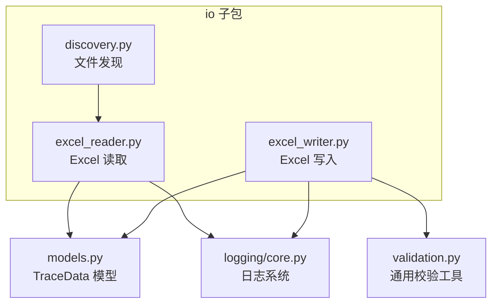
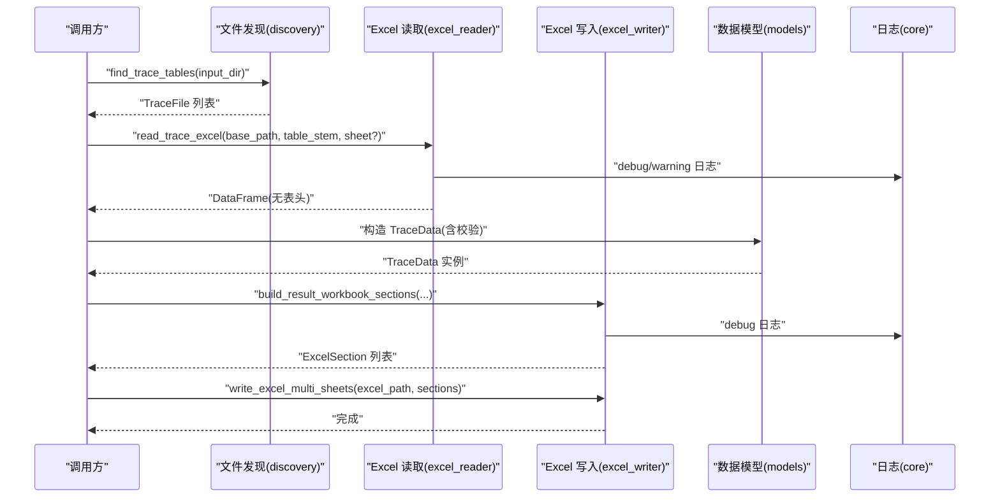
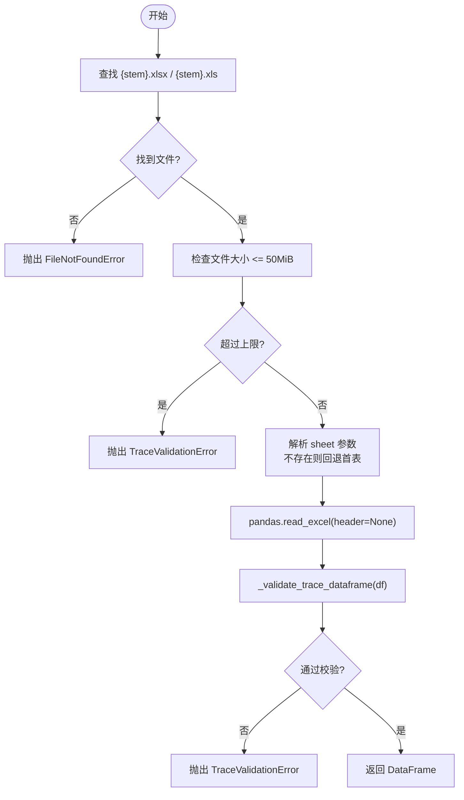
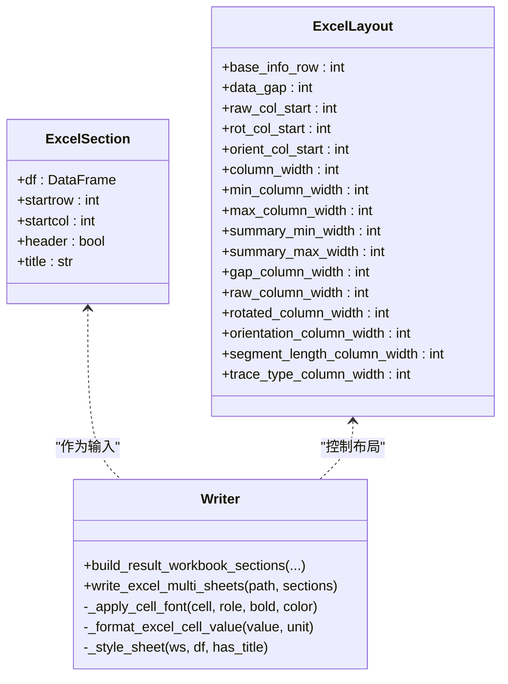
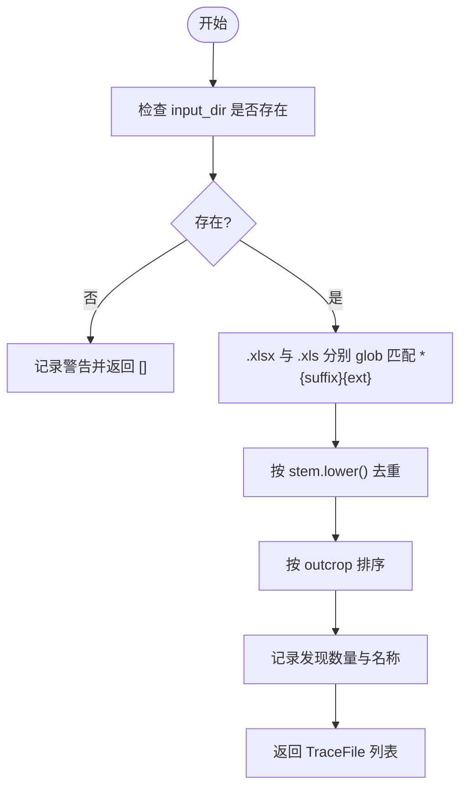
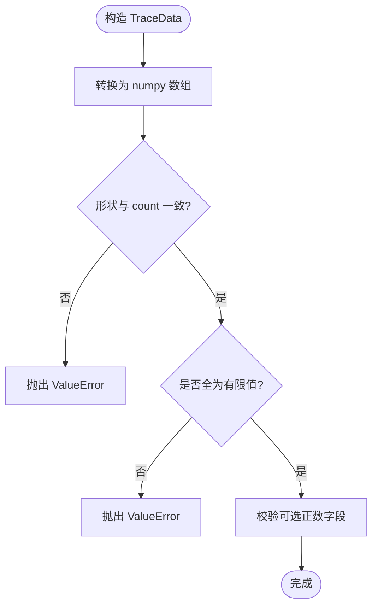
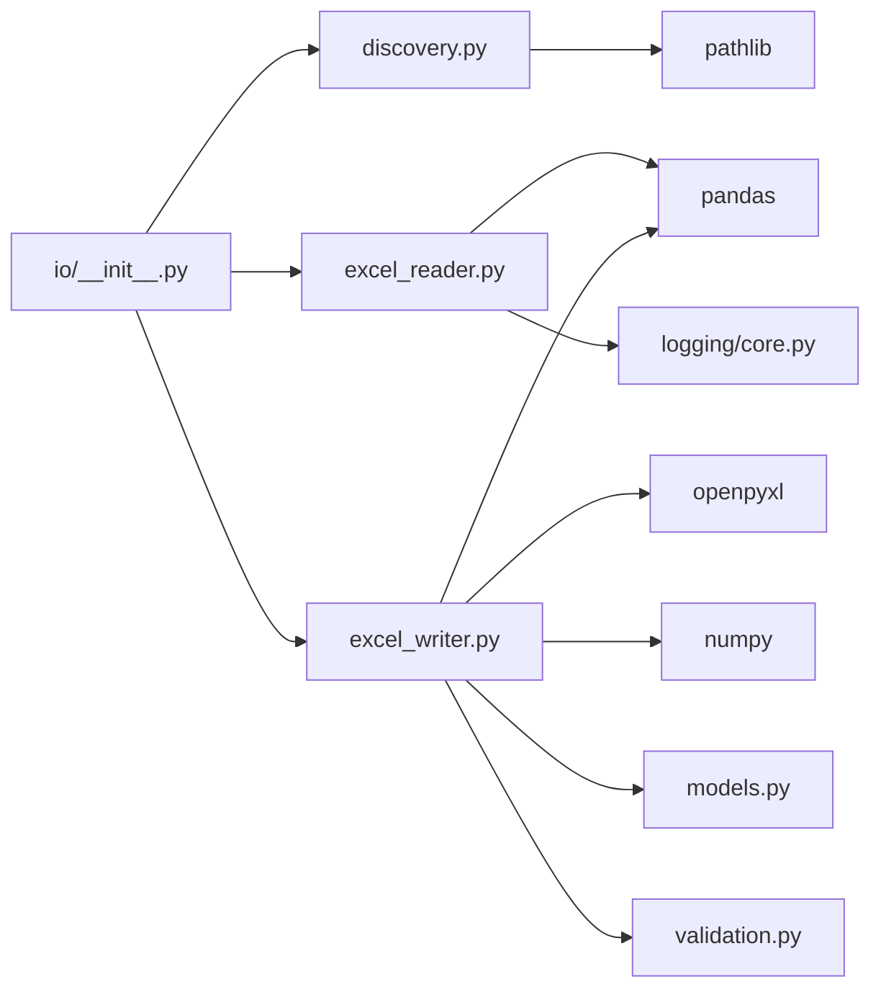
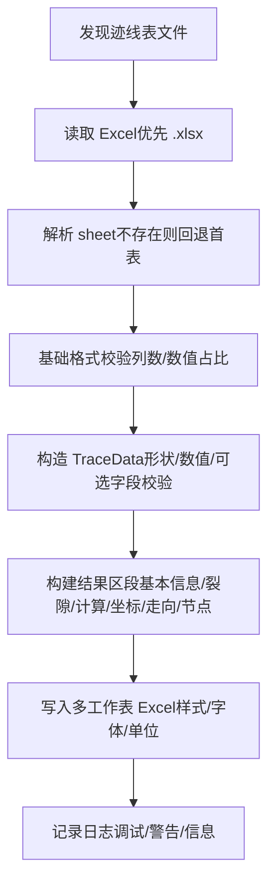

# 文件处理模块

<cite>
**本文引用的文件**
- [trace_pipeline/io/excel_reader.py](file://trace_pipeline/io/excel_reader.py)
- [trace_pipeline/io/excel_writer.py](file://trace_pipeline/io/excel_writer.py)
- [trace_pipeline/io/discovery.py](file://trace_pipeline/io/discovery.py)
- [trace_pipeline/validation.py](file://trace_pipeline/validation.py)
- [trace_pipeline/models.py](file://trace_pipeline/models.py)
- [trace_pipeline/logging/core.py](file://trace_pipeline/logging/core.py)
- [tests/test_excel_reader.py](file://tests/test_excel_reader.py)
- [tests/test_excel_writer.py](file://tests/test_excel_writer.py)
</cite>

## 目录
1. [简介](#简介)
2. [项目结构](#项目结构)
3. [核心组件](#核心组件)
4. [架构总览](#架构总览)
5. [详细组件分析](#详细组件分析)
6. [依赖关系分析](#依赖关系分析)
7. [性能考虑](#性能考虑)
8. [故障排查指南](#故障排查指南)
9. [结论](#结论)
10. [附录：文件格式规范与流程图](#附录文件格式规范与流程图)

## 简介
本技术文档聚焦于“文件处理模块”，涵盖 Excel 读取器、Excel 写入器、文件发现机制、数据验证流程、错误处理策略，以及完整的文件格式规范与数据处理流程图。目标是帮助开发者快速理解并正确使用该模块，同时为后续扩展与维护提供清晰的参考。

## 项目结构
文件处理模块位于 trace_pipeline/io 子包中，包含三个关键能力：
- 输入文件发现：扫描目录并按规则匹配迹线表文件
- Excel 读取：支持 .xlsx/.xls，自动回退工作表，基础格式校验
- Excel 写入：多工作表输出，统一样式与字体，中文/英文混排

图表来源
- [trace_pipeline/io/discovery.py:1-63](file://trace_pipeline/io/discovery.py#L1-L63)
- [trace_pipeline/io/excel_reader.py:1-169](file://trace_pipeline/io/excel_reader.py#L1-L169)
- [trace_pipeline/io/excel_writer.py:1-489](file://trace_pipeline/io/excel_writer.py#L1-L489)
- [trace_pipeline/validation.py:1-112](file://trace_pipeline/validation.py#L1-L112)
- [trace_pipeline/models.py:1-200](file://trace_pipeline/models.py#L1-L200)
- [trace_pipeline/logging/core.py:1-450](file://trace_pipeline/logging/core.py#L1-L450)

章节来源
- [trace_pipeline/io/__init__.py:1-22](file://trace_pipeline/io/__init__.py#L1-L22)

## 核心组件
- 文件发现（discovery）：按后缀与扩展名过滤，去重并排序返回候选迹线表
- Excel 读取（excel_reader）：优先 .xlsx，缺失则回退 .xls；目标 sheet 不存在时回退首表；大小限制与基本格式校验
- Excel 写入（excel_writer）：构建多个区段（基本信息、裂隙情况、计算数据、原始坐标、旋转坐标、走向与长度、节点统计/明细/交点），每个区段一个工作表，统一样式与字体
- 数据验证（validation + models）：配置标量字段规范化、TraceData 构造时的完整性与数值有效性检查
- 日志记录（logging/core）：JSON Lines 输出、按天归档、分片与清理

章节来源
- [trace_pipeline/io/discovery.py:1-63](file://trace_pipeline/io/discovery.py#L1-L63)
- [trace_pipeline/io/excel_reader.py:1-169](file://trace_pipeline/io/excel_reader.py#L1-L169)
- [trace_pipeline/io/excel_writer.py:1-489](file://trace_pipeline/io/excel_writer.py#L1-L489)
- [trace_pipeline/validation.py:1-112](file://trace_pipeline/validation.py#L1-L112)
- [trace_pipeline/models.py:1-200](file://trace_pipeline/models.py#L1-L200)
- [trace_pipeline/logging/core.py:1-450](file://trace_pipeline/logging/core.py#L1-L450)

## 架构总览
下图展示了从输入发现到读取、再到结果写出的整体流程，以及与模型和日志系统的交互。

图表来源
- [trace_pipeline/io/discovery.py:1-63](file://trace_pipeline/io/discovery.py#L1-L63)
- [trace_pipeline/io/excel_reader.py:1-169](file://trace_pipeline/io/excel_reader.py#L1-L169)
- [trace_pipeline/io/excel_writer.py:1-489](file://trace_pipeline/io/excel_writer.py#L1-L489)
- [trace_pipeline/models.py:1-200](file://trace_pipeline/models.py#L1-L200)
- [trace_pipeline/logging/core.py:1-450](file://trace_pipeline/logging/core.py#L1-L450)

## 详细组件分析

### Excel 读取器（excel_reader）
- 引擎选择与优先级：.xlsx 使用 openpyxl，.xls 使用 xlrd；优先尝试 .xlsx，缺失再尝试 .xls
- 工作表解析与回退：若指定 sheet 不存在，直接读取首个 sheet，避免失败读取后再回退
- 文件大小限制：超过上限（50 MiB）直接拒绝，不调用 pandas 读取
- 基础格式校验：至少 4 列（x1,y1,x2,y2），前若干行数值占比阈值检测，过低视为可能非数据行
- 异常分类：TraceValidationError 表示数据格式错误，直接上抛；其他读取异常收集后汇总抛出 ValueError

图表来源
- [trace_pipeline/io/excel_reader.py:36-106](file://trace_pipeline/io/excel_reader.py#L36-L106)
- [trace_pipeline/io/excel_reader.py:109-126](file://trace_pipeline/io/excel_reader.py#L109-L126)
- [trace_pipeline/io/excel_reader.py:128-169](file://trace_pipeline/io/excel_reader.py#L128-L169)

章节来源
- [trace_pipeline/io/excel_reader.py:1-169](file://trace_pipeline/io/excel_reader.py#L1-L169)
- [tests/test_excel_reader.py:1-46](file://tests/test_excel_reader.py#L1-L46)

### Excel 写入器（excel_writer）
- 多工作表生成：每个 ExcelSection 对应一个工作表，标题行可选，表头行可选，数据行紧随其后
- 布局与样式：统一边框、对齐、冻结窗格；中文标题黑体、正文宋体，英文/数字 Times New Roman；混合文本分段渲染
- 数据格式化：整数显示为整型，浮点数保留四位小数并去除末尾零；角度带单位“°”；缺失值显示“N/A”
- 区段构建：基本信息、裂隙情况、计算数据、原始端点坐标、旋转后端点坐标、走向与长度、节点统计/明细/交点
- 写入流程：openpyxl 引擎，先写入 DataFrame，再应用样式与合并标题

图表来源
- [trace_pipeline/io/excel_writer.py:37-70](file://trace_pipeline/io/excel_writer.py#L37-L70)
- [trace_pipeline/io/excel_writer.py:124-169](file://trace_pipeline/io/excel_writer.py#L124-L169)
- [trace_pipeline/io/excel_writer.py:400-489](file://trace_pipeline/io/excel_writer.py#L400-L489)

章节来源
- [trace_pipeline/io/excel_writer.py:1-489](file://trace_pipeline/io/excel_writer.py#L1-L489)
- [tests/test_excel_writer.py:1-50](file://tests/test_excel_writer.py#L1-L50)

### 文件发现机制（discovery）
- 路径遍历算法：对输入目录进行 glob 匹配，按扩展名顺序遍历（.xlsx 优先），文件名以指定后缀结尾（默认 _process）
- 文件过滤规则：仅匹配指定扩展名集合；同名文件（不同扩展名）按首次发现去重（大小写不敏感）
- 返回结果：按 outcrop 排序的 TraceFile 列表；目录不存在或无匹配时返回空列表并记录警告日志

图表来源
- [trace_pipeline/io/discovery.py:24-63](file://trace_pipeline/io/discovery.py#L24-L63)

章节来源
- [trace_pipeline/io/discovery.py:1-63](file://trace_pipeline/io/discovery.py#L1-L63)

### 数据验证流程（validation + models）
- 配置标量字段规范化：布尔、正整数、正浮点、窗口策略、玫瑰图分箱宽度、节点标签模式等
- TraceData 构造校验：
  - 形状一致性：endpoints、joint_strikes、segment_lengths、scanline_positions 与 count 一致
  - 数值有效性：所有数组必须为有限浮点数（不含 NaN/inf）
  - 可选正数校验：measured_scanline_length、measured_outcrop_area 为正有限浮点数或 None
  - 派生属性缓存：lengths 与 mean_length 在首次访问后缓存，不可变对象标记

图表来源
- [trace_pipeline/models.py:41-130](file://trace_pipeline/models.py#L41-L130)
- [trace_pipeline/validation.py:26-112](file://trace_pipeline/validation.py#L26-L112)

章节来源
- [trace_pipeline/models.py:1-200](file://trace_pipeline/models.py#L1-L200)
- [trace_pipeline/validation.py:1-112](file://trace_pipeline/validation.py#L1-L112)

### 错误处理策略
- 异常类型分层：
  - TraceValidationError：数据格式错误（列数不足、数值占比过低、文件过大）
  - FileNotFoundError：未找到 .xlsx/.xls 文件
  - ValueError：工作表读取失败、尺寸不一致、NaN/inf 等
- 日志记录：
  - debug：读取文件、sheet 回退、样式应用等细节
  - warning：读取失败、数值占比过低、归档失败等
  - info：发现迹线表数量与名称
- 用户友好提示：
  - 明确说明缺失文件、过大文件、工作表不存在等情况
  - 将底层异常包装为更高层的错误信息，便于前端展示

章节来源
- [trace_pipeline/io/excel_reader.py:28-106](file://trace_pipeline/io/excel_reader.py#L28-L106)
- [trace_pipeline/logging/core.py:44-123](file://trace_pipeline/logging/core.py#L44-L123)
- [trace_pipeline/logging/core.py:148-305](file://trace_pipeline/logging/core.py#L148-L305)

## 依赖关系分析
- io 子包对外暴露接口：find_trace_tables、read_trace_excel、build_result_workbook_sections、write_excel_multi_sheets
- excel_reader 依赖 pandas 与 logging，内部实现 sheet 解析与校验
- excel_writer 依赖 openpyxl、pandas、numpy，结合 models 与 validation 完成数据格式化与样式设置
- discovery 独立于业务逻辑，仅负责路径遍历与过滤
- models 定义 TraceData 并内置强校验，确保下游处理的数据质量
- logging/core 提供 JSON Lines 输出、按天归档、分片与清理，保证可观测性

图表来源
- [trace_pipeline/io/__init__.py:1-22](file://trace_pipeline/io/__init__.py#L1-L22)
- [trace_pipeline/io/excel_reader.py:1-169](file://trace_pipeline/io/excel_reader.py#L1-L169)
- [trace_pipeline/io/excel_writer.py:1-489](file://trace_pipeline/io/excel_writer.py#L1-L489)
- [trace_pipeline/io/discovery.py:1-63](file://trace_pipeline/io/discovery.py#L1-L63)
- [trace_pipeline/models.py:1-200](file://trace_pipeline/models.py#L1-L200)
- [trace_pipeline/validation.py:1-112](file://trace_pipeline/validation.py#L1-L112)
- [trace_pipeline/logging/core.py:1-450](file://trace_pipeline/logging/core.py#L1-L450)

章节来源
- [trace_pipeline/io/__init__.py:1-22](file://trace_pipeline/io/__init__.py#L1-L22)

## 性能考虑
- 大文件保护：读取前检查文件大小，超过 50 MiB 直接拒绝，避免内存溢出
- 单表只读一次：已存在的文件仅尝试一次读取，减少重复 I/O
- 列宽一次性统计：写入阶段边遍历单元格边统计最大文本长度，避免二次遍历整列
- 冻结窗格与批量样式：减少 UI 渲染开销，提升打开体验
- 日志分片与归档：防止单日志文件过大，降低磁盘压力

[本节为通用指导，无需特定文件引用]

## 故障排查指南
- 找不到文件：确认 base_path 与 table_stem 是否正确，检查 .xlsx/.xls 是否存在
- 工作表不存在：确认 sheet 名称，或允许回退至首表
- 文件过大：压缩或拆分数据，确保不超过 50 MiB
- 列数不足或数值占比过低：检查表头与数据行位置，确保前 4 列为数值
- 写入样式异常：检查字体安装（SimSun/SimHei/Times New Roman），确认混合文本分段渲染
- 日志问题：查看 logs 目录下当日 jsonl 文件，关注 warning 与 error 条目

章节来源
- [trace_pipeline/io/excel_reader.py:66-106](file://trace_pipeline/io/excel_reader.py#L66-L106)
- [trace_pipeline/io/excel_writer.py:400-489](file://trace_pipeline/io/excel_writer.py#L400-L489)
- [trace_pipeline/logging/core.py:148-305](file://trace_pipeline/logging/core.py#L148-L305)

## 结论
文件处理模块通过清晰的分层设计与严格的校验策略，实现了稳健的 Excel 输入输出能力。读取器具备引擎回退与工作表回退机制，写入器提供多工作表与统一样式，发现机制简化了批量处理流程，验证与日志体系保障了数据质量与可观测性。建议在生产环境中启用完整日志与告警，并对大文件进行预处理以避免性能瓶颈。

[本节为总结，无需特定文件引用]

## 附录：文件格式规范与流程图

### Excel 输入格式规范
- 文件扩展名：.xlsx 或 .xls
- 工作表：支持指定名称；不存在时回退首表
- 表头：无表头（header=None）
- 列序：至少 4 列，依次为 x1, y1, x2, y2
- 数值要求：前若干行数值占比需达到阈值，否则视为非数据行
- 文件大小：不超过 50 MiB

章节来源
- [trace_pipeline/io/excel_reader.py:16-24](file://trace_pipeline/io/excel_reader.py#L16-L24)
- [trace_pipeline/io/excel_reader.py:128-169](file://trace_pipeline/io/excel_reader.py#L128-L169)

### Excel 输出格式规范
- 多工作表：每个区段一个 sheet，命名来自 section.title
- 标题行：可选，合并居中，蓝色背景，白字黑体
- 表头行：灰色填充，居中对齐，粗体
- 数据行：边框、居中、数字格式（整数/四位小数）、中文宋体、英文 Times New Roman
- 冻结窗格：冻结标题行与表头行
- 单位标注：角度带“°”，长度带“m”，面积带“m²”

章节来源
- [trace_pipeline/io/excel_writer.py:400-489](file://trace_pipeline/io/excel_writer.py#L400-L489)

### 数据处理流程图（端到端）

图表来源
- [trace_pipeline/io/discovery.py:24-63](file://trace_pipeline/io/discovery.py#L24-L63)
- [trace_pipeline/io/excel_reader.py:36-106](file://trace_pipeline/io/excel_reader.py#L36-L106)
- [trace_pipeline/models.py:41-130](file://trace_pipeline/models.py#L41-L130)
- [trace_pipeline/io/excel_writer.py:280-489](file://trace_pipeline/io/excel_writer.py#L280-L489)
- [trace_pipeline/logging/core.py:326-398](file://trace_pipeline/logging/core.py#L326-L398)