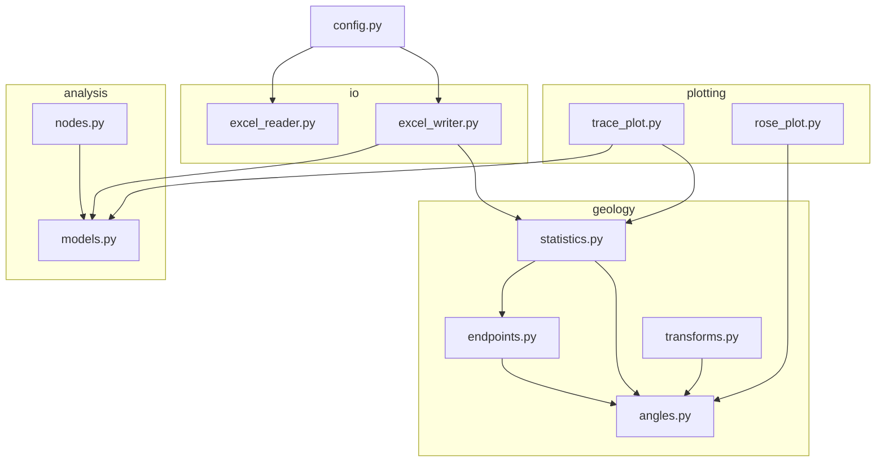
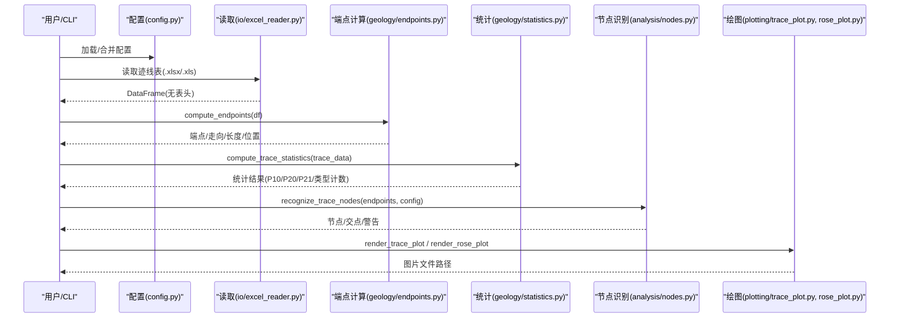
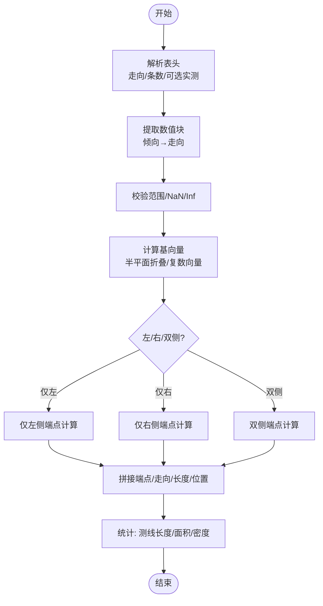
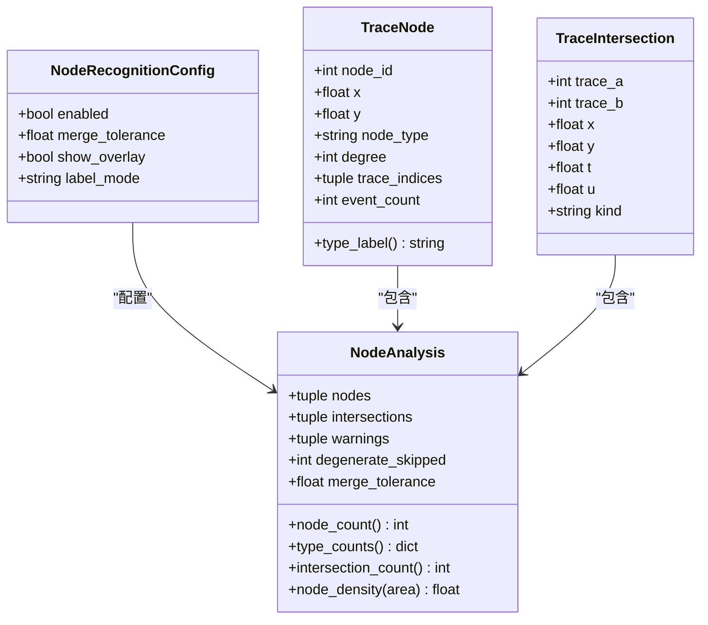
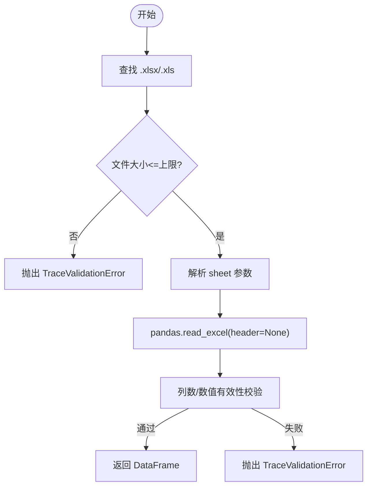
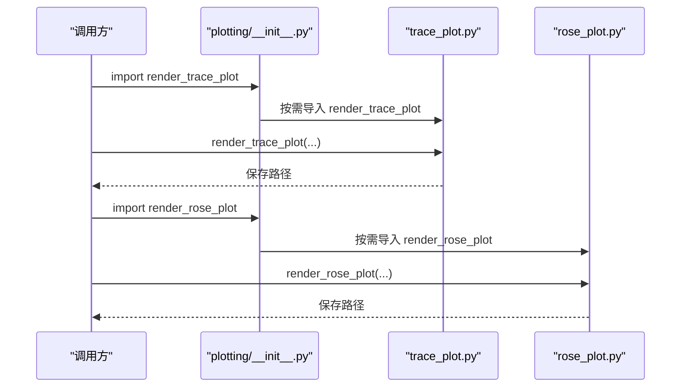
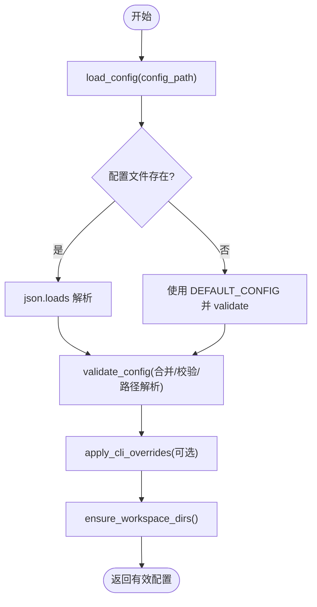
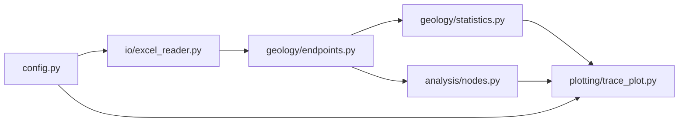

# 核心模块

<cite>
**本文引用的文件**   
- [trace_pipeline/geology/__init__.py](file://trace_pipeline/geology/__init__.py)
- [trace_pipeline/geology/angles.py](file://trace_pipeline/geology/angles.py)
- [trace_pipeline/geology/endpoints.py](file://trace_pipeline/geology/endpoints.py)
- [trace_pipeline/geology/statistics.py](file://trace_pipeline/geology/statistics.py)
- [trace_pipeline/geology/transforms.py](file://trace_pipeline/geology/transforms.py)
- [trace_pipeline/analysis/__init__.py](file://trace_pipeline/analysis/__init__.py)
- [trace_pipeline/analysis/models.py](file://trace_pipeline/analysis/models.py)
- [trace_pipeline/analysis/nodes.py](file://trace_pipeline/analysis/nodes.py)
- [trace_pipeline/io/__init__.py](file://trace_pipeline/io/__init__.py)
- [trace_pipeline/io/excel_reader.py](file://trace_pipeline/io/excel_reader.py)
- [trace_pipeline/io/excel_writer.py](file://trace_pipeline/io/excel_writer.py)
- [trace_pipeline/plotting/__init__.py](file://trace_pipeline/plotting/__init__.py)
- [trace_pipeline/plotting/trace_plot.py](file://trace_pipeline/plotting/trace_plot.py)
- [trace_pipeline/plotting/rose_plot.py](file://trace_pipeline/plotting/rose_plot.py)
- [trace_pipeline/config.py](file://trace_pipeline/config.py)
</cite>

## 目录
1. [引言](#引言)
2. [项目结构](#项目结构)
3. [核心组件](#核心组件)
4. [架构总览](#架构总览)
5. [详细组件分析](#详细组件分析)
6. [依赖关系分析](#依赖关系分析)
7. [性能考量](#性能考量)
8. [故障排查指南](#故障排查指南)
9. [结论](#结论)
10. [附录](#附录)

## 引言
本技术文档聚焦 TracePipeline 的核心模块，围绕 geology（地质几何与统计）、analysis（节点识别）、io（Excel 读写与发现）、plotting（可视化引擎）以及配置系统展开。文档深入解析：
- geology 子包的纯函数设计与数学原理（角度转换、坐标变换、端点计算、统计分析算法）。
- analysis 模块的节点识别算法与 I/Y/X 型拓扑节点的几何判断逻辑。
- io 模块的文件处理机制、Excel 读取器的数据验证与错误处理、写入器的多工作表布局与样式。
- plotting 模块的 matplotlib 集成、图表定制与渲染流程。
- 配置系统的参数校验、默认值管理与环境适配。
并提供模块间依赖关系图与接口规范说明，帮助读者快速理解并扩展系统。

## 项目结构
TracePipeline 采用按功能域划分的包组织方式：
- trace_pipeline/geology：地质几何与统计计算的纯函数集合。
- trace_pipeline/analysis：裂隙网络节点识别与拓扑分析。
- trace_pipeline/io：Excel 读取/写入与迹线表发现。
- trace_pipeline/plotting：迹线图与玫瑰花瓣图的可视化渲染。
- trace_pipeline/config：配置加载、合并、路径解析与工作区保障。

**图示来源**
- [trace_pipeline/geology/angles.py:1-168](file://trace_pipeline/geology/angles.py#L1-L168)
- [trace_pipeline/geology/endpoints.py:1-418](file://trace_pipeline/geology/endpoints.py#L1-L418)
- [trace_pipeline/geology/statistics.py:1-391](file://trace_pipeline/geology/statistics.py#L1-L391)
- [trace_pipeline/geology/transforms.py:1-169](file://trace_pipeline/geology/transforms.py#L1-L169)
- [trace_pipeline/analysis/models.py:1-98](file://trace_pipeline/analysis/models.py#L1-L98)
- [trace_pipeline/analysis/nodes.py:1-417](file://trace_pipeline/analysis/nodes.py#L1-L417)
- [trace_pipeline/io/excel_reader.py:1-169](file://trace_pipeline/io/excel_reader.py#L1-L169)
- [trace_pipeline/io/excel_writer.py:1-489](file://trace_pipeline/io/excel_writer.py#L1-L489)
- [trace_pipeline/plotting/trace_plot.py:1-565](file://trace_pipeline/plotting/trace_plot.py#L1-L565)
- [trace_pipeline/plotting/rose_plot.py:1-140](file://trace_pipeline/plotting/rose_plot.py#L1-L140)
- [trace_pipeline/config.py:1-326](file://trace_pipeline/config.py#L1-L326)

**章节来源**
- [trace_pipeline/geology/__init__.py:1-36](file://trace_pipeline/geology/__init__.py#L1-L36)
- [trace_pipeline/analysis/__init__.py:1-15](file://trace_pipeline/analysis/__init__.py#L1-L15)
- [trace_pipeline/io/__init__.py:1-22](file://trace_pipeline/io/__init__.py#L1-L22)
- [trace_pipeline/plotting/__init__.py:1-36](file://trace_pipeline/plotting/__init__.py#L1-L36)

## 核心组件
本节概述各子包对外暴露的接口与职责边界，便于上层服务或 CLI 调用。

- geology
  - 角度工具：方位角到笛卡尔角、倾向到走向、走向折叠、半平面折叠、半圆折叠。
  - 端点计算：从 Excel 表头与数值块向量化计算端点坐标、节理走向、测段长度、扫描线位置等。
  - 坐标变换：平移至正象限、按走向旋转并平移、规范化流水线。
  - 统计指标：I/II/III 型分类、P10/P20/P21、面积选择回退链、圆窗诊断与一致性校验。
- analysis
  - 节点识别：基于线段相交检测、端点接近聚类与并查集合并，输出 I/Y/X 节点及交点事件。
  - 模型定义：节点、交点、分析与配置的数据类。
- io
  - 读取器：自动选择 .xlsx/.xls、回退首表、大小限制、基础格式校验。
  - 写入器：多工作表布局、标题/表头/数据行样式、中文字体混合、列宽自适应。
- plotting
  - 迹线图：自适应画布尺寸、比例尺、指北针、图例、统计框、节点覆盖层。
  - 玫瑰图：半圆折叠分箱、极坐标柱状图绘制。
- config
  - 配置加载：JSON 合并默认值、必填项校验、类型归一化、相对路径解析、CLI 覆盖。
  - 工作区保障：input/output/logs 目录创建与权限容错。

**章节来源**
- [trace_pipeline/geology/__init__.py:1-36](file://trace_pipeline/geology/__init__.py#L1-L36)
- [trace_pipeline/analysis/__init__.py:1-15](file://trace_pipeline/analysis/__init__.py#L1-L15)
- [trace_pipeline/io/__init__.py:1-22](file://trace_pipeline/io/__init__.py#L1-L22)
- [trace_pipeline/plotting/__init__.py:1-36](file://trace_pipeline/plotting/__init__.py#L1-L36)
- [trace_pipeline/config.py:1-326](file://trace_pipeline/config.py#L1-L326)

## 架构总览
下图展示核心模块间的调用关系与数据流向：Excel 输入经 io 读取后由 geology 端点计算与统计，analysis 进行节点识别，最终由 plotting 生成可视化，config 贯穿提供运行参数。

**图示来源**
- [trace_pipeline/config.py:86-145](file://trace_pipeline/config.py#L86-L145)
- [trace_pipeline/io/excel_reader.py:36-106](file://trace_pipeline/io/excel_reader.py#L36-L106)
- [trace_pipeline/geology/endpoints.py:295-411](file://trace_pipeline/geology/endpoints.py#L295-L411)
- [trace_pipeline/geology/statistics.py:212-391](file://trace_pipeline/geology/statistics.py#L212-L391)
- [trace_pipeline/analysis/nodes.py:160-416](file://trace_pipeline/analysis/nodes.py#L160-L416)
- [trace_pipeline/plotting/trace_plot.py:443-565](file://trace_pipeline/plotting/trace_plot.py#L443-L565)
- [trace_pipeline/plotting/rose_plot.py:106-140](file://trace_pipeline/plotting/rose_plot.py#L106-L140)

## 详细组件分析

### geology 子包：纯函数设计与数学原理
- 角度转换与折叠
  - 方位角→笛卡尔角：将“北偏东顺时针”转换为“东偏北逆时针”，用于后续向量运算。
  - 倾向→走向：按区间分段映射，保持与 MATLAB 参考一致。
  - 走向折叠：将 0–360° 映射到 [-90°, 90°] 弧度，确保旋转方向最接近水平轴。
  - 半平面折叠：以基准角为界，将目标角折叠到指定半平面内，保证左右侧迹线方向向量严格位于相应半平面。
  - 半圆折叠：走向对称合并，用于玫瑰图分箱。
- 端点计算
  - 表头解析：读取测线走向、迹线条数与可选实测量；严格校验范围与类型。
  - 数值块提取与校验：前 n 行×7 列，倾向转走向，负值/NaN/Inf 报错。
  - 三种情形向量化计算：仅左侧、仅右侧、双侧，使用复数向量与半平面折叠确定斜向基向量，就地更新预分配数组。
- 坐标变换
  - 平移至非负区域：计算最小偏移，批量加偏移。
  - 旋转矩阵：基于折叠后的走向角构造二维旋转矩阵。
  - 规范化流水线：先平移再旋转再平移，保证坐标稳定且非负。
- 统计分析
  - 测线长度估计：优先实测，否则基于扫描线位置间距中位数估算。
  - 局部坐标系：将端点投影到沿测线与垂直测线的基上。
  - 面积选择回退链：实测 → 凸包 → 缓冲凸包 → 圆窗等效面积，含自适应差异阈值与一致性校验。
  - 迹长总长度回退链：观测（segment/endpoint）→ 窗口估计（l_est × count）。
  - P10/P20/P21 计算与来源标注，输出诊断信息。

**图示来源**
- [trace_pipeline/geology/endpoints.py:113-179](file://trace_pipeline/geology/endpoints.py#L113-L179)
- [trace_pipeline/geology/endpoints.py:295-411](file://trace_pipeline/geology/endpoints.py#L295-L411)
- [trace_pipeline/geology/statistics.py:51-104](file://trace_pipeline/geology/statistics.py#L51-L104)
- [trace_pipeline/geology/statistics.py:212-391](file://trace_pipeline/geology/statistics.py#L212-L391)

**章节来源**
- [trace_pipeline/geology/angles.py:28-168](file://trace_pipeline/geology/angles.py#L28-L168)
- [trace_pipeline/geology/endpoints.py:98-206](file://trace_pipeline/geology/endpoints.py#L98-L206)
- [trace_pipeline/geology/endpoints.py:295-411](file://trace_pipeline/geology/endpoints.py#L295-L411)
- [trace_pipeline/geology/transforms.py:29-169](file://trace_pipeline/geology/transforms.py#L29-L169)
- [trace_pipeline/geology/statistics.py:51-104](file://trace_pipeline/geology/statistics.py#L51-L104)
- [trace_pipeline/geology/statistics.py:212-391](file://trace_pipeline/geology/statistics.py#L212-L391)

### analysis 模块：节点识别算法与拓扑判断
- 算法流程
  - 预处理：计算每条迹线包围盒，过滤不可能相交的对。
  - 相交检测：对候选对调用 segment_intersection，区分 X/Y/端-端事件，记录参数 t/u 与交点坐标。
  - 端点接近检测：收集未使用端点，网格分桶 + 并查集聚类合并。
  - 节点分类：根据簇内迹线参与方式与拓扑值判定 I/Y/X。
- 几何判断逻辑
  - X 型：两条迹线在各自内部位置相交（t,u 均处于内部区间）。
  - Y 型：一条迹线的端点落在另一条迹线内部，或拓扑值≥3。
  - I 型：孤立端点，未与其他迹线接触。
- 性能优化
  - NumPy 向量化包围盒筛选与批量距离计算。
  - 空间网格 + 并查集实现 O(n log n) 近似聚合并避免全对比较。

**图示来源**
- [trace_pipeline/analysis/models.py:22-98](file://trace_pipeline/analysis/models.py#L22-L98)
- [trace_pipeline/analysis/nodes.py:37-158](file://trace_pipeline/analysis/nodes.py#L37-L158)

**章节来源**
- [trace_pipeline/analysis/nodes.py:160-416](file://trace_pipeline/analysis/nodes.py#L160-L416)
- [trace_pipeline/analysis/models.py:22-98](file://trace_pipeline/analysis/models.py#L22-L98)

### io 模块：Excel 读写与文件发现
- 读取器
  - 候选扩展名：优先 .xlsx(openpyxl)，缺失则回退 .xls(xlrd)。
  - Sheet 回退：若指定 sheet 不存在，直接读取首个 sheet，避免失败读取。
  - 大小限制：超过上限抛出 TraceValidationError。
  - 数据校验：最少列数、前若干行数值占比检查，NaN/Inf 与非法类型直接上抛。
- 写入器
  - 多工作表：每个分区一个 sheet，支持标题合并、冻结窗格、边框与对齐。
  - 字体策略：中文黑体/宋体，英文 Times New Roman，混合文本拆分为富文本块。
  - 列宽自适应：遍历数据行统计最大文本长度，设置列宽。
  - 数值格式化：整数/浮点数分别设置格式，单位符号附加。

**图示来源**
- [trace_pipeline/io/excel_reader.py:36-106](file://trace_pipeline/io/excel_reader.py#L36-L106)
- [trace_pipeline/io/excel_reader.py:128-169](file://trace_pipeline/io/excel_reader.py#L128-L169)
- [trace_pipeline/io/excel_writer.py:462-489](file://trace_pipeline/io/excel_writer.py#L462-L489)

**章节来源**
- [trace_pipeline/io/excel_reader.py:36-106](file://trace_pipeline/io/excel_reader.py#L36-L106)
- [trace_pipeline/io/excel_reader.py:128-169](file://trace_pipeline/io/excel_reader.py#L128-L169)
- [trace_pipeline/io/excel_writer.py:73-170](file://trace_pipeline/io/excel_writer.py#L73-L170)
- [trace_pipeline/io/excel_writer.py:462-489](file://trace_pipeline/io/excel_writer.py#L462-L489)

### plotting 模块：可视化引擎与 matplotlib 集成
- 迹线图
  - 自适应画布：依据数据跨度与目标比例尺计算 figure 尺寸，确保不同图之间 1m 物理长度一致。
  - 装饰元素：外框、指北针、比例尺、图例、统计框，支持背景透明。
  - 覆盖层：凸包多边形、圆窗、节点符号（按类型分组批量 scatter）。
  - 布局管理：相对比例参数控制边距、刻度、图例与统计框位置。
- 玫瑰图
  - 半圆折叠分箱：走向角折叠到 [0°, 180°)，构建中心角与柱宽。
  - 极坐标绘制：柱体颜色、网格、边框、刻度与字体统一风格。
- 懒加载导出
  - __getattr__ 按需导入具体模块，避免启动时提前加载 pyplot，提升性能。

**图示来源**
- [trace_pipeline/plotting/__init__.py:18-25](file://trace_pipeline/plotting/__init__.py#L18-L25)
- [trace_pipeline/plotting/trace_plot.py:443-565](file://trace_pipeline/plotting/trace_plot.py#L443-L565)
- [trace_pipeline/plotting/rose_plot.py:106-140](file://trace_pipeline/plotting/rose_plot.py#L106-L140)

**章节来源**
- [trace_pipeline/plotting/trace_plot.py:151-170](file://trace_pipeline/plotting/trace_plot.py#L151-L170)
- [trace_pipeline/plotting/trace_plot.py:443-565](file://trace_pipeline/plotting/trace_plot.py#L443-L565)
- [trace_pipeline/plotting/rose_plot.py:76-104](file://trace_pipeline/plotting/rose_plot.py#L76-L104)
- [trace_pipeline/plotting/rose_plot.py:106-140](file://trace_pipeline/plotting/rose_plot.py#L106-L140)
- [trace_pipeline/plotting/__init__.py:18-25](file://trace_pipeline/plotting/__init__.py#L18-L25)

### 配置系统：参数验证、默认值与环境适配
- 默认配置与类型定义：TypedDict 约束键空间，DEFAULT_CONFIG 提供缺省值。
- 加载与合并：load_config 读取 JSON，validate_config 合并默认值、校验必填项、类型归一化、保留 style 子对象。
- 路径解析：resolve_config_base_dir 与 _to_absolute 将相对路径转为绝对路径，支持显式配置文件路径。
- CLI 覆盖：apply_cli_overrides 将命令行参数覆盖到配置并重新校验。
- 工作区保障：ensure_workspace_dirs 自动创建 input/output/logs，权限异常仅记录警告。

**图示来源**
- [trace_pipeline/config.py:86-145](file://trace_pipeline/config.py#L86-L145)
- [trace_pipeline/config.py:148-190](file://trace_pipeline/config.py#L148-L190)
- [trace_pipeline/config.py:251-258](file://trace_pipeline/config.py#L251-L258)
- [trace_pipeline/config.py:264-312](file://trace_pipeline/config.py#L264-L312)

**章节来源**
- [trace_pipeline/config.py:29-79](file://trace_pipeline/config.py#L29-L79)
- [trace_pipeline/config.py:86-145](file://trace_pipeline/config.py#L86-L145)
- [trace_pipeline/config.py:148-190](file://trace_pipeline/config.py#L148-L190)
- [trace_pipeline/config.py:251-258](file://trace_pipeline/config.py#L251-L258)
- [trace_pipeline/config.py:264-312](file://trace_pipeline/config.py#L264-L312)

## 依赖关系分析
- 低耦合高内聚：geology 提供纯函数，analysis 与 plotting 仅依赖其接口，不修改入参。
- 数据流清晰：io 读取 → geology 计算 → analysis 识别 → plotting 渲染，config 贯穿。
- 外部依赖：numpy/pandas/matplotlib/openpyxl，按需懒加载减少启动开销。

**图示来源**
- [trace_pipeline/io/excel_reader.py:36-106](file://trace_pipeline/io/excel_reader.py#L36-L106)
- [trace_pipeline/geology/endpoints.py:295-411](file://trace_pipeline/geology/endpoints.py#L295-L411)
- [trace_pipeline/geology/statistics.py:212-391](file://trace_pipeline/geology/statistics.py#L212-L391)
- [trace_pipeline/analysis/nodes.py:160-416](file://trace_pipeline/analysis/nodes.py#L160-L416)
- [trace_pipeline/plotting/trace_plot.py:443-565](file://trace_pipeline/plotting/trace_plot.py#L443-L565)
- [trace_pipeline/config.py:86-145](file://trace_pipeline/config.py#L86-L145)

**章节来源**
- [trace_pipeline/io/excel_reader.py:36-106](file://trace_pipeline/io/excel_reader.py#L36-L106)
- [trace_pipeline/geology/endpoints.py:295-411](file://trace_pipeline/geology/endpoints.py#L295-L411)
- [trace_pipeline/geology/statistics.py:212-391](file://trace_pipeline/geology/statistics.py#L212-L391)
- [trace_pipeline/analysis/nodes.py:160-416](file://trace_pipeline/analysis/nodes.py#L160-L416)
- [trace_pipeline/plotting/trace_plot.py:443-565](file://trace_pipeline/plotting/trace_plot.py#L443-L565)
- [trace_pipeline/config.py:86-145](file://trace_pipeline/config.py#L86-L145)

## 性能考量
- 向量化计算：端点计算与统计指标大量使用 numpy 广播与矩阵乘法，避免 Python 循环。
- 空间索引：节点识别采用网格分桶与并查集，降低 O(n^2) 复杂度。
- 懒加载：plotting 子包通过 __getattr__ 延迟导入 matplotlib，减少启动时间。
- 内存友好：就地更新预分配数组，避免中间对象过多。

[本节为通用指导，无需特定文件引用]

## 故障排查指南
- 配置相关
  - JSON 解析失败或格式错误：检查配置文件是否为合法 JSON 对象。
  - 缺少必要字段：确保 input_dir、output_dir、outcrop 等必填项存在且非空。
  - 路径解析异常：确认 base_dir 与相对路径组合正确。
- Excel 读取
  - 文件过大：超出上限需拆分文件或调整限制。
  - 工作表不存在：确认 sheet 名称或使用默认首表。
  - 数据格式错误：至少 4 列且前若干行数值占比足够，避免 NaN/Inf。
- 节点识别
  - 退化线段：长度小于容差被跳过，适当增大 merge_tolerance。
  - 坐标溢出：极大坐标可能导致网格索引溢出，建议缩放数据。
- 绘图
  - 字体缺失：确保系统中存在 SimSun/SimHei/Times New Roman。
  - 画布尺寸异常：检查数据跨度与目标比例尺是否合理。

**章节来源**
- [trace_pipeline/config.py:112-145](file://trace_pipeline/config.py#L112-L145)
- [trace_pipeline/io/excel_reader.py:69-106](file://trace_pipeline/io/excel_reader.py#L69-L106)
- [trace_pipeline/io/excel_reader.py:128-169](file://trace_pipeline/io/excel_reader.py#L128-L169)
- [trace_pipeline/analysis/nodes.py:208-222](file://trace_pipeline/analysis/nodes.py#L208-L222)
- [trace_pipeline/plotting/trace_plot.py:443-565](file://trace_pipeline/plotting/trace_plot.py#L443-L565)

## 结论
TracePipeline 的核心模块以纯函数与数据类为核心，形成清晰的计算与渲染管线。geology 提供稳健的数学与几何基础，analysis 实现高效的节点识别，io 与 plotting 负责数据与可视化的工程化落地，config 贯穿配置与环境适配。整体设计强调可测试性、可扩展性与性能优化，适合大规模迹线数据处理与报告生成。

[本节为总结，无需特定文件引用]

## 附录
- 接口规范摘要
  - geology/angles：azimuth_to_cartesian_deg、dip_to_strike、fold_strike_angle、fold_to_halfplane、fold_strikes_to_semicircle。
  - geology/endpoints：compute_endpoints → EndpointResult。
  - geology/statistics：compute_trace_statistics → TraceStatistics。
  - geology/transforms：normalize_coordinates、rotate_and_shift、shift_to_positive。
  - analysis/models：NodeRecognitionConfig、TraceNode、TraceIntersection、NodeAnalysis。
  - analysis/nodes：recognize_trace_nodes → NodeAnalysis。
  - io/excel_reader：read_trace_excel → DataFrame。
  - io/excel_writer：build_result_workbook_sections、write_excel_multi_sheets。
  - plotting：render_trace_plot、render_rose_plot、segments_to_xy。
  - config：load_config、validate_config、apply_cli_overrides、ensure_workspace_dirs。

**章节来源**
- [trace_pipeline/geology/angles.py:16-22](file://trace_pipeline/geology/angles.py#L16-L22)
- [trace_pipeline/geology/endpoints.py:70-82](file://trace_pipeline/geology/endpoints.py#L70-L82)
- [trace_pipeline/geology/statistics.py:38-44](file://trace_pipeline/geology/statistics.py#L38-L44)
- [trace_pipeline/geology/transforms.py:18-23](file://trace_pipeline/geology/transforms.py#L18-L23)
- [trace_pipeline/analysis/models.py:8-13](file://trace_pipeline/analysis/models.py#L8-L13)
- [trace_pipeline/analysis/nodes.py:34](file://trace_pipeline/analysis/nodes.py#L34)
- [trace_pipeline/io/excel_reader.py:25](file://trace_pipeline/io/excel_reader.py#L25)
- [trace_pipeline/io/excel_writer.py:26-32](file://trace_pipeline/io/excel_writer.py#L26-L32)
- [trace_pipeline/plotting/__init__.py:28-35](file://trace_pipeline/plotting/__init__.py#L28-L35)
- [trace_pipeline/config.py:314-325](file://trace_pipeline/config.py#L314-L325)