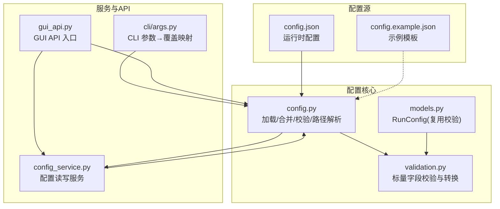
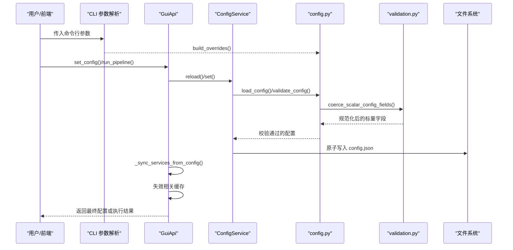
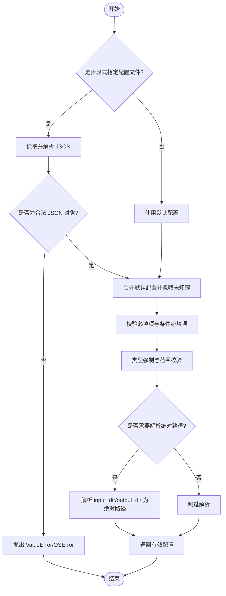
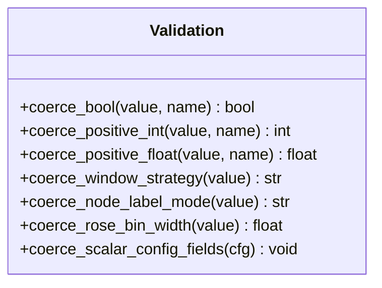
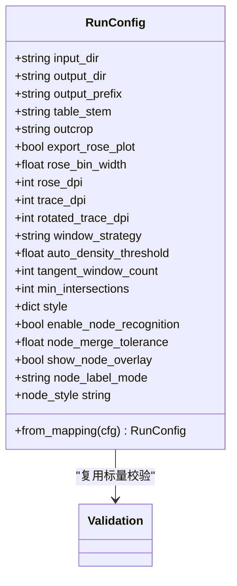
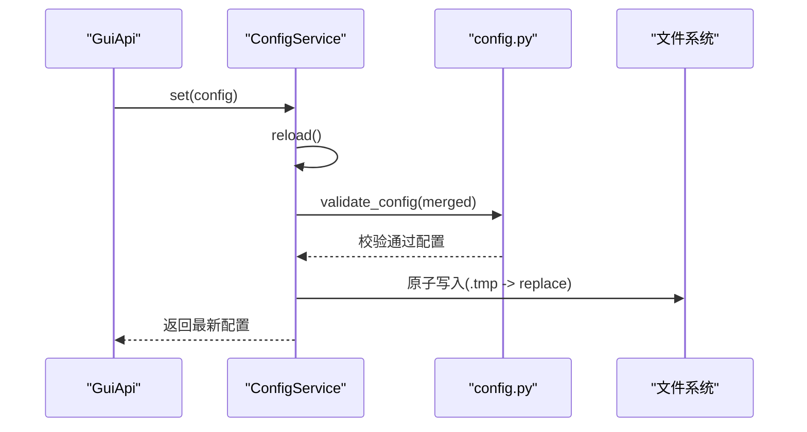
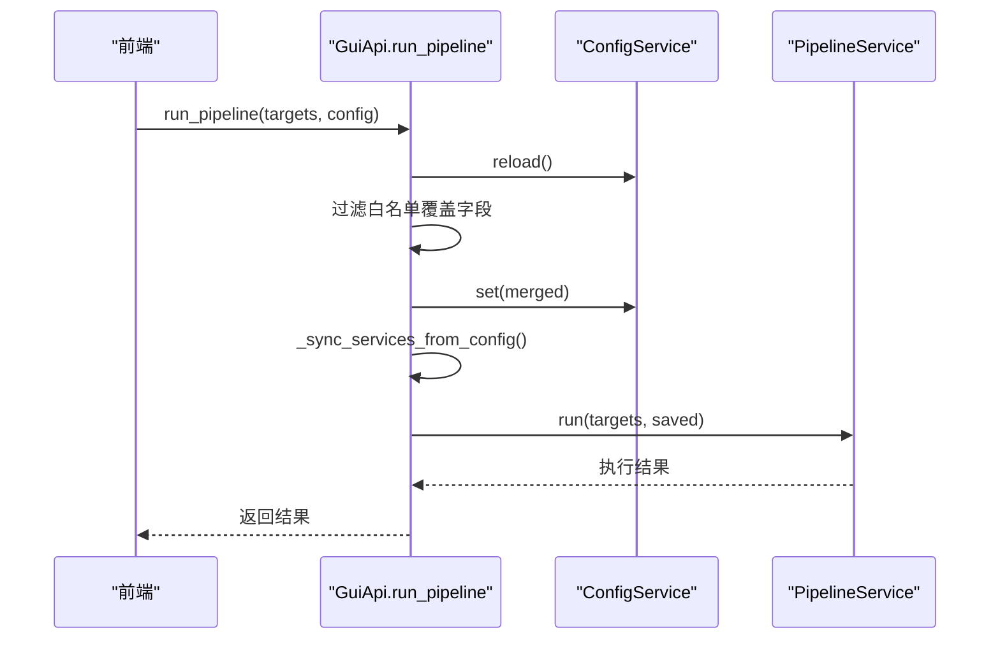
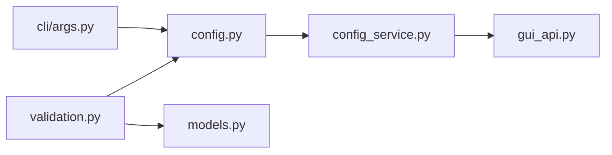

# 配置系统

<cite>
**本文引用的文件**   
- [config.py](file://trace_pipeline/config.py)
- [validation.py](file://trace_pipeline/validation.py)
- [models.py](file://trace_pipeline/models.py)
- [config_service.py](file://backend/services/config_service.py)
- [gui_api.py](file://backend/gui_api.py)
- [args.py](file://trace_pipeline/cli/args.py)
- [config.example.json](file://config.example.json)
- [config.json](file://config.json)
- [test_config.py](file://tests/test_config.py)
</cite>

## 目录
1. [简介](#简介)
2. [项目结构](#项目结构)
3. [核心组件](#核心组件)
4. [架构总览](#架构总览)
5. [详细组件分析](#详细组件分析)
6. [依赖关系分析](#依赖关系分析)
7. [性能考虑](#性能考虑)
8. [故障排除指南](#故障排除指南)
9. [结论](#结论)
10. [附录](#附录)

## 简介
本技术文档聚焦于 TracePipeline 的配置系统，系统性解析参数验证框架（类型检查、范围校验、依赖关系校验）、默认值管理、配置文件加载顺序与优先级、配置对象构建过程、运行时动态更新机制与热重载支持、以及配置文件的语法规范与示例模板。文档同时提供完整的配置选项参考、验证规则与故障排除建议，帮助开发者与用户正确理解并高效使用配置能力。

## 项目结构
配置系统由以下关键模块组成：
- 配置加载与路径解析：负责读取 JSON 配置、合并默认值、规范化类型、解析相对路径为绝对路径。
- 通用校验与类型强制转换：提供布尔、正整数、正浮点数、枚举值等标量字段的统一校验与转换。
- 运行期配置服务：封装配置文件的读写、线程安全访问、原子写入与重置策略。
- GUI API 集成：在应用层暴露配置获取、设置、重置接口，并在流水线执行前进行覆盖与同步。
- CLI 覆盖映射：将命令行参数转换为配置覆盖项，按优先级生效。
- 数据模型 RunConfig：面向流水线运行的不可变配置对象，复用同一套标量校验逻辑。

图示来源
- [config.py:86-190](file://trace_pipeline/config.py#L86-L190)
- [validation.py:90-112](file://trace_pipeline/validation.py#L90-L112)
- [models.py:236-267](file://trace_pipeline/models.py#L236-L267)
- [config_service.py:41-144](file://backend/services/config_service.py#L41-L144)
- [gui_api.py:264-333](file://backend/gui_api.py#L264-L333)
- [args.py:75-93](file://trace_pipeline/cli/args.py#L75-L93)
- [config.example.json:1-26](file://config.example.json#L1-L26)
- [config.json:1-36](file://config.json#L1-L36)

章节来源
- [config.py:86-190](file://trace_pipeline/config.py#L86-L190)
- [validation.py:90-112](file://trace_pipeline/validation.py#L90-L112)
- [models.py:236-267](file://trace_pipeline/models.py#L236-L267)
- [config_service.py:41-144](file://backend/services/config_service.py#L41-L144)
- [gui_api.py:264-333](file://backend/gui_api.py#L264-L333)
- [args.py:75-93](file://trace_pipeline/cli/args.py#L75-L93)
- [config.example.json:1-26](file://config.example.json#L1-L26)
- [config.json:1-36](file://config.json#L1-L36)

## 核心组件
- 配置加载与校验
  - 从 JSON 文件加载配置，缺失时使用默认配置；对未知键发出警告；对必填项进行校验。
  - 通过 coerce_scalar_config_fields 对数值、布尔、枚举类字段进行类型强制与范围校验。
  - 支持将 input_dir / output_dir 解析为绝对路径，确保跨工作目录稳定运行。
- 配置服务
  - 以 ConfigService 作为唯一写入入口，提供 get/set/reset/reset_processing/reset_style 等方法。
  - 内部使用 RLock 保证并发安全；保存时采用临时文件+替换的原子写入策略。
- GUI API
  - 暴露 get_config/set_config/reset_config/reset_processing_config/reset_style_config 等接口。
  - 在 run_pipeline 前刷新配置、白名单覆盖、同步下游服务并失效缓存。
- CLI 覆盖
  - 将 --input/--output/--rose-bin/--rose-dpi/--window-strategy 等参数映射为配置覆盖项。
- 运行期配置对象
  - RunConfig.from_mapping 复用同一套标量校验逻辑，构造不可变的运行期配置。

章节来源
- [config.py:86-190](file://trace_pipeline/config.py#L86-L190)
- [config.py:248-259](file://trace_pipeline/config.py#L248-L259)
- [config_service.py:41-144](file://backend/services/config_service.py#L41-L144)
- [gui_api.py:264-333](file://backend/gui_api.py#L264-L333)
- [args.py:75-93](file://trace_pipeline/cli/args.py#L75-L93)
- [models.py:236-267](file://trace_pipeline/models.py#L236-L267)

## 架构总览
下图展示了配置系统在启动、运行与持久化过程中的交互关系与数据流。

图示来源
- [gui_api.py:264-333](file://backend/gui_api.py#L264-L333)
- [config_service.py:67-144](file://backend/services/config_service.py#L67-L144)
- [config.py:86-190](file://trace_pipeline/config.py#L86-L190)
- [validation.py:90-112](file://trace_pipeline/validation.py#L90-L112)
- [args.py:75-93](file://trace_pipeline/cli/args.py#L75-L93)

## 详细组件分析

### 配置加载与路径解析（config.py）
- 加载流程
  - 若显式指定配置文件路径且不存在则报错；否则回退到默认路径。
  - 解析 JSON，要求顶层为对象；记录加载日志与键列表。
  - 根据是否显式指定路径决定基准目录，用于相对路径解析。
- 校验与合并
  - 合并 DEFAULT_CONFIG，忽略未知键并告警。
  - 校验必填项（input_dir、output_dir、outcrop），process_all=False 时额外要求 table_stem。
  - 调用 coerce_bool 与 coerce_scalar_config_fields 完成类型强制与范围校验。
  - 可选将 input_dir/output_dir 解析为绝对路径。
- 路径解析
  - resolve_config_base_dir 确定相对路径基准目录。
  - _to_absolute 将相对路径基于基准目录解析为绝对路径。
  - resolve_io_paths 可创建输入输出目录（受 create_dirs 控制）。
- CLI 覆盖
  - apply_cli_overrides 将非 None 的覆盖项合并后重新校验。

图示来源
- [config.py:86-190](file://trace_pipeline/config.py#L86-L190)
- [config.py:196-216](file://trace_pipeline/config.py#L196-L216)
- [config.py:218-246](file://trace_pipeline/config.py#L218-L246)
- [config.py:248-259](file://trace_pipeline/config.py#L248-L259)

章节来源
- [config.py:86-190](file://trace_pipeline/config.py#L86-L190)
- [config.py:196-216](file://trace_pipeline/config.py#L196-L216)
- [config.py:218-246](file://trace_pipeline/config.py#L218-L246)
- [config.py:248-259](file://trace_pipeline/config.py#L248-L259)
- [test_config.py:8-21](file://tests/test_config.py#L8-L21)

### 参数验证框架（validation.py）
- 布尔规范化
  - 接受 bool、0/1、字符串 true/false/yes/no/on/off 等常见写法。
- 正整数/正浮点
  - 严格检查 >0 且有限，拒绝 NaN/Inf。
- 枚举值
  - window_strategy 限定 auto/tangent/hybrid/concentric。
  - node_label_mode 限定 none/type/id。
- 玫瑰图分箱宽度
  - 限制在 (0, 180] 度范围内。
- 批量标量处理
  - coerce_scalar_config_fields 遍历映射表，就地规范化各标量字段。

图示来源
- [validation.py:26-87](file://trace_pipeline/validation.py#L26-L87)
- [validation.py:90-112](file://trace_pipeline/validation.py#L90-L112)

章节来源
- [validation.py:26-87](file://trace_pipeline/validation.py#L26-L87)
- [validation.py:90-112](file://trace_pipeline/validation.py#L90-L112)

### 运行期配置对象（models.py）
- RunConfig
  - 不可变数据类，__post_init__ 中执行字段级校验与类型强制。
  - from_mapping 仅提取已知字段，多余键被忽略；style 中的 node_label_mode 可作为回退。
  - 复用 validation.coerce_scalar_config_fields 实现一致的标量校验。

图示来源
- [models.py:162-267](file://trace_pipeline/models.py#L162-L267)
- [validation.py:90-112](file://trace_pipeline/validation.py#L90-L112)

章节来源
- [models.py:162-267](file://trace_pipeline/models.py#L162-L267)

### 配置服务与持久化（config_service.py）
- 初始化与自动创建
  - 若 config.json 不存在，使用默认配置创建并持久化。
- 重载与读取
  - reload 从磁盘重新加载配置；get 返回深拷贝，防止外部修改。
- 写入与重置
  - set 先 reload 再合并新配置，校验后原子写入。
  - reset 恢复默认配置；reset_processing 仅重置处理参数；reset_style 清空样式。
- 原子写入
  - 先写 .tmp 再 replace，异常时清理临时文件，避免损坏配置。

图示来源
- [config_service.py:41-144](file://backend/services/config_service.py#L41-L144)
- [config.py:148-190](file://trace_pipeline/config.py#L148-L190)

章节来源
- [config_service.py:41-144](file://backend/services/config_service.py#L41-L144)

### GUI API 集成与运行时覆盖（gui_api.py）
- 配置接口
  - get_config/set_config/reset_config/reset_processing_config/reset_style_config。
  - set_config 会同步下游服务并失效缓存。
- 流水线执行前覆盖
  - run_pipeline 刷新配置，仅允许白名单字段覆盖（PROCESSING_KEYS + style + parallel_workers）。
  - 合并后保存并同步服务，随后执行流水线。

图示来源
- [gui_api.py:388-445](file://backend/gui_api.py#L388-L445)
- [config_service.py:67-144](file://backend/services/config_service.py#L67-L144)

章节来源
- [gui_api.py:264-333](file://backend/gui_api.py#L264-L333)
- [gui_api.py:388-445](file://backend/gui_api.py#L388-L445)

### CLI 参数覆盖映射（args.py）
- 支持的覆盖项包括输入输出目录、玫瑰图分箱宽度与 DPI、窗口策略、并行线程数等。
- build_overrides 仅包含显式指定的项，避免覆盖未设置的配置。

章节来源
- [args.py:11-93](file://trace_pipeline/cli/args.py#L11-L93)

## 依赖关系分析
- 模块耦合
  - config.py 依赖 validation.py 进行标量字段校验。
  - models.py 的 RunConfig 同样依赖 validation.py，保持校验一致性。
  - config_service.py 依赖 config.py 的加载与校验能力，并提供线程安全的读写封装。
  - gui_api.py 组合 ConfigService 与 PipelineService，协调配置变更与服务同步。
- 外部依赖
  - 标准库 json/pathlib/logging/copy/threading。
  - 第三方库 numpy（在 models.py 的数据模型中使用）。

图示来源
- [config.py:86-190](file://trace_pipeline/config.py#L86-L190)
- [validation.py:90-112](file://trace_pipeline/validation.py#L90-L112)
- [models.py:236-267](file://trace_pipeline/models.py#L236-L267)
- [config_service.py:41-144](file://backend/services/config_service.py#L41-L144)
- [gui_api.py:264-333](file://backend/gui_api.py#L264-L333)
- [args.py:75-93](file://trace_pipeline/cli/args.py#L75-L93)

章节来源
- [config.py:86-190](file://trace_pipeline/config.py#L86-L190)
- [validation.py:90-112](file://trace_pipeline/validation.py#L90-L112)
- [models.py:236-267](file://trace_pipeline/models.py#L236-L267)
- [config_service.py:41-144](file://backend/services/config_service.py#L41-L144)
- [gui_api.py:264-333](file://backend/gui_api.py#L264-L333)
- [args.py:75-93](file://trace_pipeline/cli/args.py#L75-L93)

## 性能考虑
- 原子写入减少 I/O 风险：使用临时文件 + replace 提升配置持久化的可靠性。
- 线程安全：ConfigService 使用 RLock 保护并发读写；get 返回深拷贝避免共享状态污染。
- 缓存失效：配置变更后主动失效文件扫描、统计与图片缓存，确保后续操作使用最新数据。
- 懒加载：GUI API 按需创建重资源服务，降低启动开销。

[本节为通用指导，不直接分析具体文件]

## 故障排除指南
- 配置文件不存在或格式错误
  - 现象：抛出 FileNotFoundError 或 ValueError（非法 JSON）。
  - 排查：确认配置文件路径是否正确；检查 JSON 语法与顶层对象结构。
- 缺少必要配置字段
  - 现象：ValueError 提示缺少必要字段。
  - 排查：确保 input_dir、output_dir、outcrop 存在且非空；当 process_all=False 时需设置 table_stem。
- 标量字段类型或范围错误
  - 现象：ValueError 提示必须为正整数/正数或在特定范围内。
  - 排查：检查 rose_bin_width、DPI、阈值等数值是否符合约束。
- 路径解析问题
  - 现象：相对路径无法解析或目录创建失败。
  - 排查：确认基准目录与相对路径；检查权限与父目录是否存在。
- 并发写入冲突
  - 现象：配置保存异常或临时文件残留。
  - 排查：观察异常日志；确认进程间无直接竞争；必要时重启服务。

章节来源
- [config.py:86-190](file://trace_pipeline/config.py#L86-L190)
- [config.py:218-246](file://trace_pipeline/config.py#L218-L246)
- [config_service.py:128-144](file://backend/services/config_service.py#L128-L144)

## 结论
TracePipeline 的配置系统以“默认值 + JSON 覆盖 + CLI 覆盖”的多层策略为核心，配合严格的标量校验与路径解析，保证了配置的健壮性与可移植性。ConfigService 提供线程安全与原子写入，GUI API 在运行时进行白名单覆盖与服务同步，形成一致且高效的配置生命周期管理。遵循本文档的规范与排障建议，可有效避免常见问题并提升系统稳定性。

[本节为总结性内容，不直接分析具体文件]

## 附录

### 配置文件语法规范
- 文件格式：JSON 对象（顶层必须为对象）。
- 注释：示例文件中包含注释键（如 _comment），但实际加载时会视为未知键并告警忽略。
- 键名大小写：区分大小写，需与默认配置键一致。
- 值类型：遵循各字段的类型与范围约束。

章节来源
- [config.example.json:1-26](file://config.example.json#L1-L26)
- [config.py:148-190](file://trace_pipeline/config.py#L148-L190)

### 配置选项参考与验证规则
- 路径与目标
  - input_dir: 字符串，必填，支持相对路径（基于配置文件所在目录或项目根解析为绝对路径）。
  - output_dir: 字符串，必填，同上。
  - outcrop: 字符串，必填，非空。
  - output_prefix: 字符串，非空。
  - table_stem: 字符串，当 process_all=False 时必填，非空。
- 布尔开关
  - process_all: 布尔，true/false 或等价字符串/数字。
  - export_rose_plot: 布尔。
  - enable_node_recognition: 布尔。
  - show_node_overlay: 布尔。
  - is_dev_mode: 布尔。
- 数值与范围
  - rose_bin_width: 正浮点，范围 (0, 180]。
  - rose_dpi/trace_dpi/rotated_trace_dpi: 正整数。
  - tangent_window_count/min_intersections: 正整数。
  - auto_density_threshold/node_merge_tolerance: 正浮点。
- 枚举与模式
  - window_strategy: 枚举值 auto/tangent/hybrid/concentric。
  - node_label_mode: 枚举值 none/type/id。
- 样式与并行
  - style: 字典，保留子对象，支持节点样式等扩展。
  - parallel_workers: 整型，表示并行线程数（0 或 1 为串行）。

章节来源
- [config.py:56-79](file://trace_pipeline/config.py#L56-L79)
- [validation.py:26-87](file://trace_pipeline/validation.py#L26-L87)
- [config.example.json:1-26](file://config.example.json#L1-L26)
- [config.json:1-36](file://config.json#L1-L36)

### 示例配置模板
- 使用 config.example.json 作为模板复制为 config.json 后按需修改。
- 所有字段均有默认值，未显式设置的字段将回退至默认配置。

章节来源
- [config.example.json:1-26](file://config.example.json#L1-L26)

### 环境变量与优先级说明
- 当前代码未实现环境变量覆盖；配置优先级为：
  - 默认配置 < JSON 配置文件 < CLI 覆盖（针对支持项）。
- GUI 运行时覆盖仅限白名单字段（处理参数、样式、并行度），禁止覆盖路径与目标字段。

章节来源
- [args.py:75-93](file://trace_pipeline/cli/args.py#L75-L93)
- [gui_api.py:48-49](file://backend/gui_api.py#L48-L49)

### 版本兼容性与向后兼容
- 未知键将被忽略并告警，便于未来新增字段而不破坏旧配置。
- RunConfig.from_mapping 仅提取已知字段，多余键被忽略，增强兼容性。

章节来源
- [config.py:148-190](file://trace_pipeline/config.py#L148-L190)
- [models.py:236-267](file://trace_pipeline/models.py#L236-L267)

### 运行时动态更新与热重载
- 热重载
  - ConfigService.reload 可从磁盘重新加载配置；GUI API 在 run_pipeline 前主动 reload。
- 变更通知
  - 当前未实现事件驱动的变更通知；可通过轮询 get_config 或监听输出目录变更来感知变化。
- 服务同步与缓存失效
  - set_config 后调用 _sync_services_from_config 并失效文件/统计/图片缓存，确保一致性。

章节来源
- [config_service.py:67-144](file://backend/services/config_service.py#L67-L144)
- [gui_api.py:264-333](file://backend/gui_api.py#L264-L333)
- [gui_api.py:388-445](file://backend/gui_api.py#L388-L445)