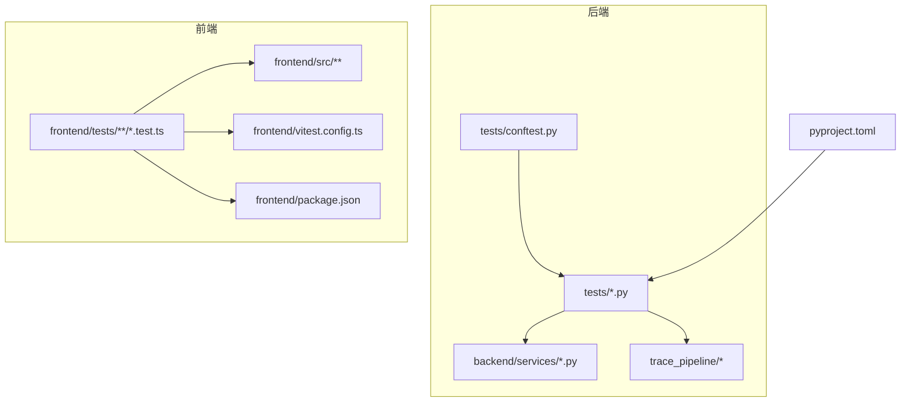
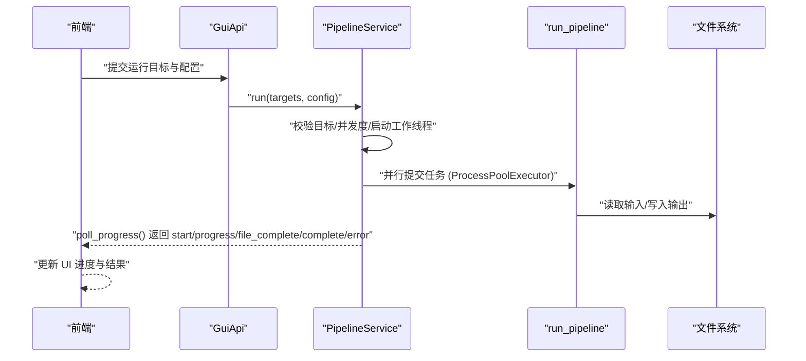
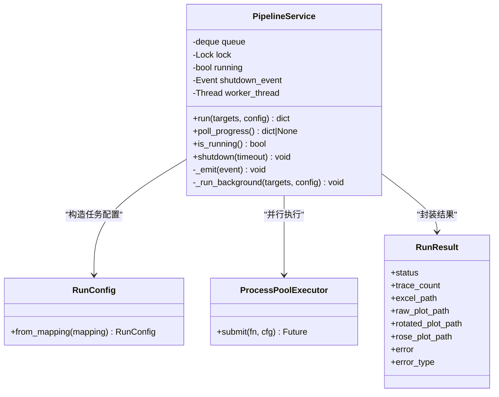
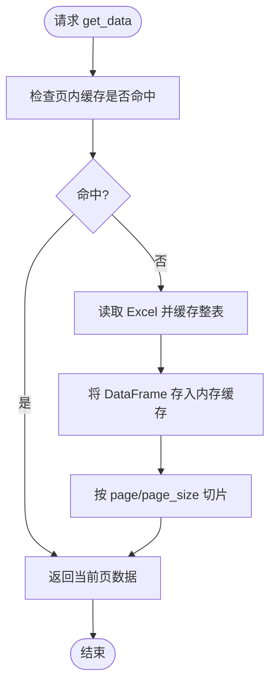
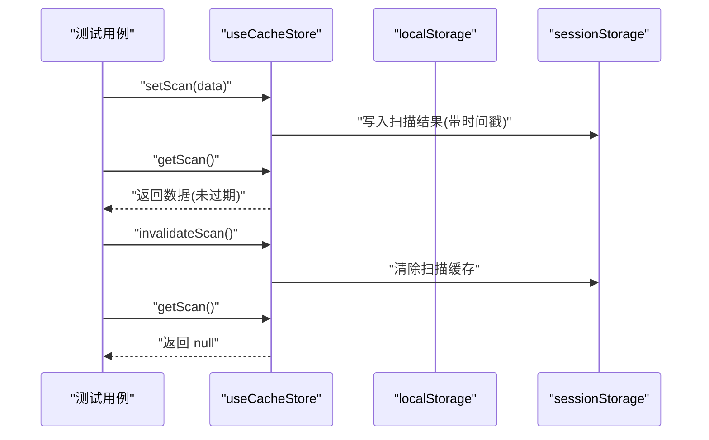
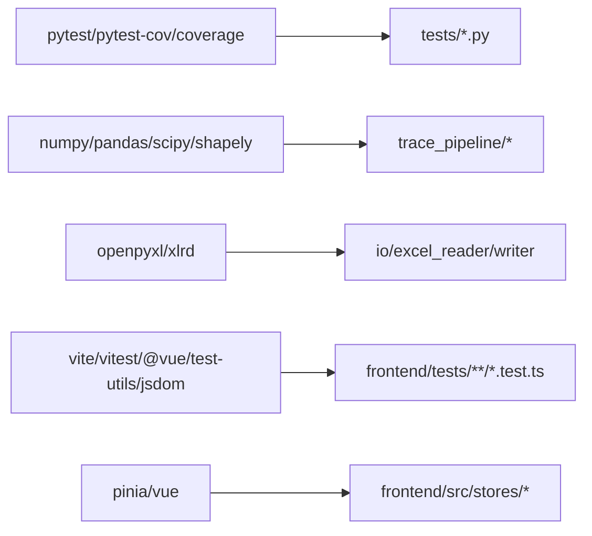

# 测试策略

<cite>
**本文引用的文件**   
- [tests/conftest.py](file://tests/conftest.py)
- [pyproject.toml](file://pyproject.toml)
- [frontend/vitest.config.ts](file://frontend/vitest.config.ts)
- [frontend/package.json](file://frontend/package.json)
- [tests/test_pipeline.py](file://tests/test_pipeline.py)
- [tests/test_endpoints.py](file://tests/test_endpoints.py)
- [tests/test_pipeline_service.py](file://tests/test_pipeline_service.py)
- [backend/services/pipeline_service.py](file://backend/services/pipeline_service.py)
- [tests/test_data_service.py](file://tests/test_data_service.py)
- [tests/test_gui_api.py](file://tests/test_gui_api.py)
- [tests/test_statistics.py](file://tests/test_statistics.py)
- [frontend/tests/stores/cache.test.ts](file://frontend/tests/stores/cache.test.ts)
- [frontend/tests/stores/pipeline.test.ts](file://frontend/tests/stores/pipeline.test.ts)
</cite>

## 目录
1. [引言](#引言)
2. [项目结构](#项目结构)
3. [核心组件](#核心组件)
4. [架构总览](#架构总览)
5. [详细组件分析](#详细组件分析)
6. [依赖分析](#依赖分析)
7. [性能考虑](#性能考虑)
8. [故障排查指南](#故障排查指南)
9. [结论](#结论)
10. [附录](#附录)

## 引言
本测试策略文档面向 TracePipeline 项目的后端与前端，系统化阐述 pytest 与 Vitest 的测试配置、fixtures 设计、测试数据准备、断言方法、核心功能用例覆盖（pipeline 流程、API 端点、数据处理）、覆盖率要求与最佳实践、Mock 策略、外部依赖隔离、异步/并发处理、持续集成与自动化流程，以及调试技巧与常见问题解决方案。目标是帮助开发者快速建立稳定、可维护且高覆盖率的测试体系。

## 项目结构
TracePipeline 采用前后端分离结构：
- 后端 Python 测试位于 tests 目录，使用 pytest；共享 fixtures 集中在 conftest.py。
- 前端 Vue/Vitest 测试位于 frontend/tests，使用 jsdom 环境。
- 构建与工具链通过 pyproject.toml 和 frontend/package.json 管理。

图表来源
- [pyproject.toml:71-83](file://pyproject.toml#L71-L83)
- [frontend/vitest.config.ts:1-19](file://frontend/vitest.config.ts#L1-L19)
- [frontend/package.json:1-37](file://frontend/package.json#L1-L37)

章节来源
- [pyproject.toml:71-83](file://pyproject.toml#L71-L83)
- [frontend/vitest.config.ts:1-19](file://frontend/vitest.config.ts#L1-L19)
- [frontend/package.json:1-37](file://frontend/package.json#L1-L37)

## 核心组件
本节聚焦测试基础设施与关键被测模块：
- pytest 配置与覆盖率：在 pyproject.toml 中定义 testpaths、coverage source/omit、pytest ini_options。
- 共享 fixtures：tests/conftest.py 提供 sample_endpoints、sample_strikes、tmp_output_dir 等通用数据与临时目录。
- 前端 Vitest 配置：frontend/vitest.config.ts 启用 globals、jsdom 环境、别名 @、包含 tests 目录。
- 前端脚本：frontend/package.json 提供 test 与 test:watch 命令。

章节来源
- [pyproject.toml:71-83](file://pyproject.toml#L71-L83)
- [tests/conftest.py:1-38](file://tests/conftest.py#L1-L38)
- [frontend/vitest.config.ts:1-19](file://frontend/vitest.config.ts#L1-L19)
- [frontend/package.json:1-37](file://frontend/package.json#L1-L37)

## 架构总览
下图展示“前端 GUI API → 后台 PipelineService → trace_pipeline.run_pipeline”的端到端调用关系，以及进度事件轮询机制。

图表来源
- [backend/services/pipeline_service.py:32-346](file://backend/services/pipeline_service.py#L32-L346)
- [tests/test_gui_api.py:1-372](file://tests/test_gui_api.py#L1-L372)

## 详细组件分析

### 后端 pytest 测试策略
- 配置与入口
  - testpaths 指向 tests 目录，便于统一发现与执行。
  - coverage 源包含 trace_pipeline 与 backend，排除 tests。
- Fixtures 与测试数据
  - conftest.py 提供几何端点、走向角、临时输出目录等复用数据。
- 断言风格
  - 使用 pytest.approx 进行浮点近似比较；使用 isfinite 验证数值有效性；使用 isinstance 与属性断言验证数据结构。
- 典型用例分类
  - 单元级：端点计算、统计指标、路径工具、安全校验等。
  - 服务级：PipelineService 并发控制、CPU 核心数裁剪、错误传播、事件队列。
  - 集成级：load_trace_data 与 run_pipeline 全流程编排。
  - API 级：GuiApi 参数白名单、日志/审计限制、懒加载线程安全。

章节来源
- [pyproject.toml:71-83](file://pyproject.toml#L71-L83)
- [tests/conftest.py:1-38](file://tests/conftest.py#L1-L38)
- [tests/test_endpoints.py:1-103](file://tests/test_endpoints.py#L1-L103)
- [tests/test_statistics.py:1-292](file://tests/test_statistics.py#L1-L292)
- [tests/test_pipeline_service.py:1-143](file://tests/test_pipeline_service.py#L1-L143)
- [tests/test_pipeline.py:1-125](file://tests/test_pipeline.py#L1-L125)
- [tests/test_gui_api.py:1-372](file://tests/test_gui_api.py#L1-L372)

#### 流水线服务并发与事件流（类图）

图表来源
- [backend/services/pipeline_service.py:32-346](file://backend/services/pipeline_service.py#L32-L346)

#### 数据处理分页缓存行为（流程图）

图表来源
- [tests/test_data_service.py:1-64](file://tests/test_data_service.py#L1-L64)

章节来源
- [backend/services/pipeline_service.py:32-346](file://backend/services/pipeline_service.py#L32-L346)
- [tests/test_data_service.py:1-64](file://tests/test_data_service.py#L1-L64)

### 前端 Vitest 测试策略
- 配置与环境
  - vitest.config.ts 启用全局 API、jsdom 环境、@ 别名、包含 tests 目录。
  - package.json 提供 test 与 test:watch 脚本。
- Store 测试要点
  - 使用 setActivePinia/createPinia 初始化独立 Pinia 实例。
  - 清理 localStorage/sessionStorage 保证用例隔离。
  - 断言状态初始值、重置行为、持久化读写、TTL/LRU 淘汰、全局失效。
- 组件与工具函数
  - 建议对纯函数使用 expect 直接断言返回值；对组件使用 @vue/test-utils 渲染与交互断言。
  - 对网络请求使用 fetch/XHR mock 或本地模拟响应。

章节来源
- [frontend/vitest.config.ts:1-19](file://frontend/vitest.config.ts#L1-L19)
- [frontend/package.json:1-37](file://frontend/package.json#L1-L37)
- [frontend/tests/stores/pipeline.test.ts:1-70](file://frontend/tests/stores/pipeline.test.ts#L1-L70)
- [frontend/tests/stores/cache.test.ts:1-199](file://frontend/tests/stores/cache.test.ts#L1-L199)

#### 缓存 Store 行为（时序图）

图表来源
- [frontend/tests/stores/cache.test.ts:1-199](file://frontend/tests/stores/cache.test.ts#L1-L199)

## 依赖分析
- 后端
  - 测试依赖 pytest、pytest-cov、coverage，由 pyproject.toml optional-dependencies 提供。
  - 被测模块依赖 numpy、pandas、matplotlib、openpyxl、Pillow、scipy、shapely、pywebview、python-docx、reportlab、tqdm、xlrd。
- 前端
  - 测试依赖 vitest、@vue/test-utils、jsdom，由 frontend/package.json devDependencies 提供。
  - 运行时依赖 vue、pinia、echarts、element-plus、vue-router 等。

图表来源
- [pyproject.toml:35-60](file://pyproject.toml#L35-L60)
- [frontend/package.json:14-34](file://frontend/package.json#L14-L34)

章节来源
- [pyproject.toml:35-60](file://pyproject.toml#L35-L60)
- [frontend/package.json:14-34](file://frontend/package.json#L14-L34)

## 性能考虑
- 并发与资源上限
  - PipelineService 根据 CPU 核心数裁剪 workers，避免过度并行导致系统抖动。
  - 非守护工作线程确保优雅关闭，等待文件/Excel 写入完成。
- I/O 缓存
  - DataService 对同一 sheet/workbook 的分页请求复用已读数据，减少重复 I/O。
- 前端缓存
  - cache store 实现 TTL 与 LRU 淘汰，降低重复计算与存储压力。

章节来源
- [backend/services/pipeline_service.py:146-175](file://backend/services/pipeline_service.py#L146-L175)
- [tests/test_data_service.py:1-64](file://tests/test_data_service.py#L1-L64)
- [frontend/tests/stores/cache.test.ts:88-98](file://frontend/tests/stores/cache.test.ts#L88-L98)

## 故障排查指南
- 常见错误定位
  - 输入缺失/权限问题：PipelineService 捕获 FileNotFoundError/PermissionError 并给出提示。
  - 并发异常：MemoryError/SystemExit/KeyboardInterrupt 不吞没，向上传播以便上层处理。
  - 参数越界：GuiApi 对 tail/limit 做边界钳制，防止过大请求。
- 调试技巧
  - 后端：使用 LogContext 记录 request_id，结合 extra 字段定位批次与单任务耗时。
  - 前端：在 jsdom 环境下打印 DOM 状态与 store 快照，确认渲染与状态一致性。
- 复现与隔离
  - 使用 tmp_path 与临时目录隔离文件操作。
  - 使用 monkeypatch 替换第三方模块（如 multiprocessing、pd.read_excel），确保可重复性。

章节来源
- [backend/services/pipeline_service.py:223-346](file://backend/services/pipeline_service.py#L223-L346)
- [tests/test_gui_api.py:136-267](file://tests/test_gui_api.py#L136-L267)
- [tests/test_pipeline_service.py:58-143](file://tests/test_pipeline_service.py#L58-L143)

## 结论
本测试策略以 pytest 与 Vitest 为核心，围绕 fixtures 复用、数据驱动、严格断言、并发与 I/O 优化、前端状态与缓存行为展开，形成从单元到集成的完整闭环。通过明确的覆盖率范围、Mock 策略与 CI 自动化，保障 TracePipeline 在复杂地质数据处理场景下的稳定性与可维护性。

## 附录

### 覆盖率与报告
- 覆盖率范围
  - 后端：trace_pipeline 与 backend 目录纳入统计，tests 目录排除。
- 生成与查看
  - 使用 coverage 生成 HTML/XML 报告，便于在 CI 中归档与阈值检查。

章节来源
- [pyproject.toml:71-74](file://pyproject.toml#L71-L74)

### Mock 策略与外部依赖隔离
- 后端
  - 使用 monkeypatch 替换 multiprocessing.cpu_count、ProcessPoolExecutor、pd.read_excel 等，验证并发裁剪、I/O 缓存与错误路径。
  - 使用 SimpleNamespace 模拟 GuiApi 内部服务，隔离 webview 与外部库。
- 前端
  - 使用 jsdom 模拟浏览器环境，配合 Pinia 独立实例与本地存储清理，确保用例间隔离。

章节来源
- [tests/test_pipeline_service.py:26-143](file://tests/test_pipeline_service.py#L26-L143)
- [tests/test_data_service.py:9-64](file://tests/test_data_service.py#L9-L64)
- [tests/test_gui_api.py:1-131](file://tests/test_gui_api.py#L1-L131)
- [frontend/tests/stores/cache.test.ts:1-199](file://frontend/tests/stores/cache.test.ts#L1-L199)

### 持续集成与自动化流程
- 后端
  - 安装可选依赖 dev，执行 pytest 与 coverage 报告生成。
- 前端
  - 执行 npm test 与类型检查，确保构建与测试一致。
- 建议
  - 在 CI 中设置覆盖率阈值，失败则阻断合并。
  - 缓存 node_modules 与 pip 包，缩短构建时间。

章节来源
- [pyproject.toml:53-60](file://pyproject.toml#L53-L60)
- [frontend/package.json:6-13](file://frontend/package.json#L6-L13)

### 调试技巧与常见问题
- 后端
  - 针对并发：捕获并打印 future_to_info 映射，核对 outcrop/table_stem/idx 对应关系。
  - 针对 I/O：使用临时目录与最小 Excel 文件，快速复现场景。
- 前端
  - 针对缓存：手动调整 timestamp 模拟 TTL 过期，验证 LRU 与全局失效。
  - 针对状态：在 beforeEach 中重置 Pinia 与本地存储，避免跨用例污染。

章节来源
- [tests/test_pipeline_service.py:58-143](file://tests/test_pipeline_service.py#L58-L143)
- [tests/test_pipeline.py:16-46](file://tests/test_pipeline.py#L16-L46)
- [frontend/tests/stores/cache.test.ts:30-38](file://frontend/tests/stores/cache.test.ts#L30-L38)