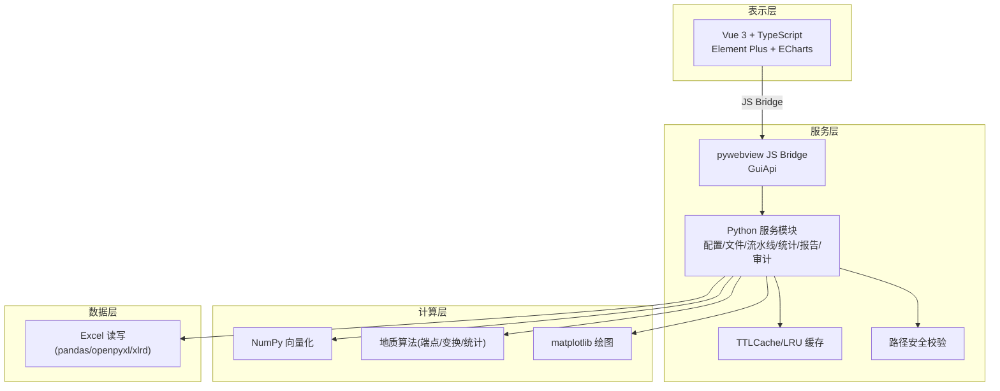
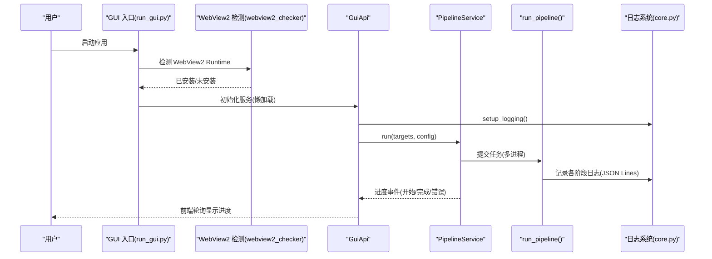
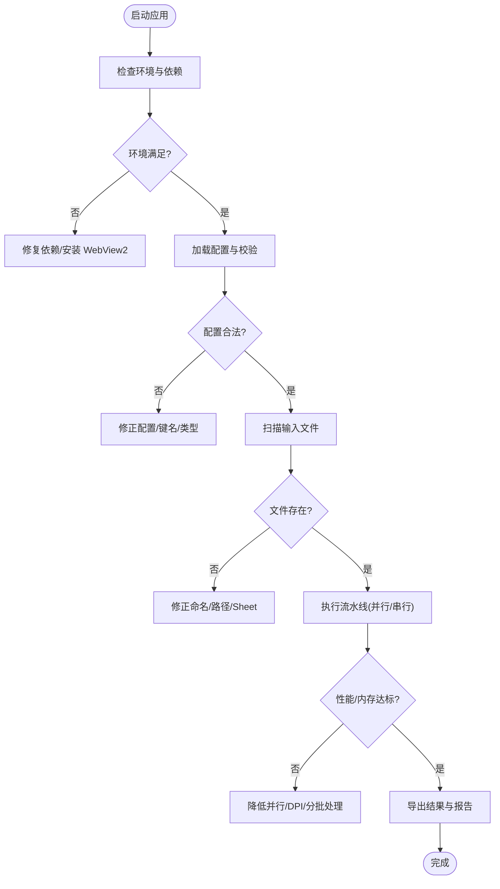

# 故障排除与FAQ

<cite>
**本文引用的文件**   
- [README.md](file://README.md)
- [CONTRIBUTING.md](file://CONTRIBUTING.md)
- [RELEASE_NOTES.md](file://RELEASE_NOTES.md)
- [backend/webview2_checker.py](file://backend/webview2_checker.py)
- [trace_pipeline/logging/core.py](file://trace_pipeline/logging/core.py)
- [backend/gui_api.py](file://backend/gui_api.py)
- [trace_pipeline/pipeline.py](file://trace_pipeline/pipeline.py)
- [trace_pipeline/config.py](file://trace_pipeline/config.py)
- [run_gui.py](file://run_gui.py)
- [run_trace_pipeline.py](file://run_trace_pipeline.py)
- [trace_pipeline/validation.py](file://trace_pipeline/validation.py)
- [backend/services/pipeline_service.py](file://backend/services/pipeline_service.py)
- [trace_pipeline/models.py](file://trace_pipeline/models.py)
</cite>

## 目录
1. [简介](#简介)
2. [项目结构](#项目结构)
3. [核心组件](#核心组件)
4. [架构总览](#架构总览)
5. [详细组件分析](#详细组件分析)
6. [依赖分析](#依赖分析)
7. [性能注意事项](#性能注意事项)
8. [故障排除指南](#故障排除指南)
9. [结论](#结论)
10. [附录](#附录)

## 简介
本文件面向 TracePipeline 用户与维护者，聚焦“安装与运行、依赖冲突、权限错误、内存不足、日志与诊断、WebView2 问题、性能调优、版本升级与兼容性、社区支持与贡献”等常见问题的系统化排查与解决。文档基于仓库源码与发布说明整理，提供可操作的步骤、错误信息对照表与可视化流程图，帮助快速定位并解决问题。

## 项目结构
TracePipeline 采用前后端分离的桌面应用架构：前端为 Vue 3 + Element Plus + ECharts，后端通过 pywebview 嵌入 WebView2 作为容器，Python 服务层负责数据加载、计算、导出与绘图，底层使用 NumPy/SciPy/shapely/matplotlib 等科学计算与可视化库。

图表来源
- [README.md:170-237](file://README.md#L170-L237)
- [backend/gui_api.py:52-110](file://backend/gui_api.py#L52-L110)

章节来源
- [README.md:170-237](file://README.md#L170-L237)

## 核心组件
- 配置与校验：统一默认配置、JSON 覆盖、类型强制转换与必填项检查，支持相对路径解析与 CLI 覆盖。
- 流水线执行：单目标五阶段编排（加载→坐标变换+统计→节点识别→Excel 导出→绘图），异常友好提示与结构化日志。
- GUI API：线程安全的懒加载服务、进度队列、图片缓存、输出目录变更检测、报告生成进度推送。
- 日志系统：JSON Lines 格式、按日轮转、子进程独立日志、归档与清理、跨进程安全。
- WebView2 检测：注册表与 DLL 路径双重检测，提供下载链接。

章节来源
- [trace_pipeline/config.py:86-190](file://trace_pipeline/config.py#L86-L190)
- [trace_pipeline/pipeline.py:230-474](file://trace_pipeline/pipeline.py#L230-L474)
- [backend/gui_api.py:52-110](file://backend/gui_api.py#L52-L110)
- [trace_pipeline/logging/core.py:148-305](file://trace_pipeline/logging/core.py#L148-L305)
- [backend/webview2_checker.py:35-60](file://backend/webview2_checker.py#L35-L60)

## 架构总览
下图展示一次 GUI 启动到流水线执行的端到端流程，包括 WebView2 检测、配置初始化、文件扫描、服务就绪与并行处理。

图表来源
- [run_gui.py:40-60](file://run_gui.py#L40-L60)
- [backend/webview2_checker.py:35-60](file://backend/webview2_checker.py#L35-L60)
- [backend/gui_api.py:388-446](file://backend/gui_api.py#L388-L446)
- [backend/services/pipeline_service.py:100-185](file://backend/services/pipeline_service.py#L100-L185)
- [trace_pipeline/pipeline.py:230-262](file://trace_pipeline/pipeline.py#L230-L262)
- [trace_pipeline/logging/core.py:326-398](file://trace_pipeline/logging/core.py#L326-L398)

## 详细组件分析

### 配置与校验子系统
- 功能要点
  - 合并默认配置与 JSON 覆盖；缺失配置文件时使用默认值。
  - 标量字段类型强制转换（布尔、正整数、正浮点数、枚举）。
  - 必填字段校验与相对路径解析为绝对路径。
  - CLI 参数覆盖后重新校验。
- 常见问题
  - 配置 JSON 语法错误或键名拼写错误导致解析失败或忽略未知键。
  - 缺少必要字段（如 input_dir/output_dir/outcrop）时报错。
  - 非正数 DPI 或无效窗口策略导致校验失败。
- 建议
  - 使用提供的示例模板复制并修改；优先在 GUI 配置页编辑，避免手写错误。
  - 关注警告日志中的“忽略未知配置项”，及时修正键名。

章节来源
- [trace_pipeline/config.py:86-190](file://trace_pipeline/config.py#L86-L190)
- [trace_pipeline/validation.py:26-112](file://trace_pipeline/validation.py#L26-L112)

### 流水线执行与异常处理
- 功能要点
  - 五阶段编排：数据加载、坐标变换与统计、节点识别、Excel 导出、绘图。
  - 关键异常分类处理：PermissionError、FileNotFoundError、ValueError/KeyError/TypeError/IndexError/OSError、MemoryError/KeyboardInterrupt。
  - 子进程安全：独立 matplotlib 后端与日志初始化。
- 常见问题
  - 输出文件被占用（Excel/WPS 打开）导致写入失败。
  - 输入文件不存在或命名不匹配。
  - 内存不足导致崩溃或静默失败。
- 建议
  - 关闭可能占用的输出文件；确保输入文件命名符合规范。
  - 降低并行度或 DPI；分批处理大样本。
  - 关注日志中“处理失败”的错误类型与消息。

章节来源
- [trace_pipeline/pipeline.py:230-474](file://trace_pipeline/pipeline.py#L230-L474)
- [backend/services/pipeline_service.py:222-233](file://backend/services/pipeline_service.py#L222-L233)

### GUI API 与服务层
- 功能要点
  - 懒加载服务实例，线程安全双检锁。
  - 进度队列上限与轮询接口；报告生成进度推送。
  - 图片缓存 TTLCache；输出目录变更检测与缓存失效。
  - 运行配置覆盖白名单（仅允许处理参数、style、parallel_workers）。
- 常见问题
  - 并发预览/报告生成被拒绝（busy）。
  - 外部保存路径越权被拒绝。
  - 进度事件积压或丢失。
- 建议
  - 串行执行重资源操作；合理设置 parallel_workers。
  - 使用系统对话框选择外部路径以登记可信路径。
  - 定期轮询进度队列，避免堆积。

章节来源
- [backend/gui_api.py:52-110](file://backend/gui_api.py#L52-L110)
- [backend/gui_api.py:388-446](file://backend/gui_api.py#L388-L446)
- [backend/gui_api.py:630-636](file://backend/gui_api.py#L630-L636)
- [backend/gui_api.py:644-730](file://backend/gui_api.py#L644-L730)

### 日志系统与诊断
- 功能要点
  - JSON Lines 格式，包含时间戳、级别、模块、函数、行号、request_id、异常堆栈与扩展字段。
  - 按天目录存储，自动打包旧日志，保留最近 30 天压缩包。
  - 子进程独立 worker 日志文件，主进程归档与清理。
- 常见问题
  - 日志文件过大或归档失败。
  - 多进程下日志竞态导致数据丢失或 zip 损坏。
- 建议
  - 查看 logs/ 目录下当天 run_*.jsonl 与 worker_*.jsonl。
  - 使用 tail 限制读取行数，避免内存压力。
  - 关注归档失败警告，必要时手动清理历史归档。

章节来源
- [trace_pipeline/logging/core.py:148-305](file://trace_pipeline/logging/core.py#L148-L305)
- [trace_pipeline/logging/core.py:326-398](file://trace_pipeline/logging/core.py#L326-L398)

### WebView2 运行时检测
- 功能要点
  - 通过注册表与 DLL 路径双重检测是否安装 WebView2。
  - 提供官方下载链接以便引导安装。
- 常见问题
  - Win10 未内置 WebView2，启动 GUI 时无法渲染前端。
- 建议
  - 根据提示安装最新 WebView2 Runtime；重启应用后重试。

章节来源
- [backend/webview2_checker.py:35-60](file://backend/webview2_checker.py#L35-L60)

## 依赖分析
- 运行时依赖
  - 核心：numpy、pandas、matplotlib、openpyxl、xlrd、Pillow、scipy、shapely、tqdm。
  - GUI 附加：pywebview、python-docx、reportlab。
- 平台要求
  - Windows 10 (1809+) / 11；推荐 Python 3.11；Node.js 18 LTS（仅构建前端需要）。
- 已知兼容性与回退
  - Excel 引擎：xlsx 用 openpyxl，xls 用 xlrd。
  - 面积四级回退：实测 → 凸包 → 缓冲凸包 → 圆窗等效面积。
  - 圆窗四策略：auto/tangent/hybrid/concentric，auto 模式加权评分选择。

章节来源
- [README.md:284-321](file://README.md#L284-L321)
- [README.md:119-131](file://README.md#L119-L131)

## 性能注意事项
- 并行处理
  - 使用 ProcessPoolExecutor 并行执行，workers 受 CPU 核心数与请求裁剪。
  - 小目标数时启发式降级串行以减少进程创建开销；可通过参数强制并行。
- 缓存体系
  - 图片 LRU/TTL 缓存、统计数据 LRU、文件扫描 TTL、样式预览 MD5 缓存。
- 绘图优化
  - 批量 scatter 绘制节点；按需启用玫瑰图；合理设置 DPI。
- 内存控制
  - TraceData 缓存容量收敛；超大 Excel 文件拒绝读取；关键异常向上抛出。

章节来源
- [backend/services/pipeline_service.py:146-175](file://backend/services/pipeline_service.py#L146-L175)
- [backend/gui_api.py:94](file://backend/gui_api.py#L94)
- [RELEASE_NOTES.md:459-486](file://RELEASE_NOTES.md#L459-L486)
- [RELEASE_NOTES.md:79-96](file://RELEASE_NOTES.md#L79-L96)

## 故障排除指南

### 安装与环境问题
- 症状
  - pip 安装失败或依赖冲突；GUI 无法启动；前端构建报错。
- 排查步骤
  - 确认 Python 版本（推荐 3.11，支持 3.10/3.12）；Windows 平台要求。
  - 使用虚拟环境隔离依赖；仅 CLI 模式可跳过 GUI 依赖。
  - 前端构建需 Node.js 18 LTS；首次构建耗时较长属正常。
- 解决方案
  - 参考 README 的安装方式与命令；必要时单独安装核心依赖。
  - 若出现网络超时，切换镜像源或离线安装 wheel。

章节来源
- [README.md:323-377](file://README.md#L323-L377)
- [README.md:284-296](file://README.md#L284-L296)

### 依赖冲突与版本不兼容
- 症状
  - 导入错误（如 matplotlib/pywebview 版本不匹配）；打包失败。
- 排查步骤
  - 检查 pyproject.toml/requirements.txt 指定版本范围。
  - 使用 uv sync 或 conda/mamba 管理环境。
- 解决方案
  - 锁定依赖版本；遵循 README 的版本要求；更新第三方库至兼容范围。

章节来源
- [README.md:222-237](file://README.md#L222-L237)

### 权限错误与文件占用
- 症状
  - PermissionError：无法写入输出文件或目录；文件被占用。
- 排查步骤
  - 检查输出目录权限；关闭 Excel/WPS 等占用程序。
  - 确认工作目录存在且可写。
- 解决方案
  - 以管理员权限运行或更改目录权限；关闭占用文件后重试。

章节来源
- [trace_pipeline/pipeline.py:450-467](file://trace_pipeline/pipeline.py#L450-L467)
- [trace_pipeline/config.py:264-312](file://trace_pipeline/config.py#L264-L312)

### 内存不足与 OOM
- 症状
  - MemoryError；长时间运行卡顿；批量处理失败。
- 排查步骤
  - 观察任务管理器内存占用；检查并行度与 DPI。
  - 查看日志中“关键异常传播”相关条目。
- 解决方案
  - 降低 parallel_workers；减小 trace_dpi/rose_dpi；分批处理。
  - 避免超大 Excel 输入（有大小限制）。

章节来源
- [backend/services/pipeline_service.py:222-233](file://backend/services/pipeline_service.py#L222-L233)
- [RELEASE_NOTES.md:459-486](file://RELEASE_NOTES.md#L459-L486)
- [RELEASE_NOTES.md:79-96](file://RELEASE_NOTES.md#L79-L96)

### 输入文件格式与路径问题
- 症状
  - FileNotFoundError：未找到输入文件；工作表不存在。
- 排查步骤
  - 检查文件名是否符合 {露头}_process.xls*；确认 sheet 名与 outcrop 一致。
  - 验证列顺序与数据类型。
- 解决方案
  - 调整文件命名与路径；修复 Excel 表头与数据格式。

章节来源
- [trace_pipeline/pipeline.py:50-58](file://trace_pipeline/pipeline.py#L50-L58)
- [README.md:509-554](file://README.md#L509-L554)

### 配置错误与校验失败
- 症状
  - ValueError：缺少必要字段；非法数值或枚举。
- 排查步骤
  - 检查 config.json 必填项与类型；关注“忽略未知配置项”警告。
- 解决方案
  - 使用示例模板；在 GUI 配置页编辑；修正非法值。

章节来源
- [trace_pipeline/config.py:148-190](file://trace_pipeline/config.py#L148-L190)
- [trace_pipeline/validation.py:63-87](file://trace_pipeline/validation.py#L63-87)

### 日志分析与诊断
- 症状
  - 定位问题困难；多进程日志分散。
- 排查步骤
  - 查看 logs/ 当天目录下的 run_*.jsonl 与 worker_*.jsonl。
  - 使用 get_logs(tail=...) 限制读取行数；关注 request_id 全链路追踪。
- 解决方案
  - 结合 GUI 开发者面板与后端日志交叉分析；归档失败时手动清理历史 zip。

章节来源
- [trace_pipeline/logging/core.py:148-305](file://trace_pipeline/logging/core.py#L148-L305)
- [backend/gui_api.py:630-636](file://backend/gui_api.py#L630-L636)

### WebView2 运行时问题
- 症状
  - GUI 启动后界面空白或报错；提示 WebView2 未安装。
- 排查步骤
  - 使用 webview2_checker 检测注册表与 DLL 路径。
- 解决方案
  - 安装最新 WebView2 Runtime；重启应用。

章节来源
- [backend/webview2_checker.py:35-60](file://backend/webview2_checker.py#L35-L60)

### 进度与并发问题
- 症状
  - 进度条不动或跳变；任务 busy；ZIP 打包失败。
- 排查步骤
  - 检查 poll_progress 轮询；查看报告进度队列；确认并行 workers 裁剪。
- 解决方案
  - 减少并发；等待任务完成；修复 ZIP 打包依赖（7-Zip Inno Setup）。

章节来源
- [backend/gui_api.py:639-643](file://backend/gui_api.py#L639-L643)
- [backend/services/pipeline_service.py:146-175](file://backend/services/pipeline_service.py#L146-L175)
- [RELEASE_NOTES.md:66-96](file://RELEASE_NOTES.md#L66-L96)

### 错误信息对照表
- 常见错误与含义
  - “未找到输入文件”：输入 Excel 不存在或命名不匹配。
  - “文件被占用或权限不足”：输出文件被 Excel/WPS 打开。
  - “内部错误”：GUI API 捕获的未预期异常，查看日志获取详情。
  - “已有任务正在运行”：预览/报告生成并发被拒绝。
  - “保存路径越权”：外部保存路径未通过系统对话框登记。
  - “窗口验证警告”：圆窗策略结果不可靠，建议调整策略或阈值。
- 定位方法
  - 在日志中搜索对应 stage 与 error_type；结合 request_id 追踪调用链。

章节来源
- [trace_pipeline/pipeline.py:450-474](file://trace_pipeline/pipeline.py#L450-L474)
- [backend/gui_api.py:388-446](file://backend/gui_api.py#L388-L446)
- [backend/gui_api.py:644-730](file://backend/gui_api.py#L644-L730)

### 调试技巧与工具
- 日志分析
  - 使用 get_logs(tail=100, level="INFO") 拉取最近日志；关注 JSON Lines 字段。
- 性能监控
  - 观察 GUI 启动耗时与图片缓存命中；调整 DPI 与并行度。
- 内存泄漏检测
  - 关注长任务内存增长；减少缓存上限；避免重复大图加载。

章节来源
- [backend/gui_api.py:630-636](file://backend/gui_api.py#L630-L636)
- [backend/gui_api.py:94](file://backend/gui_api.py#L94)

### 性能调优与最佳实践
- 并行策略
  - 目标数较多时提高 workers；小目标数保持串行或低并行。
- 缓存利用
  - 复用图片与统计数据缓存；避免频繁刷新。
- 绘图优化
  - 按需启用玫瑰图；合理设置 DPI；批量绘制节点。
- 输入优化
  - 控制 Excel 文件大小；预清洗数据减少异常分支。

章节来源
- [backend/services/pipeline_service.py:146-175](file://backend/services/pipeline_service.py#L146-L175)
- [RELEASE_NOTES.md:459-486](file://RELEASE_NOTES.md#L459-L486)

### 社区支持与贡献指南
- 反馈渠道
  - GitHub Issue 报告 Bug 或功能建议；邮件联系作者。
- 贡献流程
  - Fork → 分支 → PR；遵循代码规范与测试要求。
- 行为准则
  - 遵守贡献者行为准则。

章节来源
- [CONTRIBUTING.md:1-171](file://CONTRIBUTING.md#L1-171)
- [RELEASE_NOTES.md:38-44](file://RELEASE_NOTES.md#L38-L44)

### 版本升级与向后兼容性
- 维护状态
  - v4.5.5 为最后一个计划内维护版本；后续不再持续投入。
- 兼容性说明
  - Python 3.10+/3.11/3.12；Windows 10/11；WebView2 任意版本。
- 升级建议
  - 遵循 README 安装步骤；清理旧静态资源缓存；注意图表标题字重变化。

章节来源
- [RELEASE_NOTES.md:1-28](file://RELEASE_NOTES.md#L1-L28)
- [README.md:284-296](file://README.md#L284-L296)
- [RELEASE_NOTES.md:235-239](file://RELEASE_NOTES.md#L235-L239)

## 结论
通过系统化排查与标准化流程，大多数安装、依赖、权限、内存与 WebView2 问题均可快速定位与解决。建议结合结构化日志与性能监控进行持续优化，并遵循社区贡献指南参与改进。鉴于当前为最终维护版本，建议在现有能力范围内完善使用体验与稳定性。

## 附录

### 典型问题流程图（概览）

[此图为概念性流程，无需源码映射]