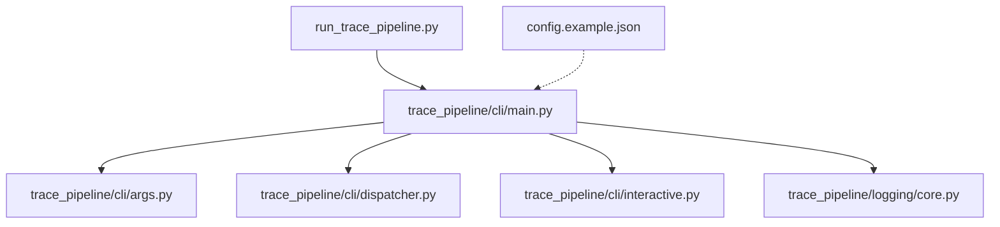
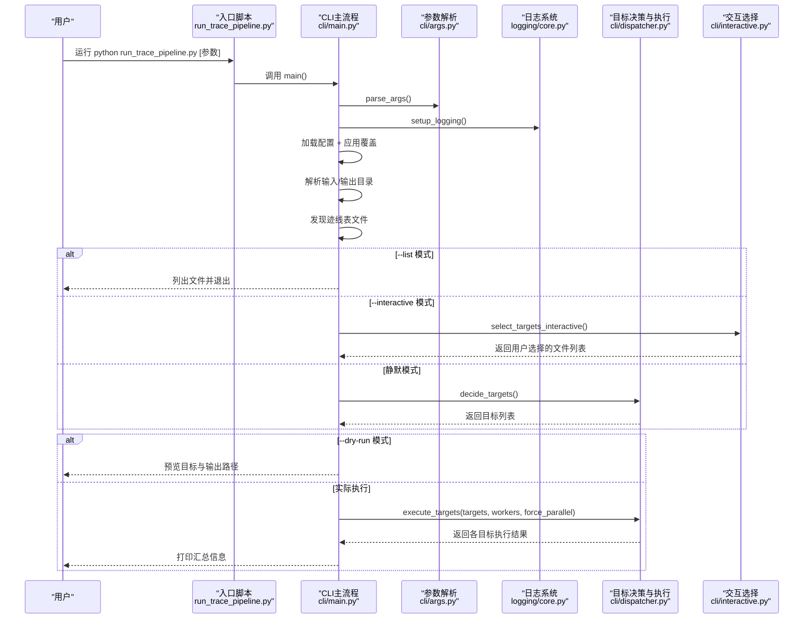
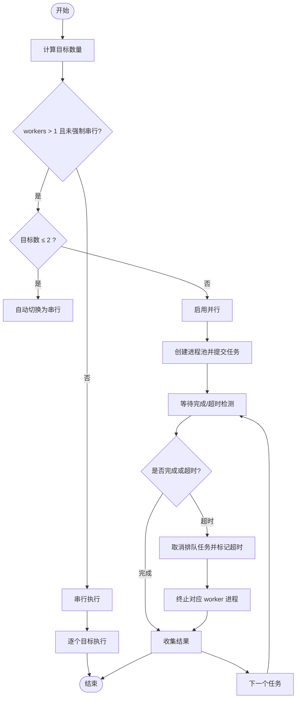
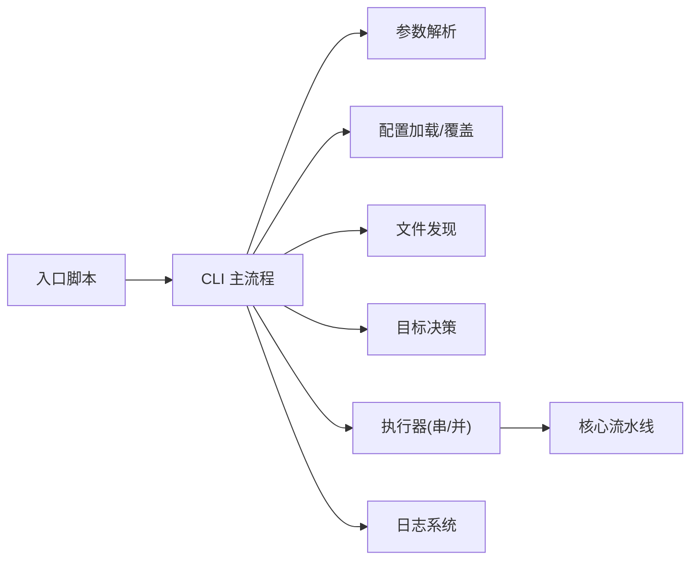

# CLI 命令行使用指南

<cite>
**本文引用的文件**   
- [run_trace_pipeline.py](file://run_trace_pipeline.py)
- [trace_pipeline/cli/main.py](file://trace_pipeline/cli/main.py)
- [trace_pipeline/cli/args.py](file://trace_pipeline/cli/args.py)
- [trace_pipeline/cli/dispatcher.py](file://trace_pipeline/cli/dispatcher.py)
- [trace_pipeline/cli/interactive.py](file://trace_pipeline/cli/interactive.py)
- [config.example.json](file://config.example.json)
- [README.md](file://README.md)
- [trace_pipeline/logging/core.py](file://trace_pipeline/logging/core.py)
</cite>

## 目录
1. [简介](#简介)
2. [项目结构](#项目结构)
3. [核心组件](#核心组件)
4. [架构总览](#架构总览)
5. [详细组件分析](#详细组件分析)
6. [依赖关系分析](#依赖关系分析)
7. [性能与并行处理](#性能与并行处理)
8. [故障排查与日志查看](#故障排查与日志查看)
9. [结论](#结论)
10. [附录：常用命令模板与最佳实践](#附录常用命令模板与最佳实践)

## 简介
本指南面向使用 TracePipeline 的命令行用户，聚焦入口脚本 run_trace_pipeline.py 的使用方法。内容涵盖参数说明、输入输出配置、处理模式（批量/单文件/交互式/试运行）、并行策略、错误处理与日志查看，并提供常见场景的命令模板与最佳实践建议。

## 项目结构
CLI 相关代码位于 trace_pipeline/cli 子包中，入口脚本位于仓库根目录。关键文件职责如下：
- run_trace_pipeline.py：进程级入口，负责初始化工作区目录、统一异常捕获与退出码设置。
- trace_pipeline/cli/main.py：顶层编排，串联参数解析、配置加载、路径解析、文件发现、目标决策、执行与结果汇总。
- trace_pipeline/cli/args.py：定义并解析所有命令行参数，生成配置覆盖项。
- trace_pipeline/cli/dispatcher.py：决定处理目标（批量或单文件），串行/并行执行管线，进度条与超时保护。
- trace_pipeline/cli/interactive.py：交互式选择待处理目标的工具。
- config.example.json：配置文件模板，包含输入输出目录、玫瑰图、圆窗策略等选项。
- README.md：快速开始与示例命令参考。
- trace_pipeline/logging/core.py：结构化 JSON Lines 日志系统，按日归档与分片。

图示来源
- [run_trace_pipeline.py:1-30](file://run_trace_pipeline.py#L1-L30)
- [trace_pipeline/cli/main.py:28-110](file://trace_pipeline/cli/main.py#L28-L110)
- [trace_pipeline/cli/args.py:11-93](file://trace_pipeline/cli/args.py#L11-L93)
- [trace_pipeline/cli/dispatcher.py:24-228](file://trace_pipeline/cli/dispatcher.py#L24-L228)
- [trace_pipeline/cli/interactive.py:47-70](file://trace_pipeline/cli/interactive.py#L47-L70)
- [config.example.json:1-26](file://config.example.json#L1-L26)
- [trace_pipeline/logging/core.py:326-398](file://trace_pipeline/logging/core.py#L326-L398)

章节来源
- [run_trace_pipeline.py:1-30](file://run_trace_pipeline.py#L1-L30)
- [trace_pipeline/cli/main.py:28-110](file://trace_pipeline/cli/main.py#L28-L110)
- [trace_pipeline/cli/args.py:11-93](file://trace_pipeline/cli/args.py#L11-L93)
- [trace_pipeline/cli/dispatcher.py:24-228](file://trace_pipeline/cli/dispatcher.py#L24-L228)
- [trace_pipeline/cli/interactive.py:47-70](file://trace_pipeline/cli/interactive.py#L47-L70)
- [config.example.json:1-26](file://config.example.json#L1-L26)
- [README.md:381-406](file://README.md#L381-L406)

## 核心组件
- 入口脚本（run_trace_pipeline.py）
  - 作用：确保工作区目录存在；调用 CLI 主流程；统一捕获 KeyboardInterrupt 与未处理异常，设置退出码并打印友好提示。
- CLI 主流程（main.py）
  - 作用：解析参数 → 初始化日志 → 加载配置 → 解析输入输出路径 → 扫描迹线表 → 列表/试运行/交互/执行 → 汇总结果。
- 参数解析（args.py）
  - 作用：定义全部 CLI 参数与校验规则，并将显式参数转换为配置覆盖字典。
- 目标决策与执行（dispatcher.py）
  - 作用：根据配置决定批量或单文件目标；构建 RunConfig；串行/并行执行；进度显示；超时与失败隔离。
- 交互选择（interactive.py）
  - 作用：在 TTY 环境下列出候选文件，支持 all、区间、逗号组合的选择语法。
- 配置模板（config.example.json）
  - 作用：提供默认值与字段说明，便于复制为 config.json 后按需修改。
- 日志系统（logging/core.py）
  - 作用：JSON Lines 格式、按日归档、大小分片、主/子进程独立日志文件、保留期清理。

章节来源
- [run_trace_pipeline.py:14-30](file://run_trace_pipeline.py#L14-L30)
- [trace_pipeline/cli/main.py:28-110](file://trace_pipeline/cli/main.py#L28-L110)
- [trace_pipeline/cli/args.py:11-93](file://trace_pipeline/cli/args.py#L11-L93)
- [trace_pipeline/cli/dispatcher.py:24-228](file://trace_pipeline/cli/dispatcher.py#L24-L228)
- [trace_pipeline/cli/interactive.py:47-70](file://trace_pipeline/cli/interactive.py#L47-L70)
- [config.example.json:1-26](file://config.example.json#L1-L26)
- [trace_pipeline/logging/core.py:326-398](file://trace_pipeline/logging/core.py#L326-L398)

## 架构总览
下图展示了从命令行到执行与日志输出的整体流程。

图示来源
- [run_trace_pipeline.py:14-30](file://run_trace_pipeline.py#L14-L30)
- [trace_pipeline/cli/main.py:28-110](file://trace_pipeline/cli/main.py#L28-L110)
- [trace_pipeline/cli/args.py:11-93](file://trace_pipeline/cli/args.py#L11-L93)
- [trace_pipeline/cli/dispatcher.py:103-228](file://trace_pipeline/cli/dispatcher.py#L103-L228)
- [trace_pipeline/cli/interactive.py:47-70](file://trace_pipeline/cli/interactive.py#L47-L70)
- [trace_pipeline/logging/core.py:326-398](file://trace_pipeline/logging/core.py#L326-L398)

## 详细组件分析

### 入口脚本与异常处理
- 启动时创建必要的工作区目录，随后进入 CLI 主流程。
- 捕获键盘中断与未处理异常，分别以不同退出码退出，并在标准错误输出简要提示，同时记录详细堆栈。

章节来源
- [run_trace_pipeline.py:14-30](file://run_trace_pipeline.py#L14-L30)

### CLI 主流程（main.py）
- 参数解析与日志初始化
  - 解析参数、初始化日志系统，保证后续模块可复用同一 logger。
- 配置加载与覆盖
  - 加载 JSON 配置，将显式 CLI 参数转为覆盖项并合并。
- 路径解析与文件发现
  - 基于配置与命令行覆盖确定输入/输出目录，扫描匹配 *.xls* 的迹线表文件。
- 模式分支
  - --list：仅列出发现的文件并退出。
  - --interactive：需要 TTY，否则报错退出。
  - --dry-run：仅预览目标与输出路径，不执行。
  - 正常执行：构造 RunConfig，调用执行器。
- 结果汇总
  - 统计成功数并记录日志。

章节来源
- [trace_pipeline/cli/main.py:28-110](file://trace_pipeline/cli/main.py#L28-L110)

### 参数定义与覆盖映射（args.py）
- 支持的参数与行为要点
  - --input/-i：覆盖 input_dir。
  - --output/-o：覆盖 output_dir。
  - --config/-c：指定 JSON 配置文件路径。
  - --single/-s：单文件模式，仅处理 table_stem 指定的文件。
  - --parallel/-p N：并行线程数（0=串行）。
  - --force-parallel：强制并行（即使目标数较少）。
  - --interactive/-I：交互模式。
  - --list/-l：列出文件后退出。
  - --dry-run/-n：试运行。
  - --no-rose：跳过玫瑰图导出。
  - --rose-bin W：玫瑰图分箱宽度（度），范围 (0, 180]。
  - --rose-dpi DPI：玫瑰图分辨率，正整数且不超过 2400。
  - --window-strategy S：圆窗策略，可选 auto/tangent/hybrid/concentric。
- 覆盖映射
  - 仅对显式传入的参数生成覆盖字典，避免覆盖未设置的配置项。

章节来源
- [trace_pipeline/cli/args.py:11-93](file://trace_pipeline/cli/args.py#L11-L93)

### 目标决策与执行（dispatcher.py）
- 目标决策
  - 若 process_all=true 且发现文件，则批量处理；否则回退为单文件模式（table_stem/outcrop）。
- 执行策略
  - 当目标数 ≤2 且未强制并行时，自动降级为串行以减少进程开销。
  - 并行模式使用多进程池，带进度条与任务超时保护（默认 300 秒），并对超时的 worker 进程进行终止清理。
  - 单个目标失败不会中断整批处理，失败结果会被记录并继续。
- 输出前缀
  - 批量模式下默认以露头名作为输出前缀；单文件模式允许通过配置覆盖。

图示来源
- [trace_pipeline/cli/dispatcher.py:94-120](file://trace_pipeline/cli/dispatcher.py#L94-L120)
- [trace_pipeline/cli/dispatcher.py:103-228](file://trace_pipeline/cli/dispatcher.py#L103-L228)

章节来源
- [trace_pipeline/cli/dispatcher.py:24-228](file://trace_pipeline/cli/dispatcher.py#L24-L228)

### 交互式选择（interactive.py）
- 输入语法
  - all/a：全选。
  - 1,3,5：多选。
  - 1-5：区间选择。
  - 1,3-5,7：混合语法。
- 校验与反馈
  - 索引必须在 1..N 范围内，非法输入会提示重新输入；EOF/中断会安全退出。

章节来源
- [trace_pipeline/cli/interactive.py:47-70](file://trace_pipeline/cli/interactive.py#L47-L70)

### 配置与覆盖（config.example.json）
- 关键字段
  - input_dir/output_dir：输入/输出目录。
  - process_all：是否批量处理。
  - table_stem/outcrop：单文件模式的目标标识。
  - export_rose_plot/rose_bin_width/rose_dpi：玫瑰图控制。
  - window_strategy/auto_density_threshold/tangent_window_count/min_intersections：圆窗策略与阈值。
  - parallel_workers：并行进程数（CLI 的 --parallel 优先）。
- 覆盖优先级
  - 命令行参数 > 配置文件；仅在显式传入时才覆盖。

章节来源
- [config.example.json:1-26](file://config.example.json#L1-L26)
- [trace_pipeline/cli/args.py:75-93](file://trace_pipeline/cli/args.py#L75-L93)

## 依赖关系分析
- 入口脚本依赖 CLI 主流程与工作区初始化。
- CLI 主流程依赖参数解析、配置加载、路径解析、文件发现、目标决策与执行、日志系统。
- 执行器依赖多进程池与进度条，内部调用核心流水线。
- 日志系统为主进程与子进程分别提供独立的写入通道，并按日归档与大小分片。

图示来源
- [run_trace_pipeline.py:14-30](file://run_trace_pipeline.py#L14-L30)
- [trace_pipeline/cli/main.py:28-110](file://trace_pipeline/cli/main.py#L28-L110)
- [trace_pipeline/cli/args.py:11-93](file://trace_pipeline/cli/args.py#L11-L93)
- [trace_pipeline/cli/dispatcher.py:103-228](file://trace_pipeline/cli/dispatcher.py#L103-L228)
- [trace_pipeline/logging/core.py:326-398](file://trace_pipeline/logging/core.py#L326-L398)

章节来源
- [trace_pipeline/cli/main.py:28-110](file://trace_pipeline/cli/main.py#L28-L110)
- [trace_pipeline/cli/dispatcher.py:103-228](file://trace_pipeline/cli/dispatcher.py#L103-L228)
- [trace_pipeline/logging/core.py:326-398](file://trace_pipeline/logging/core.py#L326-L398)

## 性能与并行处理
- 自动串行启发式
  - 当目标数 ≤2 时，为避免 spawn 进程开销，自动降级为串行；可通过 --force-parallel 强制并行。
- 并行超时保护
  - 每个任务有默认超时时间，超时后会取消排队任务并尝试终止对应的 worker 进程，防止资源泄漏。
- 进度与可视化
  - 串行与并行均使用进度条，便于观察当前处理目标与完成状态。
- 推荐策略
  - 小批量（≤2）：默认串行即可。
  - 大批量：根据 CPU 核数设置 --parallel，必要时配合 --force-parallel。

章节来源
- [trace_pipeline/cli/dispatcher.py:94-120](file://trace_pipeline/cli/dispatcher.py#L94-L120)
- [trace_pipeline/cli/dispatcher.py:103-228](file://trace_pipeline/cli/dispatcher.py#L103-L228)

## 故障排查与日志查看
- 常见问题定位
  - 配置加载失败：检查配置文件路径与字段类型，CLI 覆盖项需符合校验规则（如玫瑰图分箱宽度与 DPI 范围）。
  - 无可用目标：确认输入目录下是否存在 *_process.xls* 文件，或单文件模式下 table_stem/outcrop 是否正确。
  - 交互式模式不可用：需在 TTY 终端下运行，非交互式环境会直接报错退出。
  - 并行执行不完整：检查是否有任务超时或被终止，查看对应 worker 日志。
- 日志位置与格式
  - 日志目录：logs/
  - 主进程日志：按日期目录下的 run_XXX.jsonl（JSON Lines 格式）。
  - 子进程日志：同日期目录下的 worker_{pid}.jsonl。
  - 归档策略：非当天目录会被打包为 zip 并删除原目录；超过保留期的 zip 会被清理。
  - 分片策略：单文件超过 50 MB 会自动分片为 run_XXX_part_N.jsonl。
- 实用技巧
  - 使用 --dry-run 验证目标与输出路径。
  - 使用 --list 确认文件发现是否符合预期。
  - 结合 --parallel 与 --force-parallel 调整并发策略。
  - 通过 JSON Lines 日志进行结构化检索与问题回溯。

章节来源
- [trace_pipeline/cli/main.py:32-43](file://trace_pipeline/cli/main.py#L32-L43)
- [trace_pipeline/cli/main.py:69-76](file://trace_pipeline/cli/main.py#L69-L76)
- [trace_pipeline/cli/main.py:84-92](file://trace_pipeline/cli/main.py#L84-L92)
- [trace_pipeline/cli/dispatcher.py:103-228](file://trace_pipeline/cli/dispatcher.py#L103-L228)
- [trace_pipeline/logging/core.py:148-305](file://trace_pipeline/logging/core.py#L148-L305)
- [trace_pipeline/logging/core.py:326-398](file://trace_pipeline/logging/core.py#L326-L398)

## 结论
TracePipeline 的 CLI 提供了灵活的参数体系与稳健的执行框架，支持批量与单文件处理、交互式选择、试运行与并行加速。通过结构化日志与完善的错误处理，用户可以高效定位问题并优化处理性能。建议在生产环境中结合配置文件与命令行覆盖，合理设置并行策略与日志保留策略，以获得稳定高效的批处理能力。

## 附录：常用命令模板与最佳实践
- 基本用法
  - 批量处理全部露头：python run_trace_pipeline.py
  - 列出可用文件：python run_trace_pipeline.py -l
  - 试运行（预览目标与输出）：python run_trace_pipeline.py -n
  - 交互式选择目标：python run_trace_pipeline.py -I
  - 指定配置文件：python run_trace_pipeline.py -c my_config.json
- 并行与策略
  - 4 进程并行：python run_trace_pipeline.py -p 4
  - 强制并行（目标数少也并行）：python run_trace_pipeline.py -p 2 --force-parallel
  - 自定义圆窗策略：python run_trace_pipeline.py --window-strategy hybrid
- 绘图与分辨率
  - 高 DPI 玫瑰图：python run_trace_pipeline.py --rose-bin 5 --rose-dpi 1200
  - 跳过玫瑰图导出：python run_trace_pipeline.py --no-rose
- 单文件处理
  - 仅处理 table_stem 指定文件：python run_trace_pipeline.py -s
- 最佳实践
  - 首次运行先用 -l 和 -n 验证输入输出与目标集合。
  - 大批量任务建议根据 CPU 核数设置 -p，必要时加 --force-parallel。
  - 使用 JSON Lines 日志进行问题追踪，关注 logs/ 下按日归档的 run_*.jsonl 与 worker_*.jsonl。
  - 通过配置文件集中管理样式与策略，命令行仅用于临时覆盖。

章节来源
- [README.md:381-406](file://README.md#L381-L406)
- [trace_pipeline/cli/args.py:11-93](file://trace_pipeline/cli/args.py#L11-L93)
- [trace_pipeline/cli/main.py:58-92](file://trace_pipeline/cli/main.py#L58-L92)
- [trace_pipeline/cli/dispatcher.py:94-120](file://trace_pipeline/cli/dispatcher.py#L94-L120)
- [trace_pipeline/logging/core.py:148-305](file://trace_pipeline/logging/core.py#L148-L305)