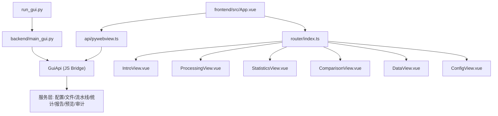
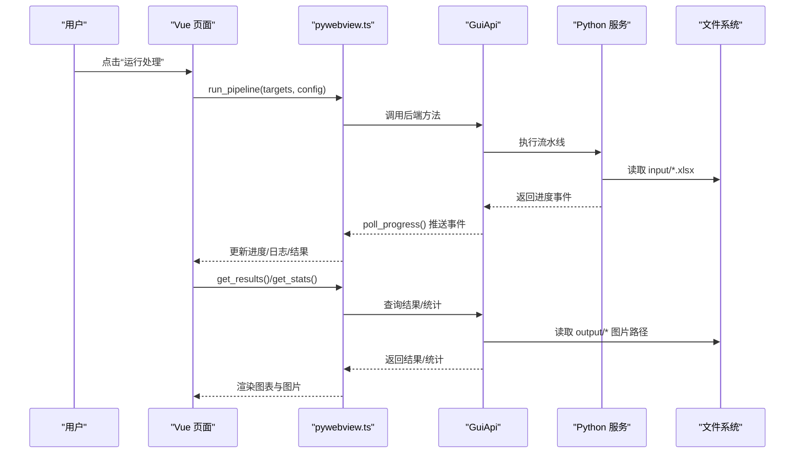
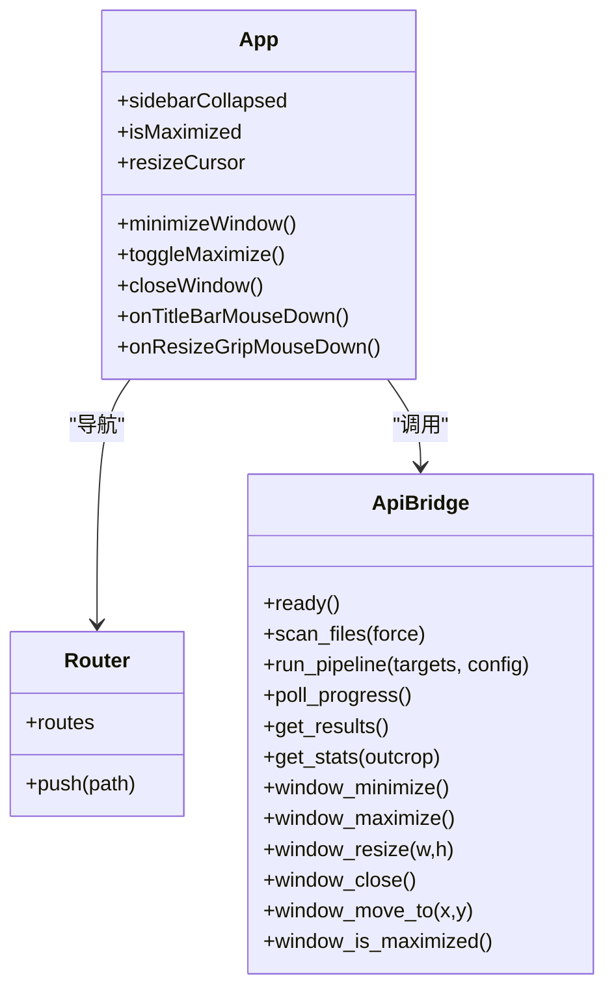

# GUI 桌面应用操作手册

<cite>
**本文引用的文件**   
- [README.md](file://README.md)
- [run_gui.py](file://run_gui.py)
- [backend/main_gui.py](file://backend/main_gui.py)
- [backend/gui_api.py](file://backend/gui_api.py)
- [frontend/src/App.vue](file://frontend/src/App.vue)
- [frontend/src/router/index.ts](file://frontend/src/router/index.ts)
- [frontend/src/views/IntroView.vue](file://frontend/src/views/IntroView.vue)
- [frontend/src/views/ProcessingView.vue](file://frontend/src/views/ProcessingView.vue)
- [frontend/src/views/StatisticsView.vue](file://frontend/src/views/StatisticsView.vue)
- [frontend/src/views/ComparisonView.vue](file://frontend/src/views/ComparisonView.vue)
- [frontend/src/views/DataView.vue](file://frontend/src/views/DataView.vue)
- [frontend/src/views/ConfigView.vue](file://frontend/src/views/ConfigView.vue)
- [frontend/src/api/pywebview.ts](file://frontend/src/api/pywebview.ts)
- [config.example.json](file://config.example.json)
</cite>

## 目录
1. [简介](#简介)
2. [项目结构](#项目结构)
3. [核心组件](#核心组件)
4. [架构总览](#架构总览)
5. [详细页面操作指南](#详细页面操作指南)
6. [依赖与交互分析](#依赖与交互分析)
7. [性能与体验优化建议](#性能与体验优化建议)
8. [常见问题与故障排除](#常见问题与故障排除)
9. [结论](#结论)
10. [附录：配置项速查](#附录配置项速查)

## 简介
TracePipeline 是一套面向岩体节理几何特征分析的专业工具，提供 CLI 命令行与桌面 GUI 双模式。GUI 基于 pywebview + Vue 3 + Element Plus + ECharts，内置六页视图：首页概览、数据处理、统计分析、对比分析、数据浏览、系统配置。本手册聚焦于 GUI 桌面应用的启动方式、界面布局、各页面操作步骤、组件交互、个性化设置以及常见问题排查。

## 项目结构
- 后端入口
  - run_gui.py：进程 DPI 感知、非交互式 matplotlib 后端初始化、调用 main_gui.main()
  - backend/main_gui.py：WebView2 检测、窗口创建居中、绑定 GuiApi、注册关闭事件
  - backend/gui_api.py：前端可调用的 JS Bridge 方法集合（配置、扫描、流水线、统计、报告、图片等）
- 前端入口
  - frontend/src/App.vue：主框架（标题栏、侧边栏、状态栏、窗口控制、启动引导）
  - frontend/src/router/index.ts：路由映射到六个页面视图
  - 六个页面视图：IntroView、ProcessingView、StatisticsView、ComparisonView、DataView、ConfigView
  - frontend/src/api/pywebview.ts：前后端类型安全桥接，封装所有 API 调用

图表来源
- [run_gui.py:1-60](file://run_gui.py#L1-L60)
- [backend/main_gui.py:81-206](file://backend/main_gui.py#L81-L206)
- [backend/gui_api.py:52-110](file://backend/gui_api.py#L52-L110)
- [frontend/src/App.vue:143-213](file://frontend/src/App.vue#L143-L213)
- [frontend/src/router/index.ts:1-26](file://frontend/src/router/index.ts#L1-L26)
- [frontend/src/api/pywebview.ts:144-185](file://frontend/src/api/pywebview.ts#L144-L185)

章节来源
- [run_gui.py:1-60](file://run_gui.py#L1-L60)
- [backend/main_gui.py:81-206](file://backend/main_gui.py#L81-L206)
- [frontend/src/App.vue:143-213](file://frontend/src/App.vue#L143-L213)
- [frontend/src/router/index.ts:1-26](file://frontend/src/router/index.ts#L1-L26)

## 核心组件
- 启动与窗口管理
  - DPI 感知与窗口居中：在进程启动时设置 DPI 感知并计算居中坐标
  - WebView2 检测：未安装则弹出提示下载；已安装则加载前端静态资源
  - 窗口控制：最小化、最大化、关闭、拖拽移动、边缘调整大小
- 前后端通信
  - 通过 pywebview.api 暴露的 37 个方法签名进行类型安全的跨语言调用
  - 开发环境自动回退为 mock 数据，便于独立调试前端
- 缓存体系
  - 文件扫描、统计数据、结果列表、图片缩略图等多级缓存，降低重复 IO 与网络开销

章节来源
- [run_gui.py:23-33](file://run_gui.py#L23-L33)
- [backend/main_gui.py:97-174](file://backend/main_gui.py#L97-L174)
- [frontend/src/App.vue:245-486](file://frontend/src/App.vue#L245-L486)
- [frontend/src/api/pywebview.ts:104-142](file://frontend/src/api/pywebview.ts#L104-L142)
- [frontend/src/api/pywebview.ts:193-279](file://frontend/src/api/pywebview.ts#L193-L279)

## 架构总览
- 四层架构：表示层（Vue 3 + Element Plus + ECharts）、服务层（pywebview JS Bridge + Python 服务）、计算层（NumPy/scipy/shapely/matplotlib）、数据层（pandas/openpyxl/xlrd）
- 数据流：Excel 输入 → 端点计算 → 坐标变换与统计 → 节点识别 → Excel 导出 → 绘图（迹线图/旋转图/玫瑰图）→ 报告导出

图表来源
- [frontend/src/views/ProcessingView.vue:354-418](file://frontend/src/views/ProcessingView.vue#L354-L418)
- [frontend/src/api/pywebview.ts:302-315](file://frontend/src/api/pywebview.ts#L302-L315)
- [backend/gui_api.py:52-110](file://backend/gui_api.py#L52-L110)

## 详细页面操作指南

### 首页概览（/）
- 功能
  - 展示产品简介、技术栈标签、模块卡片导航、快速开始步骤
- 操作步骤
  - 打开应用后默认进入首页，点击任意模块卡片即可跳转至对应页面
- 交互说明
  - 支持键盘 Tab/Enter/Space 导航到卡片并触发跳转
- 注意事项
  - 首次启动会显示引导进度条，完成后自动加载配置与文件扫描结果

章节来源
- [frontend/src/views/IntroView.vue:78-136](file://frontend/src/views/IntroView.vue#L78-L136)
- [frontend/src/App.vue:175-195](file://frontend/src/App.vue#L175-L195)

### 数据处理（/processing）
- 功能
  - 选择露头文件、设置处理参数、启动流水线、查看实时进度与日志、查看结果图片
- 操作步骤
  1) 选择文件
     - 使用“文件列表”组件勾选需要处理的露头文件
  2) 设置参数
     - 在“处理参数”面板中设置：是否导出玫瑰图、是否启用节点识别、玫瑰图 DPI、分箱宽度、原始图 DPI、旋转图 DPI
     - 可点击“保存参数”将当前设置写入全局配置
  3) 启动处理
     - 点击“运行”按钮，系统将合并本地参数与全局配置并持久化后再启动流水线
  4) 监控进度
     - “进度面板”显示总任务数、当前任务、文件名与消息
     - “处理过程”日志区滚动显示 info/success/error 三类记录
  5) 查看结果
     - 处理完成后，点击“查看图片”可在模态窗口中切换原始迹线图、旋转迹线图与玫瑰图（若开启）
- 交互说明
  - 并行进程数滑块与全局配置双向绑定，修改即生效
  - 轮询机制每 300ms 拉取一次进度事件，连续失败超过阈值将停止并提示错误
- 注意事项
  - 若输出文件被占用（如 Excel/WPS 打开），会提示权限错误，请关闭相关程序后重试
  - 处理完成后会自动刷新文件列表与失效缓存，确保其他页面获取最新结果

章节来源
- [frontend/src/views/ProcessingView.vue:136-186](file://frontend/src/views/ProcessingView.vue#L136-L186)
- [frontend/src/views/ProcessingView.vue:354-418](file://frontend/src/views/ProcessingView.vue#L354-L418)
- [frontend/src/views/ProcessingView.vue:410-518](file://frontend/src/views/ProcessingView.vue#L410-L518)
- [frontend/src/views/ProcessingView.vue:277-332](file://frontend/src/views/ProcessingView.vue#L277-L332)

### 统计分析（/statistics）
- 功能
  - 单露头统计仪表板：密度指标卡片、迹长直方图、裂隙类型饼图、结果图预览与全屏查看、导出统计报告
- 操作步骤
  1) 选择露头
     - 下拉框选择目标露头，自动加载统计信息与结果图索引
  2) 查看图表
     - 直方图与饼图由 ECharts 渲染，支持缩放与图例切换
  3) 查看结果图
     - 三图切换：原始迹线图、旋转迹线图、走向玫瑰图（若上次运行启用了玫瑰图）
     - 点击缩略图进入全屏查看器，支持多图滑动浏览
  4) 导出报告
     - 点击“导出统计报告”，可选择 Word/PDF 或同时生成，进度条实时更新
- 交互说明
  - 根据面积来源不同显示警告提示（缓冲凸包/圆窗等效）
  - 图片采用缩略图预览与全图按需加载策略，避免一次性大内存占用
- 注意事项
  - 若未生成任何报告文件，会提示“未生成任何报告文件”

章节来源
- [frontend/src/views/StatisticsView.vue:175-256](file://frontend/src/views/StatisticsView.vue#L175-L256)
- [frontend/src/views/StatisticsView.vue:289-301](file://frontend/src/views/StatisticsView.vue#L289-L301)
- [frontend/src/views/StatisticsView.vue:370-400](file://frontend/src/views/StatisticsView.vue#L370-L400)

### 对比分析（/comparison）
- 功能
  - 多露头参数对比表格、柱状图对比（密度/类型/节点/长度）、所有露头结果图网格展示与筛选搜索
- 操作步骤
  1) 加载对比数据
     - 自动汇总所有露头的统计指标，生成对比表格
  2) 切换指标
     - 使用顶部单选按钮切换“密度指标/裂隙类型/节点指标/面积与长度”
  3) 查看图片网格
     - 支持按图片类型筛选（全部/原始迹线/旋转迹线/走向玫瑰）
     - 输入关键字搜索露头名称
     - 悬停懒加载缩略图，点击全屏查看
- 交互说明
  - 图片加载采用并发队列控制，避免过多并发导致卡顿
  - 全屏查看器支持预取相邻图片以提升浏览体验
- 注意事项
  - 若无处理结果图，会提示“暂无处理结果图”

章节来源
- [frontend/src/views/ComparisonView.vue:386-478](file://frontend/src/views/ComparisonView.vue#L386-L478)
- [frontend/src/views/ComparisonView.vue:218-286](file://frontend/src/views/ComparisonView.vue#L218-L286)

### 数据浏览（/data）
- 功能
  - 输入/输出数据切换浏览，输出模式下展示基本信息卡片（测线走向、迹线条数、平均迹长、面积来源等）
- 操作步骤
  1) 选择露头
     - 下拉框选择目标露头
  2) 切换数据源
     - 使用“输入数据/输出数据”标签切换
  3) 浏览数据表
     - 输出模式下显示基本信息卡片，下方为分页数据表（含多个工作表）
- 交互说明
  - 从处理页“预览数据”跳转时，可通过路由参数自动选中指定露头与数据源
- 注意事项
  - 输入数据模式下不显示基本信息卡片

章节来源
- [frontend/src/views/DataView.vue:80-149](file://frontend/src/views/DataView.vue#L80-L149)
- [frontend/src/views/DataView.vue:151-179](file://frontend/src/views/DataView.vue#L151-L179)

### 系统配置（/config）
- 功能
  - 全局设置表单、样式预览、开发者面板、导入/导出 JSON、重置处理设置/样式/全部设置
- 操作步骤
  1) 重新加载配置
     - 点击“重新加载配置”从后端同步最新配置到表单
  2) 编辑与保存
     - 修改样式或处理参数后，点击“保存样式设置”或相应保存按钮
  3) 导入/导出
     - 导出 JSON：选择文件夹后将当前配置以 JSON 形式保存
     - 导入 JSON：选择本地 JSON 文件，解析并覆盖当前配置
  4) 重置
     - 分别支持重置处理设置、样式设置、所有设置，均有二次确认弹窗
- 交互说明
  - 样式预览区域可即时反馈修改效果
  - 开发者模式开关在侧边栏底部，仅在启用时显示开发者面板
- 注意事项
  - 导入失败会提示“无效的 JSON 文件”

章节来源
- [frontend/src/views/ConfigView.vue:62-93](file://frontend/src/views/ConfigView.vue#L62-L93)
- [frontend/src/views/ConfigView.vue:195-233](file://frontend/src/views/ConfigView.vue#L195-L233)
- [frontend/src/views/ConfigView.vue:95-157](file://frontend/src/views/ConfigView.vue#L95-L157)

## 依赖与交互分析
- 窗口与系统交互
  - 标题栏拖动移动、边缘拖拽调整大小、右下角 resize grip
  - 最小化/最大化/关闭按钮通过 api.window_* 系列方法调用原生窗口能力
- 前后端类型桥接
  - 所有后端方法在前端有严格 TypeScript 接口定义，保证前后端一致性
  - 开发环境自动回退为 mockApi，无需启动后端即可调试 UI
- 缓存与刷新
  - 文件扫描、统计、结果列表、图片缩略图等均有 TTL/LRU 缓存
  - 处理完成后主动失效相关缓存，确保其他页面刷新获取最新数据

图表来源
- [frontend/src/App.vue:245-486](file://frontend/src/App.vue#L245-L486)
- [frontend/src/router/index.ts:10-18](file://frontend/src/router/index.ts#L10-L18)
- [frontend/src/api/pywebview.ts:294-336](file://frontend/src/api/pywebview.ts#L294-L336)

章节来源
- [frontend/src/App.vue:245-486](file://frontend/src/App.vue#L245-L486)
- [frontend/src/api/pywebview.ts:193-279](file://frontend/src/api/pywebview.ts#L193-L279)

## 性能与体验优化建议
- 图片加载
  - 缩略图优先，全屏查看再加载原图；网格图片悬停懒加载，减少首屏压力
- 并发控制
  - 图片加载并发限制为 2，避免大量请求阻塞 UI
- 缓存策略
  - 合理设置 TTL/LRU 上限，处理完成后主动失效相关缓存，避免脏读
- 轮询频率
  - 进度轮询 300ms，连续失败超过阈值自动停止，防止无效请求

[本节为通用指导，不直接分析具体文件]

## 常见问题与故障排除
- 启动失败
  - 现象：启动时报错或弹出“启动失败”提示
  - 排查：检查 WebView2 Runtime 是否安装；查看日志目录；确认输入/输出目录存在且可写
- WebView2 未安装
  - 现象：启动后弹出“需要安装 WebView2 Runtime”页面
  - 解决：点击链接下载安装后重启应用
- 处理报错：文件被占用
  - 现象：提示 PermissionError
  - 解决：关闭已打开的输出文件（如 Excel/WPS），再次运行
- 处理报错：输入文件不存在
  - 现象：提示 FileNotFoundError
  - 解决：检查 input_dir 与文件命名是否符合要求
- 轮询失败
  - 现象：连续多次轮询失败，提示“与后端通信失败”
  - 解决：确认后端仍在运行；必要时重启应用
- 报告导出为空
  - 现象：提示“未生成任何报告文件”
  - 解决：检查所选露头是否存在统计结果；确认报告格式选择正确

章节来源
- [backend/main_gui.py:97-133](file://backend/main_gui.py#L97-L133)
- [frontend/src/views/ProcessingView.vue:460-518](file://frontend/src/views/ProcessingView.vue#L460-L518)
- [frontend/src/views/StatisticsView.vue:370-400](file://frontend/src/views/StatisticsView.vue#L370-L400)

## 结论
TracePipeline GUI 提供了完整的端到端数据处理与分析体验：从文件选择、参数配置、流水线执行、进度监控，到统计可视化、多露头对比、数据浏览与报告导出。其分层架构与类型安全桥接确保了前后端一致性与可维护性；多级缓存与懒加载策略提升了整体性能与用户体验。配合完善的错误提示与故障排除指引，用户可高效完成地质工程中的节理数据分析任务。

[本节为总结，不直接分析具体文件]

## 附录：配置项速查
- 常用配置键
  - input_dir / output_dir：输入/输出目录
  - export_rose_plot：是否导出玫瑰图
  - rose_bin_width / rose_dpi：玫瑰图分箱宽度与分辨率
  - trace_dpi / rotated_trace_dpi：迹线图与旋转图分辨率
  - window_strategy：圆窗策略（auto/tangent/hybrid/concentric）
  - enable_node_recognition：是否启用节点拓扑识别
  - parallel_workers：并行进程数
  - style：绘图样式覆盖（颜色、线宽、字体等）
- 配置文件
  - 模板位于仓库根目录，复制为 config.json 后按需修改

章节来源
- [config.example.json:1-26](file://config.example.json#L1-L26)
- [frontend/src/views/ProcessingView.vue:136-186](file://frontend/src/views/ProcessingView.vue#L136-L186)
- [frontend/src/views/ConfigView.vue:43-58](file://frontend/src/views/ConfigView.vue#L43-L58)