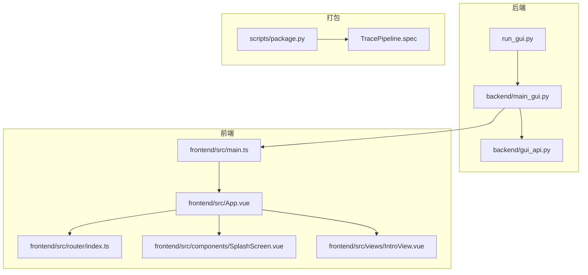
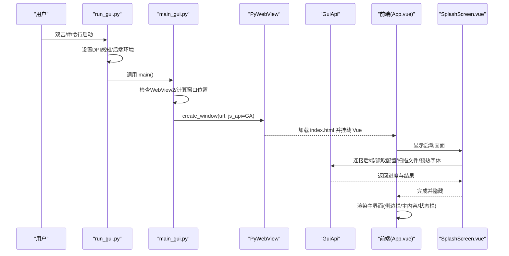
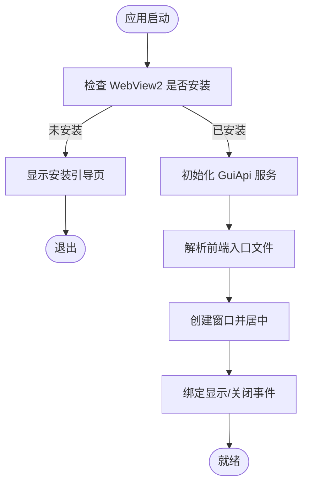
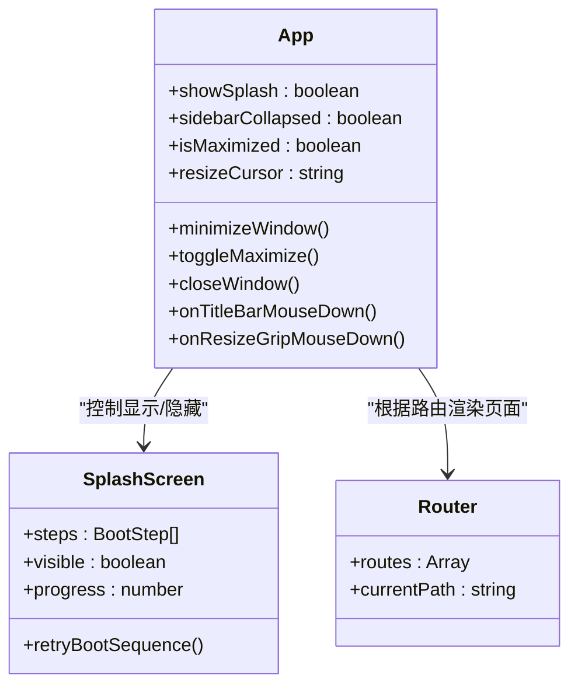
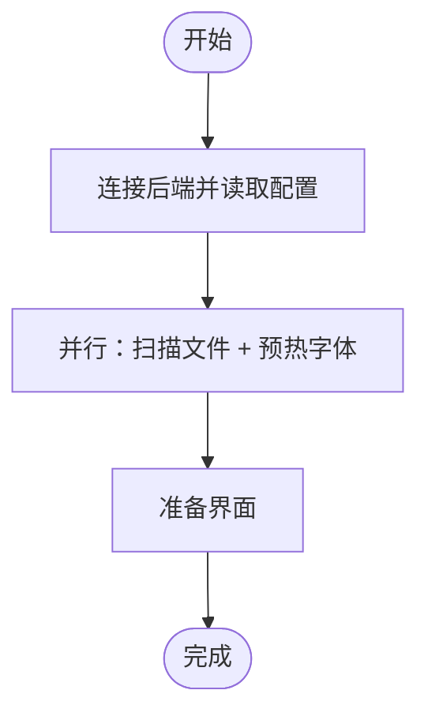
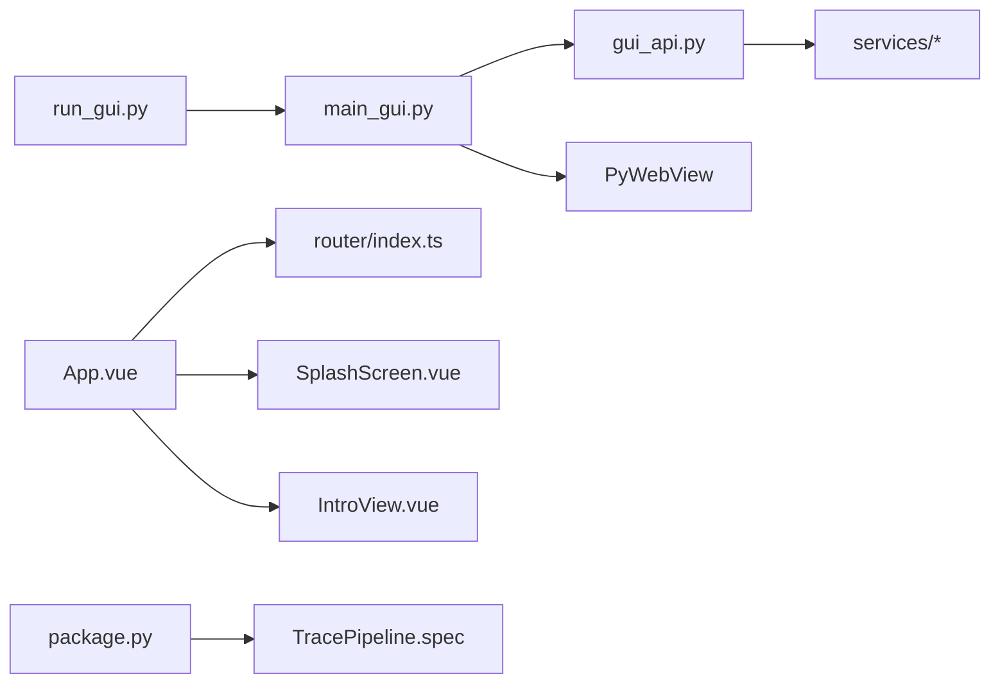

# 启动与界面概览

<cite>
**本文引用的文件**
- [run_gui.py](file://run_gui.py)
- [backend/main_gui.py](file://backend/main_gui.py)
- [backend/gui_api.py](file://backend/gui_api.py)
- [frontend/src/main.ts](file://frontend/src/main.ts)
- [frontend/src/App.vue](file://frontend/src/App.vue)
- [frontend/src/router/index.ts](file://frontend/src/router/index.ts)
- [frontend/src/components/SplashScreen.vue](file://frontend/src/components/SplashScreen.vue)
- [frontend/src/views/IntroView.vue](file://frontend/src/views/IntroView.vue)
- [TracePipeline.spec](file://TracePipeline.spec)
- [scripts/package.py](file://scripts/package.py)
</cite>

## 目录
1. [简介](#简介)
2. [项目结构](#项目结构)
3. [核心组件](#核心组件)
4. [架构总览](#架构总览)
5. [详细组件分析](#详细组件分析)
6. [依赖关系分析](#依赖关系分析)
7. [性能考虑](#性能考虑)
8. [故障排查指南](#故障排查指南)
9. [结论](#结论)
10. [附录：首次使用导览与基本操作](#附录首次使用导览与基本操作)

## 简介
本文件面向 TracePipeline GUI 应用的用户与维护者，系统说明应用的多种启动方式、启动流程与初始化过程，并全面介绍主界面的布局结构与窗口管理能力。文档同时提供首次使用的界面导览和基本操作提示，帮助用户快速上手。

## 项目结构
TracePipeline 采用“后端 Python + 前端 Vue”的桌面应用架构：
- 后端通过 PyWebView 承载前端静态资源，并提供 JS API 供前端调用。
- 前端基于 Vue 3 + Element Plus 构建，包含启动画面、侧边导航、主内容区与状态栏等。
- 打包脚本负责前端构建、PyInstaller 打包以及生成安装版与便携版。

图表来源
- [run_gui.py:1-60](file://run_gui.py#L1-L60)
- [backend/main_gui.py:81-206](file://backend/main_gui.py#L81-L206)
- [backend/gui_api.py:52-110](file://backend/gui_api.py#L52-L110)
- [frontend/src/main.ts:1-88](file://frontend/src/main.ts#L1-L88)
- [frontend/src/App.vue:1-140](file://frontend/src/App.vue#L1-L140)
- [frontend/src/router/index.ts:1-26](file://frontend/src/router/index.ts#L1-L26)
- [frontend/src/components/SplashScreen.vue:104-199](file://frontend/src/components/SplashScreen.vue#L104-L199)
- [frontend/src/views/IntroView.vue:78-136](file://frontend/src/views/IntroView.vue#L78-L136)
- [TracePipeline.spec:1-150](file://TracePipeline.spec#L1-L150)
- [scripts/package.py:281-352](file://scripts/package.py#L281-L352)

章节来源
- [run_gui.py:1-60](file://run_gui.py#L1-L60)
- [backend/main_gui.py:81-206](file://backend/main_gui.py#L81-L206)
- [frontend/src/main.ts:1-88](file://frontend/src/main.ts#L1-L88)
- [frontend/src/App.vue:1-140](file://frontend/src/App.vue#L1-L140)
- [frontend/src/router/index.ts:1-26](file://frontend/src/router/index.ts#L1-L26)
- [TracePipeline.spec:1-150](file://TracePipeline.spec#L1-L150)
- [scripts/package.py:281-352](file://scripts/package.py#L281-L352)

## 核心组件
- 启动入口（Python）：设置 DPI 感知、强制非交互 Matplotlib 后端、确保工作目录与路径可用，随后进入 GUI 主循环。
- GUI 主程序（PyWebView）：检查 WebView2 运行时、创建窗口、绑定 JS API、注册窗口事件、居中显示。
- JS API 层（GuiApi）：暴露配置、文件扫描、流水线执行、预览、统计、报告、日志等能力给前端。
- 前端应用（Vue）：加载全局样式与 UI 库、挂载根组件、路由与状态管理、启动画面与主界面布局。
- 打包脚本：构建前端、生成 PyInstaller 规格、输出独立程序文件夹、安装器与便携版。

章节来源
- [run_gui.py:23-46](file://run_gui.py#L23-L46)
- [backend/main_gui.py:81-206](file://backend/main_gui.py#L81-L206)
- [backend/gui_api.py:52-110](file://backend/gui_api.py#L52-L110)
- [frontend/src/main.ts:41-88](file://frontend/src/main.ts#L41-L88)
- [scripts/package.py:281-352](file://scripts/package.py#L281-L352)

## 架构总览
下图展示从双击运行到界面渲染的关键调用链与数据流。

图表来源
- [run_gui.py:23-46](file://run_gui.py#L23-L46)
- [backend/main_gui.py:81-206](file://backend/main_gui.py#L81-L206)
- [backend/gui_api.py:52-110](file://backend/gui_api.py#L52-L110)
- [frontend/src/App.vue:143-195](file://frontend/src/App.vue#L143-L195)
- [frontend/src/components/SplashScreen.vue:104-199](file://frontend/src/components/SplashScreen.vue#L104-L199)

## 详细组件分析

### 启动方式与入口
- 双击运行：直接执行打包后的可执行程序或 run_gui.py。
- 命令行启动：在开发环境中通过 Python 解释器运行入口脚本。
- 打包后运行：通过 PyInstaller 生成的独立程序文件夹中的可执行文件或安装程序/便携版。

关键要点
- 启动前设置 DPI 感知，确保多显示器与高 DPI 下尺寸正确。
- 强制 Matplotlib 使用 Agg 后端，避免后台线程绘图触发 Tkinter。
- 确保项目根目录加入 Python 路径，便于相对导入与资源定位。

章节来源
- [run_gui.py:23-46](file://run_gui.py#L23-L46)
- [run_gui.py:40-60](file://run_gui.py#L40-L60)

### 应用启动流程与初始化
- 检查 WebView2 Runtime：未安装时弹出引导页面，阻止后续服务初始化以节省时间。
- 初始化 GuiApi：预加载安全校验、配置、文件扫描、日志等服务；按需懒加载流水线、预览、统计、数据、报告、审计服务。
- 确定前端入口：优先使用打包产物中的 index.html，否则回退至静态目录。
- 创建窗口：默认尺寸 1400x900，最小尺寸 1000x600，居中显示，绑定 JS API。
- 窗口事件：显示后再次强制居中；关闭前优雅等待流水线结束，避免文件损坏。

图表来源
- [backend/main_gui.py:97-133](file://backend/main_gui.py#L97-L133)
- [backend/main_gui.py:135-206](file://backend/main_gui.py#L135-L206)
- [backend/gui_api.py:52-110](file://backend/gui_api.py#L52-L110)

章节来源
- [backend/main_gui.py:97-206](file://backend/main_gui.py#L97-L206)
- [backend/gui_api.py:52-110](file://backend/gui_api.py#L52-L110)

### 主界面布局与功能
- 自定义标题栏：支持最小化、最大化/还原、关闭按钮，支持拖拽移动窗口。
- 左侧导航栏：Logo 与版本信息、菜单项（首页、处理、统计、对比、数据、配置），支持折叠与展开。
- 主内容区域：基于路由动态渲染页面，启用 KeepAlive 提升切换性能。
- 状态栏：显示处理状态、选中文件数、输入/输出目录路径（点击复制）、最近操作时间。
- 右下角调整手柄：拖拽调整窗口大小，边缘检测实现全向缩放。

图表来源
- [frontend/src/App.vue:1-140](file://frontend/src/App.vue#L1-140)
- [frontend/src/App.vue:143-486](file://frontend/src/App.vue#L143-L486)
- [frontend/src/components/SplashScreen.vue:104-199](file://frontend/src/components/SplashScreen.vue#L104-L199)
- [frontend/src/router/index.ts:1-26](file://frontend/src/router/index.ts#L1-L26)

章节来源
- [frontend/src/App.vue:1-140](file://frontend/src/App.vue#L1-L140)
- [frontend/src/App.vue:143-486](file://frontend/src/App.vue#L143-L486)
- [frontend/src/router/index.ts:1-26](file://frontend/src/router/index.ts#L1-L26)

### 窗口管理与多显示器/DPI适配
- DPI 感知：在进程启动阶段设置 Per-Monitor V2，使各显示器按物理像素正确渲染。
- 屏幕尺寸获取：优先使用系统 API，失败则降级到 tkinter，最终回退到默认分辨率。
- 窗口居中：根据屏幕尺寸与窗口尺寸计算居中坐标，并在显示后再次强制居中。
- 窗口控制：最小化、最大化/还原、关闭；拖拽移动与边缘缩放；右下角手柄缩放。
- 最小尺寸限制：防止窗口过小导致不可用。

章节来源
- [run_gui.py:23-33](file://run_gui.py#L23-L33)
- [backend/main_gui.py:13-61](file://backend/main_gui.py#L13-L61)
- [backend/main_gui.py:148-184](file://backend/main_gui.py#L148-L184)
- [frontend/src/App.vue:245-486](file://frontend/src/App.vue#L245-L486)

### 启动画面与并行初始化
- 启动步骤：连接后端服务、读取配置、扫描文件、预热字体、准备界面。
- 并行优化：文件扫描与字体预热并行执行，减少整体启动耗时。
- 错误容错：部分步骤失败不阻塞启动，进入页面后自动重试。
- 进度动画：平滑推进目标进度，支持最小展示时间与重试机制。

图表来源
- [frontend/src/App.vue:488-536](file://frontend/src/App.vue#L488-L536)
- [frontend/src/components/SplashScreen.vue:104-199](file://frontend/src/components/SplashScreen.vue#L104-L199)

章节来源
- [frontend/src/App.vue:488-536](file://frontend/src/App.vue#L488-L536)
- [frontend/src/components/SplashScreen.vue:104-199](file://frontend/src/components/SplashScreen.vue#L104-L199)

### 打包与分发
- 前端构建：npm install 与 npm run build 产出静态资源。
- PyInstaller 打包：依据规格文件将 Python 与前端资源打包为独立程序文件夹。
- 安装程序：Inno Setup 生成安装包，支持语言选择与快捷方式。
- 便携版：7-Zip SFX 自解压程序，解压即运行。

章节来源
- [scripts/package.py:281-352](file://scripts/package.py#L281-L352)
- [TracePipeline.spec:1-150](file://TracePipeline.spec#L1-L150)

## 依赖关系分析
- 后端依赖：PyWebView、PIL、matplotlib（Agg 后端）、trace_pipeline 内部服务模块。
- 前端依赖：Vue 3、Element Plus、Pinia、Vue Router、Lucide 图标。
- 打包依赖：PyInstaller、Inno Setup 6、7-Zip（可选）。

图表来源
- [run_gui.py:40-46](file://run_gui.py#L40-L46)
- [backend/main_gui.py:66-78](file://backend/main_gui.py#L66-L78)
- [backend/gui_api.py:23-35](file://backend/gui_api.py#L23-L35)
- [frontend/src/App.vue:143-162](file://frontend/src/App.vue#L143-L162)
- [scripts/package.py:306-352](file://scripts/package.py#L306-L352)

章节来源
- [backend/gui_api.py:23-35](file://backend/gui_api.py#L23-L35)
- [frontend/src/App.vue:143-162](file://frontend/src/App.vue#L143-L162)
- [scripts/package.py:306-352](file://scripts/package.py#L306-L352)

## 性能考虑
- 启动阶段并行化：文件扫描与字体预热并行，缩短冷启动时间。
- 懒加载服务：重资源服务按需实例化，降低初始内存占用。
- 图片缓存：TTL 缓存限制数量与过期时间，避免重复生成大图。
- 窗口渲染：Per-Monitor V2 DPI 感知减少重绘与错位问题。

[本节为通用指导，无需具体文件引用]

## 故障排查指南
- WebView2 未安装：启动时会弹出引导页面，请按照链接下载并安装后重启应用。
- 启动失败弹窗：若出现“启动失败”提示，请检查配置文件与环境变量，查看日志目录。
- 窗口无法拖动/缩放：确认未处于最大化状态；尝试重新打开应用。
- 前端资源缺失：确认打包产物中 backend/static/index.html 存在，或重新执行打包脚本。

章节来源
- [backend/main_gui.py:97-133](file://backend/main_gui.py#L97-L133)
- [run_gui.py:44-60](file://run_gui.py#L44-L60)
- [scripts/package.py:281-352](file://scripts/package.py#L281-L352)

## 结论
TracePipeline GUI 通过清晰的启动流程、完善的窗口管理与友好的启动画面，提供了稳定高效的桌面体验。结合模块化服务与并行初始化策略，在保证功能完整性的同时兼顾了性能与可维护性。

[本节为总结，无需具体文件引用]

## 附录：首次使用导览与基本操作
- 首次启动：双击可执行程序或运行入口脚本，等待启动画面完成。
- 选择数据：在“处理”页面扫描并选择露头 Excel 文件，配置处理参数。
- 运行处理：点击运行，观察状态栏“处理中/完成/出错”状态变化。
- 查看结果：进入“统计”、“对比”或“数据”页面浏览图表与表格。
- 导出报告：在相应页面生成 Word/PDF 报告，并可保存到指定目录。
- 窗口操作：拖拽标题栏移动窗口；拖拽边缘或右下角手柄调整大小；最小化/最大化/关闭。
- 目录访问：侧边栏底部提供“打开输入目录/输出目录/日志目录”快捷按钮。
- 开发者模式：侧边栏底部开关开启后可使用调试面板与更多选项。

章节来源
- [frontend/src/views/IntroView.vue:78-136](file://frontend/src/views/IntroView.vue#L78-L136)
- [frontend/src/App.vue:66-84](file://frontend/src/App.vue#L66-L84)
- [frontend/src/App.vue:97-128](file://frontend/src/App.vue#L97-L128)