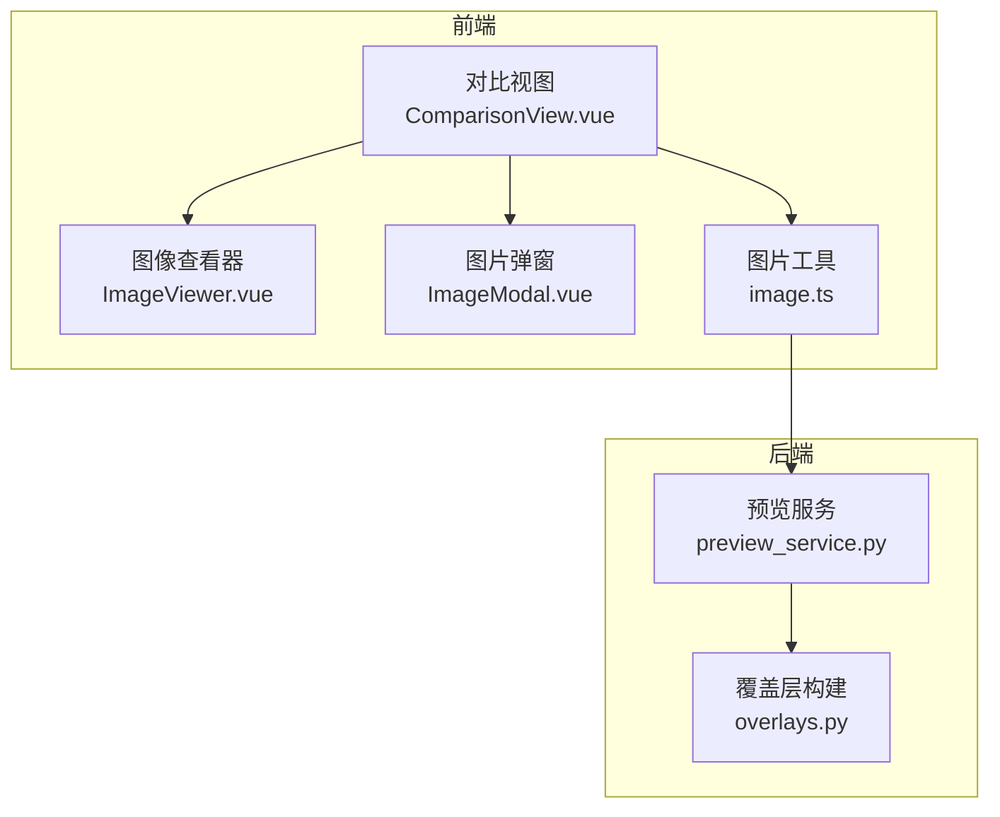
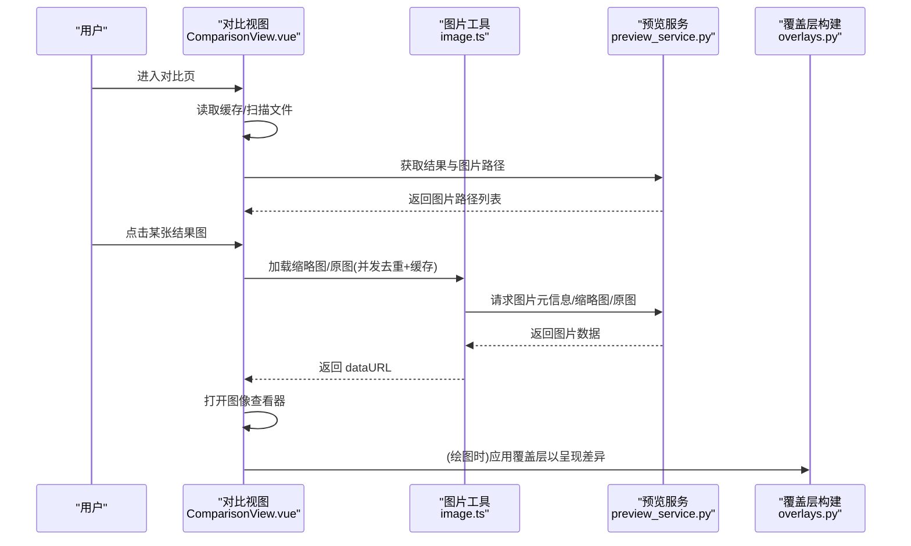
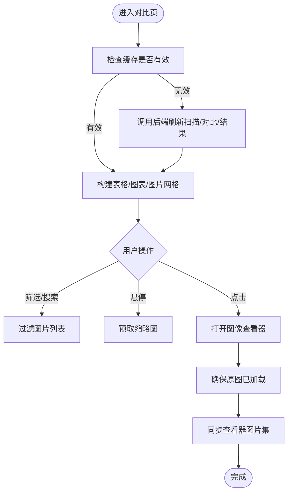
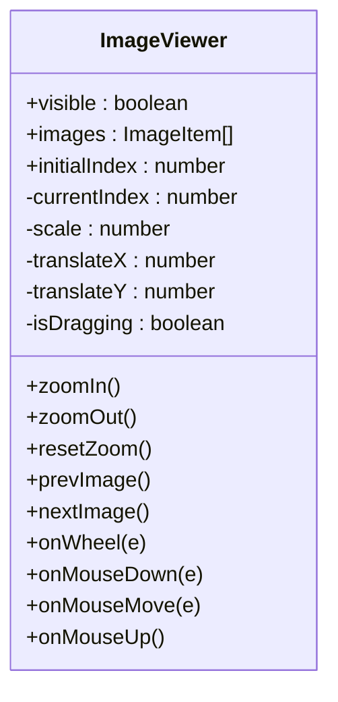
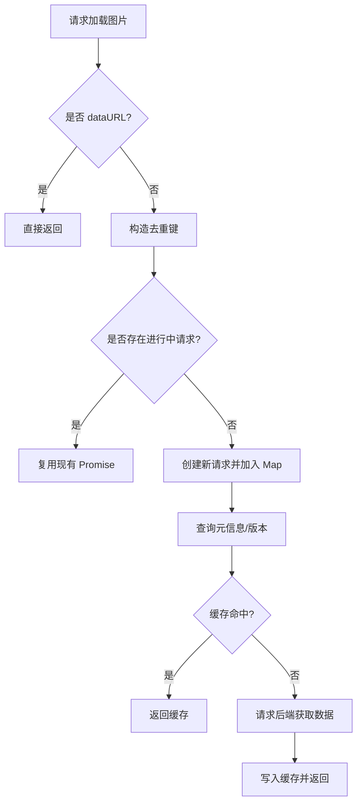
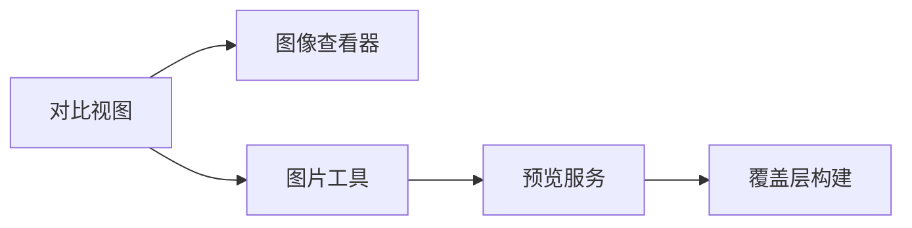

# 对比分析页面

<cite>
**本文引用的文件**   
- [ComparisonView.vue](file://frontend/src/views/ComparisonView.vue)
- [ImageViewer.vue](file://frontend/src/components/ImageViewer.vue)
- [ImageModal.vue](file://frontend/src/components/ImageModal.vue)
- [image.ts](file://frontend/src/utils/image.ts)
- [preview_service.py](file://backend/services/preview_service.py)
- [overlays.py](file://trace_pipeline/plotting/overlays.py)
</cite>

## 目录
1. [简介](#简介)
2. [项目结构](#项目结构)
3. [核心组件](#核心组件)
4. [架构总览](#架构总览)
5. [详细组件分析](#详细组件分析)
6. [依赖关系分析](#依赖关系分析)
7. [性能与体验优化](#性能与体验优化)
8. [故障排查指南](#故障排查指南)
9. [结论](#结论)
10. [附录：操作手册](#附录操作手册)

## 简介
本指南面向使用“对比分析”页面的用户，聚焦多图对比功能、图像查看器交互、典型应用场景以及结果差异的量化分析方法。通过该页面，用户可以：
- 加载多个处理结果进行并排或叠加显示（网格浏览与全屏查看）
- 使用图像查看器进行缩放、平移等交互
- 基于表格与图表对多露头参数进行对比
- 结合后端服务与覆盖层能力理解可视化差异来源

## 项目结构
对比分析页面由前端视图、图片查看器、图片加载工具与后端预览服务共同构成。关键文件职责如下：
- 对比视图：聚合数据、图表与图片网格，驱动加载流程与缓存策略
- 图像查看器：提供全屏查看、缩放、平移、翻页等交互
- 图片工具：负责缩略图与原图的并发去重加载与缓存
- 后端预览服务：生成样式预览图（用于预览配置效果）
- 覆盖层构建：为绘图提供圆窗、凸包、节点等几何覆盖物

图示来源
- [ComparisonView.vue:1-120](file://frontend/src/views/ComparisonView.vue#L1-L120)
- [ImageViewer.vue:1-120](file://frontend/src/components/ImageViewer.vue#L1-L120)
- [image.ts:1-113](file://frontend/src/utils/image.ts#L1-L113)
- [preview_service.py:1-167](file://backend/services/preview_service.py#L1-L167)
- [overlays.py:1-156](file://trace_pipeline/plotting/overlays.py#L1-L156)

章节来源
- [ComparisonView.vue:1-120](file://frontend/src/views/ComparisonView.vue#L1-L120)
- [ImageViewer.vue:1-120](file://frontend/src/components/ImageViewer.vue#L1-L120)
- [image.ts:1-113](file://frontend/src/utils/image.ts#L1-L113)
- [preview_service.py:1-167](file://backend/services/preview_service.py#L1-L167)
- [overlays.py:1-156](file://trace_pipeline/plotting/overlays.py#L1-L156)

## 核心组件
- 对比视图（ComparisonView.vue）
  - 汇总多露头统计指标，渲染对比表格与柱状图
  - 展示所有露头的处理结果图网格，支持筛选与搜索
  - 打开图像查看器，预取相邻图片以提升体验
- 图像查看器（ImageViewer.vue）
  - 全屏查看，支持缩放、平移、键盘导航与轮询节流
- 图片工具（image.ts）
  - 并发去重加载原图与缩略图，按版本缓存避免重复请求
- 预览服务（preview_service.py）
  - 基于固定演示数据生成样式预览图，带 TTL 缓存
- 覆盖层构建（overlays.py）
  - 将统计与节点分析结果转换为绘图覆盖层（圆窗、凸包、节点）

章节来源
- [ComparisonView.vue:120-494](file://frontend/src/views/ComparisonView.vue#L120-L494)
- [ImageViewer.vue:70-236](file://frontend/src/components/ImageViewer.vue#L70-L236)
- [image.ts:1-113](file://frontend/src/utils/image.ts#L1-L113)
- [preview_service.py:37-167](file://backend/services/preview_service.py#L37-L167)
- [overlays.py:33-156](file://trace_pipeline/plotting/overlays.py#L33-L156)

## 架构总览
对比分析的数据流从前端视图发起，经图片工具与后端服务完成加载与渲染；覆盖层在绘图阶段参与可视化差异表达。

图示来源
- [ComparisonView.vue:386-494](file://frontend/src/views/ComparisonView.vue#L386-L494)
- [image.ts:21-113](file://frontend/src/utils/image.ts#L21-L113)
- [preview_service.py:45-167](file://backend/services/preview_service.py#L45-L167)
- [overlays.py:33-156](file://trace_pipeline/plotting/overlays.py#L33-L156)

## 详细组件分析

### 对比视图（ComparisonView.vue）
- 数据加载与缓存
  - 首次进入时尝试从缓存读取扫描结果与对比数据，否则调用后端接口刷新
  - 结果图片仅保存路径，按需懒加载缩略图，避免一次性 base64 占用内存
- 图表与表格
  - 表格展示各露头的关键指标（迹线数、密度指标、类型比例、节点相关指标等）
  - 柱状图支持切换不同度量维度（密度指标、裂隙类型、节点指标、面积/长度）
- 图片网格与筛选
  - 支持按图片类型筛选（原始迹线、旋转迹线、走向玫瑰），并可按露头名称搜索
  - 悬停触发缩略图加载，点击打开全屏查看
- 图像查看器联动
  - 打开前确保当前图缩略图与原图已就绪，同步更新查看器图片集
  - 打开后预取相邻图片，提升翻页体验

图示来源
- [ComparisonView.vue:386-494](file://frontend/src/views/ComparisonView.vue#L386-L494)
- [ComparisonView.vue:149-170](file://frontend/src/views/ComparisonView.vue#L149-L170)
- [ComparisonView.vue:218-286](file://frontend/src/views/ComparisonView.vue#L218-L286)

章节来源
- [ComparisonView.vue:1-120](file://frontend/src/views/ComparisonView.vue#L1-L120)
- [ComparisonView.vue:149-170](file://frontend/src/views/ComparisonView.vue#L149-L170)
- [ComparisonView.vue:218-286](file://frontend/src/views/ComparisonView.vue#L218-L286)
- [ComparisonView.vue:386-494](file://frontend/src/views/ComparisonView.vue#L386-L494)

### 图像查看器（ImageViewer.vue）
- 交互能力
  - 缩放：按钮放大/缩小，滚轮缩放（带节流）
  - 平移：仅在放大状态下可拖拽平移
  - 导航：左右箭头或键盘方向键切换图片，Esc 关闭
  - 重置：一键恢复缩放与平移状态
- 实现要点
  - 使用 transform 组合 translate 与 scale，拖动时禁用过渡以提升流畅度
  - 监听窗口 keydown，打开时注册、卸载时移除事件，避免泄漏

图示来源
- [ImageViewer.vue:70-236](file://frontend/src/components/ImageViewer.vue#L70-L236)

章节来源
- [ImageViewer.vue:1-236](file://frontend/src/components/ImageViewer.vue#L1-L236)

### 图片工具（image.ts）
- 并发去重
  - 同一资源同时发起多次加载时，复用 Promise，避免重复 IO
- 版本化缓存
  - 根据文件 mtime 与 size 计算版本，命中缓存则直接返回
- 缩略图与原图分离
  - 网格预览优先使用缩略图，全屏查看再加载原图，降低内存峰值

图示来源
- [image.ts:1-113](file://frontend/src/utils/image.ts#L1-L113)

章节来源
- [image.ts:1-113](file://frontend/src/utils/image.ts#L1-L113)

### 预览服务（preview_service.py）
- 作用
  - 使用固定演示数据生成样式预览图（原始迹线图、旋转迹线图、走向玫瑰图）
  - 基于配置哈希与 TTL 缓存，减少重复生成开销
- 输出
  - 返回图片路径集合，供前端按需加载

章节来源
- [preview_service.py:37-167](file://backend/services/preview_service.py#L37-L167)

### 覆盖层构建（overlays.py）
- 作用
  - 将统计诊断与节点分析结果转换为绘图覆盖层（圆窗、凸包、节点）
  - 支持原始坐标系与测线坐标系之间的变换，保证叠加一致性
- 意义
  - 为可视化差异检测提供几何基础（如圆窗位置/半径变化、节点分布差异）

章节来源
- [overlays.py:33-156](file://trace_pipeline/plotting/overlays.py#L33-L156)

## 依赖关系分析
- 组件耦合
  - 对比视图依赖图片工具与图像查看器，形成“数据→视图→交互”的清晰分层
  - 图片工具依赖后端 API 与缓存存储，屏蔽底层 IO 细节
  - 预览服务与覆盖层构建属于后端支撑模块，解耦于 UI 逻辑
- 外部依赖
  - 前端使用 ECharts 渲染对比图表
  - 后端使用文件系统与缓存机制管理图片资源

图示来源
- [ComparisonView.vue:120-494](file://frontend/src/views/ComparisonView.vue#L120-L494)
- [image.ts:1-113](file://frontend/src/utils/image.ts#L1-L113)
- [preview_service.py:37-167](file://backend/services/preview_service.py#L37-L167)
- [overlays.py:33-156](file://trace_pipeline/plotting/overlays.py#L33-L156)

章节来源
- [ComparisonView.vue:120-494](file://frontend/src/views/ComparisonView.vue#L120-L494)
- [image.ts:1-113](file://frontend/src/utils/image.ts#L1-L113)
- [preview_service.py:37-167](file://backend/services/preview_service.py#L37-L167)
- [overlays.py:33-156](file://trace_pipeline/plotting/overlays.py#L33-L156)

## 性能与体验优化
- 图片加载
  - 缩略图优先：网格仅加载缩略图，全屏查看再加载原图
  - 并发控制：限制同时进行的图片加载数量，避免阻塞主线程
  - 并发去重：相同资源的并行请求合并，减少冗余 IO
  - 版本缓存：基于文件元信息（mtime/size）的缓存键，避免重复下载
- 渲染性能
  - 图表初始化时设置合适的 devicePixelRatio，提升清晰度
  - 查看器拖动时禁用 CSS transition，提高响应性
- 用户体验
  - 预取相邻图片，减少翻页等待
  - 滚动节流，防止频繁缩放造成卡顿

[本节为通用指导，不直接分析具体文件]

## 故障排查指南
- 对比页加载失败
  - 现象：提示“对比页加载失败”
  - 可能原因：后端接口异常、缓存失效、图片路径不可用
  - 建议：检查网络与后端日志，确认扫描/对比/结果接口可用；必要时强制刷新
- 图片未显示或加载缓慢
  - 现象：网格占位符长时间显示“悬停加载预览”或“缩略图生成中”
  - 可能原因：图片过大、IO 瓶颈、并发队列拥堵
  - 建议：观察并发加载槽位使用情况，适当调整最大像素阈值；确认后端缩略图生成正常
- 全屏查看无内容
  - 现象：全屏查看空白或加载中
  - 可能原因：原图未成功加载、路径错误
  - 建议：检查原图加载链路（元信息→原图数据），确认缓存命中情况

章节来源
- [ComparisonView.vue:471-478](file://frontend/src/views/ComparisonView.vue#L471-L478)
- [image.ts:54-68](file://frontend/src/utils/image.ts#L54-L68)
- [image.ts:103-112](file://frontend/src/utils/image.ts#L103-L112)

## 结论
对比分析页面通过“数据聚合—图表对比—图片网格—全屏查看”的完整链路，帮助用户在多露头场景下快速定位差异、评估参数影响。配合图片工具的并发去重与版本缓存，以及预览服务与覆盖层构建的后端支撑，整体具备良好的性能与可扩展性。

[本节为总结性内容，不直接分析具体文件]

## 附录：操作手册

### 多图对比功能
- 加载多个处理结果
  - 进入对比页后自动扫描并汇总多露头参数；若缓存失效将自动刷新
  - 结果图以网格形式展示，支持按类型筛选与关键字搜索
- 并排或叠加显示
  - 并排：在网格中横向浏览不同露头的同类结果图
  - 叠加：全屏查看单张图片，结合覆盖层（圆窗、凸包、节点）理解差异来源

章节来源
- [ComparisonView.vue:386-494](file://frontend/src/views/ComparisonView.vue#L386-L494)
- [ComparisonView.vue:64-101](file://frontend/src/views/ComparisonView.vue#L64-L101)

### 图像查看器使用方法
- 缩放
  - 使用顶部工具栏的放大/缩小按钮，或使用鼠标滚轮缩放
- 平移
  - 当缩放大于 100% 时，按住鼠标左键拖动图片进行平移
- 测量工具
  - 当前查看器未内置测量工具；如需定量测量，请导出图片至专业图像处理软件
- 标注功能
  - 当前查看器未内置标注功能；建议在外部工具中进行标注与批注
- 导航
  - 使用左右箭头或键盘方向键切换图片，Esc 关闭查看器

章节来源
- [ImageViewer.vue:138-236](file://frontend/src/components/ImageViewer.vue#L138-L236)

### 典型应用场景
- 不同处理参数结果的比较
  - 通过对比表格与柱状图直观评估参数变化对密度指标、类型比例、节点指标的影响
- 不同露头数据的对比分析
  - 利用图片网格与全屏查看，对比原始迹线与旋转迹线的形态差异，结合走向玫瑰图验证方向性特征

章节来源
- [ComparisonView.vue:21-61](file://frontend/src/views/ComparisonView.vue#L21-L61)
- [ComparisonView.vue:64-101](file://frontend/src/views/ComparisonView.vue#L64-L101)

### 结果差异的量化分析方法
- 数值对比
  - 关注 P10/P20/P21、平均迹长、节点密度等指标的变化趋势
  - 使用图表图例控制显示/隐藏，聚焦关键维度
- 可视化差异检测
  - 借助覆盖层（圆窗、凸包、节点）识别空间分布差异
  - 对比原始与旋转坐标系下的覆盖层一致性，辅助判断坐标变换正确性

章节来源
- [ComparisonView.vue:308-381](file://frontend/src/views/ComparisonView.vue#L308-L381)
- [overlays.py:33-156](file://trace_pipeline/plotting/overlays.py#L33-L156)