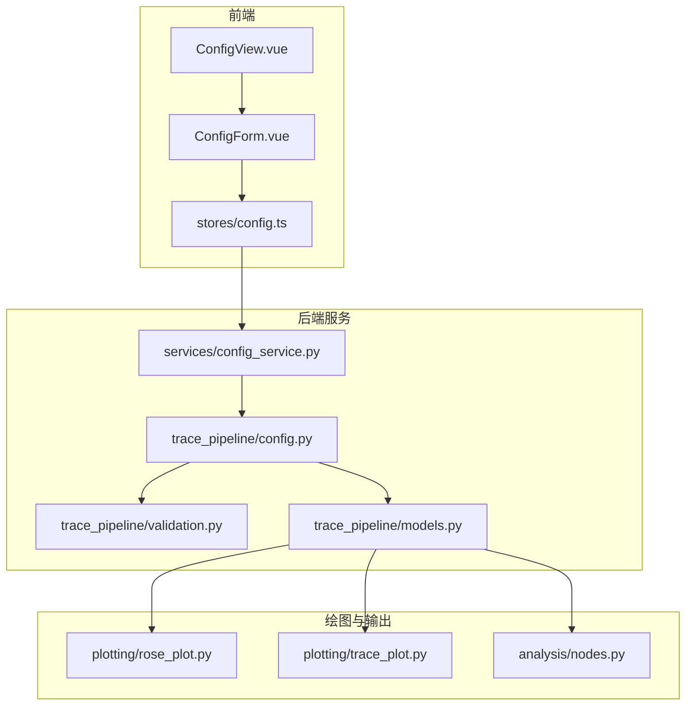
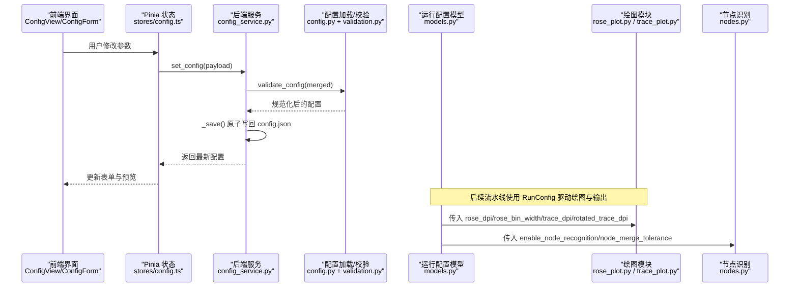
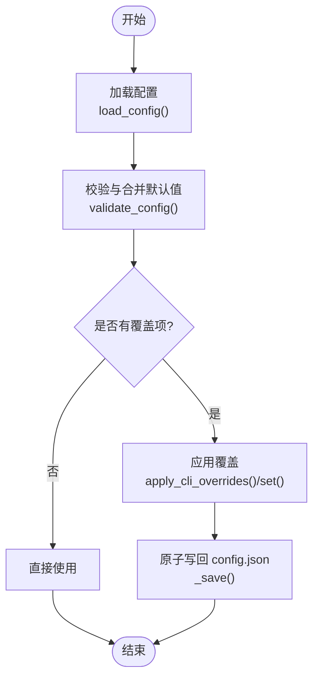
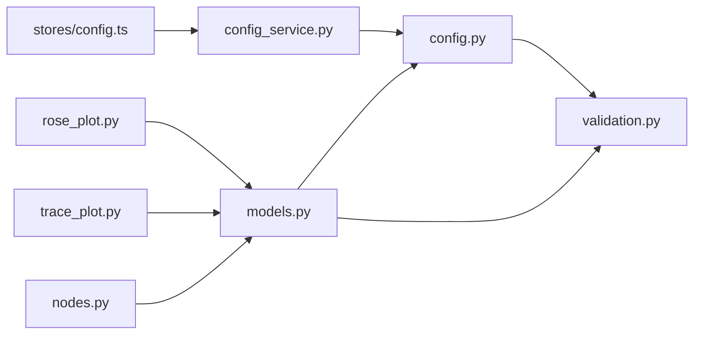

# 处理参数配置

<cite>
**本文引用的文件**   
- [config.example.json](file://config.example.json)
- [trace_pipeline/config.py](file://trace_pipeline/config.py)
- [backend/services/config_service.py](file://backend/services/config_service.py)
- [frontend/src/stores/config.ts](file://frontend/src/stores/config.ts)
- [frontend/src/views/ConfigView.vue](file://frontend/src/views/ConfigView.vue)
- [frontend/src/components/ConfigForm.vue](file://frontend/src/components/ConfigForm.vue)
- [trace_pipeline/models.py](file://trace_pipeline/models.py)
- [trace_pipeline/validation.py](file://trace_pipeline/validation.py)
- [trace_pipeline/plotting/rose_plot.py](file://trace_pipeline/plotting/rose_plot.py)
- [trace_pipeline/plotting/trace_plot.py](file://trace_pipeline/plotting/trace_plot.py)
- [trace_pipeline/analysis/nodes.py](file://trace_pipeline/analysis/nodes.py)
</cite>

## 目录
1. [简介](#简介)
2. [项目结构](#项目结构)
3. [核心组件](#核心组件)
4. [架构总览](#架构总览)
5. [详细组件分析](#详细组件分析)
6. [依赖关系分析](#依赖关系分析)
7. [性能与质量权衡](#性能与质量权衡)
8. [故障排查指南](#故障排查指南)
9. [结论](#结论)
10. [附录：常用参数组合建议](#附录常用参数组合建议)

## 简介
本指南聚焦“处理参数配置”的使用说明，覆盖以下关键主题：
- 玫瑰图导出开关的作用、生成场景与输出位置
- 玫瑰图 DPI 设置（200/300/400/600）对图像质量与文件大小的影响
- 分箱宽度设置（5°/10°/15°/20°/30°）对统计精度与适用场景的影响
- 原始迹线图 DPI（150/200/300/400/600）与旋转迹线图 DPI（300/400/600/800）的区别与建议
- 节点识别功能启用选项及 I/Y/X 型拓扑节点的自动识别效果与计算开销
- 参数的保存机制：本地持久化、全局配置同步、默认值管理
- 常用参数组合的最佳实践建议

## 项目结构
与“处理参数配置”相关的代码主要分布在后端服务、配置加载与校验、前端状态管理与视图、绘图模块以及节点识别模块中。下图展示了从前端到后端再到绘图与输出的整体流程。

**图表来源** 
- [frontend/src/views/ConfigView.vue:1-302](file://frontend/src/views/ConfigView.vue#L1-L302)
- [frontend/src/components/ConfigForm.vue:1-411](file://frontend/src/components/ConfigForm.vue#L1-L411)
- [frontend/src/stores/config.ts:1-80](file://frontend/src/stores/config.ts#L1-L80)
- [backend/services/config_service.py:1-144](file://backend/services/config_service.py#L1-L144)
- [trace_pipeline/config.py:1-326](file://trace_pipeline/config.py#L1-L326)
- [trace_pipeline/validation.py:1-112](file://trace_pipeline/validation.py#L1-L112)
- [trace_pipeline/models.py:1-352](file://trace_pipeline/models.py#L1-L352)
- [trace_pipeline/plotting/rose_plot.py:1-140](file://trace_pipeline/plotting/rose_plot.py#L1-L140)
- [trace_pipeline/plotting/trace_plot.py:1-565](file://trace_pipeline/plotting/trace_plot.py#L1-L565)
- [trace_pipeline/analysis/nodes.py:1-417](file://trace_pipeline/analysis/nodes.py#L1-L417)

**章节来源**
- [trace_pipeline/config.py:1-326](file://trace_pipeline/config.py#L1-L326)
- [backend/services/config_service.py:1-144](file://backend/services/config_service.py#L1-L144)
- [frontend/src/stores/config.ts:1-80](file://frontend/src/stores/config.ts#L1-L80)
- [frontend/src/views/ConfigView.vue:1-302](file://frontend/src/views/ConfigView.vue#L1-L302)
- [frontend/src/components/ConfigForm.vue:1-411](file://frontend/src/components/ConfigForm.vue#L1-L411)

## 核心组件
本节梳理与“处理参数配置”直接相关的关键组件及其职责：
- 配置模板与默认值：提供示例配置与默认字段集合，便于用户快速上手
- 配置加载与校验：负责读取 JSON、合并默认值、类型强制转换与必填项检查
- 配置服务：作为 config.json 的唯一写入入口，提供原子写回、重置与局部重置能力
- 运行配置模型：将配置映射为不可变的数据类，供流水线使用
- 前端配置界面与状态：提供可视化编辑、导入/导出、自动保存路径等交互
- 绘图模块：根据配置渲染玫瑰图与迹线图，并控制 DPI 与分箱粒度
- 节点识别：基于几何接触关系识别 I/Y/X 型节点，受配置开关与容差控制

**章节来源**
- [config.example.json:1-26](file://config.example.json#L1-L26)
- [trace_pipeline/config.py:56-79](file://trace_pipeline/config.py#L56-L79)
- [trace_pipeline/config.py:86-145](file://trace_pipeline/config.py#L86-L145)
- [trace_pipeline/validation.py:90-112](file://trace_pipeline/validation.py#L90-L112)
- [backend/services/config_service.py:41-144](file://backend/services/config_service.py#L41-L144)
- [trace_pipeline/models.py:162-267](file://trace_pipeline/models.py#L162-L267)
- [frontend/src/stores/config.ts:14-71](file://frontend/src/stores/config.ts#L14-L71)
- [frontend/src/views/ConfigView.vue:62-233](file://frontend/src/views/ConfigView.vue#L62-L233)
- [frontend/src/components/ConfigForm.vue:174-244](file://frontend/src/components/ConfigForm.vue#L174-L244)
- [trace_pipeline/plotting/rose_plot.py:106-140](file://trace_pipeline/plotting/rose_plot.py#L106-L140)
- [trace_pipeline/plotting/trace_plot.py:443-565](file://trace_pipeline/plotting/trace_plot.py#L443-L565)
- [trace_pipeline/analysis/nodes.py:160-417](file://trace_pipeline/analysis/nodes.py#L160-L417)

## 架构总览
下图展示“处理参数配置”的端到端数据流：前端表单修改 → 状态存储 → 后端服务读写 → 配置校验与持久化 → 运行时模型装配 → 绘图与输出。

**图表来源** 
- [frontend/src/views/ConfigView.vue:62-233](file://frontend/src/views/ConfigView.vue#L62-L233)
- [frontend/src/components/ConfigForm.vue:174-244](file://frontend/src/components/ConfigForm.vue#L174-L244)
- [frontend/src/stores/config.ts:14-71](file://frontend/src/stores/config.ts#L14-L71)
- [backend/services/config_service.py:92-144](file://backend/services/config_service.py#L92-L144)
- [trace_pipeline/config.py:148-190](file://trace_pipeline/config.py#L148-L190)
- [trace_pipeline/validation.py:90-112](file://trace_pipeline/validation.py#L90-L112)
- [trace_pipeline/models.py:236-267](file://trace_pipeline/models.py#L236-L267)
- [trace_pipeline/plotting/rose_plot.py:106-140](file://trace_pipeline/plotting/rose_plot.py#L106-L140)
- [trace_pipeline/plotting/trace_plot.py:443-565](file://trace_pipeline/plotting/trace_plot.py#L443-L565)
- [trace_pipeline/analysis/nodes.py:160-417](file://trace_pipeline/analysis/nodes.py#L160-L417)

## 详细组件分析

### 玫瑰图导出开关（export_rose_plot）
- 作用与效果
  - 控制是否生成节理走向玫瑰花瓣图。开启后，在输出目录生成对应的玫瑰图文件；关闭则跳过该步骤。
- 生成走向玫瑰图的场景
  - 当 export_rose_plot 为真且存在有效走向角数据时，调用玫瑰图绘制函数进行渲染与保存。
- 输出位置
  - 由配置中的 output_dir 决定；文件名由流水线命名规则确定（通常包含前缀与表名）。
- 相关实现要点
  - 默认值为 false，可通过配置模板或前端界面修改
  - 绘图函数接收 bin_width 与 dpi 参数，用于控制分箱粒度与分辨率

**章节来源**
- [config.example.json:9-11](file://config.example.json#L9-L11)
- [trace_pipeline/config.py:63-65](file://trace_pipeline/config.py#L63-L65)
- [trace_pipeline/plotting/rose_plot.py:106-140](file://trace_pipeline/plotting/rose_plot.py#L106-L140)

### 玫瑰图 DPI 设置（rose_dpi）
- 可选值与影响
  - 支持 200/300/400/600 等常见 DPI。DPI 越高，图像越清晰，但文件体积越大，渲染时间更长。
  - 默认值为 600，适合出版级输出；若需兼顾速度与体积，可降至 300 或 200。
- 使用建议
  - 报告与论文插图：推荐 400–600
  - 在线预览或批量处理：推荐 200–300
- 实现要点
  - 通过校验器强制为正整数；绘图函数按指定 DPI 保存

**章节来源**
- [trace_pipeline/validation.py:93-95](file://trace_pipeline/validation.py#L93-L95)
- [trace_pipeline/plotting/rose_plot.py:120-139](file://trace_pipeline/plotting/rose_plot.py#L120-L139)

### 分箱宽度设置（rose_bin_width）
- 可选值与影响
  - 支持 5°/10°/15°/20°/30° 等。分箱越细（如 5°），统计细节更丰富，但噪声可能放大；分箱越粗（如 30°），趋势更平滑，但可能掩盖局部特征。
  - 取值范围限制在 (0, 180]，超出将被拒绝。
- 适用场景
  - 精细分布研究：5°–10°
  - 概览性分析：15°–30°
- 实现要点
  - 校验器强制为正数且在范围内；绘图函数据此计算柱体角度与宽度

**章节来源**
- [trace_pipeline/validation.py:79-87](file://trace_pipeline/validation.py#L79-L87)
- [trace_pipeline/plotting/rose_plot.py:76-103](file://trace_pipeline/plotting/rose_plot.py#L76-L103)

### 原始迹线图 DPI（trace_dpi）与旋转迹线图 DPI（rotated_trace_dpi）
- 区别
  - trace_dpi：原始迹线长度图分辨率，常用于记录与分析
  - rotated_trace_dpi：旋转后的迹线图分辨率，常用于叠加对比或出版排版
- 可选值与建议
  - 原始迹线图：150/200/300/400/600
  - 旋转迹线图：300/400/600/800
  - 高质量输出建议 400–600；旋转图因叠加需求可更高至 800
- 实现要点
  - 两者均经正整数校验；绘图函数分别以各自 DPI 渲染与保存

**章节来源**
- [trace_pipeline/validation.py:94-95](file://trace_pipeline/validation.py#L94-L95)
- [trace_pipeline/plotting/trace_plot.py:443-565](file://trace_pipeline/plotting/trace_plot.py#L443-L565)

### 节点识别功能（enable_node_recognition）
- 功能概述
  - 基于几何接触关系自动识别三类节点：I 型（孤立端点）、Y 型（三叉节点）、X 型（交叉节点）
- 效果与开销
  - 开启后将执行相交检测、端点接近检测与聚类合并，计算开销随迹线条数增长而显著增加
  - 可通过 node_merge_tolerance 控制聚类容差，平衡误检与漏检
- 使用建议
  - 小规模数据或交互式分析：可开启以获得拓扑信息
  - 大规模数据或仅关注统计：建议关闭以提升性能

**章节来源**
- [trace_pipeline/analysis/nodes.py:160-417](file://trace_pipeline/analysis/nodes.py#L160-L417)
- [trace_pipeline/models.py:197-200](file://trace_pipeline/models.py#L197-L200)

### 参数的保存机制
- 本地持久化
  - 所有处理参数变更通过 ConfigService 统一写回 config.json，采用临时文件替换策略保证原子性
- 全局配置同步
  - 前端 Pinia 状态在服务层 reload 后获取最新配置，避免并发覆盖
- 默认值管理
  - DEFAULT_CONFIG 定义默认值；validate_config 合并默认值并做类型强制与必填项检查
- 前端交互
  - 路径字段支持防抖自动保存；样式与处理参数支持手动保存与重置

**图表来源** 
- [trace_pipeline/config.py:86-145](file://trace_pipeline/config.py#L86-L145)
- [trace_pipeline/config.py:148-190](file://trace_pipeline/config.py#L148-L190)
- [backend/services/config_service.py:92-144](file://backend/services/config_service.py#L92-L144)

**章节来源**
- [backend/services/config_service.py:41-144](file://backend/services/config_service.py#L41-L144)
- [trace_pipeline/config.py:56-79](file://trace_pipeline/config.py#L56-L79)
- [trace_pipeline/config.py:148-190](file://trace_pipeline/config.py#L148-L190)
- [frontend/src/stores/config.ts:14-71](file://frontend/src/stores/config.ts#L14-L71)
- [frontend/src/views/ConfigView.vue:95-193](file://frontend/src/views/ConfigView.vue#L95-L193)
- [frontend/src/components/ConfigForm.vue:174-244](file://frontend/src/components/ConfigForm.vue#L174-L244)

## 依赖关系分析
- 耦合与内聚
  - 配置加载与校验集中在 config.py 与 validation.py，内聚度高
  - 配置服务封装了磁盘 IO 与线程锁，对外暴露简洁接口
  - 前端通过 stores/config.ts 与服务层解耦，便于扩展
- 外部依赖
  - 绘图模块依赖 matplotlib；节点识别依赖 numpy 与线段相交算法
- 潜在循环依赖
  - 校验工具独立于业务模块，避免循环引用

**图表来源** 
- [trace_pipeline/config.py:1-326](file://trace_pipeline/config.py#L1-L326)
- [trace_pipeline/validation.py:1-112](file://trace_pipeline/validation.py#L1-L112)
- [backend/services/config_service.py:1-144](file://backend/services/config_service.py#L1-L144)
- [frontend/src/stores/config.ts:1-80](file://frontend/src/stores/config.ts#L1-L80)
- [trace_pipeline/models.py:1-352](file://trace_pipeline/models.py#L1-L352)
- [trace_pipeline/plotting/rose_plot.py:1-140](file://trace_pipeline/plotting/rose_plot.py#L1-L140)
- [trace_pipeline/plotting/trace_plot.py:1-565](file://trace_pipeline/plotting/trace_plot.py#L1-L565)
- [trace_pipeline/analysis/nodes.py:1-417](file://trace_pipeline/analysis/nodes.py#L1-L417)

**章节来源**
- [trace_pipeline/config.py:1-326](file://trace_pipeline/config.py#L1-L326)
- [trace_pipeline/validation.py:1-112](file://trace_pipeline/validation.py#L1-L112)
- [backend/services/config_service.py:1-144](file://backend/services/config_service.py#L1-L144)
- [frontend/src/stores/config.ts:1-80](file://frontend/src/stores/config.ts#L1-L80)
- [trace_pipeline/models.py:1-352](file://trace_pipeline/models.py#L1-L352)

## 性能与质量权衡
- 图像质量 vs 文件大小
  - 提高 DPI 会线性增加像素数量，导致文件体积增大与渲染耗时上升
  - 建议：按需选择 DPI，批量任务优先 200–300，出版级输出 400–600
- 分箱粒度 vs 统计稳定性
  - 小分箱提升细节但易受噪声影响；大分箱增强稳健性但损失细节
  - 建议：先以 10° 起步，再根据分布特征调整至 5° 或 15°–30°
- 节点识别开销
  - 复杂度随迹线条数增长；建议在大样本下谨慎开启，或通过并行工作进程优化（若可用）

[本节为通用指导，不直接分析具体文件]

## 故障排查指南
- 配置文件不存在或格式错误
  - 现象：加载失败或抛出异常
  - 处理：确认路径正确、JSON 合法；必要时恢复默认配置
- 必填字段缺失
  - 现象：校验报错提示缺少必要字段
  - 处理：补充 input_dir/output_dir/outcrop 等必填项
- 路径权限问题
  - 现象：无法创建目录或写入配置
  - 处理：检查目标目录权限；确保程序有写权限
- 节点识别坐标溢出警告
  - 现象：日志中出现坐标过大警告
  - 处理：检查输入数据的单位与量纲，必要时缩放坐标

**章节来源**
- [trace_pipeline/config.py:110-145](file://trace_pipeline/config.py#L110-L145)
- [trace_pipeline/config.py:169-190](file://trace_pipeline/config.py#L169-L190)
- [trace_pipeline/config.py:264-312](file://trace_pipeline/config.py#L264-L312)
- [trace_pipeline/analysis/nodes.py:330-346](file://trace_pipeline/analysis/nodes.py#L330-L346)

## 结论
通过统一的配置加载、校验与持久化机制，系统提供了灵活且安全的参数管理能力。结合合理的 DPI 与分箱粒度选择，可在图像质量与性能之间取得良好平衡。节点识别功能为复杂裂隙网络分析提供了拓扑洞察，但需权衡计算成本。建议在生产环境中遵循最佳实践的参数组合，并在需要时逐步调优。

[本节为总结性内容，不直接分析具体文件]

## 附录：常用参数组合建议
- 快速预览与批量处理
  - export_rose_plot: true
  - rose_bin_width: 15°
  - rose_dpi: 200
  - trace_dpi: 200
  - rotated_trace_dpi: 300
  - enable_node_recognition: false
- 标准分析与报告
  - export_rose_plot: true
  - rose_bin_width: 10°
  - rose_dpi: 400
  - trace_dpi: 300
  - rotated_trace_dpi: 400
  - enable_node_recognition: true（数据量适中）
- 出版级输出
  - export_rose_plot: true
  - rose_bin_width: 5°–10°
  - rose_dpi: 600
  - trace_dpi: 400–600
  - rotated_trace_dpi: 600–800
  - enable_node_recognition: true（数据量较小或已预处理）

[本节为经验性建议，不直接分析具体文件]