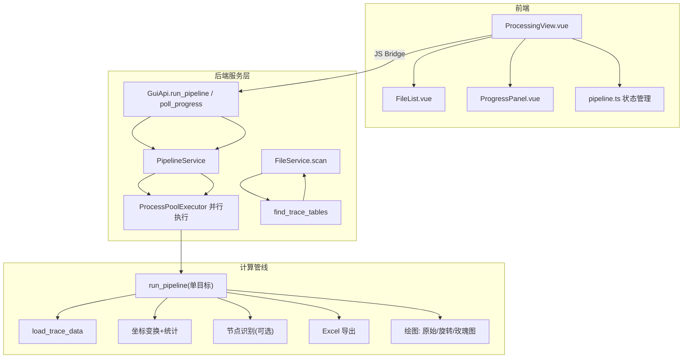
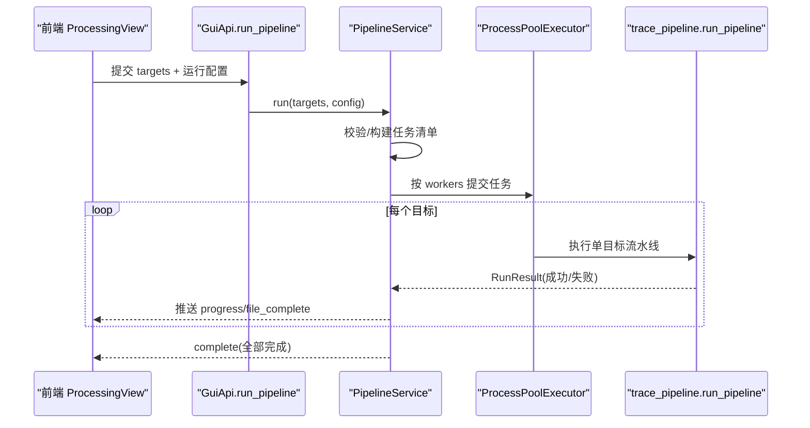
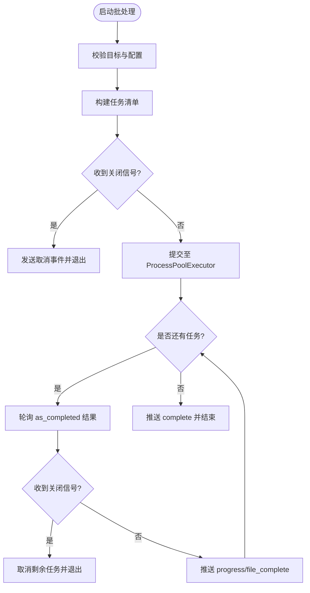
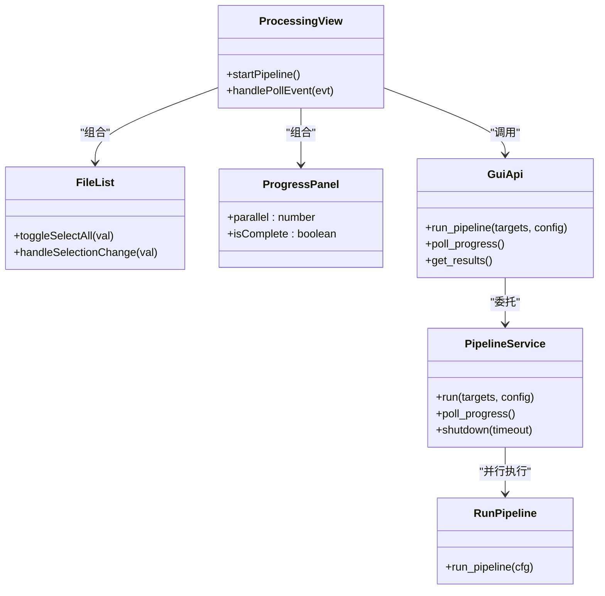

# 批量处理功能

<cite>
**本文引用的文件列表**
- [README.md](file://README.md)
- [run_trace_pipeline.py](file://run_trace_pipeline.py)
- [trace_pipeline/cli/main.py](file://trace_pipeline/cli/main.py)
- [trace_pipeline/io/discovery.py](file://trace_pipeline/io/discovery.py)
- [trace_pipeline/config.py](file://trace_pipeline/config.py)
- [trace_pipeline/models.py](file://trace_pipeline/models.py)
- [trace_pipeline/pipeline.py](file://trace_pipeline/pipeline.py)
- [backend/services/pipeline_service.py](file://backend/services/pipeline_service.py)
- [backend/gui_api.py](file://backend/gui_api.py)
- [backend/services/file_service.py](file://backend/services/file_service.py)
- [frontend/src/views/ProcessingView.vue](file://frontend/src/views/ProcessingView.vue)
- [frontend/src/components/FileList.vue](file://frontend/src/components/FileList.vue)
- [frontend/src/components/ProgressPanel.vue](file://frontend/src/components/ProgressPanel.vue)
- [frontend/src/stores/pipeline.ts](file://frontend/src/stores/pipeline.ts)
</cite>

## 目录
1. [简介](#简介)
2. [项目结构](#项目结构)
3. [核心组件](#核心组件)
4. [架构总览](#架构总览)
5. [详细组件分析](#详细组件分析)
6. [依赖关系分析](#依赖关系分析)
7. [性能与并行调优](#性能与并行调优)
8. [监控与结果合并](#监控与结果合并)
9. [故障排除指南](#故障排除指南)
10. [结论](#结论)

## 简介
本指南聚焦于 TracePipeline 的“批量处理”能力，覆盖从多文件选择、并行配置、任务队列与中断恢复，到结果合并、监控与性能调优、故障排除的全流程。读者可据此在 GUI 或 CLI 中高效完成大批量露头数据处理。

## 项目结构
TracePipeline 采用前后端分离的桌面应用架构：前端 Vue 3 + Element Plus 提供交互界面；后端通过 pywebview 桥接 Python 服务层，调用 trace_pipeline 计算管线实现数据加载、统计、绘图与导出。

图示来源
- [backend/gui_api.py:388-446](file://backend/gui_api.py#L388-L446)
- [backend/services/pipeline_service.py:32-100](file://backend/services/pipeline_service.py#L32-L100)
- [trace_pipeline/pipeline.py:230-474](file://trace_pipeline/pipeline.py#L230-L474)
- [trace_pipeline/io/discovery.py:24-63](file://trace_pipeline/io/discovery.py#L24-L63)
- [frontend/src/views/ProcessingView.vue:354-403](file://frontend/src/views/ProcessingView.vue#L354-L403)

章节来源
- [README.md:169-237](file://README.md#L169-L237)
- [backend/gui_api.py:52-118](file://backend/gui_api.py#L52-L118)
- [trace_pipeline/pipeline.py:1-47](file://trace_pipeline/pipeline.py#L1-L47)

## 核心组件
- 文件发现与扫描
  - 基于输入目录后缀匹配（如 *_process.xlsx/.xls）自动发现待处理文件，支持去重与排序。
- 流水线编排
  - 单目标 run_pipeline 串联“加载→变换→统计→节点识别→Excel 导出→绘图”。
- 并行执行与队列
  - PipelineService 使用线程安全队列 + ProcessPoolExecutor 并发执行，支持关闭信号与优雅退出。
- 前端交互
  - ProcessingView 负责参数设置、文件勾选、启动批处理、轮询进度与日志展示。
- 配置与路径解析
  - config.py 统一加载 JSON 配置、校验必填项、解析绝对路径并创建必要目录。

章节来源
- [trace_pipeline/io/discovery.py:1-63](file://trace_pipeline/io/discovery.py#L1-L63)
- [trace_pipeline/pipeline.py:230-474](file://trace_pipeline/pipeline.py#L230-L474)
- [backend/services/pipeline_service.py:32-100](file://backend/services/pipeline_service.py#L32-L100)
- [frontend/src/views/ProcessingView.vue:354-403](file://frontend/src/views/ProcessingView.vue#L354-L403)
- [trace_pipeline/config.py:86-190](file://trace_pipeline/config.py#L86-L190)

## 架构总览
下图展示了 GUI 模式下一次完整的批量处理请求从前端到后端的调用链路与关键状态流转。

图示来源
- [backend/gui_api.py:388-446](file://backend/gui_api.py#L388-L446)
- [backend/services/pipeline_service.py:100-200](file://backend/services/pipeline_service.py#L100-L200)
- [trace_pipeline/pipeline.py:230-474](file://trace_pipeline/pipeline.py#L230-L474)

## 详细组件分析

### 多文件选择方法（GUI）
- 按目录选择
  - 在“处理”页面点击“刷新”，后端扫描 input 目录，返回所有匹配 *_process.* 的文件列表。
- 按条件筛选
  - 当前列表显示“文件名/露头/状态”，可通过“全选”快速勾选，再结合“处理”按钮仅对选中文件执行。
- 批量勾选
  - FileList 表格支持多选，勾选后由 ProcessingView 收集 outcrop 列表作为 targets 提交。

章节来源
- [backend/services/file_service.py:29-89](file://backend/services/file_service.py#L29-L89)
- [frontend/src/components/FileList.vue:1-115](file://frontend/src/components/FileList.vue#L1-L115)
- [frontend/src/views/ProcessingView.vue:232-271](file://frontend/src/views/ProcessingView.vue#L232-L271)

### 并行处理配置
- 工作进程数设置
  - GUI 提供滑块与数字输入，默认 0 表示自动（取 CPU 核数与目标数较小值）。
  - 后端根据 parallel_workers 决定实际 workers，上限受限于 CPU 核心数与目标数量。
- CPU 资源分配
  - 使用 spawn 上下文创建子进程，避免共享状态污染；每个子进程独立初始化 matplotlib 后端与日志。
- 内存使用优化建议
  - 合理设置 DPI（原始图/旋转图/玫瑰图），降低图像内存占用。
  - 大文件场景下适当减少并行度，避免同时写入大量 Excel/图片导致 IO 竞争与内存峰值。

章节来源
- [frontend/src/components/ProgressPanel.vue:78-125](file://frontend/src/components/ProgressPanel.vue#L78-L125)
- [backend/services/pipeline_service.py:146-185](file://backend/services/pipeline_service.py#L146-L185)
- [trace_pipeline/pipeline.py:239-253](file://trace_pipeline/pipeline.py#L239-L253)

### 批量任务启动流程（队列、优先级、中断恢复）
- 任务队列管理
  - PipelineService 维护线程安全 deque 队列，非阻塞地向前端推送 start/progress/file_complete/complete/error 事件。
- 优先级处理
  - 当前为 FIFO 顺序，无显式优先级字段；如需优先处理特定露头，可在前端调整 targets 顺序。
- 中断恢复机制
  - 支持优雅关闭：设置 shutdown_event 后，后台线程在两个目标之间提前退出，等待当前任务完成后再结束。
  - 未实现断点续传：若中途取消，已完成的文件结果保留，未完成的目标需重新选择并再次运行。

图示来源
- [backend/services/pipeline_service.py:100-200](file://backend/services/pipeline_service.py#L100-L200)
- [backend/services/pipeline_service.py:200-346](file://backend/services/pipeline_service.py#L200-L346)

章节来源
- [backend/services/pipeline_service.py:32-100](file://backend/services/pipeline_service.py#L32-L100)
- [backend/services/pipeline_service.py:100-200](file://backend/services/pipeline_service.py#L100-L200)
- [backend/services/pipeline_service.py:200-346](file://backend/services/pipeline_service.py#L200-L346)

### 处理结果的合并策略
- 统一输出目录
  - 所有产物写入 output 目录，包括 Excel 与各格式图片。
- 文件命名规则
  - Excel: {outcrop}_traces.xlsx
  - 原始迹线图: {outcrop}_raw(n=N).png
  - 旋转迹线图: {outcrop}_rotated(strike=X).png
  - 玫瑰图: {outcrop}_rose(bin=W).png（可选）
- 结果索引生成
  - get_results 通过正则匹配 raw 图片名提取 outcrop，并汇总对应图片路径，形成结果索引供前端查看。

章节来源
- [trace_pipeline/pipeline.py:375-410](file://trace_pipeline/pipeline.py#L375-L410)
- [backend/gui_api.py:459-492](file://backend/gui_api.py#L459-L492)

### 批量处理的监控方法
- 总体进度跟踪
  - 前端轮询 poll_progress，接收 type=progress 事件更新 current/total 与当前文件名。
- 单个文件状态查看
  - file_complete 事件携带 result 字典，包含 status、trace_count、window_strategy、area_source 等。
- 错误文件定位
  - 错误类型提示（如 PermissionError、FileNotFoundError）在前端以消息与日志高亮显示，便于快速定位。

章节来源
- [frontend/src/views/ProcessingView.vue:422-518](file://frontend/src/views/ProcessingView.vue#L422-L518)
- [backend/services/pipeline_service.py:254-305](file://backend/services/pipeline_service.py#L254-L305)

### 批量处理的性能调优技巧
- 合适的并行度设置
  - 小目标集（≤2）默认串行更稳定；中等规模可按 CPU 核数设置；大规模时建议不超过 CPU 核数。
- 大文件处理优化
  - 降低 DPI 与关闭不必要的玫瑰图导出，减少绘图阶段耗时与内存占用。
- 内存管理策略
  - 避免同时开启过多高 DPI 绘图；必要时分批次处理，释放中间对象。

章节来源
- [frontend/src/components/ProgressPanel.vue:78-125](file://frontend/src/components/ProgressPanel.vue#L78-L125)
- [trace_pipeline/pipeline.py:132-227](file://trace_pipeline/pipeline.py#L132-L227)

### 批量处理的故障排除方法
- 常见错误诊断
  - 权限不足/文件被占用：关闭 Excel/WPS 后重试。
  - 输入文件不存在：检查 input 目录与命名规范。
- 部分失败处理
  - 单个目标失败不影响其他目标继续执行；完成后在文件列表中显示“失败”状态。
- 断点续传功能
  - 当前不支持断点续传；可手动勾选“待处理/失败”文件再次运行。

章节来源
- [trace_pipeline/pipeline.py:450-474](file://trace_pipeline/pipeline.py#L450-L474)
- [backend/services/pipeline_service.py:289-305](file://backend/services/pipeline_service.py#L289-L305)
- [frontend/src/views/ProcessingView.vue:460-518](file://frontend/src/views/ProcessingView.vue#L460-L518)

## 依赖关系分析
- 前端依赖
  - ProcessingView 组合 FileList 与 ProgressPanel，并通过 pipeline.ts 管理运行状态与持久化偏好。
- 后端依赖
  - GuiApi 聚合多个服务（文件扫描、配置、流水线、预览、报告、审计等），按需懒加载。
- 计算管线依赖
  - run_pipeline 依赖 io/excel_reader/writer、geology/statistics、plotting 模块与 models 数据类。

图示来源
- [frontend/src/views/ProcessingView.vue:107-170](file://frontend/src/views/ProcessingView.vue#L107-L170)
- [frontend/src/components/FileList.vue:52-115](file://frontend/src/components/FileList.vue#L52-L115)
- [frontend/src/components/ProgressPanel.vue:60-125](file://frontend/src/components/ProgressPanel.vue#L60-L125)
- [backend/gui_api.py:388-446](file://backend/gui_api.py#L388-L446)
- [backend/services/pipeline_service.py:32-100](file://backend/services/pipeline_service.py#L32-L100)
- [trace_pipeline/pipeline.py:230-474](file://trace_pipeline/pipeline.py#L230-L474)

章节来源
- [frontend/src/stores/pipeline.ts:22-56](file://frontend/src/stores/pipeline.ts#L22-L56)
- [backend/gui_api.py:52-118](file://backend/gui_api.py#L52-L118)
- [trace_pipeline/models.py:162-273](file://trace_pipeline/models.py#L162-L273)

## 性能与并行调优
- 并行度与 CPU 核心数
  - 当 parallel_workers=0 时，workers=min(目标数, CPU 核数)。
  - 对于 IO 密集（大量 Excel 读写与绘图）场景，建议将 workers 设置为 CPU 核数或略低，避免争用。
- 图像渲染开销
  - 降低 trace_dpi/rotated_trace_dpi/rose_dpi 可显著减少内存与时间消耗。
- 缓存与预热
  - 文件扫描带 TTL 缓存；首次运行前可触发字体与样式预热以减少首帧延迟。

章节来源
- [backend/services/pipeline_service.py:146-185](file://backend/services/pipeline_service.py#L146-L185)
- [backend/gui_api.py:336-356](file://backend/gui_api.py#L336-L356)
- [frontend/src/components/ProgressPanel.vue:78-125](file://frontend/src/components/ProgressPanel.vue#L78-L125)

## 监控与结果合并
- 监控面板
  - 进度条平滑动画，实时显示当前文件与消息；完成时显示总耗时。
- 结果索引
  - get_results 扫描 output 目录，按 outcrop 聚合图片路径，供前端打开图片模态窗口。
- 统一输出目录
  - 所有产物集中输出，便于归档与对比。

章节来源
- [frontend/src/components/ProgressPanel.vue:127-165](file://frontend/src/components/ProgressPanel.vue#L127-L165)
- [backend/gui_api.py:459-492](file://backend/gui_api.py#L459-L492)
- [trace_pipeline/pipeline.py:375-410](file://trace_pipeline/pipeline.py#L375-L410)

## 故障排除指南
- 常见问题
  - 文件被占用：关闭 Excel/WPS 后重试。
  - 输入文件缺失：确认 input 目录存在且命名符合 *_process.*。
- 部分失败处理
  - 单个失败不影响整体；在文件列表中标记“失败”，可单独再次运行。
- 中断与恢复
  - 支持优雅关闭；未实现断点续传，需手动重新选择未完成目标。

章节来源
- [trace_pipeline/pipeline.py:450-474](file://trace_pipeline/pipeline.py#L450-L474)
- [backend/services/pipeline_service.py:289-305](file://backend/services/pipeline_service.py#L289-L305)
- [frontend/src/views/ProcessingView.vue:460-518](file://frontend/src/views/ProcessingView.vue#L460-L518)

## 结论
TracePipeline 的批量处理功能在 GUI 与 CLI 两端均提供了完善的文件发现、并行执行、进度监控与结果合并能力。通过合理的并行度与 DPI 配置，可在保证质量的前提下显著提升吞吐。尽管尚未实现断点续传，但优雅关闭与部分失败隔离已能满足大多数工程场景。建议在生产环境中结合日志与错误提示进行持续优化与排障。