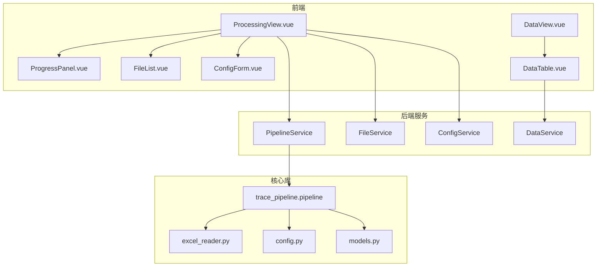
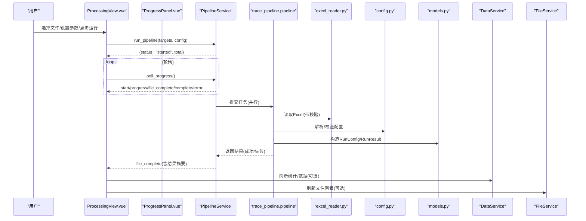
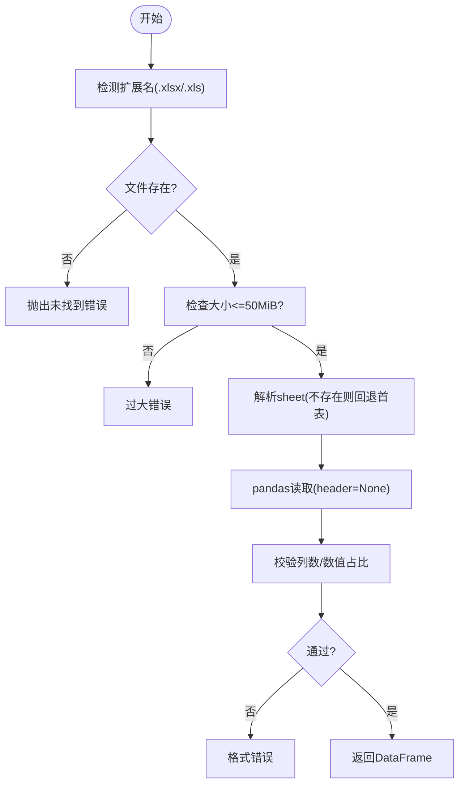
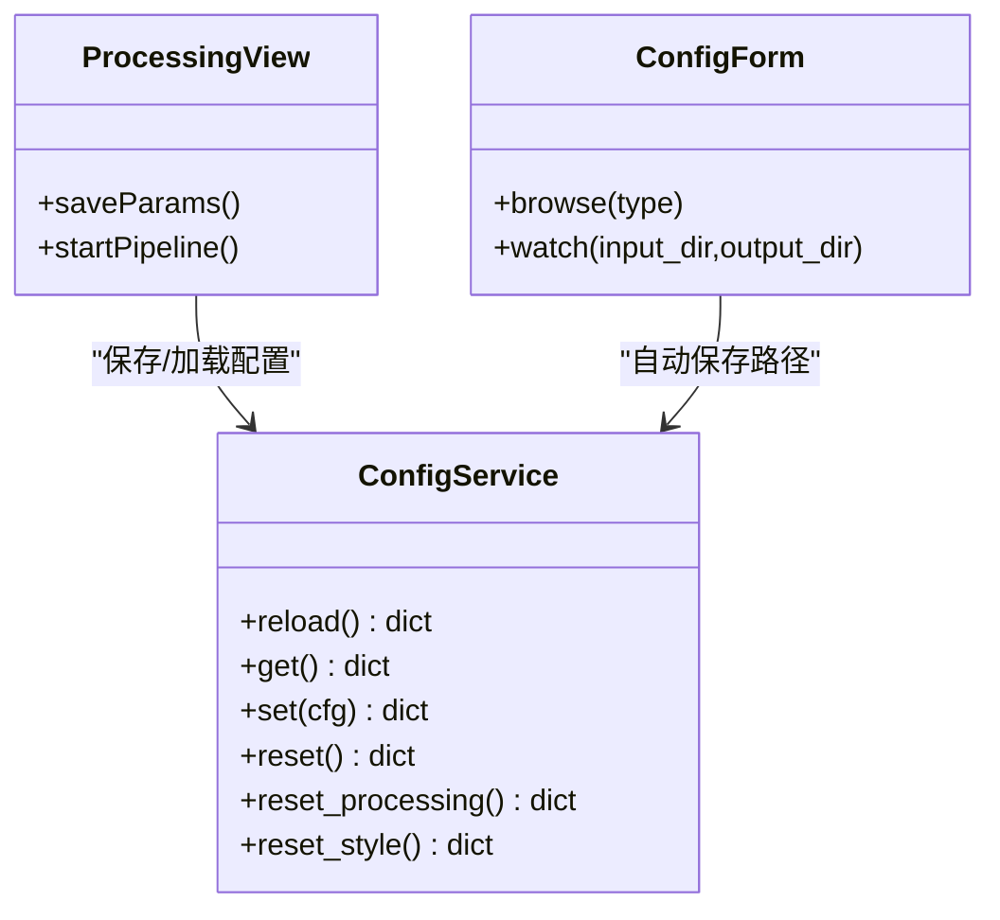
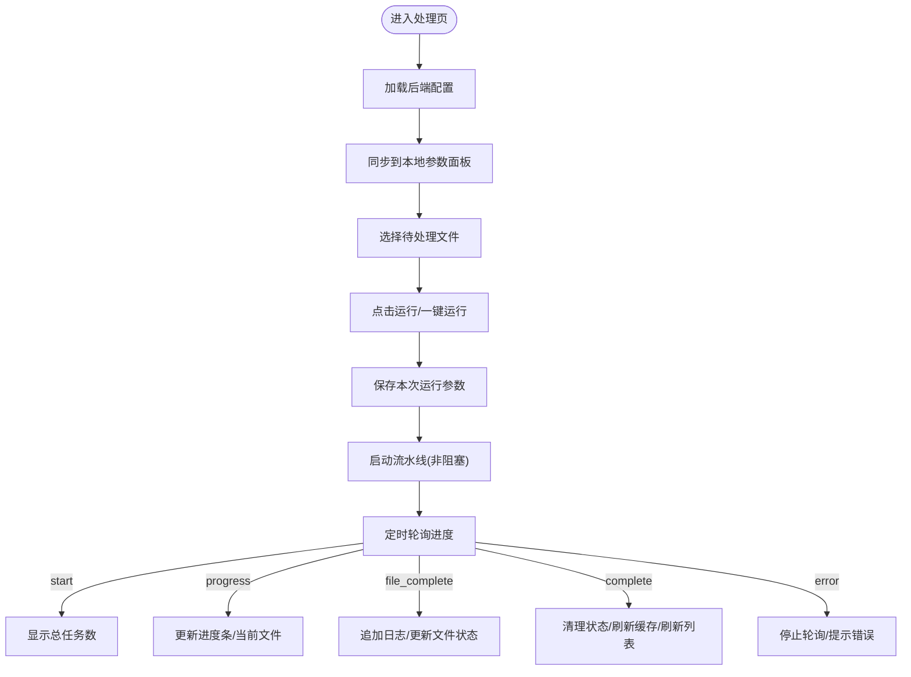
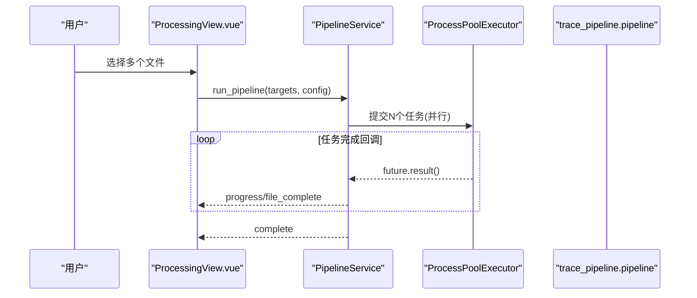
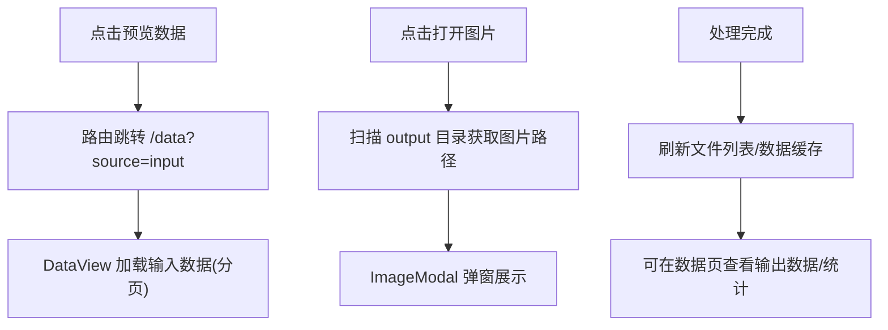
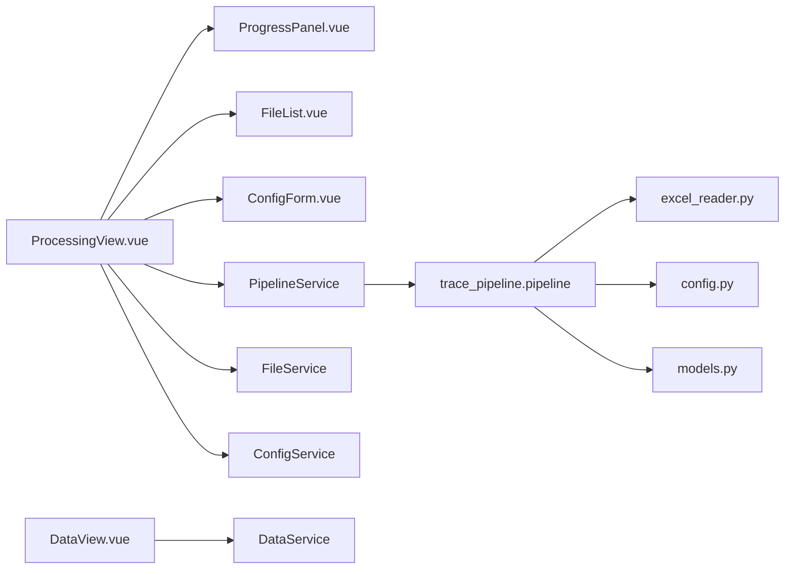

# 数据处理页面

<cite>
**本文引用的文件列表**
- [ProcessingView.vue](file://frontend/src/views/ProcessingView.vue)
- [ProgressPanel.vue](file://frontend/src/components/ProgressPanel.vue)
- [FileList.vue](file://frontend/src/components/FileList.vue)
- [DataView.vue](file://frontend/src/views/DataView.vue)
- [DataTable.vue](file://frontend/src/components/DataTable.vue)
- [ConfigForm.vue](file://frontend/src/components/ConfigForm.vue)
- [data_service.py](file://backend/services/data_service.py)
- [file_service.py](file://backend/services/file_service.py)
- [pipeline_service.py](file://backend/services/pipeline_service.py)
- [config_service.py](file://backend/services/config_service.py)
- [excel_reader.py](file://trace_pipeline/io/excel_reader.py)
- [config.py](file://trace_pipeline/config.py)
- [models.py](file://trace_pipeline/models.py)
- [pipeline.py](file://trace_pipeline/pipeline.py)
</cite>

## 目录
1. [简介](#简介)
2. [项目结构](#项目结构)
3. [核心组件](#核心组件)
4. [架构总览](#架构总览)
5. [详细组件分析](#详细组件分析)
6. [依赖关系分析](#依赖关系分析)
7. [性能与并发](#性能与并发)
8. [故障排查指南](#故障排查指南)
9. [结论](#结论)
10. [附录：操作清单](#附录操作清单)

## 简介
本指南面向使用“数据处理页面”的用户，覆盖以下能力：
- 文件导入流程与支持的 Excel 格式、数据验证规则
- 参数配置界面（测线参数、坐标变换、统计分析方法）
- 进度监控面板（实时进度条、处理状态、错误信息查看）
- 批量处理（多文件选择、并行进程设置、结果合并）
- 处理结果的预览与导出

## 项目结构
数据处理页面由前端视图与后端服务协同完成。关键路径如下：
- 前端
  - 处理页：ProcessingView.vue
  - 进度面板：ProgressPanel.vue
  - 文件列表：FileList.vue
  - 数据页：DataView.vue + DataTable.vue
  - 配置表单：ConfigForm.vue
- 后端
  - 流水线执行：PipelineService（多线程+进程池）
  - 文件扫描：FileService
  - 数据读取：DataService（输出/输入 Excel 分页）
  - 配置读写：ConfigService
  - 核心逻辑：trace_pipeline.pipeline（加载→计算→变换→导出→绘图）
  - Excel 读取与校验：excel_reader
  - 配置解析与默认值：config
  - 运行模型：RunConfig/RunResult

图表来源
- [ProcessingView.vue:1-120](file://frontend/src/views/ProcessingView.vue#L1-L120)
- [ProgressPanel.vue:1-80](file://frontend/src/components/ProgressPanel.vue#L1-L80)
- [FileList.vue:1-60](file://frontend/src/components/FileList.vue#L1-L60)
- [DataView.vue:1-60](file://frontend/src/views/DataView.vue#L1-L60)
- [pipeline_service.py:1-60](file://backend/services/pipeline_service.py#L1-L60)
- [file_service.py:1-40](file://backend/services/file_service.py#L1-L40)
- [data_service.py:1-45](file://backend/services/data_service.py#L1-L45)
- [config_service.py:1-40](file://backend/services/config_service.py#L1-L40)
- [excel_reader.py:1-40](file://trace_pipeline/io/excel_reader.py#L1-L40)
- [config.py:1-40](file://trace_pipeline/config.py#L1-L40)
- [models.py:1-40](file://trace_pipeline/models.py#L1-L40)
- [pipeline.py:1-40](file://trace_pipeline/pipeline.py#L1-L40)

章节来源
- [ProcessingView.vue:1-120](file://frontend/src/views/ProcessingView.vue#L1-L120)
- [ProgressPanel.vue:1-80](file://frontend/src/components/ProgressPanel.vue#L1-L80)
- [FileList.vue:1-60](file://frontend/src/components/FileList.vue#L1-L60)
- [DataView.vue:1-60](file://frontend/src/views/DataView.vue#L1-L60)
- [pipeline_service.py:1-60](file://backend/services/pipeline_service.py#L1-L60)
- [file_service.py:1-40](file://backend/services/file_service.py#L1-L40)
- [data_service.py:1-45](file://backend/services/data_service.py#L1-L45)
- [config_service.py:1-40](file://backend/services/config_service.py#L1-L40)
- [excel_reader.py:1-40](file://trace_pipeline/io/excel_reader.py#L1-L40)
- [config.py:1-40](file://trace_pipeline/config.py#L1-L40)
- [models.py:1-40](file://trace_pipeline/models.py#L1-L40)
- [pipeline.py:1-40](file://trace_pipeline/pipeline.py#L1-L40)

## 核心组件
- 处理页（ProcessingView.vue）
  - 提供处理参数面板、文件列表、进度面板、处理过程日志、图片模态窗口
  - 负责启动流水线、轮询进度、汇总结果、刷新缓存
- 进度面板（ProgressPanel.vue）
  - 显示任务总数/当前数、平滑进度条、并行进程滑块、运行状态标签
- 文件列表（FileList.vue）
  - 展示 input 目录下的迹线表文件，支持全选、刷新、单文件处理、预览、打开图片
- 数据页（DataView.vue + DataTable.vue）
  - 切换输入/输出数据源，展示基本信息卡片与分页表格
- 配置表单（ConfigForm.vue）
  - 管理输入/输出目录、绘图样式等；自动保存路径变更
- 后端服务
  - PipelineService：后台线程+进程池执行，事件队列推送进度
  - FileService：扫描 input 目录并判断是否已完成
  - DataService：分页读取 output/input Excel
  - ConfigService：统一读写 config.json，保证原子写入

章节来源
- [ProcessingView.vue:120-220](file://frontend/src/views/ProcessingView.vue#L120-L220)
- [ProgressPanel.vue:60-165](file://frontend/src/components/ProgressPanel.vue#L60-L165)
- [FileList.vue:52-115](file://frontend/src/components/FileList.vue#L52-L115)
- [DataView.vue:56-149](file://frontend/src/views/DataView.vue#L56-L149)
- [ConfigForm.vue:127-248](file://frontend/src/components/ConfigForm.vue#L127-L248)
- [pipeline_service.py:32-100](file://backend/services/pipeline_service.py#L32-L100)
- [file_service.py:17-90](file://backend/services/file_service.py#L17-L90)
- [data_service.py:44-188](file://backend/services/data_service.py#L44-L188)
- [config_service.py:41-144](file://backend/services/config_service.py#L41-L144)

## 架构总览
下图展示了从用户点击“一键运行”到结果展示的端到端流程。

图表来源
- [ProcessingView.vue:354-518](file://frontend/src/views/ProcessingView.vue#L354-L518)
- [pipeline_service.py:100-346](file://backend/services/pipeline_service.py#L100-L346)
- [pipeline.py:1-200](file://trace_pipeline/pipeline.py#L1-L200)
- [excel_reader.py:36-106](file://trace_pipeline/io/excel_reader.py#L36-L106)
- [config.py:86-190](file://trace_pipeline/config.py#L86-L190)
- [models.py:162-268](file://trace_pipeline/models.py#L162-L268)
- [data_service.py:78-188](file://backend/services/data_service.py#L78-L188)
- [file_service.py:29-90](file://backend/services/file_service.py#L29-L90)

## 详细组件分析

### 文件导入流程与 Excel 格式支持
- 支持的 Excel 扩展名
  - .xlsx（openpyxl）、.xls（xlrd），优先尝试 .xlsx，缺失则回退 .xls
- 工作表策略
  - 若指定 sheet 不存在，自动回退到首个工作表
- 文件大小限制
  - 超过 50 MiB 直接拒绝，避免内存溢出
- 基本格式校验
  - 至少 4 列（x1,y1,x2,y2）
  - 前若干行数值占比过低将告警
- 输入/输出数据读取
  - 输出：output/{outcrop}_traces.xlsx 多工作表，按分区映射分页返回
  - 输入：input/{outcrop}_process.xls/.xlsx，按工作表或首表读取，标准化为固定列头

图表来源
- [excel_reader.py:36-106](file://trace_pipeline/io/excel_reader.py#L36-L106)
- [excel_reader.py:128-169](file://trace_pipeline/io/excel_reader.py#L128-L169)
- [data_service.py:190-266](file://backend/services/data_service.py#L190-L266)

章节来源
- [excel_reader.py:36-106](file://trace_pipeline/io/excel_reader.py#L36-L106)
- [excel_reader.py:128-169](file://trace_pipeline/io/excel_reader.py#L128-L169)
- [data_service.py:78-188](file://backend/services/data_service.py#L78-L188)
- [data_service.py:190-266](file://backend/services/data_service.py#L190-L266)

### 参数配置界面
- 处理参数（在“处理”页顶部）
  - 导出玫瑰图开关
  - 启用节点识别开关
  - 玫瑰图 DPI、分箱宽度
  - 原始迹线图 DPI、旋转迹线图 DPI
- 全局配置（在“配置”页）
  - 输入/输出目录（支持浏览选择，自动保存）
  - 绘图样式（颜色、透明度、线宽、标题字号、节点样式）
- 配置持久化
  - 通过 ConfigService 原子写入 config.json，确保一致性
  - 处理页启动时从后端加载最新配置，同步到本地 UI

图表来源
- [config_service.py:41-144](file://backend/services/config_service.py#L41-L144)
- [ProcessingView.vue:334-380](file://frontend/src/views/ProcessingView.vue#L334-L380)
- [ConfigForm.vue:174-248](file://frontend/src/components/ConfigForm.vue#L174-L248)

章节来源
- [ProcessingView.vue:136-224](file://frontend/src/views/ProcessingView.vue#L136-L224)
- [ConfigForm.vue:127-248](file://frontend/src/components/ConfigForm.vue#L127-L248)
- [config_service.py:41-144](file://backend/services/config_service.py#L41-L144)

### 进度监控面板
- 实时进度条
  - 基于 current/total 计算目标百分比，采用 requestAnimationFrame 平滑插值
  - 运行中显示“运行中”标签，完成后显示“全部处理完成”
- 并行进程控制
  - 滑块与数字输入双向绑定，上限根据 CPU 核心数动态计算
- 处理过程日志
  - 记录 info/success/error 三类消息，自动滚动到底部，最多保留最近 50 条
- 错误提示
  - 连续轮询失败达到阈值后停止轮询并提示
  - 针对 PermissionError、FileNotFoundError 给出友好提示

图表来源
- [ProgressPanel.vue:60-165](file://frontend/src/components/ProgressPanel.vue#L60-L165)
- [ProcessingView.vue:405-518](file://frontend/src/views/ProcessingView.vue#L405-L518)
- [pipeline_service.py:66-99](file://backend/services/pipeline_service.py#L66-L99)

章节来源
- [ProgressPanel.vue:60-165](file://frontend/src/components/ProgressPanel.vue#L60-L165)
- [ProcessingView.vue:405-518](file://frontend/src/views/ProcessingView.vue#L405-L518)
- [pipeline_service.py:66-99](file://backend/services/pipeline_service.py#L66-L99)

### 批量处理功能
- 多文件选择
  - 文件列表支持全选/多选，勾选后点击“处理”或“一键运行”
- 并行处理设置
  - 并行进程数可配置：0=自动（CPU核心数），1=串行，>1=指定进程数
  - 实际并行度受限于 CPU 核心数与任务数量
- 结果合并
  - 每个文件独立产出 Excel 与图片，最终由前端聚合展示
  - 处理完成后自动刷新文件列表与数据缓存，便于后续预览

图表来源
- [ProcessingView.vue:354-403](file://frontend/src/views/ProcessingView.vue#L354-L403)
- [pipeline_service.py:146-220](file://backend/services/pipeline_service.py#L146-L220)
- [pipeline.py:1-40](file://trace_pipeline/pipeline.py#L1-L40)

章节来源
- [FileList.vue:38-48](file://frontend/src/components/FileList.vue#L38-L48)
- [ProcessingView.vue:354-403](file://frontend/src/views/ProcessingView.vue#L354-L403)
- [pipeline_service.py:146-220](file://backend/services/pipeline_service.py#L146-L220)

### 处理结果预览与导出
- 预览
  - 数据页支持“输入数据/输出数据”切换
  - 输出数据区展示基本信息卡片（测线走向、迹线条数、长度、面积、平均迹长、面积来源）
  - 表格分页加载，支持大文件浏览
- 导出
  - 输出 Excel 包含多工作表（基本信息、原始坐标、旋转坐标、走向与长度、裂隙情况、计算数据、节点统计、节点明细、节点交点）
  - 图片包括原始迹线图、旋转迹线图、可选的玫瑰图
  - 文件列表支持“打开图片”，以模态窗口查看

图表来源
- [ProcessingView.vue:273-313](file://frontend/src/views/ProcessingView.vue#L273-L313)
- [DataView.vue:14-52](file://frontend/src/views/DataView.vue#L14-L52)
- [data_service.py:17-28](file://backend/services/data_service.py#L17-L28)

章节来源
- [DataView.vue:14-52](file://frontend/src/views/DataView.vue#L14-L52)
- [data_service.py:78-188](file://backend/services/data_service.py#L78-L188)
- [ProcessingView.vue:273-313](file://frontend/src/views/ProcessingView.vue#L273-L313)

## 依赖关系分析
- 前端依赖
  - ProcessingView.vue 依赖 ProgressPanel.vue、FileList.vue、ConfigForm.vue
  - DataView.vue 依赖 DataTable.vue 与 API 层
- 后端依赖
  - PipelineService 依赖 trace_pipeline.pipeline、models、config
  - DataService 依赖 pandas/openpyxl/xlrd、TTLCache
  - FileService 依赖 discovery 模块与 TTLCache
  - ConfigService 依赖 trace_pipeline.config

图表来源
- [ProcessingView.vue:1-120](file://frontend/src/views/ProcessingView.vue#L1-L120)
- [pipeline_service.py:1-60](file://backend/services/pipeline_service.py#L1-L60)
- [data_service.py:1-45](file://backend/services/data_service.py#L1-L45)
- [file_service.py:1-40](file://backend/services/file_service.py#L1-L40)
- [config_service.py:1-40](file://backend/services/config_service.py#L1-L40)
- [excel_reader.py:1-40](file://trace_pipeline/io/excel_reader.py#L1-L40)
- [config.py:1-40](file://trace_pipeline/config.py#L1-L40)
- [models.py:1-40](file://trace_pipeline/models.py#L1-L40)
- [pipeline.py:1-40](file://trace_pipeline/pipeline.py#L1-L40)

章节来源
- [ProcessingView.vue:1-120](file://frontend/src/views/ProcessingView.vue#L1-L120)
- [pipeline_service.py:1-60](file://backend/services/pipeline_service.py#L1-L60)
- [data_service.py:1-45](file://backend/services/data_service.py#L1-L45)
- [file_service.py:1-40](file://backend/services/file_service.py#L1-L40)
- [config_service.py:1-40](file://backend/services/config_service.py#L1-L40)
- [excel_reader.py:1-40](file://trace_pipeline/io/excel_reader.py#L1-L40)
- [config.py:1-40](file://trace_pipeline/config.py#L1-L40)
- [models.py:1-40](file://trace_pipeline/models.py#L1-L40)
- [pipeline.py:1-40](file://trace_pipeline/pipeline.py#L1-L40)

## 性能与并发
- 并行策略
  - 自动模式：workers=min(任务数, CPU核心数)
  - 串行模式：workers=1
  - 指定模式：workers=min(请求值, CPU核心数, 任务数)
- 平滑进度
  - 使用 requestAnimationFrame 实现平滑插值，提升观感
- 缓存机制
  - 文件扫描缓存（短 TTL）
  - Excel 数据缓存（按文件签名键控）
- 资源保护
  - Excel 大小上限 50 MiB
  - 关键异常（MemoryError、KeyboardInterrupt、SystemExit）不吞没，向上传播

章节来源
- [pipeline_service.py:146-175](file://backend/services/pipeline_service.py#L146-L175)
- [ProgressPanel.vue:83-125](file://frontend/src/components/ProgressPanel.vue#L83-L125)
- [file_service.py:29-90](file://backend/services/file_service.py#L29-L90)
- [data_service.py:114-157](file://backend/services/data_service.py#L114-L157)
- [excel_reader.py:69-78](file://trace_pipeline/io/excel_reader.py#L69-L78)

## 故障排查指南
- 常见错误与提示
  - 文件被占用/权限不足（PermissionError）：关闭已打开的 Excel/WPS 后重试
  - 输入文件不存在（FileNotFoundError）：检查 input 目录与文件名
  - 轮询失败多次：检查后端是否仍在运行
- 定位步骤
  - 查看“处理过程”日志，关注 error 类型与时间戳
  - 确认输入文件是否符合最小列数与数值要求
  - 检查输出目录是否存在且可写
  - 核对并行进程数是否超出 CPU 核心数导致调度降级
- 恢复建议
  - 重置处理参数或样式（配置页）
  - 强制刷新文件列表与数据缓存
  - 重新运行单个失败文件

章节来源
- [ProcessingView.vue:460-518](file://frontend/src/views/ProcessingView.vue#L460-L518)
- [pipeline_service.py:289-342](file://backend/services/pipeline_service.py#L289-L342)
- [excel_reader.py:128-169](file://trace_pipeline/io/excel_reader.py#L128-L169)

## 结论
数据处理页面提供了从导入、配置、批处理到结果预览的完整闭环。通过合理的并行策略、平滑的进度反馈与健壮的容错机制，用户可高效完成大规模迹线数据的处理与分析。

## 附录：操作清单
- 准备数据
  - 将迹线表放入 input 目录，命名符合 outcrop_process.xls/.xlsx
  - 确保文件不超过 50 MiB，至少 4 列且前几行数值有效
- 配置参数
  - 在“处理”页设置导出选项与 DPI
  - 在“配置”页设置输入/输出目录与绘图样式
- 批量处理
  - 在“处理”页勾选多个文件，设置并行进程数，点击“一键运行”
  - 观察进度面板与处理过程日志
- 查看结果
  - 在“数据”页切换“输出数据”，查看基本信息与表格
  - 在“处理”页点击“打开图片”查看原始/旋转/玫瑰图