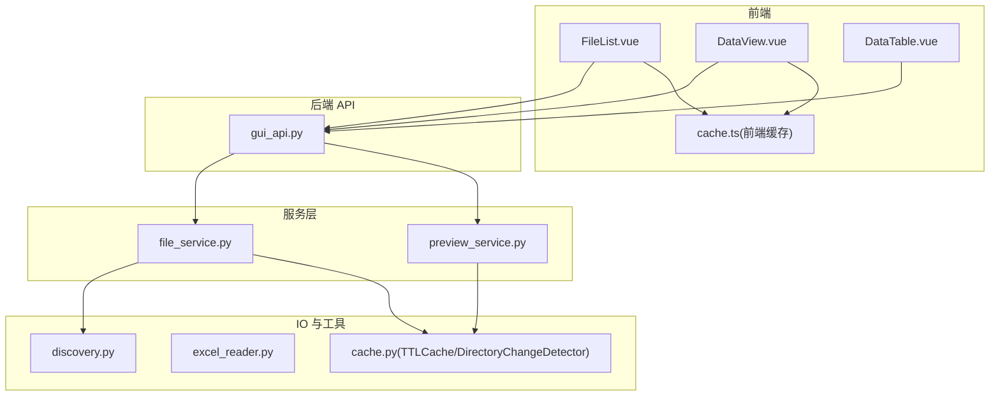
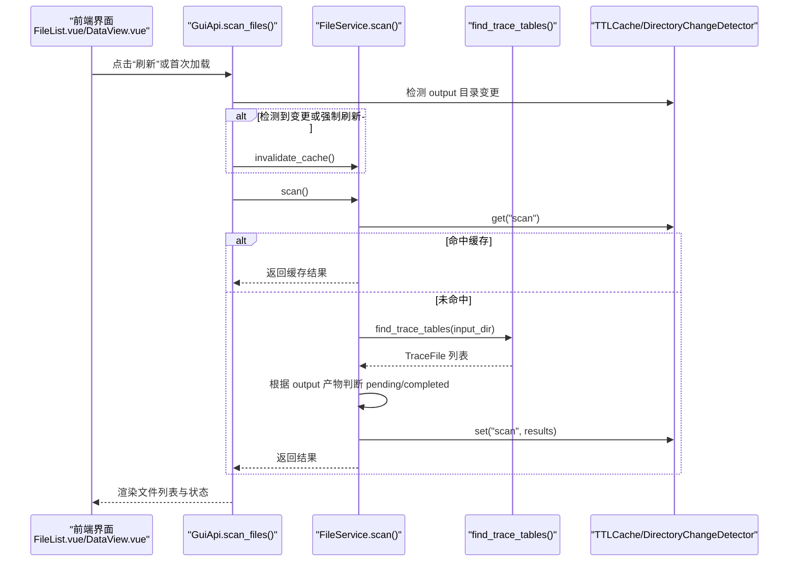
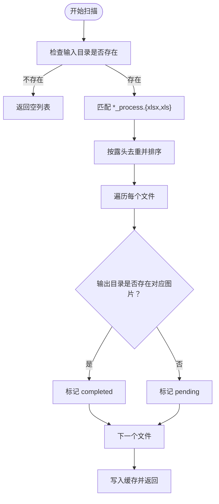
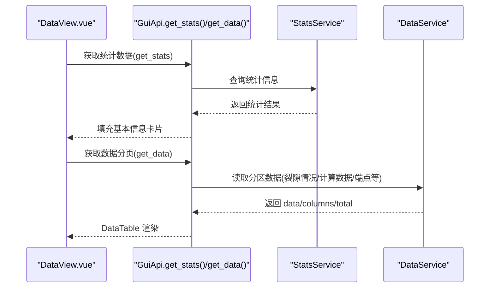
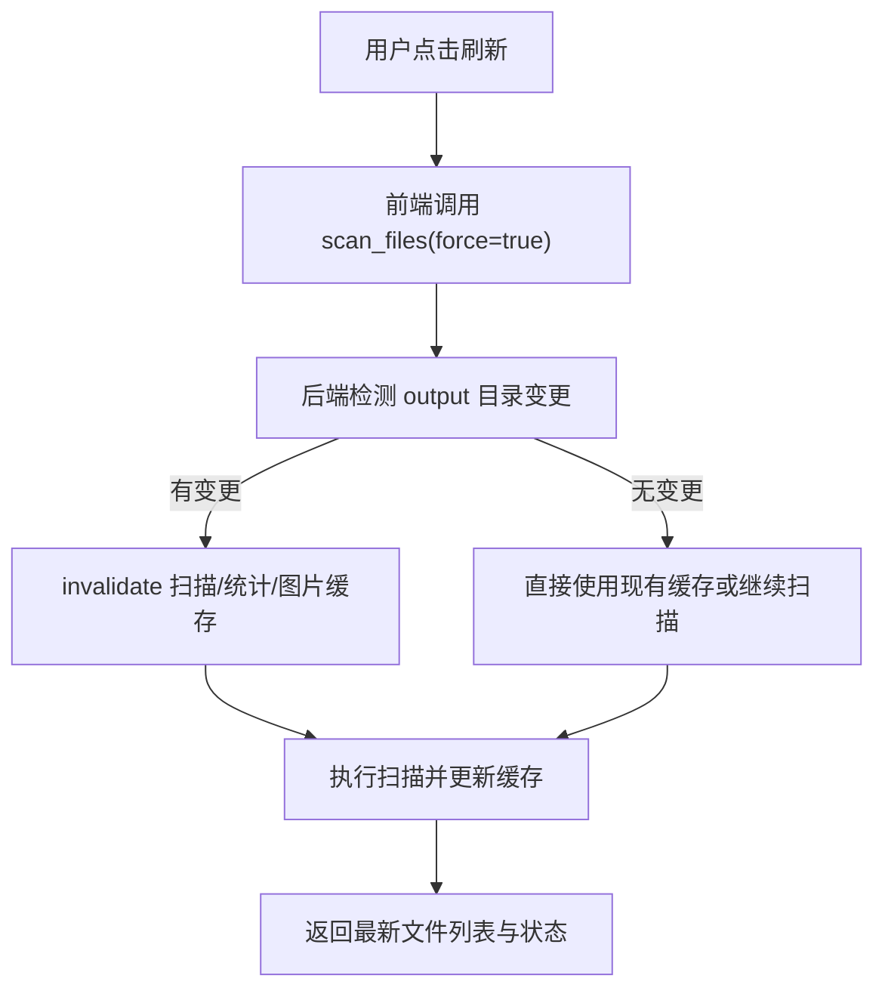
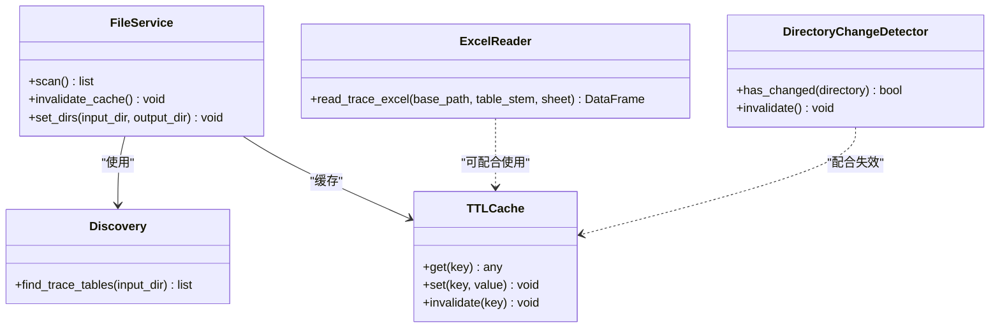

# 文件导入与管理

<cite>
**本文引用的文件列表**
- [backend/services/file_service.py](file://backend/services/file_service.py)
- [trace_pipeline/io/discovery.py](file://trace_pipeline/io/discovery.py)
- [trace_pipeline/io/excel_reader.py](file://trace_pipeline/io/excel_reader.py)
- [backend/utils/cache.py](file://backend/utils/cache.py)
- [backend/gui_api.py](file://backend/gui_api.py)
- [frontend/src/components/FileList.vue](file://frontend/src/components/FileList.vue)
- [frontend/src/views/DataView.vue](file://frontend/src/views/DataView.vue)
- [frontend/src/components/DataTable.vue](file://frontend/src/components/DataTable.vue)
- [frontend/src/stores/cache.ts](file://frontend/src/stores/cache.ts)
</cite>

## 目录
1. [简介](#简介)
2. [项目结构](#项目结构)
3. [核心组件](#核心组件)
4. [架构总览](#架构总览)
5. [详细组件分析](#详细组件分析)
6. [依赖关系分析](#依赖关系分析)
7. [性能与缓存优化](#性能与缓存优化)
8. [故障排查指南](#故障排查指南)
9. [结论](#结论)

## 简介
本指南面向需要导入、管理与预览测线 Excel 数据的用户，覆盖以下能力：
- 支持的 Excel 文件格式（.xls/.xlsx）与数据验证规则（必填列检查、数值有效性、文件大小限制等）
- 文件扫描机制（自动发现输入目录中的测线记录文件、状态显示、缓存加速）
- 文件选择操作（单选、多选、全选及批量操作可用性）
- 文件预览功能（数据表格查看、字段含义说明、数据质量评估）
- 刷新机制（手动刷新、自动检测目录变更、缓存失效策略）

## 项目结构
与“文件导入与管理”相关的后端服务、IO 模块、前端组件与缓存层如下所示。

图表来源
- [backend/gui_api.py:358-385](file://backend/gui_api.py#L358-L385)
- [backend/services/file_service.py:17-103](file://backend/services/file_service.py#L17-L103)
- [trace_pipeline/io/discovery.py:17-63](file://trace_pipeline/io/discovery.py#L17-L63)
- [trace_pipeline/io/excel_reader.py:16-169](file://trace_pipeline/io/excel_reader.py#L16-L169)
- [backend/utils/cache.py:18-155](file://backend/utils/cache.py#L18-L155)
- [frontend/src/components/FileList.vue:1-204](file://frontend/src/components/FileList.vue#L1-L204)
- [frontend/src/views/DataView.vue:80-179](file://frontend/src/views/DataView.vue#L80-L179)
- [frontend/src/components/DataTable.vue:1-199](file://frontend/src/components/DataTable.vue#L1-L199)
- [frontend/src/stores/cache.ts:1-418](file://frontend/src/stores/cache.ts#L1-L418)

章节来源
- [backend/gui_api.py:358-385](file://backend/gui_api.py#L358-L385)
- [backend/services/file_service.py:17-103](file://backend/services/file_service.py#L17-L103)
- [trace_pipeline/io/discovery.py:17-63](file://trace_pipeline/io/discovery.py#L17-L63)
- [trace_pipeline/io/excel_reader.py:16-169](file://trace_pipeline/io/excel_reader.py#L16-L169)
- [backend/utils/cache.py:18-155](file://backend/utils/cache.py#L18-L155)
- [frontend/src/components/FileList.vue:1-204](file://frontend/src/components/FileList.vue#L1-L204)
- [frontend/src/views/DataView.vue:80-179](file://frontend/src/views/DataView.vue#L80-L179)
- [frontend/src/components/DataTable.vue:1-199](file://frontend/src/components/DataTable.vue#L1-L199)
- [frontend/src/stores/cache.ts:1-418](file://frontend/src/stores/cache.ts#L1-L418)

## 核心组件
- 文件扫描服务：负责扫描输入目录、识别迹线表文件、计算处理状态并返回结果列表。
- 文件发现模块：按后缀与扩展名匹配规则发现候选文件，去重并按露头排序。
- Excel 读取与校验：支持 .xlsx/.xls，回退工作表，进行最小列数与数值有效性校验，限制文件大小。
- 缓存与变更检测：TTL 缓存加速扫描与预览；目录快照对比实现输出目录变更感知。
- 前端文件列表与数据表格：提供选择、刷新、预览、分页与搜索等交互。
- 前端缓存 Store：对扫描结果、统计数据、图片等进行多级缓存与失效管理。

章节来源
- [backend/services/file_service.py:17-103](file://backend/services/file_service.py#L17-L103)
- [trace_pipeline/io/discovery.py:17-63](file://trace_pipeline/io/discovery.py#L17-L63)
- [trace_pipeline/io/excel_reader.py:16-169](file://trace_pipeline/io/excel_reader.py#L16-L169)
- [backend/utils/cache.py:18-155](file://backend/utils/cache.py#L18-L155)
- [frontend/src/components/FileList.vue:1-204](file://frontend/src/components/FileList.vue#L1-L204)
- [frontend/src/components/DataTable.vue:1-199](file://frontend/src/components/DataTable.vue#L1-L199)
- [frontend/src/stores/cache.ts:1-418](file://frontend/src/stores/cache.ts#L1-L418)

## 架构总览
下图展示了从前端到后端的完整调用链，包括扫描、预览与数据加载流程。

图表来源
- [backend/gui_api.py:358-385](file://backend/gui_api.py#L358-L385)
- [backend/services/file_service.py:29-89](file://backend/services/file_service.py#L29-L89)
- [trace_pipeline/io/discovery.py:24-63](file://trace_pipeline/io/discovery.py#L24-L63)
- [backend/utils/cache.py:18-90](file://backend/utils/cache.py#L18-L90)

## 详细组件分析

### 支持的 Excel 格式与数据验证规则
- 支持格式
  - 优先尝试 .xlsx（openpyxl），缺失时回退 .xls（xlrd）。
  - 若指定 sheet 不存在，则回退至首个工作表。
- 必填字段与完整性
  - 至少包含 4 列（x1, y1, x2, y2），否则视为格式错误。
  - 前若干行中数值占比低于阈值会发出警告，提示可能包含非数据行。
- 数值范围与有效性
  - 前几行尝试将列转换为数值，统计有效比例以判定是否为数据区。
- 文件大小限制
  - 超过上限的 Excel 文件将被拒绝，避免内存压力。
- 错误类型区分
  - 数据格式错误直接上抛，不回退其他 sheet，便于快速定位问题。

章节来源
- [trace_pipeline/io/excel_reader.py:16-169](file://trace_pipeline/io/excel_reader.py#L16-L169)

### 文件扫描机制与状态显示
- 自动发现
  - 在输入目录下查找以特定后缀结尾的文件（如 _process.xlsx/_process.xls），同名不同扩展名去重，按露头名称排序。
- 状态判定
  - 根据输出目录是否存在对应原始图与旋转图，标记为“已完成”，否则为“待处理”。
- 缓存加速
  - 使用 TTL 缓存存储扫描结果，减少重复 IO。
- 目录变更检测
  - 通过目录快照对比，当外部修改输出目录时自动使缓存失效，保证状态准确。

图表来源
- [trace_pipeline/io/discovery.py:24-63](file://trace_pipeline/io/discovery.py#L24-L63)
- [backend/services/file_service.py:48-89](file://backend/services/file_service.py#L48-L89)
- [backend/utils/cache.py:18-90](file://backend/utils/cache.py#L18-L90)

章节来源
- [trace_pipeline/io/discovery.py:24-63](file://trace_pipeline/io/discovery.py#L24-L63)
- [backend/services/file_service.py:29-89](file://backend/services/file_service.py#L29-L89)
- [backend/utils/cache.py:92-155](file://backend/utils/cache.py#L92-L155)

### 文件选择与批量操作
- 单选/多选/全选
  - 表格支持勾选框，提供“全选”复选框，选中变化时向上层组件广播当前选中项。
- 批量操作可用性
  - 当前文件列表组件暴露了“预览数据”、“打开图片”、“处理”等操作按钮；批量操作可通过上层容器组合多个选中项触发。
- 状态标签
  - 完成/待处理/失败三种状态以标签形式展示，便于快速识别。

章节来源
- [frontend/src/components/FileList.vue:1-204](file://frontend/src/components/FileList.vue#L1-L204)

### 文件预览功能
- 数据表格查看
  - 数据视图页支持切换“输入数据/输出数据”，输出侧提供多分区标签（裂隙情况、计算数据、原始端点、旋转端点、走向与迹长、节点相关等），支持分页与搜索。
- 字段含义说明
  - 输出数据基本信息卡片展示测线走向、迹线条数、测线长度、露头面积、平均迹长、面积来源等关键指标，辅助理解数据质量与处理结果。
- 数据质量评估
  - 结合基础信息与数据表格，可快速评估数据完整性与合理性；异常或缺失字段可在对应分区中定位。

图表来源
- [frontend/src/views/DataView.vue:80-179](file://frontend/src/views/DataView.vue#L80-L179)
- [frontend/src/components/DataTable.vue:76-141](file://frontend/src/components/DataTable.vue#L76-L141)
- [backend/gui_api.py:494-599](file://backend/gui_api.py#L494-L599)

章节来源
- [frontend/src/views/DataView.vue:80-179](file://frontend/src/views/DataView.vue#L80-L179)
- [frontend/src/components/DataTable.vue:1-199](file://frontend/src/components/DataTable.vue#L1-L199)
- [backend/gui_api.py:494-599](file://backend/gui_api.py#L494-L599)

### 刷新机制与缓存失效策略
- 手动刷新
  - 前端点击“刷新”按钮，触发强制扫描，后端先使缓存失效再重新扫描。
- 自动检测目录变更
  - 后端在每次扫描前检测输出目录是否发生外部变更，若变更则自动失效相关缓存，确保状态一致。
- 缓存失效策略
  - 后端 TTL 缓存：扫描结果与预览结果均带 TTL，过期自动失效。
  - 前端多层缓存：扫描结果、统计数据、结果列表、图片/缩略图等分别设置 TTL 与 LRU 淘汰策略，并提供显式失效接口。

图表来源
- [backend/gui_api.py:358-385](file://backend/gui_api.py#L358-L385)
- [backend/utils/cache.py:92-155](file://backend/utils/cache.py#L92-L155)
- [frontend/src/stores/cache.ts:111-418](file://frontend/src/stores/cache.ts#L111-L418)

章节来源
- [backend/gui_api.py:358-385](file://backend/gui_api.py#L358-L385)
- [backend/utils/cache.py:18-155](file://backend/utils/cache.py#L18-L155)
- [frontend/src/stores/cache.ts:1-418](file://frontend/src/stores/cache.ts#L1-L418)

## 依赖关系分析
- 组件耦合
  - FileList.vue 仅依赖 GuiApi 提供的扫描接口，不直接访问文件系统，职责清晰。
  - DataView.vue 与 DataTable.vue 通过统一 API 获取统计与数据，解耦于具体数据源。
- 服务依赖
  - FileService 依赖 discovery 与 TTLCache，职责单一且内聚。
  - excel_reader 独立承担读取与校验，错误类型明确，便于上层捕获与提示。
- 外部依赖
  - pandas/openpyxl/xlrd 用于 Excel 读写；matplotlib 用于预览图生成（预览服务内部使用）。

图表来源
- [backend/services/file_service.py:17-103](file://backend/services/file_service.py#L17-L103)
- [trace_pipeline/io/discovery.py:17-63](file://trace_pipeline/io/discovery.py#L17-L63)
- [trace_pipeline/io/excel_reader.py:16-169](file://trace_pipeline/io/excel_reader.py#L16-L169)
- [backend/utils/cache.py:18-155](file://backend/utils/cache.py#L18-L155)

章节来源
- [backend/services/file_service.py:17-103](file://backend/services/file_service.py#L17-L103)
- [trace_pipeline/io/discovery.py:17-63](file://trace_pipeline/io/discovery.py#L17-L63)
- [trace_pipeline/io/excel_reader.py:16-169](file://trace_pipeline/io/excel_reader.py#L16-L169)
- [backend/utils/cache.py:18-155](file://backend/utils/cache.py#L18-L155)

## 性能与缓存优化
- 后端
  - 扫描结果 TTL 缓存，默认较短时间，兼顾实时性与性能。
  - 预览图生成采用哈希键与线程锁，避免并发冲突与重复计算。
- 前端
  - 扫描结果、统计数据、结果列表、图片/缩略图等多级缓存，TTL 与 LRU 结合，降低网络与渲染开销。
  - 图片缓存按路径与参数生成唯一键，支持版本化与尺寸变体。

章节来源
- [backend/services/file_service.py:23-27](file://backend/services/file_service.py#L23-L27)
- [backend/utils/cache.py:18-90](file://backend/utils/cache.py#L18-L90)
- [frontend/src/stores/cache.ts:1-418](file://frontend/src/stores/cache.ts#L1-L418)

## 故障排查指南
- 无法找到 Excel 文件
  - 确认文件名后缀与命名规则是否符合发现逻辑（例如 _process.xlsx/_process.xls）。
  - 检查输入目录配置是否正确。
- Excel 读取失败
  - 若提示列数不足或数值占比过低，请检查数据区域是否包含标题或非数据行。
  - 若提示文件过大，请拆分文件或清理无效内容。
- 状态始终为“待处理”
  - 检查输出目录是否存在对应的原始图与旋转图；必要时手动刷新或等待处理完成。
- 缓存导致数据不一致
  - 使用“刷新”按钮强制失效缓存；或在配置变更后重启应用以确保一致性。

章节来源
- [trace_pipeline/io/excel_reader.py:66-106](file://trace_pipeline/io/excel_reader.py#L66-L106)
- [backend/services/file_service.py:48-89](file://backend/services/file_service.py#L48-L89)
- [backend/gui_api.py:358-385](file://backend/gui_api.py#L358-L385)

## 结论
本系统提供了完善的文件导入与管理能力：支持 .xls/.xlsx 的灵活读取与严格的数据校验；通过智能扫描与目录变更检测保障状态准确性；前端提供丰富的选择、预览与分页交互；多层缓存策略显著提升性能与用户体验。建议在实际使用中遵循命名规范与数据格式要求，并在目录变更后及时刷新以获得最新状态。