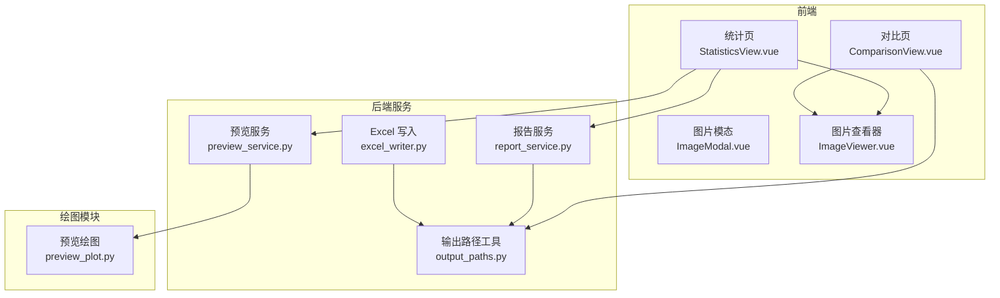
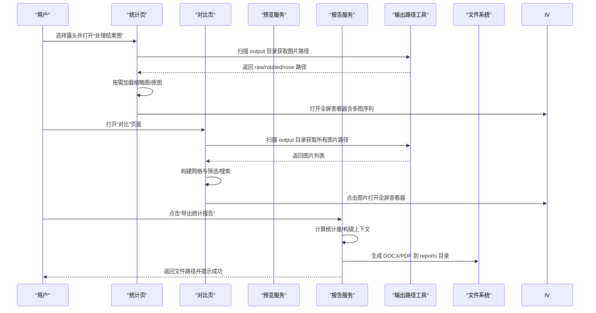
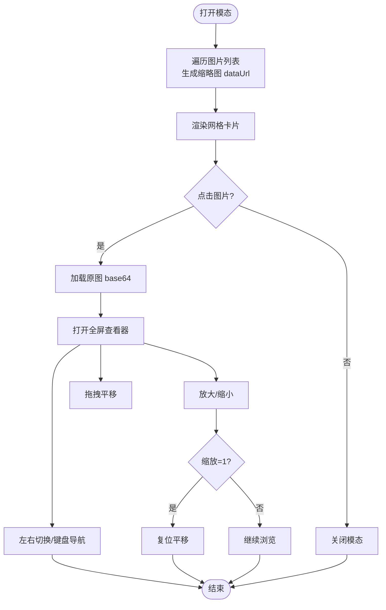
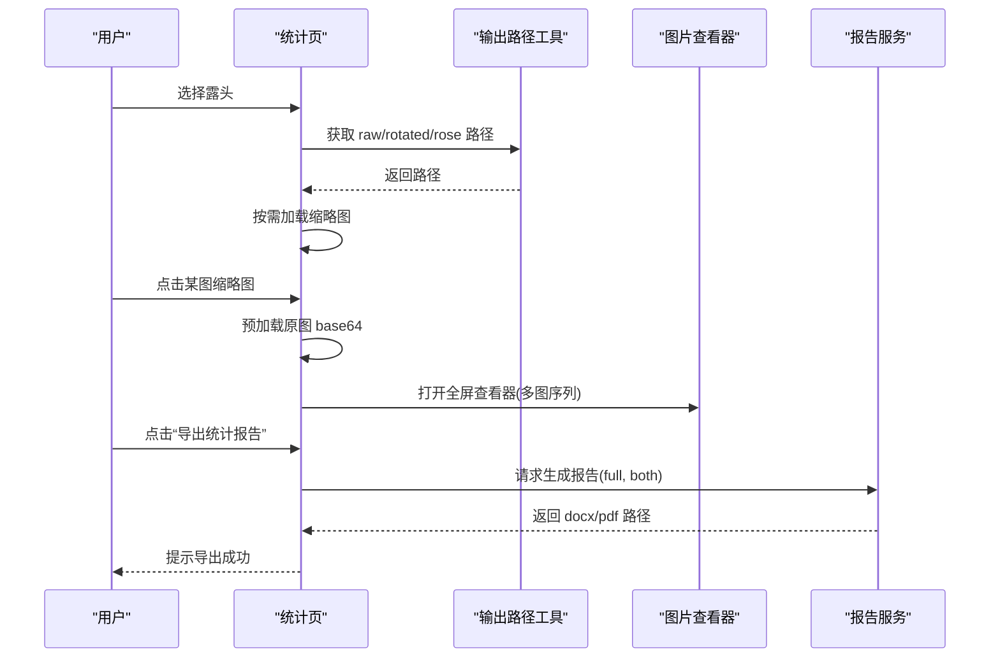
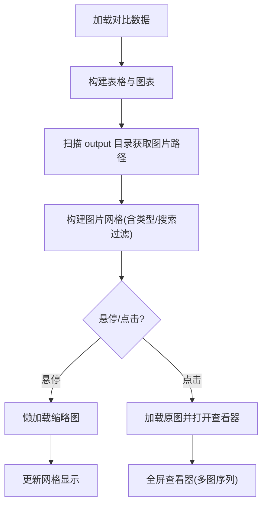
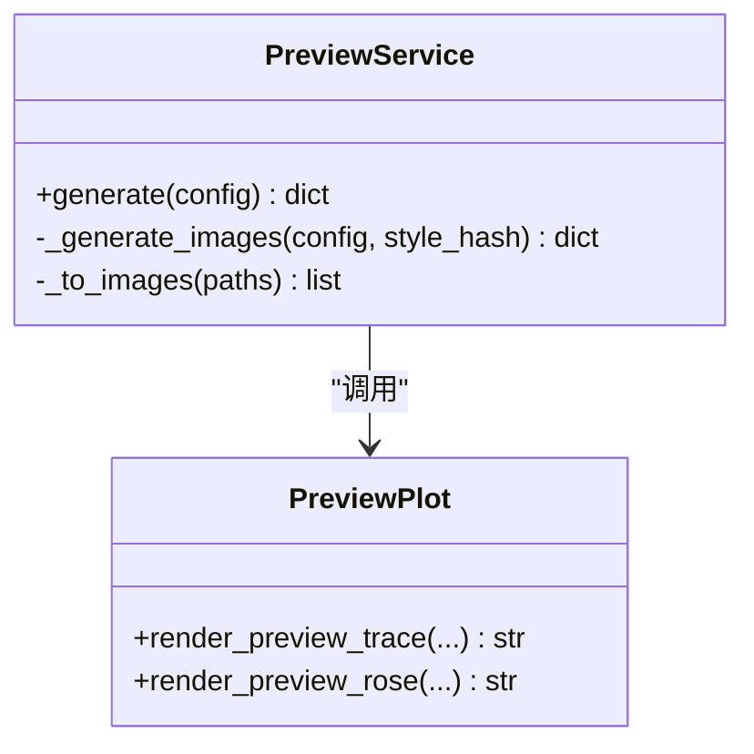
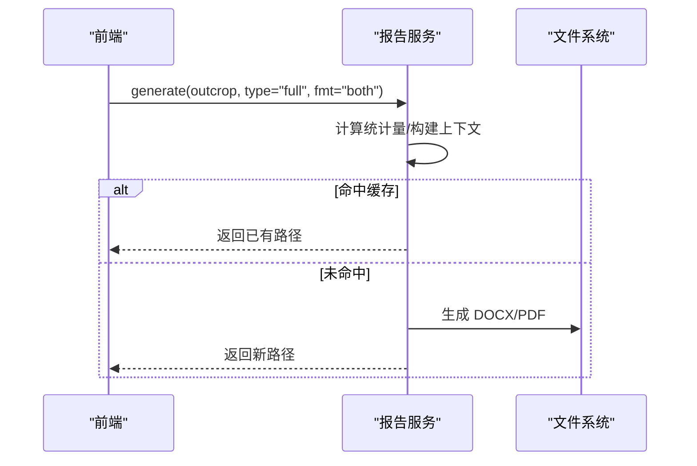
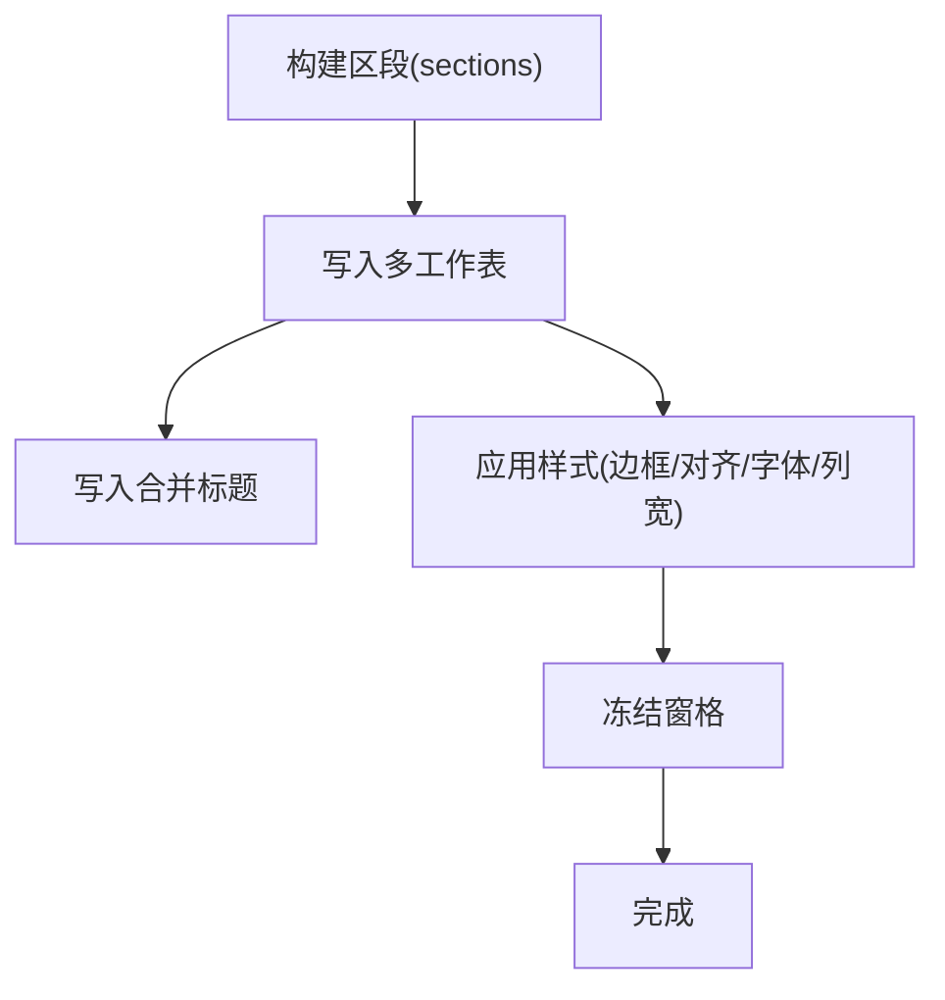
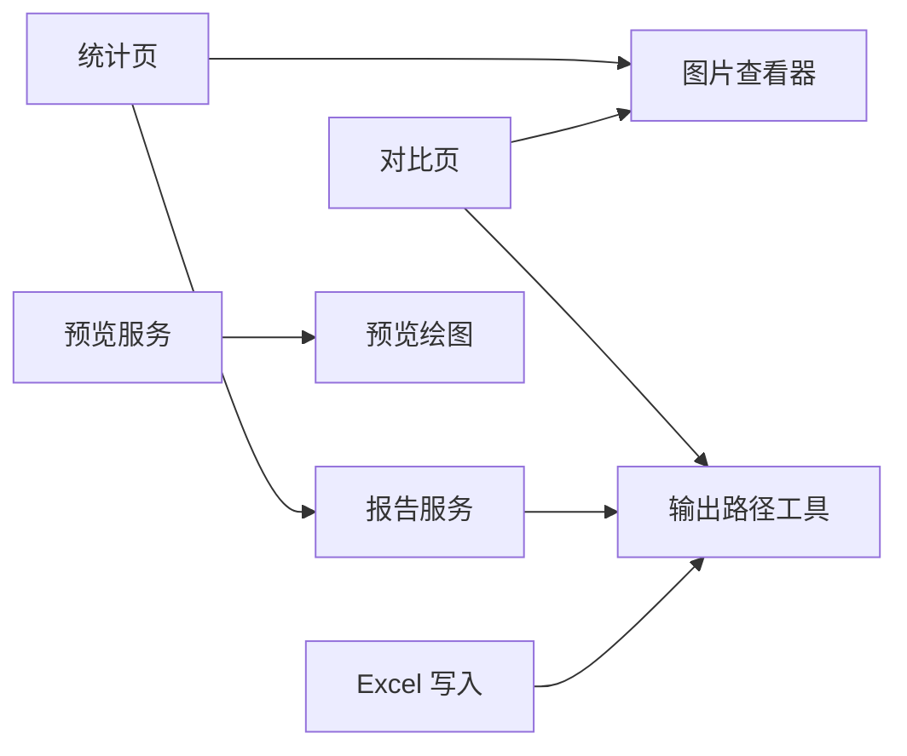

# 结果预览与导出

<cite>
**本文引用的文件**   
- [README.md](file://README.md)
- [StatisticsView.vue](file://frontend/src/views/StatisticsView.vue)
- [ComparisonView.vue](file://frontend/src/views/ComparisonView.vue)
- [ImageModal.vue](file://frontend/src/components/ImageModal.vue)
- [ImageViewer.vue](file://frontend/src/components/ImageViewer.vue)
- [preview_service.py](file://backend/services/preview_service.py)
- [preview_plot.py](file://trace_pipeline/plotting/preview_plot.py)
- [report_service.py](file://backend/services/report_service.py)
- [excel_writer.py](file://trace_pipeline/io/excel_writer.py)
- [output_paths.py](file://trace_pipeline/utils/output_paths.py)
</cite>

## 目录
1. [简介](#简介)
2. [项目结构](#项目结构)
3. [核心组件](#核心组件)
4. [架构总览](#架构总览)
5. [详细组件分析](#详细组件分析)
6. [依赖关系分析](#依赖关系分析)
7. [性能考虑](#性能考虑)
8. [故障排查指南](#故障排查指南)
9. [结论](#结论)
10. [附录](#附录)

## 简介
本指南聚焦“结果预览与导出”功能，覆盖以下使用要点：
- 图片预览模态窗口的使用方法：原始迹线图、旋转迹线图、走向玫瑰图的查看与切换。
- 图片放大缩小、全屏显示、下载保存等基本操作说明。
- 处理结果的详细信息展示：迹线数量统计、测线走向角度、采用的面积源策略、节点识别结果等。
- 结果文件的组织结构：Excel 报告的多工作表布局、PNG 图片的命名规范、输出目录的文件分类。
- 结果导出功能：单个文件导出、批量导出、自定义输出路径设置。
- 结果对比功能：不同参数设置下的结果比较、差异高亮显示。
- 结果质量评估方法：图表可读性检查、数据完整性验证、异常值识别等。

## 项目结构
与结果预览与导出相关的前后端关键位置如下：
- 前端视图与组件
  - 统计页：单露头结果图三标签切换（原始/旋转/玫瑰）与全屏查看器集成
  - 对比页：多露头表格+柱状图+图片网格，支持筛选与懒加载
  - 图片模态与查看器：缩略图网格、全屏查看、缩放平移、键盘导航
- 后端服务
  - 样式预览服务：生成预览图并缓存
  - 报告导出服务：Word/PDF 报告生成与缓存
  - Excel 写入：多工作表布局与样式
  - 输出路径工具：按命名规则检索 PNG 结果图

图示来源
- [StatisticsView.vue:1-612](file://frontend/src/views/StatisticsView.vue#L1-L612)
- [ComparisonView.vue:1-774](file://frontend/src/views/ComparisonView.vue#L1-L774)
- [ImageModal.vue:1-250](file://frontend/src/components/ImageModal.vue#L1-L250)
- [ImageViewer.vue:1-355](file://frontend/src/components/ImageViewer.vue#L1-L355)
- [preview_service.py:1-167](file://backend/services/preview_service.py#L1-L167)
- [preview_plot.py:1-495](file://trace_pipeline/plotting/preview_plot.py#L1-L495)
- [report_service.py:1-579](file://backend/services/report_service.py#L1-L579)
- [excel_writer.py:1-489](file://trace_pipeline/io/excel_writer.py#L1-L489)
- [output_paths.py:1-41](file://trace_pipeline/utils/output_paths.py#L1-L41)

章节来源
- [README.md:132-165](file://README.md#L132-L165)

## 核心组件
- 统计页（单露头）
  - 提供“原始迹线图 / 旋转迹线图 / 走向玫瑰图”三个标签页，点击缩略图进入全屏查看器。
  - 根据是否导出玫瑰图动态显示对应标签。
  - 集成报告导出进度条与消息提示。
- 对比页（多露头）
  - 表格汇总各露头的关键指标（迹线数、P10/P20/P21、平均迹长、走向、类型比例、节点信息）。
  - 柱状图按密度/类型/节点/长度四类指标可视化对比。
  - 图片网格展示所有露头的结果图，支持按类型筛选与关键字搜索，悬停懒加载缩略图。
- 图片模态与查看器
  - 模态窗口以网格形式展示多张结果图，点击后加载原图进行全屏查看。
  - 查看器支持缩放、拖拽平移、左右切换、键盘导航、底部缩放百分比与页码指示。
- 预览服务
  - 基于固定演示数据渲染预览图（原始/旋转/玫瑰），带哈希键与 TTL 缓存，避免重复计算。
- 报告服务
  - 生成 Word/PDF 报告，包含统计文本行与嵌入图片；具备内容级缓存与图片修改失效检测。
- Excel 写入
  - 多工作表布局：基本信息、裂隙情况、计算数据、原始端点坐标、旋转后端点坐标、走向与长度、节点统计/明细/交点等。
  - 单元格字体与对齐、冻结标题行、列宽自适应。
- 输出路径工具
  - 通过命名模式匹配查找 raw/rotated/rose 三类 PNG 结果图。

章节来源
- [StatisticsView.vue:1-612](file://frontend/src/views/StatisticsView.vue#L1-L612)
- [ComparisonView.vue:1-774](file://frontend/src/views/ComparisonView.vue#L1-L774)
- [ImageModal.vue:1-250](file://frontend/src/components/ImageModal.vue#L1-L250)
- [ImageViewer.vue:1-355](file://frontend/src/components/ImageViewer.vue#L1-L355)
- [preview_service.py:1-167](file://backend/services/preview_service.py#L1-L167)
- [report_service.py:1-579](file://backend/services/report_service.py#L1-L579)
- [excel_writer.py:1-489](file://trace_pipeline/io/excel_writer.py#L1-L489)
- [output_paths.py:1-41](file://trace_pipeline/utils/output_paths.py#L1-L41)

## 架构总览
结果预览与导出的端到端流程如下：

图示来源
- [StatisticsView.vue:204-301](file://frontend/src/views/StatisticsView.vue#L204-L301)
- [ComparisonView.vue:386-478](file://frontend/src/views/ComparisonView.vue#L386-L478)
- [output_paths.py:21-41](file://trace_pipeline/utils/output_paths.py#L21-L41)
- [report_service.py:245-364](file://backend/services/report_service.py#L245-L364)

## 详细组件分析

### 图片预览模态窗口与全屏查看器
- 模态窗口（网格预览）
  - 输入图片清单，为每个条目生成缩略图 dataUrl，点击后加载原图进入全屏查看器。
  - 关闭按钮、ESC 关闭、遮罩点击关闭。
- 全屏查看器
  - 顶部工具栏：放大、缩小、重置、关闭；底部显示缩放百分比与页码。
  - 鼠标滚轮缩放、拖拽平移、左右箭头切换、ESC 关闭。
  - 当缩放回到 1x 时自动复位平移偏移。

图示来源
- [ImageModal.vue:69-107](file://frontend/src/components/ImageModal.vue#L69-L107)
- [ImageViewer.vue:155-235](file://frontend/src/components/ImageViewer.vue#L155-L235)

章节来源
- [ImageModal.vue:1-250](file://frontend/src/components/ImageModal.vue#L1-L250)
- [ImageViewer.vue:1-355](file://frontend/src/components/ImageViewer.vue#L1-L355)

### 统计页：三图切换与全屏查看
- 三标签页：原始迹线图、旋转迹线图、走向玫瑰图（仅在已导出玫瑰图时显示）。
- 点击缩略图调用全屏查看器，预先加载三种图片的原图 base64，确保切换流畅。
- 报告导出：触发后端生成 DOCX/PDF，前端轮询进度事件并在完成后提示。

图示来源
- [StatisticsView.vue:204-301](file://frontend/src/views/StatisticsView.vue#L204-L301)
- [StatisticsView.vue:370-400](file://frontend/src/views/StatisticsView.vue#L370-L400)
- [output_paths.py:21-41](file://trace_pipeline/utils/output_paths.py#L21-L41)
- [report_service.py:245-364](file://backend/services/report_service.py#L245-L364)

章节来源
- [StatisticsView.vue:1-612](file://frontend/src/views/StatisticsView.vue#L1-L612)

### 对比页：多露头结果对比与图片网格
- 表格汇总：迹线数、P10/P20/P21、平均迹长、走向、I/II/III 型比例、节点总数/比例/密度（若启用节点识别）。
- 柱状图：密度指标、裂隙类型、节点指标、面积/长度四类视图可切换。
- 图片网格：按类型筛选（全部/原始迹线/旋转迹线/走向玫瑰）、关键字搜索露头名；悬停懒加载缩略图，点击全屏查看器。

图示来源
- [ComparisonView.vue:386-478](file://frontend/src/views/ComparisonView.vue#L386-L478)
- [ComparisonView.vue:218-286](file://frontend/src/views/ComparisonView.vue#L218-L286)

章节来源
- [ComparisonView.vue:1-774](file://frontend/src/views/ComparisonView.vue#L1-L774)

### 预览服务与预览绘图
- 预览服务
  - 对样式配置做哈希，命中缓存直接返回路径与 images 数组。
  - 未命中则调用预览绘图模块生成原始/旋转/玫瑰三图，落盘并缓存。
- 预览绘图
  - 使用硬编码演示数据，独立于正式业务逻辑，仅用于观察样式效果。
  - 支持控制凸包、圆窗、节点覆盖层显示开关。

图示来源
- [preview_service.py:37-167](file://backend/services/preview_service.py#L37-L167)
- [preview_plot.py:285-495](file://trace_pipeline/plotting/preview_plot.py#L285-L495)

章节来源
- [preview_service.py:1-167](file://backend/services/preview_service.py#L1-L167)
- [preview_plot.py:1-495](file://trace_pipeline/plotting/preview_plot.py#L1-L495)

### 报告导出服务
- 生成 Word/PDF 报告，包含统计文本行与嵌入图片。
- 基于配置指纹与图片 mtime 的缓存机制，避免重复生成。
- 跨平台字体探测与回退，中文/拉丁混排段落拆分。

图示来源
- [report_service.py:245-364](file://backend/services/report_service.py#L245-L364)

章节来源
- [report_service.py:1-579](file://backend/services/report_service.py#L1-L579)

### Excel 多工作表导出与布局
- 工作表分区
  - 基本信息：测线走向、测线长度、平均迹长、露头面积（含来源标注）。
  - 裂隙情况：迹线数量、I/II/III 型计数。
  - 计算数据：P₁₀/P₂₀/P₂₁、有效取样窗数量、校验告警。
  - 原始端点坐标、旋转后端点坐标、走向与长度（含类型）。
  - 节点统计/明细/交点（可选）。
- 样式与可读性
  - 标题合并居中、冻结首行与表头、列宽自适应、数字格式统一。
  - 中英文混合字体：中文黑体/宋体，英文/数字 Times New Roman。

图示来源
- [excel_writer.py:280-489](file://trace_pipeline/io/excel_writer.py#L280-L489)

章节来源
- [excel_writer.py:1-489](file://trace_pipeline/io/excel_writer.py#L1-L489)

### 结果文件组织与命名规范
- PNG 图片命名
  - 原始迹线图：{露头}_raw(n=N).png
  - 旋转迹线图：{露头}_rotated(strike=X).png
  - 走向玫瑰图：{露头}_rose(bin=X).png
- 输出目录分类
  - 结果图片位于输出目录根或子目录（由配置决定），通过命名模式检索。
- Excel 报告
  - 多工作表，每区一个 sheet，便于阅读与打印。

章节来源
- [README.md:132-165](file://README.md#L132-L165)
- [output_paths.py:21-41](file://trace_pipeline/utils/output_paths.py#L21-L41)

### 结果导出功能
- 单个文件导出
  - 在统计页点击“导出统计报告”，选择 full 类型与 both 格式，生成 DOCX/PDF。
- 批量导出
  - 可在对比页或处理页循环调用导出接口，结合进度轮询实现批量任务。
- 自定义输出路径
  - 通过配置项指定输出目录；报告默认写入 reports 目录，图片写入输出目录。

章节来源
- [StatisticsView.vue:370-400](file://frontend/src/views/StatisticsView.vue#L370-L400)
- [report_service.py:245-364](file://backend/services/report_service.py#L245-L364)
- [README.md:418-473](file://README.md#L418-L473)

### 结果对比功能
- 表格对比
  - 展示迹线数、密度指标、平均迹长、走向、类型比例、节点指标（若启用）。
- 图表对比
  - 密度指标、裂隙类型、节点指标、面积/长度四类柱状图，支持图例显隐。
- 差异高亮
  - 当前实现以数值与图形呈现差异；如需高亮显著差异，可在前端增加阈值判断与颜色标记。

章节来源
- [ComparisonView.vue:1-774](file://frontend/src/views/ComparisonView.vue#L1-L774)

### 结果质量评估方法
- 图表可读性检查
  - 确认原始/旋转/玫瑰图清晰可见，指北针、比例尺、统计框完整。
  - 检查图例与覆盖层（凸包/圆窗/节点）是否正确显示。
- 数据完整性验证
  - 核对迹线数量、类型计数与 P₁₀/P₂₀/P₂₁ 一致性。
  - 检查 Excel 中“基本信息/裂隙情况/计算数据”字段是否齐全。
- 异常值识别
  - 关注面积来源降级提示（缓冲凸包/圆窗等效），必要时调整圆窗策略或最小交切数。
  - 节点识别结果中的退化线段跳过数与合并容差需合理。

章节来源
- [excel_writer.py:193-273](file://trace_pipeline/io/excel_writer.py#L193-L273)
- [preview_plot.py:285-447](file://trace_pipeline/plotting/preview_plot.py#L285-L447)

## 依赖关系分析
- 前端依赖
  - 统计页与对比页均依赖图片查看器与输出路径工具。
  - 报告导出依赖后端报告服务。
- 后端依赖
  - 预览服务依赖预览绘图模块与样式配置。
  - 报告服务依赖统计计算与图片路径解析。
  - Excel 写入依赖统计与节点分析结果。

图示来源
- [StatisticsView.vue:1-612](file://frontend/src/views/StatisticsView.vue#L1-L612)
- [ComparisonView.vue:1-774](file://frontend/src/views/ComparisonView.vue#L1-L774)
- [preview_service.py:1-167](file://backend/services/preview_service.py#L1-L167)
- [preview_plot.py:1-495](file://trace_pipeline/plotting/preview_plot.py#L1-L495)
- [report_service.py:1-579](file://backend/services/report_service.py#L1-L579)
- [excel_writer.py:1-489](file://trace_pipeline/io/excel_writer.py#L1-L489)
- [output_paths.py:1-41](file://trace_pipeline/utils/output_paths.py#L1-L41)

章节来源
- [StatisticsView.vue:1-612](file://frontend/src/views/StatisticsView.vue#L1-L612)
- [ComparisonView.vue:1-774](file://frontend/src/views/ComparisonView.vue#L1-L774)
- [preview_service.py:1-167](file://backend/services/preview_service.py#L1-L167)
- [preview_plot.py:1-495](file://trace_pipeline/plotting/preview_plot.py#L1-L495)
- [report_service.py:1-579](file://backend/services/report_service.py#L1-L579)
- [excel_writer.py:1-489](file://trace_pipeline/io/excel_writer.py#L1-L489)
- [output_paths.py:1-41](file://trace_pipeline/utils/output_paths.py#L1-L41)

## 性能考虑
- 图片懒加载与并发控制
  - 对比页采用队列与并发上限控制缩略图与原图加载，避免一次性占用过多内存。
- 缓存体系
  - 预览服务与报告服务均使用 TTL 缓存，减少重复计算与 IO。
- 分辨率与 DPI
  - 预览图使用较低 DPI 提升交互速度；最终导出可使用更高 DPI 保证质量。

[本节为通用指导，不直接分析具体文件]

## 故障排查指南
- 图片无法加载
  - 检查输出目录是否存在对应命名规范的 PNG 文件。
  - 确认前端缩略图/原图加载函数返回路径正确。
- 报告导出失败
  - 检查依赖是否安装（python-docx/reportlab）。
  - 查看日志中的错误信息与字体注册失败提示。
- Excel 样式异常
  - 确认 openpyxl 可用，检查单元格字体与合并区域设置。

章节来源
- [report_service.py:416-579](file://backend/services/report_service.py#L416-L579)
- [excel_writer.py:400-489](file://trace_pipeline/io/excel_writer.py#L400-L489)

## 结论
本指南系统梳理了结果预览与导出的前后端实现与使用方式，涵盖图片预览、全屏查看、导出报告、Excel 多工作表布局、结果文件组织、对比分析与质量评估等关键环节。建议在实际使用中结合缓存与懒加载策略优化体验，并通过统计与图表交叉验证结果质量。

[本节为总结性内容，不直接分析具体文件]

## 附录
- 快速操作清单
  - 打开统计页 → 选择露头 → 切换“原始/旋转/玫瑰”标签 → 点击缩略图全屏查看。
  - 导出报告 → 点击“导出统计报告” → 等待进度完成 → 在 reports 目录查看 DOCX/PDF。
  - 对比分析 → 打开对比页 → 切换图表指标 → 筛选/搜索图片 → 点击全屏查看。

[本节为补充说明，不直接分析具体文件]