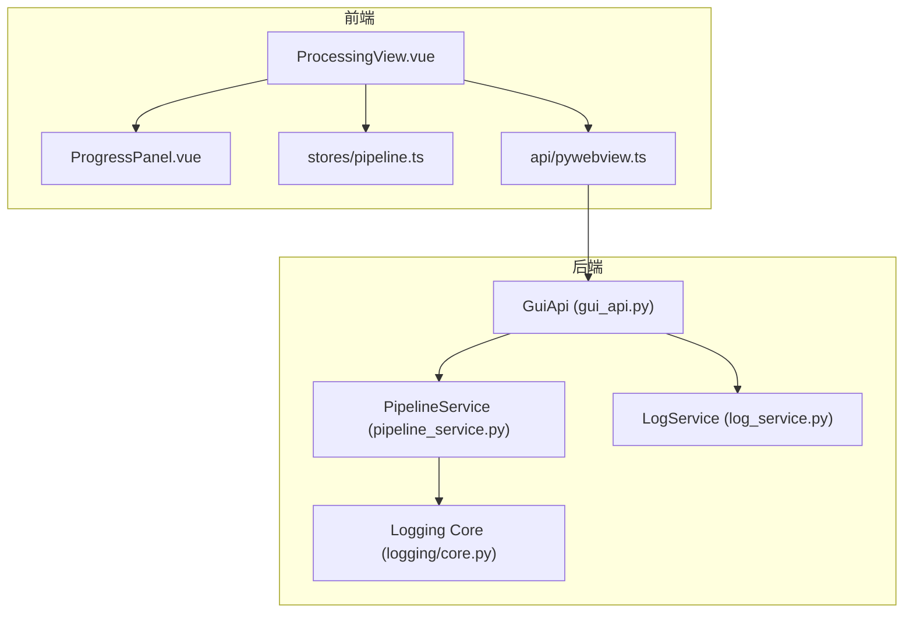
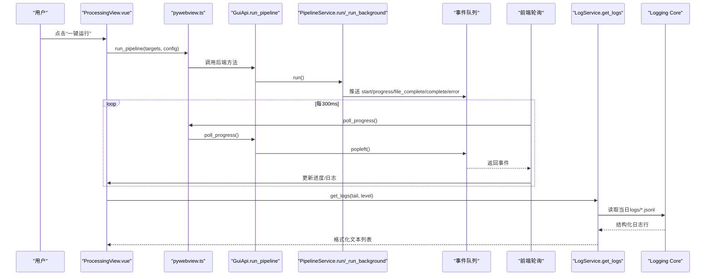
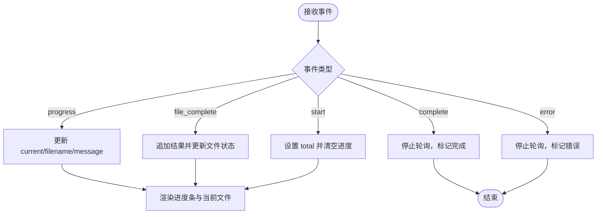
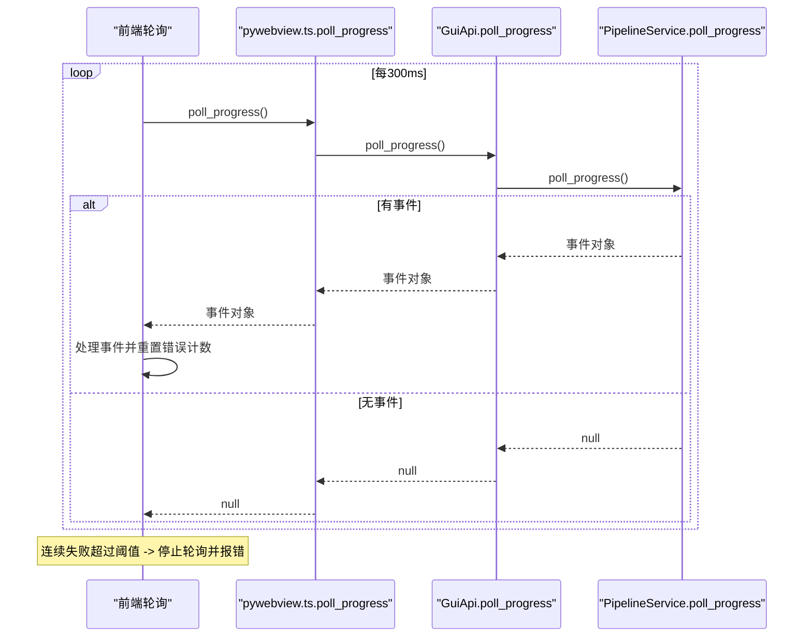
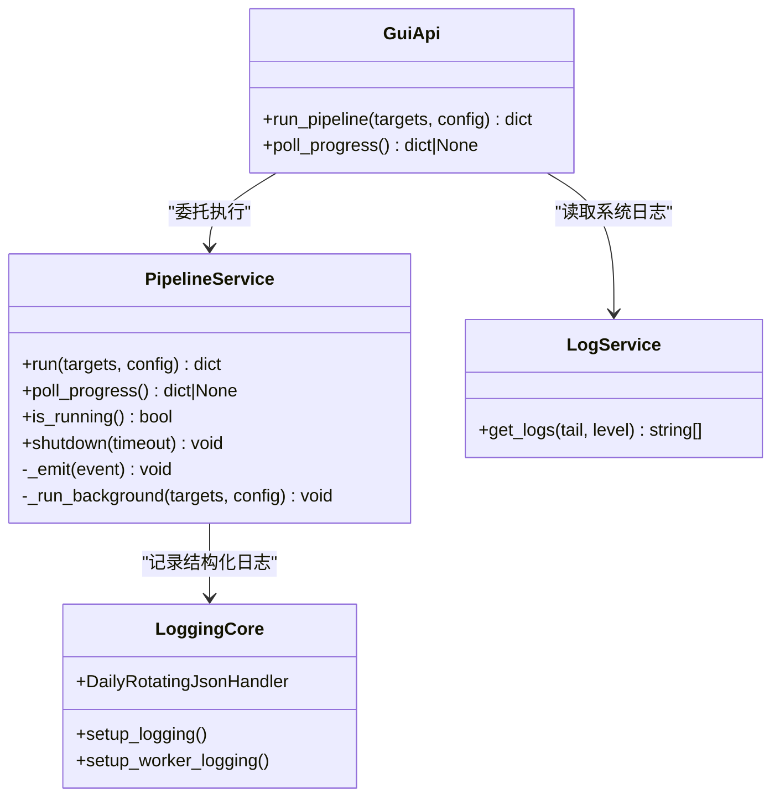
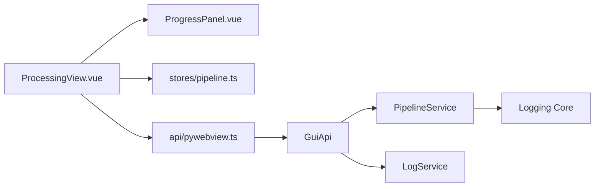

# 进度监控与日志

<cite>
**本文引用的文件列表**
- [ProgressPanel.vue](file://frontend/src/components/ProgressPanel.vue)
- [ProcessingView.vue](file://frontend/src/views/ProcessingView.vue)
- [pipeline.ts](file://frontend/src/stores/pipeline.ts)
- [pywebview.ts](file://frontend/src/api/pywebview.ts)
- [gui_api.py](file://backend/gui_api.py)
- [pipeline_service.py](file://backend/services/pipeline_service.py)
- [log_service.py](file://backend/services/log_service.py)
- [core.py](file://trace_pipeline/logging/core.py)
</cite>

## 目录
1. [简介](#简介)
2. [项目结构](#项目结构)
3. [核心组件](#核心组件)
4. [架构总览](#架构总览)
5. [详细组件分析](#详细组件分析)
6. [依赖关系分析](#依赖关系分析)
7. [性能考虑](#性能考虑)
8. [故障排查指南](#故障排查指南)
9. [结论](#结论)

## 简介
本说明聚焦于“进度监控与日志”子系统，覆盖以下能力：
- 实时进度条展示：当前处理文件、总文件数、百分比等
- 状态指示器：空闲/运行中/完成/错误及其视觉标识
- 处理过程日志面板：日志类型（信息/成功/错误）、时间戳、消息解读
- 并行处理控制滑块：进程数量调整、优化建议、资源占用考量
- 轮询机制：前端定时查询后端状态、错误重试、连接断开处理
- 日志过滤与搜索：快速定位关键信息
- 常见错误含义与解决建议

## 项目结构
该子系统由前后端协同实现：
- 前端
  - 视图层：处理页面与进度面板
  - 状态管理：流水线运行状态与结果缓存
  - API 封装：调用后端 GUI API
- 后端
  - GUI API 入口：暴露 run_pipeline、poll_progress、get_logs 等方法
  - 流水线服务：后台线程 + 多进程执行，事件队列推送进度
  - 日志服务：读取 JSON Lines 日志并格式化输出
  - 日志核心：JSON 序列化、按天归档、分片、worker 独立日志

图表来源
- [ProcessingView.vue:1-120](file://frontend/src/views/ProcessingView.vue#L1-L120)
- [ProgressPanel.vue:1-120](file://frontend/src/components/ProgressPanel.vue#L1-L120)
- [pipeline.ts:1-56](file://frontend/src/stores/pipeline.ts#L1-L56)
- [pywebview.ts:294-337](file://frontend/src/api/pywebview.ts#L294-L337)
- [gui_api.py:388-456](file://backend/gui_api.py#L388-L456)
- [pipeline_service.py:32-120](file://backend/services/pipeline_service.py#L32-L120)
- [log_service.py:57-142](file://backend/services/log_service.py#L57-L142)
- [core.py:148-305](file://trace_pipeline/logging/core.py#L148-L305)

章节来源
- [ProcessingView.vue:1-120](file://frontend/src/views/ProcessingView.vue#L1-L120)
- [ProgressPanel.vue:1-120](file://frontend/src/components/ProgressPanel.vue#L1-L120)
- [pipeline.ts:1-56](file://frontend/src/stores/pipeline.ts#L1-L56)
- [pywebview.ts:294-337](file://frontend/src/api/pywebview.ts#L294-L337)
- [gui_api.py:388-456](file://backend/gui_api.py#L388-L456)
- [pipeline_service.py:32-120](file://backend/services/pipeline_service.py#L32-L120)
- [log_service.py:57-142](file://backend/services/log_service.py#L57-L142)
- [core.py:148-305](file://trace_pipeline/logging/core.py#L148-L305)

## 核心组件
- 进度面板（ProgressPanel）
  - 显示任务计数、运行状态标签、平滑进度条、当前文件名与消息
  - 提供“一键运行”按钮与并行进程滑块
- 处理视图（ProcessingView）
  - 聚合参数面板、文件列表、进度面板、处理过程日志
  - 负责启动流水线、轮询进度、记录本地日志、错误提示
- 流水线服务（PipelineService）
  - 后台线程执行批处理，使用多进程池并行
  - 通过线程安全队列向轮询接口推送事件（start/progress/file_complete/complete/error）
- GUI API（GuiApi）
  - 暴露 run_pipeline、poll_progress、get_logs 等前端可调方法
- 日志服务（LogService）
  - 读取当天 logs 目录下 JSON Lines 文件，支持级别过滤与尾部读取
- 日志核心（Logging Core）
  - JSON 格式化、按天归档、单文件大小分片、worker 独立日志

章节来源
- [ProgressPanel.vue:1-165](file://frontend/src/components/ProgressPanel.vue#L1-L165)
- [ProcessingView.vue:155-518](file://frontend/src/views/ProcessingView.vue#L155-L518)
- [pipeline_service.py:32-120](file://backend/services/pipeline_service.py#L32-L120)
- [gui_api.py:388-456](file://backend/gui_api.py#L388-L456)
- [log_service.py:57-142](file://backend/services/log_service.py#L57-L142)
- [core.py:148-305](file://trace_pipeline/logging/core.py#L148-L305)

## 架构总览
下图展示了从用户点击“一键运行”到进度更新、日志落盘的完整链路。

图表来源
- [ProcessingView.vue:354-518](file://frontend/src/views/ProcessingView.vue#L354-L518)
- [pywebview.ts:294-337](file://frontend/src/api/pywebview.ts#L294-L337)
- [gui_api.py:388-456](file://backend/gui_api.py#L388-L456)
- [pipeline_service.py:100-346](file://backend/services/pipeline_service.py#L100-L346)
- [log_service.py:78-142](file://backend/services/log_service.py#L78-L142)
- [core.py:148-305](file://trace_pipeline/logging/core.py#L148-L305)

## 详细组件分析

### 实时进度条与状态指示器
- 显示内容
  - 任务计数：当前/总数
  - 状态标签：等待任务/流水线运行中
  - 进度百分比：基于 current/total 计算，带平滑插值动画
  - 当前文件与消息：filename 与 message
- 状态语义
  - 空闲：未开始或无数据
  - 运行中：running=true，进度条高亮发光
  - 完成：running=false 且 current>=total，显示“全部处理完成”
  - 错误：轮询连续失败或后端返回 error 事件时，界面进入错误态
- 视觉标识
  - 运行中：卡片边框发光、进度条渐变+扫光动画
  - 完成：进度条颜色切换为成功色
  - 错误：处理过程面板边框闪烁红色

图表来源
- [ProcessingView.vue:444-518](file://frontend/src/views/ProcessingView.vue#L444-L518)
- [ProgressPanel.vue:81-165](file://frontend/src/components/ProgressPanel.vue#L81-L165)

章节来源
- [ProgressPanel.vue:1-165](file://frontend/src/components/ProgressPanel.vue#L1-L165)
- [ProcessingView.vue:444-518](file://frontend/src/views/ProcessingView.vue#L444-L518)

### 并行处理控制滑块
- 功能
  - 滑块与输入框双向绑定，范围受设备 CPU 核心数上限限制
  - 默认自动根据硬件并发计算最大允许值
- 行为
  - 修改后同步至配置 store，并在下次运行时作为 parallel_workers 传入后端
  - 后端根据请求值与 CPU 核心数裁剪实际工作进程数
- 建议
  - 一般设置为 CPU 核心数；I/O 密集场景可适当降低以避免争用
  - 大文件绘图/Excel 写入时，过高并发可能增加内存压力

章节来源
- [ProgressPanel.vue:78-80](file://frontend/src/components/ProgressPanel.vue#L78-L80)
- [ProcessingView.vue:168-186](file://frontend/src/views/ProcessingView.vue#L168-L186)
- [pipeline_service.py:146-175](file://backend/services/pipeline_service.py#L146-L175)

### 处理过程日志面板
- 功能
  - 记录运行期关键节点：启动、每个文件完成、整体完成/错误
  - 每条日志包含时间戳、类型（info/success/error）、消息
  - 自动滚动到底部，限制最大条目数避免 UI 卡顿
- 解读
  - info：流程性信息（如参数、开始）
  - success：单个文件或整体成功
  - error：错误或警告提示（含常见错误原因与建议）

章节来源
- [ProcessingView.vue:155-200](file://frontend/src/views/ProcessingView.vue#L155-L200)
- [ProcessingView.vue:444-518](file://frontend/src/views/ProcessingView.vue#L444-L518)

### 轮询机制与错误重试
- 工作原理
  - 前端每 300ms 调用 poll_progress，循环消费队列中的事件直到为空
  - 成功后重置错误计数，继续下一次轮询
- 错误处理
  - 连续 N 次失败则停止轮询，标记错误并提示检查后端
  - 完成后主动停止轮询，释放定时器
- 连接断开
  - 若后端不可用，前端在达到阈值后降级为错误态，需手动刷新或重启后端

图表来源
- [ProcessingView.vue:405-442](file://frontend/src/views/ProcessingView.vue#L405-L442)
- [pywebview.ts:303](file://frontend/src/api/pywebview.ts#L303)
- [gui_api.py:447-456](file://backend/gui_api.py#L447-L456)
- [pipeline_service.py:66-72](file://backend/services/pipeline_service.py#L66-L72)

章节来源
- [ProcessingView.vue:405-442](file://frontend/src/views/ProcessingView.vue#L405-L442)
- [gui_api.py:447-456](file://backend/gui_api.py#L447-L456)
- [pipeline_service.py:66-72](file://backend/services/pipeline_service.py#L66-L72)

### 日志过滤与搜索
- 后端日志读取
  - 仅读取当天 logs 目录下的 JSON Lines 文件，按修改时间倒序取最近若干文件
  - 支持级别过滤（DEBUG/INFO/WARNING/ERROR/CRITICAL），ALL 不过滤
  - 采用反向读取 tail 方式，避免加载大文件全量内容
- 前端展示
  - 处理过程日志为运行期本地记录，不包含历史系统日志
  - 如需查看历史系统日志，可通过“日志”相关 API 获取并按级别筛选

章节来源
- [log_service.py:78-142](file://backend/services/log_service.py#L78-L142)
- [core.py:148-305](file://trace_pipeline/logging/core.py#L148-L305)

### 后端并行执行与事件推送
- 并行策略
  - 根据 parallel_workers 与 CPU 核心数确定实际 worker 数
  - 使用多进程池提交任务，as_completed 逐个回收结果
- 事件推送
  - start：批次开始，携带 total
  - progress：每完成一个目标，推送 current/total/filename/message
  - file_complete：附带结果摘要（统计、路径、错误信息等）
  - complete：全部完成，携带 completed_count
  - error：异常捕获后上报

图表来源
- [pipeline_service.py:32-120](file://backend/services/pipeline_service.py#L32-L120)
- [gui_api.py:388-456](file://backend/gui_api.py#L388-L456)
- [log_service.py:57-142](file://backend/services/log_service.py#L57-L142)
- [core.py:148-305](file://trace_pipeline/logging/core.py#L148-L305)

章节来源
- [pipeline_service.py:100-346](file://backend/services/pipeline_service.py#L100-L346)
- [gui_api.py:388-456](file://backend/gui_api.py#L388-L456)
- [log_service.py:57-142](file://backend/services/log_service.py#L57-L142)
- [core.py:148-305](file://trace_pipeline/logging/core.py#L148-L305)

## 依赖关系分析
- 前端
  - ProcessingView 依赖 ProgressPanel、stores/pipeline、api/pywebview
  - api/pywebview 将调用转发到后端 GuiApi
- 后端
  - GuiApi 组合 PipelineService、LogService
  - PipelineService 使用 logging core 写入 JSON Lines 日志
  - LogService 读取 logs 目录下的 JSON Lines 文件

图表来源
- [ProcessingView.vue:1-120](file://frontend/src/views/ProcessingView.vue#L1-L120)
- [ProgressPanel.vue:1-120](file://frontend/src/components/ProgressPanel.vue#L1-L120)
- [pipeline.ts:1-56](file://frontend/src/stores/pipeline.ts#L1-L56)
- [pywebview.ts:294-337](file://frontend/src/api/pywebview.ts#L294-L337)
- [gui_api.py:388-456](file://backend/gui_api.py#L388-L456)
- [pipeline_service.py:32-120](file://backend/services/pipeline_service.py#L32-L120)
- [log_service.py:57-142](file://backend/services/log_service.py#L57-L142)
- [core.py:148-305](file://trace_pipeline/logging/core.py#L148-L305)

## 性能考虑
- 轮询间隔
  - 默认 300ms，兼顾实时性与网络开销；可根据任务规模适当调整
- 并行度
  - 合理设置 parallel_workers，避免过多进程导致上下文切换与内存压力
- 日志 I/O
  - 日志按天归档与分片，避免单文件过大影响读取性能
  - 前端读取日志时限制 tail 行数，减少传输与渲染成本

[本节为通用指导，不直接分析具体文件]

## 故障排查指南
- 轮询失败（连续多次）
  - 现象：前端提示“与后端通信失败”，进度停止
  - 排查：确认后端是否仍在运行；检查网络桥接是否正常；必要时重启应用
  - 参考：轮询错误计数与停止逻辑
- 权限错误（PermissionError）
  - 现象：某个文件处理失败，提示“文件被占用或权限不足”
  - 处理：关闭已打开的输出文件（如 Excel/WPS），重新运行
  - 参考：错误提示生成与消息提示
- 文件不存在（FileNotFoundError）
  - 现象：提示“输入文件不存在”
  - 处理：检查 input 目录与文件名是否正确
  - 参考：错误提示生成与消息提示
- 进度不更新
  - 现象：点击运行后进度无变化
  - 排查：查看后端日志是否有 start/progress 事件；确认 GUI API 的 poll_progress 是否返回事件
  - 参考：后端事件推送与前端轮询处理

章节来源
- [ProcessingView.vue:405-442](file://frontend/src/views/ProcessingView.vue#L405-L442)
- [ProcessingView.vue:460-518](file://frontend/src/views/ProcessingView.vue#L460-L518)
- [pipeline_service.py:289-305](file://backend/services/pipeline_service.py#L289-L305)
- [gui_api.py:447-456](file://backend/gui_api.py#L447-L456)

## 结论
本子系统通过“前端轮询 + 后端事件队列 + 结构化日志”的组合，提供了直观可靠的进度反馈与可追溯的运行日志。合理的并行度设置与轮询间隔可在保证用户体验的同时兼顾系统稳定性。遇到常见问题时，依据错误提示与日志线索进行定位，通常能快速恢复。