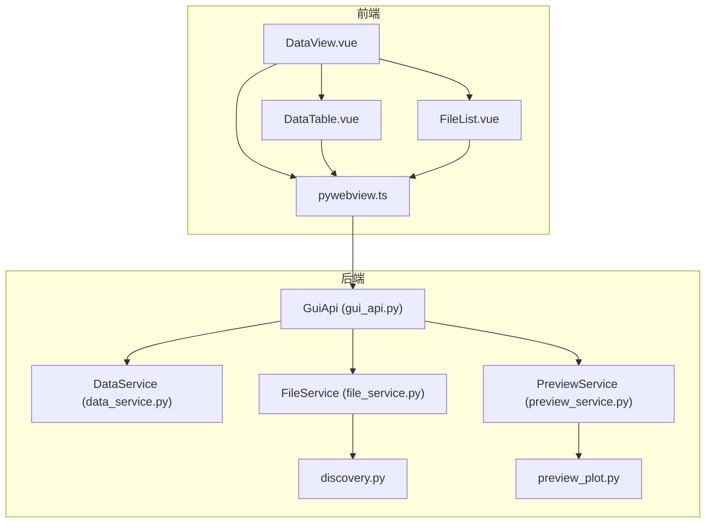
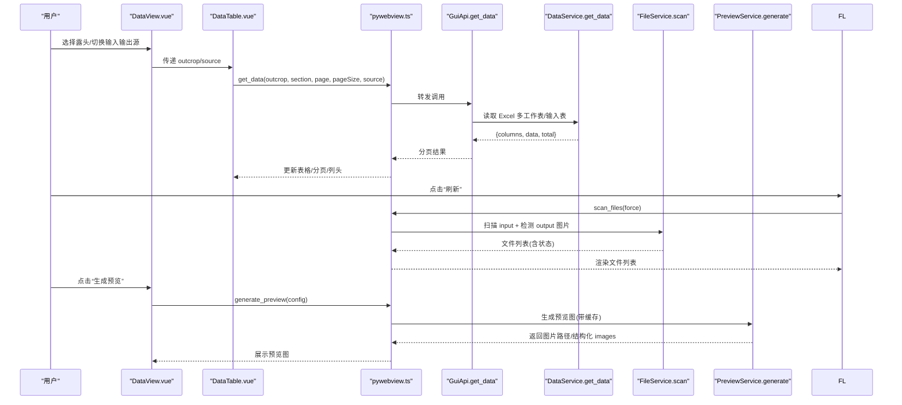
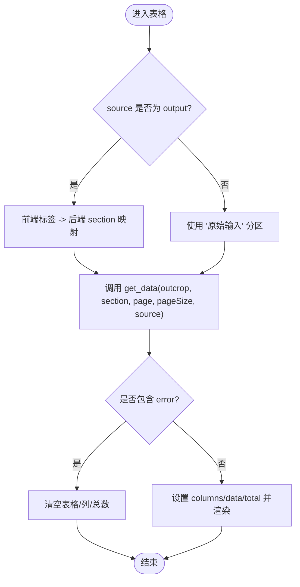
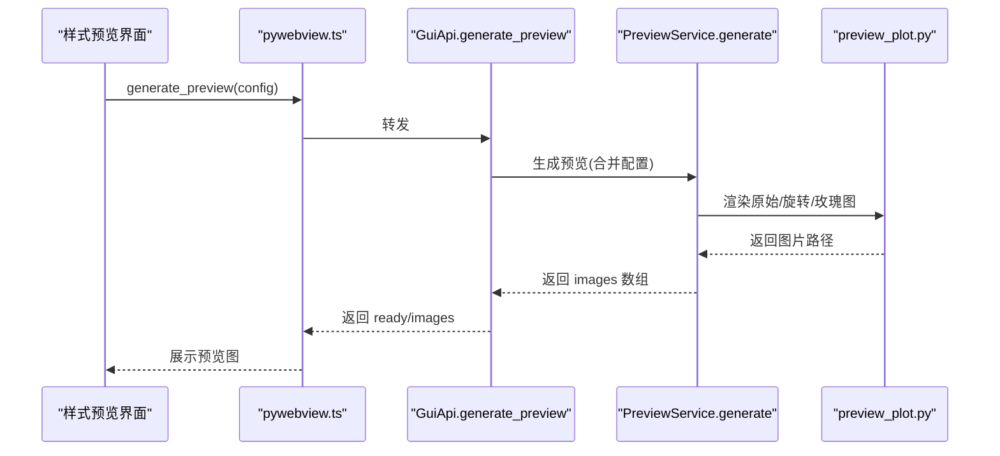
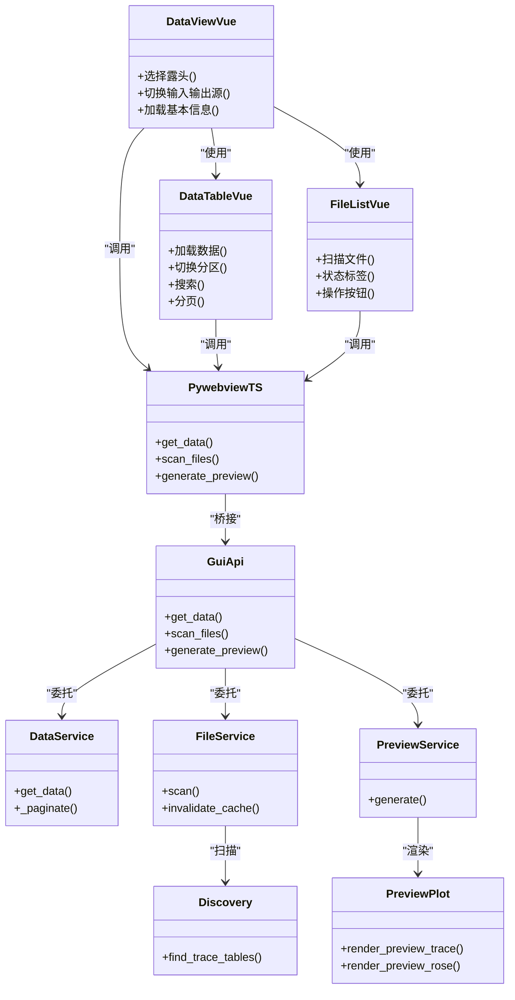

# 数据浏览页面

<cite>
**本文引用的文件列表**
- [DataView.vue](file://frontend/src/views/DataView.vue)
- [DataTable.vue](file://frontend/src/components/DataTable.vue)
- [FileList.vue](file://frontend/src/components/FileList.vue)
- [pywebview.ts](file://frontend/src/api/pywebview.ts)
- [gui_api.py](file://backend/gui_api.py)
- [data_service.py](file://backend/services/data_service.py)
- [file_service.py](file://backend/services/file_service.py)
- [preview_service.py](file://backend/services/preview_service.py)
- [discovery.py](file://trace_pipeline/io/discovery.py)
- [preview_plot.py](file://trace_pipeline/plotting/preview_plot.py)
</cite>

## 目录
1. [简介](#简介)
2. [项目结构](#项目结构)
3. [核心组件](#核心组件)
4. [架构总览](#架构总览)
5. [详细组件分析](#详细组件分析)
6. [依赖关系分析](#依赖关系分析)
7. [性能与大数据处理](#性能与大数据处理)
8. [故障排查指南](#故障排查指南)
9. [结论](#结论)
10. [附录：操作手册](#附录操作手册)

## 简介
本手册面向“数据浏览页面”的使用者，系统介绍数据表格的浏览、排序、筛选与搜索；文件列表的管理（扫描、预览、打开图片、触发处理）；数据预览（原始/处理后对比、样式预览图生成）；分页加载与大数据集处理机制；以及导出与分享功能的使用方法。文档同时提供架构图与流程图，帮助读者快速理解前后端交互与关键流程。

## 项目结构
数据浏览页面由前端视图与后端服务协同完成：
- 前端
  - 视图层：数据页入口与工具栏（选择露头、切换输入/输出源）
  - 组件层：数据表格（分页、排序、搜索）、文件列表（扫描、状态、操作）
  - API 封装：统一调用后端方法，支持开发环境 Mock
- 后端
  - GUI API 入口：对外暴露 JS 可调用的方法集合，负责权限校验、缓存、并发控制
  - 服务层：数据读取（Excel 多工作表/输入表）、文件扫描、统计、预览图生成等
  - IO 发现：按规则扫描输入目录中的迹线表文件
  - 绘图预览：独立于业务逻辑的预览渲染模块

图表来源
- [DataView.vue:1-120](file://frontend/src/views/DataView.vue#L1-L120)
- [DataTable.vue:1-120](file://frontend/src/components/DataTable.vue#L1-L120)
- [FileList.vue:1-120](file://frontend/src/components/FileList.vue#L1-L120)
- [pywebview.ts:1-120](file://frontend/src/api/pywebview.ts#L1-L120)
- [gui_api.py:520-600](file://backend/gui_api.py#L520-L600)
- [data_service.py:1-120](file://backend/services/data_service.py#L1-L120)
- [file_service.py:1-100](file://backend/services/file_service.py#L1-L100)
- [preview_service.py:1-120](file://backend/services/preview_service.py#L1-L120)
- [discovery.py:1-63](file://trace_pipeline/io/discovery.py#L1-L63)
- [preview_plot.py:1-120](file://trace_pipeline/plotting/preview_plot.py#L1-L120)

章节来源
- [DataView.vue:1-180](file://frontend/src/views/DataView.vue#L1-L180)
- [DataTable.vue:1-142](file://frontend/src/components/DataTable.vue#L1-L142)
- [FileList.vue:1-115](file://frontend/src/components/FileList.vue#L1-L115)
- [pywebview.ts:1-120](file://frontend/src/api/pywebview.ts#L1-L120)
- [gui_api.py:520-600](file://backend/gui_api.py#L520-L600)
- [data_service.py:1-120](file://backend/services/data_service.py#L1-L120)
- [file_service.py:1-100](file://backend/services/file_service.py#L1-L100)
- [preview_service.py:1-120](file://backend/services/preview_service.py#L1-L120)
- [discovery.py:1-63](file://trace_pipeline/io/discovery.py#L1-L63)
- [preview_plot.py:1-120](file://trace_pipeline/plotting/preview_plot.py#L1-L120)

## 核心组件
- 数据页视图（DataView.vue）
  - 提供“露头选择器”和“输入/输出源切换”
  - 在输出模式下展示基本信息卡片（测线走向、迹线条数、长度、面积、平均迹长、面积来源）
  - 通过 DataTable 组件承载数据表格
- 数据表格（DataTable.vue）
  - 输出模式：按分区标签页显示不同数据集（裂隙情况、计算数据、原始端点、旋转端点、走向与迹长、节点相关表）
  - 输入模式：仅显示“原始输入数据”提示，并加载 input 目录下的标准列
  - 内置分页、列排序、关键词搜索
- 文件列表（FileList.vue）
  - 扫描 input 目录，列出迹线表文件，显示文件名、露头名、状态（待处理/已完成）
  - 提供“预览数据”、“打开图片”、“处理”等操作按钮
- 后端 GUI API（gui_api.py）
  - 统一暴露 get_data、scan_files、get_stats、generate_preview 等方法
  - 负责路径安全校验、缓存失效、并发锁、进度队列等
- 数据服务（data_service.py）
  - 读取 output 下多工作表 Excel 或 input 下标准输入表，返回分页结果
  - 使用 TTL 缓存，基于文件签名（mtime+size）作为缓存键
- 文件服务（file_service.py）
  - 扫描 input 目录，结合 output 中是否存在对应图片判断文件状态
  - 带扫描缓存，支持强制刷新
- 预览服务（preview_service.py）
  - 使用独立预览绘图模块生成样式预览图（原始/旋转迹线图、玫瑰图），带哈希缓存
- 预览绘图（preview_plot.py）
  - 完全解耦的演示数据渲染，用于样式预览，不依赖真实运行结果

章节来源
- [DataView.vue:1-180](file://frontend/src/views/DataView.vue#L1-L180)
- [DataTable.vue:1-142](file://frontend/src/components/DataTable.vue#L1-L142)
- [FileList.vue:1-115](file://frontend/src/components/FileList.vue#L1-L115)
- [gui_api.py:520-600](file://backend/gui_api.py#L520-L600)
- [data_service.py:1-120](file://backend/services/data_service.py#L1-L120)
- [file_service.py:1-100](file://backend/services/file_service.py#L1-L100)
- [preview_service.py:1-120](file://backend/services/preview_service.py#L1-L120)
- [preview_plot.py:1-120](file://trace_pipeline/plotting/preview_plot.py#L1-L120)

## 架构总览
数据浏览页面的端到端调用链如下：

图表来源
- [DataView.vue:1-120](file://frontend/src/views/DataView.vue#L1-L120)
- [DataTable.vue:1-120](file://frontend/src/components/DataTable.vue#L1-L120)
- [FileList.vue:1-120](file://frontend/src/components/FileList.vue#L1-L120)
- [pywebview.ts:1-120](file://frontend/src/api/pywebview.ts#L1-L120)
- [gui_api.py:520-600](file://backend/gui_api.py#L520-L600)
- [data_service.py:1-120](file://backend/services/data_service.py#L1-L120)
- [file_service.py:1-100](file://backend/services/file_service.py#L1-L100)
- [preview_service.py:1-120](file://backend/services/preview_service.py#L1-L120)

## 详细组件分析

### 数据表格（DataTable.vue）
- 功能要点
  - 输出模式：根据分区映射将前端标签名转换为后端 section 参数，请求对应工作表数据
  - 输入模式：固定为“原始输入”，读取 input 目录下标准列名的数据
  - 分页：当前页码、每页条数、总数由后端返回，前端维护
  - 排序：表格列启用 sortable，由前端 UI 库实现
  - 搜索：文本框回车或清空时重置到第 1 页并重新加载
- 关键交互
  - 切换分区标签或改变 source/outcrop 时，重置页码并重新加载
  - 错误响应会清空表格并提示错误信息

图表来源
- [DataTable.vue:1-142](file://frontend/src/components/DataTable.vue#L1-L142)
- [data_service.py:1-120](file://backend/services/data_service.py#L1-L120)

章节来源
- [DataTable.vue:1-142](file://frontend/src/components/DataTable.vue#L1-L142)
- [data_service.py:1-120](file://backend/services/data_service.py#L1-L120)

### 文件列表（FileList.vue）
- 功能要点
  - 扫描 input 目录，返回迹线表文件清单，并根据 output 目录是否存在对应图片判定状态
  - 支持全选/多选，状态标签显示“完成/待处理/失败”
  - 操作按钮：
    - “预览数据”：跳转到数据页查看该露头的处理结果
    - “打开图片”：打开对应图片（需后端支持）
    - “处理”：触发流水线处理该文件
- 交互说明
  - 点击“刷新”可强制刷新扫描结果
  - 文件列表变化后自动清除选中项

章节来源
- [FileList.vue:1-115](file://frontend/src/components/FileList.vue#L1-L115)
- [file_service.py:1-100](file://backend/services/file_service.py#L1-L100)
- [discovery.py:1-63](file://trace_pipeline/io/discovery.py#L1-L63)

### 数据预览（样式预览图）
- 功能要点
  - 通过 PreviewService 生成三张预览图：原始迹线图、旋转迹线图、玫瑰图
  - 使用配置哈希进行缓存，避免重复绘制
  - 线程锁防止并发生成导致资源耗尽
- 使用场景
  - 在样式配置界面调整样式参数后，实时预览效果
  - 与真实数据处理结果解耦，确保预览稳定可靠

图表来源
- [preview_service.py:1-120](file://backend/services/preview_service.py#L1-L120)
- [preview_plot.py:1-120](file://trace_pipeline/plotting/preview_plot.py#L1-L120)
- [gui_api.py:600-630](file://backend/gui_api.py#L600-L630)
- [pywebview.ts:1-120](file://frontend/src/api/pywebview.ts#L1-L120)

章节来源
- [preview_service.py:1-120](file://backend/services/preview_service.py#L1-L120)
- [preview_plot.py:1-120](file://trace_pipeline/plotting/preview_plot.py#L1-L120)
- [gui_api.py:600-630](file://backend/gui_api.py#L600-L630)
- [pywebview.ts:1-120](file://frontend/src/api/pywebview.ts#L1-L120)

### 数据页入口（DataView.vue）
- 功能要点
  - 选择露头：从扫描结果中选择目标露头
  - 切换输入/输出源：影响基本信息卡片与表格分区
  - 基本信息卡片：仅在输出模式下展示统计数据（测线走向、迹线条数、长度、面积、平均迹长、面积来源）
  - 路由同步：支持从处理页跳转携带 outcrop/source 参数

章节来源
- [DataView.vue:1-180](file://frontend/src/views/DataView.vue#L1-L180)

## 依赖关系分析
- 前端依赖
  - DataView.vue 依赖 DataTable.vue、FileList.vue 与 pywebview.ts
  - DataTable.vue 依赖 pywebview.ts 获取数据
  - FileList.vue 依赖 pywebview.ts 扫描文件
- 后端依赖
  - GuiApi 聚合 DataService、FileService、PreviewService 等服务
  - DataService 依赖 Excel 读取与 TTL 缓存
  - FileService 依赖 discovery.py 扫描输入目录
  - PreviewService 依赖 preview_plot.py 独立渲染

图表来源
- [DataView.vue:1-120](file://frontend/src/views/DataView.vue#L1-L120)
- [DataTable.vue:1-120](file://frontend/src/components/DataTable.vue#L1-L120)
- [FileList.vue:1-120](file://frontend/src/components/FileList.vue#L1-L120)
- [pywebview.ts:1-120](file://frontend/src/api/pywebview.ts#L1-L120)
- [gui_api.py:520-600](file://backend/gui_api.py#L520-L600)
- [data_service.py:1-120](file://backend/services/data_service.py#L1-L120)
- [file_service.py:1-100](file://backend/services/file_service.py#L1-L100)
- [preview_service.py:1-120](file://backend/services/preview_service.py#L1-L120)
- [discovery.py:1-63](file://trace_pipeline/io/discovery.py#L1-L63)
- [preview_plot.py:1-120](file://trace_pipeline/plotting/preview_plot.py#L1-L120)

章节来源
- [gui_api.py:520-600](file://backend/gui_api.py#L520-L600)
- [data_service.py:1-120](file://backend/services/data_service.py#L1-L120)
- [file_service.py:1-100](file://backend/services/file_service.py#L1-L100)
- [preview_service.py:1-120](file://backend/services/preview_service.py#L1-L120)
- [discovery.py:1-63](file://trace_pipeline/io/discovery.py#L1-L63)
- [preview_plot.py:1-120](file://trace_pipeline/plotting/preview_plot.py#L1-L120)

## 性能与大数据处理
- 分页加载
  - 前端默认每页 20 条，最大支持 500 条/页（后端规范化限制）
  - 切换分区、搜索、翻页均重置到第 1 页，减少内存占用
- 缓存策略
  - 数据服务：基于文件 mtime+size 的缓存键，TTL 5 分钟，最大 64 条缓存
  - 文件扫描：TTL 30 秒，避免频繁扫描磁盘
  - 预览图：基于配置哈希的缓存，TTL 5 分钟，最大 50 张
- I/O 优化
  - 输出目录变更检测：外部修改文件时自动使缓存失效
  - 图片读取上限 5MB，缩略图尺寸限制，防止大文件导致内存溢出
- 用户体验
  - 加载态提示：“正在载入数据矩阵”、“正在扫描输入目录”
  - 空数据提示：“该分区暂无数据”、“暂无迹线表文件，请检查 input 目录”

章节来源
- [data_service.py:1-120](file://backend/services/data_service.py#L1-L120)
- [file_service.py:1-100](file://backend/services/file_service.py#L1-L100)
- [preview_service.py:1-120](file://backend/services/preview_service.py#L1-L120)
- [gui_api.py:960-1160](file://backend/gui_api.py#L960-L1160)
- [DataTable.vue:1-120](file://frontend/src/components/DataTable.vue#L1-L120)
- [FileList.vue:1-120](file://frontend/src/components/FileList.vue#L1-L120)

## 故障排查指南
- 数据加载失败
  - 现象：表格无数据，提示“加载数据失败”
  - 可能原因：output 文件不存在、工作表不存在、输入文件为空
  - 处理建议：确认已执行处理流程；若为旧格式单工作表文件，需重新处理以生成新格式
- 扫描结果为空
  - 现象：文件列表为空，提示“暂无迹线表文件，请检查 input 目录”
  - 可能原因：input 目录未放置符合命名规则的迹线表文件
  - 处理建议：检查文件名后缀与扩展名是否符合 _process.xlsx/.xls 规则
- 预览生成被拒绝
  - 现象：返回“已有预览任务正在运行”
  - 处理建议：等待前一次任务完成后再试
- 报告导出失败
  - 现象：返回“ZIP 创建失败”或“保存路径越权”
  - 处理建议：检查保存路径是否通过系统对话框选择；确认报告中间文件存在且未被删除

章节来源
- [data_service.py:120-188](file://backend/services/data_service.py#L120-L188)
- [file_service.py:1-100](file://backend/services/file_service.py#L1-L100)
- [gui_api.py:600-630](file://backend/gui_api.py#L600-L630)
- [gui_api.py:800-850](file://backend/gui_api.py#L800-L850)
- [DataTable.vue:1-120](file://frontend/src/components/DataTable.vue#L1-L120)
- [FileList.vue:1-120](file://frontend/src/components/FileList.vue#L1-L120)

## 结论
数据浏览页面通过清晰的前后端分层与缓存策略，实现了高效的数据浏览与预览体验。分页加载、列排序、搜索、文件扫描与状态管理等功能完善，配合样式预览图生成，满足用户对数据质量检查与可视化对比的需求。建议在大数据量场景下合理设置每页条数，并结合输出目录变更检测保持数据一致性。

## 附录：操作手册

### 数据表格浏览
- 选择露头
  - 在顶部下拉框选择目标露头
- 切换输入/输出源
  - 输入模式：查看原始输入数据（标准列名）
  - 输出模式：查看处理后的多个分区数据
- 分区切换（输出模式）
  - 点击“裂隙情况”、“计算数据”、“原始端点”、“旋转端点”、“走向与迹长”、“节点统计/明细/交点”等标签页
- 排序
  - 点击列头进行升序/降序排序
- 搜索
  - 在搜索框输入关键词，回车或清空触发搜索
- 分页
  - 使用底部分页控件切换页码与每页条数

章节来源
- [DataView.vue:1-120](file://frontend/src/views/DataView.vue#L1-L120)
- [DataTable.vue:1-142](file://frontend/src/components/DataTable.vue#L1-L142)

### 文件列表管理
- 刷新文件列表
  - 点击“刷新”按钮，强制扫描 input 目录
- 查看状态
  - 完成：output 中存在对应的原始/旋转图片
  - 待处理：尚未生成图片
- 预览数据
  - 点击“预览数据”跳转到数据页查看该露头的处理结果
- 打开图片
  - 点击“打开图片”打开对应图片文件（需后端支持）
- 处理
  - 点击“处理”触发流水线处理该文件

章节来源
- [FileList.vue:1-115](file://frontend/src/components/FileList.vue#L1-L115)
- [file_service.py:1-100](file://backend/services/file_service.py#L1-L100)
- [discovery.py:1-63](file://trace_pipeline/io/discovery.py#L1-L63)

### 数据预览
- 生成样式预览图
  - 在样式配置界面调整参数后，点击“生成预览”
  - 系统将返回原始迹线图、旋转迹线图、玫瑰图的预览
- 预览缓存
  - 相同配置将命中缓存，提升响应速度

章节来源
- [preview_service.py:1-120](file://backend/services/preview_service.py#L1-L120)
- [preview_plot.py:1-120](file://trace_pipeline/plotting/preview_plot.py#L1-L120)
- [gui_api.py:600-630](file://backend/gui_api.py#L600-L630)

### 分页加载与大数据集处理
- 推荐每页条数
  - 常规数据：20 条/页
  - 大数据集：适当提高至 50 条/页，但不超过 500 条/页
- 注意事项
  - 切换分区或搜索会重置到第 1 页
  - 输出目录外部变更后，系统会自动使缓存失效

章节来源
- [data_service.py:1-120](file://backend/services/data_service.py#L1-L120)
- [DataTable.vue:1-120](file://frontend/src/components/DataTable.vue#L1-L120)

### 数据导出与分享
- 导出报告
  - 支持单个或批量导出报告（DOCX/PDF）
  - 可选择保存到指定文件夹（通过系统另存为对话框）
- 打包 ZIP
  - 批量导出后将中间产物打包为 ZIP，便于分享
- 安全限制
  - 保存路径必须通过系统对话框选择，防止越权写入
  - 报告中间文件仅允许来自受信目录

章节来源
- [gui_api.py:640-850](file://backend/gui_api.py#L640-L850)
- [gui_api.py:1160-1220](file://backend/gui_api.py#L1160-L1220)