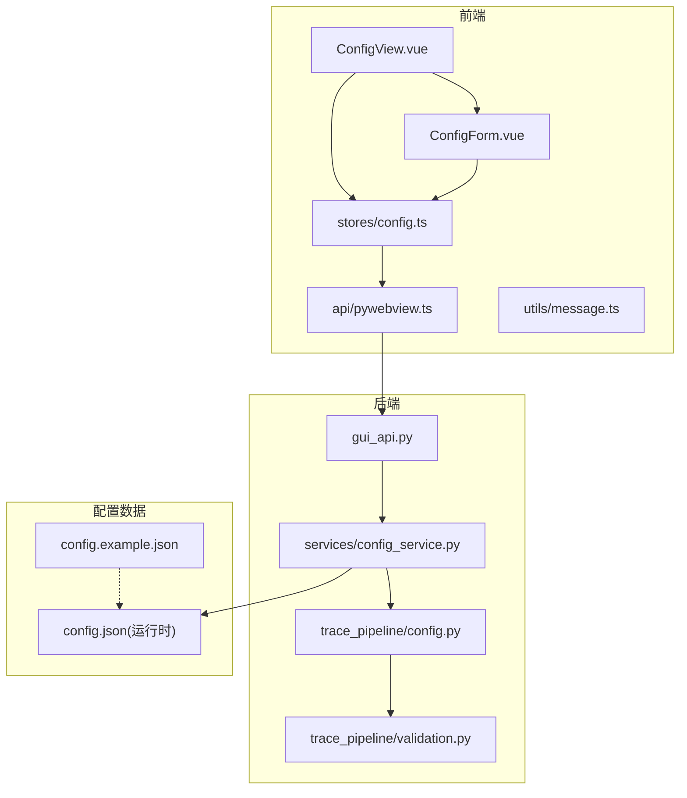
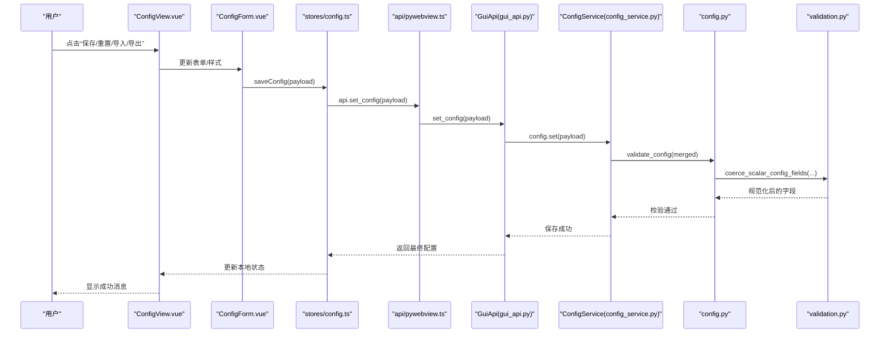
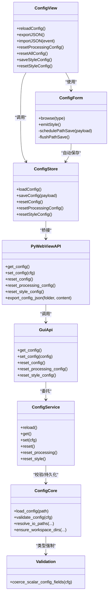
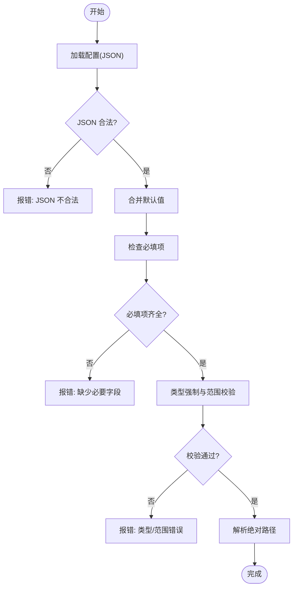

# 系统配置页面

<cite>
**本文引用的文件列表**
- [config.example.json](file://config.example.json)
- [trace_pipeline/config.py](file://trace_pipeline/config.py)
- [trace_pipeline/validation.py](file://trace_pipeline/validation.py)
- [backend/services/config_service.py](file://backend/services/config_service.py)
- [backend/gui_api.py](file://backend/gui_api.py)
- [frontend/src/views/ConfigView.vue](file://frontend/src/views/ConfigView.vue)
- [frontend/src/components/ConfigForm.vue](file://frontend/src/components/ConfigForm.vue)
- [frontend/src/stores/config.ts](file://frontend/src/stores/config.ts)
- [frontend/src/api/pywebview.ts](file://frontend/src/api/pywebview.ts)
- [frontend/src/types/index.ts](file://frontend/src/types/index.ts)
- [frontend/src/utils/message.ts](file://frontend/src/utils/message.ts)
</cite>

## 目录
1. [简介](#简介)
2. [项目结构](#项目结构)
3. [核心组件](#核心组件)
4. [架构总览](#架构总览)
5. [详细组件分析](#详细组件分析)
6. [依赖关系分析](#依赖关系分析)
7. [性能与高级设置](#性能与高级设置)
8. [配置验证与错误提示](#配置验证与错误提示)
9. [配置模板与最佳实践](#配置模板与最佳实践)
10. [故障排查指南](#故障排查指南)
11. [结论](#结论)

## 简介
本指南面向使用 TracePipeline 桌面应用的用户，聚焦“系统配置页面”的完整操作说明。内容涵盖：
- 应用程序设置（输入/输出路径、处理开关等）
- 处理参数默认值与个性化样式配置
- 配置文件管理（导入、导出、备份与恢复）
- 高级配置选项（并行度、开发模式等）
- 配置校验与错误提示机制
- 配置模板与最佳实践建议

## 项目结构
配置相关的前后端关键位置如下：
- 前端视图与表单：配置页入口、表单控件、预览面板
- 前端状态与API封装：Pinia Store 与 pywebview 桥接
- 后端服务：配置读写服务、GUI API 暴露方法
- 核心配置模块：默认配置、加载与校验、路径解析
- 通用校验工具：类型强制与范围检查
- 示例配置模板：提供可复制的 JSON 模板

图表来源
- [frontend/src/views/ConfigView.vue:1-302](file://frontend/src/views/ConfigView.vue#L1-L302)
- [frontend/src/components/ConfigForm.vue:1-411](file://frontend/src/components/ConfigForm.vue#L1-L411)
- [frontend/src/stores/config.ts:1-80](file://frontend/src/stores/config.ts#L1-L80)
- [frontend/src/api/pywebview.ts:1-337](file://frontend/src/api/pywebview.ts#L1-L337)
- [backend/gui_api.py:263-333](file://backend/gui_api.py#L263-L333)
- [backend/services/config_service.py:1-144](file://backend/services/config_service.py#L1-L144)
- [trace_pipeline/config.py:56-190](file://trace_pipeline/config.py#L56-L190)
- [trace_pipeline/validation.py:90-112](file://trace_pipeline/validation.py#L90-L112)
- [config.example.json:1-26](file://config.example.json#L1-L26)

章节来源
- [frontend/src/views/ConfigView.vue:1-302](file://frontend/src/views/ConfigView.vue#L1-L302)
- [frontend/src/components/ConfigForm.vue:1-411](file://frontend/src/components/ConfigForm.vue#L1-L411)
- [frontend/src/stores/config.ts:1-80](file://frontend/src/stores/config.ts#L1-L80)
- [frontend/src/api/pywebview.ts:1-337](file://frontend/src/api/pywebview.ts#L1-L337)
- [backend/gui_api.py:263-333](file://backend/gui_api.py#L263-L333)
- [backend/services/config_service.py:1-144](file://backend/services/config_service.py#L1-L144)
- [trace_pipeline/config.py:56-190](file://trace_pipeline/config.py#L56-L190)
- [trace_pipeline/validation.py:90-112](file://trace_pipeline/validation.py#L90-L112)
- [config.example.json:1-26](file://config.example.json#L1-L26)

## 核心组件
- 配置页视图（ConfigView.vue）
  - 提供“重新加载配置”、“导入/导出 JSON”、“重置处理设置”、“重置所有设置”等操作按钮
  - 集成样式预览与保存/重置样式
  - 监听输入/输出目录变化并同步到全局应用状态
- 配置表单（ConfigForm.vue）
  - 路径选择：输入/输出目录浏览与自动保存（防抖）
  - 绘图样式：颜色、线宽、透明度、标题字号、节点样式等
- 配置存储（stores/config.ts）
  - 统一封装 get/set/reset/reset_processing/reset_style 等方法
  - 调用失败时触发缓存失效
- GUI API（gui_api.py）
  - 暴露 get_config / set_config / reset_* 等接口
  - 在保存后同步各服务路径并清理缓存
- 配置服务（services/config_service.py）
  - 唯一写入入口，线程安全，原子写盘（临时文件替换）
  - 支持仅重置处理参数或仅重置样式
- 配置核心（trace_pipeline/config.py）
  - 定义默认配置、加载 JSON、合并覆盖、必填项校验、路径解析
- 校验工具（trace_pipeline/validation.py）
  - 标量字段类型强制与范围校验（如 DPI、窗口策略、标签模式等）
- 示例模板（config.example.json）
  - 提供可复制的 JSON 模板，包含常用字段与注释

章节来源
- [frontend/src/views/ConfigView.vue:1-302](file://frontend/src/views/ConfigView.vue#L1-L302)
- [frontend/src/components/ConfigForm.vue:1-411](file://frontend/src/components/ConfigForm.vue#L1-L411)
- [frontend/src/stores/config.ts:1-80](file://frontend/src/stores/config.ts#L1-L80)
- [backend/gui_api.py:263-333](file://backend/gui_api.py#L263-L333)
- [backend/services/config_service.py:1-144](file://backend/services/config_service.py#L1-L144)
- [trace_pipeline/config.py:56-190](file://trace_pipeline/config.py#L56-L190)
- [trace_pipeline/validation.py:90-112](file://trace_pipeline/validation.py#L90-L112)
- [config.example.json:1-26](file://config.example.json#L1-L26)

## 架构总览
配置页面的端到端流程：用户在界面修改配置 → 前端通过 Pinia Store 调用 pywebview 桥接 → 后端 GuiApi 路由到 ConfigService → 校验与持久化 → 返回结果并刷新 UI。

图表来源
- [frontend/src/views/ConfigView.vue:62-93](file://frontend/src/views/ConfigView.vue#L62-L93)
- [frontend/src/components/ConfigForm.vue:174-234](file://frontend/src/components/ConfigForm.vue#L174-L234)
- [frontend/src/stores/config.ts:25-35](file://frontend/src/stores/config.ts#L25-L35)
- [frontend/src/api/pywebview.ts:294-300](file://frontend/src/api/pywebview.ts#L294-L300)
- [backend/gui_api.py:273-291](file://backend/gui_api.py#L273-L291)
- [backend/services/config_service.py:92-101](file://backend/services/config_service.py#L92-L101)
- [trace_pipeline/config.py:148-190](file://trace_pipeline/config.py#L148-L190)
- [trace_pipeline/validation.py:107-112](file://trace_pipeline/validation.py#L107-L112)

## 详细组件分析

### 配置页视图（ConfigView.vue）
- 功能要点
  - 重新加载配置：从后端拉取最新配置，填充表单与样式预览
  - 导入 JSON：选择本地 .json 文件，解析后调用保存接口
  - 导出 JSON：选择目标文件夹，将当前配置序列化为 JSON 文本并导出
  - 重置处理设置：仅重置处理参数为默认值，保留路径和样式
  - 重置所有设置：恢复全部默认配置
  - 样式保存/重置：保存 style 子对象或清空为默认
- 交互细节
  - 导入成功后会更新样式预览与输入/输出目录
  - 重置操作均弹出确认对话框，防止误操作
  - 成功/失败通过消息提示反馈

章节来源
- [frontend/src/views/ConfigView.vue:62-233](file://frontend/src/views/ConfigView.vue#L62-L233)

### 配置表单（ConfigForm.vue）
- 功能要点
  - 路径选择：点击“浏览”打开系统目录选择器，自动保存到配置
  - 自动保存：对 input_dir/output_dir 变更进行防抖合并，减少频繁写盘
  - 样式编辑：颜色、线宽、透明度、标题字号、节点样式等可视化调整
- 交互细节
  - 路径变更触发 schedulePathSave，延迟批量提交
  - 样式变更实时触发预览刷新

章节来源
- [frontend/src/components/ConfigForm.vue:174-234](file://frontend/src/components/ConfigForm.vue#L174-L234)
- [frontend/src/components/ConfigForm.vue:246-260](file://frontend/src/components/ConfigForm.vue#L246-L260)

### 配置存储（stores/config.ts）
- 功能要点
  - loadConfig/saveConfig/resetConfig/resetProcessingConfig/resetStyleConfig
  - 每次保存后主动使缓存失效，确保后续数据读取一致性
- 设计要点
  - loading 状态用于 UI 反馈
  - 返回值直接作为最新配置供上层使用

章节来源
- [frontend/src/stores/config.ts:14-71](file://frontend/src/stores/config.ts#L14-L71)

### GUI API（gui_api.py）
- 配置相关接口
  - get_config：返回当前配置字典
  - set_config：合并新配置、校验、持久化、同步服务路径、清理缓存
  - reset_config：恢复默认配置
  - reset_processing_config：仅重置处理参数
  - reset_style_config：仅重置样式
- 安全与并发
  - 重资源操作加锁；配置写入走 ConfigService 保证线程安全
  - 运行流水线时对前端传入的覆盖键进行白名单过滤，禁止覆盖路径/目标字段

章节来源
- [backend/gui_api.py:263-333](file://backend/gui_api.py#L263-L333)
- [backend/gui_api.py:48-49](file://backend/gui_api.py#L48-L49)

### 配置服务（services/config_service.py）
- 功能要点
  - reload：从磁盘加载配置，不存在则创建默认配置
  - get：返回深拷贝，避免外部修改内存状态
  - set：合并新配置、校验、原子写盘（先写临时文件再替换）
  - reset/reset_processing/reset_style：三种粒度重置
- 并发与健壮性
  - 使用 RLock 保护内部状态
  - 写盘异常时清理临时文件，避免残留损坏

章节来源
- [backend/services/config_service.py:41-144](file://backend/services/config_service.py#L41-L144)

### 配置核心（trace_pipeline/config.py）
- 默认配置与类型定义
  - DEFAULT_CONFIG 定义所有字段及默认值
  - ConfigDict 提供类型约束
- 加载与校验
  - load_config：读取 JSON，缺失时使用默认配置
  - validate_config：合并默认值、类型强制、必填项检查、路径解析
- 路径解析
  - resolve_io_paths：解析输入/输出目录并确保存在
  - ensure_workspace_dirs：保障 input/output/logs 目录存在

章节来源
- [trace_pipeline/config.py:56-190](file://trace_pipeline/config.py#L56-L190)
- [trace_pipeline/config.py:218-245](file://trace_pipeline/config.py#L218-L245)
- [trace_pipeline/config.py:264-312](file://trace_pipeline/config.py#L264-L312)

### 校验工具（trace_pipeline/validation.py）
- 标量字段强制转换与范围校验
  - 布尔、正整数、正浮点、窗口策略、节点标签模式、玫瑰图分箱宽度等
- 集中式映射表 _SCALAR_COERCIONS 驱动统一校验

章节来源
- [trace_pipeline/validation.py:90-112](file://trace_pipeline/validation.py#L90-L112)

### 示例模板（config.example.json）
- 提供可复制的 JSON 模板，包含常用字段与注释
- 建议复制为 config.json 后按需修改

章节来源
- [config.example.json:1-26](file://config.example.json#L1-L26)

## 依赖关系分析
- 前端依赖
  - ConfigView.vue 依赖 ConfigForm.vue、StylePreview、DevPanel、stores/config.ts、api/pywebview.ts
  - stores/config.ts 依赖 api/pywebview.ts
- 后端依赖
  - gui_api.py 依赖 services/config_service.py、trace_pipeline/config.py、trace_pipeline/validation.py
  - config_service.py 依赖 trace_pipeline/config.py
- 配置数据
  - 运行时配置文件 config.json 由 ConfigService 维护
  - 示例模板 config.example.json 为用户参考

图表来源
- [frontend/src/views/ConfigView.vue:1-302](file://frontend/src/views/ConfigView.vue#L1-L302)
- [frontend/src/components/ConfigForm.vue:1-411](file://frontend/src/components/ConfigForm.vue#L1-L411)
- [frontend/src/stores/config.ts:1-80](file://frontend/src/stores/config.ts#L1-L80)
- [frontend/src/api/pywebview.ts:104-142](file://frontend/src/api/pywebview.ts#L104-L142)
- [backend/gui_api.py:263-333](file://backend/gui_api.py#L263-L333)
- [backend/services/config_service.py:41-144](file://backend/services/config_service.py#L41-L144)
- [trace_pipeline/config.py:56-190](file://trace_pipeline/config.py#L56-L190)
- [trace_pipeline/validation.py:90-112](file://trace_pipeline/validation.py#L90-L112)

章节来源
- [frontend/src/views/ConfigView.vue:1-302](file://frontend/src/views/ConfigView.vue#L1-L302)
- [frontend/src/components/ConfigForm.vue:1-411](file://frontend/src/components/ConfigForm.vue#L1-L411)
- [frontend/src/stores/config.ts:1-80](file://frontend/src/stores/config.ts#L1-L80)
- [frontend/src/api/pywebview.ts:104-142](file://frontend/src/api/pywebview.ts#L104-L142)
- [backend/gui_api.py:263-333](file://backend/gui_api.py#L263-L333)
- [backend/services/config_service.py:41-144](file://backend/services/config_service.py#L41-L144)
- [trace_pipeline/config.py:56-190](file://trace_pipeline/config.py#L56-L190)
- [trace_pipeline/validation.py:90-112](file://trace_pipeline/validation.py#L90-L112)

## 性能与高级设置
- 并行工作进程数（parallel_workers）
  - 控制数据处理并行度，适合多核 CPU 环境提升吞吐
  - 建议在资源允许的情况下适度提高，避免过度竞争导致 I/O 瓶颈
- 开发模式（is_dev_mode）
  - 开启后可启用开发者面板，便于调试与诊断
- 渲染 DPI 与分箱宽度
  - rose_dpi / trace_dpi / rotated_trace_dpi 影响图像质量与生成时间
  - rose_bin_width 影响玫瑰图统计精度，需在精度与性能间权衡
- 窗口策略（window_strategy）
  - 可选 auto/tangent/hybrid/concentric，不同策略适用于不同数据分布
- 节点识别与标签模式
  - enable_node_recognition 控制是否启用节点识别
  - node_label_mode 控制节点标签显示方式（none/type/id）

章节来源
- [trace_pipeline/config.py:56-79](file://trace_pipeline/config.py#L56-L79)
- [trace_pipeline/validation.py:63-76](file://trace_pipeline/validation.py#L63-L76)
- [trace_pipeline/validation.py:79-87](file://trace_pipeline/validation.py#L79-L87)

## 配置验证与错误提示
- 配置校验流程
  - 必填项检查：input_dir、output_dir、outcrop 必须非空
  - 类型强制：布尔、正整数、正浮点、枚举值等统一规范化
  - 路径解析：相对路径基于基准目录解析为绝对路径
- 常见错误与提示
  - JSON 格式无效：抛出错误并记录日志
  - 缺少必要字段：提示具体缺失字段名
  - 非法数值或范围：给出明确错误信息（如 DPI 必须为正整数）
- 前端错误提示
  - 使用统一的 message 工具展示成功/警告/错误消息
  - 导入失败时提示“无效的 JSON 文件”，保存失败时提示相应错误

图表来源
- [trace_pipeline/config.py:110-145](file://trace_pipeline/config.py#L110-L145)
- [trace_pipeline/config.py:148-190](file://trace_pipeline/config.py#L148-L190)
- [trace_pipeline/validation.py:90-112](file://trace_pipeline/validation.py#L90-L112)
- [frontend/src/utils/message.ts:138-144](file://frontend/src/utils/message.ts#L138-L144)

章节来源
- [trace_pipeline/config.py:110-190](file://trace_pipeline/config.py#L110-L190)
- [trace_pipeline/validation.py:90-112](file://trace_pipeline/validation.py#L90-L112)
- [frontend/src/utils/message.ts:138-144](file://frontend/src/utils/message.ts#L138-L144)

## 配置模板与最佳实践
- 使用示例模板
  - 复制 config.example.json 为 config.json，按需求修改
  - 若未找到配置文件，系统将自动创建默认配置
- 推荐实践
  - 输入/输出目录建议使用绝对路径，避免跨平台路径差异
  - 大批量处理时适当提高 parallel_workers，但需监控内存与 I/O
  - 高 DPI 输出会增加生成时间与磁盘占用，按需调整
  - 定期导出配置备份，便于迁移与回滚
  - 仅在需要时开启 is_dev_mode，以减少不必要的开销

章节来源
- [config.example.json:1-26](file://config.example.json#L1-L26)
- [trace_pipeline/config.py:102-106](file://trace_pipeline/config.py#L102-L106)

## 故障排查指南
- 常见问题
  - 导入 JSON 失败：检查文件格式是否为合法 JSON，字段是否在允许范围内
  - 保存配置失败：检查磁盘权限与路径合法性
  - 重置后效果未生效：确认已重新加载配置或刷新相关缓存
- 定位步骤
  - 查看后端日志，关注配置加载与保存阶段的日志输出
  - 使用“重新加载配置”确保前端与后端一致
  - 检查输入/输出目录是否存在且具备读写权限
- 恢复策略
  - 使用“重置所有设置”恢复到默认配置
  - 使用“重置处理设置”仅恢复处理参数，保留路径与样式
  - 从备份的 JSON 文件导入配置

章节来源
- [frontend/src/views/ConfigView.vue:95-193](file://frontend/src/views/ConfigView.vue#L95-L193)
- [backend/services/config_service.py:128-144](file://backend/services/config_service.py#L128-L144)
- [trace_pipeline/config.py:264-312](file://trace_pipeline/config.py#L264-L312)

## 结论
系统配置页面提供了直观的配置管理与个性化能力，结合严格的校验与安全的持久化机制，确保配置的一致性与可靠性。通过合理的模板与最佳实践，用户可以快速搭建稳定高效的运行环境，并在需要时灵活调整高级参数以满足不同场景的性能与输出需求。