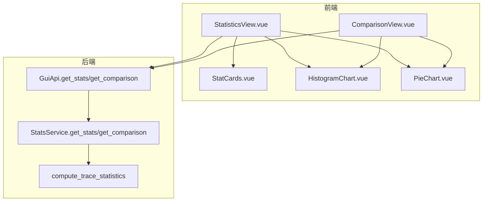
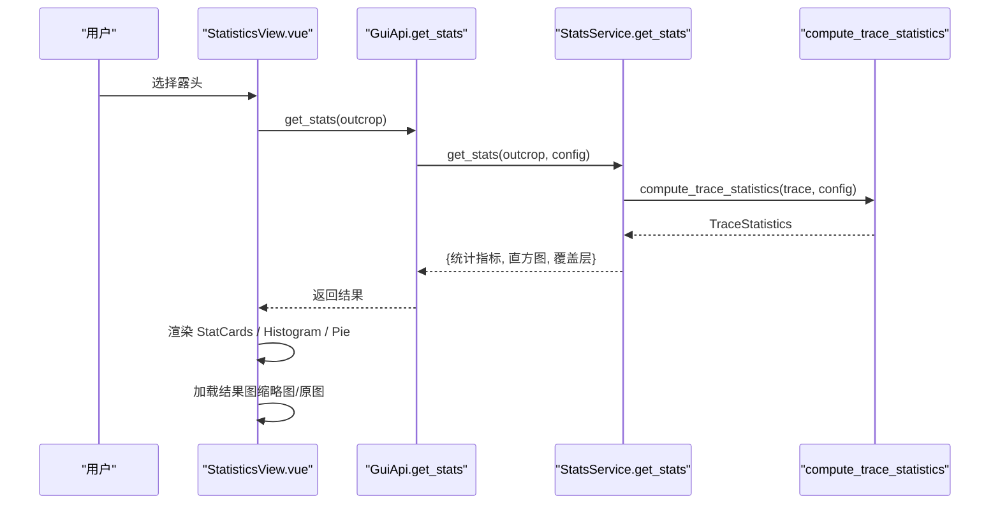
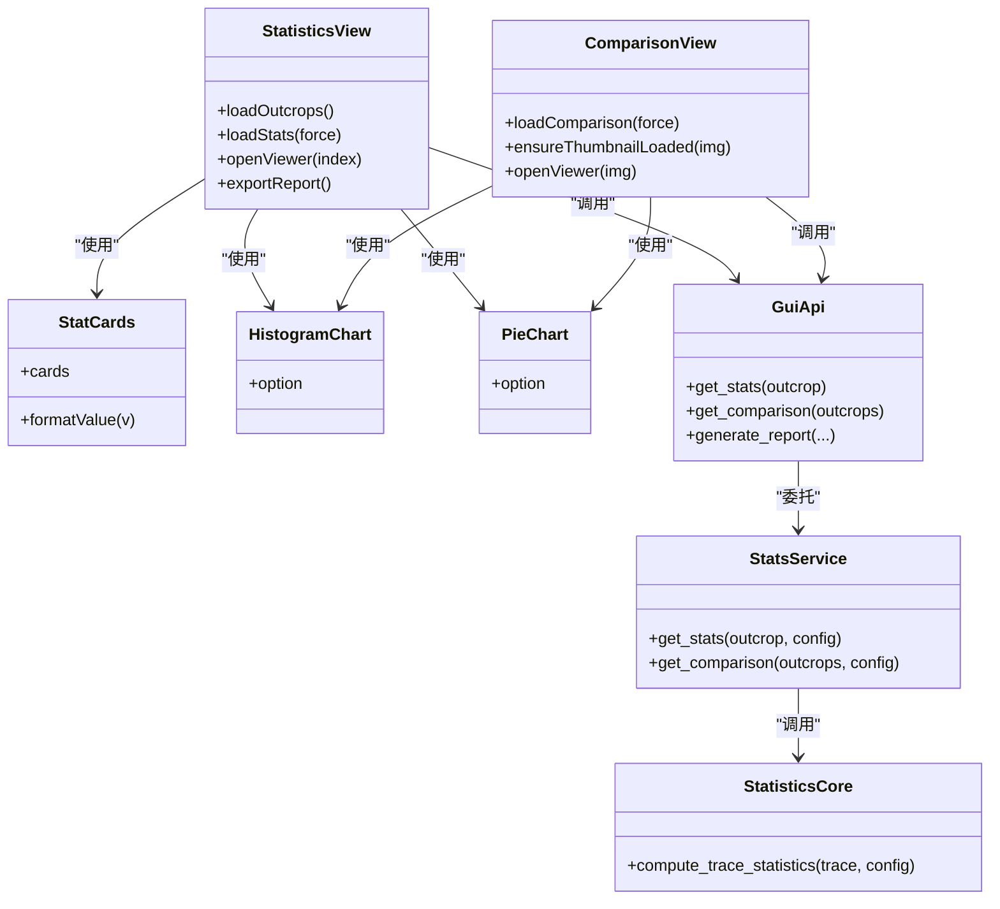

# 统计分析页面

<cite>
**本文引用的文件**   
- [StatisticsView.vue](file://frontend/src/views/StatisticsView.vue)
- [ComparisonView.vue](file://frontend/src/views/ComparisonView.vue)
- [StatCards.vue](file://frontend/src/components/StatCards.vue)
- [HistogramChart.vue](file://frontend/src/components/HistogramChart.vue)
- [PieChart.vue](file://frontend/src/components/PieChart.vue)
- [stats_service.py](file://backend/services/stats_service.py)
- [gui_api.py](file://backend/gui_api.py)
- [statistics.py](file://trace_pipeline/geology/statistics.py)
- [_stat_types.py](file://trace_pipeline/geology/_stat_types.py)
</cite>

## 目录
1. [简介](#简介)
2. [项目结构](#项目结构)
3. [核心组件](#核心组件)
4. [架构总览](#架构总览)
5. [详细组件分析](#详细组件分析)
6. [依赖关系分析](#依赖关系分析)
7. [性能与缓存](#性能与缓存)
8. [图表自定义与主题](#图表自定义与主题)
9. [数据筛选与对比](#数据筛选与对比)
10. [统计指标解读](#统计指标解读)
11. [故障排查指南](#故障排查指南)
12. [结论](#结论)

## 简介
本操作手册面向使用“统计分析页面”的地质数据分析人员，系统介绍如何查看与分析各类统计图表（直方图、饼图等），理解关键地质参数（密度统计、平均迹长估计、方位角分布等）的含义，并进行个性化设置（颜色主题、坐标轴、图例等）。同时说明数据筛选与多露头对比功能的使用方法。

## 项目结构
统计分析页面由前端视图与后端服务协同完成：
- 前端视图负责用户交互、图表渲染、图片展示与导出进度反馈
- 后端服务负责读取处理结果、计算统计数据、生成报告并返回可视化所需的数据与覆盖层信息

图示来源
- [StatisticsView.vue:1-612](file://frontend/src/views/StatisticsView.vue#L1-L612)
- [ComparisonView.vue:1-774](file://frontend/src/views/ComparisonView.vue#L1-L774)
- [gui_api.py:494-553](file://backend/gui_api.py#L494-L553)
- [stats_service.py:101-342](file://backend/services/stats_service.py#L101-L342)
- [statistics.py:212-391](file://trace_pipeline/geology/statistics.py#L212-L391)

章节来源
- [StatisticsView.vue:1-612](file://frontend/src/views/StatisticsView.vue#L1-L612)
- [ComparisonView.vue:1-774](file://frontend/src/views/ComparisonView.vue#L1-L774)
- [gui_api.py:494-553](file://backend/gui_api.py#L494-L553)
- [stats_service.py:101-342](file://backend/services/stats_service.py#L101-L342)
- [statistics.py:212-391](file://trace_pipeline/geology/statistics.py#L212-L391)

## 核心组件
- 统计概览卡片：集中展示线密度 P10、面密度 P20、长度密度 P21 以及节点相关指标，支持数值动画过渡
- 直方图：显示迹长分布，横轴为迹长区间，纵轴为频数
- 饼图：展示 I/II/III 型裂隙分类数量占比
- 结果图面板：提供原始迹线图、旋转迹线图、走向玫瑰图的预览与全屏查看
- 对比页：汇总多个露头的关键指标并以柱状图进行多维度对比

章节来源
- [StatCards.vue:1-219](file://frontend/src/components/StatCards.vue#L1-L219)
- [HistogramChart.vue:1-81](file://frontend/src/components/HistogramChart.vue#L1-L81)
- [PieChart.vue:1-64](file://frontend/src/components/PieChart.vue#L1-L64)
- [StatisticsView.vue:1-612](file://frontend/src/views/StatisticsView.vue#L1-L612)
- [ComparisonView.vue:1-774](file://frontend/src/views/ComparisonView.vue#L1-L774)

## 架构总览
统计分析页面的端到端流程如下：
- 用户选择露头后，前端调用后端接口获取统计数据与结果图索引
- 后端从已处理结果中加载数据，计算统计指标，构建直方图与覆盖层几何，返回给前端
- 前端渲染统计卡片、直方图、饼图，并在结果图面板中展示缩略图与全屏查看

图示来源
- [StatisticsView.vue:204-256](file://frontend/src/views/StatisticsView.vue#L204-L256)
- [gui_api.py:494-532](file://backend/gui_api.py#L494-L532)
- [stats_service.py:101-342](file://backend/services/stats_service.py#L101-L342)
- [statistics.py:212-391](file://trace_pipeline/geology/statistics.py#L212-L391)

## 详细组件分析

### 统计概览卡片（StatCards）
- 功能：以卡片形式展示 P10、P20、P21 及节点相关指标；当启用节点识别时，额外显示节点总数、节点密度、退化跳过、交叉节点 X、三叉节点 Y、孤立端点 I
- 交互：数值变化时带有缓动动画，提升可读性与观感
- 数据来源：来自后端返回的统计对象中的对应字段

章节来源
- [StatCards.vue:1-219](file://frontend/src/components/StatCards.vue#L1-L219)
- [stats_service.py:229-313](file://backend/services/stats_service.py#L229-L313)

### 直方图（HistogramChart）
- 功能：绘制迹长分布直方图，X 轴为迹长区间标签，Y 轴为频数
- 配置：标题、坐标轴名称、提示框、网格、系列样式与动画均通过统一主题工具注入
- 数据：由后端在计算统计时基于迹长数组生成 bins 与 edges

章节来源
- [HistogramChart.vue:1-81](file://frontend/src/components/HistogramChart.vue#L1-L81)
- [stats_service.py:152-156](file://backend/services/stats_service.py#L152-L156)

### 饼图（PieChart）
- 功能：展示 I/II/III 型分类的数量占比，支持图例与悬浮提示
- 配置：环形半径、圆角边框、强调态阴影、标签格式化均由主题工具控制
- 数据：来自后端统计对象中的 type_i/type_ii/type_iii 计数

章节来源
- [PieChart.vue:1-64](file://frontend/src/components/PieChart.vue#L1-L64)
- [stats_service.py:239-241](file://backend/services/stats_service.py#L239-L241)

### 结果图面板（StatisticsView）
- 功能：提供“原始迹线图”“旋转迹线图”“走向玫瑰图”三个标签页，点击缩略图可打开全屏查看器
- 行为：首次切换标签时按需加载缩略图，全屏查看时再加载原图；根据配置决定是否显示玫瑰图
- 数据：通过扫描 output 目录获取各类型结果图路径，结合当前选中露头匹配

章节来源
- [StatisticsView.vue:58-111](file://frontend/src/views/StatisticsView.vue#L58-L111)
- [gui_api.py:459-492](file://backend/gui_api.py#L459-L492)

### 多露头对比（ComparisonView）
- 功能：汇总所有露头的关键指标，提供密度指标、裂隙类型、节点指标、面积/长度四类对比柱状图
- 交互：通过单选按钮切换对比维度；图片网格支持按类型筛选与关键字搜索，悬停懒加载缩略图，点击全屏查看
- 数据：批量调用后端对比接口，保持输入顺序返回

章节来源
- [ComparisonView.vue:1-774](file://frontend/src/views/ComparisonView.vue#L1-L774)
- [gui_api.py:534-553](file://backend/gui_api.py#L534-L553)

## 依赖关系分析
- 前端视图依赖 ECharts 组件库进行图表渲染，并通过统一的 echarts-theme 工具注入字体、颜色与动画配置
- 后端 StatsService 依赖 trace_pipeline.geology.statistics 的核心算法模块进行统计计算，并封装为 JSON 返回
- GuiApi 作为 pywebview JS API 入口，负责安全校验、缓存失效、并发锁与进度队列管理

图示来源
- [StatisticsView.vue:1-612](file://frontend/src/views/StatisticsView.vue#L1-L612)
- [ComparisonView.vue:1-774](file://frontend/src/views/ComparisonView.vue#L1-L774)
- [gui_api.py:494-553](file://backend/gui_api.py#L494-L553)
- [stats_service.py:101-342](file://backend/services/stats_service.py#L101-L342)
- [statistics.py:212-391](file://trace_pipeline/geology/statistics.py#L212-L391)

## 性能与缓存
- 前端缓存：scan 列表、统计结果、对比结果与结果图索引均在前端 store 中缓存，避免重复请求
- 后端缓存：StatsService 使用 TTL 缓存，键包含影响统计的关键配置与输入文件指纹，减少重复计算
- 输出目录变更检测：GuiApi 监听 output 目录变化，自动使相关缓存失效，保证数据一致性
- 图片懒加载：对比页采用并发队列限制缩略图与原图加载并发度，提升大图浏览体验

章节来源
- [StatisticsView.vue:175-256](file://frontend/src/views/StatisticsView.vue#L175-L256)
- [ComparisonView.vue:386-493](file://frontend/src/views/ComparisonView.vue#L386-L493)
- [stats_service.py:35-100](file://backend/services/stats_service.py#L35-L100)
- [gui_api.py:250-262](file://backend/gui_api.py#L250-L262)

## 图表自定义与主题
- 字体与颜色：通过 echarts-theme 工具统一注入字体族、主色、次色、三级色与动画配置，确保全局风格一致
- 坐标轴与图例：各图表组件内定义 xAxis/yAxis/title/legend 等配置项，支持响应式与设备像素比适配
- 交互增强：tooltip、emphasis、动画时长与曲线缓动函数均可通过主题工具扩展

章节来源
- [HistogramChart.vue:14-70](file://frontend/src/components/HistogramChart.vue#L14-L70)
- [PieChart.vue:14-53](file://frontend/src/components/PieChart.vue#L14-L53)
- [ComparisonView.vue:308-381](file://frontend/src/views/ComparisonView.vue#L308-L381)

## 数据筛选与对比
- 单露头筛选：在统计页顶部下拉选择不同露头，自动刷新统计卡片与图表
- 多露头对比：对比页自动汇总所有露头数据，支持按维度切换（密度指标、裂隙类型、节点指标、面积/长度）
- 图片筛选：对比页图片网格支持按类型筛选（原始迹线/旋转迹线/走向玫瑰）与关键字搜索露头名
- 结果图查看：点击缩略图进入全屏查看器，支持多图滑动浏览

章节来源
- [StatisticsView.vue:4-11](file://frontend/src/views/StatisticsView.vue#L4-L11)
- [ComparisonView.vue:52-61](file://frontend/src/views/ComparisonView.vue#L52-L61)
- [ComparisonView.vue:64-101](file://frontend/src/views/ComparisonView.vue#L64-L101)

## 统计指标解读
- 线密度 P10：单位测线上的迹线数，反映裂隙沿测线的密集程度
- 面密度 P20：单位面积上的迹线数，综合表征裂隙面密度
- 长度密度 P21：单位面积上的迹线总长度，反映裂隙总体发育规模
- 平均迹长估计：基于观测或窗口策略估算的平均每条迹线长度
- 方位角（走向）：测线局部坐标系下的方位角，用于坐标归一化与玫瑰图展示
- 面积来源与降级策略：优先实测面积，其次凸包面积，再次缓冲凸包面积，最后回退到圆窗等效面积；当差异超过自适应阈值时会给出警告
- 圆窗诊断：独立于凸包的面积估算路径，用于一致性校验与告警

章节来源
- [statistics.py:212-391](file://trace_pipeline/geology/statistics.py#L212-L391)
- [_stat_types.py:15-65](file://trace_pipeline/geology/_stat_types.py#L15-L65)
- [stats_service.py:229-313](file://backend/services/stats_service.py#L229-L313)

## 故障排查指南
- 统计加载失败：检查所选露头是否存在处理结果；确认 input/output 目录配置正确；查看后端日志中的错误信息
- 报告导出失败：确认 generate_report 是否被并发拒绝；检查保存路径是否在白名单内；关注进度轮询中的 error 事件
- 图片无法显示：确认 output 目录未被外部删除或移动；必要时强制刷新 scan 与 results 缓存
- 对比页无数据：先执行数据处理流水线，确保存在 raw/rotated/rose 结果图

章节来源
- [gui_api.py:494-532](file://backend/gui_api.py#L494-L532)
- [gui_api.py:644-728](file://backend/gui_api.py#L644-L728)
- [StatisticsView.vue:204-256](file://frontend/src/views/StatisticsView.vue#L204-L256)
- [ComparisonView.vue:386-493](file://frontend/src/views/ComparisonView.vue#L386-L493)

## 结论
统计分析页面将复杂的地质统计计算与直观的可视化相结合，提供从单露头深度分析到多露头横向对比的完整工作流。通过合理的缓存与懒加载机制，兼顾了性能与用户体验。用户可按需定制图表主题与布局，并结合筛选与对比功能高效开展地质数据分析。