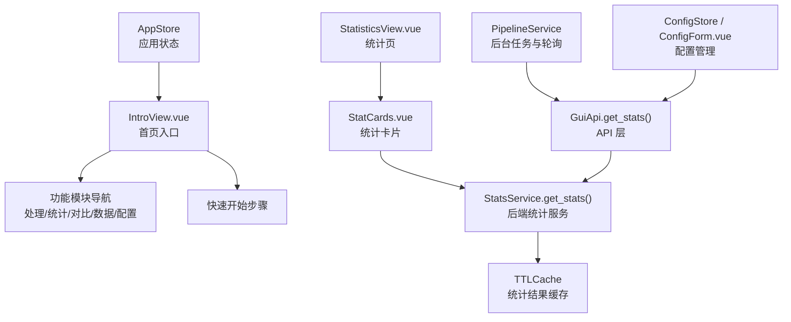
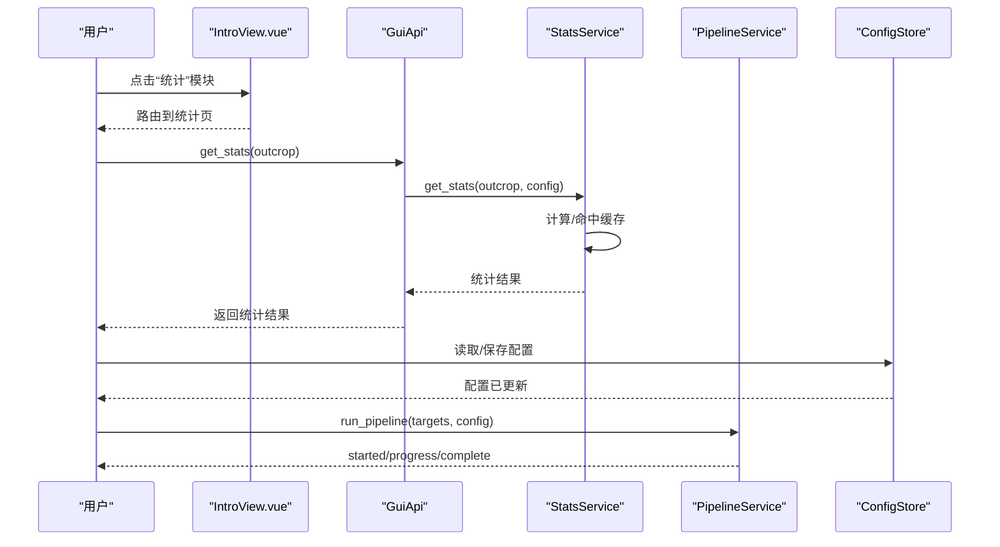
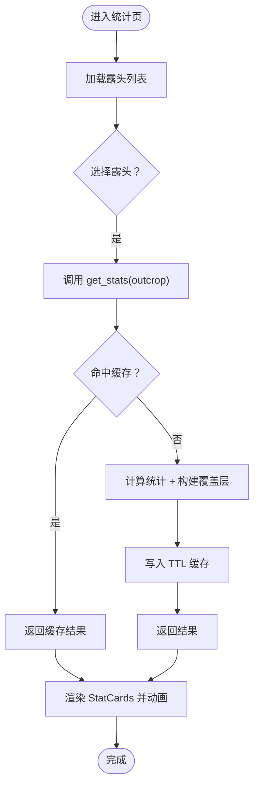
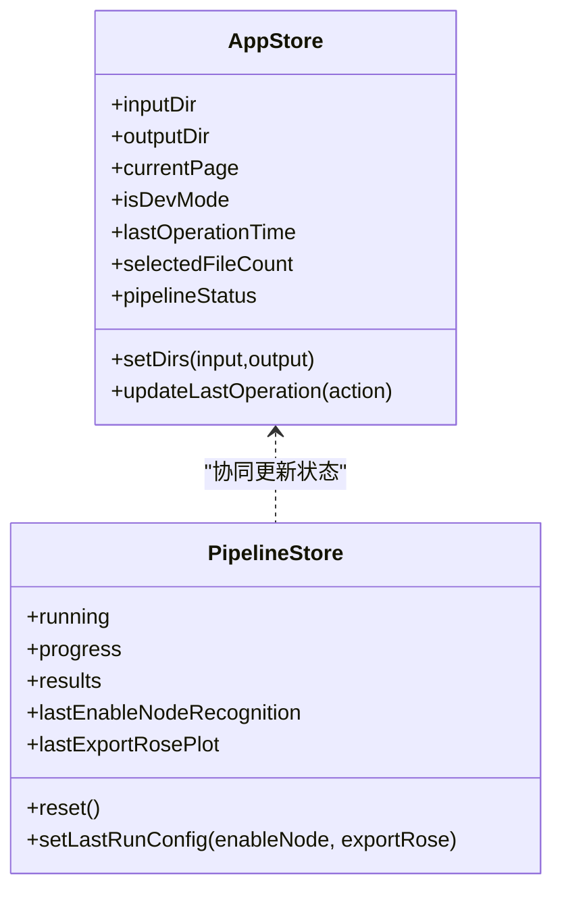
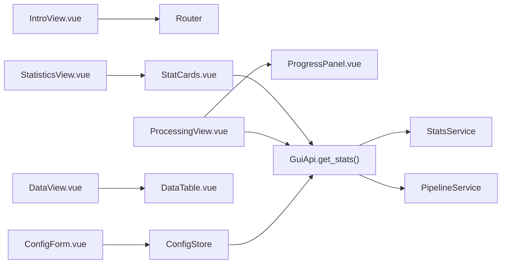

# 首页概览页面

<cite>
**本文引用的文件列表**
- [IntroView.vue](file://frontend/src/views/IntroView.vue)
- [StatCards.vue](file://frontend/src/components/StatCards.vue)
- [stats_service.py](file://backend/services/stats_service.py)
- [gui_api.py](file://backend/gui_api.py)
- [pipeline_service.py](file://backend/services/pipeline_service.py)
- [app.ts](file://frontend/src/stores/app.ts)
- [config.ts](file://frontend/src/stores/config.ts)
- [ConfigForm.vue](file://frontend/src/components/ConfigForm.vue)
- [ProcessingView.vue](file://frontend/src/views/ProcessingView.vue)
- [StatisticsView.vue](file://frontend/src/views/StatisticsView.vue)
- [DataView.vue](file://frontend/src/views/DataView.vue)
</cite>

## 目录
1. [简介](#简介)
2. [项目结构](#项目结构)
3. [核心组件](#核心组件)
4. [架构总览](#架构总览)
5. [详细组件分析](#详细组件分析)
6. [依赖关系分析](#依赖关系分析)
7. [性能与更新机制](#性能与更新机制)
8. [故障排查指南](#故障排查指南)
9. [结论](#结论)

## 简介
本文件面向“首页概览页面”的操作与实现说明，聚焦以下目标：
- 解释首页展示的关键统计卡片（如线密度、面密度、长度密度、节点总数等）的含义与数据来源。
- 说明快速操作按钮的功能与跳转路径（如进入处理、统计、对比、数据、配置）。
- 介绍系统状态监控面板（运行中/完成/错误状态、最近操作时间、并行度等）的解读方式。
- 提供个性化设置选项（输入/输出目录、绘图样式、并行度等）的配置方法。

注意：当前仓库未包含内存/CPU/队列状态的实时采集与展示逻辑，因此本节仅基于现有代码进行说明。

## 项目结构
首页入口为 IntroView，负责展示产品介绍、功能模块导航与快速开始步骤；统计卡片由 StatCards 组件渲染；统计数据由后端 StatsService 计算并提供缓存；GUI API 作为前端可调用的统一入口；流水线服务负责后台执行与进度轮询；配置与状态通过 Pinia Store 管理。

图表来源
- [IntroView.vue:1-136](file://frontend/src/views/IntroView.vue#L1-L136)
- [StatCards.vue:1-128](file://frontend/src/components/StatCards.vue#L1-L128)
- [stats_service.py:101-342](file://backend/services/stats_service.py#L101-L342)
- [gui_api.py:494-532](file://backend/gui_api.py#L494-L532)
- [pipeline_service.py:32-95](file://backend/services/pipeline_service.py#L32-L95)
- [config.ts:14-35](file://frontend/src/stores/config.ts#L14-L35)
- [ConfigForm.vue:1-124](file://frontend/src/components/ConfigForm.vue#L1-L124)
- [app.ts:22-56](file://frontend/src/stores/app.ts#L22-L56)

章节来源
- [IntroView.vue:1-136](file://frontend/src/views/IntroView.vue#L1-L136)
- [StatCards.vue:1-128](file://frontend/src/components/StatCards.vue#L1-L128)
- [stats_service.py:101-342](file://backend/services/stats_service.py#L101-L342)
- [gui_api.py:494-532](file://backend/gui_api.py#L494-L532)
- [pipeline_service.py:32-95](file://backend/services/pipeline_service.py#L32-L95)
- [config.ts:14-35](file://frontend/src/stores/config.ts#L14-L35)
- [ConfigForm.vue:1-124](file://frontend/src/components/ConfigForm.vue#L1-L124)
- [app.ts:22-56](file://frontend/src/stores/app.ts#L22-L56)

## 核心组件
- 首页入口 IntroView：展示品牌信息、功能模块卡片（处理、统计、对比、数据、配置）、快速开始步骤。
- 统计卡片 StatCards：根据后端返回的统计对象渲染 P10/P20/P21、节点总数、节点密度、退化跳过、交叉节点 X、三叉节点 Y、孤立端点 I 等指标，并带数值动画。
- 配置表单 ConfigForm：支持输入/输出目录选择、绘图样式调整（颜色、透明度、字号、节点样式），以及保存/重置样式。
- 应用状态 AppStore：维护输入/输出目录、当前页面、开发模式、最近操作时间、选中文件数、流水线状态等。
- 配置存储 ConfigStore：加载/保存/重置配置，并在变更后使相关缓存失效。

章节来源
- [IntroView.vue:92-136](file://frontend/src/views/IntroView.vue#L92-L136)
- [StatCards.vue:56-128](file://frontend/src/components/StatCards.vue#L56-L128)
- [ConfigForm.vue:1-124](file://frontend/src/components/ConfigForm.vue#L1-L124)
- [app.ts:22-56](file://frontend/src/stores/app.ts#L22-L56)
- [config.ts:14-35](file://frontend/src/stores/config.ts#L14-L35)

## 架构总览
首页概览的数据流与交互流程如下：
- 用户点击功能模块卡片，路由跳转到对应页面（处理、统计、对比、数据、配置）。
- 统计卡片数据来源于后端 StatsService，经 GUI API 暴露给前端；StatsService 内部对关键配置与输入文件指纹生成稳定键，使用 TTL 缓存避免重复计算。
- 流水线执行由 PipelineService 在后台线程中运行，前端通过轮询获取进度事件。
- 配置项通过 ConfigStore 与后端同步，变更时触发缓存失效，确保后续统计与扫描返回最新结果。

图表来源
- [IntroView.vue:92-136](file://frontend/src/views/IntroView.vue#L92-L136)
- [gui_api.py:494-532](file://backend/gui_api.py#L494-L532)
- [stats_service.py:101-342](file://backend/services/stats_service.py#L101-L342)
- [pipeline_service.py:42-95](file://backend/services/pipeline_service.py#L42-L95)
- [config.ts:14-35](file://frontend/src/stores/config.ts#L14-L35)

## 详细组件分析

### 统计卡片 StatCards 详解
- 指标含义
  - 线密度 P10：单位长度上的迹线数量（m⁻¹）。
  - 面密度 P20：单位面积上的迹线数量（m⁻²）。
  - 长度密度 P21：单位面积上的迹线总长度（m⁻¹）。
  - 节点总数：识别到的节点个数。
  - 节点密度：节点总数除以露头面积（个/m²）。
  - 退化跳过：因几何退化被跳过的迹线条数。
  - 交叉节点 X：度数为 2 的交叉节点个数。
  - 三叉节点 Y：度数为 3 的节点个数。
  - 孤立端点 I：度数为 1 的端点个数。
- 数据来源与更新机制
  - 数据由后端 StatsService.get_stats 计算或从 TTL 缓存返回。
  - 当配置或输入文件指纹变化时，缓存键变化导致重新计算。
  - 前端在切换露头或刷新时调用 API 获取最新数据，并驱动 StatCards 数值动画。
- 可视化与交互
  - 卡片左侧强调色条与悬停光晕增强可读性。
  - 数值变化采用缓动动画，提升观感。

图表来源
- [statistics_view_load:204-256](file://frontend/src/views/StatisticsView.vue#L204-L256)
- [stats_service_get_stats:101-342](file://backend/services/stats_service.py#L101-L342)
- [stat_cards_render:56-128](file://frontend/src/components/StatCards.vue#L56-L128)

章节来源
- [StatCards.vue:56-128](file://frontend/src/components/StatCards.vue#L56-L128)
- [stats_service.py:101-342](file://backend/services/stats_service.py#L101-L342)
- [StatisticsView.vue:204-256](file://frontend/src/views/StatisticsView.vue#L204-L256)

### 快速操作按钮与导航
- 功能模块卡片
  - 处理：批量处理露头数据，自动计算迹线参数与节点识别。
  - 统计：密度指标、迹长直方图、裂隙类型饼图与结果浏览。
  - 对比：多露头参数对比表格与柱状图，直观比较差异。
  - 数据：裂隙情况、端点坐标、走向与迹长等多维度浏览。
  - 配置：全局参数、绘图样式与开发者模式灵活调整。
- 快速开始步骤
  - 选择露头文件 → 运行处理流程 → 查看分析结果 → 导出报告。

章节来源
- [IntroView.vue:92-136](file://frontend/src/views/IntroView.vue#L92-L136)

### 系统状态监控面板
- 流水线状态
  - 状态值：idle（空闲）、running（运行中）、completed（完成）、error（错误）。
  - 最近操作时间：记录最近一次操作的名称与时间戳。
  - 并行度：parallel_workers 控制工作进程数，影响批处理速度。
- 进度与日志
  - 处理过程栏显示当前状态与日志条目，支持滚动与自动定位。
  - 轮询机制每 300ms 拉取进度事件，直至 complete/error。

图表来源
- [app_store:22-56](file://frontend/src/stores/app.ts#L22-L56)
- [pipeline_store:22-56](file://frontend/src/stores/pipeline.ts#L22-L56)

章节来源
- [app.ts:22-56](file://frontend/src/stores/app.ts#L22-L56)
- [pipeline.ts:22-56](file://frontend/src/stores/pipeline.ts#L22-L56)
- [ProcessingView.vue:354-518](file://frontend/src/views/ProcessingView.vue#L354-L518)

### 个性化设置选项
- 路径设置
  - 输入目录/输出目录：支持浏览选择，修改后自动保存并触发缓存失效。
- 绘图样式
  - 颜色：迹线、凸包、圆窗、玫瑰柱、玫瑰边、网格。
  - 透明度：凸包填充透明度、圆窗填充透明度。
  - 标题字号、节点样式（默认/实心/空心/深色）。
- 并行度
  - parallel_workers：0=自动（CPU 核心数），1=串行，>1=指定进程数。
- 持久化与生效范围
  - 配置通过 ConfigStore 保存到后端，变更时使统计与文件扫描缓存失效。
  - 处理参数与上次运行偏好（是否启用节点识别、是否导出玫瑰图）持久化到 localStorage，影响其他页面显示。

章节来源
- [ConfigForm.vue:1-124](file://frontend/src/components/ConfigForm.vue#L1-L124)
- [config.ts:14-35](file://frontend/src/stores/config.ts#L14-L35)
- [ProcessingView.vue:136-186](file://frontend/src/views/ProcessingView.vue#L136-L186)
- [pipeline.ts:22-56](file://frontend/src/stores/pipeline.ts#L22-L56)

## 依赖关系分析
- 前端视图与组件
  - IntroView 依赖路由与各功能模块图标。
  - StatisticsView 依赖 StatCards、HistogramChart、PieChart、ImageViewer。
  - ProcessingView 依赖 FileList、ProgressPanel、ImageModal。
  - DataView 依赖 DataTable 与基础信息卡片。
- 前后端接口
  - GuiApi 暴露 scan_files、get_stats、get_comparison、run_pipeline、poll_progress、get_results 等方法。
  - StatsService 内部依赖 trace_pipeline 的计算与模型，并使用 TTLCache 做缓存。
- 状态管理
  - AppStore 与 PipelineStore 分别管理应用级与流水线级状态。
  - ConfigStore 负责配置的加载、保存与重置，并联动缓存失效。

图表来源
- [IntroView.vue:92-136](file://frontend/src/views/IntroView.vue#L92-L136)
- [StatisticsView.vue:114-170](file://frontend/src/views/StatisticsView.vue#L114-L170)
- [ProcessingView.vue:107-186](file://frontend/src/views/ProcessingView.vue#L107-L186)
- [DataView.vue:56-110](file://frontend/src/views/DataView.vue#L56-L110)
- [gui_api.py:494-532](file://backend/gui_api.py#L494-L532)
- [stats_service.py:101-342](file://backend/services/stats_service.py#L101-L342)
- [pipeline_service.py:42-95](file://backend/services/pipeline_service.py#L42-L95)
- [config.ts:14-35](file://frontend/src/stores/config.ts#L14-L35)

章节来源
- [IntroView.vue:92-136](file://frontend/src/views/IntroView.vue#L92-L136)
- [StatisticsView.vue:114-170](file://frontend/src/views/StatisticsView.vue#L114-L170)
- [ProcessingView.vue:107-186](file://frontend/src/views/ProcessingView.vue#L107-L186)
- [DataView.vue:56-110](file://frontend/src/views/DataView.vue#L56-L110)
- [gui_api.py:494-532](file://backend/gui_api.py#L494-L532)
- [stats_service.py:101-342](file://backend/services/stats_service.py#L101-L342)
- [pipeline_service.py:42-95](file://backend/services/pipeline_service.py#L42-L95)
- [config.ts:14-35](file://frontend/src/stores/config.ts#L14-L35)

## 性能与更新机制
- 统计结果缓存
  - StatsService 使用 TTLCache（默认 TTL 300s，最大 128 条）缓存统计结果。
  - 缓存键由出露名与影响统计的关键配置字段及输入文件指纹共同决定，避免无关字段导致缓存失效。
- 输出目录变更检测
  - GuiApi 在扫描与统计前检查 output 目录变更，若检测到外部变更则使文件与统计缓存失效，保证数据一致性。
- 图片与结果索引
  - get_results 扫描 output 目录中的 PNG 文件，匹配原始/旋转/玫瑰图路径，供前端预览与查看器使用。
- 并发与资源保护
  - 报告生成与预览等操作使用运行锁防止并发导致资源耗尽。
  - 流水线使用 ProcessPoolExecutor 并行执行，workers 受 CPU 核心数与配置限制。

章节来源
- [stats_service.py:35-100](file://backend/services/stats_service.py#L35-L100)
- [gui_api.py:250-262](file://backend/gui_api.py#L250-L262)
- [gui_api.py:459-492](file://backend/gui_api.py#L459-L492)
- [pipeline_service.py:146-185](file://backend/services/pipeline_service.py#L146-L185)

## 故障排查指南
- 统计结果为空或缺失
  - 检查 input_dir/output_dir 是否正确配置。
  - 确认已执行处理流程并生成结果文件。
  - 查看后端日志中 stats 计算阶段是否有错误或警告。
- 统计结果不更新
  - 检查是否触发了缓存失效（如修改了配置或 output 目录有外部变更）。
  - 尝试强制刷新（scan_files(force=true)）或重启应用以清空缓存。
- 流水线无法启动或卡住
  - 确认至少选择一个目标文件。
  - 检查并行度配置与 CPU 核心数是否合理。
  - 查看轮询是否连续失败，必要时停止轮询并重启后端。
- 报告导出失败
  - 检查报告生成锁是否被占用（已有任务正在运行）。
  - 查看进度队列中是否有 error 事件与具体消息。

章节来源
- [stats_service.py:127-142](file://backend/services/stats_service.py#L127-L142)
- [gui_api.py:250-262](file://backend/gui_api.py#L250-L262)
- [gui_api.py:655-730](file://backend/gui_api.py#L655-L730)
- [pipeline_service.py:42-95](file://backend/services/pipeline_service.py#L42-L95)

## 结论
首页概览页面通过 IntroView 提供清晰的功能导航与快速入门指引；统计卡片 StatCards 将后端计算的密度与节点指标直观呈现；系统状态监控面板帮助用户掌握流水线运行状况；个性化设置允许灵活调整路径、样式与并行度。整体架构在前端组件、Pinia 状态管理与后端服务之间形成清晰的职责划分，并通过缓存与变更检测保障数据一致性与性能。