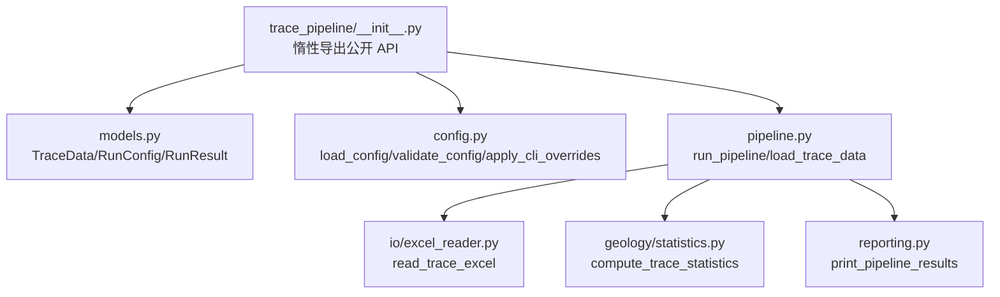
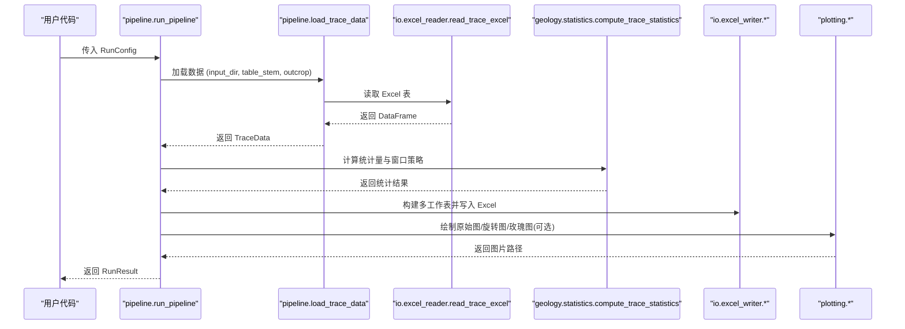
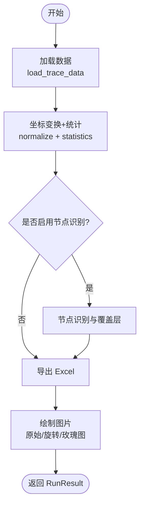
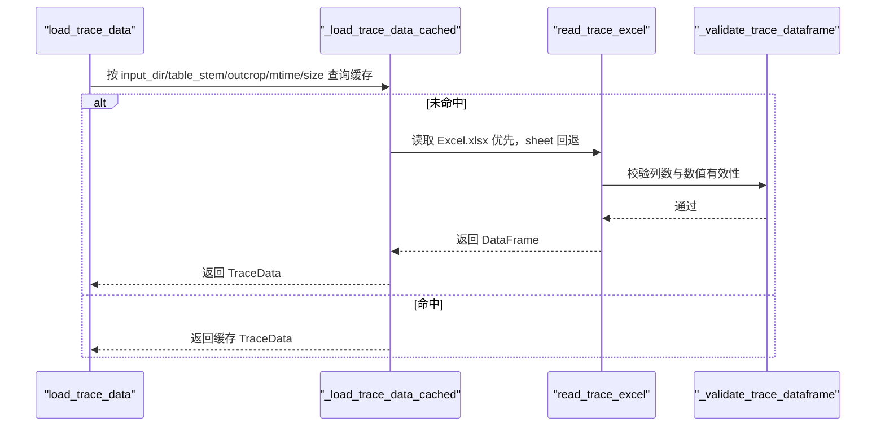
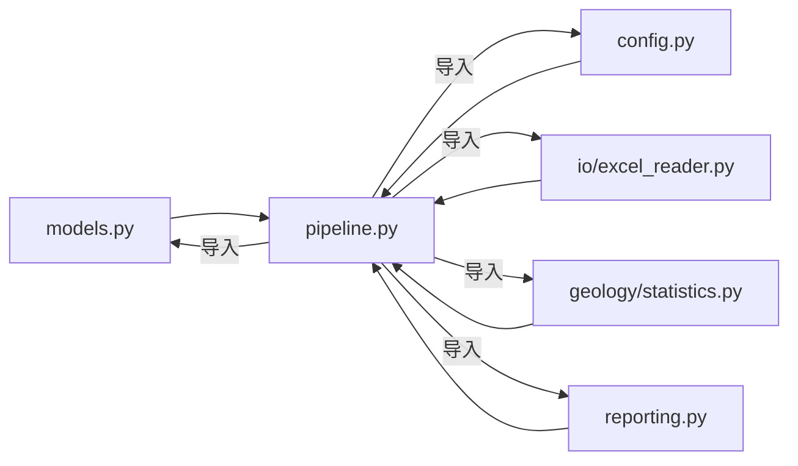

# Python API 编程接口

<cite>
**本文引用的文件**
- [trace_pipeline/__init__.py](file://trace_pipeline/__init__.py)
- [trace_pipeline/config.py](file://trace_pipeline/config.py)
- [trace_pipeline/models.py](file://trace_pipeline/models.py)
- [trace_pipeline/pipeline.py](file://trace_pipeline/pipeline.py)
- [trace_pipeline/io/excel_reader.py](file://trace_pipeline/io/excel_reader.py)
- [trace_pipeline/geology/statistics.py](file://trace_pipeline/geology/statistics.py)
- [trace_pipeline/reporting.py](file://trace_pipeline/reporting.py)
- [README.md](file://README.md)
</cite>

## 目录
1. [简介](#简介)
2. [项目结构](#项目结构)
3. [核心组件](#核心组件)
4. [架构总览](#架构总览)
5. [详细组件分析](#详细组件分析)
6. [依赖关系分析](#依赖关系分析)
7. [性能与内存优化建议](#性能与内存优化建议)
8. [故障排查指南](#故障排查指南)
9. [结论](#结论)
10. [附录：API 速查与示例路径](#附录api-速查与示例路径)

## 简介
本指南面向使用 trace_pipeline 包进行 Python 编程的开发者，聚焦以下目标：
- 掌握 RunConfig、TraceData、RunResult 等核心类的使用方法与属性说明
- 了解如何加载数据、配置处理参数、执行流水线并获取结果
- 学习异常处理与错误恢复的最佳实践
- 掌握与 pandas DataFrame 集成的方式
- 获得性能优化与内存管理的实用建议

## 项目结构
trace_pipeline 包采用分层设计，核心入口通过惰性导出，避免不必要的依赖初始化。关键模块职责如下：
- models.py：不可变数据模型（TraceData、RunConfig、RunResult）
- config.py：配置加载、校验、路径解析与 CLI 覆盖
- pipeline.py：单目标全流程编排（run_pipeline、load_trace_data）
- io/excel_reader.py：Excel 读取与基础格式校验
- geology/statistics.py：统计指标计算与圆窗策略
- reporting.py：终端友好的结果展示

图表来源
- [trace_pipeline/__init__.py:1-83](file://trace_pipeline/__init__.py#L1-L83)
- [trace_pipeline/models.py:1-352](file://trace_pipeline/models.py#L1-L352)
- [trace_pipeline/config.py:1-326](file://trace_pipeline/config.py#L1-L326)
- [trace_pipeline/pipeline.py:1-474](file://trace_pipeline/pipeline.py#L1-L474)
- [trace_pipeline/io/excel_reader.py:1-169](file://trace_pipeline/io/excel_reader.py#L1-L169)
- [trace_pipeline/geology/statistics.py:1-200](file://trace_pipeline/geology/statistics.py#L1-L200)
- [trace_pipeline/reporting.py:1-190](file://trace_pipeline/reporting.py#L1-L190)

章节来源
- [trace_pipeline/__init__.py:1-83](file://trace_pipeline/__init__.py#L1-L83)
- [README.md:649-748](file://README.md#L649-L748)

## 核心组件
本节聚焦三个核心对象：RunConfig、TraceData、RunResult，以及它们与流水线的交互方式。

- RunConfig
  - 作用：封装单次流水线运行的全部参数，包含输入输出路径、文件名、露头标识、绘图 DPI、圆窗策略、节点识别开关等
  - 构造要点：字段为空或类型不合法会触发 ValueError；支持 from_mapping 从字典构建
  - 常用属性：input_dir、output_dir、output_prefix、table_stem、outcrop、window_strategy、min_intersections、style、enable_node_recognition、node_merge_tolerance、show_node_overlay、node_label_mode

- TraceData
  - 作用：表示单张迹线表的完整解析结果，内部为不可变容器，NumPy 数组写保护
  - 关键字段：scanline_azimuth、count、endpoints、joint_strikes、segment_lengths、scanline_positions、measured_scanline_length、measured_outcrop_area
  - 派生属性：lengths（端点欧氏距离）、mean_length（平均长度）
  - 校验规则：形状一致性、有限性检查、可选正数校验

- RunResult
  - 作用：记录一次 run_pipeline 的结果，包含成功/失败状态、统计摘要、产物路径、错误信息等
  - 工厂方法：success(...) 与 failure(...)
  - 关键字段：status、trace_count、mean_length、scanline_azimuth、excel_path、raw_plot_path、rotated_plot_path、rose_plot_path、area_source、error、error_type、error_traceback、node_* 计数、intersection_count

章节来源
- [trace_pipeline/models.py:1-352](file://trace_pipeline/models.py#L1-L352)

## 架构总览
下图展示了 run_pipeline 的核心调用链与阶段划分：

图表来源
- [trace_pipeline/pipeline.py:230-474](file://trace_pipeline/pipeline.py#L230-L474)
- [trace_pipeline/io/excel_reader.py:36-106](file://trace_pipeline/io/excel_reader.py#L36-L106)
- [trace_pipeline/geology/statistics.py:1-200](file://trace_pipeline/geology/statistics.py#L1-L200)

## 详细组件分析

### 运行配置 RunConfig
- 构造与校验
  - 必填字段：input_dir、output_dir、output_prefix、table_stem、outcrop
  - 数值型字段经 coerce_scalar_config_fields 规范化
  - node_merge_tolerance 必须大于 0
- 工厂方法
  - from_mapping(cfg): 从字典提取已知键，缺失可选字段回退默认值；若 style 中存在 node_label_mode，则自动注入到 RunConfig

使用建议
- 优先使用 load_config + RunConfig.from_mapping 组合，确保配置一致性与可维护性
- 在 GUI/CLI 场景下，可通过 apply_cli_overrides 合并命令行覆盖

章节来源
- [trace_pipeline/models.py:162-273](file://trace_pipeline/models.py#L162-L273)
- [trace_pipeline/config.py:86-190](file://trace_pipeline/config.py#L86-L190)
- [trace_pipeline/config.py:251-258](file://trace_pipeline/config.py#L251-L258)

### 数据模型 TraceData
- 数据结构
  - endpoints: (N, 4) 矩阵，列序 [x1, y1, x2, y2]
  - joint_strikes: (N,) 走向角序列
  - segment_lengths: (N,) 沿测段的迹线长度
  - scanline_positions: (N,) 沿测线位移
- 派生属性
  - lengths: 端点间二维欧氏距离，首次访问后缓存
  - mean_length: 基于 lengths 的平均值
- 约束与健壮性
  - frozen dataclass，内部 NumPy 数组 writeable=False
  - __post_init__ 中严格校验形状与有限性

与 pandas 集成
- 通常由 read_trace_excel 返回 DataFrame，再经 compute_endpoints 转换为 TraceData
- 如需直接构造 TraceData，请确保各字段维度与 count 一致且均为有限浮点数

章节来源
- [trace_pipeline/models.py:41-157](file://trace_pipeline/models.py#L41-L157)

### 运行结果 RunResult
- 成功路径
  - success(...) 填充统计摘要与产物路径
- 失败路径
  - failure(...) 填充 error、error_type、error_traceback
- 常见字段
  - status: PipelineStatus.SUCCESS / ERROR
  - excel_path、raw_plot_path、rotated_plot_path、rose_plot_path
  - area_source: measured / hull / hull_buffered / window_equivalent
  - node_* 计数与 intersection_count（当启用节点识别时）

章节来源
- [trace_pipeline/models.py:278-352](file://trace_pipeline/models.py#L278-L352)

### 流水线编排 run_pipeline
- 阶段划分
  1) 数据加载：load_trace_data → read_trace_excel → compute_endpoints → TraceData
  2) 坐标变换与统计：normalize_coordinates → compute_trace_statistics → 构建覆盖层
  3) 节点识别（可选）：recognize_trace_nodes → 构建节点覆盖层
  4) Excel 导出：build_result_workbook_sections → write_excel_multi_sheets
  5) 绘图：render_trace_plot（原始/旋转）+ render_rose_plot（可选）
- 错误处理
  - 统一 _handle_pipeline_error 包装异常，友好提示与 traceback 收集
  - 特殊捕获：PermissionError、FileNotFoundError、通用异常
  - 内存/中断：MemoryError、KeyboardInterrupt 直接上抛，交由上层决定退出策略

图表来源
- [trace_pipeline/pipeline.py:230-474](file://trace_pipeline/pipeline.py#L230-L474)

章节来源
- [trace_pipeline/pipeline.py:1-474](file://trace_pipeline/pipeline.py#L1-L474)

### 数据加载与 Excel 读取
- 文件发现与签名缓存
  - _input_file_signature 定位 .xlsx/.xls
  - _load_trace_data_cached 基于 mtime_ns 与 size 做 LRU 缓存，避免重复 IO
- Excel 读取流程
  - read_trace_excel 优先 .xlsx，缺失回退 .xls；sheet 不存在回退首表
  - 文件大小上限保护（默认 50 MiB），防止 OOM
  - 基础格式校验：最少列数、前几行数值占比检测

图表来源
- [trace_pipeline/pipeline.py:50-96](file://trace_pipeline/pipeline.py#L50-L96)
- [trace_pipeline/io/excel_reader.py:36-106](file://trace_pipeline/io/excel_reader.py#L36-L106)
- [trace_pipeline/io/excel_reader.py:128-169](file://trace_pipeline/io/excel_reader.py#L128-L169)

章节来源
- [trace_pipeline/pipeline.py:50-96](file://trace_pipeline/pipeline.py#L50-L96)
- [trace_pipeline/io/excel_reader.py:1-169](file://trace_pipeline/io/excel_reader.py#L1-L169)

### 统计计算与面积回退
- 统计指标
  - P₁₀/P₂₀/P₂₁、平均迹长、圆窗策略选择
- 面积四级回退
  - 实测面积 → 凸包面积 → 缓冲凸包面积 → 圆窗等效面积
  - 自适应阈值控制差异容忍度，保障稳定性

章节来源
- [trace_pipeline/geology/statistics.py:1-200](file://trace_pipeline/geology/statistics.py#L1-L200)

### 结果展示
- print_pipeline_results：终端表格 + 汇总摘要
- format_results_table/format_summary：格式化逻辑与宽度计算

章节来源
- [trace_pipeline/reporting.py:1-190](file://trace_pipeline/reporting.py#L1-L190)

## 依赖关系分析
- 模块耦合
  - pipeline 强依赖 io、geology、plotting、analysis 子模块
  - models 被 pipeline 与 reporting 共同消费
  - config 提供全局配置与路径解析，供 pipeline 与外部服务使用
- 外部依赖
  - pandas/openpyxl/xlrd：Excel 读写
  - numpy：向量化计算
  - matplotlib：绘图
  - scipy/shapely：空间算法与几何操作

图表来源
- [trace_pipeline/pipeline.py:1-474](file://trace_pipeline/pipeline.py#L1-L474)
- [trace_pipeline/models.py:1-352](file://trace_pipeline/models.py#L1-L352)
- [trace_pipeline/config.py:1-326](file://trace_pipeline/config.py#L1-L326)
- [trace_pipeline/io/excel_reader.py:1-169](file://trace_pipeline/io/excel_reader.py#L1-L169)
- [trace_pipeline/geology/statistics.py:1-200](file://trace_pipeline/geology/statistics.py#L1-L200)
- [trace_pipeline/reporting.py:1-190](file://trace_pipeline/reporting.py#L1-L190)

章节来源
- [trace_pipeline/pipeline.py:1-474](file://trace_pipeline/pipeline.py#L1-L474)

## 性能与内存优化建议
- 数据加载缓存
  - load_trace_data 基于文件签名（mtime_ns + size）的 LRU 缓存，避免重复 IO 与解析
  - 建议在批量处理中复用同一 RunConfig，减少重复查找
- 并行处理
  - 流水线对子进程安全做了准备（非交互式后端初始化、日志隔离），适合与 ProcessPoolExecutor 配合
  - 合理设置 parallel_workers，避免过度并行导致磁盘/IO 瓶颈
- 绘图 DPI 与资源
  - 高 DPI 会增加渲染时间，批量任务可适当降低 trace_dpi/rotated_trace_dpi/rose_dpi
- 内存管理
  - TraceData 内部数组写保护，避免意外修改导致的额外拷贝
  - Excel 读取有大小限制（默认 50 MiB），超大文件需分片或预处理
  - 及时释放中间变量，避免长时间持有大对象引用
- 统计与覆盖层
  - 仅在需要时启用节点识别，以减少额外计算开销
  - 圆窗策略 auto 模式涉及评分与筛选，数据量大时注意耗时

[本节为通用指导，无需特定文件来源]

## 故障排查指南
- 常见异常与处理
  - PermissionError：文件被占用或权限不足，关闭已打开的输出文件后重试
  - FileNotFoundError：输入文件不存在，检查 input_dir 与 table_stem 命名
  - TraceValidationError：Excel 过大或格式不符合要求（列数不足、数值缺失）
  - MemoryError/KeyboardInterrupt：直接上抛，建议外层捕获并优雅退出
- 诊断建议
  - 查看 RunResult.error/error_type/error_traceback 定位问题
  - 使用 logging 上下文（request_id）追踪全链路日志
  - 对于统计异常，关注 area_source 与 window_strategy 的取值与警告信息

章节来源
- [trace_pipeline/pipeline.py:98-130](file://trace_pipeline/pipeline.py#L98-L130)
- [trace_pipeline/pipeline.py:450-474](file://trace_pipeline/pipeline.py#L450-L474)
- [trace_pipeline/io/excel_reader.py:28-106](file://trace_pipeline/io/excel_reader.py#L28-L106)

## 结论
通过 RunConfig、TraceData、RunResult 三大核心对象，结合 run_pipeline 的五阶段编排，用户可以以最小成本完成从数据加载、统计计算、节点识别、Excel 导出到可视化产物的全流程自动化。合理的异常处理与性能优化策略，将进一步提升系统的鲁棒性与吞吐能力。

[本节为总结性内容，无需特定文件来源]

## 附录：API 速查与示例路径
- 快速上手
  - 参考 README 中的“Python API 编程接口”小节，涵盖完整流水线、单独统计计算、节点识别与完整 API 导出
- 典型用法路径
  - 完整流水线：参见 [README.md:655-680](file://README.md#L655-L680)
  - 单独统计计算：参见 [README.md:684-700](file://README.md#L684-L700)
  - 节点识别：参见 [README.md:704-725](file://README.md#L704-L725)
  - 完整 API 导出清单：参见 [README.md:729-747](file://README.md#L729-L747)

章节来源
- [README.md:649-748](file://README.md#L649-L748)