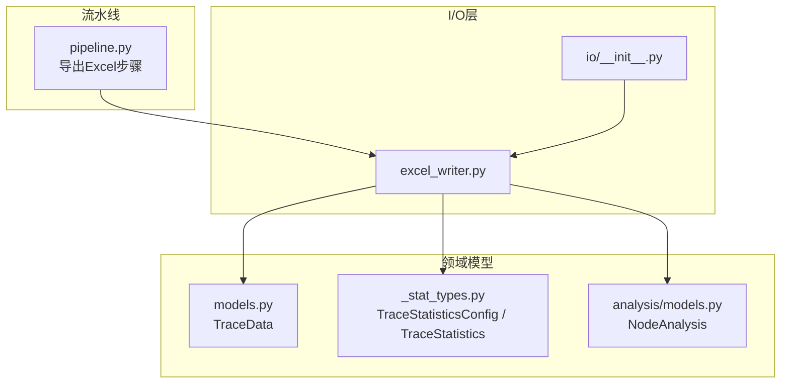
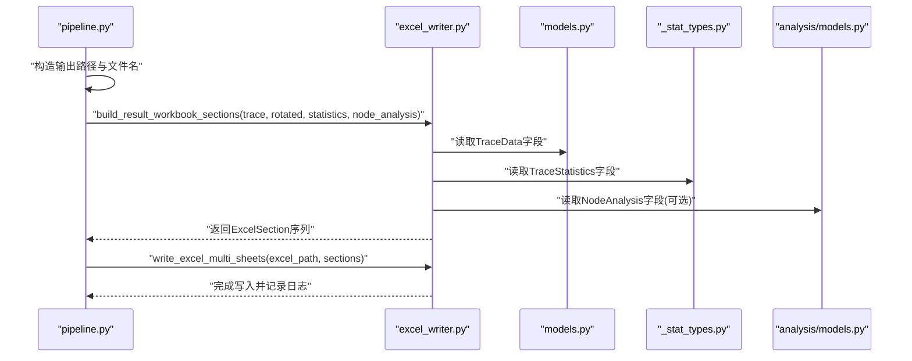
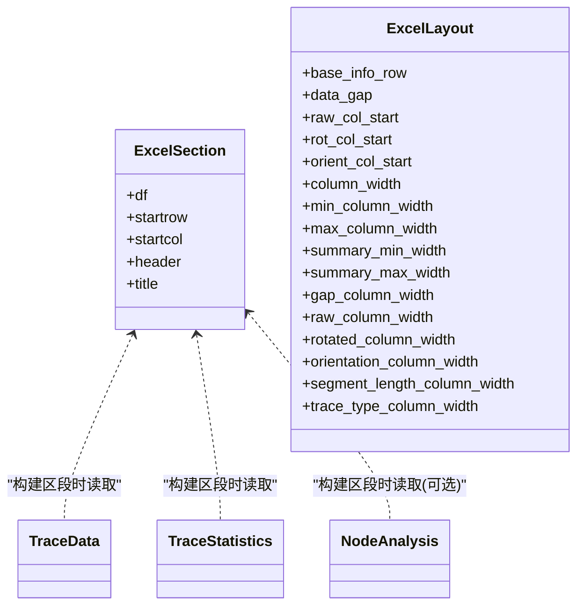

# Excel写入API

<cite>
**本文引用的文件列表**
- [trace_pipeline/io/excel_writer.py](file://trace_pipeline/io/excel_writer.py)
- [trace_pipeline/io/__init__.py](file://trace_pipeline/io/__init__.py)
- [trace_pipeline/models.py](file://trace_pipeline/models.py)
- [trace_pipeline/geology/_stat_types.py](file://trace_pipeline/geology/_stat_types.py)
- [trace_pipeline/analysis/models.py](file://trace_pipeline/analysis/models.py)
- [trace_pipeline/pipeline.py](file://trace_pipeline/pipeline.py)
- [tests/test_excel_writer.py](file://tests/test_excel_writer.py)
</cite>

## 目录
1. [简介](#简介)
2. [项目结构](#项目结构)
3. [核心组件](#核心组件)
4. [架构总览](#架构总览)
5. [详细组件分析](#详细组件分析)
6. [依赖关系分析](#依赖关系分析)
7. [性能与可扩展性](#性能与可扩展性)
8. [故障排查指南](#故障排查指南)
9. [结论](#结论)
10. [附录：字段映射与命名规则](#附录字段映射与命名规则)

## 简介
本文件面向需要导出迹线分析结果至Excel的用户与集成方，系统性说明Excel写入API的能力、数据模型、样式配置、工作表组织与命名规则、字段映射、完整写入流程（含统计结果、节点分析与迹线数据）、以及错误处理与最佳实践。该API支持多工作表输出、统一字体与边框样式、冻结窗格、列宽自适应等特性，并提供布局参数以定制列宽与间距。

## 项目结构
Excel写入能力位于 trace_pipeline.io.excel_writer 模块，并通过 io 子包对外暴露；在数据处理流水线中，由 pipeline 阶段调用构建区段并执行写入。

图表来源
- [trace_pipeline/io/excel_writer.py:1-489](file://trace_pipeline/io/excel_writer.py#L1-L489)
- [trace_pipeline/io/__init__.py:1-22](file://trace_pipeline/io/__init__.py#L1-L22)
- [trace_pipeline/models.py:41-156](file://trace_pipeline/models.py#L41-L156)
- [trace_pipeline/geology/_stat_types.py:14-64](file://trace_pipeline/geology/_stat_types.py#L14-L64)
- [trace_pipeline/analysis/models.py:69-97](file://trace_pipeline/analysis/models.py#L69-L97)
- [trace_pipeline/pipeline.py:375-388](file://trace_pipeline/pipeline.py#L375-L388)

章节来源
- [trace_pipeline/io/excel_writer.py:1-489](file://trace_pipeline/io/excel_writer.py#L1-L489)
- [trace_pipeline/io/__init__.py:1-22](file://trace_pipeline/io/__init__.py#L1-L22)
- [trace_pipeline/pipeline.py:375-388](file://trace_pipeline/pipeline.py#L375-L388)

## 核心组件
- ExcelSection：表示一个待写入的DataFrame片段，包含起始行列、是否带表头、可选标题。
- ExcelLayout：控制输出布局（列起始位置、列宽、行间距等）。
- build_result_workbook_sections：根据输入数据构建多个ExcelSection（基本信息、裂隙情况、计算数据、原始坐标、旋转坐标、走向与长度、节点统计/明细/交点等）。
- write_excel_multi_sheets：将每个ExcelSection写入独立工作表，应用标题、边框、对齐、数字格式、冻结窗格与列宽自适应。

章节来源
- [trace_pipeline/io/excel_writer.py:37-70](file://trace_pipeline/io/excel_writer.py#L37-L70)
- [trace_pipeline/io/excel_writer.py:280-331](file://trace_pipeline/io/excel_writer.py#L280-L331)
- [trace_pipeline/io/excel_writer.py:462-489](file://trace_pipeline/io/excel_writer.py#L462-L489)

## 架构总览
下图展示了从流水线到Excel导出的端到端调用链，包括数据准备、区段构建与最终写入。

图表来源
- [trace_pipeline/pipeline.py:375-388](file://trace_pipeline/pipeline.py#L375-L388)
- [trace_pipeline/io/excel_writer.py:280-331](file://trace_pipeline/io/excel_writer.py#L280-L331)
- [trace_pipeline/io/excel_writer.py:462-489](file://trace_pipeline/io/excel_writer.py#L462-L489)
- [trace_pipeline/models.py:41-156](file://trace_pipeline/models.py#L41-L156)
- [trace_pipeline/geology/_stat_types.py:91-124](file://trace_pipeline/geology/_stat_types.py#L91-L124)
- [trace_pipeline/analysis/models.py:69-97](file://trace_pipeline/analysis/models.py#L69-L97)

## 详细组件分析

### 数据模型与约束
- TraceData：不可变数据容器，包含测线走向、迹线条数、端点坐标、节理走向、测段长度、测线位移及可选实测长度/面积。提供长度派生属性与均值计算。
- TraceStatistics：统计结果，包含各类计数、密度指标、来源标注、诊断信息、圆窗等效面积、缓冲面积与一致性告警等。
- NodeAnalysis：节点分析结果，包含节点集合、交点事件、警告、合并容差、退化跳过数，以及按类型计数的便捷属性。

章节来源
- [trace_pipeline/models.py:41-156](file://trace_pipeline/models.py#L41-L156)
- [trace_pipeline/geology/_stat_types.py:91-124](file://trace_pipeline/geology/_stat_types.py#L91-L124)
- [trace_pipeline/analysis/models.py:69-97](file://trace_pipeline/analysis/models.py#L69-L97)

### 区段构建与输出结构
- 基本信息：测线走向、测线长度、平均迹长、露头面积（含来源标注）。
- 裂隙情况：迹线总数、I型/II型/III型数量。
- 计算数据：线密度P₁₀、面密度P₂₀、面累计长度密度P₂₁、有效取样窗数量，若存在校验告警则追加“校验告警”项。
- 原始端点坐标：起点X/Y、终点X/Y。
- 旋转后端点坐标：旋转后起点X/Y、旋转后终点X/Y。
- 走向与长度：节理走向(°)、端点距离、测段长度(r5+r7)，当提供统计时追加“迹线类型”。
- 节点相关（可选）：节点统计、节点明细、节点交点。

章节来源
- [trace_pipeline/io/excel_writer.py:193-273](file://trace_pipeline/io/excel_writer.py#L193-L273)
- [trace_pipeline/io/excel_writer.py:297-331](file://trace_pipeline/io/excel_writer.py#L297-L331)
- [trace_pipeline/io/excel_writer.py:334-394](file://trace_pipeline/io/excel_writer.py#L334-L394)

### 样式与格式化
- 字体策略：中文标题使用黑体，正文使用宋体；英文/数字统一Times New Roman；混合文本自动分段渲染。
- 单元格样式：统一细边框、居中对齐、数值格式（整数/小数）、冻结窗格（标题+表头行）。
- 列宽自适应：基于内容长度动态调整，限制最小/最大宽度。
- 数字与单位：浮点数保留四位小数并去除尾随零；角度附加度符号；其他单位拼接于数值之后。

章节来源
- [trace_pipeline/io/excel_writer.py:77-148](file://trace_pipeline/io/excel_writer.py#L77-L148)
- [trace_pipeline/io/excel_writer.py:150-168](file://trace_pipeline/io/excel_writer.py#L150-L168)
- [trace_pipeline/io/excel_writer.py:412-460](file://trace_pipeline/io/excel_writer.py#L412-L460)

### 布局配置（ExcelLayout）
- base_info_row：基础信息起始行。
- data_gap：数据块间隔。
- raw_col_start/rot_col_start/orient_col_start：各区块列起始位置。
- column_width/min/max：通用列宽与边界。
- summary_min_width/summary_max_width：摘要区块列宽范围。
- gap_column_width/raw_column_width/rotated_column_width/orientation_column_width/segment_length_column_width/trace_type_column_width：细分列宽。

章节来源
- [trace_pipeline/io/excel_writer.py:48-70](file://trace_pipeline/io/excel_writer.py#L48-L70)

### 写入流程与事务性保证
- 通过pandas.ExcelWriter上下文管理器批量写入所有工作表，确保原子性：任一sheet写入失败会触发异常，避免部分写入。
- 输出目录自动创建，防止因目录不存在导致失败。
- 日志记录写入完成路径，便于追踪。

章节来源
- [trace_pipeline/io/excel_writer.py:462-489](file://trace_pipeline/io/excel_writer.py#L462-L489)

### 单元测试覆盖要点
- 混合中英文字体分段逻辑：首字符为英文或数字时使用西文字体，中文开头使用中文正文字体；纯英文单段使用西文字体。

章节来源
- [tests/test_excel_writer.py:1-50](file://tests/test_excel_writer.py#L1-L50)

## 依赖关系分析
- excel_writer 依赖：
  - models.TraceData：用于读取端点、走向、长度等基础数据。
  - geology._stat_types.TraceStatistics：用于统计信息与来源标注。
  - analysis.models.NodeAnalysis：用于节点统计与明细。
  - openpyxl样式与富文本：用于单元格字体、填充、对齐与富文本。
  - pandas：用于DataFrame与ExcelWriter。
- 外部暴露：
  - io/__init__.py 重新导出 DEFAULT_LAYOUT、ExcelLayout、build_result_workbook_sections、write_excel_multi_sheets，供上层服务或CLI使用。

图表来源
- [trace_pipeline/io/excel_writer.py:37-70](file://trace_pipeline/io/excel_writer.py#L37-L70)
- [trace_pipeline/models.py:41-156](file://trace_pipeline/models.py#L41-L156)
- [trace_pipeline/geology/_stat_types.py:91-124](file://trace_pipeline/geology/_stat_types.py#L91-L124)
- [trace_pipeline/analysis/models.py:69-97](file://trace_pipeline/analysis/models.py#L69-L97)

章节来源
- [trace_pipeline/io/__init__.py:1-22](file://trace_pipeline/io/__init__.py#L1-L22)
- [trace_pipeline/io/excel_writer.py:1-489](file://trace_pipeline/io/excel_writer.py#L1-L489)

## 性能与可扩展性
- 列宽自适应在一次遍历中完成，避免二次扫描整列，提升大表写入性能。
- 数值格式与字体设置批量应用，减少重复对象创建。
- 可通过ExcelLayout调整列宽与起始位置，优化不同数据集的展示效果。
- 建议对超大表格进行分页或分表导出，以降低内存占用与IO压力。

[本节为通用指导，不直接分析具体文件]

## 故障排查指南
- 形状不一致：当旋转坐标与原始端点形状不一致时抛出异常，需检查数据预处理与变换逻辑。
- 非有限值：旋转坐标包含NaN或Inf时会报错，应清理数据或增加有效性校验。
- 迹线类型数量不匹配：当提供的统计结果中的迹线类型数量与迹线条数不一致时报错，需核对统计计算与数据源。
- 权限与占用：若输出文件被打开或无写入权限，上层会捕获并给出友好提示，请关闭已打开的文件并重试。

章节来源
- [trace_pipeline/io/excel_writer.py:288-294](file://trace_pipeline/io/excel_writer.py#L288-L294)
- [trace_pipeline/io/excel_writer.py:314-319](file://trace_pipeline/io/excel_writer.py#L314-L319)
- [trace_pipeline/pipeline.py:450-474](file://trace_pipeline/pipeline.py#L450-L474)

## 结论
Excel写入API提供了稳定、可配置的多工作表导出能力，涵盖基础信息、统计结果、迹线坐标与节点分析等关键内容。其样式与布局具备良好可读性与扩展性，结合事务性写入与完善的错误处理，适合在生产环境中作为标准输出通道。

[本节为总结性内容，不直接分析具体文件]

## 附录：字段映射与命名规则
- 基本信息
  - 测线走向：单位度，保留两位小数并附加度符号。
  - 测线长度：单位米，来自统计或N/A。
  - 平均迹长：单位米，四舍五入至四位小数并去除尾随零。
  - 露头面积：单位平方米，附带来源标注短标签。
- 裂隙情况
  - 迹线数量、I型/II型/III型裂隙数：整数显示。
- 计算数据
  - 线密度(P₁₀)：单位m⁻¹。
  - 面密度(P₂₀)：单位m⁻²，附带来源标注。
  - 面累计长度密度(P₂₁)：单位m⁻¹，附带来源标注。
  - 有效取样窗数量：整数。
  - 校验告警：仅当存在时出现。
- 原始端点坐标
  - 起点X、起点Y、终点X、终点Y。
- 旋转后端点坐标
  - 旋转后起点X、旋转后起点Y、旋转后终点X、旋转后终点Y。
- 走向与长度
  - 节理走向(°)：单位度，保留两位小数。
  - 端点距离：单位米，保留四位小数。
  - 测段长度(r5+r7)：单位米，保留四位小数。
  - 迹线类型：仅在提供统计时追加。
- 节点相关（可选）
  - 节点统计：节点总数、孤立端点(I)、三叉节点(Y)、交叉节点(X)、交点事件数、节点密度（个/m²）、合并容差(m)、跳过退化线段数。
  - 节点明细：节点ID、X、Y、类型、拓扑值、连接迹线、事件数。
  - 节点交点：迹线A、迹线B、交点X、交点Y、参数t、参数u、事件类型（相交/端点接触/重叠）。

章节来源
- [trace_pipeline/io/excel_writer.py:193-273](file://trace_pipeline/io/excel_writer.py#L193-L273)
- [trace_pipeline/io/excel_writer.py:297-331](file://trace_pipeline/io/excel_writer.py#L297-L331)
- [trace_pipeline/io/excel_writer.py:334-394](file://trace_pipeline/io/excel_writer.py#L334-L394)