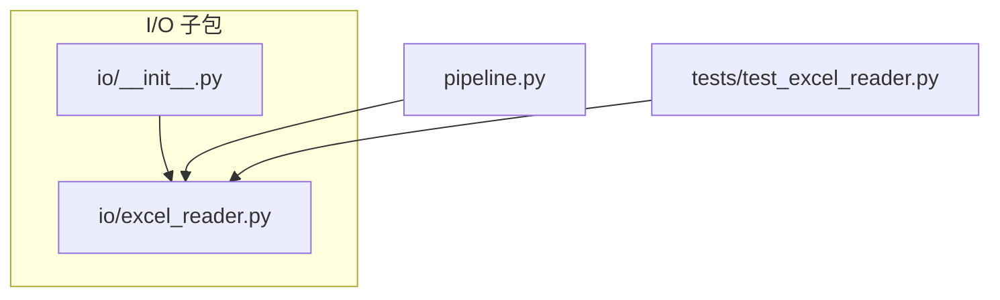
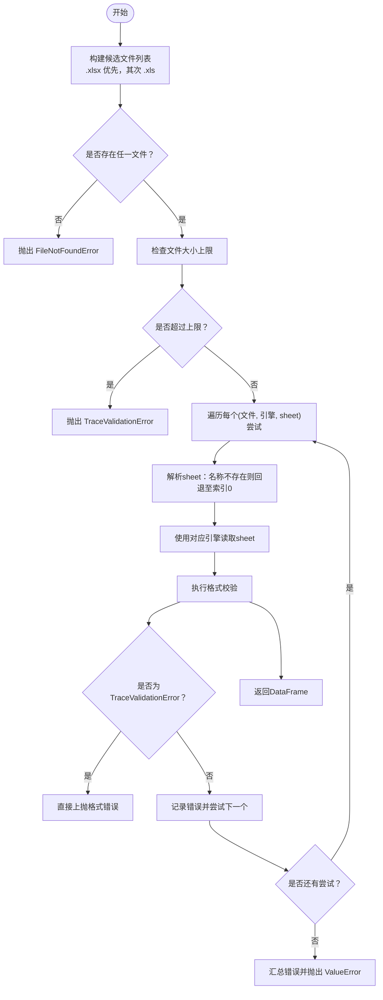
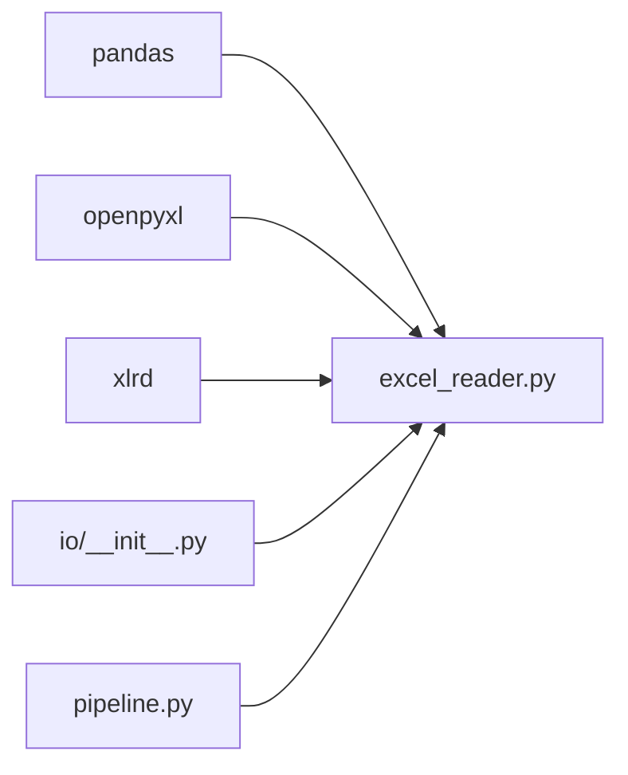

# Excel读取API

<cite>
**本文引用的文件**
- [excel_reader.py](file://trace_pipeline/io/excel_reader.py)
- [__init__.py](file://trace_pipeline/io/__init__.py)
- [pipeline.py](file://trace_pipeline/pipeline.py)
- [test_excel_reader.py](file://tests/test_excel_reader.py)
</cite>

## 目录
1. [简介](#简介)
2. [项目结构](#项目结构)
3. [核心组件](#核心组件)
4. [架构总览](#架构总览)
5. [详细组件分析](#详细组件分析)
6. [依赖关系分析](#依赖关系分析)
7. [性能与内存优化](#性能与内存优化)
8. [故障排查指南](#故障排查指南)
9. [结论](#结论)
10. [附录：函数签名与参数说明](#附录函数签名与参数说明)

## 简介
本章节面向需要读取地质“迹线表”Excel文件的开发者，聚焦于 trace_pipeline.io.excel_reader 模块中的 read_trace_excel 函数。该函数提供：
- 自动解析输入路径与工作表名
- 工作表不存在时的回退策略（优先首表）
- 对 .xlsx/.xls 的格式支持与引擎选择（openpyxl/xlrd）
- 基础格式校验与错误处理
- 大文件限制与异常类型 TraceValidationError 的使用场景

## 项目结构
Excel读取能力位于 trace_pipeline/io 子包中，对外通过 __init__.py 暴露 read_trace_excel；上层 pipeline 模块在加载数据时调用该函数。

图表来源
- [__init__.py:1-22](file://trace_pipeline/io/__init__.py#L1-L22)
- [excel_reader.py:1-25](file://trace_pipeline/io/excel_reader.py#L1-L25)
- [pipeline.py:60-75](file://trace_pipeline/pipeline.py#L60-L75)
- [test_excel_reader.py:1-46](file://tests/test_excel_reader.py#L1-L46)

章节来源
- [__init__.py:1-22](file://trace_pipeline/io/__init__.py#L1-L22)
- [excel_reader.py:1-25](file://trace_pipeline/io/excel_reader.py#L1-L25)
- [pipeline.py:60-75](file://trace_pipeline/pipeline.py#L60-L75)
- [test_excel_reader.py:1-46](file://tests/test_excel_reader.py#L1-L46)

## 核心组件
- read_trace_excel：主入口函数，负责文件定位、引擎选择、工作表解析、大小限制、读取与校验。
- _resolve_sheet_arg：在工作表名为字符串且存在时直接返回；不存在则回退到索引0，避免失败读取。
- _validate_trace_dataframe：校验列数下限与前若干行的数值有效性，必要时记录警告。
- TraceValidationError：自定义异常，继承 ValueError，用于区分“数据格式错误”与“工作表不存在”。

章节来源
- [excel_reader.py:28-33](file://trace_pipeline/io/excel_reader.py#L28-L33)
- [excel_reader.py:36-106](file://trace_pipeline/io/excel_reader.py#L36-L106)
- [excel_reader.py:109-125](file://trace_pipeline/io/excel_reader.py#L109-L125)
- [excel_reader.py:128-168](file://trace_pipeline/io/excel_reader.py#L128-L168)

## 架构总览
read_trace_excel 的工作流如下：
- 根据 base_path 与 table_stem 构造候选文件名（.xlsx 优先，其次 .xls）。
- 若均不存在，抛出 FileNotFoundError。
- 检查文件大小上限，超过则抛出 TraceValidationError。
- 遍历候选文件，按引擎 openpyxl/xlrd 读取指定 sheet；若 sheet 不存在，先尝试解析为实际 sheet（不存在则回退至首表），再读取。
- 读取后执行格式校验；若为 TraceValidationError，直接上抛；其他异常记录并继续下一个尝试；全部失败则汇总错误信息并抛出 ValueError。

图表来源
- [excel_reader.py:36-106](file://trace_pipeline/io/excel_reader.py#L36-L106)
- [excel_reader.py:109-125](file://trace_pipeline/io/excel_reader.py#L109-L125)
- [excel_reader.py:128-168](file://trace_pipeline/io/excel_reader.py#L128-L168)

## 详细组件分析

### 函数：read_trace_excel
- 功能概述
  - 支持 .xlsx 与 .xls 两种格式，分别由 openpyxl 与 xlrd 引擎驱动。
  - 当传入的 sheet 为 None 或不存在时，回退到第一个 sheet。
  - 对超大文件进行前置拦截，避免 pandas 加载导致内存压力。
  - 读取后进行基本格式校验，确保至少包含四列数值型字段（x1,y1,x2,y2）。
- 关键行为
  - 文件发现：按扩展名顺序生成候选路径，仅对存在的文件建立尝试项。
  - 大小限制：超过阈值（默认约50 MiB）直接抛出 TraceValidationError。
  - 工作表解析：若 sheet 为字符串且不在 sheet_names 中，直接回退到索引0，避免一次失败的读取尝试。
  - 错误分类：
    - TraceValidationError：数据格式问题，立即上抛，不回退。
    - ValueError：通常表示工作表不存在，会被下一次尝试覆盖。
    - 其它异常：记录日志并继续尝试。
- 返回值
  - 无表头的 pandas.DataFrame，列顺序期望为 x1,y1,x2,y2 等数值列。
- 异常
  - FileNotFoundError：未找到任何候选文件。
  - TraceValidationError：文件过大或格式不满足最低要求。
  - ValueError：所有尝试均失败（含工作表不存在、读取异常等）。

章节来源
- [excel_reader.py:16-24](file://trace_pipeline/io/excel_reader.py#L16-L24)
- [excel_reader.py:36-106](file://trace_pipeline/io/excel_reader.py#L36-L106)
- [excel_reader.py:109-125](file://trace_pipeline/io/excel_reader.py#L109-L125)
- [excel_reader.py:128-168](file://trace_pipeline/io/excel_reader.py#L128-L168)

### 辅助函数：_resolve_sheet_arg
- 作用：在不触发完整读取的前提下判断目标 sheet 是否存在；若不存在则回退到索引0。
- 策略：
  - 非字符串或空字符串：直接返回原值（如整数索引或None）。
  - 字符串：打开 ExcelFile 枚举 sheet_names；命中则返回原字符串，否则返回0。
  - 异常容错：若检查工作表失败，保留原始 sheet 参数交由后续读取逻辑处理。

章节来源
- [excel_reader.py:109-125](file://trace_pipeline/io/excel_reader.py#L109-L125)

### 辅助函数：_validate_trace_dataframe
- 作用：对 DataFrame 做最小可行性校验。
- 规则：
  - 列数不足：少于4列直接抛出 TraceValidationError。
  - 数值性检查：取前若干行，对前4列尝试转换为数值并统计有效数量；若有效比例过低，记录警告日志（不影响流程）。
- 设计考量：
  - 仅采样前若干行，降低开销。
  - 将“列数不足/NaN/Inf”视为格式错误，直接上抛，避免掩盖真实问题。

章节来源
- [excel_reader.py:128-168](file://trace_pipeline/io/excel_reader.py#L128-L168)

### 异常：TraceValidationError
- 语义：迹线表格式校验失败。
- 使用场景：
  - 文件过大，超出系统允许的上限。
  - 列数不足或前若干行数值占比过低（结合警告与上抛策略）。
- 兼容性：继承 ValueError，便于现有捕获逻辑兼容；同时作为独立类型，使读取逻辑能区分“数据格式错误”与“工作表不存在”。

章节来源
- [excel_reader.py:28-33](file://trace_pipeline/io/excel_reader.py#L28-L33)
- [excel_reader.py:70-78](file://trace_pipeline/io/excel_reader.py#L70-L78)
- [excel_reader.py:138-142](file://trace_pipeline/io/excel_reader.py#L138-L142)

## 依赖关系分析
- 外部依赖
  - pandas：用于 Excel 读取与 DataFrame 操作。
  - openpyxl：用于 .xlsx 引擎。
  - xlrd：用于 .xls 引擎。
- 内部依赖
  - io.__init__.py 导出 read_trace_excel，供上层模块使用。
  - pipeline.py 在加载阶段调用 read_trace_excel，并将结果用于后续计算。

图表来源
- [excel_reader.py:1-25](file://trace_pipeline/io/excel_reader.py#L1-25)
- [__init__.py:1-22](file://trace_pipeline/io/__init__.py#L1-22)
- [pipeline.py:60-75](file://trace_pipeline/pipeline.py#L60-L75)

章节来源
- [excel_reader.py:1-25](file://trace_pipeline/io/excel_reader.py#L1-25)
- [__init__.py:1-22](file://trace_pipeline/io/__init__.py#L1-22)
- [pipeline.py:60-75](file://trace_pipeline/pipeline.py#L60-L75)

## 性能与内存优化
- 大文件限制
  - 内置文件大小上限（默认约50 MiB），超过即拒绝读取，避免内存溢出。
  - 建议：对于超大数据集，考虑分表拆分或使用数据库/Parquet等更适合大规模数据的格式。
- 工作表解析优化
  - 通过预先检查 sheet_names 并在不存在时直接回退至首表，减少一次失败的读取尝试。
- 读取与校验
  - 读取时不使用 header，避免额外解析开销。
  - 校验仅采样前若干行，降低 CPU 与内存占用。
- 缓存与复用
  - 上层 pipeline 对加载结果进行基于文件签名的缓存，避免重复读取与解析。
- 引擎选择
  - .xlsx 使用 openpyxl，.xls 使用 xlrd；两者均为纯 Python 实现，跨平台稳定。
  - 若环境缺少 xlrd，需安装对应依赖以支持 .xls 读取。

章节来源
- [excel_reader.py:23](file://trace_pipeline/io/excel_reader.py#L23)
- [excel_reader.py:109-125](file://trace_pipeline/io/excel_reader.py#L109-L125)
- [excel_reader.py:128-168](file://trace_pipeline/io/excel_reader.py#L128-L168)
- [pipeline.py:60-75](file://trace_pipeline/pipeline.py#L60-L75)

## 故障排查指南
- 常见错误与处理
  - 未找到文件：确认 base_path 与 table_stem 是否正确，目录下是否存在 .xlsx 或 .xls。
  - 工作表不存在：若传入的 sheet 名称不存在，函数会回退到首表；如需强制特定 sheet，请确保名称正确。
  - 文件格式错误：若列数不足或前若干行数值占比过低，将抛出 TraceValidationError；请检查数据源是否符合 x1,y1,x2,y2 等数值列要求。
  - 文件过大：超过上限将被拒绝；请拆分文件或调整业务策略。
  - 引擎缺失：若环境中未安装 xlrd，将无法读取 .xls 文件；请安装依赖。
- 日志定位
  - 调试级别日志包含“读取文件”、“工作表不存在”、“失败（将尝试回退）”等信息，有助于快速定位问题。
- 测试用例参考
  - 工作表回退行为：当传入的 sheet 不存在时，应回退到首表且不产生“失败（将尝试回退）”日志。
  - 大文件拒绝：超过上限的文件应抛出 TraceValidationError，且错误消息中包含文件名与大小信息。

章节来源
- [excel_reader.py:36-106](file://trace_pipeline/io/excel_reader.py#L36-L106)
- [excel_reader.py:109-125](file://trace_pipeline/io/excel_reader.py#L109-L125)
- [test_excel_reader.py:13-31](file://tests/test_excel_reader.py#L13-L31)
- [test_excel_reader.py:33-46](file://tests/test_excel_reader.py#L33-L46)

## 结论
read_trace_excel 提供了稳健的迹线表读取能力，具备：
- 多格式支持与智能引擎选择
- 工作表回退机制与预检优化
- 明确的大文件限制与异常分类
- 轻量但有效的格式校验
在实际使用中，建议遵循数据规范（至少四列数值型）、合理设置 sheet 名称，并结合上层缓存策略提升整体性能。

## 附录：函数签名与参数说明
- 函数签名
  - read_trace_excel(base_path: str, table_stem: str, sheet: str | int | None = None) -> pd.DataFrame
- 参数说明
  - base_path：输入目录路径（字符串）。
  - table_stem：不含扩展名的文件名。
  - sheet：工作表名或索引；为 None 或不存在时回退到第一个 sheet。
- 返回值
  - pandas.DataFrame：无表头的数据框，期望前几列为数值型（x1,y1,x2,y2）。
- 异常
  - FileNotFoundError：未找到 .xlsx 或 .xls。
  - TraceValidationError：文件过大或格式不满足最低要求。
  - ValueError：所有尝试均失败（含工作表不存在、读取异常等）。

章节来源
- [excel_reader.py:36-54](file://trace_pipeline/io/excel_reader.py#L36-L54)
- [excel_reader.py:66-106](file://trace_pipeline/io/excel_reader.py#L66-L106)
- [excel_reader.py:128-168](file://trace_pipeline/io/excel_reader.py#L128-L168)