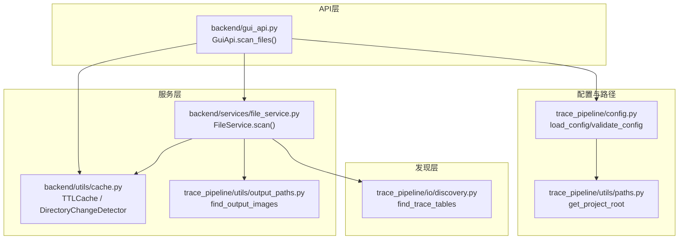
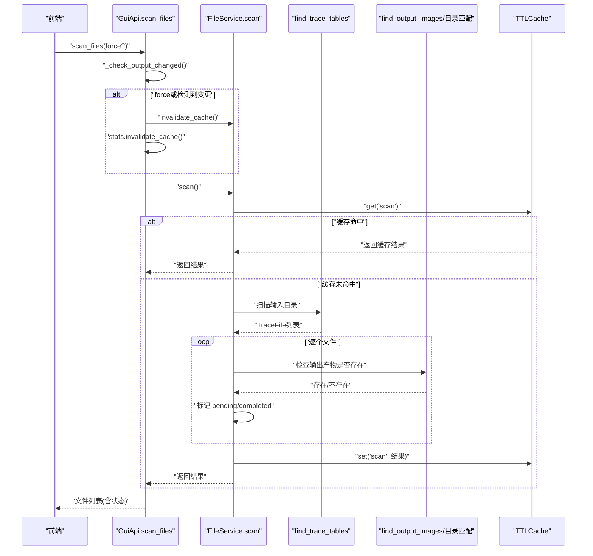
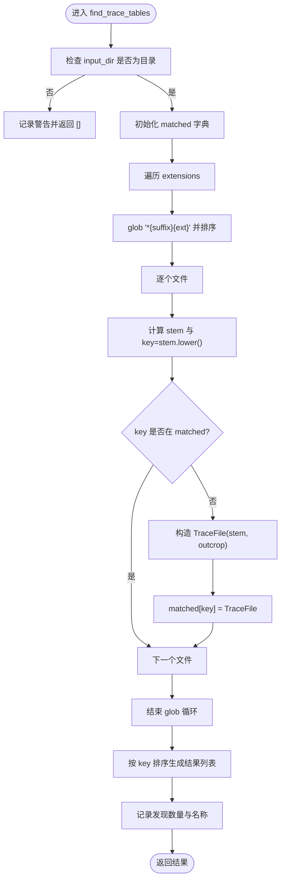
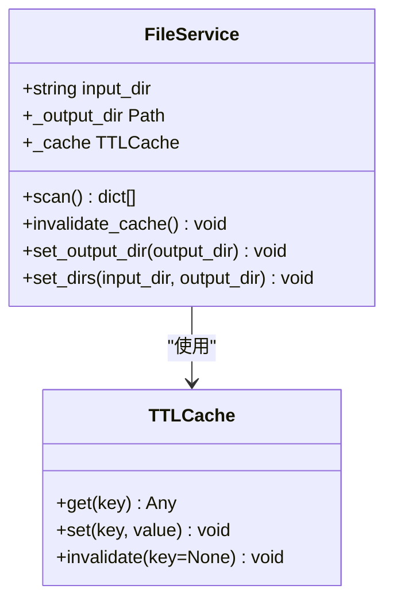
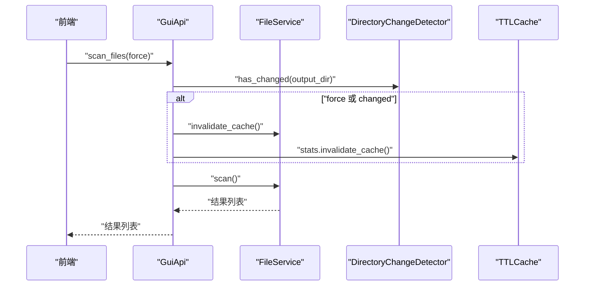
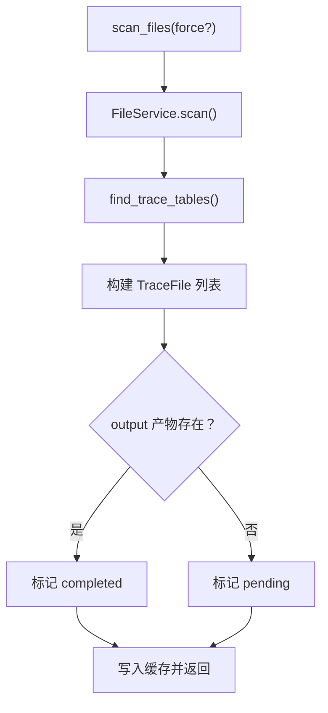
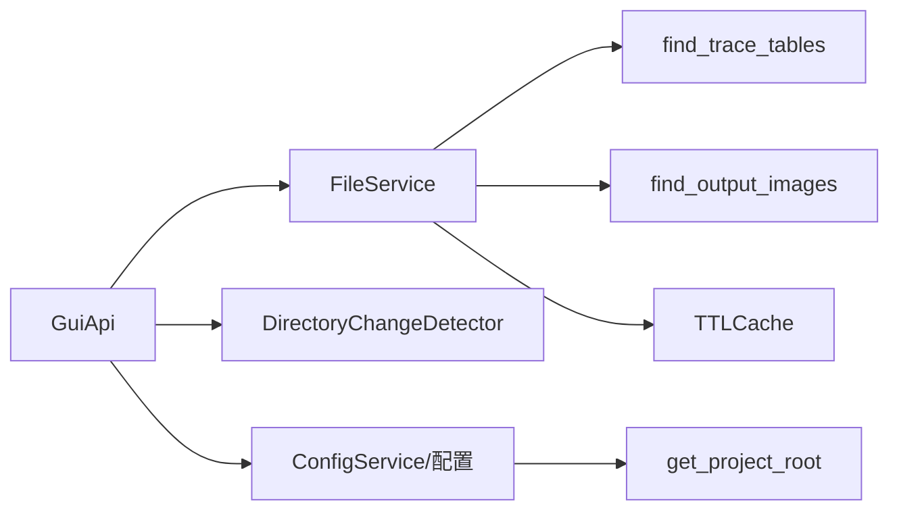

# 文件发现API

<cite>
**本文引用的文件**   
- [discovery.py](file://trace_pipeline/io/discovery.py)
- [file_service.py](file://backend/services/file_service.py)
- [gui_api.py](file://backend/gui_api.py)
- [cache.py](file://backend/utils/cache.py)
- [paths.py](file://trace_pipeline/utils/paths.py)
- [config.py](file://trace_pipeline/config.py)
- [output_paths.py](file://trace_pipeline/utils/output_paths.py)
- [data_service.py](file://backend/services/data_service.py)
- [config.example.json](file://config.example.json)
</cite>

## 目录
1. [简介](#简介)
2. [项目结构](#项目结构)
3. [核心组件](#核心组件)
4. [架构总览](#架构总览)
5. [详细组件分析](#详细组件分析)
6. [依赖关系分析](#依赖关系分析)
7. [性能与增量更新](#性能与增量更新)
8. [故障排查指南](#故障排查指南)
9. [结论](#结论)
10. [附录：使用示例与集成指南](#附录使用示例与集成指南)

## 简介
本文件发现API负责在输入目录中自动扫描并识别“迹线表”Excel文件，提供统一的匹配规则、去重策略与排序输出；同时结合输出目录结果文件的模式检测，为前端展示“待处理/已完成”状态。该能力被GUI API层封装并提供scan_files接口，供前端调用。

## 项目结构
围绕文件发现的关键代码分布在以下模块：
- trace_pipeline/io/discovery.py：实现输入目录扫描与匹配规则（后缀、扩展名、去重、排序）。
- backend/services/file_service.py：封装扫描流程，带TTL缓存，并基于输出目录产物推断处理状态。
- backend/gui_api.py：对外暴露scan_files等API，统一入口，协调配置、安全校验与缓存失效。
- backend/utils/cache.py：提供TTLCache与DirectoryChangeDetector，支撑缓存与增量变更检测。
- trace_pipeline/utils/output_paths.py：根据输出图片命名模式查找已生成的结果图。
- trace_pipeline/config.py：配置加载与路径解析，确保input_dir/output_dir为绝对路径。
- trace_pipeline/utils/paths.py：项目根与工作目录推断。
- backend/services/data_service.py：读取输入/输出Excel数据，辅助理解输入文件命名约定。
- config.example.json：配置文件模板，包含input_dir/output_dir等关键项。

图示来源
- [discovery.py:24-62](file://trace_pipeline/io/discovery.py#L24-L62)
- [file_service.py:29-89](file://backend/services/file_service.py#L29-L89)
- [cache.py:18-90](file://backend/utils/cache.py#L18-L90)
- [output_paths.py:21-40](file://trace_pipeline/utils/output_paths.py#L21-L40)
- [gui_api.py:358-385](file://backend/gui_api.py#L358-L385)
- [config.py:86-190](file://trace_pipeline/config.py#L86-L190)
- [paths.py:12-24](file://trace_pipeline/utils/paths.py#L12-L24)

章节来源
- [discovery.py:1-63](file://trace_pipeline/io/discovery.py#L1-L63)
- [file_service.py:1-103](file://backend/services/file_service.py#L1-L103)
- [gui_api.py:358-385](file://backend/gui_api.py#L358-L385)
- [cache.py:1-155](file://backend/utils/cache.py#L1-L155)
- [output_paths.py:1-41](file://trace_pipeline/utils/output_paths.py#L1-L41)
- [config.py:1-326](file://trace_pipeline/config.py#L1-L326)
- [paths.py:1-43](file://trace_pipeline/utils/paths.py#L1-L43)

## 核心组件
- TraceFile：描述一个发现的迹线表文件，包含stem（完整文件名）与outcrop（露头标识，即去除后缀后的前缀）。
- find_trace_tables(input_dir, suffix, extensions)：遍历输入目录，按后缀与扩展名匹配，同名去重（大小写不敏感），返回按outcrop排序的TraceFile列表。
- FileService.scan()：调用find_trace_tables，并结合输出目录中的图片产物判断每个露头的处理状态（pending/completed），返回结构化列表。
- GuiApi.scan_files(force=False)：对外API，支持强制刷新或检测到output目录外部变更后自动失效缓存，再调用FileService.scan()。

章节来源
- [discovery.py:17-62](file://trace_pipeline/io/discovery.py#L17-L62)
- [file_service.py:17-89](file://backend/services/file_service.py#L17-L89)
- [gui_api.py:358-385](file://backend/gui_api.py#L358-L385)

## 架构总览
文件发现的整体流程如下：
- GUI层接收scan_files请求，必要时检查output目录是否发生外部变更并失效相关缓存。
- FileService.scan()优先从TTL缓存命中结果；未命中则调用底层find_trace_tables进行扫描。
- 对每个发现的迹线表，检查output目录是否存在对应的原始图与旋转图，从而判定状态。
- 将结果写入缓存并返回给前端。

图示来源
- [gui_api.py:358-385](file://backend/gui_api.py#L358-L385)
- [file_service.py:29-89](file://backend/services/file_service.py#L29-L89)
- [discovery.py:24-62](file://trace_pipeline/io/discovery.py#L24-L62)
- [output_paths.py:21-40](file://trace_pipeline/utils/output_paths.py#L21-L40)
- [cache.py:18-90](file://backend/utils/cache.py#L18-L90)

## 详细组件分析

### 输入扫描与匹配规则（find_trace_tables）
- 匹配规则
  - 文件名以指定后缀结尾（默认_process）。
  - 扩展名属于允许集合（默认.xlsx/.xls）。
  - 同名文件在不同扩展名之间去重，保留首次发现（大小写不敏感）。
- 输出
  - 返回TraceFile列表，按outcrop排序。
  - 若目录不存在或无匹配，返回空列表并记录日志。

图示来源
- [discovery.py:24-62](file://trace_pipeline/io/discovery.py#L24-L62)

章节来源
- [discovery.py:11-62](file://trace_pipeline/io/discovery.py#L11-L62)

### 服务层封装（FileService）
- 职责
  - 维护input_dir与output_dir（通过resolve_path解析为绝对路径）。
  - 使用TTLCache缓存扫描结果，避免重复IO。
  - 基于output目录产物判断每个露头的处理状态。
- 状态判定
  - 若存在 {outcrop}_raw(n=*).png 且存在 {outcrop}_rotated(strike=*).png，则状态为completed，否则pending。
- 缓存失效
  - invalidate_cache()清空扫描缓存；set_dirs()会同步更新目录并失效缓存。

图示来源
- [file_service.py:17-103](file://backend/services/file_service.py#L17-L103)
- [cache.py:18-90](file://backend/utils/cache.py#L18-L90)

章节来源
- [file_service.py:17-103](file://backend/services/file_service.py#L17-L103)

### API层（GuiApi.scan_files）
- 功能
  - 调用_check_output_changed()检测output目录外部变更，必要时失效扫描与统计缓存。
  - 支持force参数强制刷新。
  - 调用FileService.scan()获取结果并记录耗时与计数。
- 安全与路径
  - 通过配置与服务同步机制确保input_dir/output_dir为可信绝对路径。

图示来源
- [gui_api.py:358-385](file://backend/gui_api.py#L358-L385)
- [cache.py:92-155](file://backend/utils/cache.py#L92-L155)
- [file_service.py:29-89](file://backend/services/file_service.py#L29-L89)

章节来源
- [gui_api.py:358-385](file://backend/gui_api.py#L358-L385)

### 输出产物模式与状态推断
- 原始图：{outcrop}_raw(n={N}).png
- 旋转图：{outcrop}_rotated(strike={S}).png
- 玫瑰图：{outcrop}_rose(bin={B}).png
- 状态推断逻辑仅依赖原始图与旋转图是否存在。

章节来源
- [file_service.py:52-56](file://backend/services/file_service.py#L52-L56)
- [output_paths.py:21-40](file://trace_pipeline/utils/output_paths.py#L21-L40)

### 输入文件命名约定与层级要求
- 输入文件命名
  - 标准后缀：_process（可配置）。
  - 扩展名：.xlsx 或 .xls（可配置）。
  - 文件名形如 {outcrop}_process.{ext}。
- 层级要求
  - 所有输入文件位于配置的input_dir下（顶层目录）。
  - 当前实现不进行递归子目录扫描。
- 与数据服务的关联
  - data_service读取input/{outcrop}_process.xls/.xlsx作为原始输入源。

章节来源
- [discovery.py:11-14](file://trace_pipeline/io/discovery.py#L11-L14)
- [data_service.py:190-200](file://backend/services/data_service.py#L190-L200)
- [config.example.json:1-26](file://config.example.json#L1-L26)

### 批量文件处理流程（端到端）
- 发现阶段
  - scan_files → FileService.scan → find_trace_tables。
- 验证阶段
  - 输入文件存在性由扫描器保证；后续数据读取由DataService负责。
- 预处理与依赖检查
  - 状态推断依赖output目录产物；若缺失则标记pending。
- 执行阶段
  - 流水线执行后会在output目录生成原始图、旋转图等产物，使状态变为completed。

图示来源
- [gui_api.py:358-385](file://backend/gui_api.py#L358-L385)
- [file_service.py:29-89](file://backend/services/file_service.py#L29-L89)
- [discovery.py:24-62](file://trace_pipeline/io/discovery.py#L24-L62)

章节来源
- [gui_api.py:358-385](file://backend/gui_api.py#L358-L385)
- [file_service.py:29-89](file://backend/services/file_service.py#L29-L89)
- [discovery.py:24-62](file://trace_pipeline/io/discovery.py#L24-L62)

### 自定义发现规则与过滤器扩展
- 可扩展点
  - suffix：控制匹配后缀（默认_process）。
  - extensions：控制允许的扩展名集合（默认(.xlsx, .xls)）。
- 扩展建议
  - 在调用处传入自定义suffix/extensions以实现不同命名规范。
  - 如需更复杂过滤（例如忽略特定前缀/后缀组合），可在上层封装一层filter函数后再传给扫描器。
- 注意
  - 当前实现不支持递归子目录扫描；如需支持，需在调用方先收集候选路径再传入。

章节来源
- [discovery.py:24-62](file://trace_pipeline/io/discovery.py#L24-L62)

### 大目录扫描的性能优化与增量更新
- 扫描缓存
  - TTLCache提供键值级缓存，默认TTL=30秒，避免频繁磁盘扫描。
- 输出目录变更检测
  - DirectoryChangeDetector对output目录建立浅层快照，比较文件名、类型、大小与时间戳，检测外部变更并触发缓存失效。
- 批量驱逐与LRU
  - TTLCache内部采用有序字典+批量淘汰策略，兼顾命中率与内存占用。
- 建议
  - 对于超大目录，适当提高scan缓存TTL，减少scan频率。
  - 在用户手动修改output目录后，可通过scan_files(force=True)或等待下一次_check_output_changed()自动失效。

章节来源
- [file_service.py:23-27](file://backend/services/file_service.py#L23-L27)
- [cache.py:18-90](file://backend/utils/cache.py#L18-L90)
- [cache.py:92-155](file://backend/utils/cache.py#L92-L155)
- [gui_api.py:250-261](file://backend/gui_api.py#L250-L261)

## 依赖关系分析
- 组件耦合
  - GuiApi依赖FileService与缓存工具；FileService依赖discovery与output_paths；discovery无外部业务依赖。
- 外部依赖
  - pathlib/glob用于路径与模式匹配；pandas仅在数据服务中使用，不影响发现流程。
- 潜在环依赖
  - 未发现循环导入；各模块职责清晰。

图示来源
- [gui_api.py:358-385](file://backend/gui_api.py#L358-L385)
- [file_service.py:29-89](file://backend/services/file_service.py#L29-L89)
- [discovery.py:24-62](file://trace_pipeline/io/discovery.py#L24-L62)
- [output_paths.py:21-40](file://trace_pipeline/utils/output_paths.py#L21-L40)
- [cache.py:18-90](file://backend/utils/cache.py#L18-L90)
- [paths.py:12-24](file://trace_pipeline/utils/paths.py#L12-L24)

章节来源
- [gui_api.py:358-385](file://backend/gui_api.py#L358-L385)
- [file_service.py:29-89](file://backend/services/file_service.py#L29-L89)
- [discovery.py:24-62](file://trace_pipeline/io/discovery.py#L24-L62)
- [output_paths.py:21-40](file://trace_pipeline/utils/output_paths.py#L21-L40)
- [cache.py:18-90](file://backend/utils/cache.py#L18-L90)
- [paths.py:12-24](file://trace_pipeline/utils/paths.py#L12-L24)

## 性能与增量更新
- 扫描缓存
  - 默认TTL=30秒，适合高频UI轮询场景，降低磁盘IO压力。
- 增量检测
  - DirectoryChangeDetector通过快照对比快速感知output目录变化，避免全量重新扫描。
- 批量驱逐
  - TTLCache每若干次写入触发一次过期清理，减少锁竞争与遍历开销。
- 建议
  - 在大批量处理完成后，主动调用scan_files(force=True)刷新状态。
  - 调整TTL与maxsize以平衡实时性与内存占用。

[本节为通用性能指导，无需源码引用]

## 故障排查指南
- 常见问题
  - 输入目录不存在：find_trace_tables会记录警告并返回空列表。
  - 无匹配文件：记录未找到匹配的提示，检查suffix与extensions配置。
  - 输出目录外部变更未生效：确认DirectoryChangeDetector是否正常工作，必要时强制刷新。
  - 状态始终pending：检查output目录是否生成了原始图与旋转图，确认命名模式正确。
- 定位方法
  - 查看日志中的stage字段（如file_scan、api_scan_files、output_dir_changed等）。
  - 使用scan_files(force=True)强制刷新，观察是否恢复预期状态。

章节来源
- [discovery.py:40-62](file://trace_pipeline/io/discovery.py#L40-L62)
- [file_service.py:76-89](file://backend/services/file_service.py#L76-L89)
- [gui_api.py:250-261](file://backend/gui_api.py#L250-L261)

## 结论
文件发现API通过简洁的匹配规则与高效缓存机制，实现了稳定可靠的输入文件自动识别与状态推断。配合output目录产物模式检测，系统能够准确反映处理进度，并通过增量变更检测提升响应速度。通过suffix/extensions等参数，用户可以灵活适配不同的命名约定。

[本节为总结性内容，无需源码引用]

## 附录：使用示例与集成指南
- 基本用法
  - 在GUI中调用scan_files(force=false)，即可获取当前input_dir下的迹线表列表及其处理状态。
  - 当手动删除或新增output目录文件时，系统会自动检测并失效缓存，下次调用返回最新状态。
- 配置要点
  - 在config.json中设置input_dir与output_dir（可为相对路径，最终解析为绝对路径）。
  - 如需自定义后缀或扩展名，可在调用处传入suffix与extensions参数。
- 集成步骤
  - 初始化GuiApi实例，确保已加载配置并同步FileService路径。
  - 前端定时轮询scan_files，或在用户操作后显式调用。
  - 处理完成后，再次调用scan_files以刷新状态。

章节来源
- [config.example.json:1-26](file://config.example.json#L1-L26)
- [config.py:86-190](file://trace_pipeline/config.py#L86-L190)
- [gui_api.py:358-385](file://backend/gui_api.py#L358-L385)
- [file_service.py:17-27](file://backend/services/file_service.py#L17-L27)