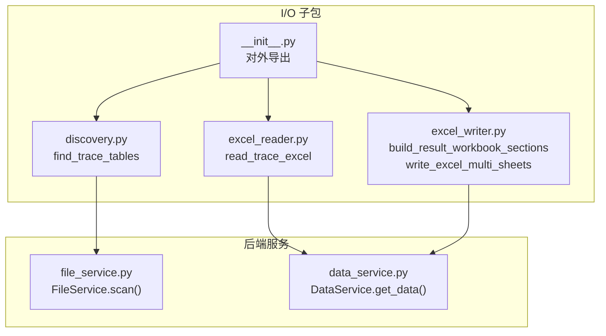
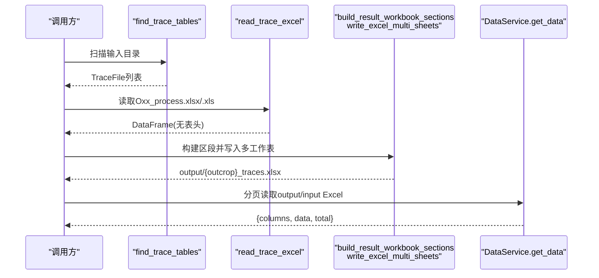
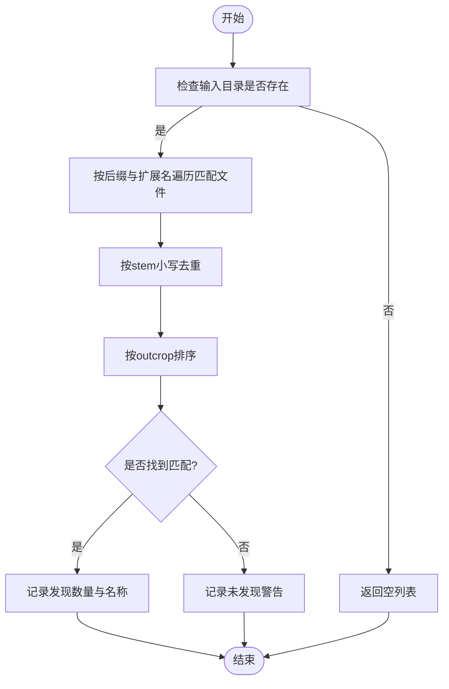
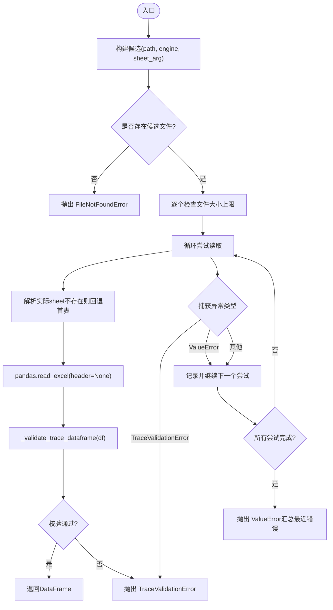
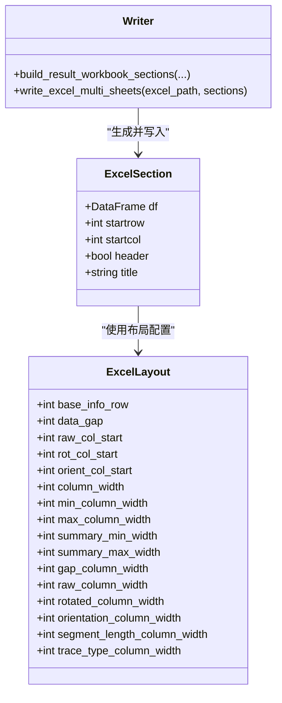
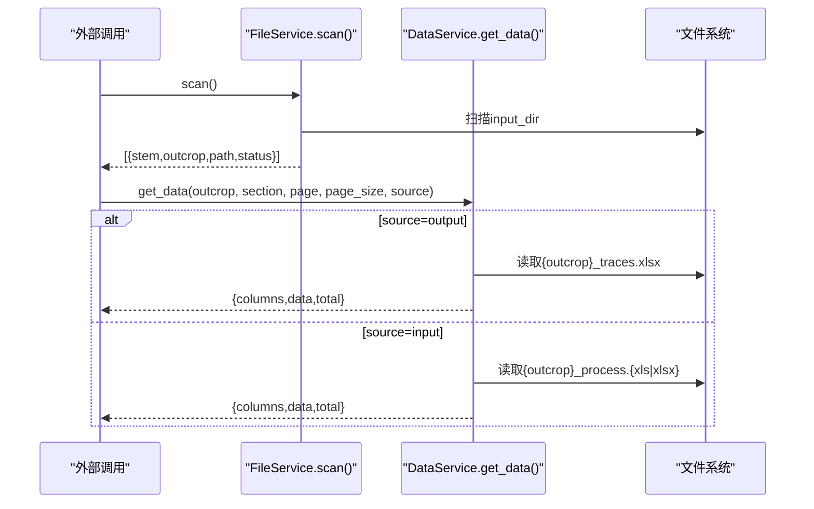
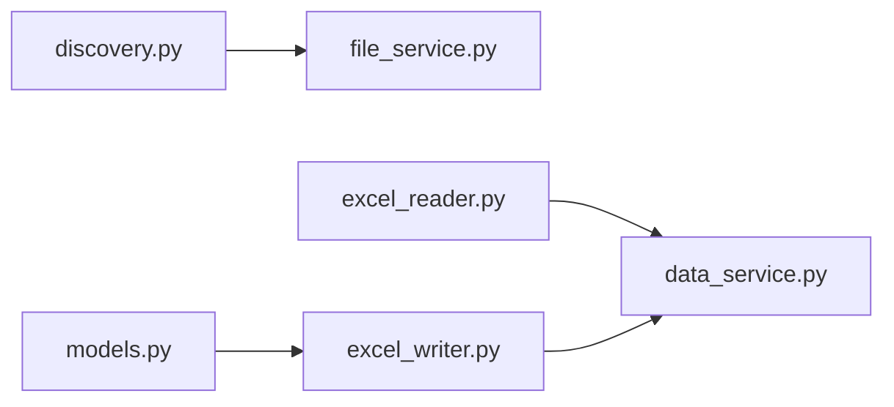
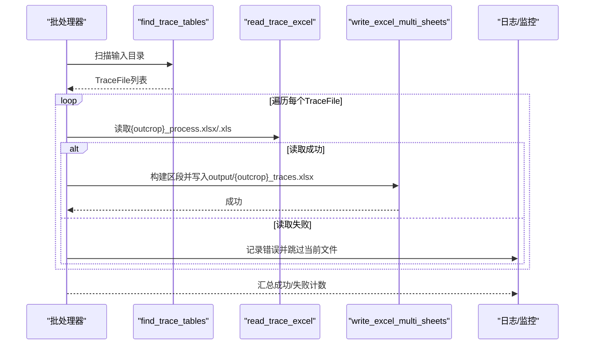

# 文件处理API

<cite>
**本文引用的文件**   
- [trace_pipeline/io/excel_reader.py](file://trace_pipeline/io/excel_reader.py)
- [trace_pipeline/io/excel_writer.py](file://trace_pipeline/io/excel_writer.py)
- [trace_pipeline/io/discovery.py](file://trace_pipeline/io/discovery.py)
- [trace_pipeline/io/__init__.py](file://trace_pipeline/io/__init__.py)
- [backend/services/data_service.py](file://backend/services/data_service.py)
- [backend/services/file_service.py](file://backend/services/file_service.py)
- [tests/test_excel_reader.py](file://tests/test_excel_reader.py)
- [tests/test_excel_writer.py](file://tests/test_excel_writer.py)
- [trace_pipeline/models.py](file://trace_pipeline/models.py)
</cite>

## 目录
1. [简介](#简介)
2. [项目结构](#项目结构)
3. [核心组件](#核心组件)
4. [架构总览](#架构总览)
5. [详细组件分析](#详细组件分析)
6. [依赖关系分析](#依赖关系分析)
7. [性能与内存优化](#性能与内存优化)
8. [批量处理与错误恢复示例](#批量处理与错误恢复示例)
9. [自定义数据源适配器开发指南](#自定义数据源适配器开发指南)
10. [故障排查](#故障排查)
11. [结论](#结论)

## 简介
本文件处理API聚焦于Excel文件的读取与写入，提供迹线表发现、读取校验、格式转换与多工作表输出能力。核心函数包括：
- find_trace_tables：扫描输入目录，发现符合命名规范的迹线表文件
- read_trace_excel：读取迹线Excel（支持.xlsx/.xls），具备工作表回退与基础格式校验
- build_result_workbook_sections / write_excel_multi_sheets：将处理结果按分区写入多工作表Excel，并应用统一样式

此外，服务层封装了分页读取与缓存策略，便于前端展示与交互。

## 项目结构
与文件处理API相关的代码主要位于 trace_pipeline/io 子包以及后端 services 层：
- io/discovery.py：输入目录扫描与迹线表发现
- io/excel_reader.py：迹线Excel读取与工作表回退、基础校验
- io/excel_writer.py：多工作表构建与写入、单元格样式与字体处理
- io/__init__.py：对外导出公共接口
- backend/services/data_service.py：面向前端的分页读取服务（input/output双源）
- backend/services/file_service.py：基于发现的迹线表列表的扫描服务

图表来源
- [trace_pipeline/io/discovery.py:1-63](file://trace_pipeline/io/discovery.py#L1-L63)
- [trace_pipeline/io/excel_reader.py:1-169](file://trace_pipeline/io/excel_reader.py#L1-L169)
- [trace_pipeline/io/excel_writer.py:1-489](file://trace_pipeline/io/excel_writer.py#L1-L489)
- [trace_pipeline/io/__init__.py:1-22](file://trace_pipeline/io/__init__.py#L1-L22)
- [backend/services/file_service.py:1-103](file://backend/services/file_service.py#L1-L103)
- [backend/services/data_service.py:1-278](file://backend/services/data_service.py#L1-L278)

章节来源
- [trace_pipeline/io/discovery.py:1-63](file://trace_pipeline/io/discovery.py#L1-L63)
- [trace_pipeline/io/excel_reader.py:1-169](file://trace_pipeline/io/excel_reader.py#L1-L169)
- [trace_pipeline/io/excel_writer.py:1-489](file://trace_pipeline/io/excel_writer.py#L1-L489)
- [trace_pipeline/io/__init__.py:1-22](file://trace_pipeline/io/__init__.py#L1-L22)
- [backend/services/file_service.py:1-103](file://backend/services/file_service.py#L1-L103)
- [backend/services/data_service.py:1-278](file://backend/services/data_service.py#L1-L278)

## 核心组件
- 迹线表发现
  - 功能：扫描指定目录，匹配以特定后缀结尾且扩展名为.xlsx/.xls的文件，去重并按露头名排序返回
  - 关键参数：input_dir、suffix（默认_process）、extensions（默认(".xlsx", ".xls")）
  - 返回值：TraceFile(stem, outcrop) 列表

- Excel读取
  - 功能：优先读取.xlsx，缺失则回退.xls；若指定sheet不存在则回退首表；进行文件大小上限检查与基础列数/数值有效性校验
  - 关键参数：base_path、table_stem、sheet（可为None或整数）
  - 异常：TraceValidationError（格式错误/过大）、ValueError（读取失败）、FileNotFoundError（均不存在）

- Excel写入
  - 功能：将基本信息、原始坐标、旋转坐标、走向与长度等分区写入独立工作表，并应用标题合并、边框、冻结窗格、中英文混合字体等样式
  - 关键函数：build_result_workbook_sections（构造区段）、write_excel_multi_sheets（写入）

- 服务层集成
  - FileService：调用find_trace_tables扫描并附带输出产物状态判断
  - DataService：对output多工作表或input单表进行分页读取，内置TTL缓存与签名键

章节来源
- [trace_pipeline/io/discovery.py:17-63](file://trace_pipeline/io/discovery.py#L17-L63)
- [trace_pipeline/io/excel_reader.py:28-106](file://trace_pipeline/io/excel_reader.py#L28-L106)
- [trace_pipeline/io/excel_writer.py:37-70](file://trace_pipeline/io/excel_writer.py#L37-L70)
- [trace_pipeline/io/excel_writer.py:280-331](file://trace_pipeline/io/excel_writer.py#L280-L331)
- [trace_pipeline/io/excel_writer.py:462-489](file://trace_pipeline/io/excel_writer.py#L462-L489)
- [backend/services/file_service.py:17-103](file://backend/services/file_service.py#L17-L103)
- [backend/services/data_service.py:44-188](file://backend/services/data_service.py#L44-L188)

## 架构总览
下图展示了从“发现迹线表”到“读取/写入Excel”，再到“服务层分页读取”的整体流程。

图表来源
- [trace_pipeline/io/discovery.py:24-63](file://trace_pipeline/io/discovery.py#L24-L63)
- [trace_pipeline/io/excel_reader.py:36-106](file://trace_pipeline/io/excel_reader.py#L36-L106)
- [trace_pipeline/io/excel_writer.py:280-331](file://trace_pipeline/io/excel_writer.py#L280-L331)
- [trace_pipeline/io/excel_writer.py:462-489](file://trace_pipeline/io/excel_writer.py#L462-L489)
- [backend/services/data_service.py:78-188](file://backend/services/data_service.py#L78-L188)

## 详细组件分析

### 迹线表发现（find_trace_tables）
- 匹配规则
  - 文件名以 suffix 结尾（不含扩展名）
  - 扩展名在 extensions 集合中
  - 同名文件（不同扩展名）按首次发现去重（大小写不敏感）
- 返回值
  - 按 outcrop 排序的 TraceFile 列表；目录不存在或无匹配时返回空列表
- 日志
  - 未找到匹配时记录警告；找到时记录信息

图表来源
- [trace_pipeline/io/discovery.py:24-63](file://trace_pipeline/io/discovery.py#L24-L63)

章节来源
- [trace_pipeline/io/discovery.py:17-63](file://trace_pipeline/io/discovery.py#L17-L63)

### Excel读取（read_trace_excel）
- 引擎选择
  - .xlsx → openpyxl；.xls → xlrd
- 工作表解析
  - 若指定sheet不存在，直接回退首表，避免失败读取
- 文件大小限制
  - 超过50 MiB直接拒绝，抛出TraceValidationError
- 基础校验
  - 最少列数（至少4列：x1,y1,x2,y2）
  - 前若干行数值占比检测，过低则记录告警
- 异常分类
  - TraceValidationError：数据格式错误（直接上抛）
  - ValueError：工作表不存在或其他读取失败（尝试回退）
  - FileNotFoundError：.xlsx与.xls均不存在

图表来源
- [trace_pipeline/io/excel_reader.py:36-106](file://trace_pipeline/io/excel_reader.py#L36-L106)
- [trace_pipeline/io/excel_reader.py:109-126](file://trace_pipeline/io/excel_reader.py#L109-L126)
- [trace_pipeline/io/excel_reader.py:128-169](file://trace_pipeline/io/excel_reader.py#L128-L169)

章节来源
- [trace_pipeline/io/excel_reader.py:16-25](file://trace_pipeline/io/excel_reader.py#L16-L25)
- [trace_pipeline/io/excel_reader.py:36-106](file://trace_pipeline/io/excel_reader.py#L36-L106)
- [trace_pipeline/io/excel_reader.py:109-126](file://trace_pipeline/io/excel_reader.py#L109-L126)
- [trace_pipeline/io/excel_reader.py:128-169](file://trace_pipeline/io/excel_reader.py#L128-L169)
- [tests/test_excel_reader.py:13-46](file://tests/test_excel_reader.py#L13-L46)

### Excel写入（多工作表）
- 布局与区段
  - ExcelLayout：定义起始行/列、列宽、标题行间距等
  - ExcelSection：包含df、起始位置、是否带表头、标题
- 区段构建
  - 基本信息、裂隙情况、计算数据（可选）
  - 原始端点坐标、旋转后端点坐标、走向与长度
  - 节点统计、节点明细、节点交点（可选）
- 样式与字体
  - 中文黑体/宋体，英文Times New Roman；混合文本分段渲染
  - 表头填充色、边框、居中对齐、冻结窗格
- 写入流程
  - 使用openpyxl引擎，每个区段一个sheet，第1行可留作合并标题

图表来源
- [trace_pipeline/io/excel_writer.py:37-70](file://trace_pipeline/io/excel_writer.py#L37-L70)
- [trace_pipeline/io/excel_writer.py:280-331](file://trace_pipeline/io/excel_writer.py#L280-L331)
- [trace_pipeline/io/excel_writer.py:462-489](file://trace_pipeline/io/excel_writer.py#L462-L489)

章节来源
- [trace_pipeline/io/excel_writer.py:37-70](file://trace_pipeline/io/excel_writer.py#L37-L70)
- [trace_pipeline/io/excel_writer.py:193-273](file://trace_pipeline/io/excel_writer.py#L193-L273)
- [trace_pipeline/io/excel_writer.py:280-331](file://trace_pipeline/io/excel_writer.py#L280-L331)
- [trace_pipeline/io/excel_writer.py:400-460](file://trace_pipeline/io/excel_writer.py#L400-L460)
- [trace_pipeline/io/excel_writer.py:462-489](file://trace_pipeline/io/excel_writer.py#L462-L489)
- [tests/test_excel_writer.py:14-50](file://tests/test_excel_writer.py#L14-L50)

### 服务层集成（Data/File Service）
- FileService
  - 调用find_trace_tables扫描，结合输出产物存在性判断状态（pending/completed）
  - 内部TTL缓存减少重复扫描开销
- DataService
  - 支持source=input/output两种读取路径
  - output：读取多工作表，header=1跳过标题行，按section映射sheet名
  - input：读取原始输入表，按固定列名映射为结构化记录
  - 分页：规范化page/page_size，限制最大页大小
  - 缓存：基于文件mtime+size签名生成cache_key，避免重复IO

图表来源
- [backend/services/file_service.py:29-89](file://backend/services/file_service.py#L29-L89)
- [backend/services/data_service.py:78-188](file://backend/services/data_service.py#L78-L188)
- [backend/services/data_service.py:190-266](file://backend/services/data_service.py#L190-L266)

章节来源
- [backend/services/file_service.py:17-103](file://backend/services/file_service.py#L17-L103)
- [backend/services/data_service.py:44-188](file://backend/services/data_service.py#L44-L188)
- [backend/services/data_service.py:190-266](file://backend/services/data_service.py#L190-L266)

## 依赖关系分析
- 模块内聚与耦合
  - discovery与reader/writer解耦良好，分别负责“发现”和“读写”
  - writer依赖analysis/geology/models用于构建节点与统计区段
  - service层仅依赖io与utils，保持薄封装
- 外部依赖
  - pandas/openpyxl/xlrd：Excel读写
  - numpy：数值计算
- 潜在循环依赖
  - io子包不反向依赖service层，避免循环

图表来源
- [trace_pipeline/io/discovery.py:1-63](file://trace_pipeline/io/discovery.py#L1-L63)
- [trace_pipeline/io/excel_reader.py:1-169](file://trace_pipeline/io/excel_reader.py#L1-L169)
- [trace_pipeline/io/excel_writer.py:1-489](file://trace_pipeline/io/excel_writer.py#L1-L489)
- [backend/services/file_service.py:1-103](file://backend/services/file_service.py#L1-L103)
- [backend/services/data_service.py:1-278](file://backend/services/data_service.py#L1-L278)
- [trace_pipeline/models.py:1-352](file://trace_pipeline/models.py#L1-L352)

章节来源
- [trace_pipeline/io/discovery.py:1-63](file://trace_pipeline/io/discovery.py#L1-L63)
- [trace_pipeline/io/excel_reader.py:1-169](file://trace_pipeline/io/excel_reader.py#L1-L169)
- [trace_pipeline/io/excel_writer.py:1-489](file://trace_pipeline/io/excel_writer.py#L1-L489)
- [backend/services/file_service.py:1-103](file://backend/services/file_service.py#L1-L103)
- [backend/services/data_service.py:1-278](file://backend/services/data_service.py#L1-L278)
- [trace_pipeline/models.py:1-352](file://trace_pipeline/models.py#L1-L352)

## 性能与内存优化
- 大文件防护
  - 读取阶段对单个Excel文件进行大小上限检查（50 MiB），超限直接拒绝，避免pandas加载导致OOM
- 分页与缓存
  - 服务层对output/input读取采用TTL缓存，key包含文件mtime与size，避免重复IO
  - 分页限制最大page_size（如500），降低单次响应体量
- 列宽与样式一次性计算
  - 写入阶段在一次遍历中统计列宽并设置样式，避免二次遍历整列
- 建议
  - 对于超大输入，建议在预处理阶段拆分或压缩非必要列
  - 合理设置TTL与maxsize，平衡新鲜度与内存占用
  - 对只读场景启用只读模式（如openpyxl只读）以降低内存峰值

[本节为通用指导，无需列出具体文件来源]

## 批量处理与错误恢复示例
以下示例演示如何批量发现、读取、写入，并在部分失败时继续处理其他文件。

说明要点
- 使用find_trace_tables获取待处理文件清单
- 对每个文件调用read_trace_excel，捕获TraceValidationError/ValueError并记录日志
- 成功后调用build_result_workbook_sections与write_excel_multi_sheets生成多工作表结果
- 批处理完成后汇总统计，便于后续重试或人工干预

章节来源
- [trace_pipeline/io/discovery.py:24-63](file://trace_pipeline/io/discovery.py#L24-L63)
- [trace_pipeline/io/excel_reader.py:36-106](file://trace_pipeline/io/excel_reader.py#L36-L106)
- [trace_pipeline/io/excel_writer.py:280-331](file://trace_pipeline/io/excel_writer.py#L280-L331)
- [trace_pipeline/io/excel_writer.py:462-489](file://trace_pipeline/io/excel_writer.py#L462-L489)

## 自定义数据源适配器开发指南
目标：在不改动现有io模块的前提下，接入新的数据源（例如CSV、数据库、JSON等），并通过统一的接口被上层服务消费。

步骤
- 定义适配器接口
  - 方法：discover(input_dir, suffix, extensions) -> list[TraceFile]
  - 方法：read(table_stem, sheet=None) -> pd.DataFrame（无表头）
  - 方法：write(output_path, sections) -> None（可选，若需写入）
- 实现适配逻辑
  - discover：按业务规则扫描新数据源，返回与TraceFile兼容的结构
  - read：将新数据转换为与read_trace_excel一致的DataFrame（无表头，列序满足最小要求）
  - write：复用writer的sections与样式机制，或直接写入新格式
- 注册与替换
  - 在io/__init__.py中导出新函数（如read_custom_source）
  - 在服务层新增分支（如source="custom"），根据配置选择适配器
- 测试与验证
  - 编写单元测试覆盖边界条件（空数据、非法值、大文件）
  - 与现有服务层集成，确保分页与缓存正常工作

参考路径
- 发现接口：[trace_pipeline/io/discovery.py:24-63](file://trace_pipeline/io/discovery.py#L24-L63)
- 读取接口：[trace_pipeline/io/excel_reader.py:36-106](file://trace_pipeline/io/excel_reader.py#L36-L106)
- 写入接口：[trace_pipeline/io/excel_writer.py:280-331](file://trace_pipeline/io/excel_writer.py#L280-L331), [trace_pipeline/io/excel_writer.py:462-489](file://trace_pipeline/io/excel_writer.py#L462-L489)
- 对外导出：[trace_pipeline/io/__init__.py:1-22](file://trace_pipeline/io/__init__.py#L1-L22)
- 服务层集成示例：[backend/services/data_service.py:78-188](file://backend/services/data_service.py#L78-L188)

章节来源
- [trace_pipeline/io/discovery.py:24-63](file://trace_pipeline/io/discovery.py#L24-L63)
- [trace_pipeline/io/excel_reader.py:36-106](file://trace_pipeline/io/excel_reader.py#L36-L106)
- [trace_pipeline/io/excel_writer.py:280-331](file://trace_pipeline/io/excel_writer.py#L280-L331)
- [trace_pipeline/io/excel_writer.py:462-489](file://trace_pipeline/io/excel_writer.py#L462-L489)
- [trace_pipeline/io/__init__.py:1-22](file://trace_pipeline/io/__init__.py#L1-L22)
- [backend/services/data_service.py:78-188](file://backend/services/data_service.py#L78-L188)

## 故障排查
- 常见错误与定位
  - 找不到迹线表：确认文件名后缀与扩展名是否符合规则，检查输入目录权限
  - 工作表不存在：read_trace_excel会自动回退首表；若仍失败，检查sheet名称与实际文件一致
  - 数据格式错误：TraceValidationError提示列数不足或数值占比过低，需修正输入表结构
  - 文件过大：超过50 MiB将被拒绝，需拆分或精简数据
  - 输出文件不存在：确认处理流程已执行并生成output/{outcrop}_traces.xlsx
- 调试建议
  - 开启DEBUG日志，关注各阶段的stage字段（如validate_trace、data_get、file_scan）
  - 使用分页参数缩小范围，快速定位问题数据
  - 对比input与output的列名映射，确保SECTION_MAP与实际sheet一致

章节来源
- [trace_pipeline/io/excel_reader.py:128-169](file://trace_pipeline/io/excel_reader.py#L128-L169)
- [backend/services/data_service.py:114-157](file://backend/services/data_service.py#L114-L157)
- [backend/services/file_service.py:48-89](file://backend/services/file_service.py#L48-L89)

## 结论
本文件处理API围绕Excel的读取与写入提供了稳定、可扩展的能力：
- 发现与读取：支持多扩展名与工作表回退，具备严格的基础校验与大文件保护
- 写入与样式：多工作表输出，统一样式与中英文混排字体，提升可读性与专业性
- 服务层集成：分页与缓存策略保障前端体验与系统稳定性
- 扩展性：通过适配器模式可平滑接入新数据源，保持整体架构清晰