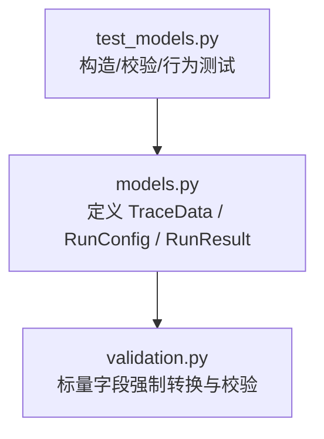
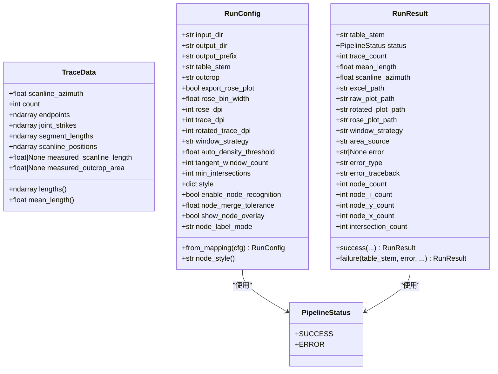
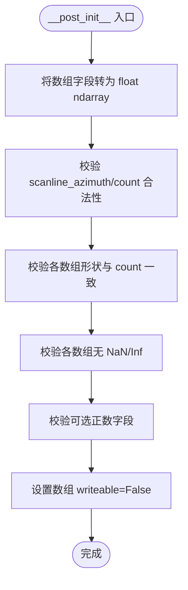
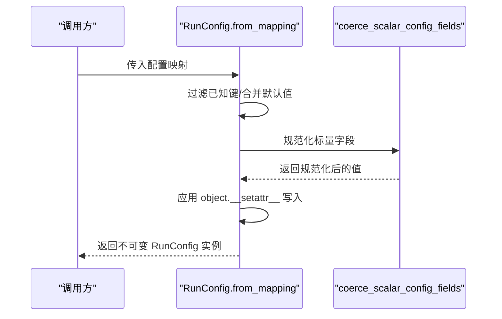
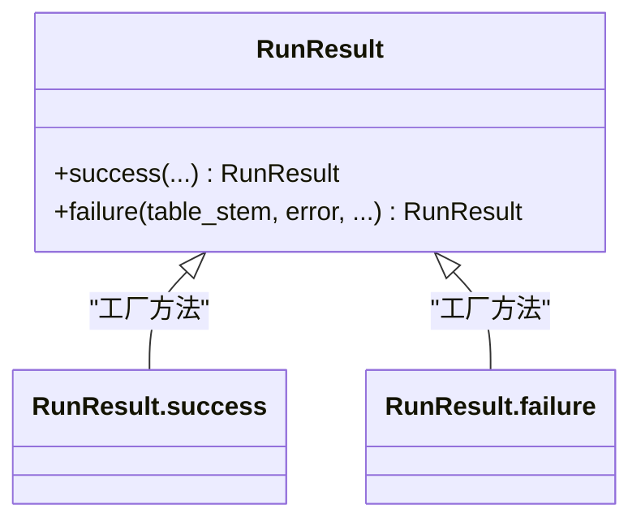
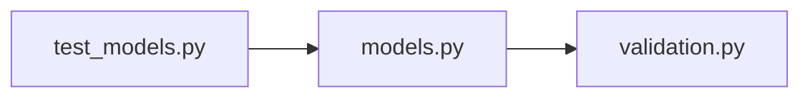

# 核心数据模型

<cite>
**本文引用的文件**   
- [trace_pipeline/models.py](file://trace_pipeline/models.py)
- [trace_pipeline/validation.py](file://trace_pipeline/validation.py)
- [tests/test_models.py](file://tests/test_models.py)
</cite>

## 目录
1. [简介](#简介)
2. [项目结构](#项目结构)
3. [核心组件](#核心组件)
4. [架构总览](#架构总览)
5. [详细组件分析](#详细组件分析)
6. [依赖关系分析](#依赖关系分析)
7. [性能考量](#性能考量)
8. [故障排查指南](#故障排查指南)
9. [结论](#结论)
10. [附录](#附录)

## 简介
本文件聚焦于 TracePipeline 的核心不可变数据模型：TraceData、RunConfig、RunResult。它们采用 frozen dataclass 实现，提供强类型、严格校验与不可变性保证，确保在流水线运行期间数据的安全与一致性。文档将深入解释设计理念、属性约束、验证规则、工厂方法与派生属性，并给出与 pandas DataFrame 的转换思路与最佳实践。

## 项目结构
核心数据模型集中在 trace_pipeline/models.py，标量配置规范化逻辑位于 trace_pipeline/validation.py，单元测试覆盖在 tests/test_models.py。

图表来源
- [trace_pipeline/models.py:1-352](file://trace_pipeline/models.py#L1-L352)
- [trace_pipeline/validation.py:1-112](file://trace_pipeline/validation.py#L1-L112)
- [tests/test_models.py:1-138](file://tests/test_models.py#L1-L138)

章节来源
- [trace_pipeline/models.py:1-352](file://trace_pipeline/models.py#L1-L352)
- [trace_pipeline/validation.py:1-112](file://trace_pipeline/validation.py#L1-L112)
- [tests/test_models.py:1-138](file://tests/test_models.py#L1-L138)

## 核心组件
- TraceData：单张迹线表的完整解析结果，包含端点坐标、走向角、长度、位置等数组，以及可选的实测测线长度与露头面积。
- RunConfig：单次流水线运行的参数集合，包含输入输出路径、绘图分辨率、窗口策略、节点识别相关选项等，支持从映射构造与标量字段规范化。
- RunResult：单次流水线运行结果，包含成功/失败状态、统计摘要、产物路径与错误信息，并提供 success/failure 工厂方法。

章节来源
- [trace_pipeline/models.py:41-156](file://trace_pipeline/models.py#L41-L156)
- [trace_pipeline/models.py:162-272](file://trace_pipeline/models.py#L162-L272)
- [trace_pipeline/models.py:278-351](file://trace_pipeline/models.py#L278-L351)

## 架构总览
三个类均为不可变数据容器，彼此职责清晰：
- TraceData 承载“数据”（只读）；
- RunConfig 承载“配置”（只读）；
- RunResult 承载“结果”（只读）。

图表来源
- [trace_pipeline/models.py:23-35](file://trace_pipeline/models.py#L23-L35)
- [trace_pipeline/models.py:41-156](file://trace_pipeline/models.py#L41-L156)
- [trace_pipeline/models.py:162-272](file://trace_pipeline/models.py#L162-L272)
- [trace_pipeline/models.py:278-351](file://trace_pipeline/models.py#L278-L351)

## 详细组件分析

### TraceData
- 设计目标
  - 作为单一数据源，封装一张迹线表的全部解析结果。
  - 通过 frozen dataclass 与 numpy 数组写保护，确保对象生命周期内数据不可被意外修改。
- 属性与约束
  - 标量：scanline_azimuth 为有限浮点数；count 为非负整数。
  - 数组：endpoints 形状必须为 (N, 4)，其余一维数组长度必须等于 N；所有元素需为有限值（非 NaN/Inf）。
  - 可选正数：measured_scanline_length 与 measured_outcrop_area 可为 None，若存在则必须为正有限浮点数。
- 初始化后处理
  - 将传入的可迭代或数组统一转为 float 类型的 numpy 数组。
  - 对必填字段进行形状与数值有效性校验。
  - 将四个核心数组标记为只读（writeable=False），配合 frozen dataclass 形成双重不可变保障。
- 派生属性
  - lengths：基于端点二维欧氏距离计算，首次访问后缓存，返回只读数组。
  - mean_length：基于 lengths 的平均值，空集时返回 0.0。
- 复杂度
  - lengths 计算时间 O(N)，空间 O(N)。
  - mean_length 时间 O(1)（复用已缓存 lengths）。
- 示例路径（构造与读取）
  - 基本构造与断言：[tests/test_models.py:14-26](file://tests/test_models.py#L14-L26)
  - 负数 count 校验：[tests/test_models.py:28-37](file://tests/test_models.py#L28-L37)
  - 形状不匹配校验：[tests/test_models.py:39-48](file://tests/test_models.py#L39-L48)
  - NaN 检测：[tests/test_models.py:50-59](file://tests/test_models.py#L50-L59)
  - 可选正数校验：[tests/test_models.py:61-71](file://tests/test_models.py#L61-L71)
  - 只读数组断言：[tests/test_models.py:73-83](file://tests/test_models.py#L73-L83)
  - lengths 计算与只读断言：[tests/test_models.py:85-97](file://tests/test_models.py#L85-L97)

图表来源
- [trace_pipeline/models.py:65-121](file://trace_pipeline/models.py#L65-L121)

章节来源
- [trace_pipeline/models.py:41-156](file://trace_pipeline/models.py#L41-L156)
- [tests/test_models.py:11-97](file://tests/test_models.py#L11-L97)

### RunConfig
- 设计目标
  - 以不可变方式表达一次流水线的全部运行参数，集中管理默认值与校验。
- 属性与约束
  - 必填字符串：input_dir、output_dir、output_prefix、table_stem、outcrop，均会被 strip 并禁止为空。
  - 标量字段：布尔、正整数、正浮点数、枚举式字符串（window_strategy、node_label_mode）等，通过 validation 模块统一规范化。
  - 字典字段：style 使用 default_factory 避免共享可变默认值。
  - 额外约束：node_merge_tolerance 必须大于 0。
- 工厂方法
  - from_mapping：从 Mapping 提取已知键，忽略未知键；若未显式提供 node_label_mode，可从 style 中回退获取。
- 派生属性
  - node_style：从 style 字典读取节点样式预设，缺失时回退到 "default"。
- 示例路径（构造与映射构造）
  - 基本构造：[tests/test_models.py:103-111](file://tests/test_models.py#L103-L111)
  - 空字段校验：[tests/test_models.py:113-121](file://tests/test_models.py#L113-L121)
  - from_mapping 用法与未知键忽略：[tests/test_models.py:123-137](file://tests/test_models.py#L123-L137)

图表来源
- [trace_pipeline/models.py:236-267](file://trace_pipeline/models.py#L236-L267)
- [trace_pipeline/validation.py:107-112](file://trace_pipeline/validation.py#L107-L112)

章节来源
- [trace_pipeline/models.py:162-272](file://trace_pipeline/models.py#L162-L272)
- [trace_pipeline/validation.py:1-112](file://trace_pipeline/validation.py#L1-L112)
- [tests/test_models.py:100-137](file://tests/test_models.py#L100-L137)

### RunResult
- 设计目标
  - 以不可变方式记录一次流水线运行的结果，包括成功/失败状态、统计摘要、产物路径与错误详情。
- 属性与约束
  - 状态：PipelineStatus.SUCCESS 或 PipelineStatus.ERROR。
  - 统计：trace_count、mean_length、scanline_azimuth、各类节点计数与交点计数。
  - 产物路径：excel_path、raw_plot_path、rotated_plot_path、rose_plot_path。
  - 错误信息：error、error_type、error_traceback。
- 工厂方法
  - success：便捷构造成功结果，自动设置 status=SUCCESS 且 error=None。
  - failure：便捷构造失败结果，自动设置 status=ERROR 并携带错误信息。
- 示例路径（结果构建与断言）
  - 成功结果字段断言（结合集成测试）：[tests/test_pipeline.py:101-124](file://tests/test_pipeline.py#L101-L124)
  - 服务层使用 success 构造结果（事件映射）：[tests/test_pipeline_service.py:26-55](file://tests/test_pipeline_service.py#L26-L55)

图表来源
- [trace_pipeline/models.py:302-351](file://trace_pipeline/models.py#L302-L351)

章节来源
- [trace_pipeline/models.py:278-351](file://trace_pipeline/models.py#L278-L351)
- [tests/test_pipeline.py:101-124](file://tests/test_pipeline.py#L101-L124)
- [tests/test_pipeline_service.py:26-55](file://tests/test_pipeline_service.py#L26-L55)

## 依赖关系分析
- models.py 依赖 validation.py 提供的标量字段规范化函数，用于 RunConfig 的 __post_init__ 阶段。
- 测试用例直接依赖 models.py 中的类，验证构造、校验与派生属性行为。

图表来源
- [trace_pipeline/models.py:20-21](file://trace_pipeline/models.py#L20-L21)
- [trace_pipeline/validation.py:107-112](file://trace_pipeline/validation.py#L107-L112)
- [tests/test_models.py:1-10](file://tests/test_models.py#L1-L10)

章节来源
- [trace_pipeline/models.py:20-21](file://trace_pipeline/models.py#L20-L21)
- [trace_pipeline/validation.py:1-112](file://trace_pipeline/validation.py#L1-L112)
- [tests/test_models.py:1-138](file://tests/test_models.py#L1-L138)

## 性能考量
- TraceData.lengths 使用懒加载与缓存，避免重复计算；同时返回只读数组，防止外部修改导致缓存失效。
- 所有核心数组在构造后立即标记为只读，减少运行时意外修改带来的开销与风险。
- RunConfig 的标量字段规范化在构造阶段一次性完成，后续读取为 O(1)。

[本节为通用指导，无需具体文件引用]

## 故障排查指南
- TraceData 常见错误
  - 形状不一致：当 endpoints/joint_strikes/segment_lengths/scanline_positions 的长度与 count 不一致时会抛出 ValueError。参考：[tests/test_models.py:39-48](file://tests/test_models.py#L39-L48)
  - 非法数值：数组中包含 NaN/Inf 会触发 ValueError。参考：[tests/test_models.py:50-59](file://tests/test_models.py#L50-L59)
  - 可选正数校验失败：measured_scanline_length/measured_outcrop_area 非正或非有限值时报错。参考：[tests/test_models.py:61-71](file://tests/test_models.py#L61-L71)
- RunConfig 常见错误
  - 必填字符串为空：strip 后为空串会报错。参考：[tests/test_models.py:113-121](file://tests/test_models.py#L113-L121)
  - 标量字段类型/范围不合法：由 validation 模块抛出的 ValueError，如 DPI 非正整数、window_strategy 不在允许集合等。参考：[trace_pipeline/validation.py:63-87](file://trace_pipeline/validation.py#L63-L87)
- RunResult 使用建议
  - 成功路径优先使用 success 工厂方法，失败路径使用 failure，避免手动维护 status 与 error 字段的一致性。参考：[trace_pipeline/models.py:302-351](file://trace_pipeline/models.py#L302-L351)

章节来源
- [tests/test_models.py:39-71](file://tests/test_models.py#L39-L71)
- [trace_pipeline/validation.py:63-87](file://trace_pipeline/validation.py#L63-L87)
- [trace_pipeline/models.py:302-351](file://trace_pipeline/models.py#L302-L351)

## 结论
TraceData、RunConfig、RunResult 构成 TracePipeline 的核心不可变数据层。通过 frozen dataclass、严格的 __post_init__ 校验与只读数组标记，系统在保证数据安全的同时提供了清晰的 API 与良好的可测试性。建议在扩展新功能时遵循相同模式：明确不变性契约、集中校验逻辑、提供工厂方法与派生属性，并在必要时引入缓存优化。

[本节为总结性内容，无需具体文件引用]

## 附录

### 不可变性与安全性机制
- frozen=True：阻止对 dataclass 属性的直接赋值。
- 数组 writeable=False：即使绕过 dataclass 限制，底层数组仍不可写。
- 派生属性缓存：使用 object.__setattr__ 写入私有缓存字段，保持不可变语义的同时提升性能。

章节来源
- [trace_pipeline/models.py:65-121](file://trace_pipeline/models.py#L65-L121)
- [trace_pipeline/models.py:133-151](file://trace_pipeline/models.py#L133-L151)

### 与 pandas DataFrame 的转换方法与最佳实践
当前代码库未在 TraceData/RunConfig/RunResult 中内置 to_dataframe/from_dataframe 方法。推荐做法如下：
- 从 TraceData 导出 DataFrame
  - 将 endpoints 展开为列 x1/y1/x2/y2，并与 joint_strikes、segment_lengths、scanline_positions 拼接。
  - 添加元数据行或列，如 scanline_azimuth、measured_scanline_length、measured_outcrop_area。
  - 注意：由于数组为只读，应创建副本再进行列拼接，避免视图问题。
- 从 DataFrame 构造 TraceData
  - 先校验列名与数量，再转换为 float 型 numpy 数组。
  - 计算 N 并校验各数组形状与 count 一致，最后构造 TraceData。
- 从 RunConfig 导出/导入
  - 导出：将字段展平为一行或多行配置记录，便于版本化与审计。
  - 导入：使用 RunConfig.from_mapping 接收字典，再由 __post_init__ 执行规范化与校验。
- 从 RunResult 导出/导入
  - 导出：将统计字段与路径字段组合为结构化记录，便于报表与追踪。
  - 导入：根据业务需求选择 success/failure 工厂方法或直接构造。

[本节为概念性指导，无需具体文件引用]