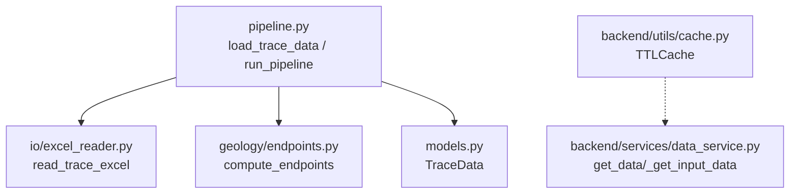
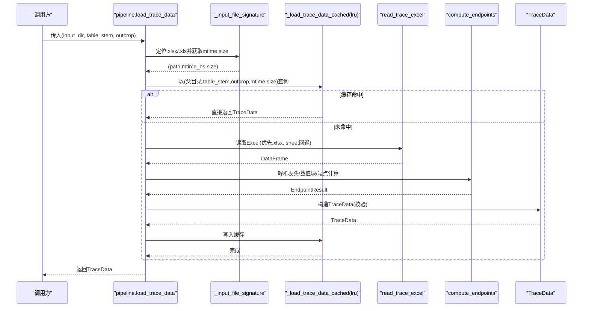
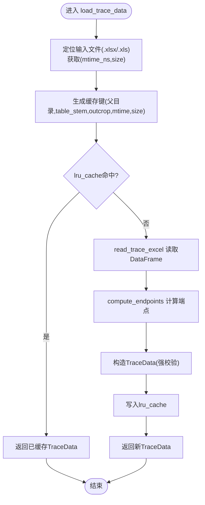
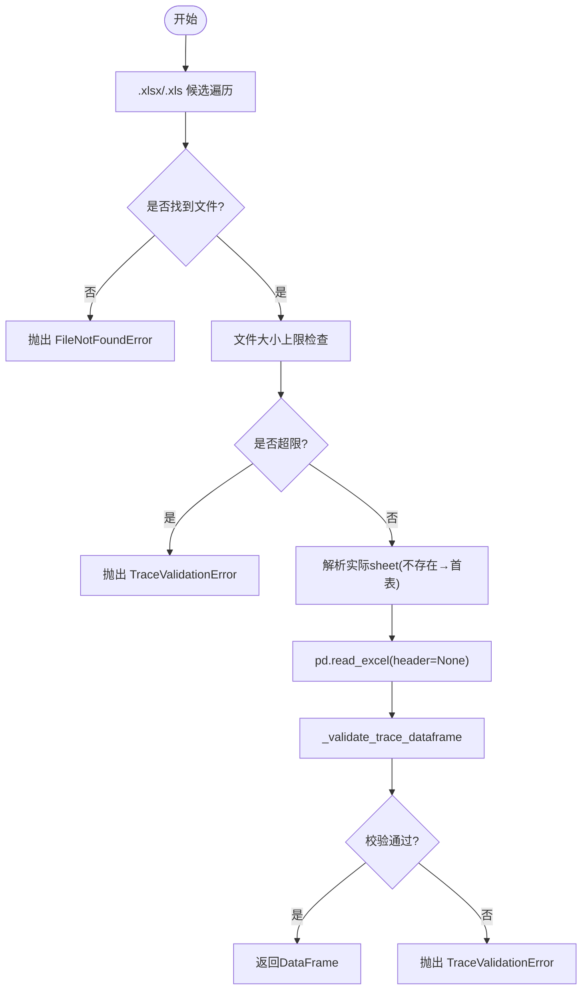
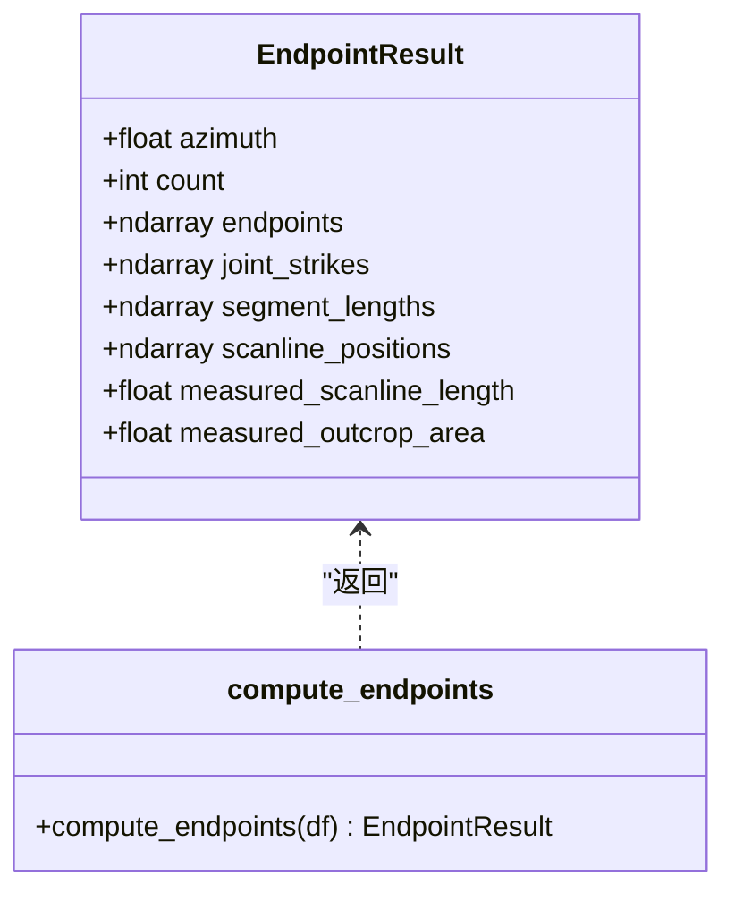
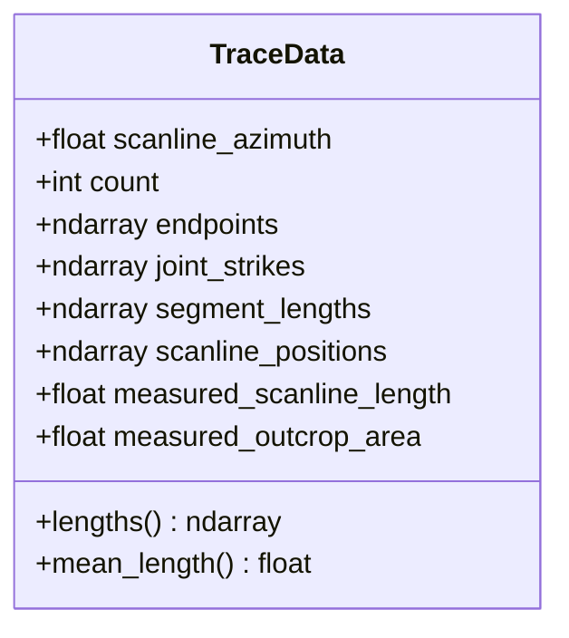
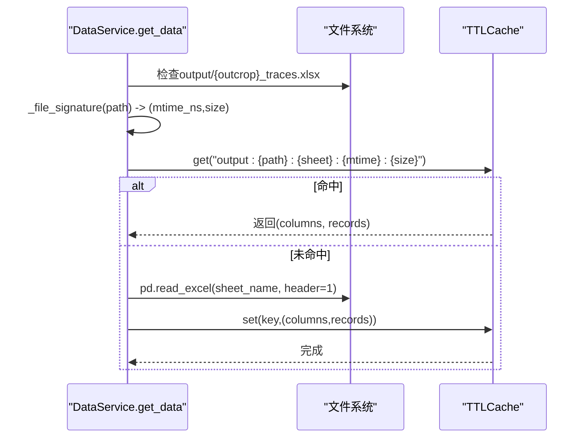
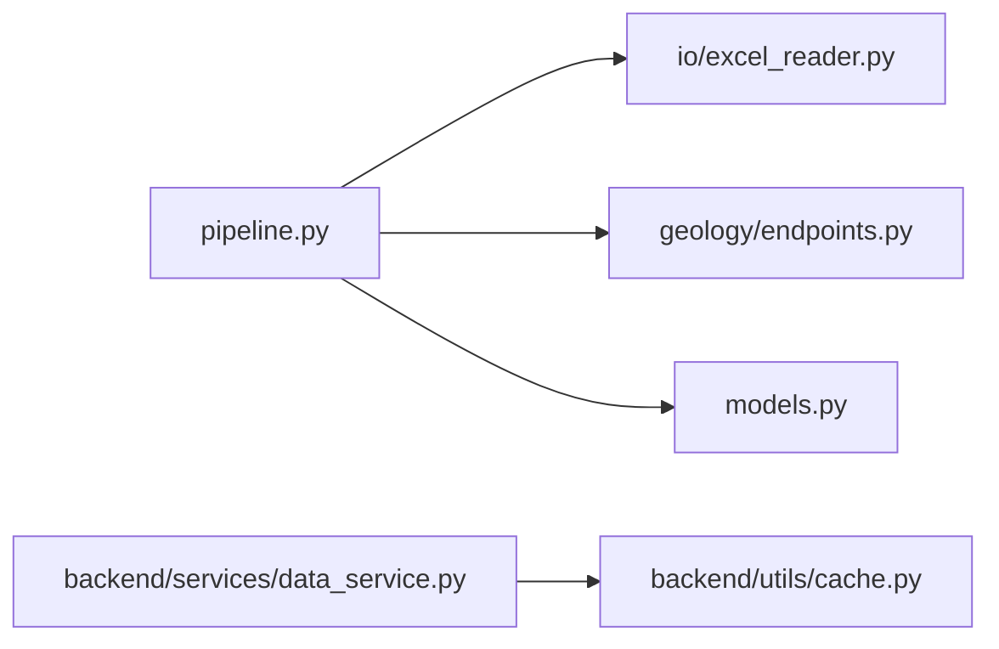

# 数据加载与解析

<cite>
**本文引用的文件**   
- [pipeline.py](file://trace_pipeline/pipeline.py)
- [excel_reader.py](file://trace_pipeline/io/excel_reader.py)
- [endpoints.py](file://trace_pipeline/geology/endpoints.py)
- [models.py](file://trace_pipeline/models.py)
- [cache.py](file://backend/utils/cache.py)
- [data_service.py](file://backend/services/data_service.py)
</cite>

## 目录
1. [简介](#简介)
2. [项目结构](#项目结构)
3. [核心组件](#核心组件)
4. [架构总览](#架构总览)
5. [详细组件分析](#详细组件分析)
6. [依赖关系分析](#依赖关系分析)
7. [性能考量](#性能考量)
8. [故障排查指南](#故障排查指南)
9. [结论](#结论)
10. [附录：使用示例路径](#附录使用示例路径)

## 简介
本章节聚焦“数据加载与解析”能力，围绕 load_trace_data 函数展开，系统阐述其从 Excel 文件定位、读取、端点计算到 TraceData 对象构建的完整流程。同时说明输入文件的签名机制与缓存策略，解释如何避免重复加载相同文件；并给出错误处理最佳实践与实际调用示例路径，帮助读者正确进行数据预处理。

## 项目结构
与数据加载与解析相关的核心模块分布如下：
- trace_pipeline/pipeline.py：编排入口，提供 load_trace_data 与 run_pipeline
- trace_pipeline/io/excel_reader.py：Excel 表发现、回退与基础格式校验
- trace_pipeline/geology/endpoints.py：表头解析、数值块提取、端点坐标向量化计算
- trace_pipeline/models.py：TraceData 等不可变数据模型定义
- backend/utils/cache.py：TTLCache（线程安全 TTL+LRU）
- backend/services/data_service.py：面向前端的 Excel 读取服务（含文件签名与缓存）

图表来源
- [pipeline.py:80-95](file://trace_pipeline/pipeline.py#L80-L95)
- [excel_reader.py:36-106](file://trace_pipeline/io/excel_reader.py#L36-L106)
- [endpoints.py:295-411](file://trace_pipeline/geology/endpoints.py#L295-L411)
- [models.py:41-156](file://trace_pipeline/models.py#L41-L156)
- [cache.py:18-90](file://backend/utils/cache.py#L18-L90)
- [data_service.py:74-188](file://backend/services/data_service.py#L74-L188)

章节来源
- [pipeline.py:80-95](file://trace_pipeline/pipeline.py#L80-L95)
- [excel_reader.py:36-106](file://trace_pipeline/io/excel_reader.py#L36-L106)
- [endpoints.py:295-411](file://trace_pipeline/geology/endpoints.py#L295-L411)
- [models.py:41-156](file://trace_pipeline/models.py#L41-L156)
- [cache.py:18-90](file://backend/utils/cache.py#L18-L90)
- [data_service.py:74-188](file://backend/services/data_service.py#L74-L188)

## 核心组件
- load_trace_data：对外暴露的数据加载接口，负责定位输入文件、生成文件签名、调用内部缓存加载器、组装 TraceData 并记录耗时。
- _input_file_signature：在 input_dir 下按 table_stem 查找 .xlsx/.xls，返回 (path, mtime_ns, size)。
- _load_trace_data_cached：基于 lru_cache 的加载器，以 (input_dir, table_stem, outcrop, mtime_ns, size) 为键，避免重复 IO 与计算。
- read_trace_excel：Excel 候选扩展名优先（.xlsx > .xls），sheet 不存在时回退首表，并进行基础格式校验。
- compute_endpoints：解析表头、提取数值矩阵、将倾向转为走向、按左/右/双侧三种情况向量化计算端点坐标。
- TraceData：不可变数据容器，包含测线走向、迹线条数、端点坐标、节理走向、分段长度、测线位置及可选实测量，并在构造期做严格校验。
- TTLCache：线程安全的 TTL + LRU 缓存，用于前端数据服务的快速读取。

章节来源
- [pipeline.py:50-95](file://trace_pipeline/pipeline.py#L50-L95)
- [excel_reader.py:36-106](file://trace_pipeline/io/excel_reader.py#L36-L106)
- [endpoints.py:295-411](file://trace_pipeline/geology/endpoints.py#L295-L411)
- [models.py:41-156](file://trace_pipeline/models.py#L41-L156)
- [cache.py:18-90](file://backend/utils/cache.py#L18-L90)

## 架构总览
下图展示 load_trace_data 的端到端流程：文件定位 → 签名 → 缓存命中判断 → Excel 读取 → 端点计算 → TraceData 构建 → 返回结果。

图表来源
- [pipeline.py:80-95](file://trace_pipeline/pipeline.py#L80-L95)
- [excel_reader.py:36-106](file://trace_pipeline/io/excel_reader.py#L36-L106)
- [endpoints.py:295-411](file://trace_pipeline/geology/endpoints.py#L295-L411)
- [models.py:41-156](file://trace_pipeline/models.py#L41-L156)

## 详细组件分析

### load_trace_data 工作流
- 输入参数：input_dir（输入目录）、table_stem（不含扩展名的文件名）、outcrop（露头标识，作为 sheet 名）。
- 文件定位：_input_file_signature 在 input_dir 下依次尝试 {table_stem}.xlsx 与 {table_stem}.xls，找到后返回 path、mtime_ns、size。
- 缓存键：_load_trace_data_cached 使用 (str(path.parent), table_stem, outcrop, mtime_ns, size) 作为 lru_cache 键，确保同一物理文件不会重复解析。
- 数据读取：read_trace_excel 优先 .xlsx，缺失则回退 .xls；若指定 sheet 不存在，会回退首表；对超大文件与基础格式进行校验。
- 端点计算：compute_endpoints 解析表头（走向角、迹线条数、可选实测量），提取数值矩阵并将倾向转换为走向，按 r5/r7 是否为 0 分三类向量化计算端点。
- 对象构建：将 EndpointResult 映射到 TraceData，构造期间执行形状、有限性、非负性等强约束校验。
- 日志与计时：记录加载耗时、迹线条数、走向角与平均端点距离，便于性能观测。

图表来源
- [pipeline.py:80-95](file://trace_pipeline/pipeline.py#L80-L95)
- [excel_reader.py:36-106](file://trace_pipeline/io/excel_reader.py#L36-L106)
- [endpoints.py:295-411](file://trace_pipeline/geology/endpoints.py#L295-L411)
- [models.py:41-156](file://trace_pipeline/models.py#L41-L156)

章节来源
- [pipeline.py:80-95](file://trace_pipeline/pipeline.py#L80-L95)
- [excel_reader.py:36-106](file://trace_pipeline/io/excel_reader.py#L36-L106)
- [endpoints.py:295-411](file://trace_pipeline/geology/endpoints.py#L295-L411)
- [models.py:41-156](file://trace_pipeline/models.py#L41-L156)

### Excel 读取与回退策略（read_trace_excel）
- 候选扩展名顺序：.xlsx 优先，其次 .xls。
- Sheet 回退：若目标 sheet 不存在，先尝试打开工作簿检查名称，存在则读取；否则直接回退首表，避免失败读取。
- 大小限制：超过上限（默认 50 MiB）直接抛出 TraceValidationError，防止内存压力。
- 基础校验：最少列数、前若干行数值占比检测，异常信息明确且可追溯。

图表来源
- [excel_reader.py:36-106](file://trace_pipeline/io/excel_reader.py#L36-L106)
- [excel_reader.py:109-126](file://trace_pipeline/io/excel_reader.py#L109-L126)
- [excel_reader.py:128-169](file://trace_pipeline/io/excel_reader.py#L128-L169)

章节来源
- [excel_reader.py:36-106](file://trace_pipeline/io/excel_reader.py#L36-L106)
- [excel_reader.py:109-126](file://trace_pipeline/io/excel_reader.py#L109-L126)
- [excel_reader.py:128-169](file://trace_pipeline/io/excel_reader.py#L128-L169)

### 端点计算（compute_endpoints）
- 表头解析：读取第1行的走向角、迹线条数与可选实测量（实测测线长度、实测露头面积），并进行范围与类型校验。
- 数值块提取：取前 n 行 × 7 列，强制转数值，检查 NaN/Inf，将倾向列转换为走向。
- 几何计算：
  - 基准角与复数向量：基于走向角计算基向量、左右垂线与斜线方向。
  - 侧向判定：依据 r5、r7 是否大于容差区分仅左侧、仅右侧、双侧三种情形。
  - 向量化填充：预分配 x1,y1,x2,y2 数组，按 mask 就地赋值，避免循环开销。
- 输出：EndpointResult 包含 azimuth、count、endpoints(N×4)、joint_strikes、segment_lengths(r5+r7)、scanline_positions(r1) 与可选实测量。

图表来源
- [endpoints.py:70-82](file://trace_pipeline/geology/endpoints.py#L70-L82)
- [endpoints.py:295-411](file://trace_pipeline/geology/endpoints.py#L295-L411)

章节来源
- [endpoints.py:113-154](file://trace_pipeline/geology/endpoints.py#L113-L154)
- [endpoints.py:156-206](file://trace_pipeline/geology/endpoints.py#L156-L206)
- [endpoints.py:295-411](file://trace_pipeline/geology/endpoints.py#L295-L411)

### TraceData 数据模型
- 不可变性：使用 frozen dataclass，构造后禁止修改。
- 强校验：
  - 标量字段：走向角必须为有限浮点数；迹线条数非负。
  - 数组维度：endpoints 形状 (N,4)，其余 N 维数组与 count 一致。
  - 数值有效性：所有数组元素必须为有限值。
  - 可选正数：measured_* 字段若提供，需为正有限浮点数。
- 派生属性：lengths 首次访问计算并缓存；mean_length 便捷统计。

图表来源
- [models.py:41-156](file://trace_pipeline/models.py#L41-L156)

章节来源
- [models.py:41-156](file://trace_pipeline/models.py#L41-L156)

### 输入文件签名与缓存策略
- 文件签名：_input_file_signature 返回 (path, mtime_ns, size)，结合父目录与 outcrop 构成稳定键空间。
- 进程内缓存：_load_trace_data_cached 使用 lru_cache(maxsize=16)，当相同签名被再次请求时直接返回已有 TraceData，避免重复 IO 与计算。
- 进程外缓存（前端服务）：backend/services/data_service.py 使用 TTLCache 对 output/input 下的 Excel 数据进行分页缓存，键中包含 mtime_ns 与 size，实现“文件未变更则命中缓存”。

图表来源
- [data_service.py:74-188](file://backend/services/data_service.py#L74-L188)
- [cache.py:18-90](file://backend/utils/cache.py#L18-L90)

章节来源
- [pipeline.py:50-77](file://trace_pipeline/pipeline.py#L50-L77)
- [data_service.py:74-188](file://backend/services/data_service.py#L74-L188)
- [cache.py:18-90](file://backend/utils/cache.py#L18-L90)

## 依赖关系分析
- pipeline.load_trace_data 依赖 io.excel_reader.read_trace_excel 与 geology.endpoints.compute_endpoints，最终产出 models.TraceData。
- 前端 data_service 依赖 utils.cache.TTLCache 与 path_utils 工具，提供带签名的缓存读取。
- 各层职责清晰：IO 层专注文件发现与读取，几何层专注计算，模型层保证数据结构一致性，服务层负责缓存与分页。

图表来源
- [pipeline.py:80-95](file://trace_pipeline/pipeline.py#L80-L95)
- [excel_reader.py:36-106](file://trace_pipeline/io/excel_reader.py#L36-L106)
- [endpoints.py:295-411](file://trace_pipeline/geology/endpoints.py#L295-L411)
- [models.py:41-156](file://trace_pipeline/models.py#L41-L156)
- [data_service.py:74-188](file://backend/services/data_service.py#L74-L188)
- [cache.py:18-90](file://backend/utils/cache.py#L18-L90)

章节来源
- [pipeline.py:80-95](file://trace_pipeline/pipeline.py#L80-L95)
- [excel_reader.py:36-106](file://trace_pipeline/io/excel_reader.py#L36-L106)
- [endpoints.py:295-411](file://trace_pipeline/geology/endpoints.py#L295-L411)
- [models.py:41-156](file://trace_pipeline/models.py#L41-L156)
- [data_service.py:74-188](file://backend/services/data_service.py#L74-L188)
- [cache.py:18-90](file://backend/utils/cache.py#L18-L90)

## 性能考量
- 文件级去重：lru_cache 基于文件签名（mtime_ns、size）避免重复解析，显著降低 I/O 与 CPU 消耗。
- 向量化计算：端点计算采用 NumPy 向量化与复数运算，避免逐行循环，提升大规模数据处理效率。
- 大文件保护：Excel 读取阶段对文件大小进行上限检查，防止内存溢出。
- 前端缓存：TTLCache 结合文件签名，减少重复读取与序列化成本。

[本节为通用指导，不直接分析具体文件]

## 故障排查指南
- 文件不存在
  - 现象：抛出 FileNotFoundError 或提示未找到输入文件。
  - 处理：确认 input_dir 与 table_stem 是否正确，确保 .xlsx/.xls 存在。
  - 参考路径：[_input_file_signature 抛出 FileNotFoundError:50-58](file://trace_pipeline/pipeline.py#L50-L58)
- 权限不足/文件被占用
  - 现象：PermissionError，常见于输出文件被 Excel/WPS 占用。
  - 处理：关闭占用程序后重试；后端会给出友好提示。
  - 参考路径：[run_pipeline 捕获 PermissionError 并返回友好消息:450-460](file://trace_pipeline/pipeline.py#L450-L460)
- 工作表不存在
  - 现象：ValueError 提示工作表不存在。
  - 处理：检查 outcrop 与工作表名是否匹配，或重新处理生成多工作表文件。
  - 参考路径：[data_service 捕获 sheet 不存在并返回错误响应:128-141](file://backend/services/data_service.py#L128-L141)
- 数据格式错误
  - 现象：TraceValidationError 或 ValueError，如列数不足、数值非法、NaN/Inf。
  - 处理：修正 Excel 表头与数据列，确保至少 4 列且数值有效。
  - 参考路径：[read_trace_excel 基础校验:128-169](file://trace_pipeline/io/excel_reader.py#L128-L169)、[compute_endpoints 数值块校验:156-206](file://trace_pipeline/geology/endpoints.py#L156-L206)
- 超大文件
  - 现象：TraceValidationError 提示超过大小上限。
  - 处理：拆分文件或优化数据规模。
  - 参考路径：[read_trace_excel 大小上限检查:69-78](file://trace_pipeline/io/excel_reader.py#L69-L78)

章节来源
- [pipeline.py:50-58](file://trace_pipeline/pipeline.py#L50-L58)
- [pipeline.py:450-467](file://trace_pipeline/pipeline.py#L450-L467)
- [data_service.py:128-141](file://backend/services/data_service.py#L128-L141)
- [excel_reader.py:128-169](file://trace_pipeline/io/excel_reader.py#L128-L169)
- [endpoints.py:156-206](file://trace_pipeline/geology/endpoints.py#L156-L206)

## 结论
load_trace_data 通过“文件签名 + 进程内 lru_cache”的组合，在保证正确性的前提下实现了高效的重复加载规避；配合 read_trace_excel 的健壮回退与基础校验、compute_endpoints 的向量化计算以及 TraceData 的强约束模型，形成了一条高可靠、高性能的数据加载与解析链路。前端服务通过 TTLCache 与文件签名进一步提升了读取性能与一致性。

[本节为总结性内容，不直接分析具体文件]

## 附录：使用示例路径
以下示例路径展示了如何在项目中正确使用 load_trace_data 进行数据预处理（不包含代码片段，仅提供引用路径）：
- 基本调用示例
  - [load_trace_data 调用与日志记录:80-95](file://trace_pipeline/pipeline.py#L80-L95)
- 在流水线中集成
  - [run_pipeline 调用 load_trace_data 并记录耗时:264-274](file://trace_pipeline/pipeline.py#L264-L274)
- 前端读取输出 Excel（带缓存）
  - [DataService.get_data 文件签名与缓存逻辑:114-127](file://backend/services/data_service.py#L114-L127)
  - [DataService._get_input_data 输入文件读取与缓存:190-266](file://backend/services/data_service.py#L190-L266)
- 端点计算与模型构建
  - [compute_endpoints 主入口:295-411](file://trace_pipeline/geology/endpoints.py#L295-L411)
  - [TraceData 构造与校验:41-156](file://trace_pipeline/models.py#L41-L156)