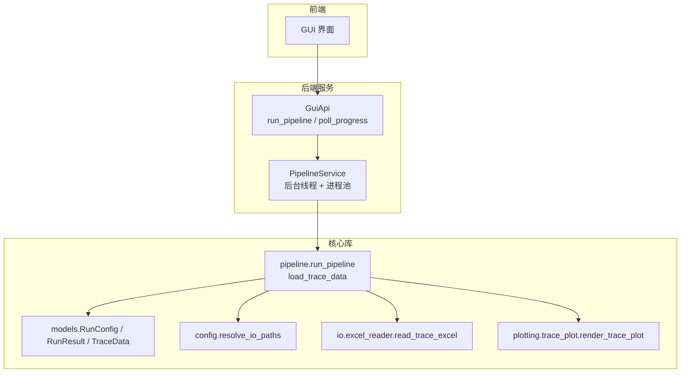
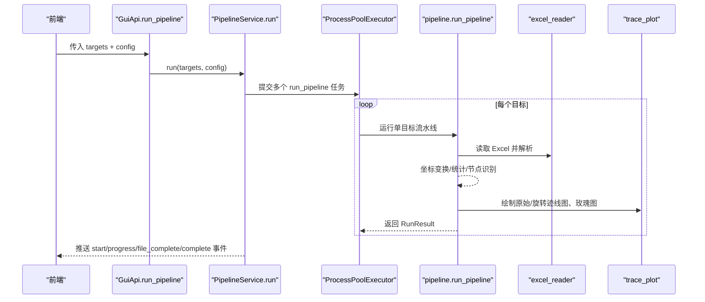
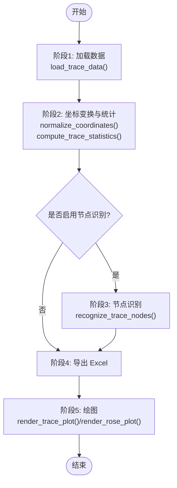
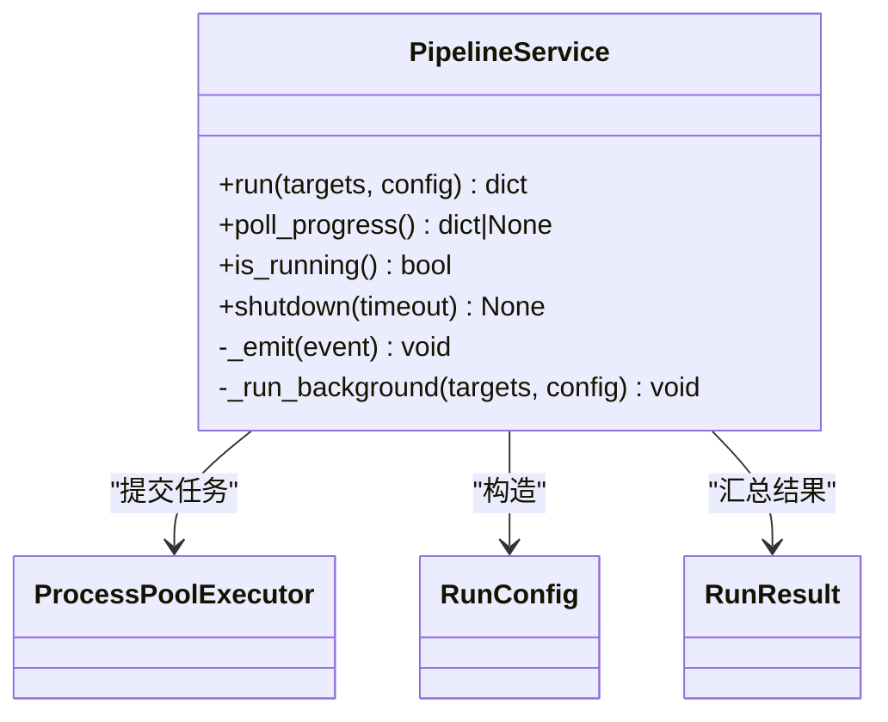
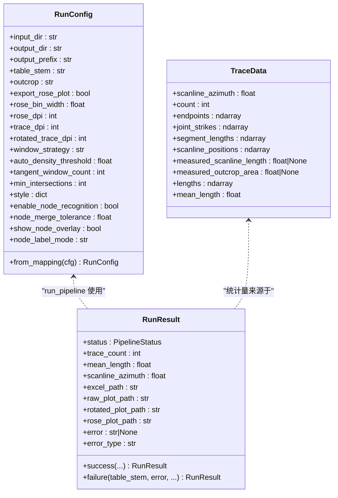
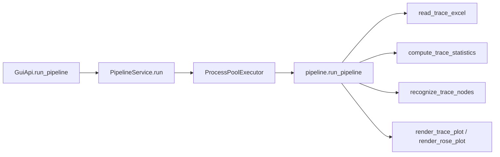

# 流水线执行接口

<cite>
**本文引用的文件**   
- [trace_pipeline/pipeline.py](file://trace_pipeline/pipeline.py)
- [backend/services/pipeline_service.py](file://backend/services/pipeline_service.py)
- [trace_pipeline/models.py](file://trace_pipeline/models.py)
- [trace_pipeline/config.py](file://trace_pipeline/config.py)
- [trace_pipeline/io/excel_reader.py](file://trace_pipeline/io/excel_reader.py)
- [trace_pipeline/plotting/trace_plot.py](file://trace_pipeline/plotting/trace_plot.py)
- [backend/gui_api.py](file://backend/gui_api.py)
</cite>

## 目录
1. [简介](#简介)
2. [项目结构](#项目结构)
3. [核心组件](#核心组件)
4. [架构总览](#架构总览)
5. [详细组件分析](#详细组件分析)
6. [依赖关系分析](#依赖关系分析)
7. [性能与内存优化建议](#性能与内存优化建议)
8. [故障排查指南](#故障排查指南)
9. [结论](#结论)
10. [附录：端到端使用示例](#附录端到端使用示例)

## 简介
本指南面向需要调用 TracePipeline 流水线执行接口的开发者，聚焦以下目标：
- 完整说明 run_pipeline 与 load_trace_data 两个核心函数的使用方法、参数配置与返回值处理
- 提供从数据加载到结果获取的端到端流程与最佳实践（含错误处理与异常捕获）
- 解释流水线的五个处理阶段与数据流转过程
- 说明批量处理的并行执行模式与进度监控方法
- 给出性能优化与内存管理建议

## 项目结构
TracePipeline 将“数据处理—计算—导出—绘图”封装为可复用的流水线。后端服务通过进程池并发调度单目标流水线，前端通过轮询获取进度。

图表来源
- [backend/gui_api.py:388-446](file://backend/gui_api.py#L388-L446)
- [backend/services/pipeline_service.py:100-200](file://backend/services/pipeline_service.py#L100-L200)
- [trace_pipeline/pipeline.py:230-474](file://trace_pipeline/pipeline.py#L230-L474)
- [trace_pipeline/models.py:162-352](file://trace_pipeline/models.py#L162-L352)
- [trace_pipeline/config.py:218-246](file://trace_pipeline/config.py#L218-L246)
- [trace_pipeline/io/excel_reader.py:36-106](file://trace_pipeline/io/excel_reader.py#L36-L106)
- [trace_pipeline/plotting/trace_plot.py:443-565](file://trace_pipeline/plotting/trace_plot.py#L443-L565)

章节来源
- [backend/gui_api.py:388-446](file://backend/gui_api.py#L388-L446)
- [backend/services/pipeline_service.py:100-200](file://backend/services/pipeline_service.py#L100-L200)
- [trace_pipeline/pipeline.py:230-474](file://trace_pipeline/pipeline.py#L230-L474)
- [trace_pipeline/models.py:162-352](file://trace_pipeline/models.py#L162-L352)
- [trace_pipeline/config.py:218-246](file://trace_pipeline/config.py#L218-L246)
- [trace_pipeline/io/excel_reader.py:36-106](file://trace_pipeline/io/excel_reader.py#L36-L106)
- [trace_pipeline/plotting/trace_plot.py:443-565](file://trace_pipeline/plotting/trace_plot.py#L443-L565)

## 核心组件
- run_pipeline(cfg): 编排单个露头数据的五阶段处理，返回不可变结果对象 RunResult
- load_trace_data(input_dir, table_stem, outcrop): 读取 Excel 并解析为 TraceData，按文件签名缓存
- PipelineService: 后台线程 + 进程池，负责批量任务提交、进度事件推送与优雅关闭
- RunConfig/RunResult/TraceData: 不可变数据模型，承载输入参数、输出结果与中间数据

章节来源
- [trace_pipeline/pipeline.py:80-96](file://trace_pipeline/pipeline.py#L80-L96)
- [trace_pipeline/pipeline.py:230-474](file://trace_pipeline/pipeline.py#L230-L474)
- [backend/services/pipeline_service.py:32-95](file://backend/services/pipeline_service.py#L32-L95)
- [trace_pipeline/models.py:41-157](file://trace_pipeline/models.py#L41-L157)
- [trace_pipeline/models.py:162-352](file://trace_pipeline/models.py#L162-L352)

## 架构总览
下图展示从 GUI 发起批处理到各工作进程完成单目标处理的全链路交互。

图表来源
- [backend/gui_api.py:388-446](file://backend/gui_api.py#L388-L446)
- [backend/services/pipeline_service.py:146-200](file://backend/services/pipeline_service.py#L146-L200)
- [trace_pipeline/pipeline.py:230-474](file://trace_pipeline/pipeline.py#L230-L474)
- [trace_pipeline/io/excel_reader.py:36-106](file://trace_pipeline/io/excel_reader.py#L36-L106)
- [trace_pipeline/plotting/trace_plot.py:443-565](file://trace_pipeline/plotting/trace_plot.py#L443-L565)

## 详细组件分析

### 函数一：load_trace_data
- 功能：定位输入 Excel（支持 .xlsx/.xls），读取并解析为 TraceData；基于文件签名进行 LRU 缓存，避免重复 I/O
- 关键参数
  - input_dir: 输入目录路径
  - table_stem: 不含扩展名的文件名
  - outcrop: 露头标识（用于日志与后续命名）
- 返回值：TraceData（不可变数据容器）
- 内部要点
  - 自动选择引擎（openpyxl/xlrd）
  - 校验列数与数值有效性
  - 计算端点、走向、长度等基础几何信息
  - 记录耗时与指标到日志

章节来源
- [trace_pipeline/pipeline.py:80-96](file://trace_pipeline/pipeline.py#L80-L96)
- [trace_pipeline/io/excel_reader.py:36-106](file://trace_pipeline/io/excel_reader.py#L36-L106)
- [trace_pipeline/models.py:41-157](file://trace_pipeline/models.py#L41-L157)

### 函数二：run_pipeline
- 功能：对单个露头执行五阶段流水线，返回 RunResult
- 输入：RunConfig（已校验的运行参数）
- 输出：RunResult（包含成功/失败状态、统计量、产物路径等）
- 五阶段与数据流
  1) 加载数据：load_trace_data → TraceData
  2) 坐标变换与统计：归一化坐标、计算统计量、构建圆窗与凸包覆盖层
  3) 节点识别（可选）：识别 I/Y/X 节点类型，生成覆盖层
  4) 导出 Excel：多表写入结果
  5) 绘图：原始迹线图、旋转迹线图、玫瑰图（可选）
- 错误处理
  - 统一捕获常见异常并返回失败结果
  - 针对权限不足、文件不存在等给出友好提示
  - 关键异常（如 MemoryError、KeyboardInterrupt）向上抛出

图表来源
- [trace_pipeline/pipeline.py:230-474](file://trace_pipeline/pipeline.py#L230-L474)
- [trace_pipeline/plotting/trace_plot.py:443-565](file://trace_pipeline/plotting/trace_plot.py#L443-L565)

章节来源
- [trace_pipeline/pipeline.py:230-474](file://trace_pipeline/pipeline.py#L230-L474)

### 批量处理与进度监控（PipelineService）
- 启动方式：非阻塞启动后台线程，内部使用 ProcessPoolExecutor 并行执行
- 并行度控制
  - parallel_workers=0：自动取 CPU 核心数与任务数较小值
  - parallel_workers=1：串行（仍在独立进程中）
  - parallel_workers>1：指定进程数（受 CPU 核心数裁剪）
- 进度事件
  - start：批次开始
  - progress：累计完成计数
  - file_complete：单个目标完成（附带结果摘要）
  - complete：批次结束
  - error：批次级异常
- 优雅关闭：设置取消信号后等待线程完成，超时则警告

图表来源
- [backend/services/pipeline_service.py:32-95](file://backend/services/pipeline_service.py#L32-L95)
- [backend/services/pipeline_service.py:146-200](file://backend/services/pipeline_service.py#L146-L200)
- [backend/services/pipeline_service.py:200-346](file://backend/services/pipeline_service.py#L200-L346)

章节来源
- [backend/services/pipeline_service.py:32-95](file://backend/services/pipeline_service.py#L32-L95)
- [backend/services/pipeline_service.py:146-200](file://backend/services/pipeline_service.py#L146-L200)
- [backend/services/pipeline_service.py:200-346](file://backend/services/pipeline_service.py#L200-L346)

### 数据模型（RunConfig / RunResult / TraceData）
- RunConfig：不可变配置，字段包含输入输出路径、DPI、窗口策略、节点识别开关等；提供 from_mapping 工厂方法
- RunResult：不可变结果，包含状态、统计量、产物路径、错误信息等
- TraceData：不可变数据容器，包含端点、走向、长度、位置等，并提供派生属性（如 lengths、mean_length）

图表来源
- [trace_pipeline/models.py:162-352](file://trace_pipeline/models.py#L162-L352)
- [trace_pipeline/models.py:41-157](file://trace_pipeline/models.py#L41-L157)

章节来源
- [trace_pipeline/models.py:162-352](file://trace_pipeline/models.py#L162-L352)
- [trace_pipeline/models.py:41-157](file://trace_pipeline/models.py#L41-L157)

## 依赖关系分析
- 入口与编排
  - GuiApi.run_pipeline 接收前端请求，合并配置并调用 PipelineService.run
  - PipelineService 在后台线程中创建进程池，提交 run_pipeline 任务
- 单目标流水线
  - run_pipeline 依次调用 load_trace_data、坐标变换与统计、节点识别（可选）、Excel 导出、绘图
- 外部依赖
  - Excel 读写：pandas/openpyxl/xlrd
  - 绘图：matplotlib
  - 进程间通信：multiprocessing

图表来源
- [backend/gui_api.py:388-446](file://backend/gui_api.py#L388-L446)
- [backend/services/pipeline_service.py:146-200](file://backend/services/pipeline_service.py#L146-L200)
- [trace_pipeline/pipeline.py:230-474](file://trace_pipeline/pipeline.py#L230-L474)

章节来源
- [backend/gui_api.py:388-446](file://backend/gui_api.py#L388-L446)
- [backend/services/pipeline_service.py:146-200](file://backend/services/pipeline_service.py#L146-L200)
- [trace_pipeline/pipeline.py:230-474](file://trace_pipeline/pipeline.py#L230-L474)

## 性能与内存优化建议
- 并行度
  - 合理设置 parallel_workers：默认 0 自动适配 CPU 核心数；I/O 密集或磁盘瓶颈时可适当降低
- DPI 与图像尺寸
  - trace_dpi/rotated_trace_dpi/rose_dpi 过高会显著增加内存与渲染时间，建议根据输出用途调整
- 节点识别
  - enable_node_recognition 仅在需要时开启；merge_tolerance 过大可能合并过多点，过小会增加计算量
- 统计与面积回退
  - 优先使用实测面积与凸包面积，避免不必要的降级与额外计算
- 数据缓存
  - load_trace_data 基于文件签名缓存，避免重复解析；确保输入文件变更时更新 mtime/size
- 进程隔离
  - 子进程内初始化 matplotlib 非交互式后端，避免跨进程共享图形资源导致崩溃
- 内存管理
  - 大文件 Excel 有大小上限检查；必要时分块处理或减少 DPI/图层数量
  - 及时释放临时数组引用，避免在循环中累积大对象

[本节为通用指导，不直接分析具体文件]

## 故障排查指南
- 常见错误与处理
  - PermissionError：输出文件被占用（如 Excel/WPS 打开），关闭后重试
  - FileNotFoundError：输入文件不存在，检查路径与文件名
  - ValueError/KeyError/TypeError/IndexError/OSError：数据格式或路径问题，查看日志中的 stage 与错误信息
  - MemoryError/KeyboardInterrupt：关键异常，需终止当前任务并释放资源
- 日志定位
  - 关注 stage 字段（如 load、transform、node_recognition、export_excel、plot、pipeline_error）
  - 结合 duration_ms、trace_count、window_strategy 等指标快速定位瓶颈
- 进度轮询
  - 前端应周期性调用 poll_progress，处理 start/progress/file_complete/complete/error 事件
  - 若收到 cancel 或 error，停止轮询并提示用户

章节来源
- [trace_pipeline/pipeline.py:98-130](file://trace_pipeline/pipeline.py#L98-L130)
- [backend/services/pipeline_service.py:200-346](file://backend/services/pipeline_service.py#L200-L346)

## 结论
TracePipeline 提供了稳定、可扩展的流水线执行接口。通过 run_pipeline 与 load_trace_data，用户可以便捷地完成从数据加载到结果产出的全流程；PipelineService 则实现了高可用的批量并行执行与细粒度进度反馈。遵循本文的性能与内存优化建议，可在大规模数据集上获得更稳定的处理体验。

[本节为总结性内容，不直接分析具体文件]

## 附录：端到端使用示例

### 场景一：直接调用核心函数（Python）
- 加载数据
  - 调用 load_trace_data(input_dir, table_stem, outcrop)，得到 TraceData
  - 参考实现路径：[trace_pipeline/pipeline.py:80-96](file://trace_pipeline/pipeline.py#L80-L96)
- 执行流水线
  - 构造 RunConfig.from_mapping({...})，调用 run_pipeline(cfg)
  - 参考实现路径：[trace_pipeline/pipeline.py:230-474](file://trace_pipeline/pipeline.py#L230-L474)
- 结果处理
  - 检查 result.status 是否为 success；读取 excel_path、raw_plot_path、rotated_plot_path、rose_plot_path
  - 参考实现路径：[trace_pipeline/models.py:302-352](file://trace_pipeline/models.py#L302-L352)

章节来源
- [trace_pipeline/pipeline.py:80-96](file://trace_pipeline/pipeline.py#L80-L96)
- [trace_pipeline/pipeline.py:230-474](file://trace_pipeline/pipeline.py#L230-L474)
- [trace_pipeline/models.py:302-352](file://trace_pipeline/models.py#L302-L352)

### 场景二：通过后端服务批量执行（GUI API）
- 启动流水线
  - 调用 GuiApi.run_pipeline(targets, config)
  - 参考实现路径：[backend/gui_api.py:388-446](file://backend/gui_api.py#L388-L446)
- 轮询进度
  - 循环调用 GuiApi.poll_progress()，处理 start/progress/file_complete/complete/error
  - 参考实现路径：[backend/gui_api.py:447-456](file://backend/gui_api.py#L447-L456)
- 获取结果
  - 扫描 output 目录或使用 get_results() 获取产物路径
  - 参考实现路径：[backend/gui_api.py:459-492](file://backend/gui_api.py#L459-L492)

章节来源
- [backend/gui_api.py:388-446](file://backend/gui_api.py#L388-L446)
- [backend/gui_api.py:447-456](file://backend/gui_api.py#L447-L456)
- [backend/gui_api.py:459-492](file://backend/gui_api.py#L459-L492)

### 场景三：配置与路径解析
- 配置加载与校验
  - 使用 load_config() 与 validate_config() 合并默认值与覆盖项
  - 参考实现路径：[trace_pipeline/config.py:86-146](file://trace_pipeline/config.py#L86-L146)
- 路径解析与工作目录保障
  - resolve_io_paths() 将相对路径转为绝对路径并确保目录存在
  - 参考实现路径：[trace_pipeline/config.py:218-246](file://trace_pipeline/config.py#L218-L246)

章节来源
- [trace_pipeline/config.py:86-146](file://trace_pipeline/config.py#L86-L146)
- [trace_pipeline/config.py:218-246](file://trace_pipeline/config.py#L218-L246)