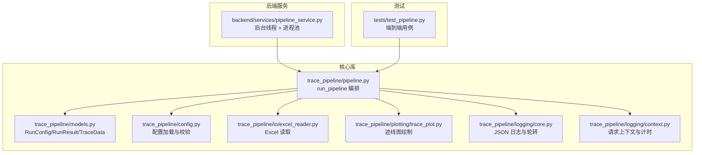
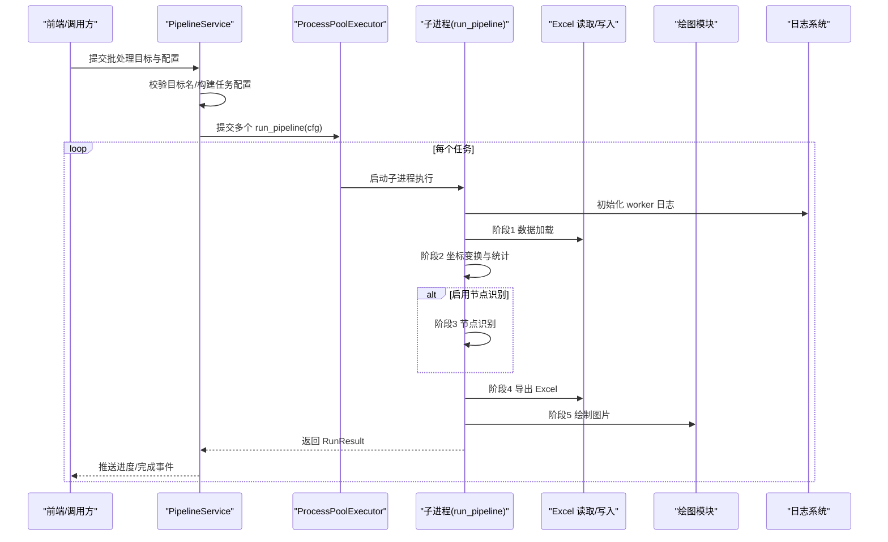
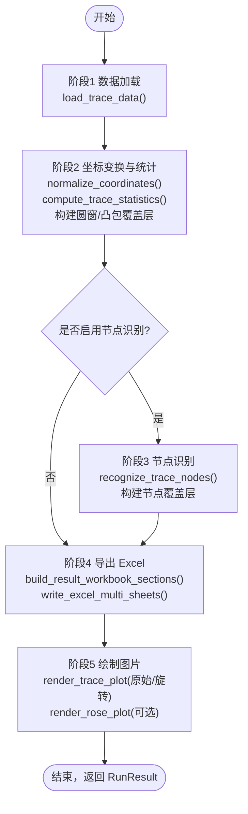
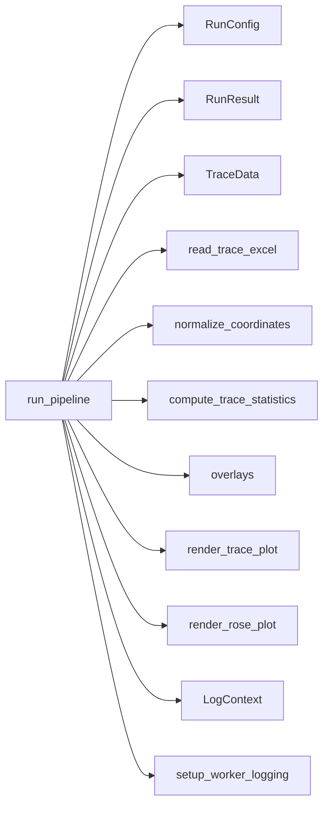

# 流水线核心执行

<cite>
**本文引用的文件列表**
- [pipeline.py](file://trace_pipeline/pipeline.py)
- [models.py](file://trace_pipeline/models.py)
- [config.py](file://trace_pipeline/config.py)
- [excel_reader.py](file://trace_pipeline/io/excel_reader.py)
- [trace_plot.py](file://trace_pipeline/plotting/trace_plot.py)
- [core.py](file://trace_pipeline/logging/core.py)
- [context.py](file://trace_pipeline/logging/context.py)
- [pipeline_service.py](file://backend/services/pipeline_service.py)
- [test_pipeline.py](file://tests/test_pipeline.py)
</cite>

## 目录
1. [简介](#简介)
2. [项目结构](#项目结构)
3. [核心组件](#核心组件)
4. [架构总览](#架构总览)
5. [详细组件分析](#详细组件分析)
6. [依赖关系分析](#依赖关系分析)
7. [性能考量](#性能考量)
8. [故障排查指南](#故障排查指南)
9. [结论](#结论)
10. [附录：执行示例与最佳实践](#附录执行示例与最佳实践)

## 简介
本文件面向“迹线处理流水线”的核心执行接口，围绕 run_pipeline 函数的五阶段处理流程进行系统化说明：数据加载、坐标变换、节点识别、Excel 导出和图片绘制。文档同时覆盖 RunConfig 配置参数的作用与默认值、并行执行模式下的进程安全与日志管理、性能监控与进度跟踪的实现方法，并提供成功与失败场景的完整执行示例路径。

## 项目结构
TracePipeline 采用分层组织方式：
- trace_pipeline：核心库（模型、配置、IO、几何计算、绘图、日志、流水线编排）
- backend：后端服务（GUI/Web 集成、任务调度、并发控制）
- tests：单元测试与集成测试
- reference：参考实现与说明

图表来源
- [pipeline.py:1-474](file://trace_pipeline/pipeline.py#L1-L474)
- [models.py:1-352](file://trace_pipeline/models.py#L1-L352)
- [config.py:1-326](file://trace_pipeline/config.py#L1-L326)
- [excel_reader.py:1-169](file://trace_pipeline/io/excel_reader.py#L1-L169)
- [trace_plot.py:1-200](file://trace_pipeline/plotting/trace_plot.py#L1-L200)
- [core.py:1-450](file://trace_pipeline/logging/core.py#L1-L450)
- [context.py:1-144](file://trace_pipeline/logging/context.py#L1-L144)
- [pipeline_service.py:1-346](file://backend/services/pipeline_service.py#L1-L346)
- [test_pipeline.py:1-125](file://tests/test_pipeline.py#L1-L125)

章节来源
- [pipeline.py:1-474](file://trace_pipeline/pipeline.py#L1-L474)
- [models.py:1-352](file://trace_pipeline/models.py#L1-L352)
- [config.py:1-326](file://trace_pipeline/config.py#L1-L326)

## 核心组件
- run_pipeline：单目标全流程编排函数，串联五个阶段并返回不可变结果对象。
- RunConfig：运行参数容器，提供字段级校验与默认值。
- TraceData：解析后的迹线数据容器，包含端点、走向角、统计量等。
- RunResult：运行结果容器，包含成功/失败状态及产物路径。
- PipelineService：后台线程 + 进程池的任务调度器，负责并发执行与进度上报。
- Excel 读取与验证：支持 .xlsx/.xls 双引擎、工作表回退与格式校验。
- 绘图模块：原始/旋转迹线图与玫瑰图渲染。
- 日志系统：JSON Lines 输出、按天归档、子进程独立日志、请求上下文传播。

章节来源
- [pipeline.py:230-474](file://trace_pipeline/pipeline.py#L230-L474)
- [models.py:162-352](file://trace_pipeline/models.py#L162-L352)
- [excel_reader.py:36-169](file://trace_pipeline/io/excel_reader.py#L36-L169)
- [trace_plot.py:1-200](file://trace_pipeline/plotting/trace_plot.py#L1-L200)
- [core.py:326-450](file://trace_pipeline/logging/core.py#L326-L450)
- [context.py:27-144](file://trace_pipeline/logging/context.py#L27-L144)
- [pipeline_service.py:32-346](file://backend/services/pipeline_service.py#L32-L346)

## 架构总览
下图展示从后端服务到核心流水线的调用链路与关键交互。

图表来源
- [pipeline_service.py:100-346](file://backend/services/pipeline_service.py#L100-L346)
- [pipeline.py:230-474](file://trace_pipeline/pipeline.py#L230-L474)
- [core.py:401-450](file://trace_pipeline/logging/core.py#L401-L450)

## 详细组件分析

### run_pipeline 五阶段处理流程
run_pipeline 是单目标处理的入口，内部严格划分为五个阶段，每阶段均有明确的输入、处理逻辑与输出，并在异常时统一封装为 RunResult.failure。

图表来源
- [pipeline.py:230-474](file://trace_pipeline/pipeline.py#L230-L474)

#### 阶段1：数据加载
- 输入：input_dir、table_stem、outcrop
- 处理：
  - 定位输入 Excel（优先 .xlsx，缺失则回退 .xls），并进行文件大小上限检查与工作表回退策略。
  - 读取无表头 DataFrame，进行基本格式校验（最少列数、数值有效性）。
  - 计算端点、走向角、长度、位置等，构造 TraceData。
- 输出：TraceData（含 count、endpoints、joint_strikes、segment_lengths、scanline_positions 等）
- 性能特征：
  - 基于文件签名（mtime_ns、size）的 LRU 缓存，避免重复解析相同输入。
  - 使用 pandas 读取，限制最大文件大小，防止内存溢出。
- 错误处理：
  - 未找到文件或读取失败抛出 FileNotFoundError/ValueError；在 run_pipeline 中捕获并转为失败结果。

章节来源
- [excel_reader.py:36-169](file://trace_pipeline/io/excel_reader.py#L36-L169)
- [pipeline.py:80-96](file://trace_pipeline/pipeline.py#L80-L96)
- [pipeline.py:61-78](file://trace_pipeline/pipeline.py#L61-L78)

#### 阶段2：坐标变换与统计
- 输入：TraceData
- 处理：
  - 归一化坐标（旋转到测线方向），计算北偏角。
  - 根据窗口策略（auto/tangent 等）计算统计量（P10/P20/P21、平均长度、面积来源等）。
  - 构建圆窗覆盖层与凸包覆盖层，用于后续叠加绘制。
- 输出：rotated 坐标数组、statistics 统计对象、statistics_lines 文本行、覆盖层数据
- 性能特征：
  - 向量化 numpy 计算为主，时间复杂度与迹线条数线性相关。
  - 窗口策略影响计算开销，auto 策略会进行密度阈值估算。
- 错误处理：
  - 窗口验证警告通过日志记录，不中断流程。

章节来源
- [pipeline.py:276-343](file://trace_pipeline/pipeline.py#L276-L343)

#### 阶段3：节点识别（可选）
- 输入：TraceData、节点识别配置（合并自 RunConfig）
- 处理：
  - 识别交点/分叉/重叠等节点类型，生成节点分析与覆盖层。
- 输出：node_analysis、raw_node_overlays、rotated_node_overlays
- 性能特征：
  - 节点识别算法复杂度取决于端点数量与拓扑关系，通常与 N^2 或近似线性相关（取决于实现细节）。
- 错误处理：
  - 若未启用，跳过该阶段；启用后出现异常会被上层捕获并转为失败结果。

章节来源
- [pipeline.py:345-373](file://trace_pipeline/pipeline.py#L345-L373)

#### 阶段4：导出 Excel
- 输入：TraceData、rotated、statistics、node_analysis
- 处理：
  - 组装多工作簿分区（原始/旋转/统计/节点等），写入多 sheet 的 Excel 文件。
- 输出：excel_path（绝对路径）
- 性能特征：
  - 写入性能受数据规模与 Excel 引擎影响；大文件建议合理 DPI 与关闭不必要的可视化。
- 错误处理：
  - 权限不足或文件被占用时，友好提示并返回失败结果。

章节来源
- [pipeline.py:375-388](file://trace_pipeline/pipeline.py#L375-L388)

#### 阶段5：绘制图片
- 输入：TraceData、rotated、statistics_lines、覆盖层、DPI 等
- 处理：
  - 绘制原始迹线图与旋转迹线图，可选绘制玫瑰花瓣图。
  - 应用样式覆盖（字体、颜色、布局等）。
- 输出：raw_plot_path、rotated_plot_path、rose_plot_path
- 性能特征：
  - 高 DPI 显著增加渲染时间与内存占用；建议在批量模式下适当降低 DPI。
- 错误处理：
  - 绘图异常统一捕获并记录，不影响 Excel 导出。

章节来源
- [pipeline.py:132-227](file://trace_pipeline/pipeline.py#L132-L227)
- [trace_plot.py:1-200](file://trace_pipeline/plotting/trace_plot.py#L1-L200)

### RunConfig 配置参数与默认值
RunConfig 是不可变的运行参数容器，提供字段级校验与默认值。关键字段包括：
- 输入输出：input_dir、output_dir、output_prefix、table_stem、outcrop
- 绘图：export_rose_plot、rose_bin_width、rose_dpi、trace_dpi、rotated_trace_dpi
- 统计窗口：window_strategy、auto_density_threshold、tangent_window_count、min_intersections
- 节点识别：enable_node_recognition、node_merge_tolerance、show_node_overlay、node_label_mode
- 样式：style（字典，可包含 node_style 等）

默认值来源于配置模块的 DEFAULT_CONFIG，并通过 validate_config 合并与规范化。

章节来源
- [models.py:162-273](file://trace_pipeline/models.py#L162-L273)
- [config.py:56-79](file://trace_pipeline/config.py#L56-L79)
- [config.py:148-190](file://trace_pipeline/config.py#L148-L190)

### 并行执行模式与进程安全
- 调度器：PipelineService 使用后台线程接收任务，非守护线程确保优雅关闭。
- 进程池：使用 multiprocessing.spawn 上下文创建独立子进程，避免共享状态污染。
- 进程安全：
  - 子进程内强制设置 matplotlib 非交互式后端并重新配置样式，避免 GUI 后端冲突。
  - 子进程独立初始化日志，写入 logs 目录下带 PID 的文件，主进程仅负责归档与清理。
- 并发控制：
  - parallel_workers=0 自动选择 CPU 核心数；=1 串行；>1 指定进程数（不超过 CPU 核心数）。
  - 支持关闭信号，提前终止剩余任务。

章节来源
- [pipeline_service.py:146-220](file://backend/services/pipeline_service.py#L146-L220)
- [pipeline.py:239-252](file://trace_pipeline/pipeline.py#L239-L252)
- [core.py:401-450](file://trace_pipeline/logging/core.py#L401-L450)

### 日志管理与进度跟踪
- 日志系统：
  - JsonFormatter 将每条日志序列化为 JSON Lines，包含 timestamp、level、request_id、extra 等。
  - DailyRotatingJsonHandler 按天归档，超过大小自动分片，保留最近 30 天压缩包。
  - setup_worker_logging 为子进程单独配置日志，避免跨进程竞争。
- 请求上下文：
  - LogContext 绑定 request_id，贯穿整个处理链路，便于追踪单个任务。
- 进度跟踪：
  - PipelineService 通过队列推送 start/progress/file_complete/complete/error 事件，前端轮询获取。
  - 每个阶段均记录 duration_ms 与关键指标，便于性能分析。

章节来源
- [core.py:44-146](file://trace_pipeline/logging/core.py#L44-L146)
- [core.py:148-305](file://trace_pipeline/logging/core.py#L148-L305)
- [context.py:27-144](file://trace_pipeline/logging/context.py#L27-L144)
- [pipeline_service.py:96-124](file://backend/services/pipeline_service.py#L96-L124)

## 依赖关系分析
- run_pipeline 依赖：
  - models.RunConfig/RunResult/TraceData
  - io.excel_reader.read_trace_excel
  - geology.transforms.normalize_coordinates
  - geology.statistics.compute_trace_statistics
  - plotting.overlays 构建覆盖层
  - plotting.trace_plot.render_trace_plot
  - plotting.rose_plot.render_rose_plot
  - logging.LogContext/setup_worker_logging
- 外部依赖：
  - numpy、pandas、matplotlib（通过绘图模块间接引入）

图表来源
- [pipeline.py:1-474](file://trace_pipeline/pipeline.py#L1-L474)
- [models.py:1-352](file://trace_pipeline/models.py#L1-L352)
- [excel_reader.py:1-169](file://trace_pipeline/io/excel_reader.py#L1-L169)
- [trace_plot.py:1-200](file://trace_pipeline/plotting/trace_plot.py#L1-L200)

## 性能考量
- 数据加载：
  - 文件签名缓存避免重复解析；限制 Excel 文件大小，防止 OOM。
- 坐标变换与统计：
  - 向量化计算为主，时间复杂度与迹线条数线性相关；窗口策略影响额外开销。
- 节点识别：
  - 拓扑分析可能带来较高复杂度，建议在大样本下评估 enable_node_recognition 的必要性。
- 导出 Excel：
  - 大数据集建议减少冗余信息，必要时拆分工作簿。
- 绘图：
  - DPI 对渲染时间与内存影响显著；批量模式建议降低 DPI 或使用离线后端。
- 并行执行：
  - spawn 上下文隔离环境，避免共享状态；合理设置 workers 以平衡吞吐与资源占用。

[本节为通用指导，无需特定文件引用]

## 故障排查指南
- 常见错误与处理：
  - PermissionError：文件被占用或权限不足，提示关闭 Excel/WPS 后重试。
  - FileNotFoundError：输入文件不存在，检查路径与文件名。
  - ValueError/KeyError/TypeError/IndexError/OSError：数据格式或运行时错误，查看日志中的 error_type 与 traceback。
  - MemoryError/KeyboardInterrupt：关键异常直接上抛，需调整资源或中断处理。
- 日志定位：
  - 使用 request_id 过滤单条任务日志。
  - 子进程日志位于 logs/<日期>/worker_<pid>.jsonl。
  - 主进程日志位于 logs/<日期>/run_XXX.jsonl，并按天归档。
- 调试建议：
  - 降低 DPI 与关闭玫瑰图以减少绘图耗时。
  - 禁用节点识别以快速验证数据加载与导出流程。
  - 使用较小的测试数据集进行回归验证。

章节来源
- [pipeline.py:450-474](file://trace_pipeline/pipeline.py#L450-L474)
- [core.py:148-305](file://trace_pipeline/logging/core.py#L148-L305)
- [core.py:401-450](file://trace_pipeline/logging/core.py#L401-L450)

## 结论
run_pipeline 提供了清晰、健壮的单目标处理流程，配合 RunConfig 的可配置性与 PipelineService 的并发能力，能够高效完成从数据加载到可视化的全链路处理。完善的日志与进度机制使得生产环境下的监控与排障更加便捷。

[本节为总结性内容，无需特定文件引用]

## 附录：执行示例与最佳实践

### 成功场景示例
- 最小可用 Excel 文件：首行携带表头信息与第一条迹线数据，至少 4 列（x1,y1,x2,y2）。
- 运行步骤：
  - 准备 input_dir 与 output_dir。
  - 构造 RunConfig，设置必要字段（input_dir、output_dir、output_prefix、table_stem、outcrop）。
  - 调用 run_pipeline(cfg)，检查 result.status 是否为 SUCCESS，并获取产物路径。
- 参考用例路径：
  - [tests/test_pipeline.py:66-87](file://tests/test_pipeline.py#L66-L87)

章节来源
- [test_pipeline.py:66-87](file://tests/test_pipeline.py#L66-L87)

### 失败场景示例
- 输入文件不存在：
  - 构造 RunConfig 指向不存在的 input_dir 与 table_stem。
  - 调用 run_pipeline(cfg)，result.status 应为 ERROR，且 result.error 包含提示信息。
- 参考用例路径：
  - [tests/test_pipeline.py:88-100](file://tests/test_pipeline.py#L88-L100)

章节来源
- [test_pipeline.py:88-100](file://tests/test_pipeline.py#L88-L100)

### 并行执行与进度跟踪
- 启动批处理：
  - 使用 PipelineService.run(targets, config) 提交多个 outcrop 目标。
  - 通过 poll_progress() 轮询获取 start/progress/file_complete/complete 事件。
- 关闭与超时：
  - shutdown(timeout) 发送取消信号并等待线程完成，超时记录警告。
- 参考实现路径：
  - [backend/services/pipeline_service.py:42-95](file://backend/services/pipeline_service.py#L42-L95)
  - [backend/services/pipeline_service.py:100-346](file://backend/services/pipeline_service.py#L100-L346)

章节来源
- [pipeline_service.py:42-95](file://backend/services/pipeline_service.py#L42-L95)
- [pipeline_service.py:100-346](file://backend/services/pipeline_service.py#L100-L346)

### 性能监控与进度跟踪实现要点
- 阶段计时：
  - 每个阶段使用 time.perf_counter() 记录耗时，并通过 extra={"duration_ms": ...} 写入日志。
- 请求上下文：
  - LogContext 绑定 request_id，贯穿 run_pipeline 与子进程日志。
- 进度事件：
  - PipelineService 维护线程安全队列，推送当前进度与结果摘要。
- 参考实现路径：
  - [pipeline.py:254-418](file://trace_pipeline/pipeline.py#L254-L418)
  - [context.py:27-144](file://trace_pipeline/logging/context.py#L27-L144)
  - [pipeline_service.py:96-124](file://backend/services/pipeline_service.py#L96-L124)

章节来源
- [pipeline.py:254-418](file://trace_pipeline/pipeline.py#L254-L418)
- [context.py:27-144](file://trace_pipeline/logging/context.py#L27-L144)
- [pipeline_service.py:96-124](file://backend/services/pipeline_service.py#L96-L124)