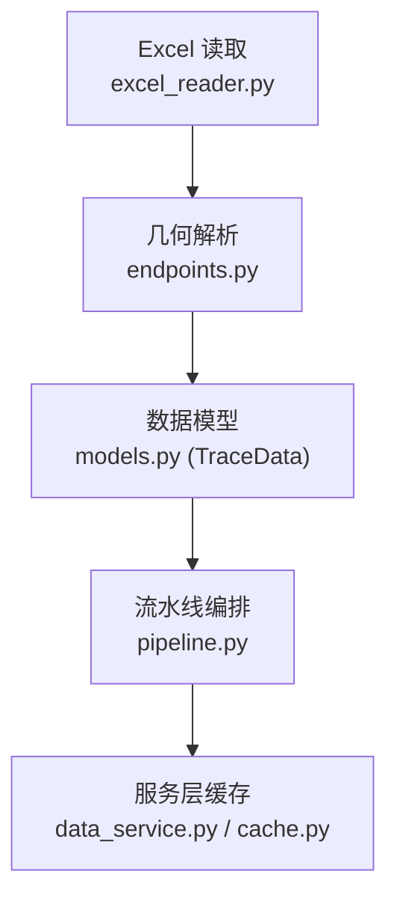
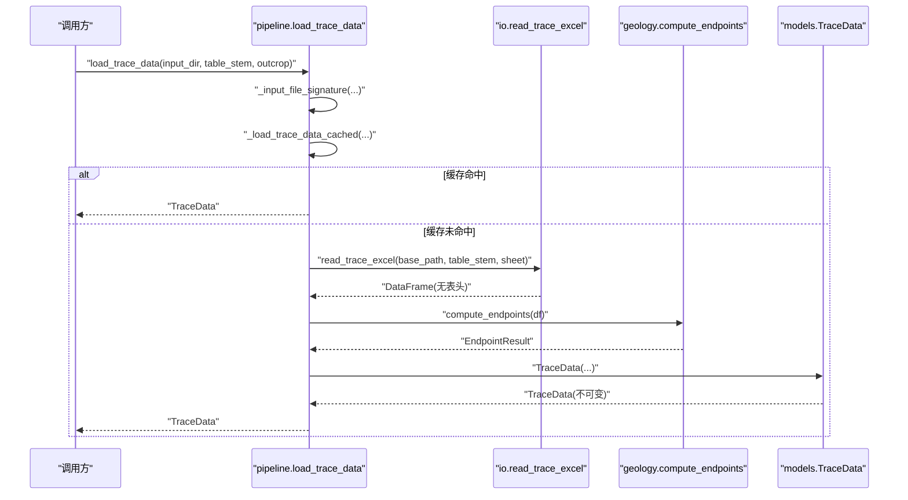
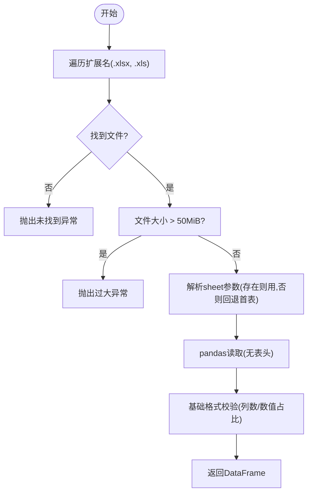
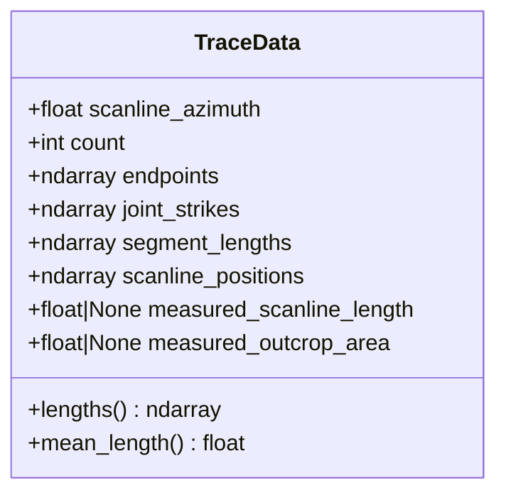
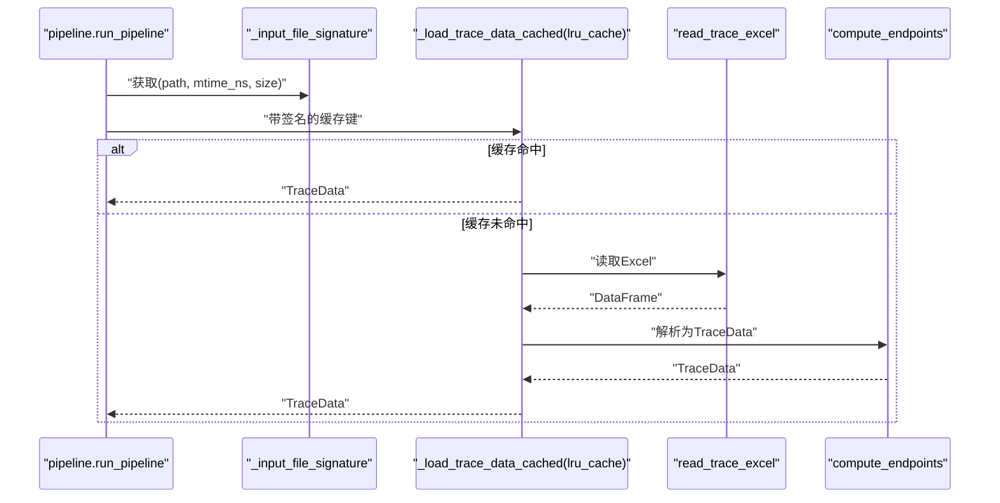
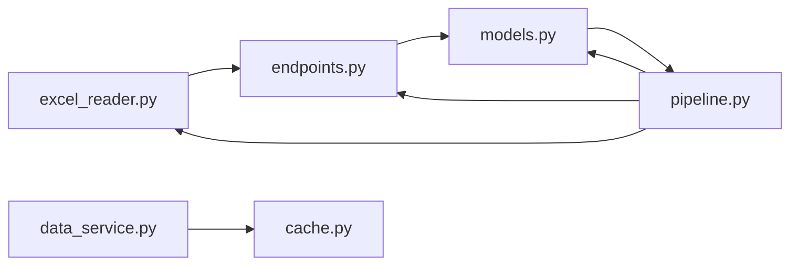

# 第一阶段：数据加载

<cite>
**本文引用的文件列表**
- [trace_pipeline/io/excel_reader.py](file://trace_pipeline/io/excel_reader.py)
- [trace_pipeline/geology/endpoints.py](file://trace_pipeline/geology/endpoints.py)
- [trace_pipeline/models.py](file://trace_pipeline/models.py)
- [trace_pipeline/pipeline.py](file://trace_pipeline/pipeline.py)
- [backend/services/data_service.py](file://backend/services/data_service.py)
- [backend/utils/cache.py](file://backend/utils/cache.py)
- [tests/test_excel_reader.py](file://tests/test_excel_reader.py)
- [tests/test_data_service.py](file://tests/test_data_service.py)
</cite>

## 目录
1. [引言](#引言)
2. [项目结构](#项目结构)
3. [核心组件](#核心组件)
4. [架构总览](#架构总览)
5. [详细组件分析](#详细组件分析)
6. [依赖关系分析](#依赖关系分析)
7. [性能考虑](#性能考虑)
8. [故障排查指南](#故障排查指南)
9. [结论](#结论)

## 引言
本章节聚焦流水线“第一阶段：数据加载”的实现细节，围绕以下目标展开：
- Excel 文件的查找机制与回退策略
- 数据验证规则与错误分类
- TraceData 对象的构建过程与字段含义
- 内存优化策略（含大文件保护、向量化计算、不可变对象）
- 文件签名缓存机制的原理与性能优势
- 数据格式要求与常见错误排查方法

## 项目结构
第一阶段涉及的核心模块与职责如下：
- Excel 读取与校验：负责定位输入文件、选择引擎、工作表回退、基础格式校验
- 几何解析：从原始表格解析测线走向、迹线条数，并计算端点坐标等
- 模型定义：TraceData 作为不可变数据容器，承载解析结果
- 流水线编排：按文件签名进行缓存，串联加载阶段与其他阶段
- 服务层缓存：对外提供分页读取时基于 TTL + LRU 的缓存

图表来源
- [trace_pipeline/io/excel_reader.py:36-106](file://trace_pipeline/io/excel_reader.py#L36-L106)
- [trace_pipeline/geology/endpoints.py:295-411](file://trace_pipeline/geology/endpoints.py#L295-L411)
- [trace_pipeline/models.py:41-156](file://trace_pipeline/models.py#L41-L156)
- [trace_pipeline/pipeline.py:50-95](file://trace_pipeline/pipeline.py#L50-L95)
- [backend/services/data_service.py:78-188](file://backend/services/data_service.py#L78-L188)
- [backend/utils/cache.py:18-90](file://backend/utils/cache.py#L18-L90)

章节来源
- [trace_pipeline/io/excel_reader.py:1-169](file://trace_pipeline/io/excel_reader.py#L1-L169)
- [trace_pipeline/geology/endpoints.py:1-418](file://trace_pipeline/geology/endpoints.py#L1-L418)
- [trace_pipeline/models.py:1-352](file://trace_pipeline/models.py#L1-L352)
- [trace_pipeline/pipeline.py:1-474](file://trace_pipeline/pipeline.py#L1-L474)
- [backend/services/data_service.py:1-278](file://backend/services/data_service.py#L1-L278)
- [backend/utils/cache.py:1-155](file://backend/utils/cache.py#L1-L155)

## 核心组件
- Excel 读取器：支持 .xlsx/.xls 双扩展名优先匹配；当指定 sheet 不存在时自动回退首表；对超大文件进行前置拦截；对前若干行做数值占比检测以识别非数据行。
- 几何解析器：解析表头（测线走向、迹线条数），提取数值矩阵并将倾向转换为走向；按左/右/双侧三种情况向量化计算端点坐标；输出结构化结果。
- TraceData 模型：不可变数据类，包含构造后强类型与形状校验、NaN/Inf 检查、可选正数校验，以及派生属性缓存（如长度）。
- 流水线加载器：通过文件签名（mtime_ns, size）+ lru_cache 实现 TraceData 级缓存，避免重复 I/O 与计算。
- 服务层缓存：对外接口使用 TTLCache（TTL + LRU）缓存已解析的数据页，减少重复读取。

章节来源
- [trace_pipeline/io/excel_reader.py:36-106](file://trace_pipeline/io/excel_reader.py#L36-L106)
- [trace_pipeline/geology/endpoints.py:295-411](file://trace_pipeline/geology/endpoints.py#L295-L411)
- [trace_pipeline/models.py:41-156](file://trace_pipeline/models.py#L41-L156)
- [trace_pipeline/pipeline.py:50-95](file://trace_pipeline/pipeline.py#L50-L95)
- [backend/services/data_service.py:78-188](file://backend/services/data_service.py#L78-L188)
- [backend/utils/cache.py:18-90](file://backend/utils/cache.py#L18-L90)

## 架构总览
第一阶段整体流程如下：
- 入口函数 load_trace_data 根据 input_dir 与 table_stem 定位实际文件，生成文件签名
- 使用 _load_trace_data_cached 在进程内按签名缓存 TraceData
- 内部调用 read_trace_excel 完成 Excel 读取与工作表回退
- 调用 compute_endpoints 将原始 DataFrame 解析为 TraceData
- 返回 TraceData 供后续阶段使用

图表来源
- [trace_pipeline/pipeline.py:50-95](file://trace_pipeline/pipeline.py#L50-L95)
- [trace_pipeline/io/excel_reader.py:36-106](file://trace_pipeline/io/excel_reader.py#L36-L106)
- [trace_pipeline/geology/endpoints.py:295-411](file://trace_pipeline/geology/endpoints.py#L295-L411)
- [trace_pipeline/models.py:41-156](file://trace_pipeline/models.py#L41-L156)

## 详细组件分析

### Excel 文件查找机制与回退策略
- 候选扩展名优先级：.xlsx 优先，缺失则回退 .xls
- 工作表回退：若指定 sheet 不存在，直接读取首个 sheet，避免失败读取后再回退
- 大小限制：超过上限（50 MiB）直接拒绝，不调用 pandas 读取，防止 OOM
- 错误聚合：记录最近几次失败信息，便于诊断

图表来源
- [trace_pipeline/io/excel_reader.py:36-106](file://trace_pipeline/io/excel_reader.py#L36-L106)
- [trace_pipeline/io/excel_reader.py:109-126](file://trace_pipeline/io/excel_reader.py#L109-L126)
- [trace_pipeline/io/excel_reader.py:128-169](file://trace_pipeline/io/excel_reader.py#L128-L169)

章节来源
- [trace_pipeline/io/excel_reader.py:36-106](file://trace_pipeline/io/excel_reader.py#L36-L106)
- [trace_pipeline/io/excel_reader.py:109-126](file://trace_pipeline/io/excel_reader.py#L109-L126)
- [trace_pipeline/io/excel_reader.py:128-169](file://trace_pipeline/io/excel_reader.py#L128-L169)
- [tests/test_excel_reader.py:13-46](file://tests/test_excel_reader.py#L13-L46)

### 数据验证规则
- 最小列数：至少 4 列（x1, y1, x2, y2）
- 前若干行数值占比检测：若数值占比过低，视为可能包含非数据行，记录警告
- 几何解析阶段更严格的校验：
  - 表头必填且合法：走向角范围、迹线条数为正整数且不超行数
  - 数值块必须全为有限浮点数，负值与非法角度会报错
  - r5 与 r7 不能同时为 0（否则无法构成有效迹线段）

章节来源
- [trace_pipeline/io/excel_reader.py:128-169](file://trace_pipeline/io/excel_reader.py#L128-L169)
- [trace_pipeline/geology/endpoints.py:113-205](file://trace_pipeline/geology/endpoints.py#L113-L205)

### TraceData 对象构建与字段含义
- 构造来源：由 compute_endpoints 的结果组装而成
- 字段说明：
  - scanline_azimuth：测线走向角（度），规范化到 [0, 360)
  - count：迹线条数，≥ 0
  - endpoints：端点坐标 (N, 4)，列序 [x1, y1, x2, y2]
  - joint_strikes：各节理走向角（度），长度 N
  - segment_lengths：沿测段的迹线长度 r5+r7（MATLAB 定义），长度 N
  - scanline_positions：沿测线位移 r1，长度 N
  - measured_scanline_length：实测测线长度（m），可选
  - measured_outcrop_area：实测露头面积（m²），可选
- 构造后校验：
  - 所有数组形状与 count 一致
  - 全部为有限浮点数（禁止 NaN/Inf）
  - 可选字段为正有限浮点数或 None
  - 数组标记为只读，避免意外修改

图表来源
- [trace_pipeline/models.py:41-156](file://trace_pipeline/models.py#L41-L156)

章节来源
- [trace_pipeline/models.py:41-156](file://trace_pipeline/models.py#L41-L156)
- [trace_pipeline/geology/endpoints.py:295-411](file://trace_pipeline/geology/endpoints.py#L295-L411)

### 内存优化策略
- 大文件保护：在读取前检查文件大小，超过阈值直接拒绝，避免 pandas 加载导致内存溢出
- 向量化计算：几何解析采用预分配数组与掩码分片，就地更新，避免循环与中间拷贝
- 不可变对象：TraceData 使用 frozen dataclass，并在 __post_init__ 中将数组设为只读，降低意外修改风险
- 派生属性缓存：TraceData.lengths 首次访问后缓存，避免重复计算
- 服务层缓存：对外接口使用 TTLCache（TTL + LRU）缓存已解析的数据页，减少重复 I/O

章节来源
- [trace_pipeline/io/excel_reader.py:69-78](file://trace_pipeline/io/excel_reader.py#L69-L78)
- [trace_pipeline/geology/endpoints.py:156-205](file://trace_pipeline/geology/endpoints.py#L156-L205)
- [trace_pipeline/models.py:131-156](file://trace_pipeline/models.py#L131-L156)
- [backend/services/data_service.py:78-188](file://backend/services/data_service.py#L78-L188)
- [backend/utils/cache.py:18-90](file://backend/utils/cache.py#L18-L90)

### 文件签名缓存机制与性能优势
- 签名来源：_input_file_signature 返回 (path, mtime_ns, size)
- 缓存键：_load_trace_data_cached 使用 lru_cache，键包含 input_dir、table_stem、outcrop、mtime_ns、size
- 失效条件：文件内容变化（mtime 或 size 改变）即失效，重新读取与计算
- 性能优势：
  - 同一运行周期内多次处理相同文件可复用 TraceData，避免重复 I/O 与计算
  - 结合服务层 TTLCache，对外分页查询进一步减少磁盘读取

图表来源
- [trace_pipeline/pipeline.py:50-95](file://trace_pipeline/pipeline.py#L50-L95)
- [trace_pipeline/io/excel_reader.py:36-106](file://trace_pipeline/io/excel_reader.py#L36-L106)
- [trace_pipeline/geology/endpoints.py:295-411](file://trace_pipeline/geology/endpoints.py#L295-L411)

章节来源
- [trace_pipeline/pipeline.py:50-95](file://trace_pipeline/pipeline.py#L50-L95)

### 数据格式要求
- 输入文件命名：{outcrop}_process.xlsx 或 {outcrop}_process.xls
- 工作表：支持指定 sheet 名；不存在时回退首表
- 列布局（0-based）：
  - 0: r1（沿测线位移）
  - 1: r2（垂直测线位移）
  - 2: 倾向（输入，运行时转为走向）
  - 3: r4（左侧迹长1）
  - 4: r5（左侧迹长2）
  - 5: r6（右侧迹长1）
  - 6: r7（右侧迹长2）
  - 7: 测线走向（仅首行）
  - 8: 迹线条数（仅首行）
  - 11: 实测测线长度（仅首行，可选）
  - 12: 实测露头面积（仅首行，可选）
- 约束：
  - 至少 4 列；前若干行需具备足够数值占比
  - 走向角 ∈ [0, 360)；迹线条数为正整数且不超行数
  - 数值块必须为有限浮点数；r1、r4、r5、r6、r7 ≥ 0；dip ∈ [0, 360)
  - r5 与 r7 不能同时为 0

章节来源
- [trace_pipeline/geology/endpoints.py:52-67](file://trace_pipeline/geology/endpoints.py#L52-L67)
- [trace_pipeline/geology/endpoints.py:113-205](file://trace_pipeline/geology/endpoints.py#L113-L205)
- [tests/test_data_service.py:36-64](file://tests/test_data_service.py#L36-L64)

### 常见错误与排查方法
- 未找到输入文件：检查 input_dir 与 table_stem 是否正确，确认 .xlsx/.xls 是否存在
- 工作表不存在：确认 outcrop 对应的工作表名称；系统会自动回退首表，但建议显式指定
- 文件过大：超过 50 MiB 将被拒绝，需拆分文件或压缩数据
- 数据格式错误：
  - 列数不足：确保至少 4 列
  - 非数值或缺失：检查前若干行的数值占比，清理标题行或非数据行
  - 表头无效：走向角范围、迹线条数合法性
  - 数值非法：出现 inf/NaN 或负值
- 权限问题：输出目录写入被占用或权限不足，关闭已打开的输出文件后重试

章节来源
- [trace_pipeline/io/excel_reader.py:69-106](file://trace_pipeline/io/excel_reader.py#L69-L106)
- [trace_pipeline/geology/endpoints.py:113-205](file://trace_pipeline/geology/endpoints.py#L113-L205)
- [trace_pipeline/pipeline.py:450-474](file://trace_pipeline/pipeline.py#L450-L474)
- [tests/test_excel_reader.py:33-46](file://tests/test_excel_reader.py#L33-L46)

## 依赖关系分析
- excel_reader 依赖 pandas 读取 Excel，并暴露 TraceValidationError 用于区分“数据格式错误”与“工作表不存在”
- endpoints 依赖 angles 与 numpy 进行角度转换与向量化计算
- models 定义 TraceData 并依赖 validation 中的标量强制转换工具（RunConfig 使用）
- pipeline 组合上述模块，并通过 lru_cache 实现 TraceData 级缓存
- data_service 使用 TTLCache 在服务层缓存输出/输入数据的分页结果

图表来源
- [trace_pipeline/io/excel_reader.py:1-169](file://trace_pipeline/io/excel_reader.py#L1-L169)
- [trace_pipeline/geology/endpoints.py:1-418](file://trace_pipeline/geology/endpoints.py#L1-L418)
- [trace_pipeline/models.py:1-352](file://trace_pipeline/models.py#L1-L352)
- [trace_pipeline/pipeline.py:1-474](file://trace_pipeline/pipeline.py#L1-L474)
- [backend/services/data_service.py:1-278](file://backend/services/data_service.py#L1-L278)
- [backend/utils/cache.py:1-155](file://backend/utils/cache.py#L1-L155)

章节来源
- [trace_pipeline/io/excel_reader.py:1-169](file://trace_pipeline/io/excel_reader.py#L1-L169)
- [trace_pipeline/geology/endpoints.py:1-418](file://trace_pipeline/geology/endpoints.py#L1-L418)
- [trace_pipeline/models.py:1-352](file://trace_pipeline/models.py#L1-L352)
- [trace_pipeline/pipeline.py:1-474](file://trace_pipeline/pipeline.py#L1-L474)
- [backend/services/data_service.py:1-278](file://backend/services/data_service.py#L1-L278)
- [backend/utils/cache.py:1-155](file://backend/utils/cache.py#L1-L155)

## 性能考虑
- 进程内 TraceData 缓存：lru_cache 基于文件签名，避免重复 I/O 与计算
- 服务层 TTLCache：TTL + LRU 控制过期与容量，批量驱逐减少锁竞争
- 向量化计算：预分配数组与掩码分片，就地更新，减少中间对象与拷贝
- 大文件保护：前置大小检查，避免 OOM
- 只读数组：冻结 TraceData 并设置 writeable=False，降低意外修改导致的额外开销

[本节为通用性能讨论，不直接分析具体文件]

## 故障排查指南
- 日志关键字：
  - “工作表不存在，直接读取首个 sheet”：表示指定 sheet 不存在，已自动回退
  - “失败（将尝试回退）”：读取失败时的回退提示
  - “Excel 文件过大”：超过 50 MiB 被拒绝
  - “数值占比过低”：可能存在标题行或非数据行
- 快速自检清单：
  - 文件名与后缀正确（_process.xlsx/_process.xls）
  - 工作表名称与 outcrop 一致或存在首表
  - 前若干行数值充足，无标题行混入
  - 走向角与迹线条数合法
  - 无 inf/NaN 与负值
  - 输出目录未被占用

章节来源
- [trace_pipeline/io/excel_reader.py:82-106](file://trace_pipeline/io/excel_reader.py#L82-L106)
- [trace_pipeline/io/excel_reader.py:128-169](file://trace_pipeline/io/excel_reader.py#L128-L169)
- [trace_pipeline/pipeline.py:450-474](file://trace_pipeline/pipeline.py#L450-L474)

## 结论
第一阶段数据加载通过稳健的文件发现与回退策略、严格的数据验证、高效的向量化计算与多层缓存机制，在保证正确性的前提下显著提升了性能与鲁棒性。TraceData 作为不可变数据容器，确保了后续阶段的稳定消费。配合服务层的 TTLCache，对外接口也能高效响应分页请求。