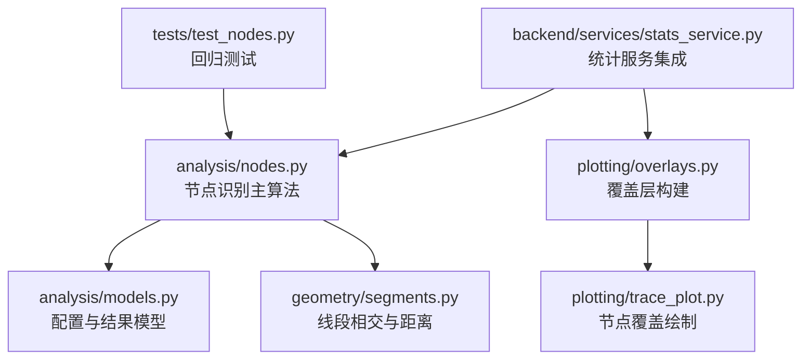
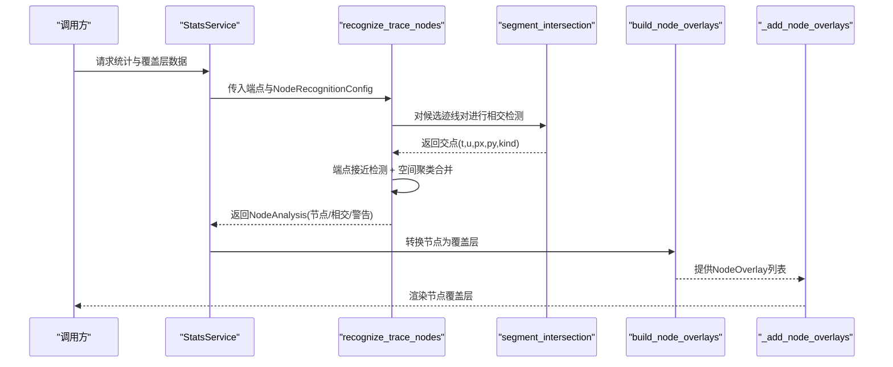
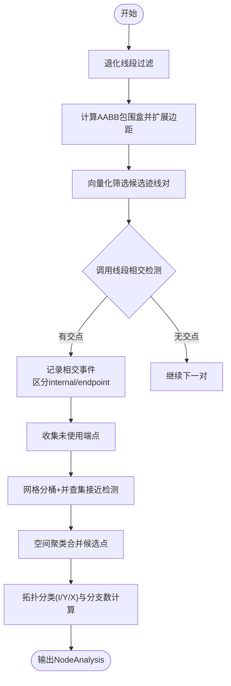
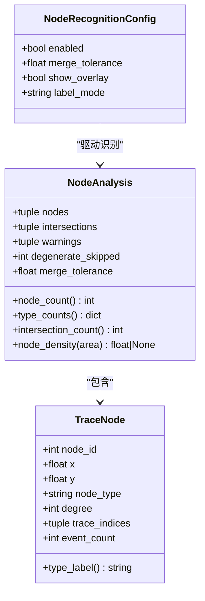
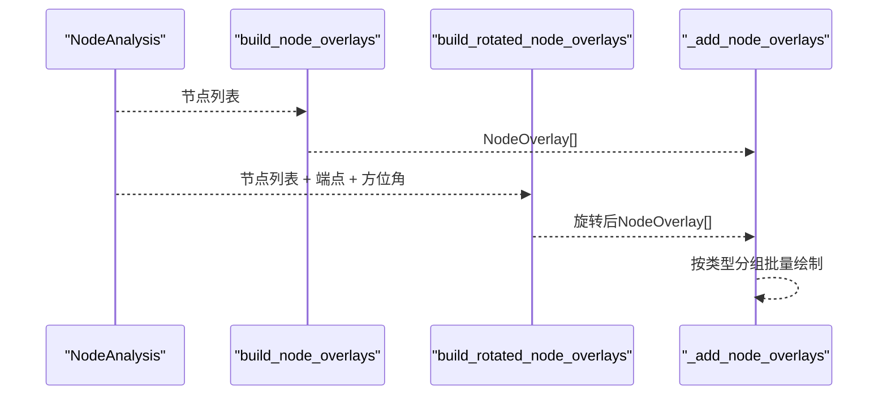
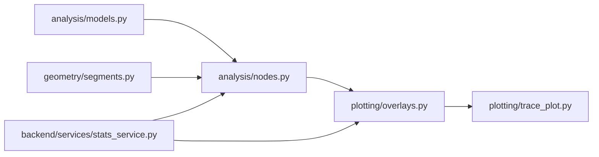

# 第三阶段：节点识别

<cite>
**本文引用的文件**   
- [trace_pipeline/analysis/nodes.py](file://trace_pipeline/analysis/nodes.py)
- [trace_pipeline/analysis/models.py](file://trace_pipeline/analysis/models.py)
- [trace_pipeline/geometry/segments.py](file://trace_pipeline/geometry/segments.py)
- [trace_pipeline/plotting/overlays.py](file://trace_pipeline/plotting/overlays.py)
- [trace_pipeline/plotting/trace_plot.py](file://trace_pipeline/plotting/trace_plot.py)
- [backend/services/stats_service.py](file://backend/services/stats_service.py)
- [tests/test_nodes.py](file://tests/test_nodes.py)
</cite>

## 目录
1. [简介](#简介)
2. [项目结构](#项目结构)
3. [核心组件](#核心组件)
4. [架构总览](#架构总览)
5. [详细组件分析](#详细组件分析)
6. [依赖关系分析](#依赖关系分析)
7. [性能与精度调优](#性能与精度调优)
8. [故障排查指南](#故障排查指南)
9. [结论](#结论)
10. [附录](#附录)

## 简介
本章节聚焦“第三阶段：节点识别”的实现原理与使用方法。该阶段基于迹线（线段）的几何接触关系，自动识别三类节点：
- I 型（孤立端点）：端点不与其它迹线接触
- Y 型（三叉节点）：一条迹线的端点落在另一条迹线内部（端-中接触）
- X 型（交叉节点）：两条迹线在各自内部位置相交（中-中接触）

算法通过包围盒快速筛选候选对、精确相交检测、端点接近检测、空间聚类合并以及拓扑分类等步骤完成识别，并提供覆盖层构建与可视化能力，便于在原始坐标系与旋转坐标系下查看结果。

## 项目结构
与节点识别相关的代码主要分布在以下模块：
- 分析与模型：nodes.py、models.py
- 几何基础：segments.py
- 覆盖层与绘图：overlays.py、trace_plot.py
- 服务集成：stats_service.py
- 单元测试：test_nodes.py

图表来源
- [trace_pipeline/analysis/nodes.py:1-417](file://trace_pipeline/analysis/nodes.py#L1-L417)
- [trace_pipeline/analysis/models.py:1-98](file://trace_pipeline/analysis/models.py#L1-L98)
- [trace_pipeline/geometry/segments.py:1-197](file://trace_pipeline/geometry/segments.py#L1-L197)
- [trace_pipeline/plotting/overlays.py:1-156](file://trace_pipeline/plotting/overlays.py#L1-L156)
- [trace_pipeline/plotting/trace_plot.py:1-565](file://trace_pipeline/plotting/trace_plot.py#L1-L565)
- [backend/services/stats_service.py:180-379](file://backend/services/stats_service.py#L180-L379)
- [tests/test_nodes.py:1-149](file://tests/test_nodes.py#L1-L149)

章节来源
- [trace_pipeline/analysis/nodes.py:1-417](file://trace_pipeline/analysis/nodes.py#L1-L417)
- [trace_pipeline/analysis/models.py:1-98](file://trace_pipeline/analysis/models.py#L1-L98)
- [trace_pipeline/geometry/segments.py:1-197](file://trace_pipeline/geometry/segments.py#L1-L197)
- [trace_pipeline/plotting/overlays.py:1-156](file://trace_pipeline/plotting/overlays.py#L1-L156)
- [trace_pipeline/plotting/trace_plot.py:1-565](file://trace_pipeline/plotting/trace_plot.py#L1-L565)
- [backend/services/stats_service.py:180-379](file://backend/services/stats_service.py#L180-L379)
- [tests/test_nodes.py:1-149](file://tests/test_nodes.py#L1-L149)

## 核心组件
- NodeRecognitionConfig：节点识别配置项，包含是否启用、合并容差、是否显示覆盖层、标签模式等。
- TraceNode / TraceIntersection / NodeAnalysis：节点、相交事件与分析结果的类型定义。
- recognize_trace_nodes：节点识别主函数，输入为端点数组与配置，输出为分析结果。
- segment_intersection：线段相交计算工具，返回参数化交点及类型。
- build_node_overlays / build_rotated_node_overlays：将分析结果转换为覆盖层对象，用于绘图。
- _add_node_overlays：在图上按类型批量绘制节点符号。

章节来源
- [trace_pipeline/analysis/models.py:22-98](file://trace_pipeline/analysis/models.py#L22-L98)
- [trace_pipeline/analysis/nodes.py:160-417](file://trace_pipeline/analysis/nodes.py#L160-L417)
- [trace_pipeline/geometry/segments.py:42-113](file://trace_pipeline/geometry/segments.py#L42-L113)
- [trace_pipeline/plotting/overlays.py:117-156](file://trace_pipeline/plotting/overlays.py#L117-L156)
- [trace_pipeline/plotting/trace_plot.py:320-357](file://trace_pipeline/plotting/trace_plot.py#L320-L357)

## 架构总览
下图展示了从配置到识别再到可视化的完整流程。

图表来源
- [backend/services/stats_service.py:190-212](file://backend/services/stats_service.py#L190-L212)
- [trace_pipeline/analysis/nodes.py:246-385](file://trace_pipeline/analysis/nodes.py#L246-L385)
- [trace_pipeline/geometry/segments.py:42-113](file://trace_pipeline/geometry/segments.py#L42-L113)
- [trace_pipeline/plotting/overlays.py:117-156](file://trace_pipeline/plotting/overlays.py#L117-L156)
- [trace_pipeline/plotting/trace_plot.py:320-357](file://trace_pipeline/plotting/trace_plot.py#L320-L357)

## 详细组件分析

### 节点识别算法实现原理
- 预处理与退化过滤：计算每条迹线长度，剔除长度小于合并容差的退化线段，避免无效计算。
- 包围盒筛选：为有效迹线计算AABB包围盒并扩展一定边距，向量化筛选可能相交的候选对，降低O(N^2)实际比较次数。
- 精确相交检测：使用参数化方法求解两线段交点，判断交点位于内部还是端点附近，记录相交事件。
- 端点接近检测：收集未被相交使用的端点，采用网格分桶+并查集进行接近检测，生成候选端点事件。
- 空间聚类合并：对所有候选点（相交点与接近端点）按坐标进行网格聚类，合并空间相近的事件为一个节点簇。
- 拓扑分类与分支数：根据每个簇内各迹线的参与方式（内部通过或端点参与）计算拓扑值，判定I/Y/X类型。

图表来源
- [trace_pipeline/analysis/nodes.py:182-245](file://trace_pipeline/analysis/nodes.py#L182-L245)
- [trace_pipeline/analysis/nodes.py:246-385](file://trace_pipeline/analysis/nodes.py#L246-L385)
- [trace_pipeline/analysis/nodes.py:385-417](file://trace_pipeline/analysis/nodes.py#L385-L417)
- [trace_pipeline/geometry/segments.py:42-113](file://trace_pipeline/geometry/segments.py#L42-L113)

章节来源
- [trace_pipeline/analysis/nodes.py:160-417](file://trace_pipeline/analysis/nodes.py#L160-L417)
- [trace_pipeline/geometry/segments.py:42-113](file://trace_pipeline/geometry/segments.py#L42-L113)

### I/Y/X 型节点的几何特征与识别条件
- I 型（孤立端点）：端点未与其他迹线发生内部或端点接触；或在端点接近检测中形成独立簇且拓扑值为1。
- Y 型（三叉节点）：一条迹线的端点落在另一条迹线内部（端-中接触），或拓扑值≥3。
- X 型（交叉节点）：两条迹线在各自内部位置相交（中-中接触），即两个参数均位于内部区间。

图表来源
- [trace_pipeline/analysis/models.py:22-98](file://trace_pipeline/analysis/models.py#L22-L98)

章节来源
- [trace_pipeline/analysis/nodes.py:137-158](file://trace_pipeline/analysis/nodes.py#L137-L158)
- [trace_pipeline/analysis/models.py:38-98](file://trace_pipeline/analysis/models.py#L38-L98)

### NodeRecognitionConfig 配置选项与识别精度影响
- enabled：是否启用节点识别。关闭时直接返回空结果。
- merge_tolerance：节点合并容差（米）。直接影响：
  - 退化线段过滤阈值
  - 相交检测的端点邻域判定
  - 端点接近检测的网格单元大小
  - 空间聚类的合并半径
  增大可提升鲁棒性但可能合并不同节点；减小可提高分辨率但易产生碎片。
- show_overlay：是否在绘图中显示节点覆盖层。
- label_mode：节点标注模式，支持 none/type/id，控制图例与标注展示策略。

章节来源
- [trace_pipeline/analysis/models.py:22-36](file://trace_pipeline/analysis/models.py#L22-L36)
- [trace_pipeline/analysis/nodes.py:182-196](file://trace_pipeline/analysis/nodes.py#L182-L196)

### 节点覆盖层构建与可视化
- 覆盖层构建：
  - build_node_overlays：将NodeAnalysis.nodes转为NodeOverlay序列。
  - build_rotated_node_overlays：将节点坐标旋转到测线坐标系，便于对比视图。
- 可视化绘制：
  - _add_node_overlays：按节点类型分组批量scatter绘制，提高性能。
  - render_trace_plot：整合迹线、凸包/圆窗、节点覆盖层，统一布局与图例。

图表来源
- [trace_pipeline/plotting/overlays.py:117-156](file://trace_pipeline/plotting/overlays.py#L117-L156)
- [trace_pipeline/plotting/trace_plot.py:320-357](file://trace_pipeline/plotting/trace_plot.py#L320-L357)
- [trace_pipeline/plotting/trace_plot.py:443-565](file://trace_pipeline/plotting/trace_plot.py#L443-L565)

章节来源
- [trace_pipeline/plotting/overlays.py:117-156](file://trace_pipeline/plotting/overlays.py#L117-L156)
- [trace_pipeline/plotting/trace_plot.py:320-357](file://trace_pipeline/plotting/trace_plot.py#L320-L357)
- [trace_pipeline/plotting/trace_plot.py:443-565](file://trace_pipeline/plotting/trace_plot.py#L443-L565)

### 节点合并容差与标签模式的配置说明
- 合并容差：
  - 默认值通常为较小正值（如0.01 m），可根据数据尺度调整。
  - 算法内部会结合平均迹线长度自适应设置聚类容差，避免极端情况。
- 标签模式：
  - none：不显示节点标注。
  - type：按类型（I/Y/X）标注。
  - id：按节点ID标注。
  该模式由NodeRecognitionConfig.label_mode控制，并在覆盖层与图例中体现。

章节来源
- [trace_pipeline/analysis/models.py:22-36](file://trace_pipeline/analysis/models.py#L22-L36)
- [trace_pipeline/analysis/nodes.py:182-196](file://trace_pipeline/analysis/nodes.py#L182-L196)

## 依赖关系分析
- 算法层：
  - nodes.py 依赖 geometry/segments.py 的线段相交与重叠处理。
  - nodes.py 依赖 analysis/models.py 的配置与结果类型。
- 服务层：
  - stats_service.py 构造NodeRecognitionConfig并调用recognize_trace_nodes，随后构建覆盖层。
- 绘图层：
  - overlays.py 将分析结果转换为覆盖层对象。
  - trace_plot.py 负责具体绘制逻辑与布局。

图表来源
- [trace_pipeline/analysis/nodes.py:1-417](file://trace_pipeline/analysis/nodes.py#L1-L417)
- [trace_pipeline/analysis/models.py:1-98](file://trace_pipeline/analysis/models.py#L1-L98)
- [trace_pipeline/geometry/segments.py:1-197](file://trace_pipeline/geometry/segments.py#L1-L197)
- [trace_pipeline/plotting/overlays.py:1-156](file://trace_pipeline/plotting/overlays.py#L1-L156)
- [trace_pipeline/plotting/trace_plot.py:1-565](file://trace_pipeline/plotting/trace_plot.py#L1-L565)
- [backend/services/stats_service.py:180-379](file://backend/services/stats_service.py#L180-L379)

章节来源
- [trace_pipeline/analysis/nodes.py:1-417](file://trace_pipeline/analysis/nodes.py#L1-L417)
- [trace_pipeline/analysis/models.py:1-98](file://trace_pipeline/analysis/models.py#L1-L98)
- [trace_pipeline/geometry/segments.py:1-197](file://trace_pipeline/geometry/segments.py#L1-L197)
- [trace_pipeline/plotting/overlays.py:1-156](file://trace_pipeline/plotting/overlays.py#L1-L156)
- [trace_pipeline/plotting/trace_plot.py:1-565](file://trace_pipeline/plotting/trace_plot.py#L1-L565)
- [backend/services/stats_service.py:180-379](file://backend/services/stats_service.py#L180-L379)

## 性能与精度调优
- 性能优化要点：
  - 包围盒筛选：利用NumPy向量化快速排除不可能相交的迹线对。
  - 网格分桶：端点接近检测与候选点聚类均采用网格分桶+并查集，降低复杂度。
  - 批量绘制：节点覆盖层按类型分组scatter，减少绘图开销。
- 精度调优建议：
  - 合理设置merge_tolerance：过小导致碎片节点，过大导致误合并。
  - 关注退化线段：当大量线段长度小于容差时会被跳过，需检查数据质量。
  - 坐标范围过大：若坐标绝对值极大，网格索引可能溢出，应进行单位归一化或缩放。

[本节为通用指导，无需特定文件引用]

## 故障排查指南
- 常见问题与定位：
  - 未检测到任何节点：检查enabled是否为True；确认merge_tolerance是否过大导致全部合并；验证端点数据是否有效。
  - 节点数量异常多：减小merge_tolerance；检查是否存在大量退化线段或噪声端点。
  - 坐标溢出警告：当坐标绝对值超过安全范围时会发出警告，建议对数据进行缩放或平移。
- 日志与调试：
  - 识别过程会记录容差、均值长度等信息，便于定位问题。
  - 退化线段计数与警告信息可用于数据质量评估。

章节来源
- [trace_pipeline/analysis/nodes.py:190-222](file://trace_pipeline/analysis/nodes.py#L190-L222)
- [trace_pipeline/analysis/nodes.py:330-346](file://trace_pipeline/analysis/nodes.py#L330-L346)

## 结论
节点识别模块以几何接触为核心，结合高效的包围盒筛选、精确相交检测与空间聚类，能够稳定识别I/Y/X三类节点。通过NodeRecognitionConfig可灵活控制识别行为与可视化展示。配合覆盖层构建与绘图，可在原始与旋转坐标系下直观呈现结果，便于地质解释与后续分析。

[本节为总结性内容，无需特定文件引用]

## 附录
- 使用示例（路径参考）：
  - 构造配置与调用识别：参见测试用例中的配置构造与识别调用。
  - 服务集成：统计服务中构造NodeRecognitionConfig并调用识别，再构建覆盖层。

章节来源
- [tests/test_nodes.py:11-19](file://tests/test_nodes.py#L11-L19)
- [tests/test_nodes.py:25-131](file://tests/test_nodes.py#L25-L131)
- [backend/services/stats_service.py:190-212](file://backend/services/stats_service.py#L190-L212)