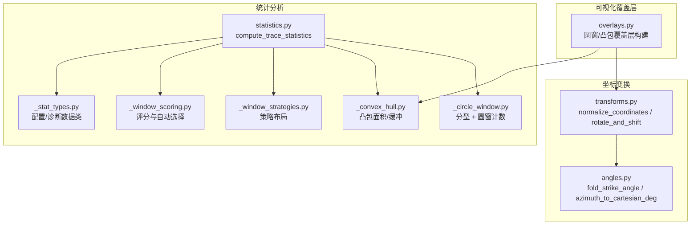
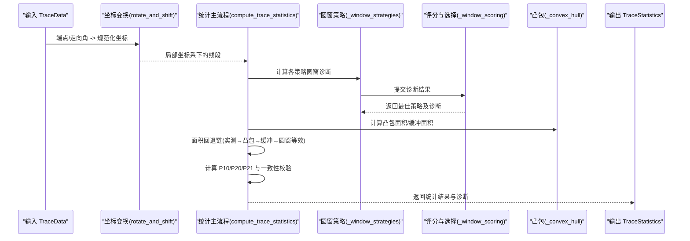
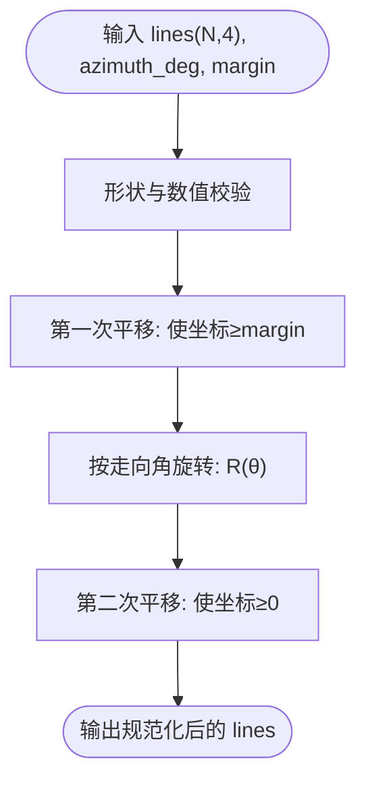
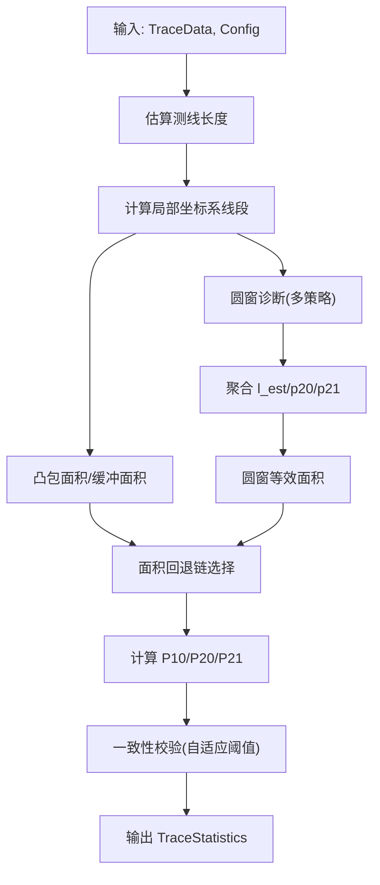
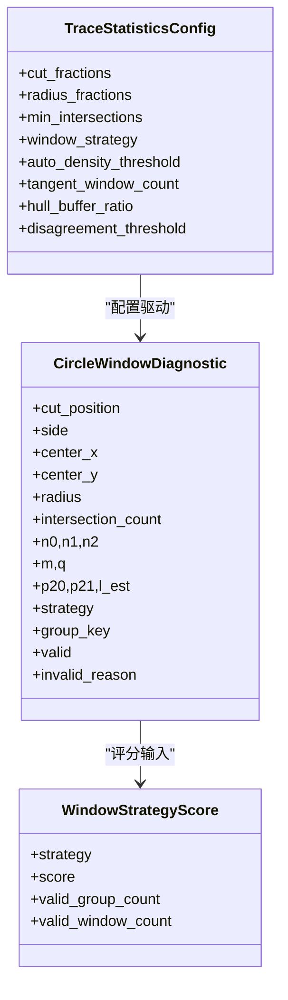
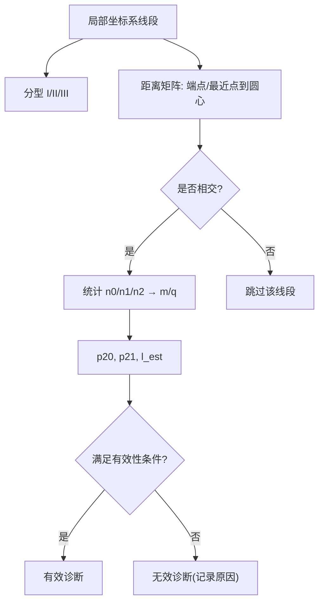
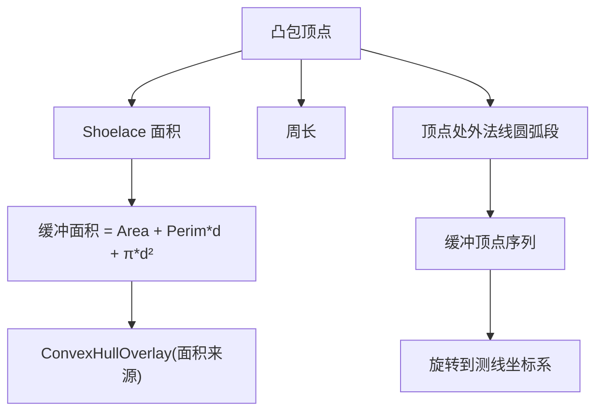
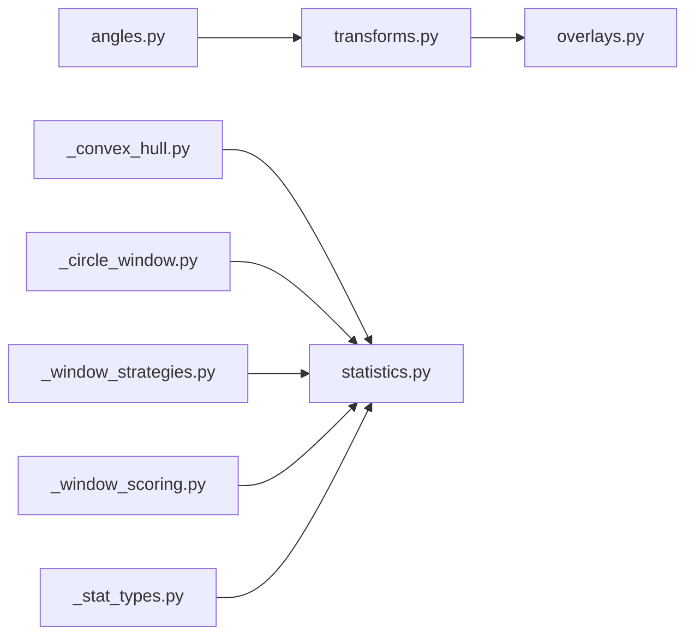

# 第二阶段：坐标变换与统计分析

<cite>
**本文引用的文件列表**
- [trace_pipeline/geology/transforms.py](file://trace_pipeline/geology/transforms.py)
- [trace_pipeline/geology/statistics.py](file://trace_pipeline/geology/statistics.py)
- [trace_pipeline/geology/_circle_window.py](file://trace_pipeline/geology/_circle_window.py)
- [trace_pipeline/geology/_convex_hull.py](file://trace_pipeline/geology/_convex_hull.py)
- [trace_pipeline/geology/_window_strategies.py](file://trace_pipeline/geology/_window_strategies.py)
- [trace_pipeline/geology/_window_scoring.py](file://trace_pipeline/geology/_window_scoring.py)
- [trace_pipeline/geology/_stat_types.py](file://trace_pipeline/geology/_stat_types.py)
- [trace_pipeline/geology/angles.py](file://trace_pipeline/geology/angles.py)
- [trace_pipeline/plotting/overlays.py](file://trace_pipeline/plotting/overlays.py)
- [tests/test_transforms.py](file://tests/test_transforms.py)
- [tests/test_statistics.py](file://tests/test_statistics.py)
</cite>

## 目录
1. [引言](#引言)
2. [项目结构](#项目结构)
3. [核心组件](#核心组件)
4. [架构总览](#架构总览)
5. [详细组件分析](#详细组件分析)
6. [依赖关系分析](#依赖关系分析)
7. [性能考量](#性能考量)
8. [故障排查指南](#故障排查指南)
9. [结论](#结论)
10. [附录](#附录)

## 引言
本章节聚焦“坐标变换”和“统计分析”两个关键阶段，系统阐述以下目标：
- normalize_coordinates 的数学原理与旋转角度计算逻辑
- 统计指标 P₁₀/P₂₀/P₂₁ 的计算方法与数据来源选择策略
- 圆窗策略（切线、混合、同心）的选择逻辑与评分机制
- 参数调优建议与结果解读指南
- 凸包覆盖层构建的实现细节（含缓冲凸包）

## 项目结构
围绕坐标变换与统计分析的核心代码位于 geology 子模块，配合 plotting.overlays 完成可视化覆盖层构建。主要文件职责如下：
- transforms.py：坐标平移与旋转流水线，提供 normalize_coordinates 等函数
- statistics.py：统计主流程，整合测线长度、面积、迹长与 P 系列指标
- _circle_window.py：圆形取样窗计数与迹线分型 I/II/III
- _convex_hull.py：凸包构建、面积与缓冲近似
- _window_strategies.py：三种圆窗策略布局与批量计数分发
- _window_scoring.py：六因子加权评分与自动策略选择
- _stat_types.py：配置与诊断数据结构定义
- angles.py：方位角与走向角的折叠与转换
- overlays.py：将统计与几何结果转换为绘图覆盖层

图表来源
- [trace_pipeline/geology/transforms.py:127-144](file://trace_pipeline/geology/transforms.py#L127-L144)
- [trace_pipeline/geology/angles.py:76-102](file://trace_pipeline/geology/angles.py#L76-L102)
- [trace_pipeline/geology/statistics.py:212-391](file://trace_pipeline/geology/statistics.py#L212-L391)
- [trace_pipeline/geology/_circle_window.py:12-66](file://trace_pipeline/geology/_circle_window.py#L12-66)
- [trace_pipeline/geology/_convex_hull.py:79-114](file://trace_pipeline/geology/_convex_hull.py#L79-L114)
- [trace_pipeline/geology/_window_strategies.py:173-185](file://trace_pipeline/geology/_window_strategies.py#L173-L185)
- [trace_pipeline/geology/_window_scoring.py:235-323](file://trace_pipeline/geology/_window_scoring.py#L235-L323)
- [trace_pipeline/plotting/overlays.py:86-114](file://trace_pipeline/plotting/overlays.py#L86-L114)

章节来源
- [trace_pipeline/geology/transforms.py:1-169](file://trace_pipeline/geology/transforms.py#L1-L169)
- [trace_pipeline/geology/statistics.py:1-391](file://trace_pipeline/geology/statistics.py#L1-L391)
- [trace_pipeline/geology/_circle_window.py:1-269](file://trace_pipeline/geology/_circle_window.py#L1-L269)
- [trace_pipeline/geology/_convex_hull.py:1-208](file://trace_pipeline/geology/_convex_hull.py#L1-L208)
- [trace_pipeline/geology/_window_strategies.py:1-185](file://trace_pipeline/geology/_window_strategies.py#L1-L185)
- [trace_pipeline/geology/_window_scoring.py:1-323](file://trace_pipeline/geology/_window_scoring.py#L1-L323)
- [trace_pipeline/geology/_stat_types.py:1-125](file://trace_pipeline/geology/_stat_types.py#L1-L125)
- [trace_pipeline/geology/angles.py:1-168](file://trace_pipeline/geology/angles.py#L1-L168)
- [trace_pipeline/plotting/overlays.py:1-156](file://trace_pipeline/plotting/overlays.py#L1-L156)

## 核心组件
- 坐标变换流水线
  - shift_to_positive：将线段整体平移到非负区域，支持边距 margin
  - rotate_and_shift：按走向角旋转后再次平移到非负区域
  - normalize_coordinates：组合上述两步，形成标准化坐标系
- 统计分析主流程
  - compute_trace_statistics：统一计算测线长度、露头面积、平均迹长、P₁₀/P₂₀/P₂₁，并输出诊断信息
- 圆窗策略与评分
  - tangent/hybrid/concentric 三种策略布局
  - 六因子加权评分与自动策略选择
- 凸包与缓冲
  - 凸包面积、缓冲面积解析近似、缓冲顶点生成（用于绘制）

章节来源
- [trace_pipeline/geology/transforms.py:86-144](file://trace_pipeline/geology/transforms.py#L86-L144)
- [trace_pipeline/geology/statistics.py:212-391](file://trace_pipeline/geology/statistics.py#L212-L391)
- [trace_pipeline/geology/_window_strategies.py:173-185](file://trace_pipeline/geology/_window_strategies.py#L173-L185)
- [trace_pipeline/geology/_window_scoring.py:178-206](file://trace_pipeline/geology/_window_scoring.py#L178-L206)
- [trace_pipeline/geology/_convex_hull.py:79-114](file://trace_pipeline/geology/_convex_hull.py#L79-L114)

## 架构总览
下图展示从原始端点数据到最终统计指标与覆盖层的完整流程，包括坐标变换、圆窗策略选择、面积回退链与一致性校验。

图表来源
- [trace_pipeline/geology/transforms.py:105-144](file://trace_pipeline/geology/transforms.py#L105-L144)
- [trace_pipeline/geology/statistics.py:212-391](file://trace_pipeline/geology/statistics.py#L212-L391)
- [trace_pipeline/geology/_window_strategies.py:173-185](file://trace_pipeline/geology/_window_strategies.py#L173-L185)
- [trace_pipeline/geology/_window_scoring.py:235-323](file://trace_pipeline/geology/_window_scoring.py#L235-L323)
- [trace_pipeline/geology/_convex_hull.py:79-114](file://trace_pipeline/geology/_convex_hull.py#L79-L114)

## 详细组件分析

### 坐标变换与 normalize_coordinates 的数学原理
- 正象限平移
  - 计算所有端点的最小 x/y，按 margin 计算偏移量 dx/dy，确保所有坐标 ≥ margin
- 旋转矩阵
  - 使用走向角 fold_strike_angle 将 0–360° 映射到 [-90°, 90°] 弧度，构造标准二维旋转矩阵
- 二次平移
  - 旋转后再平移到非负区域（margin=0），保证后续统计在局部坐标系中稳定
- normalize_points_like_lines
  - 对任意点集应用与线段相同的两次平移与一次旋转，保持相对位置一致

图表来源
- [trace_pipeline/geology/transforms.py:127-144](file://trace_pipeline/geology/transforms.py#L127-L144)
- [trace_pipeline/geology/angles.py:76-102](file://trace_pipeline/geology/angles.py#L76-L102)

章节来源
- [trace_pipeline/geology/transforms.py:29-81](file://trace_pipeline/geology/transforms.py#L29-L81)
- [trace_pipeline/geology/transforms.py:86-144](file://trace_pipeline/geology/transforms.py#L86-L144)
- [trace_pipeline/geology/transforms.py:147-169](file://trace_pipeline/geology/transforms.py#L147-L169)
- [trace_pipeline/geology/angles.py:76-102](file://trace_pipeline/geology/angles.py#L76-L102)
- [tests/test_transforms.py:16-94](file://tests/test_transforms.py#L16-L94)

### 统计指标 P₁₀/P₂₀/P₂₁ 的计算方法
- 测线长度
  - 优先使用 measured_scanline_length；否则基于 scanline_positions 估计（最大位置 + 半间距）
- 露头面积选择（四层回退）
  - 实测面积 → 原始凸包面积（需几何质量合格）→ 缓冲凸包面积 → 圆窗等效面积（由 trace_count / P20_window 反推）
  - 当凸包与圆窗等效面积差异超过自适应阈值时，降级到圆窗等效面积并给出警告
- 迹长总长度
  - 优先使用 segment_lengths 总和；若不可用则回退到端点欧氏距离总和；再不可用则使用窗口估计的平均迹长 × 迹线数
- P₁₀（线密度）
  - P₁₀ = trace_count / scanline_length
- P₂₀（面密度）
  - 若有效面积可用：P₂₀ = trace_count / effective_area
  - 否则使用窗口估计的 P₂₀
- P₂₁（长度密度）
  - 若有效面积与观测迹长均有效：P₂₁ = observed_total / effective_area
  - 否则使用窗口估计的 P₂₁（若可用）
- 一致性校验
  - 比较主 P₂₀/P₂₁ 与窗口估计值，差异超过自适应阈值时发出警告

图表来源
- [trace_pipeline/geology/statistics.py:51-68](file://trace_pipeline/geology/statistics.py#L51-L68)
- [trace_pipeline/geology/statistics.py:106-165](file://trace_pipeline/geology/statistics.py#L106-L165)
- [trace_pipeline/geology/statistics.py:179-206](file://trace_pipeline/geology/statistics.py#L179-L206)
- [trace_pipeline/geology/statistics.py:289-336](file://trace_pipeline/geology/statistics.py#L289-L336)
- [trace_pipeline/geology/_circle_window.py:187-191](file://trace_pipeline/geology/_circle_window.py#L187-L191)

章节来源
- [trace_pipeline/geology/statistics.py:212-391](file://trace_pipeline/geology/statistics.py#L212-L391)
- [trace_pipeline/geology/_circle_window.py:187-191](file://trace_pipeline/geology/_circle_window.py#L187-L191)
- [tests/test_statistics.py:63-112](file://tests/test_statistics.py#L63-L112)

### 圆窗策略选择逻辑与评分机制
- 三种策略
  - tangent：沿测线切线方向布置多个圆窗，半径由测线长度与配置决定
  - hybrid：在指定切割比例处左右两侧按侧向高度与边缘限制确定最大半径，再按半径分数生成多个窗口
  - concentric：以测线中心为圆心，按半径分数生成同心圆窗
- 六因子加权评分
  - 有效分组数量权重最高，其次空间覆盖（侧向+沿测线）、稳定性（组内变异系数倒数）、样本充分性（相交迹线数达标程度）、半径大小
- 自动选择
  - 先根据粗略密度与期望相交数进行偏好策略选择（tangent/hybrid/concentric）
  - 对所有策略评分，若存在有效候选，选择得分最高者；若得分非正或无有效候选，回退到最保守策略（tangent）
  - 当最佳策略与偏好策略接近（容差范围内），优先采用偏好策略

图表来源
- [trace_pipeline/geology/_stat_types.py:15-65](file://trace_pipeline/geology/_stat_types.py#L15-L65)
- [trace_pipeline/geology/_stat_types.py:67-89](file://trace_pipeline/geology/_stat_types.py#L67-L89)
- [trace_pipeline/geology/_window_scoring.py:170-206](file://trace_pipeline/geology/_window_scoring.py#L170-L206)

章节来源
- [trace_pipeline/geology/_window_strategies.py:52-185](file://trace_pipeline/geology/_window_strategies.py#L52-L185)
- [trace_pipeline/geology/_window_scoring.py:178-323](file://trace_pipeline/geology/_window_scoring.py#L178-L323)
- [trace_pipeline/geology/_stat_types.py:15-65](file://trace_pipeline/geology/_stat_types.py#L15-L65)

### 圆窗计数与迹线分型 I/II/III
- 迹线分型
  - 在局部坐标系下，判断线段与测线的相交情况：穿过测线为 I 型；延长线与测线相交但线段本体不穿为 II 型；平行且不交为 III 型
- 圆窗计数
  - 批量计算 N 条线段与 M 个圆窗的距离矩阵，判定相交条件（端点在圆内或最近点到圆心距离小于半径）
  - 统计 n0/n1/n2，计算 m/q，进而得到 p20、p21 与平均迹长估计 l_est
  - 无效窗口原因包括相交迹线不足、m≤0、q≤0 等

图表来源
- [trace_pipeline/geology/_circle_window.py:12-66](file://trace_pipeline/geology/_circle_window.py#L12-66)
- [trace_pipeline/geology/_circle_window.py:71-216](file://trace_pipeline/geology/_circle_window.py#L71-L216)

章节来源
- [trace_pipeline/geology/_circle_window.py:12-66](file://trace_pipeline/geology/_circle_window.py#L12-66)
- [trace_pipeline/geology/_circle_window.py:71-216](file://trace_pipeline/geology/_circle_window.py#L71-L216)
- [tests/test_statistics.py:116-192](file://tests/test_statistics.py#L116-L192)

### 凸包覆盖层构建与缓冲实现
- 凸包构建
  - 使用 Andrew 单调链算法构建端点凸包，退化（点数不足或共线）返回 None
- 面积计算
  - 中心化 Shoelace 公式提高大坐标精度
- 缓冲凸包
  - 解析近似：面积 = 原面积 + 周长×缓冲距离 + π×缓冲距离²
  - 绘图顶点：在每个顶点处按外法线方向生成圆弧段折线近似，控制最大弧角以保证平滑度
- 覆盖层构建
  - overlays 模块将统计选择的面积来源（原始凸包或缓冲凸包）转换为原始坐标系与旋转坐标系的覆盖层对象

图表来源
- [trace_pipeline/geology/_convex_hull.py:17-84](file://trace_pipeline/geology/_convex_hull.py#L17-L84)
- [trace_pipeline/geology/_convex_hull.py:103-114](file://trace_pipeline/geology/_convex_hull.py#L103-L114)
- [trace_pipeline/geology/_convex_hull.py:116-183](file://trace_pipeline/geology/_convex_hull.py#L116-L183)
- [trace_pipeline/plotting/overlays.py:86-114](file://trace_pipeline/plotting/overlays.py#L86-L114)

章节来源
- [trace_pipeline/geology/_convex_hull.py:17-183](file://trace_pipeline/geology/_convex_hull.py#L17-L183)
- [trace_pipeline/plotting/overlays.py:86-114](file://trace_pipeline/plotting/overlays.py#L86-L114)

## 依赖关系分析
- 坐标变换依赖角度工具
  - normalize_coordinates 使用 fold_strike_angle 确定旋转方向与幅度
- 统计分析依赖圆窗与凸包
  - compute_trace_statistics 调用 _classify_trace_types、_count_circle_windows_batch、_convex_hull_area、_buffered_hull_area
- 策略选择依赖评分与布局
  - _select_window_diagnostics 综合三种策略的诊断结果进行评分与选择
- 覆盖层依赖变换与凸包
  - overlays 使用 normalize_points_like_lines 将圆窗/节点/凸包从原始坐标系旋转到测线坐标系

图表来源
- [trace_pipeline/geology/angles.py:76-102](file://trace_pipeline/geology/angles.py#L76-L102)
- [trace_pipeline/geology/transforms.py:127-144](file://trace_pipeline/geology/transforms.py#L127-L144)
- [trace_pipeline/geology/statistics.py:212-391](file://trace_pipeline/geology/statistics.py#L212-L391)
- [trace_pipeline/geology/_convex_hull.py:79-114](file://trace_pipeline/geology/_convex_hull.py#L79-L114)
- [trace_pipeline/geology/_circle_window.py:71-216](file://trace_pipeline/geology/_circle_window.py#L71-L216)
- [trace_pipeline/geology/_window_strategies.py:173-185](file://trace_pipeline/geology/_window_strategies.py#L173-L185)
- [trace_pipeline/geology/_window_scoring.py:235-323](file://trace_pipeline/geology/_window_scoring.py#L235-L323)
- [trace_pipeline/plotting/overlays.py:65-83](file://trace_pipeline/plotting/overlays.py#L65-L83)

章节来源
- [trace_pipeline/geology/transforms.py:127-144](file://trace_pipeline/geology/transforms.py#L127-L144)
- [trace_pipeline/geology/statistics.py:212-391](file://trace_pipeline/geology/statistics.py#L212-L391)
- [trace_pipeline/geology/_window_scoring.py:235-323](file://trace_pipeline/geology/_window_scoring.py#L235-L323)
- [trace_pipeline/plotting/overlays.py:65-114](file://trace_pipeline/plotting/overlays.py#L65-L114)

## 性能考量
- 向量化与广播
  - 圆窗计数通过广播一次性计算 N×M 距离矩阵，避免 Python 循环开销
- 数值稳定性
  - 凸包面积使用中心化坐标减少大坐标舍入误差
  - 安全分母与裁剪 t 参数避免除零与越界
- 自适应阈值
  - 随样本量衰减的阈值降低小样本误判风险，提升稳健性

[本节为通用指导，无需具体文件引用]

## 故障排查指南
- 常见错误与定位
  - 输入形状不符：确保 lines 为 (N,4)，points 为 (N,2)
  - NaN/Inf 输入：校验端点与扫描线位置数组
  - 圆窗无效：检查 min_intersections、侧向高度与半径限制
  - 面积回退：查看 outcrop_area_source 与 area_disagreement_ratio，确认降级原因
- 日志与诊断
  - 统计主流程会输出详细调试日志，包含策略、面积来源、P20/P21 来源与一致性告警
  - CircleWindowDiagnostic.invalid_reason 提供单个窗口无效的具体原因

章节来源
- [trace_pipeline/geology/transforms.py:29-46](file://trace_pipeline/geology/transforms.py#L29-L46)
- [trace_pipeline/geology/statistics.py:335-356](file://trace_pipeline/geology/statistics.py#L335-L356)
- [trace_pipeline/geology/_circle_window.py:219-249](file://trace_pipeline/geology/_circle_window.py#L219-L249)
- [tests/test_transforms.py:75-82](file://tests/test_transforms.py#L75-L82)
- [tests/test_statistics.py:179-192](file://tests/test_statistics.py#L179-L192)

## 结论
- normalize_coordinates 通过“平移→旋转→再平移”的三段式流水线，将数据统一到稳定的局部坐标系，便于后续统计与可视化
- 统计指标 P₁₀/P₂₀/P₂₁ 的计算遵循严格的回退链与一致性校验，确保在不同数据质量下仍能得到可信结果
- 圆窗策略的自动选择结合六因子评分与密度偏好，兼顾代表性、稳定性与样本充分性
- 凸包覆盖层与缓冲实现为可视化提供了可靠的几何基础

[本节为总结性内容，无需具体文件引用]

## 附录

### 参数调优建议
- cut_fractions/radius_fractions
  - 增加切分比例与半径分数可提升空间覆盖，但会增加计算量；建议从默认值开始逐步扩展
- min_intersections
  - 提高可降低噪声影响，但可能导致有效窗口减少；建议结合数据密度调整
- auto_density_threshold
  - 控制自动策略偏向：较低值更倾向 hybrid，较高值倾向 concentric
- tangent_window_count
  - 增大可增加切线窗数量，适合低密度场景
- hull_buffer_ratio
  - 控制缓冲强度；过大可能过度膨胀，过小无法修正几何缺陷
- disagreement_threshold
  - 手动设置可固定凸包与圆窗等效面积的容忍度；留空则启用自适应阈值

章节来源
- [trace_pipeline/geology/_stat_types.py:15-65](file://trace_pipeline/geology/_stat_types.py#L15-L65)
- [trace_pipeline/geology/_window_scoring.py:209-232](file://trace_pipeline/geology/_window_scoring.py#L209-L232)

### 结果解读指南
- outcrop_area_source
  - measured/hull/hull_buffered/window_equivalent 指示面积来源；若为 window_equivalent，说明凸包质量不佳或差异过大
- p20_source/p21_source
  - 指示 P₂₀/P₂₁ 的来源；window 表示来自圆窗估计
- window_validation_warning
  - 若出现告警，说明主指标与圆窗估计存在显著差异，需检查数据质量或参数设置
- diagnostics
  - 查看每个窗口的 valid/invalid_reason，辅助定位无效原因

章节来源
- [trace_pipeline/geology/statistics.py:358-391](file://trace_pipeline/geology/statistics.py#L358-L391)
- [trace_pipeline/geology/_stat_types.py:91-125](file://trace_pipeline/geology/_stat_types.py#L91-L125)