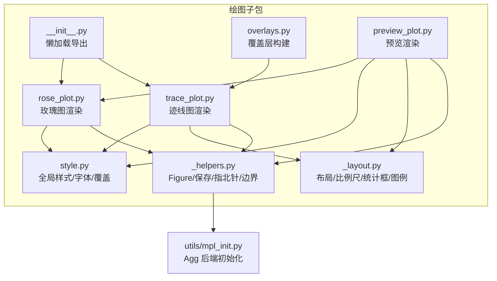
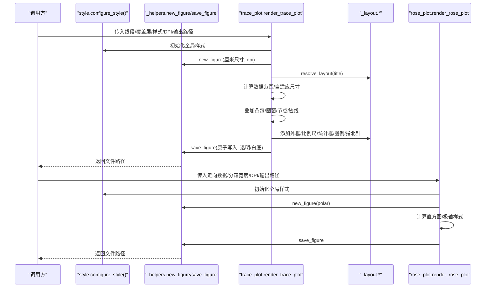
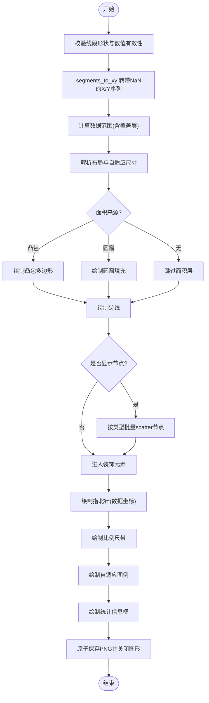
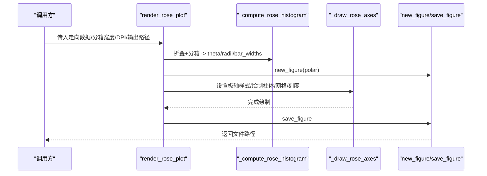
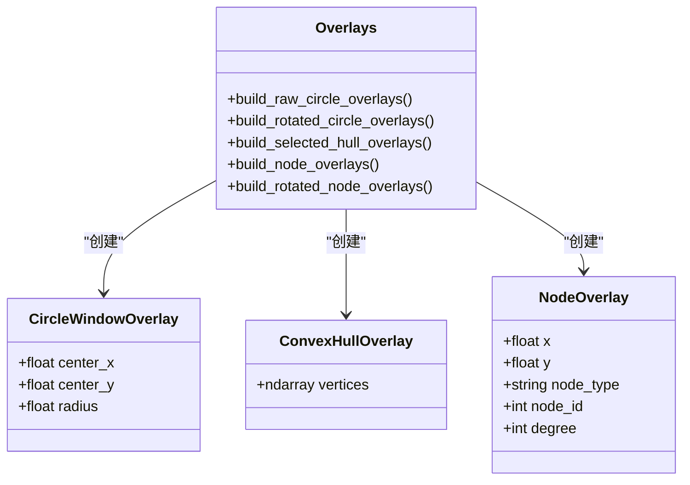
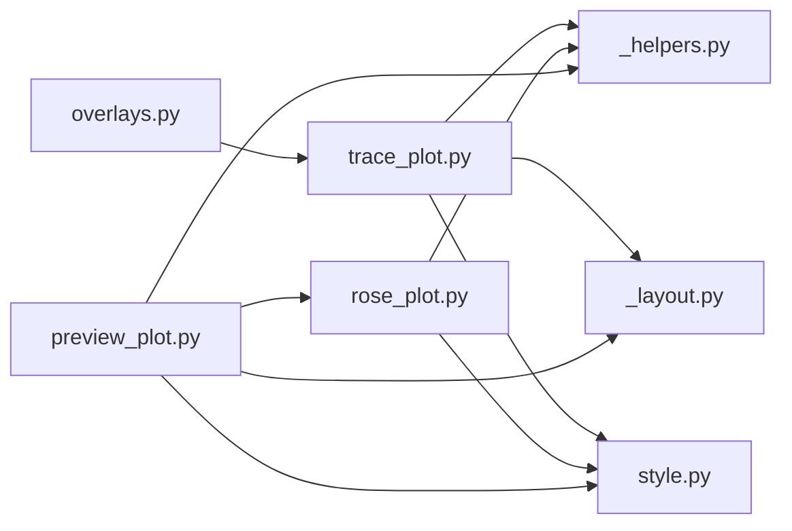

# 第五阶段：图表绘制

<cite>
**本文引用的文件**   
- [trace_pipeline/plotting/__init__.py](file://trace_pipeline/plotting/__init__.py)
- [trace_pipeline/plotting/trace_plot.py](file://trace_pipeline/plotting/trace_plot.py)
- [trace_pipeline/plotting/rose_plot.py](file://trace_pipeline/plotting/rose_plot.py)
- [trace_pipeline/plotting/_helpers.py](file://trace_pipeline/plotting/_helpers.py)
- [trace_pipeline/plotting/_layout.py](file://trace_pipeline/plotting/_layout.py)
- [trace_pipeline/plotting/style.py](file://trace_pipeline/plotting/style.py)
- [trace_pipeline/utils/mpl_init.py](file://trace_pipeline/utils/mpl_init.py)
- [trace_pipeline/plotting/overlays.py](file://trace_pipeline/plotting/overlays.py)
- [trace_pipeline/plotting/preview_plot.py](file://trace_pipeline/plotting/preview_plot.py)
- [config.example.json](file://config.example.json)
- [tests/test_plotting.py](file://tests/test_plotting.py)
</cite>

## 目录
1. [引言](#引言)
2. [项目结构](#项目结构)
3. [核心组件](#核心组件)
4. [架构总览](#架构总览)
5. [详细组件分析](#详细组件分析)
6. [依赖关系分析](#依赖关系分析)
7. [性能与 DPI 设置](#性能与-dpi-设置)
8. [样式定制与扩展指南](#样式定制与扩展指南)
9. [故障排查](#故障排查)
10. [结论](#结论)

## 引言
本章节聚焦于“图表绘制”阶段的实现，系统说明原始迹线图、旋转迹线图与玫瑰图的生成逻辑；解释 DPI、颜色方案与布局配置；提供自定义绘图样式的扩展方法；并给出 matplotlib 后端初始化与多线程安全处理的实现细节。文档面向不同技术背景的读者，既包含高层概览，也提供代码级可视化与可操作建议。

## 项目结构
绘图子系统位于 trace_pipeline/plotting 下，采用“入口导出 + 模块内聚 + 共享工具”的组织方式：
- 入口导出：通过 __init__.py 的懒加载机制按需导入具体模块，避免提前加载 pyplot。
- 核心渲染：trace_plot.py（迹线图）、rose_plot.py（玫瑰图）。
- 共享工具：_helpers.py（Figure 创建/保存、指北针、数据范围计算）、_layout.py（布局、比例尺、统计框、图例等）。
- 样式与字体：style.py（全局样式、CJK 字体栈、标题/正文字体参数、线程安全的样式覆盖）。
- 覆盖层构建：overlays.py（圆窗、凸包、节点覆盖层的数据准备）。
- 预览能力：preview_plot.py（独立预览，不依赖业务逻辑）。
- 后端初始化：utils/mpl_init.py（强制非交互 Agg 后端）。

图示来源
- [trace_pipeline/plotting/__init__.py:1-36](file://trace_pipeline/plotting/__init__.py#L1-L36)
- [trace_pipeline/plotting/trace_plot.py:1-565](file://trace_pipeline/plotting/trace_plot.py#L1-L565)
- [trace_pipeline/plotting/rose_plot.py:1-140](file://trace_pipeline/plotting/rose_plot.py#L1-L140)
- [trace_pipeline/plotting/_helpers.py:1-192](file://trace_pipeline/plotting/_helpers.py#L1-L192)
- [trace_pipeline/plotting/_layout.py:1-653](file://trace_pipeline/plotting/_layout.py#L1-L653)
- [trace_pipeline/plotting/style.py:1-296](file://trace_pipeline/plotting/style.py#L1-L296)
- [trace_pipeline/plotting/overlays.py:1-156](file://trace_pipeline/plotting/overlays.py#L1-L156)
- [trace_pipeline/plotting/preview_plot.py:1-495](file://trace_pipeline/plotting/preview_plot.py#L1-L495)
- [trace_pipeline/utils/mpl_init.py:1-24](file://trace_pipeline/utils/mpl_init.py#L1-L24)

章节来源
- [trace_pipeline/plotting/__init__.py:1-36](file://trace_pipeline/plotting/__init__.py#L1-L36)

## 核心组件
- 迹线图渲染器：负责将线段数组转换为带 NaN 分隔的 X/Y 序列，计算自适应布局与尺寸，叠加凸包/圆窗/节点覆盖层，绘制指北针、比例尺、统计框与图例，最终输出 PNG。
- 玫瑰图渲染器：对走向数据进行半圆折叠与分箱，极坐标柱状图绘制，统一网格、边框与刻度样式。
- 共享辅助：Figure 创建与原子写入保存、指北针几何与绘制、数据范围计算。
- 布局与装饰：外框、空白面板、比例尺带、统计信息框、自适应图例、节点样式预设。
- 样式系统：全局字体栈、数学文本字体、论文风格 rcParams、线程安全的样式覆盖上下文管理器。
- 覆盖层构建：从统计数据或节点分析结果构造圆窗、凸包、节点覆盖层，支持原始/旋转坐标系转换。
- 预览模块：使用硬编码演示数据，复用布局与渲染逻辑，用于 UI 预览。

章节来源
- [trace_pipeline/plotting/trace_plot.py:1-565](file://trace_pipeline/plotting/trace_plot.py#L1-L565)
- [trace_pipeline/plotting/rose_plot.py:1-140](file://trace_pipeline/plotting/rose_plot.py#L1-L140)
- [trace_pipeline/plotting/_helpers.py:1-192](file://trace_pipeline/plotting/_helpers.py#L1-L192)
- [trace_pipeline/plotting/_layout.py:1-653](file://trace_pipeline/plotting/_layout.py#L1-L653)
- [trace_pipeline/plotting/style.py:1-296](file://trace_pipeline/plotting/style.py#L1-L296)
- [trace_pipeline/plotting/overlays.py:1-156](file://trace_pipeline/plotting/overlays.py#L1-L156)
- [trace_pipeline/plotting/preview_plot.py:1-495](file://trace_pipeline/plotting/preview_plot.py#L1-L495)

## 架构总览
下图展示从调用入口到最终落盘的关键流程，包括样式初始化、布局解析、图层叠加与保存。

图示来源
- [trace_pipeline/plotting/trace_plot.py:443-565](file://trace_pipeline/plotting/trace_plot.py#L443-L565)
- [trace_pipeline/plotting/rose_plot.py:106-140](file://trace_pipeline/plotting/rose_plot.py#L106-L140)
- [trace_pipeline/plotting/_helpers.py:26-93](file://trace_pipeline/plotting/_helpers.py#L26-L93)
- [trace_pipeline/plotting/_layout.py:362-420](file://trace_pipeline/plotting/_layout.py#L362-L420)
- [trace_pipeline/plotting/style.py:187-256](file://trace_pipeline/plotting/style.py#L187-L256)

## 详细组件分析

### 原始迹线图与旋转迹线图
- 输入数据结构：线段数组 (N, 4)，每行表示一条线段的两个端点坐标。
- 关键步骤：
  - 将线段转为带 NaN 分隔的一维 X/Y 序列，便于 matplotlib 自动断开各段。
  - 根据数据与覆盖层（凸包、圆窗、节点）计算数据范围与自适应布局。
  - 选择是否显示凸包或圆窗作为面积参考（二选一），再绘制迹线与节点。
  - 在数据轴左上角绘制指北针，底部绘制比例尺带，右侧绘制统计框与图例。
  - 支持背景透明与多种 include_* 开关以生成可叠加的独立视觉层。
- 布局与尺寸：
  - 默认按厘米指定 figsize，若为 None 则依据数据跨度自适应，确保 1m 物理长度一致。
  - 外框与内部面板位置由布局常量与标题行数动态决定。
- 覆盖层：
  - 圆窗：中心与半径需有限且正数才生效。
  - 凸包：至少三个顶点才绘制。
  - 节点：按类型分组批量 scatter 提升性能，支持多套预设样式。

图示来源
- [trace_pipeline/plotting/trace_plot.py:151-170](file://trace_pipeline/plotting/trace_plot.py#L151-L170)
- [trace_pipeline/plotting/trace_plot.py:198-266](file://trace_pipeline/plotting/trace_plot.py#L198-L266)
- [trace_pipeline/plotting/trace_plot.py:283-318](file://trace_pipeline/plotting/trace_plot.py#L283-L318)
- [trace_pipeline/plotting/trace_plot.py:320-357](file://trace_pipeline/plotting/trace_plot.py#L320-L357)
- [trace_pipeline/plotting/_layout.py:362-420](file://trace_pipeline/plotting/_layout.py#L362-L420)
- [trace_pipeline/plotting/_helpers.py:121-158](file://trace_pipeline/plotting/_helpers.py#L121-L158)
- [trace_pipeline/plotting/_helpers.py:42-93](file://trace_pipeline/plotting/_helpers.py#L42-L93)

章节来源
- [trace_pipeline/plotting/trace_plot.py:1-565](file://trace_pipeline/plotting/trace_plot.py#L1-L565)
- [trace_pipeline/plotting/_layout.py:1-653](file://trace_pipeline/plotting/_layout.py#L1-L653)
- [trace_pipeline/plotting/_helpers.py:1-192](file://trace_pipeline/plotting/_helpers.py#L1-L192)

### 玫瑰图（节理走向）
- 输入：走向角度数组（度）。
- 处理：
  - 将走向折叠至半圆区间，进行分箱统计，得到角度中心、频数与柱宽。
  - 极坐标轴设置：北向为 0°、顺时针方向、网格与边框样式、径向刻度自适应。
  - 柱体颜色、边色、网格色可通过样式覆盖。
- 输出：圆形极坐标柱状图，标题置于顶部。

图示来源
- [trace_pipeline/plotting/rose_plot.py:76-104](file://trace_pipeline/plotting/rose_plot.py#L76-L104)
- [trace_pipeline/plotting/rose_plot.py:26-74](file://trace_pipeline/plotting/rose_plot.py#L26-L74)
- [trace_pipeline/plotting/rose_plot.py:106-140](file://trace_pipeline/plotting/rose_plot.py#L106-L140)
- [trace_pipeline/plotting/_helpers.py:26-39](file://trace_pipeline/plotting/_helpers.py#L26-L39)
- [trace_pipeline/plotting/_helpers.py:42-93](file://trace_pipeline/plotting/_helpers.py#L42-L93)

章节来源
- [trace_pipeline/plotting/rose_plot.py:1-140](file://trace_pipeline/plotting/rose_plot.py#L1-L140)

### 覆盖层构建（圆窗/凸包/节点）
- 圆窗：基于诊断信息中的中心与半径，结合测线方位角将局部坐标转换为全局坐标。
- 凸包：根据露头面积来源选择原始凸包或缓冲凸包，并支持旋转到测线坐标系。
- 节点：将节点分析结果映射为绘图覆盖层，支持旋转到测线坐标系。

图示来源
- [trace_pipeline/plotting/trace_plot.py:72-98](file://trace_pipeline/plotting/trace_plot.py#L72-L98)
- [trace_pipeline/plotting/overlays.py:33-156](file://trace_pipeline/plotting/overlays.py#L33-L156)

章节来源
- [trace_pipeline/plotting/overlays.py:1-156](file://trace_pipeline/plotting/overlays.py#L1-L156)
- [trace_pipeline/plotting/trace_plot.py:72-98](file://trace_pipeline/plotting/trace_plot.py#L72-L98)

### 预览模块（独立于业务逻辑）
- 使用硬编码演示数据，复用布局与渲染逻辑，支持原始/旋转两种视图。
- 通过 style 字典注入颜色与字号等样式，不修改模块级全局变量。
- 提供 render_preview_trace 与 render_preview_rose 两个入口。

章节来源
- [trace_pipeline/plotting/preview_plot.py:1-495](file://trace_pipeline/plotting/preview_plot.py#L1-L495)

## 依赖关系分析
- 模块耦合：
  - trace_plot 与 rose_plot 均依赖 _helpers 与 style。
  - _layout 被 trace_plot 与 preview_plot 共用，提供布局与装饰能力。
  - overlays 仅向 trace_plot 提供覆盖层数据对象。
- 外部依赖：
  - matplotlib（绘图与字体管理）。
  - numpy（数值计算）。
  - threading（样式覆盖互斥锁）。
- 潜在循环依赖：
  - 通过懒加载与 TYPE_CHECKING 规避运行时循环导入。

图示来源
- [trace_pipeline/plotting/trace_plot.py:1-565](file://trace_pipeline/plotting/trace_plot.py#L1-L565)
- [trace_pipeline/plotting/rose_plot.py:1-140](file://trace_pipeline/plotting/rose_plot.py#L1-L140)
- [trace_pipeline/plotting/_helpers.py:1-192](file://trace_pipeline/plotting/_helpers.py#L1-L192)
- [trace_pipeline/plotting/_layout.py:1-653](file://trace_pipeline/plotting/_layout.py#L1-L653)
- [trace_pipeline/plotting/style.py:1-296](file://trace_pipeline/plotting/style.py#L1-L296)
- [trace_pipeline/plotting/overlays.py:1-156](file://trace_pipeline/plotting/overlays.py#L1-L156)
- [trace_pipeline/plotting/preview_plot.py:1-495](file://trace_pipeline/plotting/preview_plot.py#L1-L495)

章节来源
- [trace_pipeline/plotting/__init__.py:1-36](file://trace_pipeline/plotting/__init__.py#L1-L36)

## 性能与 DPI 设置
- DPI 策略：
  - 迹线图默认 300 DPI，玫瑰图默认 400 DPI，均可通过函数参数覆盖。
  - 配置文件示例中提供 trace_dpi、rotated_trace_dpi、rose_dpi 字段，便于批处理时统一控制。
- 尺寸自适应：
  - 迹线图在未显式指定 figsize_cm 时，依据数据跨度与目标比例尺计算 figure 尺寸，限制在最小/最大厘米范围内，保证跨图可比性。
- 保存优化：
  - 原子写入（先写临时文件后重命名），异常时清理临时文件，避免损坏输出。
  - 记录 savefig 耗时与元数据，便于性能监控。

章节来源
- [trace_pipeline/plotting/trace_plot.py:44-50](file://trace_pipeline/plotting/trace_plot.py#L44-L50)
- [trace_pipeline/plotting/rose_plot.py:19-24](file://trace_pipeline/plotting/rose_plot.py#L19-L24)
- [trace_pipeline/plotting/_helpers.py:42-93](file://trace_pipeline/plotting/_helpers.py#L42-L93)
- [config.example.json:1-26](file://config.example.json#L1-L26)

## 样式定制与扩展指南
- 全局样式：
  - configure_style 幂等执行，设置字体族、数学文本字体、轴线粗细、刻度大小、默认 DPI 与保存背景等。
  - 标题与正文字体分别通过 heading_font_kwargs 与 body_font_kwargs 生成 fontfamily 列表，优先 Times New Roman 与宋体，回退策略完善。
- 线程安全覆盖：
  - apply_style_overrides 上下文管理器，在 RLock 保护下临时替换模块级样式常量与全局字号，退出自动恢复，避免死锁与污染。
- 可覆盖键：
  - 迹线图：trace_line_color、trace_line_width、hull_line_color、hull_fill_color、hull_fill_alpha、circle_window_line_color、circle_window_fill_color、circle_window_fill_alpha。
  - 玫瑰图：rose_bar_color、rose_bar_edge、rose_grid_color。
  - 字号：label_font_size（兼容 global_font_size）。
- 节点样式预设：
  - default/solid/hollow/dark 四套预设，支持 marker、facecolor、edgecolor、linewidth 等属性。
- 扩展建议：
  - 新增样式键需在 _STYLE_CONSTANTS 注册对应模块与属性名。
  - 在 _NODE_STYLE_PRESETS 中添加新预设，并在 _resolve_node_style 中保持默认回退。
  - 如需调整图例/统计框/比例尺外观，可在 _layout 中扩展 _render_legend 与相关绘制函数。

章节来源
- [trace_pipeline/plotting/style.py:22-46](file://trace_pipeline/plotting/style.py#L22-L46)
- [trace_pipeline/plotting/style.py:187-256](file://trace_pipeline/plotting/style.py#L187-L256)
- [trace_pipeline/plotting/style.py:258-296](file://trace_pipeline/plotting/style.py#L258-L296)
- [trace_pipeline/plotting/_layout.py:90-173](file://trace_pipeline/plotting/_layout.py#L90-L173)
- [trace_pipeline/plotting/_layout.py:447-569](file://trace_pipeline/plotting/_layout.py#L447-L569)

## 故障排查
- 中文乱码或英文数字缺失：
  - 检查 configure_style 是否已执行；确认系统存在 Times New Roman 与宋体，否则查看日志警告并启用回退字体。
- 多进程/后台线程绘图冲突：
  - 在导入绘图模块前调用 force_noninteractive_backend，强制使用 Agg 后端，避免 GUI 后端冲突。
- 保存文件不完整：
  - 检查 save_figure 的原子写入流程与异常清理逻辑；确认输出目录权限。
- 空数据或无效数据：
  - 玫瑰图与迹线图会对 NaN/inf 进行校验并抛出明确错误；请预处理数据。
- 样式覆盖导致死锁：
  - 使用 apply_style_overrides 上下文管理器，避免手动修改模块级常量造成竞争条件。

章节来源
- [trace_pipeline/utils/mpl_init.py:12-24](file://trace_pipeline/utils/mpl_init.py#L12-L24)
- [trace_pipeline/plotting/_helpers.py:42-93](file://trace_pipeline/plotting/_helpers.py#L42-L93)
- [trace_pipeline/plotting/rose_plot.py:76-88](file://trace_pipeline/plotting/rose_plot.py#L76-L88)
- [trace_pipeline/plotting/_helpers.py:160-192](file://trace_pipeline/plotting/_helpers.py#L160-L192)
- [tests/test_plotting.py:87-98](file://tests/test_plotting.py#L87-L98)

## 结论
本阶段实现了稳定、可扩展的图表绘制体系：迹线图与玫瑰图具备一致的样式与布局规范，支持 DPI 与尺寸自适应；覆盖层构建与预览模块增强了灵活性与可测试性；样式系统与后端初始化保证了多线程环境下的安全性与一致性。通过本文档的架构图、流程图与扩展指南，用户可快速上手并定制符合自身需求的绘图样式。