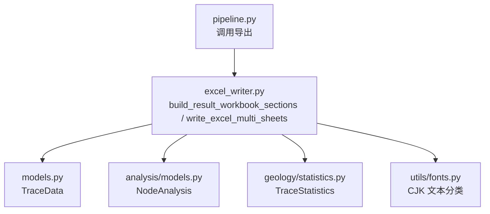
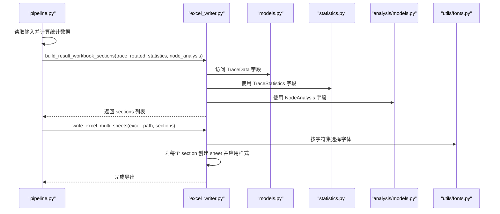
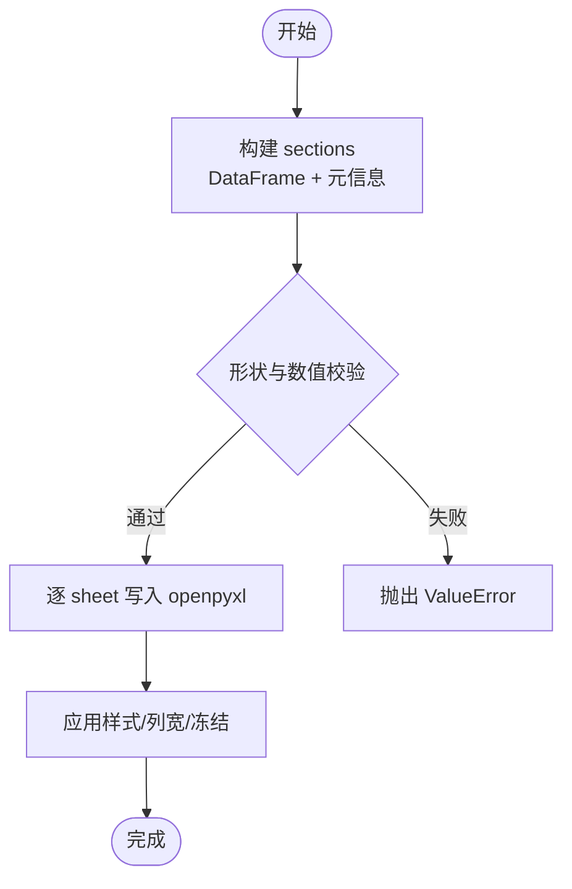
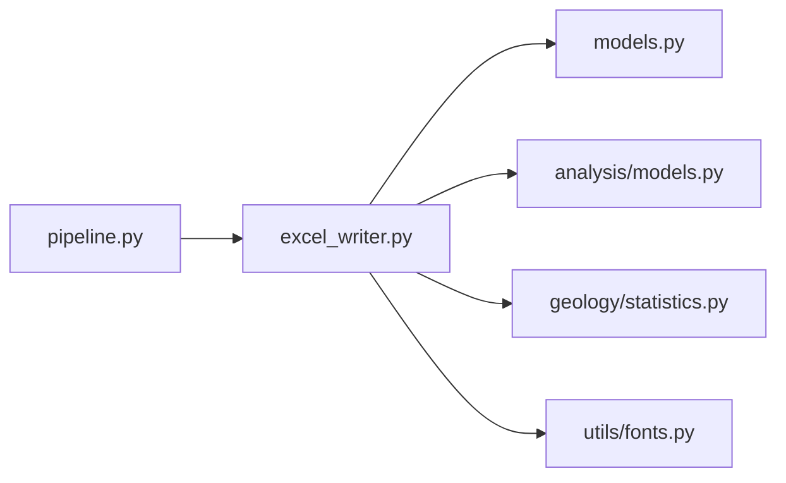

# 第四阶段：Excel 导出

<cite>
**本文引用的文件**   
- [trace_pipeline/io/excel_writer.py](file://trace_pipeline/io/excel_writer.py)
- [trace_pipeline/pipeline.py](file://trace_pipeline/pipeline.py)
- [trace_pipeline/models.py](file://trace_pipeline/models.py)
- [trace_pipeline/analysis/models.py](file://trace_pipeline/analysis/models.py)
- [trace_pipeline/geology/statistics.py](file://trace_pipeline/geology/statistics.py)
- [trace_pipeline/utils/fonts.py](file://trace_pipeline/utils/fonts.py)
- [tests/test_excel_writer.py](file://tests/test_excel_writer.py)
</cite>

## 目录
1. [简介](#简介)
2. [项目结构](#项目结构)
3. [核心组件](#核心组件)
4. [架构总览](#架构总览)
5. [详细组件分析](#详细组件分析)
6. [依赖关系分析](#依赖关系分析)
7. [性能考虑](#性能考虑)
8. [故障排查指南](#故障排查指南)
9. [结论](#结论)
10. [附录](#附录)

## 简介
本章节聚焦“多工作表 Excel 报告”的生成过程，覆盖以下要点：
- 各工作表的数据结构与格式规范（标题、表头、数据区、列宽、冻结窗格等）
- 文件路径管理与命名规则
- 自定义报告模板与扩展方法
- 数据序列化过程（从模型到 DataFrame 再到 openpyxl）
- 错误处理机制与健壮性保障

该功能由流水线在数据处理完成后自动触发，将原始端点坐标、旋转后端点坐标、走向与长度、节点统计与明细、以及可选的“基本信息/裂隙情况/计算数据”汇总信息写入一个包含多个工作表的 Excel 文件。

## 项目结构
与 Excel 导出直接相关的代码主要分布在如下模块：
- trace_pipeline/io/excel_writer.py：多工作表构建与写入的核心实现
- trace_pipeline/pipeline.py：调用 Excel 导出入口，串联数据准备与输出
- trace_pipeline/models.py：TraceData 等基础数据模型
- trace_pipeline/analysis/models.py：节点分析结果模型
- trace_pipeline/geology/statistics.py：统计指标计算结果
- trace_pipeline/utils/fonts.py：中英文字体分类工具
- tests/test_excel_writer.py：混合字体分段行为测试

图表来源
- [trace_pipeline/pipeline.py:370-388](file://trace_pipeline/pipeline.py#L370-L388)
- [trace_pipeline/io/excel_writer.py:280-331](file://trace_pipeline/io/excel_writer.py#L280-L331)
- [trace_pipeline/io/excel_writer.py:462-489](file://trace_pipeline/io/excel_writer.py#L462-L489)
- [trace_pipeline/models.py:41-156](file://trace_pipeline/models.py#L41-L156)
- [trace_pipeline/analysis/models.py:70-98](file://trace_pipeline/analysis/models.py#L70-L98)
- [trace_pipeline/geology/statistics.py:212-391](file://trace_pipeline/geology/statistics.py#L212-L391)
- [trace_pipeline/utils/fonts.py:24-42](file://trace_pipeline/utils/fonts.py#L24-L42)

章节来源
- [trace_pipeline/pipeline.py:370-388](file://trace_pipeline/pipeline.py#L370-L388)
- [trace_pipeline/io/excel_writer.py:280-331](file://trace_pipeline/io/excel_writer.py#L280-L331)
- [trace_pipeline/io/excel_writer.py:462-489](file://trace_pipeline/io/excel_writer.py#L462-L489)

## 核心组件
- ExcelSection：表示单个工作表的数据块，包含 DataFrame、起始行列、是否带表头、可选标题。
- ExcelLayout：控制布局参数（如列起始位置、列宽范围、行间距等）。
- build_result_workbook_sections：根据 TraceData、旋转坐标、统计结果与节点分析，组装多个 ExcelSection。
- write_excel_multi_sheets：遍历 sections，逐个创建 sheet，应用样式并写出文件。
- 辅助函数：_build_summary_sections（基本信息/裂隙情况/计算数据）、_build_node_sections（节点统计/明细/交点）、_style_sheet（统一样式）、_apply_cell_font（单元格字体）、_format_excel_cell_value（数值格式化）、_source_tag（数据来源标签）等。

章节来源
- [trace_pipeline/io/excel_writer.py:37-70](file://trace_pipeline/io/excel_writer.py#L37-L70)
- [trace_pipeline/io/excel_writer.py:193-273](file://trace_pipeline/io/excel_writer.py#L193-L273)
- [trace_pipeline/io/excel_writer.py:280-331](file://trace_pipeline/io/excel_writer.py#L280-L331)
- [trace_pipeline/io/excel_writer.py:334-394](file://trace_pipeline/io/excel_writer.py#L334-L394)
- [trace_pipeline/io/excel_writer.py:400-460](file://trace_pipeline/io/excel_writer.py#L400-L460)
- [trace_pipeline/io/excel_writer.py:462-489](file://trace_pipeline/io/excel_writer.py#L462-L489)

## 架构总览
下图展示了从流水线到 Excel 导出的端到端流程，包括数据准备、分区构建、样式应用与最终落盘。

图表来源
- [trace_pipeline/pipeline.py:370-388](file://trace_pipeline/pipeline.py#L370-L388)
- [trace_pipeline/io/excel_writer.py:280-331](file://trace_pipeline/io/excel_writer.py#L280-L331)
- [trace_pipeline/io/excel_writer.py:462-489](file://trace_pipeline/io/excel_writer.py#L462-L489)
- [trace_pipeline/models.py:41-156](file://trace_pipeline/models.py#L41-L156)
- [trace_pipeline/geology/statistics.py:212-391](file://trace_pipeline/geology/statistics.py#L212-L391)
- [trace_pipeline/analysis/models.py:70-98](file://trace_pipeline/analysis/models.py#L70-L98)
- [trace_pipeline/utils/fonts.py:24-42](file://trace_pipeline/utils/fonts.py#L24-L42)

## 详细组件分析

### 工作表结构与数据规范
- 汇总类工作表（可选）
  - “基本信息”：测线走向、测线长度、平均迹长、露头面积（含来源标注）
  - “裂隙情况”：迹线数量、I/II/III型裂隙数
  - “计算数据”：P10、P20、P21、有效取样窗数量；若存在校验告警则追加“校验告警”
- 数据类工作表（必选）
  - “原始端点坐标”：起点X/Y、终点X/Y
  - “旋转后端点坐标”：旋转后起点X/Y、旋转后终点X/Y
  - “走向与长度”：节理走向(°)、端点距离、测段长度(r5+r7)，当提供统计时追加“迹线类型”
- 节点相关（可选，需启用节点识别）
  - “节点统计”：节点总数、孤立端点(I)/三叉节点(Y)/交叉节点(X)、交点事件数、节点密度、合并容差、跳过退化线段数
  - “节点明细”：节点ID、X、Y、类型、拓扑值、连接迹线、事件数
  - “节点交点”：迹线A/B、交点X/Y、参数t/u、事件类型（相交/端点接触/重叠）

说明：
- 所有数值均进行有限性检查与四舍五入格式化，缺失值以“N/A”显示。
- 角度单位附加“°”，长度单位附加“m”或“m²”，面密度单位“m⁻²”。
- 部分统计项附带来源短标签，例如“(M)”、“(W)”、“(E)”、“(est)”。

章节来源
- [trace_pipeline/io/excel_writer.py:193-273](file://trace_pipeline/io/excel_writer.py#L193-L273)
- [trace_pipeline/io/excel_writer.py:280-331](file://trace_pipeline/io/excel_writer.py#L280-L331)
- [trace_pipeline/io/excel_writer.py:334-394](file://trace_pipeline/io/excel_writer.py#L334-L394)
- [trace_pipeline/io/excel_writer.py:157-169](file://trace_pipeline/io/excel_writer.py#L157-L169)
- [trace_pipeline/io/excel_writer.py:178-191](file://trace_pipeline/io/excel_writer.py#L178-L191)

### 样式与排版规范
- 标题行：若 section.title 非空，则在第1行写入合并居中标题，背景色与白字，加粗。
- 表头行：浅蓝底、居中、自动换行、加粗宋体/黑体（中文）+ Times New Roman（英文/数字）。
- 数据行：细边框、居中、宋体/黑体与 Times New Roman 混排（基于字符集分类），整数与浮点数分别设置 number_format。
- 列宽：按内容动态估算，限制在最小/最大范围内，避免过窄或过宽。
- 冻结窗格：冻结标题行与表头行，便于滚动查看。

章节来源
- [trace_pipeline/io/excel_writer.py:400-460](file://trace_pipeline/io/excel_writer.py#L400-L460)
- [trace_pipeline/io/excel_writer.py:124-148](file://trace_pipeline/io/excel_writer.py#L124-L148)
- [trace_pipeline/utils/fonts.py:24-42](file://trace_pipeline/utils/fonts.py#L24-L42)

### 文件路径管理与命名规则
- 输出目录：由配置中的 output_dir 决定，不存在则自动创建。
- 文件名：{output_prefix}_traces.xlsx
- 工作表名：section.title 作为 sheet 名称；若无标题则默认“数据”。
- 路径安全：openpyxl 引擎通过 pandas.ExcelWriter 管理上下文，确保资源释放。

章节来源
- [trace_pipeline/pipeline.py:370-388](file://trace_pipeline/pipeline.py#L370-L388)
- [trace_pipeline/io/excel_writer.py:462-489](file://trace_pipeline/io/excel_writer.py#L462-L489)

### 数据序列化过程
- 输入模型：
  - TraceData：端点坐标、走向、长度、位置等
  - TraceStatistics：各类统计量与来源标记
  - NodeAnalysis：节点与交点信息
- 中间表示：
  - 将上述模型转换为若干 pd.DataFrame，封装为 ExcelSection 列表
- 持久化：
  - 使用 openpyxl 引擎，逐 sheet 写入，随后应用样式与冻结窗格

图表来源
- [trace_pipeline/io/excel_writer.py:280-331](file://trace_pipeline/io/excel_writer.py#L280-L331)
- [trace_pipeline/io/excel_writer.py:462-489](file://trace_pipeline/io/excel_writer.py#L462-L489)

章节来源
- [trace_pipeline/models.py:41-156](file://trace_pipeline/models.py#L41-L156)
- [trace_pipeline/analysis/models.py:70-98](file://trace_pipeline/analysis/models.py#L70-L98)
- [trace_pipeline/geology/statistics.py:212-391](file://trace_pipeline/geology/statistics.py#L212-L391)
- [trace_pipeline/io/excel_writer.py:280-331](file://trace_pipeline/io/excel_writer.py#L280-L331)
- [trace_pipeline/io/excel_writer.py:462-489](file://trace_pipeline/io/excel_writer.py#L462-L489)

### 错误处理机制
- 输入校验：
  - 旋转坐标形状与原始坐标不一致 → ValueError
  - 旋转坐标包含 NaN/inf → ValueError
  - 迹线类型数量与迹线数量不一致 → ValueError
- 运行时异常：
  - 文件被占用或权限不足 → 友好提示（由上层捕获并包装）
  - 其他异常 → 记录日志并返回结构化错误信息
- 数值稳健性：
  - 对浮点数进行有限性检查与四舍五入，避免异常值污染输出

章节来源
- [trace_pipeline/io/excel_writer.py:280-331](file://trace_pipeline/io/excel_writer.py#L280-L331)
- [trace_pipeline/pipeline.py:450-474](file://trace_pipeline/pipeline.py#L450-L474)

### 自定义报告模板与扩展方法
当前实现采用“程序化模板”方式，通过 ExcelLayout 与 ExcelSection 组合来定义输出结构。可按如下方式进行扩展：
- 新增工作表
  - 在 build_result_workbook_sections 中追加新的 ExcelSection（构造 DataFrame 并指定 title/header/startrow/startcol）
  - 如需参与汇总，可在 _build_summary_sections 中添加对应条目
- 调整样式
  - 修改 _style_sheet 中的配色、对齐、边框、行高、列宽策略
  - 调整 _apply_cell_font 的字体映射与加粗/颜色逻辑
- 扩展布局参数
  - 通过 ExcelLayout 调整列起始位置、列宽上下限、行间距等
- 自定义格式化
  - 在 _format_excel_cell_value 中增加单位或精度控制
  - 在 _source_tag 中扩展来源标签映射

注意：
- 新增 section 的 title 会作为 sheet 名，请遵循 Excel 命名约束（长度、非法字符等）
- 若引入新字段，建议在 models 或 statistics 中明确其来源与含义，并在文档中更新

章节来源
- [trace_pipeline/io/excel_writer.py:48-70](file://trace_pipeline/io/excel_writer.py#L48-L70)
- [trace_pipeline/io/excel_writer.py:193-273](file://trace_pipeline/io/excel_writer.py#L193-L273)
- [trace_pipeline/io/excel_writer.py:280-331](file://trace_pipeline/io/excel_writer.py#L280-L331)
- [trace_pipeline/io/excel_writer.py:400-460](file://trace_pipeline/io/excel_writer.py#L400-L460)
- [trace_pipeline/io/excel_writer.py:157-169](file://trace_pipeline/io/excel_writer.py#L157-L169)
- [trace_pipeline/io/excel_writer.py:178-191](file://trace_pipeline/io/excel_writer.py#L178-L191)

## 依赖关系分析
- 模块耦合
  - excel_writer.py 依赖 models.py、analysis/models.py、geology/statistics.py、utils/fonts.py
  - pipeline.py 仅依赖 excel_writer.py 的公开接口，保持低耦合
- 外部依赖
  - pandas + openpyxl：用于 DataFrame 与 Excel 读写
  - numpy：数值计算与数组操作
- 潜在循环依赖
  - 当前未见循环导入；excel_writer.py 不反向依赖 pipeline.py

图表来源
- [trace_pipeline/pipeline.py:370-388](file://trace_pipeline/pipeline.py#L370-L388)
- [trace_pipeline/io/excel_writer.py:1-25](file://trace_pipeline/io/excel_writer.py#L1-L25)

章节来源
- [trace_pipeline/pipeline.py:370-388](file://trace_pipeline/pipeline.py#L370-L388)
- [trace_pipeline/io/excel_writer.py:1-25](file://trace_pipeline/io/excel_writer.py#L1-L25)

## 性能考虑
- 单遍样式应用：在写入数据的同时统计列宽，避免二次遍历整列
- 冻结窗格与批量设置：减少多次样式设置的开销
- 数值格式化：对整数与浮点数分别设置 number_format，提升渲染效率
- 内存与 I/O：使用 pandas.ExcelWriter 上下文管理器，确保资源及时释放

[本节为通用指导，无需具体文件引用]

## 故障排查指南
- 常见错误
  - 文件被占用：关闭已打开的 Excel/WPS 文件后重试
  - 输入文件不存在：检查 input_dir 与 table_stem 是否正确
  - 形状不一致：确认旋转坐标与原始坐标维度一致
  - 数值异常：检查是否存在 NaN/inf，必要时清理数据
- 定位建议
  - 查看日志中的 stage 与 duration_ms，定位耗时环节
  - 核对 section.title 是否符合 Excel 工作表命名规则
  - 验证 fonts 是否可用（尤其是混合字体场景）

章节来源
- [trace_pipeline/pipeline.py:450-474](file://trace_pipeline/pipeline.py#L450-L474)
- [tests/test_excel_writer.py:14-50](file://tests/test_excel_writer.py#L14-L50)

## 结论
多工作表 Excel 导出通过“模型→DataFrame→sections→openpyxl”的清晰链路实现，具备完善的样式规范、路径管理与错误处理机制。借助 ExcelLayout 与 ExcelSection 的组合，可灵活扩展新的工作表与样式，满足多样化报告需求。

[本节为总结性内容，无需具体文件引用]

## 附录

### 关键数据结构与复杂度
- ExcelSection：O(1) 构造，存储 DataFrame 与元信息
- ExcelLayout：常量级配置，影响列宽与布局
- build_result_workbook_sections：线性于数据规模（N 条迹线），主要开销在 DataFrame 构建
- write_excel_multi_sheets：线性于 sections 数量与每 sheet 行数，样式应用为 O(R×C)

章节来源
- [trace_pipeline/io/excel_writer.py:37-70](file://trace_pipeline/io/excel_writer.py#L37-L70)
- [trace_pipeline/io/excel_writer.py:280-331](file://trace_pipeline/io/excel_writer.py#L280-L331)
- [trace_pipeline/io/excel_writer.py:462-489](file://trace_pipeline/io/excel_writer.py#L462-L489)