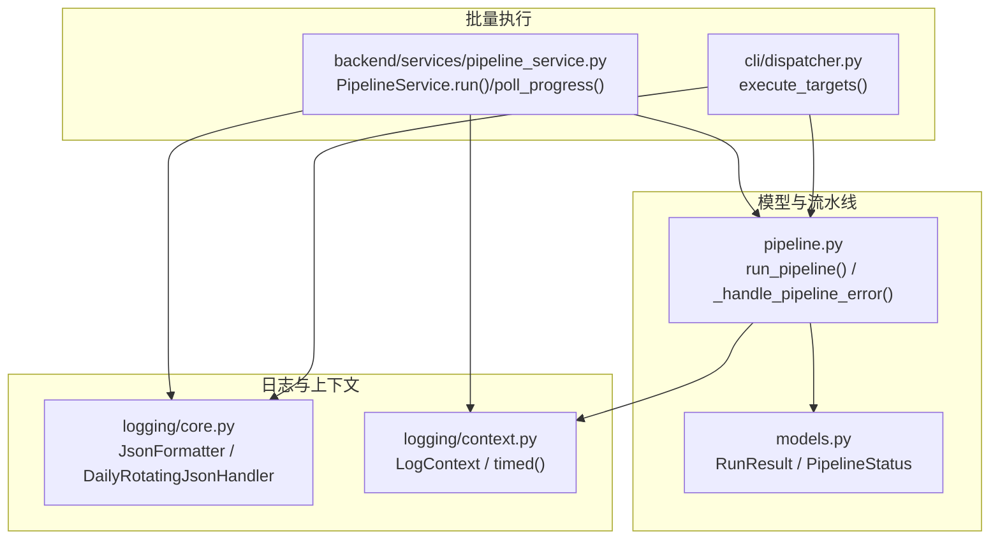
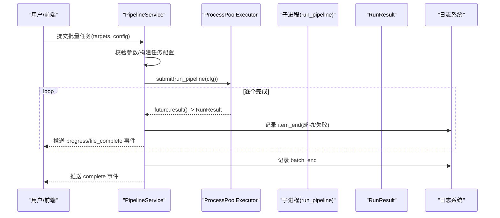
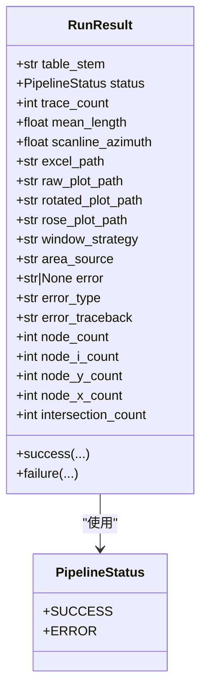
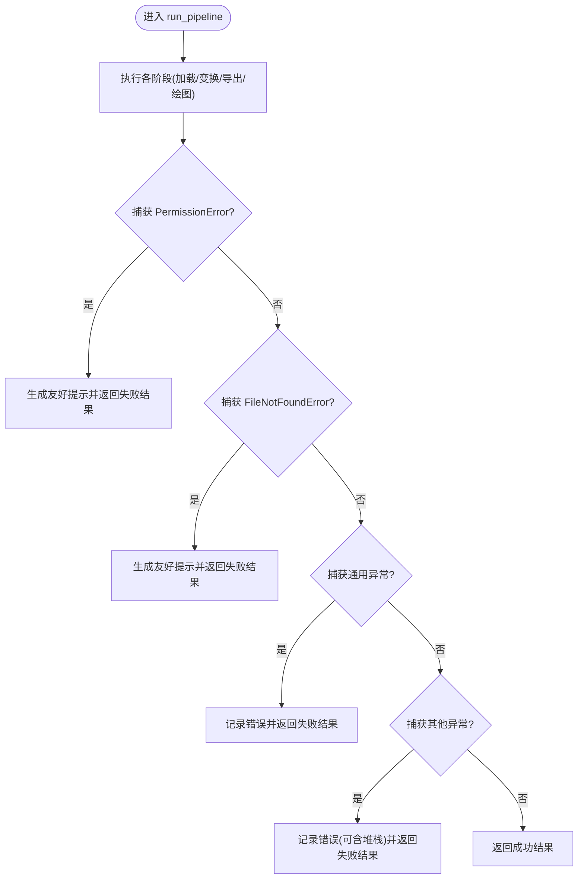
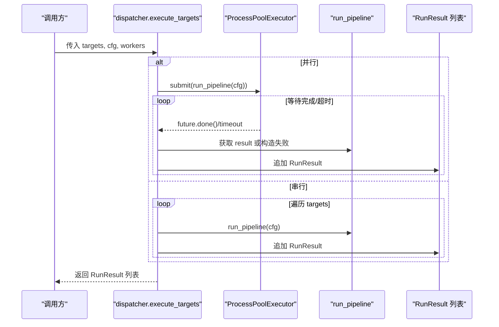
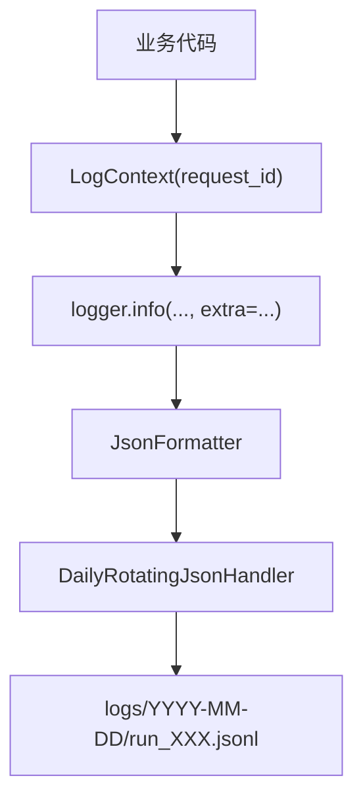
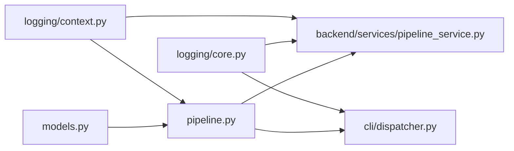

# 结果处理与错误管理

<cite>
**本文引用的文件**   
- [trace_pipeline/models.py](file://trace_pipeline/models.py)
- [trace_pipeline/pipeline.py](file://trace_pipeline/pipeline.py)
- [backend/services/pipeline_service.py](file://backend/services/pipeline_service.py)
- [trace_pipeline/cli/dispatcher.py](file://trace_pipeline/cli/dispatcher.py)
- [trace_pipeline/logging/core.py](file://trace_pipeline/logging/core.py)
- [trace_pipeline/logging/context.py](file://trace_pipeline/logging/context.py)
</cite>

## 目录
1. [简介](#简介)
2. [项目结构](#项目结构)
3. [核心组件](#核心组件)
4. [架构总览](#架构总览)
5. [详细组件分析](#详细组件分析)
6. [依赖关系分析](#依赖关系分析)
7. [性能考量](#性能考量)
8. [故障排查指南](#故障排查指南)
9. [结论](#结论)
10. [附录](#附录)

## 简介
本指南聚焦于 TracePipeline 的结果处理与错误管理机制，围绕 RunResult 对象的结构与访问方式、成功/失败状态语义、统一异常处理与友好错误消息生成、批量处理时的结果聚合与进度监控，以及调试技巧与日志分析最佳实践展开。读者无需深入源码即可理解如何消费结果、如何定位问题以及如何优化批处理体验。

## 项目结构
与“结果处理与错误管理”直接相关的代码主要分布在以下模块：
- 数据模型与结果对象：models.py
- 单目标流水线编排与异常归一化：pipeline.py
- 后台服务（线程+进程池）的批量执行与进度推送：backend/services/pipeline_service.py
- CLI 端的目标决策与串/并行调度：trace_pipeline/cli/dispatcher.py
- 日志系统与上下文传播：logging/core.py、logging/context.py

图表来源
- [trace_pipeline/models.py:278-351](file://trace_pipeline/models.py#L278-L351)
- [trace_pipeline/pipeline.py:98-129](file://trace_pipeline/pipeline.py#L98-L129)
- [backend/services/pipeline_service.py:32-95](file://backend/services/pipeline_service.py#L32-L95)
- [trace_pipeline/cli/dispatcher.py:103-228](file://trace_pipeline/cli/dispatcher.py#L103-L228)
- [trace_pipeline/logging/core.py:44-146](file://trace_pipeline/logging/core.py#L44-L146)
- [trace_pipeline/logging/context.py:27-56](file://trace_pipeline/logging/context.py#L27-L56)

章节来源
- [trace_pipeline/models.py:278-351](file://trace_pipeline/models.py#L278-L351)
- [trace_pipeline/pipeline.py:98-129](file://trace_pipeline/pipeline.py#L98-L129)
- [backend/services/pipeline_service.py:32-95](file://backend/services/pipeline_service.py#L32-L95)
- [trace_pipeline/cli/dispatcher.py:103-228](file://trace_pipeline/cli/dispatcher.py#L103-L228)
- [trace_pipeline/logging/core.py:44-146](file://trace_pipeline/logging/core.py#L44-L146)
- [trace_pipeline/logging/context.py:27-56](file://trace_pipeline/logging/context.py#L27-L56)

## 核心组件
- RunResult：不可变的数据类，封装单次运行结果。包含成功/失败状态、统计指标、输出路径、节点识别摘要、错误信息字段等。提供 success/failure 工厂方法以构造明确语义的对象。
- PipelineStatus：枚举类型，表示 SUCCESS 或 ERROR，避免字符串字面量拼写错误。
- run_pipeline：单目标全流程编排函数，内部对常见异常进行捕获并转换为 RunResult.failure；同时记录结构化日志与耗时。
- PipelineService：后台服务，负责将多个目标提交到进程池执行，收集每个目标的 RunResult，并通过队列向轮询的前端推送进度与完成事件。
- dispatcher.execute_targets：CLI 侧的批量执行器，支持串行与并行两种模式，统一返回 RunResult 列表，并对超时任务进行处理。
- 日志系统：JsonFormatter 输出 JSON Lines；DailyRotatingJsonHandler 按天归档与分片；LogContext 提供 request_id 上下文传播；timed/timed_ctx 提供计时与异常上报。

章节来源
- [trace_pipeline/models.py:278-351](file://trace_pipeline/models.py#L278-L351)
- [trace_pipeline/pipeline.py:230-474](file://trace_pipeline/pipeline.py#L230-L474)
- [backend/services/pipeline_service.py:32-95](file://backend/services/pipeline_service.py#L32-L95)
- [trace_pipeline/cli/dispatcher.py:103-228](file://trace_pipeline/cli/dispatcher.py#L103-L228)
- [trace_pipeline/logging/core.py:44-146](file://trace_pipeline/logging/core.py#L44-L146)
- [trace_pipeline/logging/context.py:27-56](file://trace_pipeline/logging/context.py#L27-L56)

## 架构总览
下图展示了从批量入口到单目标执行、再到结果聚合与日志落盘的完整流程。

图表来源
- [backend/services/pipeline_service.py:100-346](file://backend/services/pipeline_service.py#L100-L346)
- [trace_pipeline/pipeline.py:230-474](file://trace_pipeline/pipeline.py#L230-L474)
- [trace_pipeline/logging/core.py:326-398](file://trace_pipeline/logging/core.py#L326-L398)

## 详细组件分析

### RunResult 结构与属性访问
- 状态与语义
  - status 为 PipelineStatus.SUCCESS 表示成功；ERROR 表示失败。
  - 成功时，trace_count、mean_length、scanline_azimuth、excel_path、raw_plot_path、rotated_plot_path、rose_plot_path、window_strategy、area_source 等字段反映处理产出与统计。
  - 失败时，error、error_type、error_traceback 描述错误原因与堆栈（可选）。
- 构造方式
  - 使用 RunResult.success(...) 构造成功结果，便于显式传递各产出字段。
  - 使用 RunResult.failure(table_stem, error, error_type="", error_traceback="") 构造失败结果。
- 典型访问模式
  - 判断状态：result.status is PipelineStatus.SUCCESS
  - 读取统计：result.trace_count、result.mean_length、result.scanline_azimuth
  - 读取产物路径：result.excel_path、result.raw_plot_path、result.rotated_plot_path、result.rose_plot_path
  - 读取错误信息：result.error、result.error_type、result.error_traceback
  - 节点识别摘要：result.node_count、result.node_i_count、result.node_y_count、result.node_x_count、result.intersection_count

图表来源
- [trace_pipeline/models.py:23-35](file://trace_pipeline/models.py#L23-L35)
- [trace_pipeline/models.py:278-351](file://trace_pipeline/models.py#L278-L351)

章节来源
- [trace_pipeline/models.py:278-351](file://trace_pipeline/models.py#L278-L351)

### 统一异常处理与友好错误消息
- 统一入口
  - pipeline._handle_pipeline_error 负责将异常转换为 RunResult.failure，记录错误日志，并可附带 traceback。
- 分类处理
  - PermissionError：提示文件被占用或权限不足，建议关闭 Excel/WPS 后重试。
  - FileNotFoundError：提示输入文件不存在，检查路径。
  - ValueError/KeyError/TypeError/IndexError/OSError：通用业务/IO 错误。
  - MemoryError/KeyboardInterrupt：不吞没，向上传播。
  - 其他 Exception：兜底捕获，必要时携带 traceback。
- 友好消息策略
  - 在关键异常处提供面向用户的提示文本（friendly），并在日志中保留原始异常信息以便排障。

图表来源
- [trace_pipeline/pipeline.py:98-129](file://trace_pipeline/pipeline.py#L98-L129)
- [trace_pipeline/pipeline.py:450-474](file://trace_pipeline/pipeline.py#L450-L474)

章节来源
- [trace_pipeline/pipeline.py:98-129](file://trace_pipeline/pipeline.py#L98-L129)
- [trace_pipeline/pipeline.py:450-474](file://trace_pipeline/pipeline.py#L450-L474)

### 批量处理：结果聚合与进度监控
- 后台服务（GUI/后端）
  - PipelineService.run 启动后台线程，非阻塞返回。
  - 通过 ProcessPoolExecutor 并行提交 run_pipeline 任务，使用 as_completed 逐个获取结果。
  - 每完成一个目标，推送 progress 与 file_complete 事件，包含当前进度、文件名、消息与结果字典。
  - 支持优雅关闭：设置 shutdown_event 停止剩余任务，等待线程完成。
- CLI 调度器
  - execute_targets 根据目标数量自动选择串行或并行；并行模式下使用 wait 与超时控制，对超时任务取消并终止对应 worker 进程，防止资源泄漏。
  - 无论串行还是并行，最终均返回 RunResult 列表，供上层聚合展示。

图表来源
- [trace_pipeline/cli/dispatcher.py:103-228](file://trace_pipeline/cli/dispatcher.py#L103-L228)
- [trace_pipeline/pipeline.py:230-474](file://trace_pipeline/pipeline.py#L230-L474)

章节来源
- [backend/services/pipeline_service.py:100-346](file://backend/services/pipeline_service.py#L100-L346)
- [trace_pipeline/cli/dispatcher.py:103-228](file://trace_pipeline/cli/dispatcher.py#L103-L228)

### 日志系统与上下文传播
- JsonFormatter：将 LogRecord 序列化为 JSON 行，包含时间戳、级别、模块、函数名、行号、消息、request_id、exc_info 与 extra 扩展字段。
- DailyRotatingJsonHandler：按天目录存储 JSONL，自动打包旧日目录为 zip，清理过期归档；支持按大小分片。
- setup_logging/setup_worker_logging：主进程与子进程分别初始化日志，确保并发安全与独立输出。
- LogContext：基于 contextvars 的 request_id 传播，便于跨层追踪。
- timed/timed_ctx：装饰器或上下文管理器，自动记录耗时与异常。

图表来源
- [trace_pipeline/logging/core.py:44-146](file://trace_pipeline/logging/core.py#L44-L146)
- [trace_pipeline/logging/core.py:326-398](file://trace_pipeline/logging/core.py#L326-L398)
- [trace_pipeline/logging/context.py:27-56](file://trace_pipeline/logging/context.py#L27-L56)

章节来源
- [trace_pipeline/logging/core.py:44-146](file://trace_pipeline/logging/core.py#L44-L146)
- [trace_pipeline/logging/core.py:326-398](file://trace_pipeline/logging/core.py#L326-L398)
- [trace_pipeline/logging/context.py:27-56](file://trace_pipeline/logging/context.py#L27-L56)

## 依赖关系分析
- models.py 提供 RunResult 与 PipelineStatus，被 pipeline.py、backend/services/pipeline_service.py、cli/dispatcher.py 共同引用。
- pipeline.py 作为单目标执行核心，向上游暴露 run_pipeline，向下依赖 IO、几何计算、绘图与日志。
- backend/services/pipeline_service.py 与 cli/dispatcher.py 负责批量调度，前者面向 GUI/后端轮询，后者面向 CLI 终端。
- logging 子系统贯穿所有层级，用于结构化记录与可观测性。

图表来源
- [trace_pipeline/models.py:278-351](file://trace_pipeline/models.py#L278-L351)
- [trace_pipeline/pipeline.py:230-474](file://trace_pipeline/pipeline.py#L230-L474)
- [backend/services/pipeline_service.py:100-346](file://backend/services/pipeline_service.py#L100-L346)
- [trace_pipeline/cli/dispatcher.py:103-228](file://trace_pipeline/cli/dispatcher.py#L103-L228)
- [trace_pipeline/logging/core.py:326-398](file://trace_pipeline/logging/core.py#L326-L398)
- [trace_pipeline/logging/context.py:27-56](file://trace_pipeline/logging/context.py#L27-L56)

章节来源
- [trace_pipeline/models.py:278-351](file://trace_pipeline/models.py#L278-L351)
- [trace_pipeline/pipeline.py:230-474](file://trace_pipeline/pipeline.py#L230-L474)
- [backend/services/pipeline_service.py:100-346](file://backend/services/pipeline_service.py#L100-L346)
- [trace_pipeline/cli/dispatcher.py:103-228](file://trace_pipeline/cli/dispatcher.py#L103-L228)
- [trace_pipeline/logging/core.py:326-398](file://trace_pipeline/logging/core.py#L326-L398)
- [trace_pipeline/logging/context.py:27-56](file://trace_pipeline/logging/context.py#L27-L56)

## 性能考量
- 并行度选择
  - CLI 侧在小目标数场景下自动回退串行，避免 spawn 开销；大目标数启用并行，结合超时控制与孤儿进程回收。
  - 后台服务根据 CPU 核心数与请求并行度裁剪实际工作进程数。
- 日志写入
  - JSONL 按天归档与分片，避免单文件过大；子进程独立日志文件，减少竞争。
- 内存与中断
  - MemoryError 与 KeyboardInterrupt 不被吞没，保证关键异常及时上抛，避免静默失败。

[本节为通用指导，不直接分析具体文件]

## 故障排查指南
- 快速定位
  - 查看 logs/YYYY-MM-DD/run_*.jsonl，过滤 stage=pipeline_error 或 item_end 且 error_type 不为空的事件。
  - 使用 request_id 关联一次处理的完整链路（batch_start → pipeline_start → item_end → batch_end）。
- 常见问题
  - 文件被占用：PermissionError 会给出友好提示，关闭 Excel/WPS 后重试。
  - 输入缺失：FileNotFoundError 提示检查路径。
  - 超时：CLI 并行模式会对长时间运行的任务进行超时判定并终止对应 worker。
- 调试技巧
  - 使用 LogContext 包裹关键作用域，确保 request_id 贯穿日志。
  - 使用 timed/timed_ctx 标注热点函数，观察 duration_ms 与异常信息。
  - 在批量场景中关注 file_complete 事件中的 result 字段，快速区分成功与失败项。

章节来源
- [trace_pipeline/pipeline.py:98-129](file://trace_pipeline/pipeline.py#L98-L129)
- [trace_pipeline/pipeline.py:450-474](file://trace_pipeline/pipeline.py#L450-L474)
- [trace_pipeline/cli/dispatcher.py:103-228](file://trace_pipeline/cli/dispatcher.py#L103-L228)
- [backend/services/pipeline_service.py:100-346](file://backend/services/pipeline_service.py#L100-L346)
- [trace_pipeline/logging/core.py:44-146](file://trace_pipeline/logging/core.py#L44-L146)
- [trace_pipeline/logging/context.py:27-56](file://trace_pipeline/logging/context.py#L27-L56)

## 结论
TracePipeline 通过不可变的 RunResult 与明确的 PipelineStatus 实现了清晰的结果契约；在 pipeline 层集中处理异常并生成友好错误消息；在批量层面，后台服务与 CLI 调度器分别提供了轮询进度与超时控制的实现；配合 JSONL 日志与上下文传播，形成了端到端的可观测性与可维护性。遵循本文的实践，可在复杂批处理场景下稳定地消费结果、快速定位问题并持续优化性能。

## 附录
- 常用字段速查
  - 成功相关：trace_count、mean_length、scanline_azimuth、excel_path、raw_plot_path、rotated_plot_path、rose_plot_path、window_strategy、area_source
  - 节点识别：node_count、node_i_count、node_y_count、node_x_count、intersection_count
  - 错误相关：error、error_type、error_traceback
- 推荐用法
  - 始终通过 RunResult.success/failure 构造结果，避免手动拼装导致字段遗漏。
  - 在批量循环中对每个 RunResult 先判 status，再按需读取产物路径或错误信息。
  - 在关键路径使用 LogContext 与 timed/timed_ctx，提升可观测性。

[本节为补充说明，不直接分析具体文件]