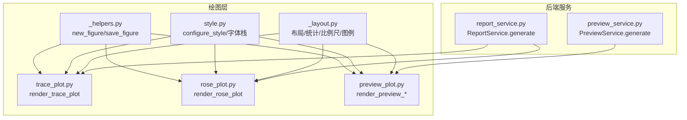
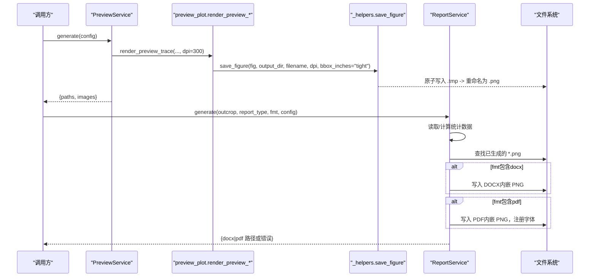
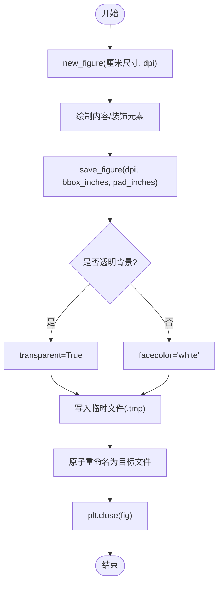
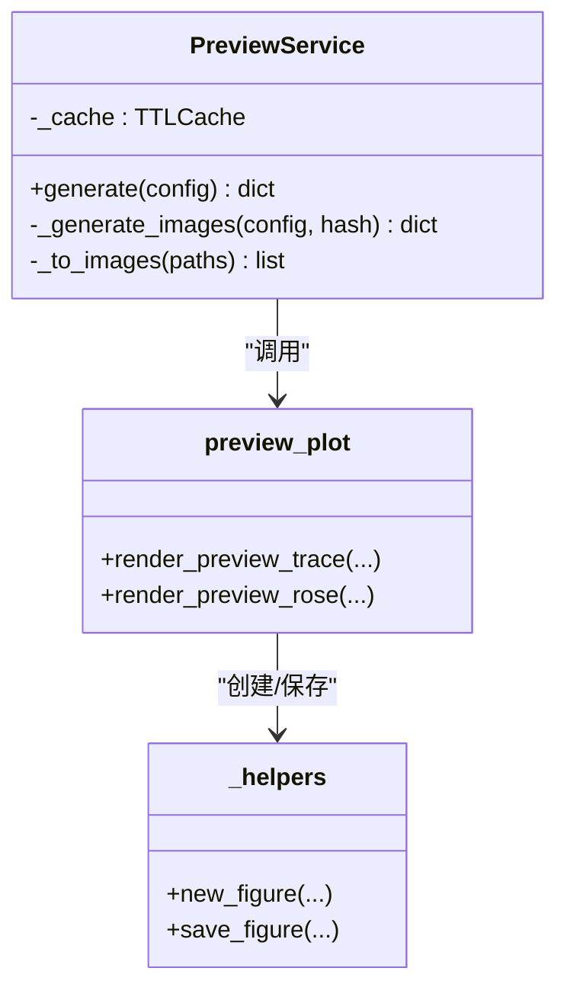
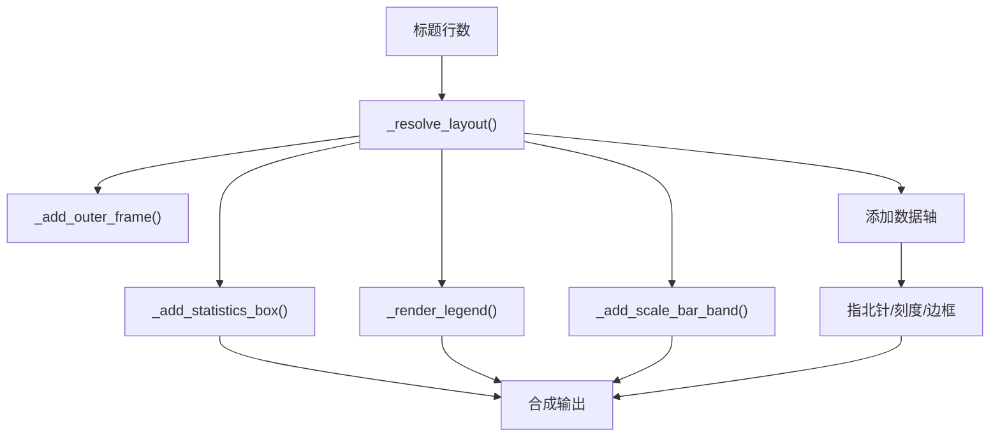
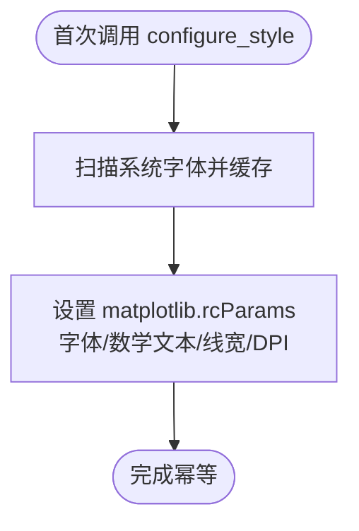
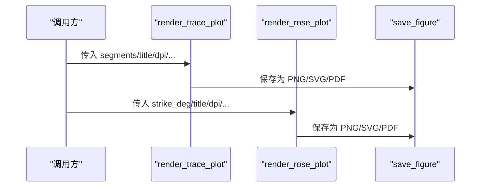
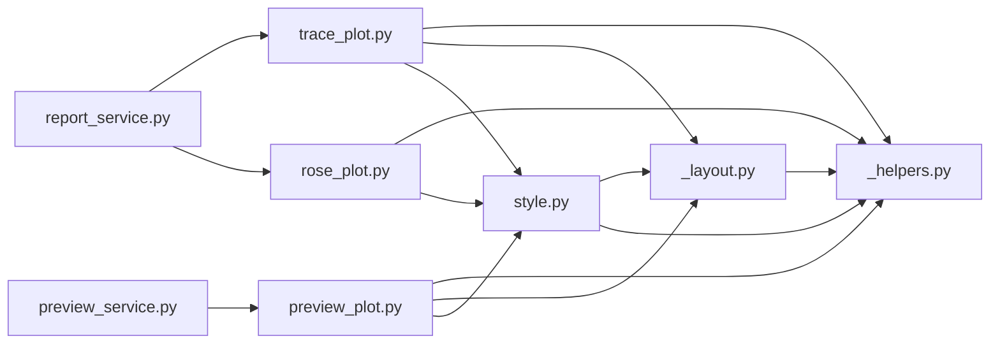

# 图表导出与格式

<cite>
**本文引用的文件**
- [trace_pipeline/plotting/_helpers.py](file://trace_pipeline/plotting/_helpers.py)
- [trace_pipeline/plotting/style.py](file://trace_pipeline/plotting/style.py)
- [trace_pipeline/plotting/_layout.py](file://trace_pipeline/plotting/_layout.py)
- [trace_pipeline/plotting/trace_plot.py](file://trace_pipeline/plotting/trace_plot.py)
- [trace_pipeline/plotting/rose_plot.py](file://trace_pipeline/plotting/rose_plot.py)
- [trace_pipeline/plotting/preview_plot.py](file://trace_pipeline/plotting/preview_plot.py)
- [backend/services/preview_service.py](file://backend/services/preview_service.py)
- [backend/services/report_service.py](file://backend/services/report_service.py)
</cite>

## 目录
1. [简介](#简介)
2. [项目结构](#项目结构)
3. [核心组件](#核心组件)
4. [架构总览](#架构总览)
5. [详细组件分析](#详细组件分析)
6. [依赖关系分析](#依赖关系分析)
7. [性能考虑](#性能考虑)
8. [故障排查指南](#故障排查指南)
9. [结论](#结论)
10. [附录：出版级配置示例](#附录出版级配置示例)

## 简介
本指南聚焦于“图表导出与格式”，覆盖以下目标：
- 不同输出格式的保存方法（PNG、PDF、SVG 等矢量格式的高质量导出）
- 预览图的生成机制与交互式查看流程
- 多子图布局配置与批量图表排列方法
- 出版级图表输出的完整配置示例（DPI、边距、字体嵌入等）
- 自动化报告生成中的图表集成最佳实践

## 项目结构
与导出和格式相关的关键模块分布如下：
- 绘图通用辅助：Figure 创建、保存、指北针绘制、数据范围计算
- 样式与字体：全局样式、CJK 字体回退、数学文本字体、论文风格默认值
- 布局工具：外框、统计框、比例尺带、自适应图例、节点样式预设
- 迹线图与玫瑰图：渲染入口、图层叠加、尺寸自适应
- 预览服务：基于演示数据的样式预览，支持缓存
- 报告服务：将已生成的 PNG 图片插入 DOCX/PDF 报告，并处理字体

**图示来源**
- [trace_pipeline/plotting/_helpers.py:26-93](file://trace_pipeline/plotting/_helpers.py#L26-L93)
- [trace_pipeline/plotting/style.py:187-255](file://trace_pipeline/plotting/style.py#L187-L255)
- [trace_pipeline/plotting/_layout.py:362-420](file://trace_pipeline/plotting/_layout.py#L362-L420)
- [trace_pipeline/plotting/trace_plot.py:443-564](file://trace_pipeline/plotting/trace_plot.py#L443-L564)
- [trace_pipeline/plotting/rose_plot.py:106-139](file://trace_pipeline/plotting/rose_plot.py#L106-L139)
- [trace_pipeline/plotting/preview_plot.py:285-491](file://trace_pipeline/plotting/preview_plot.py#L285-L491)
- [backend/services/preview_service.py:45-166](file://backend/services/preview_service.py#L45-L166)
- [backend/services/report_service.py:245-364](file://backend/services/report_service.py#L245-L364)

**章节来源**
- [trace_pipeline/plotting/_helpers.py:26-93](file://trace_pipeline/plotting/_helpers.py#L26-L93)
- [trace_pipeline/plotting/style.py:187-255](file://trace_pipeline/plotting/style.py#L187-L255)
- [trace_pipeline/plotting/_layout.py:362-420](file://trace_pipeline/plotting/_layout.py#L362-L420)
- [trace_pipeline/plotting/trace_plot.py:443-564](file://trace_pipeline/plotting/trace_plot.py#L443-L564)
- [trace_pipeline/plotting/rose_plot.py:106-139](file://trace_pipeline/plotting/rose_plot.py#L106-L139)
- [trace_pipeline/plotting/preview_plot.py:285-491](file://trace_pipeline/plotting/preview_plot.py#L285-L491)
- [backend/services/preview_service.py:45-166](file://backend/services/preview_service.py#L45-L166)
- [backend/services/report_service.py:245-364](file://backend/services/report_service.py#L245-L364)

## 核心组件
- 图形创建与保存
  - new_figure：以厘米为单位创建 Figure，设置 DPI 与白色背景
  - save_figure：原子写入（先写临时文件再重命名），自动关闭 Figure，支持透明背景
- 样式与字体
  - configure_style：统一 CJK 字体栈、数学文本字体、论文风格默认值（含 DPI、线宽、字号等）
  - heading_font_kwargs/body_font_kwargs：标题与正文字体族参数生成
- 布局与装饰
  - _resolve_layout：根据标题行数解析各轴位置
  - _add_outer_frame/_blank_panel_axes：外框与空白面板
  - _add_statistics_box/_render_legend/_add_scale_bar_band：统计框、自适应图例、比例尺带
  - _resolve_node_style：节点标记样式预设
- 迹线图与玫瑰图
  - render_trace_plot：迹线长度图渲染，支持图层开关、背景色控制、自适应尺寸
  - render_rose_plot：走向玫瑰花瓣图渲染，极坐标轴样式与网格
- 预览服务
  - PreviewService.generate：使用演示数据生成原始/旋转迹线图与玫瑰图，TTL 缓存
- 报告服务
  - ReportService.generate：加载数据与统计，生成 DOCX/PDF，内嵌 PNG 图片，跨平台字体注册

**章节来源**
- [trace_pipeline/plotting/_helpers.py:26-93](file://trace_pipeline/plotting/_helpers.py#L26-L93)
- [trace_pipeline/plotting/style.py:187-255](file://trace_pipeline/plotting/style.py#L187-L255)
- [trace_pipeline/plotting/_layout.py:362-420](file://trace_pipeline/plotting/_layout.py#L362-L420)
- [trace_pipeline/plotting/trace_plot.py:443-564](file://trace_pipeline/plotting/trace_plot.py#L443-L564)
- [trace_pipeline/plotting/rose_plot.py:106-139](file://trace_pipeline/plotting/rose_plot.py#L106-L139)
- [backend/services/preview_service.py:45-166](file://backend/services/preview_service.py#L45-L166)
- [backend/services/report_service.py:245-364](file://backend/services/report_service.py#L245-L364)

## 架构总览
下图展示了从调用方到最终导出的关键路径，包括预览与报告两条主线。

**图示来源**
- [backend/services/preview_service.py:45-166](file://backend/services/preview_service.py#L45-L166)
- [trace_pipeline/plotting/preview_plot.py:285-491](file://trace_pipeline/plotting/preview_plot.py#L285-L491)
- [trace_pipeline/plotting/_helpers.py:42-93](file://trace_pipeline/plotting/_helpers.py#L42-L93)
- [backend/services/report_service.py:245-364](file://backend/services/report_service.py#L245-L364)

## 详细组件分析

### 导出与保存（PNG/SVG/PDF）
- PNG 高质量导出
  - 通过 save_figure 的 dpi、bbox_inches、pad_inches 控制分辨率与裁剪
  - 支持透明背景（当 figure 背景 alpha==0.0 时自动启用 transparent）
- SVG 矢量导出
  - 使用 save_figure 并将 filename 后缀设为 .svg；matplotlib 会按矢量格式保存
  - 建议同时提高 dpi 以获得更清晰的栅格化后备效果（如某些阅读器）
- PDF 矢量导出
  - 使用 save_figure 并将 filename 后缀设为 .pdf；适合直接嵌入报告
  - 注意中文字体在 PDF 中的显示问题，建议使用系统字体或嵌入字体（见报告服务）

**图示来源**
- [trace_pipeline/plotting/_helpers.py:26-93](file://trace_pipeline/plotting/_helpers.py#L26-L93)

**章节来源**
- [trace_pipeline/plotting/_helpers.py:42-93](file://trace_pipeline/plotting/_helpers.py#L42-L93)

### 预览图生成与交互查看
- 预览数据完全解耦：使用硬编码演示数据，不依赖业务逻辑
- 生成三张预览：原始迹线图、旋转迹线图、走向玫瑰图
- 缓存策略：基于 style + overlay 状态哈希的 TTL 缓存，避免重复生成
- 交互查看：前端可轮询预览路径并在模态框中打开图片进行缩放/平移

**图示来源**
- [backend/services/preview_service.py:37-166](file://backend/services/preview_service.py#L37-L166)
- [trace_pipeline/plotting/preview_plot.py:285-491](file://trace_pipeline/plotting/preview_plot.py#L285-L491)
- [trace_pipeline/plotting/_helpers.py:26-93](file://trace_pipeline/plotting/_helpers.py#L26-L93)

**章节来源**
- [backend/services/preview_service.py:45-166](file://backend/services/preview_service.py#L45-L166)
- [trace_pipeline/plotting/preview_plot.py:285-491](file://trace_pipeline/plotting/preview_plot.py#L285-L491)

### 多子图布局与批量排列
- 单图内部布局：外框、数据区、统计框、图例、比例尺带
  - _resolve_layout 根据标题行数动态调整顶部空间
  - _add_outer_frame 绘制全幅外框，_blank_panel_axes 创建空白面板
  - _add_statistics_box 半透明背景统计信息框，自适应字号
  - _render_legend 自适应高度图例，支持多种条目类型
  - _add_scale_bar_band 独立比例尺带，单位自动 m/cm 切换
- 批量排列
  - 迹线图支持 include_* 开关，便于分层导出（仅迹线/仅凸包/仅圆窗/仅节点）
  - 报告服务将多个 PNG 按顺序插入文档，形成批量展示

**图示来源**
- [trace_pipeline/plotting/_layout.py:362-420](file://trace_pipeline/plotting/_layout.py#L362-L420)
- [trace_pipeline/plotting/_layout.py:447-569](file://trace_pipeline/plotting/_layout.py#L447-L569)
- [trace_pipeline/plotting/_layout.py:623-642](file://trace_pipeline/plotting/_layout.py#L623-L642)
- [trace_pipeline/plotting/trace_plot.py:507-564](file://trace_pipeline/plotting/trace_plot.py#L507-L564)

**章节来源**
- [trace_pipeline/plotting/_layout.py:362-420](file://trace_pipeline/plotting/_layout.py#L362-L420)
- [trace_pipeline/plotting/_layout.py:447-569](file://trace_pipeline/plotting/_layout.py#L447-L569)
- [trace_pipeline/plotting/_layout.py:623-642](file://trace_pipeline/plotting/_layout.py#L623-L642)
- [trace_pipeline/plotting/trace_plot.py:507-564](file://trace_pipeline/plotting/trace_plot.py#L507-L564)

### 样式与字体（出版级基础）
- configure_style 设置：
  - 字体栈：优先 Times New Roman 与宋体，提供多种 CJK 回退
  - 数学文本字体：自定义 mathtext 字体集，保证单位与上标一致
  - 论文风格默认值：字号、线宽、刻度大小、DPI、保存背景等
- 标题与正文字体参数：
  - heading_font_kwargs / body_font_kwargs 返回 fontfamily 列表，避免 bold 缺失导致的警告

**图示来源**
- [trace_pipeline/plotting/style.py:187-255](file://trace_pipeline/plotting/style.py#L187-L255)

**章节来源**
- [trace_pipeline/plotting/style.py:187-255](file://trace_pipeline/plotting/style.py#L187-L255)

### 迹线图与玫瑰图导出
- 迹线图
  - render_trace_plot：支持图层开关、背景透明、自适应 figsize、装饰元素
  - 通过 save_figure 输出 PNG/SVG/PDF
- 玫瑰图
  - render_rose_plot：极坐标柱状图，网格与边框样式，标题与字体
  - 同样通过 save_figure 输出多格式

**图示来源**
- [trace_pipeline/plotting/trace_plot.py:443-564](file://trace_pipeline/plotting/trace_plot.py#L443-L564)
- [trace_pipeline/plotting/rose_plot.py:106-139](file://trace_pipeline/plotting/rose_plot.py#L106-L139)
- [trace_pipeline/plotting/_helpers.py:42-93](file://trace_pipeline/plotting/_helpers.py#L42-L93)

**章节来源**
- [trace_pipeline/plotting/trace_plot.py:443-564](file://trace_pipeline/plotting/trace_plot.py#L443-L564)
- [trace_pipeline/plotting/rose_plot.py:106-139](file://trace_pipeline/plotting/rose_plot.py#L106-L139)

## 依赖关系分析
- 低耦合设计
  - 预览模块与正式绘图程序解耦，仅共享布局与样式工具
  - 报告服务只消费已生成的 PNG，不直接参与绘图
- 关键依赖链
  - trace_plot/rose_plot/preview_plot 均依赖 _helpers 与 style/_layout
  - preview_service 依赖 preview_plot 与 TTL 缓存
  - report_service 依赖 PIL、python-docx、reportlab（可选）

**图示来源**
- [trace_pipeline/plotting/style.py:187-255](file://trace_pipeline/plotting/style.py#L187-L255)
- [trace_pipeline/plotting/_layout.py:362-420](file://trace_pipeline/plotting/_layout.py#L362-L420)
- [trace_pipeline/plotting/_helpers.py:26-93](file://trace_pipeline/plotting/_helpers.py#L26-L93)
- [trace_pipeline/plotting/trace_plot.py:443-564](file://trace_pipeline/plotting/trace_plot.py#L443-L564)
- [trace_pipeline/plotting/rose_plot.py:106-139](file://trace_pipeline/plotting/rose_plot.py#L106-L139)
- [trace_pipeline/plotting/preview_plot.py:285-491](file://trace_pipeline/plotting/preview_plot.py#L285-L491)
- [backend/services/preview_service.py:45-166](file://backend/services/preview_service.py#L45-L166)
- [backend/services/report_service.py:245-364](file://backend/services/report_service.py#L245-L364)

**章节来源**
- [trace_pipeline/plotting/style.py:187-255](file://trace_pipeline/plotting/style.py#L187-L255)
- [trace_pipeline/plotting/_layout.py:362-420](file://trace_pipeline/plotting/_layout.py#L362-L420)
- [trace_pipeline/plotting/_helpers.py:26-93](file://trace_pipeline/plotting/_helpers.py#L26-L93)
- [trace_pipeline/plotting/trace_plot.py:443-564](file://trace_pipeline/plotting/trace_plot.py#L443-L564)
- [trace_pipeline/plotting/rose_plot.py:106-139](file://trace_pipeline/plotting/rose_plot.py#L106-L139)
- [trace_pipeline/plotting/preview_plot.py:285-491](file://trace_pipeline/plotting/preview_plot.py#L285-L491)
- [backend/services/preview_service.py:45-166](file://backend/services/preview_service.py#L45-L166)
- [backend/services/report_service.py:245-364](file://backend/services/report_service.py#L245-L364)

## 性能考虑
- 原子写入与资源释放
  - save_figure 采用临时文件+重命名，避免中断导致损坏文件
  - 保存后主动 plt.close，减少内存占用
- 预览缓存
  - PreviewService 使用 TTL 缓存，相同样式与 overlay 状态命中即返回
- 批量导出
  - 使用 include_* 分层导出可减少重复绘制开销
  - 报告服务对图片修改时间戳校验，避免无效重建

[本节为通用指导，无需具体文件引用]

## 故障排查指南
- 中文显示异常
  - 检查 configure_style 是否被调用，确认系统存在 Times New Roman 与宋体或回退字体
  - 报告 PDF 生成失败时，查看 report_service 的字体注册日志
- 导出文件不完整
  - 检查 save_figure 的临时文件是否存在未清理情况
  - 确保磁盘空间充足且无权限问题
- 预览图不更新
  - 确认样式参数变化是否影响哈希键（style/show_hull/show_circles/show_nodes）
  - 清除缓存目录或等待 TTL 过期

**章节来源**
- [trace_pipeline/plotting/style.py:187-255](file://trace_pipeline/plotting/style.py#L187-L255)
- [trace_pipeline/plotting/_helpers.py:42-93](file://trace_pipeline/plotting/_helpers.py#L42-L93)
- [backend/services/preview_service.py:45-166](file://backend/services/preview_service.py#L45-L166)
- [backend/services/report_service.py:480-578](file://backend/services/report_service.py#L480-L578)

## 结论
- 通过统一的 new_figure/save_figure 与 configure_style，系统实现了跨平台一致的导出质量与字体表现
- 预览服务与报告服务分别面向快速迭代与最终交付，职责清晰、耦合度低
- 多子图布局与图层开关为复杂可视化提供了灵活性与可扩展性

[本节为总结，无需具体文件引用]

## 附录：出版级配置示例
以下为可直接套用的配置要点（结合现有实现）：
- 高分辨率与裁剪
  - dpi：迹线图默认 300，玫瑰图默认 400；可按需提高至 600 用于印刷
  - bbox_inches="tight"，pad_inches≈0.08，避免多余留白
- 背景与透明
  - 需要透明背景时，设置 background_color="transparent"，save_figure 会自动启用 transparent
- 字体与数学文本
  - 使用 configure_style 初始化，确保 Times New Roman 与宋体可用
  - 数学文本单位与上标由 mathtext 自定义字体集保证一致性
- 矢量格式
  - 导出 SVG/PDF 时，文件名后缀设为 .svg/.pdf；如需栅格后备，可适当提升 dpi
- 报告集成
  - 报告服务会查找 output 目录下已生成的 PNG，并按顺序插入 DOCX/PDF
  - PDF 生成时自动注册系统字体，若失败则回退到 STSong-Light

**章节来源**
- [trace_pipeline/plotting/_helpers.py:42-93](file://trace_pipeline/plotting/_helpers.py#L42-L93)
- [trace_pipeline/plotting/style.py:187-255](file://trace_pipeline/plotting/style.py#L187-L255)
- [trace_pipeline/plotting/trace_plot.py:443-564](file://trace_pipeline/plotting/trace_plot.py#L443-L564)
- [trace_pipeline/plotting/rose_plot.py:106-139](file://trace_pipeline/plotting/rose_plot.py#L106-L139)
- [backend/services/report_service.py:245-364](file://backend/services/report_service.py#L245-L364)
- [backend/services/report_service.py:480-578](file://backend/services/report_service.py#L480-L578)