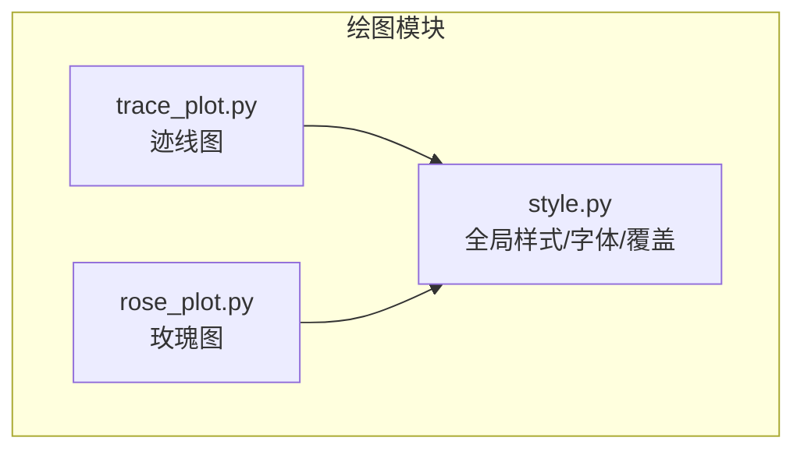
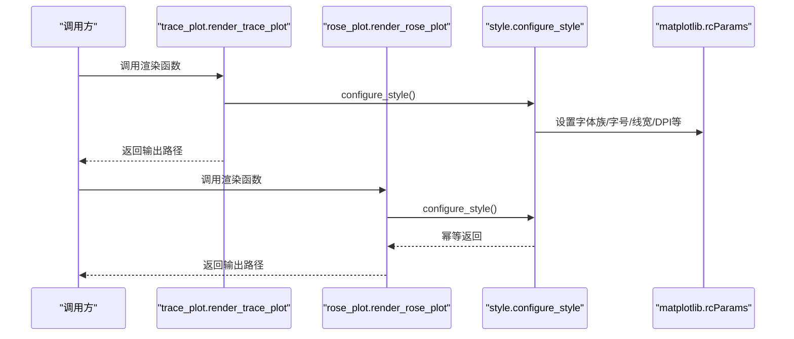
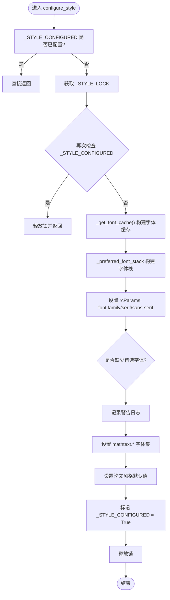
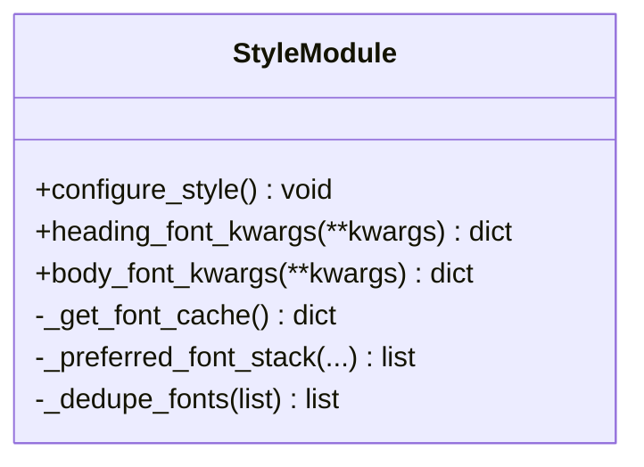
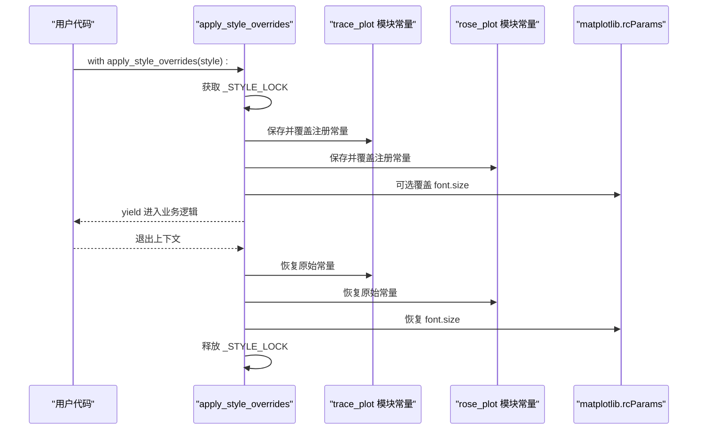
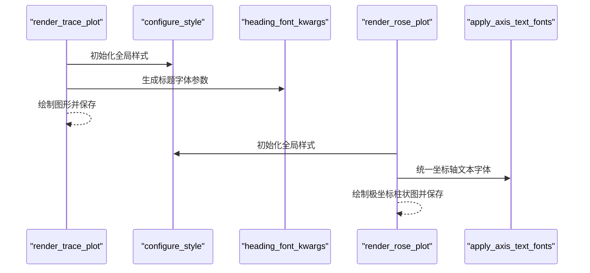
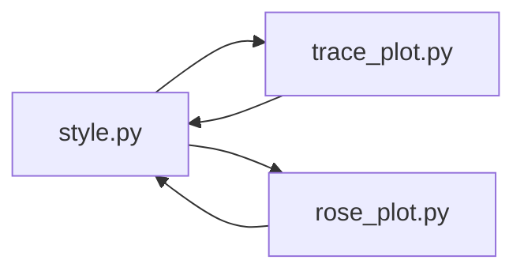

# 样式配置系统

<cite>
**本文引用的文件**   
- [style.py](file://trace_pipeline/plotting/style.py)
- [trace_plot.py](file://trace_pipeline/plotting/trace_plot.py)
- [rose_plot.py](file://trace_pipeline/plotting/rose_plot.py)
</cite>

## 目录
1. [简介](#简介)
2. [项目结构](#项目结构)
3. [核心组件](#核心组件)
4. [架构总览](#架构总览)
5. [详细组件分析](#详细组件分析)
6. [依赖关系分析](#依赖关系分析)
7. [性能与并发特性](#性能与并发特性)
8. [自定义示例与最佳实践](#自定义示例与最佳实践)
9. [故障排查指南](#故障排查指南)
10. [结论](#结论)

## 简介
本文件系统性地梳理了绘图模块的样式配置机制，重点围绕以下目标：
- 全局样式初始化 configure_style() 的工作流程、字体检测与回退策略、数学文本字体设置。
- heading_font_kwargs() 与 body_font_kwargs() 的字体参数生成逻辑。
- apply_style_overrides() 上下文管理器的线程安全覆盖机制。
- 完整的样式自定义示例（颜色主题、字体族、字号、线条宽度等）。
- 论文风格默认设置的原理与自定义方法。

该文档面向不同技术背景的读者，既提供高层概览，也包含代码级细节与可视化图示。

## 项目结构
样式配置相关代码集中在 plotting 子包中：
- style.py：全局样式与 CJK 字体配置、标题/正文字体参数生成、线程安全的样式覆盖上下文管理器。
- trace_plot.py：迹线长度图绘制，使用全局样式与标题字体参数。
- rose_plot.py：节理走向玫瑰花瓣图绘制，使用全局样式与坐标轴文本字体统一。

图表来源
- [style.py:1-296](file://trace_pipeline/plotting/style.py#L1-L296)
- [trace_plot.py:1-565](file://trace_pipeline/plotting/trace_plot.py#L1-L565)
- [rose_plot.py:1-140](file://trace_pipeline/plotting/rose_plot.py#L1-L140)

章节来源
- [style.py:1-296](file://trace_pipeline/plotting/style.py#L1-L296)
- [trace_plot.py:1-565](file://trace_pipeline/plotting/trace_plot.py#L1-L565)
- [rose_plot.py:1-140](file://trace_pipeline/plotting/rose_plot.py#L1-L140)

## 核心组件
- 全局样式配置器 configure_style()
  - 幂等执行，首次调用时扫描系统字体并设置 matplotlib.rcParams，后续直接返回。
  - 构建西文与 CJK 字体栈，设置 mathtext 字体集，应用论文常用全局参数（字号、线宽、DPI 等）。
- 字体参数生成器
  - heading_font_kwargs()：为标题生成 fontfamily 列表，优先 Times New Roman，中文回退黑体；避免对缺失字重请求 bold。
  - body_font_kwargs()：为正文生成 fontfamily 列表，优先 Times New Roman，中文回退宋体。
- 线程安全样式覆盖 apply_style_overrides()
  - 通过 RLock 保护，临时覆盖 trace_plot 与 rose_plot 模块级常量（颜色、线宽、透明度等），并在退出时自动恢复。
  - 支持 label_font_size/global_font_size 覆盖全局字号。

章节来源
- [style.py:187-256](file://trace_pipeline/plotting/style.py#L187-L256)
- [style.py:135-172](file://trace_pipeline/plotting/style.py#L135-L172)
- [style.py:258-296](file://trace_pipeline/plotting/style.py#L258-L296)

## 架构总览
下图展示了样式配置在渲染流程中的位置与交互关系。

图表来源
- [trace_plot.py:476-476](file://trace_pipeline/plotting/trace_plot.py#L476-L476)
- [rose_plot.py:120-120](file://trace_pipeline/plotting/rose_plot.py#L120-L120)
- [style.py:187-256](file://trace_pipeline/plotting/style.py#L187-L256)

## 详细组件分析

### 全局样式配置器 configure_style()
- 幂等性与线程安全
  - 使用模块级布尔标志 _STYLE_CONFIGURED 与 RLock 双重检查，确保多线程环境下仅配置一次。
- 字体检测与回退
  - 通过 _get_font_cache() 缓存系统可用字体，按优先级筛选常规字重（weight=400）的字体，若不存在则回退到同名字体的其他字重。
  - 构建三套候选集合：西文衬线、CJK 宋体、CJK 黑体/无衬线，并按顺序去重形成最终字体栈。
- 数学文本字体设置
  - 将 mathtext.fontset 设为 custom，并为 rm/it/bf/sf/cal/tt 指定同一西文字体族，默认使用 rm。
- 论文风格默认值
  - 设置 axes.linewidth、tick 尺寸与标签大小、lines.linewidth/markersize、figure/savefig DPI、负号显示、标题字重等。

图表来源
- [style.py:187-256](file://trace_pipeline/plotting/style.py#L187-L256)
- [style.py:82-100](file://trace_pipeline/plotting/style.py#L82-L100)
- [style.py:111-125](file://trace_pipeline/plotting/style.py#L111-L125)

章节来源
- [style.py:187-256](file://trace_pipeline/plotting/style.py#L187-L256)
- [style.py:82-100](file://trace_pipeline/plotting/style.py#L82-L100)
- [style.py:111-125](file://trace_pipeline/plotting/style.py#L111-L125)

### 字体参数生成：heading_font_kwargs() 与 body_font_kwargs()
- heading_font_kwargs()
  - 生成标题字体栈：Times New Roman 优先，其次 SimHei，再依次回退至可用的西文与 CJK 无衬线/宋体，最后以 sans-serif 兜底。
  - 为避免 CJK 字体缺失 bold 字重导致 findfont 噪声，当用户请求 bold/semibold/heavy/black 时，内部会将其替换为正常字重。
- body_font_kwargs()
  - 生成正文字体栈：Times New Roman 优先，其次 SimSun，再依次回退至可用的西文与 CJK 宋体/无衬线，最后以 serif 兜底。
  - 不强制修改字重，保持用户传入的字体粗细。

图表来源
- [style.py:135-172](file://trace_pipeline/plotting/style.py#L135-L172)
- [style.py:82-100](file://trace_pipeline/plotting/style.py#L82-L100)
- [style.py:111-125](file://trace_pipeline/plotting/style.py#L111-L125)

章节来源
- [style.py:135-172](file://trace_pipeline/plotting/style.py#L135-L172)

### 线程安全样式覆盖：apply_style_overrides()
- 作用范围
  - 仅处理 _STYLE_CONSTANTS 中注册的键，这些键映射到 trace_plot 与 rose_plot 模块级常量（如颜色、线宽、透明度等）。
- 线程安全
  - 使用 RLock 保护保存与覆盖过程，避免并发写入导致的竞态条件。
- 覆盖与恢复
  - 进入上下文时保存原始值，按需覆盖模块属性与全局字号（label_font_size/global_font_size）。
  - 退出上下文时自动恢复所有被覆盖的值，包括 rcParams 的 font.size。

图表来源
- [style.py:258-296](file://trace_pipeline/plotting/style.py#L258-L296)
- [style.py:22-35](file://trace_pipeline/plotting/style.py#L22-L35)

章节来源
- [style.py:258-296](file://trace_pipeline/plotting/style.py#L258-L296)
- [style.py:22-35](file://trace_pipeline/plotting/style.py#L22-L35)

### 渲染流程中的样式应用
- 迹线图 render_trace_plot
  - 首行调用 configure_style() 完成全局样式初始化。
  - 标题使用 heading_font_kwargs(fontsize, fontweight="bold") 生成字体参数。
- 玫瑰图 render_rose_plot
  - 同样调用 configure_style()。
  - 坐标轴刻度与网格标签通过 apply_axis_text_fonts(ax) 统一字体族。

图表来源
- [trace_plot.py:476-476](file://trace_pipeline/plotting/trace_plot.py#L476-L476)
- [trace_plot.py:562-562](file://trace_pipeline/plotting/trace_plot.py#L562-L562)
- [rose_plot.py:120-120](file://trace_pipeline/plotting/rose_plot.py#L120-L120)
- [rose_plot.py:72-72](file://trace_pipeline/plotting/rose_plot.py#L72-L72)
- [style.py:181-185](file://trace_pipeline/plotting/style.py#L181-L185)

章节来源
- [trace_plot.py:476-476](file://trace_pipeline/plotting/trace_plot.py#L476-L476)
- [trace_plot.py:562-562](file://trace_pipeline/plotting/trace_plot.py#L562-L562)
- [rose_plot.py:120-120](file://trace_pipeline/plotting/rose_plot.py#L120-L120)
- [rose_plot.py:72-72](file://trace_pipeline/plotting/rose_plot.py#L72-L72)
- [style.py:181-185](file://trace_pipeline/plotting/style.py#L181-L185)

## 依赖关系分析
- 模块耦合
  - trace_plot 与 rose_plot 均依赖 style 提供的 configure_style、heading_font_kwargs 与 apply_axis_text_fonts。
  - apply_style_overrides 通过惰性导入 trace_plot 与 rose_plot，避免循环依赖。
- 外部依赖
  - matplotlib 与 matplotlib.font_manager 用于全局样式与字体检测。
  - threading.RLock 用于线程安全。

图表来源
- [style.py:1-296](file://trace_pipeline/plotting/style.py#L1-L296)
- [trace_plot.py:1-565](file://trace_pipeline/plotting/trace_plot.py#L1-L565)
- [rose_plot.py:1-140](file://trace_pipeline/plotting/rose_plot.py#L1-L140)

章节来源
- [style.py:1-296](file://trace_pipeline/plotting/style.py#L1-L296)
- [trace_plot.py:1-565](file://trace_pipeline/plotting/trace_plot.py#L1-L565)
- [rose_plot.py:1-140](file://trace_pipeline/plotting/rose_plot.py#L1-L140)

## 性能与并发特性
- 字体缓存
  - _get_font_cache() 使用 lru_cache(maxsize=1)，仅在首次调用时扫描系统字体，后续复用结果，显著降低重复开销。
- 幂等配置
  - configure_style() 通过布尔标志与 RLock 实现幂等与线程安全，避免多次重复配置带来的性能损耗。
- 覆盖上下文
  - apply_style_overrides() 在 RLock 保护下批量保存与恢复模块常量，减少并发冲突风险。

章节来源
- [style.py:82-100](file://trace_pipeline/plotting/style.py#L82-L100)
- [style.py:187-256](file://trace_pipeline/plotting/style.py#L187-L256)
- [style.py:258-296](file://trace_pipeline/plotting/style.py#L258-L296)

## 自定义示例与最佳实践
以下为可直接使用的样式自定义方式（以字典形式传入 apply_style_overrides）：

- 颜色主题
  - 迹线颜色与线宽：trace_line_color、trace_line_width
  - 凸包边框与填充：hull_line_color、hull_fill_color、hull_fill_alpha
  - 圆窗边框与填充：circle_window_line_color、circle_window_fill_color、circle_window_fill_alpha
  - 玫瑰图配色：rose_bar_color、rose_bar_edge、rose_grid_color

- 字体与字号
  - 全局字号：label_font_size 或 global_font_size（向后兼容）
  - 标题与正文字体族由 heading_font_kwargs/body_font_kwargs 自动生成，无需手动指定 fontfamily。

- 线条与标记
  - 迹线与装饰元素线宽已在模块常量中定义，可通过 trace_line_width、hull_line_width、circle_window_line_width 等覆盖（若需要扩展，可在对应模块中添加新常量并通过 _STYLE_CONSTANTS 注册）。

- 使用示例（概念性说明）
  - 在渲染前后使用上下文管理器包裹，临时改变颜色主题与字号，退出后自动恢复。
  - 示例步骤：
    - 准备样式覆盖字典，包含上述键与期望值。
    - 使用 with apply_style_overrides(style_dict): 包裹渲染调用。
    - 在上下文中调用 render_trace_plot 或 render_rose_plot。
    - 退出上下文后，所有覆盖自动恢复。

注意：
- 仅 _STYLE_CONSTANTS 中注册的键会被覆盖；如需新增可覆盖项，请在 style.py 中注册新的键与模块属性映射。
- 字号覆盖会影响当前进程的全局字体大小，建议在最小必要范围内应用。

章节来源
- [style.py:22-35](file://trace_pipeline/plotting/style.py#L22-L35)
- [style.py:258-296](file://trace_pipeline/plotting/style.py#L258-L296)

## 故障排查指南
- 未检测到首选字体
  - 现象：日志中出现“未检测到 Times New Roman / SimSun”的警告。
  - 影响：英文/数字或中文将回退到可用字体，可能影响排版一致性。
  - 解决：安装所需字体或在系统中启用相应字体。
- 标题 bold 字重无效
  - 现象：标题仍为正常字重而非加粗。
  - 原因：CJK 字体通常缺少独立 bold face，为避免 findfont 反复回退噪声，内部会将 bold 请求替换为正常字重。
  - 建议：如需强调标题，可使用更大字号或调整布局，而非依赖 bold。
- 样式覆盖未生效
  - 现象：传入的样式键未产生效果。
  - 原因：未在 _STYLE_CONSTANTS 中注册该键。
  - 解决：在 style.py 中注册新键与对应的模块属性映射。
- 并发场景下的样式不一致
  - 现象：多线程渲染出现样式错乱。
  - 原因：未使用 apply_style_overrides 上下文管理器。
  - 解决：始终在 with apply_style_overrides(...) 中执行渲染，确保原子覆盖与恢复。

章节来源
- [style.py:216-219](file://trace_pipeline/plotting/style.py#L216-L219)
- [style.py:150-154](file://trace_pipeline/plotting/style.py#L150-L154)
- [style.py:258-296](file://trace_pipeline/plotting/style.py#L258-L296)

## 结论
本样式配置系统通过统一的字体检测与回退策略、严格的幂等与线程安全设计，以及灵活的上下文覆盖机制，为迹线图与玫瑰图的渲染提供了稳定一致的视觉风格。其论文风格默认设置兼顾可读性与出版规范，同时允许用户在最小侵入的前提下进行主题与字号定制。推荐在生产环境中遵循以下原则：
- 在应用启动时尽早调用 configure_style()，确保全局样式一致。
- 使用 apply_style_overrides() 进行局部样式覆盖，避免污染全局状态。
- 关注字体可用性，必要时安装 Times New Roman 与 SimSun/SimHei 以获得最佳效果。